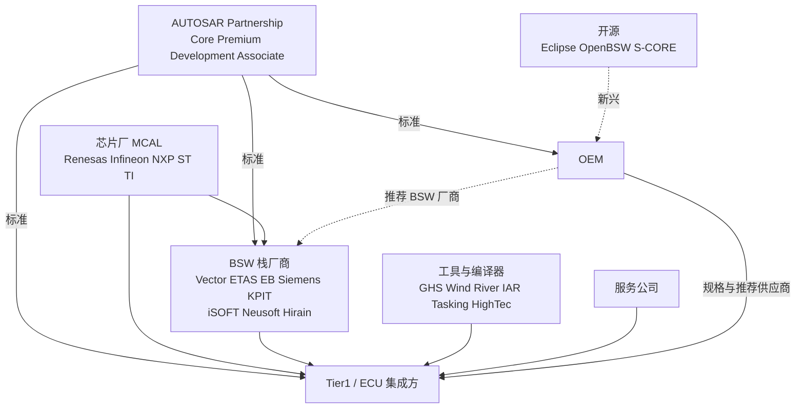

# 01 Classic AUTOSAR 产业生态全景：谁是谁

> 本报告回答的问题：Classic AUTOSAR 生态里有哪些参与方（标准组织、BSW 栈厂商、MCAL/芯片厂、工具厂商、服务公司、中国厂商）？它们之间的所有权/合作关系如何？SDV、Adaptive、OEM 自研、开源正在如何改变格局？
> 调研日期：2026-10（编辑复核同月，逐条结果见 docs/reference/research/10-industry-review-log.md；403 或抓取失败的页面在文中已标注"仅搜索摘要"）
> 主要来源：autosar.org、各厂商官网与新闻稿、Renesas 官网、Eclipse 基金会项目页、S&P Global Mobility(autotechinsight)、Gasgoo 等公开资料
> 前置阅读：[11 / 02 谁做什么：方法论角色、供应链与交付物](../11-classic-autosar-primer/02-who-builds-what.md)（已涵盖 METH 角色与 OEM/Tier1/栈厂商/芯片厂的典型分工，本文不重复，只补"具体是哪些公司"和"产业格局"）

**标注约定**：`[事实/有来源]` 有公开出处；`[行业惯例/多来源一致]` 多个来源口径一致但无单一权威出处；`[推断]` 作者推断。未给出数字的地方表示"公开资料未给出"，本文不编造市场份额或价格。所有来源访问日期均为 2026-10。

---

## 1. AUTOSAR 合作伙伴体系（Partnership）

### 1.1 层级与公开条件

`[事实/有来源]` AUTOSAR 官网把伙伴分为 Core Partner、Premium Partner（含 Premium Partner Plus）、Development Partner、Associate Partner 等层级；官网 /about/partners 称 "worldwide network of 350+ partners"。公开年费与人力贡献（FTE）如下；**编辑复核时已用 curl 直接打开 autosar.org/about/partners 页面核对，数值与官网表格一致**，但金额可能变动，使用前仍以官网当前页面为准：

| 层级 | 定位（官网措辞概括） | 公开年费 / 贡献（摘要值） |
|---|---|---|
| Core Partner | 董事会层，决定整体战略与路线图 | 公开资料未给出（官网表格未列） |
| Premium Partner Plus | 推动技术标准化 | 90,000 EUR/年 + 5 FTE + 1 FTE 项目负责人 |
| Premium Partner | 设计并使用标准 | 31,000 EUR/年 + 1.5 FTE |
| Development Partner | 小于 100 人的公司，设计并使用标准 | 10,000 EUR/年 + 0.5 FTE |
| Associate Partner | 只使用标准 | 21,000 EUR/年，无贡献要求 |

（注：官网表格脚注称 Premium/Development Partner 可用补偿费代替所需 FTE；Development Partner 面向少于 100 人的公司。另有 Associate Partner [Light]、Attendee、Subscriber（3,000 EUR）等更低层级，本文不展开。）

### 1.2 Core Partner 的构成与变化

- `[事实/有来源]` 官网 Core Partner 页：AUTOSAR 于 2003 年 7 月由 BMW、Bosch、Continental、Mercedes-Benz（原 Daimler-Benz / DaimlerChrysler）、Siemens VDO、Volkswagen 创立；2003 年 12 月 Toyota 加入为 Core Partner，次年 11 月 GM 加入。**复核更正**：先前写的"Ford 2003-11、PSA 加入"在官网该页没有，属未经核实的二手说法，已删除。该页现列的 Core Partner 为 AUMOVIO（原 Continental）、BMW、DENSO、General Motors、Huawei、Mercedes-Benz、Robert Bosch、TMC（Toyota）、Vector Informatik、Volkswagen 共 10 家。
- `[事实/有来源]` AUTOSAR 官方新闻 "Welcome our three new Core Partners"：**DENSO、Huawei、Vector Informatik** 成为新的 Core Partner（新闻页日期 2026-01-15；官网 Core Partner 页同样写 "In January 2026"）。
- `[推断]` 这说明 Core Partner 已从"OEM + 两大 Tier1"扩展到"大 Tier1 + 软件栈厂商 + 中国科技公司"，反映软件供应商与中国参与者话语权上升。

### 1.3 区域分布与中国

- `[推断/未复核]` 先前写的"北美 41、欧洲 140、亚洲 174、非洲 5"在 /about/partners 页面（curl 抓取）未找到，已降级为未确认，不应引用。
- `[事实/有来源]` AUTOSAR 官网设有 Regional Hubs（China Hub、North America Hub、Japan Hub），"Chat Episode 4" 页称中国专家参与"从使用者转为贡献者"。**"2022 年设立 China Center"在所引页面未找到**，降级为 `[公开资料未确认]`。

### 来源
- [AUTOSAR Partners](https://www.autosar.org/about/partners)（访问 2026-10；费用表、350+ 已核对）
- [Core Partner](https://www.autosar.org/about/partners/core-partner) / [Premium Partner Plus](https://www.autosar.org/about/partners/core-partner/premium-partner-plus) / [Premium Partner](https://autosar.org/about/partners/premium-partner)（访问 2026-10；Premium Partner 页列有 Elektrobit、ETAS、Infineon、iSOFT、Neusoft 等）
- [Welcome our three new Core Partners](https://www.autosar.org/news-events/detail/welcome-our-three-new-core-partners)（访问 2026-10）
- [AUTOSAR Chat Episode 4（中国专家）](https://www.autosar.org/news-events/detail/autosar-chat-episode-4-impressions-towards-autosar-working-groups-from-chinese-experts)（访问 2026-10）

---

## 2. BSW 栈厂商

### 2.1 国际主流三家 + Siemens + 印度/其他

| 厂商 | Classic 产品 | 所有权/背景 | 状态 |
|---|---|---|---|
| **Vector Informatik** | MICROSAR Classic（BSW）+ DaVinci（配置/RTE 工具） | 独立公司：2011 年创始股东把股份转入一个家族基金会和一个非营利基金会（Wikipedia 页只写到这一层）；"Vector Foundation 60%、Family Foundation 40%"来自搜索摘要，"94% 表决权"未能复核 | `[事实/有来源]`（基金会持股结构）；持股比例 `[推断/未复核]`；2026-01 起为 AUTOSAR Core Partner |
| **ETAS** | RTA-CAR（ISOLAR-A/B + RTA-BSW + RTA-OS + RTA-RTE；组件口径见 [04](04-rta-car-workflow.md) §1） | **Robert Bosch GmbH 全资子公司**（MarkLines 2026-02 报道称"Robert Bosch の100%子会社 ETAS GmbH"；"1994 成立"未复核） | `[事实/有来源]` |
| **Elektrobit (EB)** | EB tresos AutoCore / tresos Studio / OsekCore | 2015 年 Continental 以 6 亿欧元现金收购 EB Automotive（Elektrobit 2015-05-19 新闻稿已复核；预计 2015 年 7 月初交割） | `[事实/有来源]`（收购）；Continental 的汽车板块已于 2025-09-18 以 AUMOVIO 之名独立上市（Continental 官网分拆页已复核）；AUTOSAR 官网把 Core Partner 写作 "AUMOVIO (formerly Continental)"。分拆后 EB 的归属，本次只在搜索摘要看到"仍属 Continental（截至 2026 年初）"，**未取得 Continental/EB 官方原文，请自行核对** |
| **Siemens (原 Mentor)** | Capital VSTAR（BSW）+ VSTAR Integrator + Capital Software Designer | Mentor 2005 年收购 Volcano；2014 年收购 Mecel 的 AUTOSAR IP；Siemens 2017 年完成对 Mentor 收购 | `[事实/有来源]` |
| **KPIT** | K-SAR（K-SAR Editor + BSW，覆盖 R2.x/3.x/4.x） | 印度公司；历史上与 NEC 等合作 | `[事实/有来源]`（产品）；当前 Classic 产品是否仍主推，公开资料未给出 |

细节与证据：

- **ETAS RTA-CAR**：ETAS 官网称 RTA-CAR 满足 ISO 26262 ASIL-D 与 ISO 21434/UN-R155、"最多降低 50% ECU 内存"；Macnica 页称 RTA-BSW 可用于最高 ASIL-D 项目、RTA-RTE 为 ISO 26262 (ASIL-D) 认证 `[事实/有来源，厂商自述]`。"TÜV SÜD 审查 RTA-BSW"在 ETAS/Macnica/Tasking 页面均**未找到**，已降级为 `[推断/未复核]`。"RTA 操作系统与 RTE 已用于超过 10 亿个 ECU"出自 ETAS 2014 年新闻稿（ElectronicSpecifier 转载，"more than one billion ECUs"），为厂商自述的 2014 年数字，未经独立核实。
- **Vector MICROSAR Classic**：官网称"生产级 AUTOSAR Classic 平台，OEM 与 Tier1 在全球使用"，"ISO 26262 up to ASIL D"，提供"generic or customer-specific configurations"，并含 OEM 专有模块与项目扩展 `[事实/有来源，厂商自述]`。
- **Renesas 与三家的关系**：当前 Renesas AUTOSAR 页面（2026-10 复核）只写 "close cooperation with all major 3rd party AUTOSAR partners" 而未点名；并称 Renesas 自 2004 年 7 月起为 AUTOSAR Premium 成员 `[事实/有来源]`。"历史版本曾点名 EB、Vector、ETAS"无法复核，`[推断/未复核]`。
- **市场份额**：公开资料未给出可靠的各厂商 Classic BSW 份额数字（有付费市场报告，本次未引用其数字）。

### 2.2 中国厂商

| 厂商 | 产品 | 公开可核实事实 |
|---|---|---|
| **普华基础软件 (iSOFT)** | ORIENTAIS Classic / Adaptive | 2008 年成立；称自己是首家获得 AUTOSAR Premium Partner 的中国基础软件公司，获 TÜV Rheinland ISO 26262 ASIL D 产品认证；曾在 AUTOSAR 官网发布 Classic 平台成功案例，并因向 AUTOSAR CAPI 基线贡献代码被 AUTOSAR 官方认可 `[事实/有来源，厂商/媒体自述]` |
| **东软睿驰 (Neusoft Reach)** | NeuSAR（NeuSAR 4.0 为 Classic，面向多核、安全与信息安全） | ST 官网合作伙伴页列出 NeuSAR 支持 SPC5 / Stellar（未能原页复核）；与 IAR 合作 AUTOSAR + RISC-V 工具链；是 AUTOSEMO 联合发起方之一 `[事实/有来源]`。**是否支持 RH850：本次未检索到公开证据** |
| **经纬恒润 (Hirain)** | INTEWORK-EAS（工具链 + 嵌入式标准软件） | 先楫半导体 2024-05-14 联合新闻稿（复核）称 INTEWORK-EAS 兼容 DBC、LDF、PDX、ODX、ARXML 等格式，支持与第三方 MCAL 工具链集成，并将适配 HPM6200（RISC-V）；与晶心、先楫三方合作 `[事实/有来源，厂商新闻稿]` |
| **华为** | 车控方向的软件与工具链 | 2026 年 1 月成为 AUTOSAR Core Partner；其"车控模块方案"含操作系统与工具链（Gasgoo 报道）。**其 Classic BSW 的具体产品名与对外供货方式，公开资料未给出** |

`[行业惯例/多来源一致]` Gasgoo / ResearchAndMarkets 一类报道称国内供应商（东软睿驰、华为、经纬恒润等）都在 Classic AUTOSAR 标准下开发工具链与基础软件；这些二手报道不含可核实的份额数据，本文不引用数字。

### 来源
- [Vector Foundation 持股结构（Wikipedia: Vector Informatik）](https://en.wikipedia.org/wiki/Vector_Informatik)、[computer-automation.de：Vector Informatik wird zur Stiftung](https://www.computer-automation.de/vernetzung/vector-informatik-wird-zur-stiftung.htm)（访问 2026-10）
- [Vector MICROSAR Classic](https://www.vector.com/microsar-classic)（访问 2026-10）
- [ETAS RTA 产品页（经 ST 合作伙伴页，复核时抓取超时，仅搜索摘要）](https://www.st.com/content/st_com/en/partner/partner-program/partnerpage/ETAS.html)、[Tasking-ETAS 合作页](https://www.tasking.com/content/partner/etas/)、[Macnica：ETAS RTA-CAR](https://www.macnica.co.jp/en/business/semiconductor/manufacturers/etas/products/144617/)（访问 2026-10，后两者已复核）
- [Bosch Basic Data 2026（ETAS 隶属 Bosch）](https://www.bosch.co.jp/publications/basic-data/2026-basic-data-en-01.pdf)（访问 2026-10）
- [Continental closes acquisition of Elektrobit Automotive（复核时 403，仅搜索摘要）](https://www.automotiveworld.com/news/continental-closes-acquisition-elektrobit-automotive/)、[Elektrobit 2015 新闻稿 (GlobeNewswire，经 WebFetch 复核)](https://www.globenewswire.com/news-release/2015/05/19/736978/0/en/Elektrobit-Corporation-EB-sells-its-Automotive-business-to-Continental-AG-for-a-purchase-price-of-EUR-600-million-cancels-the-demerger-process-and-updates-the-Outlook-for-the-year-.html)（访问 2026-10）
- [Continental 分拆 Aumovio 公告](https://www.continental.com/en/investors/events/spin-off-automotive)（访问 2026-10）
- [Siemens AUTOSAR short history](https://blogs.sw.siemens.com/ee-systems/2020/06/19/siemens-autosar-short-history/)、[Siemens Capital VSTAR Fact Sheet](https://www.plm.automation.siemens.com/media/global/en/Siemens-SW-Capital-VSTAR-Fact-Sheet_tcm27-93844.pdf)（访问 2026-10）
- [Renesas AUTOSAR 页面](https://www.renesas.com/cn/en/application/automotive/autosar)（访问 2026-10）
- [KPIT K-SAR（MathWorks 连接页）](https://au.mathworks.com/products/connections/product_detail/product_38051.html)（访问 2026-10；复核时 403，仅搜索摘要）
- [iSOFT/AUTOSAR 成功案例](https://www.autosar.org/news-events/detail/success-story-by-isoft-smart-lighting-solution-powered-by-isoft-orientaisr-classic-autosar-platform)、[Gasgoo：iSOFT 贡献 CAPI baseline](https://autonews.gasgoo.com/articles/other/isoft-infrastructure-software-becomes-first-chinese-company-to-contribute-autosar-capi-baseline-2066443629424656385)（访问 2026-10）
- [ST：NeuSAR 4.0（复核时抓取超时，仅搜索摘要）](https://www.st.com/en/partner-products-and-services/neusar-4-0.html)、[IAR 与东软睿驰合作](https://autotechinsight.spglobal.com/news/5290256/iar-neusoft-reach-collaborate-to-advance-autosar-and-risc-v-automotive-toolchain)（访问 2026-10）
- [经纬恒润/晶心/先楫 RISC-V AUTOSAR](https://hpmicro.com/about-oar/news/company-news/111)（访问 2026-10）
- [Gasgoo：Huawei 与 PATEO 车控模块（复核时 403，仅搜索摘要）](https://autonews.gasgoo.com/articles/icv/huawei-pateo-partner-on-smart-vehicle-control-modules-to-advance-sdv-ecosystem-70037336)（访问 2026-10）

---

## 3. MCAL 厂商

`[行业惯例/多来源一致]` MCAL 与 MCU 寄存器强相关，通常由芯片厂交付（总览见 [11/02 §4.4](../11-classic-autosar-primer/02-who-builds-what.md)）。补充公开证据：

- **Renesas**：官网称提供"production ready MCAL"，覆盖 AUTOSAR 3.x/4.x 平台，且面向 Safety MCU 的 MCAL 开发过程符合 ISO 26262 `[事实/有来源，2026-10 复核]`。该页的 "AUTOSAR Support Device List" 把 RH850/F1K、F1KM、F1KH、E2M、C1M-A 等列在 AUTOSAR 4.2.2，把 RH850/P1M 等列在 4.0.3；对更新 Release 的支持范围，本页未给出（另见 03 §2.1：IAR 新闻称 RH850/U2A MCAL 基于 R22-11），需查具体 MCU 的 MCAL 发布说明。
- **Infineon / NXP / ST / TI**：均有 AUTOSAR MCAL 产品线 `[行业惯例/多来源一致]`；本次只通过 TI/ST 官网合作伙伴页间接看到它们与 Vector、ETAS、EB、东软睿驰等的合作列表（如 [TI：Vector](https://ti.com/partner/ja-jp/VCTR)、[ST：ETAS](https://www.st.com/content/st_com/en/partner/partner-program/partnerpage/ETAS.html)），未逐家核实各家 MCAL 条款，**不展开**。
- **第三方 MCAL / 支持服务**：Renesas 官网托管有 Tata Elxsi 的 "MCAL support activities RH850/F1KX (2020)" 文档，说明存在第三方服务公司围绕 Renesas MCAL 做支持 `[事实/有来源]`；本次抓取到的 PDF 为二进制无法解析，只能确认存在此文档，具体服务范围未核实。

### 来源
- [Renesas AUTOSAR](https://www.renesas.com/cn/en/application/automotive/autosar)（访问 2026-10）
- [Renesas：Tata Elxsi MCAL support activities RH850/F1KX 2020](https://www.renesas.com/document/fly/tata-elxsi-mcal-support-activities-rh850f1kx-2020?r=1494641)（访问 2026-10）
- [TI Partner：Vector](https://ti.com/partner/ja-jp/VCTR)、[ST Partner：ETAS](https://www.st.com/content/st_com/en/partner/partner-program/partnerpage/ETAS.html)（访问 2026-10）

---

## 4. 工具厂商与服务公司

### 4.1 编译器（RH850 相关）
- `[事实/有来源]` Green Hills 官网有 RH850 开发页面（MULTI + 优化编译器，使用 V850/RH850 共用代码生成器）。Renesas 也托管 Green Hills MULTI 设备支持包页面。
- `[事实/有来源]` 另有 Wind River Diab、Renesas CC-RH/CS+ 等；AbsInt 的 aiT/StackAnalyzer 目标列表显示 RH850 与多家编译器组合受支持。HighTec、TASKING、IAR 在 RH850 的支持范围，本次未逐一核实（IAR 与 Vector、Siemens、Neusoft Reach 等有合作页）。
- 对项目的含义：**编译器版本是 BSW 栈厂商认证/测试的一个维度**——Vector 称其可按"derivatives、compilers 与 BSW 模块的组合"提供定制交付（见 MICROSAR Classic 页）`[事实/有来源]`。

### 4.2 配置/生成工具
- 通常与栈绑定：Vector DaVinci、ETAS RTA-CAR 工具（含 RTA-RTE）、EB tresos Studio、Siemens Capital VSTAR Integrator、经纬恒润 INTEWORK-EAS 等 `[事实/有来源]`。

### 4.3 测试/标定/总线工具
- CANoe、CANape（Vector），INCA（ETAS）是业界常见工具 `[行业惯例/多来源一致]`；本次未取得各自市场份额，公开资料未给出。

### 4.4 服务公司
- KPIT、Tata Elxsi（含 AUTOSAR 服务页）、FPT Software、Embitel、Infopulse 等公司公开宣传 AUTOSAR 集成/迁移/MCAL 支持服务 `[事实/有来源，厂商自述]`。

### 来源
- [Green Hills RH850 开发](https://ghs.com/products/RH850_development.html)、[Renesas：Green Hills MULTI 设备支持包](https://www.renesas.com/us/en/software-tool/green-hills-multi-device-support-packages)（访问 2026-10）
- [AbsInt aiT 目标列表](https://www.AbsInt.com/ait/targets.htm)（访问 2026-10）
- [IAR：Vector 合作](https://iar.com/about/partners/vector)、[IAR：Siemens EDA](https://www.iar.com/about/partners/mentor-graphicssiemens-eda)（访问 2026-10）
- [Tata Elxsi AUTOSAR services](https://tataelxsi.com/industries/automotive/automotive-software-engineering/autosar-services)、[FPT Software](https://fptsoftware.com/services/product-engineering-services/automotive-services)（访问 2026-10）

---

## 5. 生态关系图

所有权关系：Bosch 持有 ETAS 100%；Continental 持有 EB（2015 起）；Siemens 持有 Capital（经 Mentor）；Vector 为基金会持股的独立公司（见 §2）。

---

## 6. 格局变化：SDV、Adaptive、OEM 自研、开源

### 6.1 OEM 自研软件部门
- `[事实/有来源，媒体]` trendingtopics 报道：CARIAD 负责开发 VW.OS，并称其是现有系统之上的"bracket"；CARIAD 2022-06-22 新闻页称其加入 Eclipse 基金会 SDV 工作组并将开源 VW.OS/VW.AC 的部分组件。"VW.os 是 system of systems、含自研与合作伙伴方案"原引自 Volkswagen Group Italia 页，该页复核时返回 404，**降级为未复核**。
- `[事实/有来源，仅搜索摘要]` Mercedes-Benz 称 MB.OS "in-house" 设计开发，面向 chip-to-cloud，覆盖信息娱乐、自动驾驶、车身舒适、驾驶与充电（Business Wire/Design News 页面复核时分别抓取失败/403，未能原页核对）。
- `[推断]` 这些平台主要集中在中央计算/域控层；传统 MCU 的 Classic ECU（车身、底盘、动力）仍大量存在，其与 Classic AUTOSAR 的关系是"继续使用 + 被新平台编排"，本次未找到 OEM 公开声明停止使用 Classic。

### 6.2 开源：OpenBSW 与 S-CORE（已核实）
- **Eclipse OpenBSW**：Eclipse SDV 下的项目，"面向微控制器的嵌入式 C++ BSW 栈"，Apache 2.0；GitHub 说明支持 POSIX、S32K148、STM32 目标，提供 CAN、DoCAN、UDS、生命周期、简易 OS 抽象（FreeRTOS 实现）等（复核：README 能力表可见 UDS/DoCAN，S32K148 构建目标可见；STM32 字样本次未复核） `[事实/有来源]`。Eclipse 提案页（复核）列项目负责人 Matthias Kessler 与 Martin Thiede，初始贡献版权归 Accenture；邮件列表称早期代码大量由 Alexander Schaal 编写或影响，并说他长期任职 Accenture `[事实/有来源]`。（先前"提案由 Accenture 的 Martin Thiede 提出"：Thiede 的雇主在复核页面中未出现，已改为上述可核对表述。）GitHub README 没有提 AUTOSAR；它是**代码优先的替代方案**，不是 AUTOSAR 兼容栈 `[事实/有来源]`。不支持 RH850（公开 README 未列）。
- **Eclipse S-CORE**：2024 年底启动，EPDT 报道称由 BMW、Mercedes-Benz、Bosch、QNX、Accenture、ETAS、Qorix 等支持（"发起方"的精确名单未复核）；面向"嵌入式高性能 ECU"，第一版 v0.5 含应用编排、IPC、日志与持久化，参考平台 OS 为 QNX SDP 8.0；开发流程正在由认证机构审计，目标 ISO 26262 `[事实/有来源]`。ETAS 宣布将在 2026 年 6 月 Bosch Connected World 展示"基于 S-CORE 的 Vehicle Software Platform Suite" `[事实/有来源]`。
- 2026-01-06：Eclipse 基金会与 VDA 扩大合作（VDA 新闻稿，Berlin 2026-01-06；URL 中的 260107 为发布编号日期）`[事实/有来源]`。

### 6.3 Adaptive 与 Classic 并存
- `[事实/有来源]` AUTOSAR 同时发布 CP 与 AP，R25-11 于 2025-11-27 发布，取代 R24-11（2024-11-27），含 "DDS Support on CP""Rust in CP Outlook"等主题（R25-11 Release Overview 与发布事件页）。
- `[推断]` 标准层面并未宣布 Classic 退场；而是新增与 SDV 接轨的内容。

### 6.4 OEM 对 BSW 厂商的"推荐/认可"（预告 doc 02）
- Toyota 于 2016-11-30 认可 Mentor Volcano VSTAR 栈，2017-05-18 选 Vector 为推荐的 AUTOSAR 4 BSW 厂商；Nissan 与 EB 提供预集成 Nissan 扩展模块的 BSW 启动包。详见 [02 篇](02-oem-tier1-vendor-cooperation-models.md)。

### 来源
- VW.os（Volkswagen Group Italia 页，2026-10 复核返回 404，链接已移除）、[CARIAD：开源与 Eclipse](https://cariad.technology/de/en/news/stories/open-source-eclipse-foundation.html)、[trendingtopics：CARIAD 自研 OS](https://trendingtopics.eu/cariad-volkswagen-to-use-own-operating-system-for-future-cars)（访问 2026-10）
- [Mercedes-Benz：MB.OS（Business Wire 2023-02，抓取失败，仅搜索摘要）](https://www.businesswire.com/news/home/20230222005724/en)、[Mobility Engineering：Architecting its own OS](https://www.mobilityengineeringtech.com/component/content/article/47724-sae-ma-07096)（访问 2026-10）
- [Eclipse OpenBSW 项目页](https://projects.eclipse.org/projects/automotive.openbsw)、[OpenBSW GitHub](https://github.com/eclipse-openbsw/openbsw)、[Eclipse 提案页](https://projects.eclipse.org/node/30204)、[邮件列表](https://www.eclipse.org/lists/openbsw-dev/msg00017.html)、[ESR Labs Medium](https://medium.com/@ESRLabs/openbsw-a-code-first-software-platform-for-automotive-microcontrollers-609d3406cf0d)（访问 2026-10）
- [Eclipse S-CORE 新闻（EPDT）](https://www.epdtonthenet.net/article/216148/Eclipse-Foundation-Embarks-on-S-CORE-Open-Source-Project-for-SDVs.aspx)、[QNX 与 S-CORE](https://www.automotiveworld.com/news/qnx-to-serve-as-foundational-operating-system-for-eclipse-safe-open-vehicle-core-s-core-project/)、[VDA 新闻稿 2026-01-07](https://www.vda.de/de/presse/Pressemeldungen/2026/260107_PM_Innovation-im-Automotive-Sektor-durch-offene-Zusammenarbeit)、[Bosch 子公司 ETAS 与 S-CORE（it-daily/MarkLines 摘要）](https://www.marklines.com/ja/news/340217)（访问 2026-10）
- [AUTOSAR CP Release Overview R25-11](https://www.autosar.org/fileadmin/standards/R25-11/CP/AUTOSAR_CP_TR_ReleaseOverview.pdf)、[Release Event R25-11](https://www.autosar.org/news-events/release-event)（访问 2026-10）

---

## 结论要点

1. AUTOSAR 伙伴分层公开：Core / Premium(+) / Development / Associate；2026-01 起 DENSO、Huawei、Vector 加入 Core。
2. Classic BSW 国际主流：Vector MICROSAR、ETAS RTA-CAR、EB tresos AutoCore、Siemens Capital VSTAR（另有 KPIT K-SAR）；中国有 iSOFT ORIENTAIS、东软睿驰 NeuSAR、经纬恒润 INTEWORK-EAS 等。
3. 所有权：ETAS=Bosch 全资；EB=Continental 2015 年收购（Aumovio 分拆后的归属需自行核实）；Vector=基金会持股独立；Siemens=Mentor 2017。
4. MCAL 通常出自芯片厂（Renesas 为 RH850 提供，并称开发流程符合 ISO 26262），第三方服务公司围绕其做支持。
5. RH850 的编译器生态包括 Green Hills、Wind River Diab、Renesas CC-RH 等；编译器版本是 BSW 交付的组合维度。
6. 变化：OEM 自研平台（VW.os、MB.OS）、Eclipse 开源（OpenBSW 由 Accenture 提案，S-CORE 由 Accenture/BMW/ETAS/Mercedes/Qorix 发起）、Classic 与 Adaptive 同期发布（R25-11）。开源项目当前不是 RH850 + AUTOSAR 商用栈的替代品。
7. 没有公开可靠的厂商市场份额数据；本文不提供。

## 对你的意义（对未来 RTA-CAR + RH850 + DCM 工作）

- 你的栈 ETAS RTA-CAR 属于 Bosch 体系；支持渠道是 ETAS（栈、RTA-OS/RTE/工具），MCAL 来自 Renesas（或经其合作渠道的第三方），编译器可能是 GHS/Diab/Renesas 之一。**升级 DCM 时要把"RTA-CAR 版本 + MCAL 版本 + 编译器版本 + 配置工具版本"当作一个组合**去对齐，这和 Vector 公开强调的"derivatives + compilers + 模块组合"逻辑一致。
- ETAS 官网公开宣称 RTA-CAR 满足 ASIL-D（厂商自述；"TÜV SÜD 评审"未能复核）；若你的 ECU 有 ASIL 要求，升级 DCM 需确认新版本的 safety manual 与认证范围（以 ETAS 交付文档为准，不要用本文替代）。
- 了解 OEM 可能指定或推荐 BSW 厂商（见 02 篇），因此你的项目选择 RTA-CAR 有可能是 OEM/客户约束，而不仅是技术选择。
- 开源与 SDV 动向（OpenBSW、S-CORE）短期不会改变 RH850 上的 Classic 工作，但 ETAS 本身也参与 S-CORE，值得跟踪。
- 不要对 iSOFT/NeuSAR/INTEWORK 是否支持 RH850 做假设，本次没有公开证据。

## 本报告无法核实的内容（汇总）
- AUTOSAR Core Partner 年费；Premium/Dev/Associate 数值仅来自搜索摘要。
- EB 在 Aumovio 分拆之后的最新所有权声明（需 Continental 官方文件）。
- 各厂商市场份额与价格：公开资料未给出。
- 东软睿驰、经纬恒润、iSOFT 对 RH850 的支持；华为 Classic BSW 的具体产品形态。
- Infineon/NXP/ST/TI 各自 MCAL 的条款。
