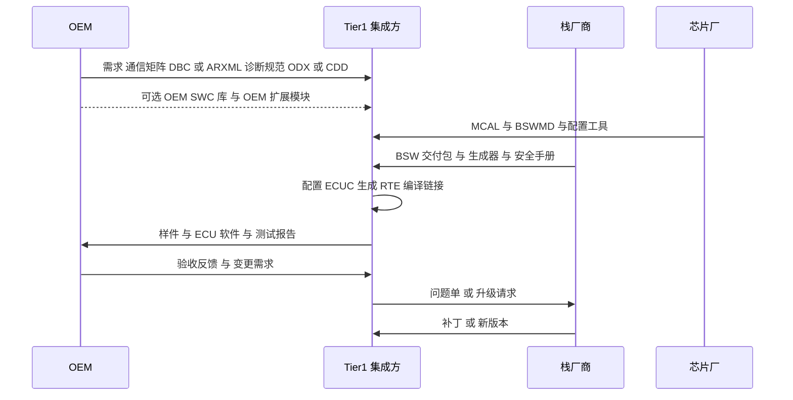
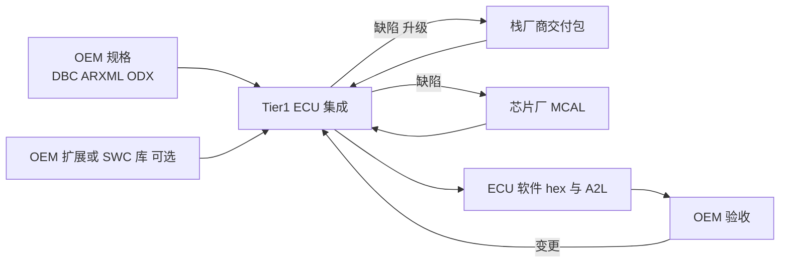

# 02 OEM / Tier1 / 栈厂商的合作模式、授权与生命周期归属

> 本报告回答的问题：现实中 OEM、Tier1、BSW 栈厂商、芯片厂之间有哪几种合作模式？OEM 指定/推荐 BSW 栈有没有公开案例？OEM 自带 SWC 怎么集成？授权与商业模式公开层面能说什么？生命周期里谁负责 bug 修复、BSW 更新、AUTOSAR 版本升级（与 DCM 升级的关系）？交付与交接点在哪里？
> 调研日期：2026-10（编辑复核同月，逐条结果见 docs/reference/research/10-industry-review-log.md）
> 主要来源：Vector / Elektrobit / Siemens 官网与案例页、S&P Global Mobility(autotechinsight)、VW / Mercedes-Benz 官方发布、Gasgoo、AUTOSAR 官方文档
> 前置阅读：[11 / 02 谁做什么](../11-classic-autosar-primer/02-who-builds-what.md)（已定义 METH 角色，以及"模式 A/B/C"与 RACI；本文不重复，只补公开案例、商业与生命周期）；同系列：[01 产业全景](01-autosar-industry-landscape.md)

**标注约定**：`[事实/有来源]` / `[行业惯例/多来源一致]` / `[推断]`。公开资料未给出的数字（价格、版税率、份额）一律写"公开资料未给出"。所有来源访问日期均为 2026-10。

---

> **与 11/02 §6.2 的模式对应**：本文 (a) = 11/02 的模式 A；(c) = 11/02 的模式 B（OEM 提供 SWC）；(d) = 11/02 的模式 C（OEM 自研 ECU/平台）；(b)（OEM 指定/推荐栈）和 (e)（供应商交付与商业模式）是本文补充的产业维度，不是 11/02 的新角色，与其 METH 角色划分（ECU Integrator 配置 MCAL、BSWMD 由栈厂商/芯片厂交付）不冲突。

## 1. 模式 (a)：经典分工，OEM 出规格，Tier1 在自选栈上实现

[11/02 §6.2 模式 A](../11-classic-autosar-primer/02-who-builds-what.md) 已给出角色对应；这里补**公开证据与 OEM 间差异**。

- `[事实/有来源]` Vector 的 OEM 说明页明确：BSW "并不一定 OEM 专属"，但各 OEM 的栈在**特定 BSW 模块**上通常不同，列举的差异区域包括：DIAG（Dem/Dcm）、SYS（通信通道处理）、COM（网络管理、网关）以及加密与私有传输协议等非标准服务。
- `[事实/有来源]` 同一页指出 **OEM 交付需求的方式本身也各不相同**：通信数据用 `.dbc`、System Description 的 ECU Extract 或独立 SWC 描述；诊断布局/参数用 ODX、CANdela 等；还有通信栈的 post-build 配置能力、给供应商的库交付方式等差异。
- `[事实/有来源]` Siemens 的 "How standard is a standard" 博客（2026-10 复核）：每个 OEM 通常需要定制或扩展标准，AUTOSAR 允许通过 **CDD（Complex Device Driver）** 接入；OEM 自 4.0 起大量采用，博客称"许多 OEM 用 4.0、少数用 4.1、更多用 4.2，且不少 OEM 长期停留在 4.0 基线"，4.3 被不少 OEM 视为"一代大步"（含更完整的以太网与信息安全扩展）。（先前写的"4.0→4.1→4.2→4.3 逐步迁移"过度简化，已按原文修正；博客中"常见定制区域"的具体列表本次未逐字核对，该列表以 Vector 页面的 DIAG/SYS/COM 清单为准。）
- `[事实/有来源]` Vector 称可向"所有 OEM 与 ECU 供应商"提供**定制化的诊断相关 BSW 模块**，并有 MICROSAR OEM Package（MOP）收纳 OEM 相关模块；官网称 MICROSAR Classic 有"generic or customer-specific configurations"。

**对 DCM 的含义** `[推断]`：Dcm 是 OEM 差异化最强的模块之一（会话/安全访问/DID/例程/OBD 等都由 OEM 诊断规范驱动），因此"栈厂商的标准 Dcm"与"OEM 要求的 Dcm 行为"之间的缺口，通常由 OEM 扩展模块、CDD 或 Tier1 应用代码填补。

### 来源
- [Vector：OEM-specific BSW（certification.vector.com 课程页）](https://certification.vector.com/mod/page/view.php?id=451)、[Vector：Diagnostics 应用页](https://www.vector.com/en/industries/automotive/application-areas/diagnostics/)、[Vector：MICROSAR Classic](https://www.vector.com/microsar-classic)、[Vector：包与 MOP 概览](https://help.vector.com/DaVinci-Package-Manager/current/en/Help/html/the_embedded_packages.html)（访问 2026-10）
- [Siemens EDA 博客：How standard is a standard（2022-04-20）](https://blogs.sw.siemens.com/ee-systems/2022/04/20/autosar-classic-platform-how-standard-is-a-standard/)（访问 2026-10）

---

## 2. 模式 (b)：OEM 指定/推荐 BSW 栈（公开案例）

`[事实/有来源]` 公开可查的案例（均为**供应商/媒体新闻**，非合同文本）：

| OEM | 公开事实 | 日期 | 来源性质 |
|---|---|---|---|
| Toyota | 认可 Mentor Graphics Volcano VSTAR AUTOSAR BSW 栈，Tier1 可在为 Toyota 开发 ECU 时使用 | 2016-11-30（CIMdata 转载 Mentor 新闻稿日期；S&P 页面发布 2016-12-02，均已复核） | S&P Global / CIMdata |
| Toyota | 选 Vector 为 "recommended vendor of AUTOSAR 4 compliant BSW"；Vector 称在 Toyota 制定 "Next Communication Stack" 规范过程中贡献了 AUTOSAR 经验；称 MICROSAR 于 2016 年成为首个获 ASIL-D 认证的 AUTOSAR BSW | 2017-05-18（页面复核） | Vector 新闻（厂商自述） |
| Nissan | 推荐能提供"兼容 Nissan 设计标准的 BSW"的厂商，EB 为推荐厂商之一；EB tresos BSW **预集成 Nissan 扩展模块，作为带 Nissan 标准配置的 ECU 启动包**提供；背景是供应商面对"提升软件质量"与"降低 ECU 采购成本"的双重压力 | 日期页面未取到 | Elektrobit 案例页（厂商自述） |

要点：
- **"推荐/认可"的含义** `[推断]`：公开页面显示它是 OEM 对其供应链的"认可清单/推荐"，而不是 OEM 自己持有许可证并分发（公开资料未给出许可证的归属方式）。具体是强制还是推荐，以及是否有其他栈可经评审后使用，公开资料未给出。
- 另有 OEM 将协议/扩展以"OEM 扩展模块 + 标准配置"的形式固化进栈厂商的交付（Nissan/EB 案例；Vector 的 MOP），**降低各 Tier1 重复集成**。
- 以 Volkswagen、Mercedes-Benz 为例：我检索 "OEM 强制某栈" 的公开证据**没有找到**（Mercedes 公开资料指向 MB.OS 自研，见 §4）。因此不能声称它们统一指定了某家 Classic BSW。

### 来源
- [Toyota approves Mentor Graphics' BSW stack（S&P Global, 2016-11-30）](https://autotechinsight.spglobal.com/news/5236990/toyota-approves-mentor-graphics-basic-software-stack-for-ecu-deployment)、[Cimdata 摘要](https://www.cimdata.com/zh/industry-summary-articles/item/7297-toyota-motor-corporation-approves-mentor-graphics-volcano-vstar-autosar-stack-for-deployment-in-toyota-vehicles)（访问 2026-10）
- [Toyota selects Vector as recommended AUTOSAR BSW vendor](https://www.vector.com/en/business-unit/software-platform/resources/toyota-selects-vector-as-recommended-autosar-basic-software-vendor/)（访问 2026-10）
- [Elektrobit：Nissan 设计标准兼容 BSW](https://www.elektrobit.com/?p=45325)（访问 2026-10）

---

## 3. 模式 (c)：OEM 提供应用 SWC / OEM 软件组件，由 Tier1 集成

- 规范层已在 [11/02 §3.1、§6.2 模式 B](../11-classic-autosar-primer/02-who-builds-what.md) 说明（TR_METH_01157、01139）。
- 产业层公开证据：Vector 页面列举"库交付给供应商"为 OEM 差异点之一（即 OEM 以库/目标码形式交付软件，Tier1 链接）`[事实/有来源]`；Siemens 博客把 OEM 专有功能（网络管理、诊断、网关、安全、功能安全通信）与 CDD 联系起来 `[事实/有来源]`。
- `[行业惯例/多来源一致]` 常见形态：OEM 交付 **目标码库 + SWC 描述 ARXML + 集成指南**（保护 IP）或源码（高度信任）；Tier1 负责链接、配置与集成测试。本文未找到公开合同层面的标准化模板，公开资料未给出各形态占比。

### 来源
- 同 §1 的 Vector 与 Siemens 页面（访问 2026-10）。

---

## 4. 模式 (d)：OEM 自研 ECU / 软件

- **Volkswagen**：媒体（trendingtopics）称 CARIAD 负责开发 VW.OS，并描述它是现有系统之上的"bracket" `[事实/有来源，媒体]`；"官方称 system of systems、自研加合作伙伴方案"原出自已 404 的 VW 官方页，`[未复核]`。
- **Mercedes-Benz**：MB.OS 声明"in-house"设计，覆盖 infotainment、自动驾驶、车身舒适、驾驶与充电四个域；CSO 称"我们负责软件架构与集成"，并"最重要的部分自己做" `[事实/有来源，仅搜索摘要：Business Wire/Design News 原页复核时抓取失败或 403]`；公开资料未显示 Classic MCU 层的具体分工。
- **中国 OEM**：公开二手报道称 OEM 难以独立完成全链条软件模块研发，通常"硬软件分开采购"，并与基础软件公司（主要为操作系统与中间件提供商）合作搭架构并适配芯片 `[事实/有来源，媒体/研报摘要]`。AUTOSEMO 由东软睿驰牵头于 2020 年在工信部指导下成立 `[事实/有来源，媒体]`。Tata Elxsi 于 2019 年 5 月向长城授权 AUTOSAR Adaptive 平台（S&P 页面日期 2019-05-23） `[事实/有来源]`——这是"OEM 直接获得栈授权"的公开例子，但是 **Adaptive**，不是 Classic。
- `[推断]` 即使 OEM 自研，Classic MCU 层的执行体（车身、底盘、动力 ECU）仍常由 Tier1 或 OEM 采购 BSW 栈来集成；本次未找到 OEM 公开声明统一替换 Classic 栈。

### 来源
- VW.os 官方页（Volkswagen Group Italia，2026-10 复核返回 404，链接已移除；"system of systems"的表述未复核）、[trendingtopics：CARIAD 自研 OS](https://trendingtopics.eu/cariad-volkswagen-to-use-own-operating-system-for-future-cars)（访问 2026-10）
- [Mercedes-Benz MB.OS（Business Wire 2023-02）](https://www.businesswire.com/news/home/20230222005724/en)、[Design News：Mercedes-Benz Reorganized Engineering](https://www.designnews.com/automotive-engineering/mercedes-benz-cto-unveils-mbos-transforming-software-development-customer-experience)（访问 2026-10）
- [Tata Elxsi 向长城授权 Adaptive（S&P Global, 2019）](https://autotechinsight.spglobal.com/news/5249955/tata-elxsi-licenses-autosar-adaptive-platform-to-great-wall-motor)（访问 2026-10）
- [MarkLines AUTOSAR 报告标签](https://www.marklines.com/cn/report/tag/892/autosar)、[Gasgoo：东软睿驰与中兴](https://autonews.gasgoo.com/articles/icv/telecom-giant-zte-partners-with-neusoft-reach-for-automotive-os-70019377)（访问 2026-10，Gasgoo 抓取返回 403，仅引用搜索摘要）

---

## 5. 模式 (e)：软件供应商、"白盒/黑盒"交付与商业模式

### 5.1 交付形态
- `[事实/有来源，复核存疑]` 先前写"Vector 评估包为目标码；源码访问需单独沟通"：2026-10 复核 Vector 评估包页面时，只确认"评估免费、含完整栈与 DaVinci 配置工具的即用环境"，**未再找到"目标码/源码"字样**，该句降级为 `[推断]`。
- `[事实/有来源，2026-10 复核]` Vector 的两种交付（DaVinci Package Manager 帮助页）：**Custom Package (CSP) Delivery**——填 RFQ、Vector 分析并报价，之后 Vector 组装并在相近或你的硬件上测试后交付；**Package Based Delivery**——初始报价很简单，预定义包下单到可访问约 3 天，可自行组装 BSW 包，更新更频繁且无前置时间与额外费用，版本由你控制。"定价可在开发期间并行谈判"在该页未逐字核对。另有 "Software Integration Package (SIP) Based Delivery"（交钥匙方案，见 03 §1.1）。
- `[事实/有来源]` EB 与 HL Mando 案例（复核）：HL Mando 需要"一份全球许可证覆盖当前与未来的 AUTOSAR 项目、多个整车厂、多种 ECU"，EB 提供 "global concept license"，降低行政成本。（"prototype project license"的措辞未复核。）
- `[推断]` "白盒（源码交付，Tier1 可审查/修改）"与"黑盒（目标码 + 配置工具，供应商只配置）"在产业中并存；本次没有找到哪家栈默认何种形态的权威公开声明。目标码评估包只是证据之一。

### 5.2 许可与费用
- 公开层面能确认的商业要素：**项目许可（含 prototype/concept 许可）、定制交付报价、维护支持与更新、评估包免费**（以上均来自厂商页面）。
- **按 ECU 运行时版税（per-ECU royalty）**：本次检索**没有找到任何厂商公开说明**；价格与版税率**公开资料未给出**。不要把行业传闻当事实。
- ETAS RTA-CAR 的许可模式：公开页面（Macnica、Tasking 合作页；ST 页复核时抓取超时）只描述技术组成（RTA-BSW、RTA-RTE、RTA-OS），**未给出商业条款**。

### 5.3 安全与认证包
- `[事实/有来源，厂商自述]` ETAS：官网称 RTA-CAR 满足 ISO 26262 ASIL-D；Macnica 页称 RTA-BSW 可用于最高 ASIL-D 项目。（先前写的"TÜV SÜD 评审 RTA-BSW"在复核页面中未找到，已删除。）Vector：MICROSAR Classic 支持 "ISO 26262 up to ASIL D"，含认证组件。iSOFT：获 TÜV Rheinland ASIL D 产品认证（见 [01 篇](01-autosar-industry-landscape.md)）。
- `[行业惯例/多来源一致]` 认证覆盖的是"某版本 + 某配置/某交付范围"；ECU 级安全论证仍归 ECU 集成方。具体范围必须看栈厂商的 safety manual，本文不替代。

### 来源
- [Vector：evaluation bundles and packages](https://www.vector.com/en/business-unit/software-platform/evaluation-bundles-and-packages-overview/)、[Vector：Custom package vs package-based delivery](https://help.vector.com/DaVinci-Package-Manager/current/en/Help/html/custom_package_vs_package_based_delivery.html)、[Vector：MICROSAR Classic package based delivery](https://www.vector.com/en/product/microsar-classic-package-based-delivery/)（访问 2026-10）
- [Elektrobit：HL Mando 案例](https://elektrobit.com/?p=27049)（访问 2026-10）
- [Macnica：ETAS RTA 产品页](https://www.macnica.co.jp/en/business/semiconductor/manufacturers/etas/products/144617/)、[Tasking：ETAS 合作页](https://www.tasking.com/content/partner/etas/)（访问 2026-10）
- [Vector：MICROSAR Classic](https://www.vector.com/microsar-classic)（访问 2026-10）

---

## 6. 生命周期归属：谁维护什么（与 DCM 升级的关系）

### 6.1 归属矩阵 `[行业惯例/多来源一致 + 推断]`

下表补充 [11/02 §7 RACI](../11-classic-autosar-primer/02-who-builds-what.md)，聚焦"变更"而非"首次开发"。合同可能完全不同。

| 变更类型 | 触发方 | 主要执行方 | 备注 |
|---|---|---|---|
| BSW 模块 bug（如 Dcm 缺陷） | Tier1 发现 | 栈厂商出补丁/新版本；Tier1 集成并回归 | 栈厂商是否出补丁取决于支持合同（公开资料未给出条款） |
| MCAL bug | Tier1 | 芯片厂（或第三方 MCAL 支持服务）出勘误/新版 | Renesas 官网有第三方 MCAL 支持文档的存在证据 |
| AUTOSAR 版本升级（如 4.x→R2x-xx） | 栈厂商发布、OEM 要求或 Tier1 主动 | Tier1 迁移 ECUC、重新生成、回归；栈厂商给迁移指南 | AUTOSAR 官方 R25-11 取代 R24-11（2025-11-27 发布），标准按年度发布 |
| OEM 诊断需求变更 | OEM | Tier1 改配置（DID/DTC/例程）、必要时改 SWC/CDD；栈厂商仅在行为缺口时介入 | 诊断是 OEM 差异最大区域之一（见 §1） |
| OEM 扩展模块更新 | OEM 或栈厂商（若为 MOP） | 视扩展由谁交付 | Nissan/EB 的预集成扩展包说明可由栈厂商交付 |
| 编译器/MCAL/工具版本变更 | 任一方 | Tier1 评估；栈厂商若按"芯片 + 编译器 + 模块组合"交付则需重新确认 | 见 Vector MICROSAR Classic 页的组合化交付描述 |

### 6.2 对 DCM 升级的含义 `[推断]`
- 升级 DCM 往往不是"换一个模块"，而是**换一个 BSW 发布包**（含 Dcm、PduR、CanTp、Dem、RTE 生成器等的一致版本），原因是 AUTOSAR 的 BSW 模块版本相互依赖（BSWMD/ECUC 参数一致性，见 [11/02 §5](../11-classic-autosar-primer/02-who-builds-what.md)）。
- 责任划分上，**Tier1/集成方负责迁移与回归，栈厂商负责新版本的正确性与迁移指南，OEM 负责诊断需求与验收**。这是行业惯例，具体以合同为准。
- Siemens 博客观察到 OEM 往往长期停留在某一基线版本（如 4.0），说明升级是由多方节奏共同决定的 `[事实/有来源]`。

### 来源
- [AUTOSAR CP Release Overview R25-11](https://www.autosar.org/fileadmin/standards/R25-11/CP/AUTOSAR_CP_TR_ReleaseOverview.pdf)、[Release Event](https://www.autosar.org/news-events/release-event)（访问 2026-10）
- [Renesas AUTOSAR 页](https://www.renesas.com/cn/en/application/automotive/autosar)、[Renesas：Tata Elxsi MCAL support](https://www.renesas.com/document/fly/tata-elxsi-mcal-support-activities-rh850f1kx-2020?r=1494641)（访问 2026-10）
- 同 §1 的 Vector / Siemens 来源。

---

## 7. 典型交付与交接点

典型交接点（`[行业惯例/多来源一致]`，与 [11/02 §5](../11-classic-autosar-primer/02-who-builds-what.md) 工件词典一致）：
1. OEM → Tier1：通信与诊断规格（格式因 OEM 而异，见 §1）。
2. 栈厂商/芯片厂 → Tier1：BSW/MCAL 交付包（目标码或源码、BSWMD、工具、安全手册）。
3. Tier1 → OEM：ECU 软件（及 A2L、测试报告）；OEM 如提供库，则另有 OEM → Tier1 的回传链路。
4. 缺陷/升级回路：Tier1 是枢纽，向栈厂商与芯片厂提问题单。

---

## 8. 中国市场特点（仅有来源的部分）

- `[事实/有来源]` AUTOSEMO（汽车基础软件生态委员会）2020 年在工信部指导下由东软睿驰牵头成立，目标为"自主可控的汽车基础软件生态"。
- `[事实/有来源，媒体]` OEM 倾向硬软分采并与基础软件公司合作；中国芯片厂（如杰发 AutoChips）与 EB 合作提供 AUTOSAR 软硬件方案（Gasgoo）。
- `[事实/有来源]` AUTOSAR 2022 年设立 China Center；2026-01 华为成为 Core Partner（见 [01 篇](01-autosar-industry-landscape.md)）。
- 国产栈在 RH850 上的支持情况、价格与授权模式：公开资料未给出。

### 来源
- [Gasgoo：AutoChips 与 Elektrobit](https://autonews.gasgoo.com/articles/icv/navinfos-autochips-partners-with-elektrobit-for-autosar-enabled-software-development-70022460)、[MarkLines AUTOSAR](https://www.marklines.com/cn/report/tag/892/autosar)、[AUTOSAR China Center 相关页](https://www.autosar.org/news-events/detail/autosar-chat-episode-4-impressions-towards-autosar-working-groups-from-chinese-experts)（访问 2026-10）

---

## 结论要点

1. 经典模式下 OEM 出规格，Tier1 在栈上做集成；OEM 之间的差异主要在 DIAG、COM/NM、网关、安全服务与交付格式（DBC / ECU Extract / ODX / CDD）。
2. OEM 推荐/认可 BSW 厂商有公开案例：Toyota（Mentor 2016-11、Vector 2017-05）、Nissan（EB 预集成 Nissan 扩展）。VW / Mercedes 统一指定 Classic 栈的公开证据未找到。
3. OEM 自研（VW.os / MB.OS）主要在中央计算层；Classic MCU 层的分工公开资料未给出。
4. 商业层面公开可确认的：项目/概念许可、RFQ 定制交付 vs 自助包交付、评估包（目标码）、支持与更新、ASIL-D 认证声明。**per-ECU 版税、价格、源码交付默认形态：公开资料未给出。**
5. 生命周期：Tier1 是缺陷、升级、回归的枢纽；栈厂商提供补丁与迁移指南；OEM 管需求与验收。DCM 升级通常意味着升级整套 BSW 发布包。
6. 中国：AUTOSEMO、国产栈、华为入 Core Partner；OEM 倾向分采并与基础软件公司合作。

## 对你的意义（对未来 RTA-CAR + RH850 + DCM 工作）

- **先弄清你的合同位置**：你的项目是模式 (a)、(b) 还是 (c)？如果 OEM 有"推荐 BSW 厂商"或"OEM 扩展模块"，DCM 升级可能必须跟随 OEM 的发布节奏，而不仅是 ETAS 的。
- **准备好三份版本清单**：RTA-CAR 发布号、MCAL 发布号、编译器与工具版本，作为升级的最小一致集（栈厂商常按组合交付与验证）。
- **区分责任**：Dcm 行为缺陷 → 提给 ETAS；MCAL/芯片相关 → Renesas 或其第三方支持；诊断需求变化 → OEM；OEM 扩展/库 → 看是谁交付的。
- **安全证据**：如果项目有 ASIL 要求，升级前向 ETAS 索取目标版本的 safety manual 与认证范围；不要只靠"产品声称 ASIL-D"。
- **别假设商业条款**：版税、源码交付、更新是否含在支持内——这些公开资料没有，必须读你自己的合同或问采购/FAE。
- 工作中遇到 OEM 差异（诊断格式 ODX/CDD、NM/网关特例）时，用 §1 的列表作为"需求澄清清单"。

## 本报告无法核实的内容（汇总）
- per-ECU 版税、价格、源码 vs 目标码默认形态：公开资料未给出。
- OEM "推荐" 是否强制；Nissan 案例日期未取到。
- VW / Mercedes 在 Classic 层统一指定 BSW 的证据：未找到。
- 国产栈对 RH850 的支持与商业条款：未找到。
- Gasgoo 部分页面抓取 403，仅引用搜索摘要。
- "OEM 以目标码库形式交付 SWC"的占比：公开资料未给出（仅有 Vector 页面提到"library deliveries"为差异点）。
