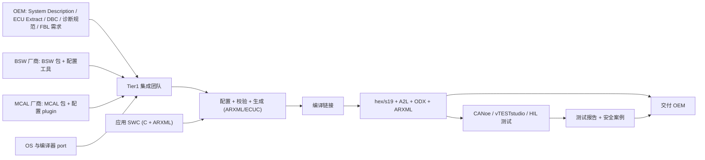

# 03 各方交付物对比：谁交付什么、格式、何时、用于什么

## 本报告回答的问题

- BSW 供应商（Vector、ETAS、Elektrobit 等）、MCAL 供应商（Renesas 等）、OS/编译器、工具厂商、OEM、Tier1 各自"实际交付"什么？
- 这些交付物以什么格式、在项目哪个阶段流转？彼此如何交接？

## 调研日期

2026-10（所有链接访问日期均为 2026-10；编辑复核同月，逐条结果见 docs/reference/research/10-industry-review-log.md）。

## 主要来源

Vector 官网与 DaVinci Configurator Classic 在线手册、Renesas MCAL 页面、Elektrobit/MathWorks 的 EB tresos 产品页、TI 与 Infineon 公开的 EB tresos/MCAL 资料、ETAS ISOLAR-A 公开目录页。完整列表见文末。

> 标签约定：[事实/有来源]、[行业惯例]（业内常见做法，无单一公开出处）、[推断]。
> 范围说明：ETAS RTA-CAR 的细节见 [04-rta-car-workflow.md](./04-rta-car-workflow.md)；行业格局与合作模式见 01、02 号文档，本文不重复。

---

## 1. BSW 供应商：交付形态

### 1.1 Vector MICROSAR Classic

- **两种交付模式**。Vector 官网介绍 "Package-Based Delivery"：订阅后通过 DaVinci Package Manager 在向导引导下从 Vector 在线仓库下载所需组件，无需逐项详细报价；同页提到 Vector 继续提供 "Software Integration Package (SIP) Based Delivery"，面向期望交钥匙（turn-key）基础软件方案、希望低门槛启动的项目 [事实/有来源：[V1]，2026-10 复核原页]。DaVinci Package Manager 帮助页另把传统方式称为 Custom Package (CSP) Delivery：填 RFQ、Vector 报价后组装并测试交付；Package Based Delivery 的下单到访问约 3 天 [事实/有来源：[V7]]。
- **SIP 这一术语**。"Software Integration Package (SIP)" 的全称与"交钥匙"定位见 [V1]。先前写的"每个 BSW 模块归入 cluster 并组合成各自 SIP"（来自 [V6] 搜索摘要）在 [V6] 原页复核时**未找到**，已删除；Vector 培训页（certification.vector.com）只说 BSW 模块可聚合（clustering）直至单一整体模块。包的结构见 DaVinci Package Manager 帮助页：定义了 5 类包，其中 MOP/MPP 等针对不同 OEM 或硬件平台有多份，另有 Platform Support Package (PSP) 面向特定硬件与 vVIRTUALtarget [事实/有来源：[V8]]。"SIP = 针对某 ECU/MCU/功能范围裁剪的 MICROSAR 软件集成包"是合理的业内理解 [行业惯例/推断]。**术语统一**：本系列中 SIP 仅指 Vector 的 SIP Based Delivery；泛指"BSW 交付包"时写 BSW Package / 交付包。
- **配置工具引用的是 "BSW Package"**。DaVinci Configurator Classic 建工程时需要指定 BSW package 路径，CLI 校验也要同时给出 DaVinci 工程与 BSW Package 目录（`dvcfg-b project validate -p=... -b=...`）[事实/有来源：[V2][V3]，复核 [V3] 原页确认]。Package Manager 帮助页还称：若 BSW Package 的 ThirdParty/<Mcal_µC> 下没有 Supply 文件夹，则 MCAL 需另行集成，Vector 提供 "3rd Party MCAL Integration Helper" 工具 [事实/有来源：[V8]]——这是 Vector 栈集成第三方 MCAL 的公开证据。
- **典型内容**。公开页面未列出 SIP 的逐项目录清单。下列属于业内通用组成 [行业惯例/推断]：BSW 模块源码（或对象库，视授权）、各模块 BSWMD（模块描述 ARXML）、DaVinci 生成器/校验器、技术参考与集成手册、安全手册（ASIL 项目）、与 MCAL/编译器相关的集成示例。具体文件名与目录结构以 Vector 实际交付为准，本文不臆测。
- **安全与合规**。官网称 MICROSAR Classic 支持 ISO 26262 最高 ASIL D，并有 Automotive SPICE、ISO/SAE 21434（含 TÜV 认证的 CSMS、对齐 UNECE R155）相关认证说明 [事实/有来源：[V6]，2026-10 复核；"长期支持与量产许可"字样 [V1] 未逐字核对]。
- **许可可见性**：需与 Vector 建立订阅/商务关系；价格未公开 [事实/有来源：[V1] 无价格数字]。

### 1.2 ETAS RTA-CAR（仅摘要）

- 本系列统一口径：RTA-CAR 发行包（V12.3.0 下载条目）含 ISOLAR-A（系统/应用设计）、ISOLAR-B（BSW 配置）、RTA-BSW、RTA-RTE、RTA-OS；ASAM 目录另列 RTA-FBL，并把 ISOLAR-A 描述为与 RTA-CAR 互操作的设计工具 [事实/有来源：[E2]；下载条目见 04 的 S3]。[E1]（MathWorks 页）复核时 403，未能核对，仅作旁证。
- 交付内容、版本与 MCAL 集成细节：见 [04-rta-car-workflow.md](./04-rta-car-workflow.md)。

### 1.3 Elektrobit EB tresos AutoCore + EB tresos Studio

- AutoCore：AUTOSAR BSW 实现，含 AutoCore OS（单核/多核，含内存保护），通信、诊断、存储、模式管理等模块；基于 AUTOSAR R20-11 的说法来自 [B1]（MathWorks 页，复核时 403，**仅搜索摘要**）。EB 官网产品线页（elektrobit.com/?p=45325）列出 EB tresos AutoCore、AutoCore Light、tresos Studio、tresos 操作系统，并称提供 EB tresos 评估包，覆盖 Infineon AURIX TC38XQ/TC4D、NXP S32K14X、**Renesas RH850/F1KM** 等 [事实/有来源，2026-10 复核]。
- EB tresos Studio：基于 Eclipse 的配置与代码生成工具，可图形化或命令行触发生成，便于接入既有构建环境；带 OIL、DBC、LDF、Fibex、AUTOSAR 系统描述导入器 [来自搜索摘要：[B1] 复核时 403、[B2] 页面 curl 抓取只得到产品/网络研讨会列表，均未能原页核对该清单]。
- **Plugin 概念**：EB tresos 以 plugin 形式分发模块：含 ARXML 与 XDM 配置定义、头/源文件生成模板、BSWMD 生成、以及用于许可与注册的 manifest [事实/有来源：[B3]，TI MCAL 场景的公开指南，机制通用但属 TI 示例]。

### 1.4 其他

Hitex 等作为 MCAL/复杂驱动的集成与分销方出现在公开资料中 [事实/有来源：[I2]]；其他 BSW 厂商不在本轮公开调研范围 [未覆盖]。

---

## 2. MCAL 供应商

### 2.1 Renesas RH850 MCAL

- Renesas 官网 "Renesas MCAL" 页面（2026-10 复核）列出：SPAL（ADC、DIO、FLS、GPT、ICU、MCU、PORT、PWM、SPI、WDG）、COM（CAN、LIN、FR、ETH）、TEST（Core Test、Ram Test、Flash Test），基于 AR4.2.2；页面视频/示例以 RH850/X1x 为例 [事实/有来源：[R1]]。Renesas AUTOSAR 页的支持列表另把 RH850/P1M 等列在 AUTOSAR 4.0.3 栏（4.2.2 栏为 F1K/F1KM/F1KH/E2M/C1M-A 等）[事实/有来源：[R3]]，读者环境的 P1M MCAL 实际基于哪个 AUTOSAR 版本须在真实项目确认。
- 获取方式：该页称软件包 "available free of charge and as is"，需其他软件包可联系 Renesas；页面有登录入口，另有视频教程与支持社区 [事实/有来源：[R1]]。抓取到的页面内容未显示用户手册、安全手册及具体器件清单，这些通常在登录后的下载区 [推断]。
- 配置工具：Renesas 页面未背书具体工具；社区讨论提及 DaVinci Configurator 与 EB tresos 可用 [事实/有来源：[R1]]。ISOLAR-B 配合 Renesas MCAL 的情况见 04 号文档。
- 典型包内容（源码、配置 plugin、BSWMD/参数定义 ARXML、用户手册、安全手册、示例、release notes）为业内惯例 [行业惯例]，不是 Renesas 公开页面逐项确认的清单。

### 2.2 Infineon / NXP（简述）

- Infineon AURIX MC-ISAR：TC3xx 提供 AS422、AS440、AS440 EXT（9 个 ASIL D 驱动）；TC4x 基于 AUTOSAR R20-11；以 EB tresos 作为配置工具；有免费评估许可 [事实/有来源：[I1]，来自搜索摘要——该页 curl 抓取只得到导航内容，未能核对这些细节]。
- NXP：本轮公开检索未获得足够可引用资料 [未覆盖]。

---

## 3. OS 与编译器相关移植

| 项 | 公开信息 |
|---|---|
| ETAS RTA-OS | 功能安全（ISO 26262）合规 OS，面向资源受限 MCU [厂商自述：ETAS 官网称 RTA-CAR 满足 ASIL-D、Tasking 合作页称 RTA-OS 2008 年首发并有 52 个目标端口（04 的 S1、S12）；[E1] 403 未核对] |
| Vector MICROSAR OS | 属 MICROSAR 套件 [事实/有来源：[V6]，MICROSAR 覆盖 AUTOSAR Classic]；细节未调研 |
| EB tresos AutoCore OS | 支持全部 Scalability Class（含内存保护），单/多核 [仅搜索摘要：[B1] 403 未核对] |
| 编译器端口 | OS/BSW 的上下文切换、中断、内存段（MemMap）与具体编译器相关，需供应商提供对应 port [行业惯例]；IAR 与 Renesas RH850 U2A MCAL 支持的新闻见 [R2]：2025-09-04 新闻称 Renesas 发布的 RH850/U2A MCAL（ASIL D MP）基于 AUTOSAR R22-11，并支持 IAR RH850 工具链 v2.21.2 FS [事实/有来源，2026-10 复核] |

---

## 4. 一张总表：谁交付什么

| 交付方 | 交付物 | 典型格式 | 何时 | 用于什么 | 标签 |
|---|---|---|---|---|---|
| OEM | System Description / ECU Extract | ARXML | 项目启动、每次网络变更 | 配置 COM/PduR/CanIf/EcuC | [行业惯例]；Vector 工具以 ECU Extract 为输入 [事实/有来源：[V2]] |
| OEM | 通信矩阵 | DBC / LDF / FIBEX / ARXML | 同上 | 信号、PDU 定义 | 来自搜索摘要：[B2]（导入器清单未能原页核对） |
| OEM | 诊断规范 | ODX/PDX、CDD、DEXT | 启动与迭代 | Dcm/Dem 配置、诊断测试 | [事实/有来源：[D1]] |
| OEM | 引导/刷写与安全需求 | 文档 + 流程 | 启动期 | 定制 FBL、安全访问 | [行业惯例] |
| BSW 厂商 | BSW 包 / SIP | 源码/库 + BSWMD + 手册 | 项目启动、后续补丁 | 构建 ECU 基础软件 | Vector：[事实/有来源：[V1]]；内容细目 [推断] |
| BSW 厂商 | 配置/生成工具 | DaVinci / ISOLAR-B / EB tresos Studio | 随包 | 配置、校验、生成代码 | [事实/有来源：[V5][E2]；EB 部分见 [B1] 仅搜索摘要] |
| MCAL 厂商 | MCAL 驱动包 | 源码 + 配置 plugin/ARXML 参数定义 | 选型后 | 硬件抽象 | Renesas：[事实/有来源：[R1]]；细节 [行业惯例] |
| OS 厂商 | OS + 生成器 + 编译器 port | 源码/库 + 配置 | 同 BSW | 调度与保护 | [E2]；EB 部分 [B1] 仅搜索摘要 |
| 工具厂商 | 总线/测量/测试工具 | CANoe、vTESTstudio、CANape、INCA | 开发/验证 | 仿真、诊断测试、标定 | [事实/有来源：[T1][T2]] |
| Tier1 | 应用 SWC、集成后的软件 | C 源码、ARXML（SWC 描述） | 开发 | 与 BSW 通过 RTE 集成 | [行业惯例] |
| Tier1 → OEM | 软件发布 | hex / s19、A2L、ODX/PDX、ARXML | 各样件/量产节点 | 刷写、标定、诊断 | [行业惯例] |
| Tier1 → OEM | 测试报告、安全案例 | 文档 | 里程碑 | ISO 26262 / ASPICE 证据 | [行业惯例] |

> A2L 对应 ASAM MCD-2 MC，用于标定工具；CANoe 公开支持 MCD-2 MC / MCD-2 D 等 ASAM 标准，并可基于 CANdela 或 ODX 诊断描述自动执行测试用例 [事实/有来源：[T2]]。

---

## 5. 交接流程

## 结论要点

1. Vector 公开两种交付：订阅式 Package-Based 与 SIP-Based；SIP 内部清单未公开，勿臆测。[事实/有来源]
2. 配置工具均以 ECU Extract (ARXML) 为核心输入，EB tresos 额外支持 DBC/LDF/OIL/Fibex 导入。[事实/有来源]
3. Renesas MCAL 公开覆盖 SPAL/COM/TEST 驱动，AR4.2.2；是否免费及文档在登录区。[事实/有来源]
4. Tier1 对 OEM 的交付以 hex/A2L/ODX/ARXML + 证据文件为主。[行业惯例]

## 对你的意义

在 RTA-CAR + RH850 项目中：向 OEM 要齐 ECU Extract、诊断规范与 FBL 需求；向 Renesas 取 MCAL 并确认其配置 plugin 是否适配 ISOLAR-B（见 04）；向 ETAS 确认编译器 port 与 OS 版本。

## 未能公开确认的缺口

Vector SIP 目录明细；Renesas MCAL 登录区文件清单与器件表；ETAS 以外 OS 的 port 细节；NXP；价格。

## 来源列表（访问日期 2026-10）

- [V1] https://www.vector.com/en/product/microsar-classic-package-based-delivery/
- [V2] https://help.vector.com/davinci-configurator-classic/en/6.3/user-manual/getting-started/workflow/local/configure-first-project.html
- [V3] https://help.vector.com/davinci-configurator-classic/en/6.3/user-manual/getting-started/workflow/local/check-configuration.html
- [V5] https://www.vector.com/en/product/microsar-classic/davinci-configurator-classic/
- [V7] https://help.vector.com/DaVinci-Package-Manager/current/en/Help/html/custom_package_vs_package_based_delivery.html
- [V8] https://help.vector.com/DaVinci-Package-Manager/current/en/Help/html/the_embedded_packages.html
- [V6] https://www.vector.com/microsar-classic （2026-10 原页复核：ASIL D、generic/customer-specific 配置、平台与编译器覆盖已确认；SIP/cluster 表述未找到，已删除）
- [R1] https://www.renesas.com/en/software-tool/renesas-mcal
- [R3] https://www.renesas.com/cn/en/application/automotive/autosar
- [R2] https://www.eejournal.com/industry_news/iar-enables-agile-automotive-development-on-renesas-rh850-u2a-mcu-with-mcal-support
- [E1] https://ch.mathworks.com/products/connections/product_detail/isolar-a.html （复核时 403）
- [E2] https://www.asam.net/members/product-directory/detail/etas-isolar-a
- [B1] https://es.mathworks.com/products/connections/product_detail/eb-tresos.html
- [B2] https://www.elektrobit.com/?p=1807 （搜索摘要引用；2026-10 复核只见 EB tresos 网络研讨会与演示条目，如 "EB tresos Studio for Classic AUTOSAR workflows"，未见导入器清单）
- [B3] https://software-dl.ti.com/mcu-plus-sdk/esd/PLATFORM_SW_MCAL/AM263x/10.02.00/src/MCAL_Configuration_and_EB_Tresos.html
- [I1] https://infineon.com/cms/en/tools/aurix-embedded-sw/AUTOSAR/Infineon
- [I2] https://www.hitex.com/products/software-components/mcal-and-complex-drivers/mcal-drivers-for-autosar-projects
- [D1] https://www.eenewseurope.com/en/autosar-compliant-diagnostic-configuration-at-the-press-of-a-button/
- [T1] https://www.vector.com/en/product/vteststudio/
- [T2] https://www.eenewseurope.com/en/vector-canoe-12-0-supports-automotive-ecus/
