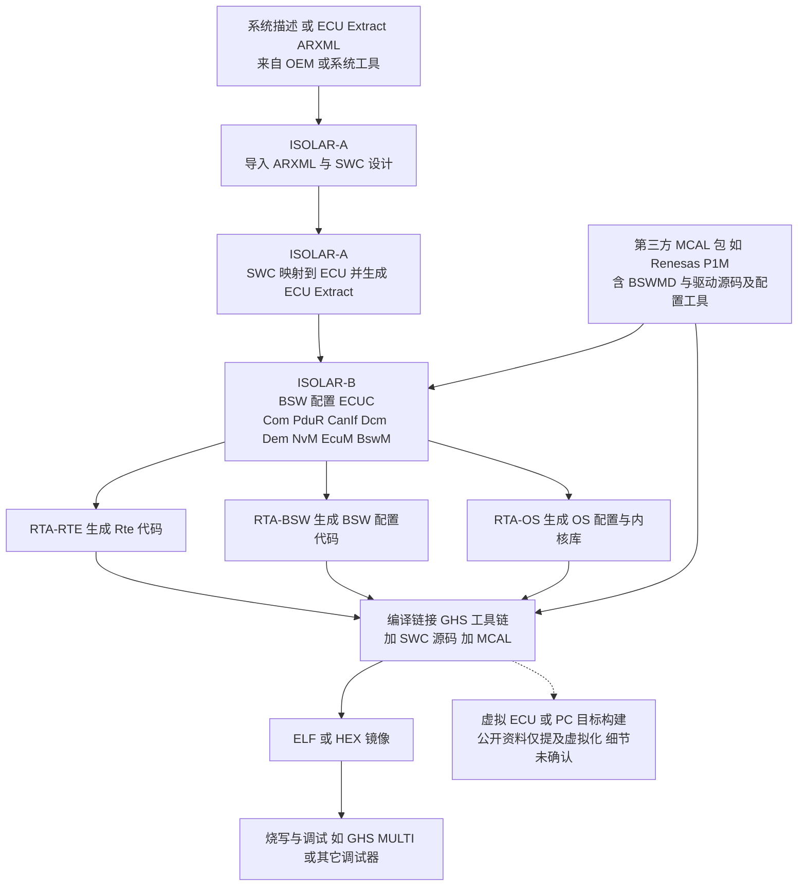

# 04 ETAS RTA-CAR 深入：组成、版本、端到端工作流

- **本报告回答的问题**：RTA-CAR 是什么、由哪些公开命名的组件构成；版本/发布与下载如何组织；从建工程到出镜像的端到端工作流（含第三方 MCAL、GHS 工具链、RTA-OS 概念、Dcm/Dem 配置）；更新与支持渠道。
- **调研日期**：2026-10（公开网页，访问日期 2026-10；2026-10 编辑复核时已重新打开 S1、S3、S4、S5、S7、S10 逐条核对，结果见 docs/reference/research/10-industry-review-log.md）
- **主要来源**：ETAS 官网 RTA-CAR 产品页、ETAS 下载中心条目（RTA-CAR V12.3.0、RTA-OS RH850GHS 5.0.39）、ASAM 产品目录、Macnica ETAS 页、LHP/ETAS 培训页。
- **证据等级**：[事实/有来源]、[行业惯例]、[推断]。**ETAS 的用户手册、Release Notes、Port Guide 需登录，本次均未能公开读取；凡涉及菜单名、文件名、功能细节处写“公开资料未确认”。**
- 读者背景（仅作上下文，非本报告断言）：RTA-CAR 12.9.0、RTA-OS RH850GHS 5.0.39、GHS、Renesas P1M MCAL。

---

## 1. RTA-CAR 是什么

- [事实/有来源] ETAS 称 RTA-CAR 是 ETAS Vehicle Software Platform Suite 中 AUTOSAR Classic Profile 的基础；官网称其可降低 ECU 内存占用（"up to 50% less ECU memory"）、满足 ISO 26262 ASIL-D 与 ISO 21434/UN-R155 标准、"通过 40 多家合作伙伴支持 60 多种微控制器与编译器端口"（"more than 60 microcontrollers and compiler ports"）、与现有流程及 CI/CD 管线集成。这些是厂商营销表述，非独立验证（2026-10 复核 S1 原页确认措辞）。[S1]
- [事实/有来源] RTA-CAR 的组成（本系列统一口径）：**ISOLAR-A**（系统与应用软件设计）、**ISOLAR-B**（BSW 配置）、**RTA-BSW**（AUTOSAR 基础软件）、**RTA-OS**（操作系统）、**RTA-RTE**（RTE 生成器）；ASAM 目录另列 **RTA-FBL**。依据是 S3 下载条目与 S5 ASAM 目录，Macnica 页（S11）也列出 RTA-BSW/RTA-RTE/RTA-OS 并称 RTA-BSW "forms the R4.x platform"。**复核更正**：S1 产品页（curl 抓取）正文**没有**逐项列出这些组件名，先前把组件清单归于 S1 不准确。ASAM 对 ISOLAR-A 的措辞是"与 RTA-CAR 互操作"，而 V12.3.0 下载包同时含 ISOLAR-A，故 ISOLAR-A 是否算"RTA-CAR 的一部分"取决于口径（发行包含它）。[S3][S5][S11]
- [事实/有来源] 下载中心的 RTA-CAR V12.3.0 条目列出的包内容为 ISOLAR-A V12.3.0、ISOLAR-B V12.3.0、RTA-BSW V12.3.0、RTA-RTE V12.3.1、RTA-OS V12.3.0，ZIP 3.3 GB，发布日期 2024-05-11；下载需经 ETAS 许可门户登录。[S3] 说明同一发行里各组件版本号并不总是完全相同（RTE 为 12.3.1）。
- [事实/有来源] ASAM 目录提到 **RTA-FBL**（Flash Bootloader）属于 RTA-CAR 方案（"RTA-CAR ... comprising ISOLAR-B, RTA-RTE, RTA-OS, RTA-BSW, RTA-FBL, and more"），并写 ISOLAR-A 支持 ASAM MCD-2 D（ODX）与 MCD-2 NET。[S5]（LHP 页面未见 RTA-FBL 字样，先前的 S7 引用已撤销。）
- [事实/有来源] 同一厂商另有 Adaptive 侧产品 ISOLAR-A_ADAPTIVE 与 RTA-VRTE（与本教程 Classic 范围无关）。[S5]
- **命名核实结果**："RTA-SK / starter kit"、"ISOLAR-AB / ISOLAR-EVE"、"VRTA virtual target" 在本次公开检索中**没有找到可引用的官方页面**。S1 原页只提到"与 CI/CD 管线集成"，**未见**虚拟化/虚拟 ECU 的字样（先前"虚拟化"的说法仅来自搜索摘要，已降级为未确认）。结论：公开资料未确认，需在 RTA-CAR 安装目录自带的文档（安装向导/开始菜单指向的 Documentation/Help 入口）或登录后的 docs.etas.com 中确认。[S9]
- [推断] 产品分类有调整（官网目前放在 "Vehicle Software Platform / AUTOSAR Classic Profile" 栏目，旧 URL 分类为 "middleware-solutions"），不同年代资料可能使用不同名称。[S1][S2]

## 2. 版本、发布节奏与支持的 AUTOSAR 版本

| 项目 | 公开信息 | 等级 |
|---|---|---|
| RTA-CAR 版本形态 | 形如 V12.3.0（发布 2024-05-11） | [事实] [S3] |
| RTA-OS 目标端口版本 | "RTA-OS RH850GHS V5.0.39"，2024-11-27，ZIP 6.4 MB；端口按 MCU 家族+编译器单独分发、单独版本号，下载包标识为 "ES_RTA-OS_RH850GHS \| Software_5.0.39" | [事实] [S4] |
| 发布节奏 | 公开页面未声明固定节奏。从 12.3.0（2024-05）到读者看到的 12.9.0 可见 12.x 内有多个版本 | [推断]，需查下载中心列表 |
| 支持的 AUTOSAR Release | 公开页面只说 AUTOSAR Classic / R4.x（Macnica 页称 RTA-BSW "forms the R4.x platform"）；具体支持 R19-11/R20-11/R21-11/R22-11 哪些，**公开资料未确认**，需在 RTA-CAR/RTA-BSW 的 Release Notes 或 Product Overview 文档中确认 | 未确认 [S2][S8] |

[事实/有来源] ETAS 2014-03 的新闻稿（ElectronicSpecifier 转载）称其 RTA 基础软件扩展到覆盖 AUTOSAR 4.x 基础软件模块；Macnica 页称 RTA-BSW 构成 R4.x 平台。两者合起来只说明 RTA-BSW 属于 R4.x，不能说明当前支持哪个 Release。[S8][S11]

## 3. 端到端工作流

下图是**通用 AUTOSAR Classic 方法论**（[行业惯例]，见 [11/03](../11-classic-autosar-primer/03-methodology-workflow.md)）映射到 RTA-CAR 组件名（组件名为 [事实/有来源]，步骤归属为 [推断]；与 [11/02](../11-classic-autosar-primer/02-who-builds-what.md) 的 ECU Integrator 角色对应：由 Tier1/集成方在 ISOLAR-B 中配置 MCAL，而非 MCAL 厂商）。具体界面菜单名公开资料未确认。

### 3.1 步骤表

| 步骤 | RTA-CAR 工具（公开命名） | 输入 | 输出 | 对应本教程章节 |
|---|---|---|---|---|
| 1 创建工程/导入系统描述 | ISOLAR-A [S5] | ECU Extract / System Description ARXML | 工程内的 AUTOSAR 模型 | [02/04](../02-autosar-classic/04-configuration-arxml.md) |
| 2 SWC 设计 | ISOLAR-A | 端口接口、SWC、Runnable、Event | SWC ARXML（头骨架由何工具生成，公开资料未确认） | [07-rte-swc](../07-rte-swc/01-swc-concept.md) |
| 3 BSW 配置 | ISOLAR-B [S1][S7] | ECU Extract、各模块 BSWMD、MCAL 参数定义 | ECUC ARXML | [02/04](../02-autosar-classic/04-configuration-arxml.md)、[08/01](../08-integration/01-ecu-configuration-checklist.md) |
| 4 MCAL 集成 | 第三方 MCAL（Renesas）与 ISOLAR-B 的集成方式公开资料未确认；[行业惯例] 做法：导入 MCAL 的 BSWMD/参数定义在 ISOLAR-B 配置，或用 MCAL 厂商自带配置工具生成 | MCAL 交付包（Renesas AUTOSAR 页的支持列表把 RH850/P1M 列在 AUTOSAR 4.0.3 栏而非 4.2.2；读者环境所称 "AR 4.2.2 API" 是否一致须在真实项目确认） | Mcu/Port/Can/Gpt 等配置 | [03-mcal](../03-mcal/01-mcal-overview.md)、[11/05](../11-classic-autosar-primer/05-mcal-role-and-architecture.md) |
| 5 RTE 生成 | RTA-RTE [S1] | ECUC + SWC + 映射 | Rte_*.c/h、SchM | [07/05](../07-rte-swc/05-rte-generation.md) |
| 6 OS 配置与生成 | RTA-OS（按 MCU/编译器 port）[S1][S4] | Task/ISR/Alarm/Counter/Schedule Table 配置 | OS 配置代码、内核库/头文件 | [02/06](../02-autosar-classic/06-os-task-isr.md)、[11/06](../11-classic-autosar-primer/06-os-basics.md) |
| 7 BSW 代码生成 | RTA-BSW [S1] | ECUC | 各模块 *_Cfg.c/h 与 PB 配置 | [02/05](../02-autosar-classic/05-generated-code.md) |
| 8 编译链接 | 外部：GHS 编译器（读者上下文） | 以上全部 + 启动代码 + 链接脚本 | ELF/HEX | [01/04](../01-rh850/04-startup-process.md)、[01/05](../01-rh850/05-linker-script.md) |
| 9 虚拟测试 | 公开页面仅在摘要中提到虚拟化与 CI/CD，工具名及用法公开资料未确认 | - | - | [08/06 CANoe 测试](../08-integration/06-canoe-test.md) |
| 10 烧写与调试 | 外部调试器/烧写工具；RTA-FBL 为 ETAS Flash Bootloader [S7] | 镜像 | 运行的 ECU | [10-boot-debug](../10-boot-debug/README.md) |

## 4. RTA-OS 概念（与 RH850GHS 端口）

- [事实/有来源] RTA-OS 目标支持以"端口（port）"形式按 MCU 家族+编译器单独发布，例如 "RTA-OS RH850GHS"，安装包在下载中心有独立版本（5.0.39）。[S4]
- [事实/有来源，厂商自述] S1 原页称 "RT-OS reduces memory usage up to 50%"（原文拼写如此，指内存占用）；先前写的"单栈实现、栈需求降低 over 50%"在 S1/S7 均**未找到**，已删除。Tasking 合作页（[事实]）称 RTA-OS 2008 年首发、已有 52 个目标端口、遵循 OSEK/VDX 2.2.3。[S1][S12]
- [行业惯例] 硬件计数器通常绑定到 MCU 的某个定时器外设（RH850 上常见为 OSTM），由 OS 配置指定设备与中断，端口要求用户提供对应中断入口/回调。具体到 RTA-OS RH850GHS 的**回调名（Os_Cbk_*）、Interrupt 命名、设备编号、variant 列表**：公开资料未确认（旧版 RTA-OS 3.0 Reference Guide 的 PDF 地址本次抓取只返回 HTML 门户页）。需在 RTA-OS RH850GHS 安装目录里的 Port/Target Guide 及 RTA-OS Reference Guide 中确认。[S9]
- 与本教程对照：[01/06 中断](../01-rh850/06-interrupt-exception.md)、[02/06](../02-autosar-classic/06-os-task-isr.md)、[11/07](../11-classic-autosar-primer/07-rte-and-os.md)。

## 5. 诊断（Dcm/Dem）如何配置

- [事实/有来源] ASAM 目录写明 ISOLAR-A 支持 ASAM MCD-2 D（ODX）。[S5]
- [事实/有来源，范围有限] NobleProg 培训大纲（S10）列出 ETAS ISOLAR-A/B 概览、Dem（Diagnostic Event Manager）、NvM、CANoe 诊断等主题；**复核未在该页找到"ODX container 导入""DCM/DID/RID/DTC 配置"字样**，先前对该页的概括已降级，不能据此断言 ISOLAR-B 的 Dcm 配置方式。[S10]
- [行业惯例] 常见做法：以诊断规范（ODX/PDX、CDD 或表格）为输入，通过导入/脚本填充 Dcm/Dem 的 ECUC，再由 RTA-BSW 生成代码。**RTA-CAR 是否直接导入 CDD、支持哪些格式，公开资料未确认**，需在 ISOLAR-B 帮助的诊断章节确认。
- 对应教程：[06-dcm](../06-dcm/05-dcm-configuration.md)、[07/08](../07-rte-swc/08-dcm-rte-integration.md)、[08/03](../08-integration/03-dcm-integration.md)。

## 6. 更新与迁移

- [事实/有来源] 新版本以 ZIP 形式在 ETAS 下载中心列出，点击下载跳转许可门户登录（license.etas.com）；条目列出各组件版本。[S3][S4]
- 下载中心有 FAQs / known issues 入口，docs.etas.com 为在线文档入口，但抓取时未见 RTA-CAR 相关文档（可能需登录）。[S9]
- Release Notes、Migration Guide 是否公开：公开资料未确认。[行业惯例] 通常随安装包或下载条目附件提供，需在安装目录的文档位置查找。

## 7. 授权、下载、培训与支持

- [事实/有来源] 下载需 ETAS 账号并经许可门户登录。[S3][S4] 许可模式（浮动/节点锁定）公开资料未确认。
- [事实/有来源] 官网有 ETAS Academy、Webinars 栏目与 Contact Support 入口 [S1]；LHP 与 ETAS 合作提供基于 ISOLAR-A/B 的 AUTOSAR 培训，每位学员培训期间获临时 ETAS ISOLAR A/B 许可 [S7]。（"60 分钟 RTA-CAR 介绍 webinar"在 LHP 页面未找到，已删除。）

## 结论要点

1. RTA-CAR 发行包 = ISOLAR-A + ISOLAR-B + RTA-BSW + RTA-RTE + RTA-OS（V12.3.0 条目；ASAM 另列 RTA-FBL），同一发行内各组件版本号可能不同（RTE 为 12.3.1）。
2. RTA-OS 按 MCU+编译器端口独立版本化，读者的 RH850GHS 5.0.39 就是这种端口。
3. 公开资料无法确认：支持的 AUTOSAR Release 明细、MCAL 导入具体操作、Os_Cbk 回调签名、CDD 导入、虚拟 ECU 工具名。须从安装目录文档确认。

## 对你的意义

- 先在安装目录/下载条目里找 Release Notes、RTA-OS Port Guide、ISOLAR-B 帮助，把"公开资料未确认"项逐条填上。
- 把本教程当概念地图（SWC/RTE/OS/MCAL 边界），真实操作以 ETAS 文档为准。
- DCM 升级见 [06-rta-car-dcm-upgrade-implications.md](06-rta-car-dcm-upgrade-implications.md)。

## 来源列表（访问日期 2026-10）

- [S1] ETAS, RTA-CAR AUTOSAR Classic Software for ECUs — https://www.etas.com/ww/en/products-services/vehicle-software-platform/autosar-classic-profile-rta-car/
- [S2] ETAS, RTA-CAR（旧分类页；2026-10 复核时返回内容与 S1 相同）— https://www.etas.com/ww/en/products-services/middleware-solutions/rta-car/
- [S3] ETAS 下载中心, RTA-CAR V12.3.0 — https://www.etas.com/ww/en/downloads/software-downloads-overview/rta-car-v12-3-0/
- [S4] ETAS 下载中心, RTA-OS RH850GHS Product Installer — https://www.etas.com/ww/en/downloads/software-downloads-overview/rta-os-rh850ghs-product-installer/
- [S5] ASAM 产品目录, ETAS ISOLAR-A — https://www.asam.net/members/product-directory/detail/etas-isolar-a
- [S7] LHP, AUTOSAR Training Using ETAS ISOLAR Toolset — https://shop.lhpes.com/autosar-training-using-etas-isolar-toolset ；https://www.lhpes.com/lhp-news/lhp-and-etas-team-up-to-deliver-autosar-training
- [S8] ElectronicSpecifier, ETAS expands RTA solutions portfolio — https://www.electronicspecifier.com/?p=135666
- [S9] ETAS 在线文档入口（2026-10 复核：公开列表只含 ASCET、INCA、RTA-SQF 等，未见 RTA-CAR）— https://docs.etas.com/
- [S11] Macnica, ETAS RTA-CAR（RTA-BSW/RTE/OS 概述）— https://www.macnica.co.jp/en/business/semiconductor/manufacturers/etas/products/144617/
- [S12] Tasking, ETAS 合作页（RTA-OS）— https://www.tasking.com/content/partner/etas/
- [S10] NobleProg AUTOSAR 课程大纲 — https://www.nobleprog.co.uk/cc/autosarbasa
- 本仓库：[online-references.md](../online-references.md)
