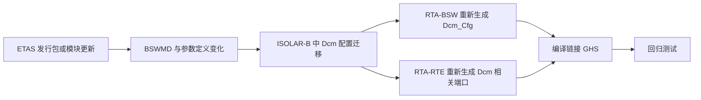

# 06 在 RTA-CAR 工程中升级 DCM 的含义

- **本报告回答的问题**：DCM 在 RTA-CAR 工程中以什么形态存在；升级 DCM 通常意味着什么；应查什么、怎样与 ETAS/集成商沟通、怎样回归。
- **调研日期**：2026-10（公开资料，访问日期 2026-10）
- **主要来源**：ETAS 官网 RTA-CAR 页面与下载中心条目、ASAM 目录、Macnica ETAS 页；其余为 [行业惯例]/[推断]，已逐条标注。
- 说明：ETAS 的 Release Notes/Migration Guide 未公开读取，**下文"应查什么"是推荐实践，不是 ETAS 文档事实**。

---

## 1. 公开事实与推断

- [事实/有来源] RTA-BSW 是含通信、存储、诊断协议等的 AUTOSAR 基础软件栈（Macnica 页："comprehensive AUTOSAR stack including ... communication, memory, diagnostic protocols"），故 Dcm 归属 RTA-BSW 是合理推断，ETAS 官网未逐模块列出 [S11]；RTA-CAR 以组合发行包交付（V12.3.0 条目含 ISOLAR-A/B、RTA-BSW、RTA-RTE、RTA-OS，各带版本号，RTE 为 12.3.1）。[S3]
- [事实/有来源] 下载包经 ETAS 许可门户登录获取。[S3][S4]
- [事实/有来源] ISOLAR-A 支持 ODX（ASAM MCD-2 D）。[S5]
- [推断] 因此 Dcm 不是可单独替换的 .c 文件：它与 ISOLAR-B 的 BSWMD/参数定义、RTA-BSW 代码生成器、RTA-RTE 生成的端口强耦合。**升级通常等于升级 RTA-CAR（或 RTA-BSW）版本，或接收供应商专门交付的模块更新**。能否只更新 Dcm 单模块，公开资料未确认，需问 ETAS。

## 2. 应查什么（推荐实践 [行业惯例]）

| 检查项 | 做法 | 本教程参照 |
|---|---|---|
| Release Notes / 迁移说明 | 在新旧安装目录的文档及下载条目附件中找；逐条标出 Dcm、Dem、PduR、CanTp、ComM、BswM、NvM、RTE 的变更 | [dcm-upgrade-guide](../dcm-upgrade-guide.md) §3 |
| AUTOSAR Release 是否变化 | 查 Dcm 版本宏、BSWMD 版本 | [dcm-upgrade-guide](../dcm-upgrade-guide.md) §2 |
| BSWMD / 参数定义变化 | 对比新旧 BSWMD：新增/删除/重命名/默认值变化的容器与参数 | [06/05](../06-dcm/05-dcm-configuration.md) |
| ECUC 迁移 | 确认 ISOLAR-B 是否提供配置迁移功能及报告、哪些参数需手动处理：公开资料未确认，需在 ISOLAR-B 帮助中确认 | - |
| 生成代码差异 | 同一输入配置分别生成并 diff（Dcm_Cfg.c/h、PB 配置、Rte 头文件） | [09/04](../09-real-project-preparation/04-how-to-read-generated-code.md) |
| RTE 端口变化 | DataServices（DID/RID 读写）、SecurityAccess（GetSeed/CompareKey）、Session/ModeSwitch 端口的名称、签名、接口类型；SWC 实现要跟着改 | [07/08](../07-rte-swc/08-dcm-rte-integration.md)、[07/09](../07-rte-swc/09-diagnostic-swc-example.md) |
| Callout 签名 | 对比新旧头文件中 Dcm 要求的回调参数、返回类型、OpStatus 语义 | [dcm-upgrade-guide](../dcm-upgrade-guide.md) §6 |
| 依赖模块 | Dem 接口、PduR/CanTp 的 DcmTransmit/TP 回调、ComM/BswM、SchM 的 MainFunction 周期 | [08/03](../08-integration/03-dcm-integration.md) |
| 编译与 OS 影响 | 新生成 MainFunction 的任务映射、栈、编译选项、GHS 警告 | [02/07](../02-autosar-classic/07-mainfunction-scheduling.md) |
| 诊断数据输入 | 若用 ODX/CDD/表格驱动配置，确认导入脚本/模板是否随版本变化 | - |

## 3. 与 ETAS 支持协作 [行业惯例]

- 官网有 Contact Support 入口、ETAS Academy 与 Webinars 栏目 [S1]；通过客户支持渠道提交工单（具体入口公开资料未确认）。
- 附上：当前/目标 RTA-CAR 版本及各组件版本（下载条目列出了 ISOLAR-A/B、RTA-BSW、RTA-RTE、RTA-OS 各自版本 [S3]）、RTA-OS 端口版本（如 RH850GHS 5.0.39 [S4]）、最小可复现工程、差异报告。
- 若 Dcm 由集成商提供，同时询问集成商。

## 4. 回归测试

1. 固化基线：升级前用现有工程跑一遍并保存 UDS 日志。
2. 协议层：参照 [dcm-upgrade-guide](../dcm-upgrade-guide.md) §10、[06-dcm](../06-dcm/01-dcm-overview.md)，及 `examples/uds_diag_demo/tests/test_uds_demo.c` 的用例结构（会话切换、SecurityAccess、0x22/0x2E、0x19、负响应码、超时、0x78 等，以该文件实际内容为准）。
3. 集成层：[08/05](../08-integration/05-uds-end-to-end.md)、[08/06](../08-integration/06-canoe-test.md)。
4. 重点差异：NRC 优先级、P2/P2*、并发请求、Response pending、DTC 状态位。

## 5. 检查清单

- [ ] 记录旧/新 RTA-CAR 与各组件版本号、RTA-OS 端口版本
- [ ] 读完新版 Release Notes 与迁移说明，列出 Dcm 相关条目
- [ ] 对比 BSWMD，列出参数增删改
- [ ] 完成 ECUC 迁移并保存迁移报告
- [ ] 全量重新生成并 diff 生成代码
- [ ] 更新 SWC 中 DataServices/SecurityAccess 实现与 RTE 端口映射
- [ ] 核对 callout 签名，编译无警告
- [ ] 核对 Dem/PduR/CanTp/ComM/BswM/SchM 依赖
- [ ] 运行回归测试并比对基线日志

## 6. 要问 ETAS / 集成商的问题

1. 目标版本里 Dcm 对应的 AUTOSAR Release 是什么？与当前相比有无升级？
2. 能否单独更新 Dcm，还是必须升级整个 RTA-BSW/RTA-CAR？
3. 是否有官方 Migration Guide 与 ISOLAR-B 配置迁移工具？哪些参数不能自动迁移？
4. DataServices/SecurityAccess 的 RTE 端口或回调签名有无变更？
5. 与当前 RTA-OS RH850GHS 端口版本及 Renesas P1M MCAL 版本是否有兼容矩阵？
6. 与 Dem、PduR、CanTp 的版本配套要求？
7. 已知问题（known issues）里有无 Dcm 相关项？
8. ODX/CDD 导入流程有无变化？
9. 升级包的获取权限与许可证有效期？

## 结论要点

- Dcm 升级是工具链 + 生成代码 + RTE 端口 + 回调的整体变更，不是文件替换 [推断]。
- 公开资料不足以确认具体迁移机制，须依赖 ETAS 随包文档与支持。
- 方法：基线 -> 文档/BSWMD 差异 -> 迁移 -> 全量生成 diff -> 回归。

## 对你的意义

先拿到新旧两套安装的文档，补全"公开资料未确认"项；用 [dcm-upgrade-guide](../dcm-upgrade-guide.md) 作工作表；结合 [04 工作流](04-rta-car-workflow.md) 定位各步骤所用工具。

## 来源列表（访问日期 2026-10）

- [S1] https://www.etas.com/ww/en/products-services/vehicle-software-platform/autosar-classic-profile-rta-car/
- [S3] https://www.etas.com/ww/en/downloads/software-downloads-overview/rta-car-v12-3-0/
- [S4] https://www.etas.com/ww/en/downloads/software-downloads-overview/rta-os-rh850ghs-product-installer/
- [S5] https://www.asam.net/members/product-directory/detail/etas-isolar-a
- [S11] https://www.macnica.co.jp/en/business/semiconductor/manufacturers/etas/products/144617/
- 本仓库：[dcm-upgrade-guide.md](../dcm-upgrade-guide.md)、[09/07](../09-real-project-preparation/07-rtacar-dcm-upgrade-preparation.md)、`examples/uds_diag_demo/tests/test_uds_demo.c`
