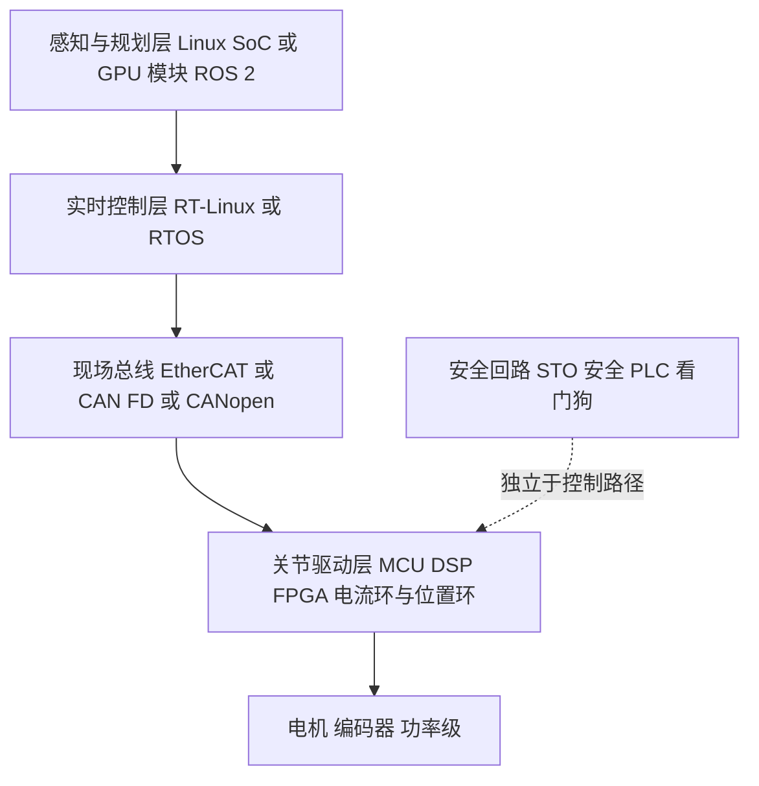
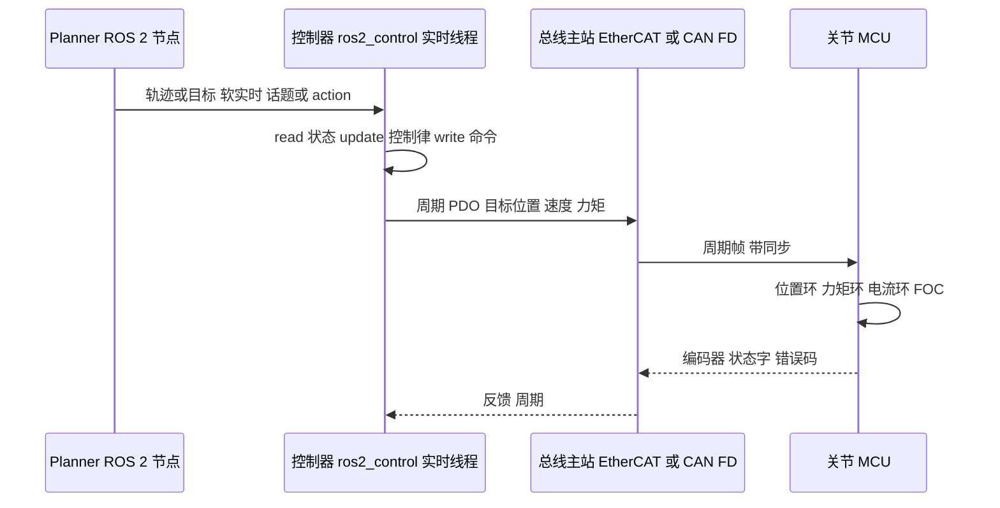

# 机器人行业如何解决实时性问题:软件架构调研

## 报告头

- **本报告回答的问题**:机器人行业怎么解决 MCU 或类似 Classic AUTOSAR 这类要求实时性的代码?它们的分层、调度、通信、诊断、安全机制,与 AUTOSAR Classic 如何一一对照?
- **调研日期**:2026-10(所有来源访问日期均为 2026-10)
- **主要来源类型**:Linux 内核/ROS 2/micro-ROS 官方文档、芯片厂商应用页(含营销材料,已标注)、新闻与学术论文、标准组织页面
- **证据标签**:[事实/有来源] [多来源一致] [分析师预测] [推断];厂商宣传用"(厂商营销)"标注
- **范围说明**:汽车 MCU 趋势见 [01-automotive-mcu-trends.md](01-automotive-mcu-trends.md) 与 [02-mcu-vendor-landscape-and-roadmaps.md](02-mcu-vendor-landscape-and-roadmaps.md),本报告不重复。硬件与标准见 [04-robotics-mcu-hardware-and-safety.md](04-robotics-mcu-hardware-and-safety.md)。

---

## 1. 核心结论先行

机器人行业**没有"一个 AUTOSAR"**。它用的是**分层 + 异构**:把"需要智能但不需要硬实时"的东西放到 Linux/SoC(ROS 2),把"硬实时"的东西下沉到 MCU/DSP/FPGA/实时核,中间用 EtherCAT / CAN FD / 核间通信(RPMsg)粘合。这和你熟悉的"多 ECU + 域控制器 + CAN/Ethernet"结构在思想上同构 [推断]。

---

## 2. 典型分层架构

| 层 | 典型运行环境 | 实时要求 | 举例 |
|---|---|---|---|
| 感知/规划/AI | Linux + ROS 2,GPU/NPU | 软实时 | Boston Dynamics Atlas(BD 官方页面已核对)与 Agility Digit 公开宣布使用 NVIDIA Jetson Thor 做机载 AI 计算 [Agility](https://agilityrobotics.com/content/agility-robotics-powering-the-future-of-robotics-with-nvidia-jetson-thor), [Boston Dynamics](https://bostondynamics.com/news/boston-dynamics-expands-collaboration-with-nvidia/) [事实/有来源] |
| 运动控制/全身控制 | PREEMPT_RT Linux 或 RTOS | 硬/准硬实时(周期性) | ros2_control 控制器管理器主线程尝试配置 SCHED_FIFO 优先级 50 [ros2_control 文档](https://control.ros.org/rolling/doc/ros2_control/controller_manager/doc/userdoc.html) [事实/有来源] |
| 总线 | EtherCAT / CAN FD | 确定性周期 | 见第 6 节 |
| 关节驱动 | MCU/DSP/实时 MPU | 硬实时(电流环) | 见 [04](04-robotics-mcu-hardware-and-safety.md) |

> 注:Tesla/Figure/Unitree 等公司内部的完整软件栈未公开,本报告不臆测其细节。[来源缺口]

---

## 3. 实时 Linux:PREEMPT_RT 与 Xenomai/EVL

### 3.1 PREEMPT_RT 已并入主线(已核实)
- PREEMPT_RT 于 2024-09-20 合入主线(Gleixner 9-19 提交 pull request,Torvalds 次日合并),随 Linux 6.12(2024-11-17 发布)正式提供实时能力,支持 x86_64、x86、ARM64、RISC-V,通过 `CONFIG_PREEMPT_RT` 打开 [heise](https://heise.de/-10061458), [eeNews Europe](https://www.eenewseurope.com/en/real-time-officially-comes-to-linux/) [多来源一致]
- 启用需在配置菜单选 EXPERT 选项 [ostechnix](https://ostechnix.com/?p=60312) [事实/有来源]
- 该补丁集由 Thomas Gleixner 2005 年发起,历经约 20 年 [eeNews Europe](https://www.eenewseurope.com/en/real-time-officially-comes-to-linux/) [事实/有来源]

### 3.2 Xenomai(Cobalt 双内核)与 EVL
- Xenomai 3 可作为双内核(Cobalt,实时协内核与 Linux 并行)或在主线 + PREEMPT_RT 上(Mercury)运行 [OSS Europe 2025 演讲](https://static.sched.com/hosted_files/osseu2025/66/xenomai_osseu2025.pdf), [Xilinx wiki](https://xilinx-wiki.atlassian.net/wiki/spaces/A/pages/18842435/Real-Time+Linux) [事实/有来源]
- 公开讨论认为:协内核在 RTOS 调度行为模拟、非实时行为检测、低端平台上有优势,但 PREEMPT_RT 更易用,多数场景两者延迟接近 [Sigma Star OSS EU 2025 摘要](https://osseu2025.sched.com/event/25Vn0/realtime-linux-beyond-preemptrt-exploring-xenomais-dual-kernel-approach-richard-weinberger-sigma-star-gmbh) [单一来源,会议摘要]
- EVL 的具体细节本次未取得一手来源。[来源缺口]
- **具体最坏延迟数值(us 级)本次未取得可靠公开数据,不列。**

---

## 4. RTOS 选项

| RTOS | 机器人相关事实 | 来源 |
|---|---|---|
| FreeRTOS / Zephyr / NuttX | micro-ROS 官方支持这三种 RTOS | [micro-ROS features](https://micro.ros.org/docs/overview/features), [micro-ROS RTOS](https://micro.ros.org/docs/concepts/rtos) [多来源一致] |
| SafeRTOS | 基于 FreeRTOS 功能模型,但并非 FreeRTOS 内核;预认证 IEC 61508 SIL 3(TÜV SÜD) | [FreeRTOS.org](https://FreeRTOS.org/FreeRTOS-Plus/Safety_Critical_Certified/SafeRTOS.html) [事实/有来源] |
| Eclipse ThreadX | 2023-11 起由 Eclipse 基金会托管,MIT 许可;此前获 SGS-TÜV Saar IEC 61508 SIL 4 等认证,安全工件由 Microsoft 贡献、由工作组维护 | [Wikipedia](https://en.wikipedia.org/wiki/ThreadX), [ThreadX FAQ](https://threadx.io/announcement-faq) [事实/有来源,认证细节以二手来源为准] |
| Zephyr | 安全委员会以 IEC 61508 Route 3S 为路径,目标 SIL 3/SC 3,2024 年获书面概念批准(尚非完成认证) | [Zephyr 安全概述](https://docs.zephyrproject.org/latest/safety/safety_overview.html), [TFiR](https://tfir.io/zephyr-rtos-10-years-safety-certification-sbom-edge-ai/) [事实/有来源] |
| QNX OS for Safety | TÜV Rheinland 认证 IEC 61508 SIL 3、ISO 26262 ASIL D;QNX 面向机器人推广(厂商营销) | [QNX 产品简介](https://qnx.software/content/dam/qnx-xwalk/pdf/product-briefs/qnx-os-for-safety-product-brief.pdf), [QNX robotics](https://qnx.software/en/industries/robotics) [事实/有来源,厂商营销] |
| VxWorks / PikeOS / RT-Thread | 本次仅找到 Wind River 与 eProsima 合作把 ROS 带到关键机器人应用 [Wind River 博客](https://windriver.com/blog/eprosima-and-wind-river-join-forces-to-enable-ros-on-critical-robotics-applications);PikeOS、RT-Thread 无有效来源 | [来源缺口] |

---

## 5. ROS 2 的实时相关机制

- **Executors / callback groups**:ROS 2 允许把节点回调分组;Jazzy 起 executor 大幅重构,StaticSingleThreadedExecutor 的改进已推广到其他 executor,该类被建议弃用 [ROS Discourse](https://discourse.openrobotics.org/t/the-ros-2-c-executors/38296), [rclcpp API](https://api.nav2.org/jazzy/html/classrclcpp_1_1executors_1_1StaticSingleThreadedExecutor.html) [事实/有来源]
- **ros2_control**:controller manager 实时循环按配置频率 read -> controller update -> write;hardware_interface 提供 read()/write(),controller_interface 提供 update();建议低抖动 [ros2_control 文档](https://control.ros.org/rolling/doc/ros2_control/controller_manager/doc/userdoc.html) [事实/有来源]
- **Lifecycle(managed)节点**:Unconfigured / Inactive / Active / Finalized 四个主状态,6 个过渡状态,离开主状态需外部监督者触发(Active 下错误例外)[ROS 2 设计文档](https://design.ros2.org/articles/node_lifecycle.html) [事实/有来源]
- **micro-ROS**:把 ROS 2 组件模型带到 MCU,采用 Micro XRCE-DDS(客户端-代理架构,XRCE Agent 代表资源受限客户端接入 DDS 全局数据空间);典型目标为 ARM Cortex-M4/M7(STM32、i.MX RT)和 ESP32,约 1 MB flash、约 200 KB RAM [Micro XRCE-DDS](https://micro.ros.org/docs/concepts/middleware/Micro_XRCE-DDS), [micro-ROS features](https://micro.ros.org/docs/overview/features) [事实/有来源]
- **ROS 2 官方实时编程指南**(避免动态内存分配等):本次抓取被拒(403),未能核实具体条文。[来源缺口]
- **DDS QoS**、**ROS 2 Real-Time Working Group**:本次未取得一手来源,不展开。[来源缺口]

---

## 6. 异构 SoC、hypervisor 与现场总线

### 6.1 Cortex-A + Cortex-M/R 与 OpenAMP
- OpenAMP 提供 RemoteProc(生命周期管理)与 RPMsg(基于 VirtIO + 共享内存的核间通信),用于 Linux 与 RTOS/裸机共存;NXP i.MX 8M、TI AM64x、STM32MP1、Xilinx Zynq-7000 等有 AMP 支持 [Promwad](https://promwad.com/news/rtos-linux-amp-systems), [OpenAMP 概述](https://wmamills-openamp-docs.readthedocs.io/en/main/openamp/overview.html), [CNX Software](https://www.cnx-software.com/2016/01/27/openamp-open-source-framework-provides-the-glue-between-linux-rtos-and-baremetal-apps-in-heterogeneous-socs/) [多来源一致]
- 学术工作探索 ROS + Zephyr + hypervisor 用于协作机器人 [TUM 论文](https://rtsl.cps.mw.tum.de/media/thesis/None/ROS_and_Zephyr_OS_and_Hypervisor_for_Collaborative_Robots.pdf) [事实/有来源]
- Hypervisor 在机器人中的量产案例:[来源缺口]

### 6.2 现场总线
| 总线 | 公开事实 | 来源 |
|---|---|---|
| EtherCAT | 周期可达 <=100 us;分布式时钟同步抖动典型 <1 us;"100 个伺服轴 100 us"等说法来自厂商/科普文章(营销倾向) | [GigaDevice](https://www.gigadevice.com/about/blog/ethernet-fieldbus-industrial-automation-robotics), [Design World](https://www.designworldonline.com/what-is-ethercat/) [多来源一致,含厂商营销] |
| EtherCAT 人形研究 | TUM 论文称基于 EtherCAT 的人形控制架构控制频率超过 2 kHz,I/O 延迟低于 1 ms | [TUM](https://portal.fis.tum.de/en/publications/an-ethercat-based-real-time-control-system-architecture-for-human/) [事实/有来源,单一学术来源] |
| CANopen / CiA 402 | 驱动器/运动控制设备 profile,基于有限状态机;CiA 402-6(2016)定义 CANopen FD 的 64 字节默认 PDO;2024-02 修订 402-2/-3 | [CiA](https://www.can-cia.org/can-knowledge/cia-402-series-canopen-device-profile-for-drives-and-motion-control) [事实/有来源] |
| CoE | CANopen over EtherCAT,把 CANopen 对象字典/PDO/SDO 用于 EtherCAT | [Synapticon](https://doc.synapticon.com/actilink_s/system_integration/coe_cia_402.html) [事实/有来源] |
| CAN-FD vs Ethernet | 人形系统通信接口通常是 CAN-FD 或基于以太网(含 EtherCAT) | [NXP](https://www.nxp.com/design/design-center/development-boards-and-designs/motor-and-motion-control-for-humanoids-and-mobile-robots:MOBILE-ROBOTICS-MOTION-CONTROL-HOLOSCAN-SENSOR) [厂商营销] |
| TSN | NXP/Renesas 产品页提及 TSN 支持;机器人中的实际部署规模无独立来源 | [Renesas RZ/T2M](https://www.renesas.com/sg/en/products/microcontrollers-microprocessors/rz-mpus/rzt2m-high-performance-multi-function-mpu-realizing-high-speed-processing-and-high-precision-control) [厂商营销] |

---

## 7. 控制回路速率(公开可查部分)

| 回路 | 公开数据 | 标签 |
|---|---|---|
| 总线级/全身控制 | EtherCAT 人形研究 >2 kHz | [事实/有来源] TUM |
| ros2_control | 频率可配置,由 controller manager 参数决定 | [事实/有来源] |
| 电流环 | Renesas RZ/T2M 宣称"电机电流环 <1 us"(厂商营销,指硬件环路能力,非整机指标) | [厂商营销] |
| 平衡/稳定 | 传感器检测倾斜、执行器"每秒数百次"修正 | [i-SCOOP 对 ISO 25785-1 的解释](https://www.i-scoop.eu/iso-25785-1-explained-and-what-it-means-for-humanoid-robot-safety/) [单一来源] |
| 典型 FOC 速率(10-20 kHz 级) | 未取得引用来源 | [来源缺口] |

---

## 8. 数据流:规划器 -> 控制器 -> 关节驱动

要点:**软实时到硬实时的边界是"缓冲/插值"**:规划器以较低、不严格的频率发出轨迹,实时线程按固定周期消费 [推断,与 ros2_control 的 read/update/write 模型一致]。

---

## 9. 故障处理与功能安全

- **STO(Safe Torque Off)**:切断产生力矩的能量,抑制驱动脉冲,对应 IEC 60204-1 停止类别 0;**SS1** 先受控减速再 STO,对应类别 1;驱动器内置安全功能标准为 IEC 61800-5-2 [Motion Control Tips](https://www.motioncontroltips.com/faq-what-are-typical-drive-based-safety-functions), [Siemens](https://mall.industry.siemens.com/mall/en/cn/Catalog/Products/10354472) [多来源一致]
- 安全功能通常集成在驱动器或安全 PLC 中(厂商文档如 SINAMICS、Mitsubishi 伺服)。机器人整机的看门狗/安全 PLC 具体拓扑未取得统一来源。[来源缺口]
- 对**主动平衡机器人**(人形/四足)而言,"断电即安全停止"不成立:断电会倒下,因此 ISO 25785-1(ISO/CD,Committee Draft 阶段)草案涉及受控下降、断电预警、跌倒区计算等 [i-SCOOP](https://www.i-scoop.eu/iso-25785-1-explained-and-what-it-means-for-humanoid-robot-safety/) [单一来源]。这使 STO 在人形上的含义和工业臂不同 [推断]。

---

## 10. 与 AUTOSAR Classic 的映射表

| AUTOSAR Classic | 机器人侧对应 | 相似度 / 差异 |
|---|---|---|
| OS(OSEK 任务、Alarm、Counter、ScheduleTable) | RTOS 任务+定时器;PREEMPT_RT 下 SCHED_FIFO 线程 + 定时唤醒;ROS 2 executor + timer | 概念相似;AUTOSAR OS 静态配置、可做调度分析,ROS 2 executor 动态得多 [推断] |
| 内存保护 / OS-Application / Safety OS | RTOS MPU 支持、hypervisor、QNX OS for Safety | 思想相近 [推断] |
| RTE(SWC 端口、Runnable 调度) | ros2_control(controller_interface / hardware_interface)与 ROS 2 中间件 | 都是"应用与驱动解耦"层;RTE 为代码生成、静态,ROS 2 为运行时发现 [推断] |
| COM / PduR / CanIf / CAN 驱动 | EtherCAT 主站、CANopen 栈、micro-ROS XRCE-DDS | 见下两行 |
| CAN 信号/PDU 周期报文 | CANopen / CoE 的 **PDO**(周期过程数据) | 高度对应 |
| Dcm / UDS 服务(0x22/0x2E/0x31) | CANopen/CoE 的 **SDO**(对象字典读写,非周期)与 CiA 301 诊断/EMCY | 部分对应:SDO 像 0x22/0x2E,但没有 UDS 的会话/安全访问分层 [推断] |
| Dem(DTC) | EMCY 报文、CiA 402 错误码/状态字 | 弱对应 [推断] |
| EcuM / BswM(启动/模式管理) | ROS 2 **lifecycle 节点**;CiA 402 状态机;CANopen NMT | 高度对应:均为显式状态机 [推断] |
| WdgM / 看门狗 | 驱动器与 MCU 看门狗、总线 watchdog、安全 PLC | 相近 [推断] |
| FuSa(ISO 26262 / ASIL) | IEC 61508 SIL、ISO 13849 PL | 见 [04](04-robotics-mcu-hardware-and-safety.md) |
| 多核 / 多分区 | AMP + OpenAMP RPMsg;Linux + RTOS 混合 | 对应 [推断] |
| Adaptive AUTOSAR(POSIX、SOME/IP、DDS) | ROS 2(POSIX、DDS) | 概念上最接近,但机器人缺乏统一的认证体系 [推断] |

---

## 结论要点

1. 机器人行业采用**分层异构**:Linux/ROS 2 做智能与软实时,实时 Linux/RTOS 做控制循环,MCU/DSP/实时 MPU 做电流/位置环 [多来源一致 + 推断]。
2. PREEMPT_RT 自 Linux 6.12 起进入主线(x86/ARM64/RISC-V),降低了"Linux 上做实时控制"的门槛 [多来源一致]。
3. RTOS 并无赢家通吃:micro-ROS 支持 FreeRTOS/Zephyr/NuttX;认证 RTOS 路线有 SafeRTOS、QNX OS for Safety、ThreadX、Zephyr(进行中)[事实/有来源]。
4. 现场总线上 EtherCAT + CiA 402 是通用基础,CAN FD/CANopen 常用于小关节和手部 [部分来源 + 推断]。
5. 公开的具体实时延迟数据很少,本次不引用无来源数字。

## 对你的意义

- **可直接迁移的 RH850 + AUTOSAR 技能**:周期任务设计、抖动/WCET 思维、CAN/CAN FD 帧与周期报文设计(= PDO)、诊断服务思维(= SDO/CiA 301)、状态机/模式管理(= lifecycle/NMT/CiA 402)、看门狗与安全机制。
- **需要补的差距**:Linux 实时调优(PREEMPT_RT、CPU 隔离)、ROS 2/DDS 基础、EtherCAT 主/从栈、FOC/电机控制、IEC 61508/ISO 13849 视角。
- **建议学习顺序** [推断]:CiA 402 状态机 -> ros2_control 的 hardware_interface -> 在 Zephyr/FreeRTOS 上做一个 CAN FD 关节节点(可复用你的 CAN 经验)。

## 来源列表(访问日期 2026-10)

- Linux 6.12 PREEMPT_RT:https://heise.de/-10061458 ; https://www.eenewseurope.com/en/real-time-officially-comes-to-linux/ ; https://ostechnix.com/?p=60312
- Xenomai:https://static.sched.com/hosted_files/osseu2025/66/xenomai_osseu2025.pdf ; https://osseu2025.sched.com/event/25Vn0/realtime-linux-beyond-preemptrt-exploring-xenomais-dual-kernel-approach-richard-weinberger-sigma-star-gmbh ; https://xilinx-wiki.atlassian.net/wiki/spaces/A/pages/18842435/Real-Time+Linux
- micro-ROS:https://micro.ros.org/docs/overview/features ; https://micro.ros.org/docs/concepts/middleware/Micro_XRCE-DDS ; https://micro.ros.org/docs/concepts/rtos
- ros2_control:https://control.ros.org/rolling/doc/ros2_control/controller_manager/doc/userdoc.html
- Executors:https://discourse.openrobotics.org/t/the-ros-2-c-executors/38296 ; https://api.nav2.org/jazzy/html/classrclcpp_1_1executors_1_1StaticSingleThreadedExecutor.html
- Lifecycle:https://design.ros2.org/articles/node_lifecycle.html
- OpenAMP:https://promwad.com/news/rtos-linux-amp-systems ; https://wmamills-openamp-docs.readthedocs.io/en/main/openamp/overview.html ; https://www.cnx-software.com/2016/01/27/openamp-open-source-framework-provides-the-glue-between-linux-rtos-and-baremetal-apps-in-heterogeneous-socs/
- RTOS 安全:https://FreeRTOS.org/FreeRTOS-Plus/Safety_Critical_Certified/SafeRTOS.html ; https://en.wikipedia.org/wiki/ThreadX ; https://threadx.io/announcement-faq ; https://docs.zephyrproject.org/latest/safety/safety_overview.html ; https://tfir.io/zephyr-rtos-10-years-safety-certification-sbom-edge-ai/ ; https://qnx.software/content/dam/qnx-xwalk/pdf/product-briefs/qnx-os-for-safety-product-brief.pdf ; https://qnx.software/en/industries/robotics ; https://windriver.com/blog/eprosima-and-wind-river-join-forces-to-enable-ros-on-critical-robotics-applications
- 总线:https://www.gigadevice.com/about/blog/ethernet-fieldbus-industrial-automation-robotics ; https://www.designworldonline.com/what-is-ethercat/ ; https://portal.fis.tum.de/en/publications/an-ethercat-based-real-time-control-system-architecture-for-human/ ; https://www.can-cia.org/can-knowledge/cia-402-series-canopen-device-profile-for-drives-and-motion-control ; https://doc.synapticon.com/actilink_s/system_integration/coe_cia_402.html
- 计算平台:https://agilityrobotics.com/content/agility-robotics-powering-the-future-of-robotics-with-nvidia-jetson-thor ; https://bostondynamics.com/news/boston-dynamics-expands-collaboration-with-nvidia/
- STO/安全:https://www.motioncontroltips.com/faq-what-are-typical-drive-based-safety-functions ; https://mall.industry.siemens.com/mall/en/cn/Catalog/Products/10354472 ; https://www.i-scoop.eu/iso-25785-1-explained-and-what-it-means-for-humanoid-robot-safety/
- 厂商:https://www.renesas.com/sg/en/products/microcontrollers-microprocessors/rz-mpus/rzt2m-high-performance-multi-function-mpu-realizing-high-speed-processing-and-high-precision-control ; https://www.nxp.com/design/design-center/development-boards-and-designs/motor-and-motion-control-for-humanoids-and-mobile-robots:MOBILE-ROBOTICS-MOTION-CONTROL-HOLOSCAN-SENSOR
- 学术:https://rtsl.cps.mw.tum.de/media/thesis/None/ROS_and_Zephyr_OS_and_Hypervisor_for_Collaborative_Robots.pdf
