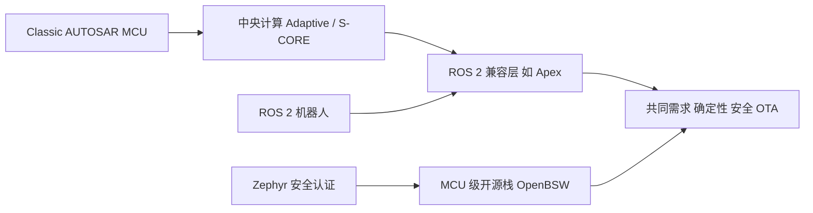

# 05 实时嵌入式软件平台的跨行业收敛：从 Classic AUTOSAR 到 ROS 2 / Zephyr / SDV 开源栈

## 本报告回答的问题

1. Classic AUTOSAR 为什么存在、标准化了什么？它和 Adaptive AUTOSAR、ROS 2、micro-ROS/Zephyr、厂商 RTOS 栈的边界在哪里？
2. 汽车与机器人（尤其人形机器人）的实时软件是否在收敛？有哪些可核实的信号？
3. 对一名 RH850 + Classic AUTOSAR 工程师，哪些技能可迁移，未来 6-12 个月该补什么？

## 调研日期

2026-10（所有来源访问日期 2026-10）。

## 主要来源类型

Eclipse / Zephyr / ROS 官方页面与新闻稿、AUTOSAR 技术科普、咨询机构公开摘要（McKinsey、Goldman Sachs、Morgan Stanley）、厂商新闻稿（标注为厂商宣传）、媒体报道。仅使用公开网页；未能核实的内容在「未核实缺口」中列出。

## 与本目录其他报告的关系

本目录 [01-automotive-mcu-trends.md](01-automotive-mcu-trends.md)（汽车 MCU 趋势）、[02-mcu-vendor-landscape-and-roadmaps.md](02-mcu-vendor-landscape-and-roadmaps.md)（MCU 厂商格局）、[03-robotics-realtime-software-architecture.md](03-robotics-realtime-software-architecture.md)（机器人实时软件架构）、[04-robotics-mcu-hardware-and-safety.md](04-robotics-mcu-hardware-and-safety.md)（机器人 MCU 硬件与安全）由其他调研负责，请直接阅读对应文件。本篇不重复硬件与厂商份额，聚焦「软件平台层」的横向对比与对读者的职业含义。仓库内背景知识见 [`docs/11-classic-autosar-primer/`](../11-classic-autosar-primer/README.md)、[`docs/12-industry-ecosystem/`](../12-industry-ecosystem/01-autosar-industry-landscape.md)。

标签说明：[事实/有来源]、[多来源一致]、[分析师预测]（注明机构+年份）、[推断]（本报告作者判断）。标注「厂商宣传」者为厂商自述，未独立验证。

---

## 1. Classic AUTOSAR 为什么存在、标准化了什么（简述）

- 目的：把 ECU 软件分成应用层（SWC）、运行时环境（RTE）、基础软件（BSW，含 MCAL）和 OS，使应用与具体 MCU / 供应商解耦，并用 ARXML 描述配置，由工具生成代码。[推断：基于仓库 primer 的架构描述]
- 标准化对象：分层架构与模块接口（ComM/Com/PduR/CanIf/Dcm/Dem/NvM/EcuM 等）、OSEK 风格的静态 OS、RTE 生成、方法论与 ARXML 交换格式。详见 [`docs/11-classic-autosar-primer/01-architecture-big-picture.md`](../11-classic-autosar-primer/01-architecture-big-picture.md)、[`docs/02-autosar-classic/01-classic-platform-overview.md`](../02-autosar-classic/01-classic-platform-overview.md)。
- 通信模型：Classic 采用基于信号的通信，经 CAN/LIN 等总线；Adaptive 采用基于服务的通信（SOME/IP over Ethernet）。[多来源一致：[dSPACE](https://www.dspace.com/ko/kor/home/news/engineers-insights/adaptive-autosar-autonomous.cfm)、[Embitel](https://www.embitel.com/blog/embedded-blog/adaptive-autosar-vs-classic-autosar)、[Promwad](https://promwad.com/news/autosar-adaptive-central-compute-classic-platform-bottleneck)；后两者带咨询/服务商营销色彩]
- Adaptive 的定位：提供 ARA（AUTOSAR Runtime for Adaptive Applications），基于 POSIX 操作系统，面向算力密集、需要动态部署与 OTA 的应用。[事实/有来源：[dSPACE](https://www.dspace.com/ko/kor/home/news/engineers-insights/adaptive-autosar-autonomous.cfm)、[Embitel](https://www.embitel.com/blog/embedded-blog/adaptive-autosar-vs-classic-autosar)]

---

## 2. 替代与相邻方案

### 2.1 Zephyr（RTOS，开源）

- Zephyr 安全工作组正按 IEC 61508 Route 3S 推进认证，目标 SIL 3，范围为内核子集（调度、IPC、内存管理，约 15,000 行），采用 SEooC 方式；2024 年获得 IEC 61508 认证概念的书面批准。驱动、HAL、工具链、应用仍由集成方负责。[事实/有来源：[Zephyr Safety Overview](https://docs.zephyrproject.org/latest/safety/safety_overview.html)、[Zephyr 项目新闻](https://www.zephyrproject.org/zephyr-project-rtos-first-functional-safety-certification-submission-for-an-open-source-real-time-operating-system/)]
- 汽车路径：项目表示在 IEC 61508 之后计划申请 ISO 26262（早期表述为 ASIL D）。这是计划而非已达成的认证。[事实/有来源：同上；另见 OSS EU/NA 2026 演讲 [Zephyr RTOS in Automotive Compliance](https://hosted-files.sched.co/osselcna2026/40/Zephyr_RTOS_in_Automotive_Compliance.pdf)]
- micro-ROS 已作为 Zephyr 项目成员并集成为 Zephyr 构建系统模块。[事实/有来源：[Zephyr 博客](https://zephyrproject.org/micro-ros-a-member-of-the-zephyr-project-and-integrated-into-the-zephyr-build-system-as-a-module/)]

### 2.2 Eclipse SDV 相关项目

- **Eclipse S-CORE（Safety Open Vehicle Core）**：面向高性能车载计算机的开源核心中间件栈，覆盖确定性、安全关键功能，目标方法论支持 ISO 26262；参与者在不同来源中的名单不完全一致：Eclipse 新闻稿列 BMW、Mercedes-Benz、Bosch、ETAS、QNX、Qorix、Accenture，其他报道另列 Aumovio、Elektrobit、Qualcomm 等（以 Eclipse 官方页面为准）。v0.5 目标 2025-10 发布（Eclipse 新闻稿，初始参考平台基于 QNX SDP 8.0，Linux 后续）；开发流程据称正接受认证机构审核（目标是 ISO 26262 方法论，而非已取得认证）。[事实/有来源：[Eclipse 新闻室](https://newsroom.eclipse.org/node/42222)、[Automotive World](https://www.automotiveworld.com/news/eclipse-s-core-releases-version-0-5-alpha-for-vehicle-middleware/)、[Eclipse S-CORE](https://eclipse.dev/score/)]。注意：它主要对标 Adaptive 层/中央计算，不是 MCU 级 Classic BSW 的替代。[推断]
- **Eclipse OpenBSW**：用 C++（至 C++14）实现的微控制器基础软件栈，含生命周期、CAN/DoCAN/UDS 通信、精简 OS 抽象（调度+事件，提供 FreeRTOS 实现）；早期版本支持 NXP S32K1 与 POSIX 平台。[事实/有来源：[Eclipse OpenBSW](https://projects.eclipse.org/projects/automotive.openbsw)、[ESR Labs 介绍](https://medium.com/@ESRLabs/openbsw-a-code-first-software-platform-for-automotive-microcontrollers-609d3406cf0d)]。OpenBSW 的初始贡献由 ESR Labs（Accenture 旗下）主导，GitHub 仓库版权头为“Copyright (c) 2024 Accenture”，Eclipse 项目页显示处于 Incubating 阶段、Apache-2.0；因此“Accenture 源头”已核实（来源：仓库 README、Eclipse 项目页、搜索摘要）。这是与读者最相关的开源 MCU 栈，但尚无 RH850 支持的来源。[推断]
- **COVESA**：核心产出是 Vehicle Signal Specification（VSS，2016 年提出），统一车辆数据模型；BMW 已把专有车辆数据映射到 VSS。属于数据模型层，不是 RTOS 或 BSW。[事实/有来源：[COVESA VSS PDF](https://covesa.global/wp-content/uploads/2024/05/COVESA-Vehicle-Signal-Specification-Enabling-Ecosystems_20240105.pdf)]
- **SOAFEE**：由 Arm 发起的云原生 SDV 架构；治理成员含 AWS、Bosch、Continental、CARIAD；2022 年称成员超过 50。主张软件跨硅复用、云到边缘部署、"shift left"。[事实/有来源：[Arm Newsroom](https://newsroom.arm.com/news/more-than-50-members-join-soafee)、[Digitimes 2022](https://www.digitimes.com/news/a20221027VL203.html)；Arm 为发起方，属厂商/联盟自述]

### 2.3 ROS 2 / Autoware / ros2_control / micro-ROS

- **ROS 2 + Zenoh**：Kilted Kaiju（2025 年 5 月）是首个把 Eclipse Zenoh 作为 Tier 1 中间件支持的 ROS 发行版，每个 Tier 1 中间件支持完整 SROS2 安全套件；rmw_zenoh 依赖 Zenoh router 做发现。[事实/有来源：[ROS 2 Kilted Kaiju 发布](https://www.openrobotics.org/blog/2025/5/23/ros-2-kilted-kaiju-released)、[官方发布页](https://docs.ros.org/en/kilted/Releases/Release-Kilted-Kaiju.html)]。已验证"Tier 1 支持"；"是否已成为默认 RMW"本次未验证。
- **ros2_control**：连接 ROS 逻辑与硬件接口，Resource Manager 管理硬件接口类，通过 URDF 的 `<ros2_control>` 标签配置；社区有基于 IgH EtherCAT Master 的 ethercat_driver 硬件接口，商业 EtherCAT 主站（acontis EC-Master）也提供 ROS 集成。[事实/有来源：[ethercat_driver_ros2](https://github.com/ICube-Robotics/ethercat_driver_ros2)、[acontis](https://acontis.com/en/ethercat-for-ros.html)；acontis 为厂商宣传]
- **micro-ROS（eProsima）**：把 ROS 2 带到 MCU；采用 Micro XRCE-DDS（DDS-XRCE），MCU 端为 Client，经 Agent 接入 DDS 全局数据空间；支持 FreeRTOS、Zephyr、NuttX；典型目标约 1 MB flash、200 KB RAM（Cortex-M4/M7、ESP32）。[事实/有来源：[micro-ROS 官方](https://micro.ros.org/docs/overview/features)、[Micro XRCE-DDS](https://micro.ros.org/docs/concepts/middleware/Micro_XRCE-DDS)]
- **Autoware**：本次检索未单独核实，见缺口（[03](03-robotics-realtime-software-architecture.md) 亦未覆盖）。

### 2.4 Apex.AI（Apex.OS / Apex.Grace）

- Apex.OS 称为"首个通过 ISO 26262 ASIL D 认证的开源操作系统"（实指基于 ROS 2 的认证中间件/框架）；Apex.Grace 基于 ROS 2，面向资源受限嵌入式与云，称通过 ISO 26262 ASIL D，适用 L2-L4 ADAS、国防、船舶、工业自动化。[厂商宣传：[Apex.AI Apex.OS](https://www.apex.ai/apex-os)、[Apex.Grace](https://www.apex.ai/apexgrace)]。这是"ROS 2 API + 汽车安全流程"收敛的最直接例子。[推断]。Apex.Ida 本次未检索到资料。

### 2.5 QNX、NVIDIA 等

- **QNX（BlackBerry）**：QNX OS for Safety (QOS) 8.0 称对齐 ISO 26262 ASIL D、IEC 61508 SIL 3、IEC 62304 Class C、ISO/SAE 21434，目标覆盖汽车、工业、机器人、医疗、国防；另提供 QNX Hypervisor 在单 SoC 整合多个 OS。[事实/有来源，含厂商宣传：[Nasdaq/Zacks 报道](https://www.nasdaq.com/articles/blackberrys-qnx-launches-qos-80-boost-secure-system-development)、[Zacks 机器人 FuSa](https://www.zacks.com/stock/news/2430147/bbs-qnx-unit-unveils-fusa-platform-for-advanced-robotics-safety)、[QNX 公司页](https://www.qnx.com/company/)]
- **NVIDIA**：Jetson Thor 基于 Thor SoC，面向人形机器人，称集成功能安全处理器、Blackwell GPU（800 TFLOPS FP8）；Isaac 平台与 GR00T 基础模型。[厂商宣传：[NVIDIA 新闻稿 2024](https://investor.nvidia.com/news/press-release-details/2024/NVIDIA-Announces-Project-GR00T-Foundation-Model-for-Humanoid-Robots-and-Major-Isaac-Robotics-Platform-Update/)]。Holoscan 与 DriveOS 本次未取得可引用来源。
- **Wind River、Vector、Bosch/ETAS 进入机器人**：未找到可靠公开来源，见缺口。仅有的相关事实：Bosch 与 Neura 在 CES 2026 后宣布合作共建数据基础（仅见检索摘要，未核实）；Hyundai 计划在美国自产 30 万+ 执行器（humanoid.guide 转述；“Mobis 为 Atlas 制造定制执行器”未核实）。[单一汇总来源，建议二次核实]

---

## 3. 对比矩阵

说明：以下为本报告基于上文来源与通用工程知识的综合，凡无直接来源的单元格均属 [推断]。

| 维度 | AUTOSAR Classic | AUTOSAR Adaptive | ROS 2（+ros2_control） | micro-ROS / Zephyr | 厂商 RTOS 栈（QNX 等） |
|---|---|---|---|---|---|
| 确定性 | 高，静态 OS（OSEK 系），固定周期 MainFunction | 中，POSIX，取决于底层 OS | 取决于 Linux/RT 配置与执行器，控制环常放 ros2_control 实时线程 | MCU 上较高（Zephyr/FreeRTOS） | 高（微内核 RTOS，厂商宣称硬实时） |
| 配置方式 | 静态，ARXML 离线配置与代码生成 | 动态，服务发现、运行时部署 | 动态，launch 文件、参数、URDF | 构建期 Kconfig/devicetree，运行期少量动态 | 混合 |
| 安全认证路径 | 成熟（商业 OS/BSW 提供 ISO 26262 ASIL D 包） | 有商业认证实现，开源 S-CORE 在推进 | 开源本体无认证；Apex 等商业分支称 ASIL D（厂商宣传） | Zephyr 内核 IEC 61508 进行中；micro-ROS 未见认证来源 | 预认证产品（ASIL D / SIL 3，厂商宣传） |
| 工具链 | Vector/EB/ETAS 等商业工具，配置与生成工具重 | 商业与开源并存 | 开源，rosdep/colcon/rviz 等 | west、Kconfig、开源调试 | 厂商 IDE 与支持 |
| 生态开放度 | 规范公开、实现商业为主 | 同左，部分开源 | 非常开放 | 开放 | 闭源商业 |
| 许可成本 | 高（工具与 BSW 授权，见 12 章） | 高 | 低（开源许可），商业支持另计 | 低 | 高 |
| 典型硬件 | RH850、S32K、TC3xx 等车规 MCU | 车规 SoC（多核 A 核） | x86/ARM Linux 计算机、Jetson | Cortex-M、ESP32 | ARM/x86 SoC，部分 MCU |
| 通信模型 | 基于信号：CAN/LIN/FlexRay | 基于服务：SOME/IP、以太网 | 发布订阅，DDS 或 Zenoh | XRCE-DDS 经 Agent 桥接 | POSIX 消息、可跑 ROS 2/AUTOSAR |
| 诊断/OTA | UDS（Dcm/Dem）+ 引导加载器，见 10 章 | 诊断与更新管理，支持动态更新 | 无统一汽车诊断标准，日志与 rosbag 为主 | 依赖应用自建 | 视产品 |

---

## 4. 收敛信号

1. **SDV 与开源汽车栈**：S-CORE 的出发点是"每家车厂和供应商都重复造中间件"，转向共享非差异化软件。[事实/有来源：[Eclipse 新闻室](https://newsroom.eclipse.org/node/42222)]。OpenBSW 同样提出"非差异化软件协作"。[事实/有来源：[Eclipse OpenBSW](https://projects.eclipse.org/projects/automotive.openbsw)]
2. **开源 RTOS 走向认证**：Zephyr 的 IEC 61508/ISO 26262 计划，使"MCU 上不再只有 AUTOSAR 或商业 RTOS"。[推断]
3. **机器人借用汽车安全流程**：Apex 在 ROS 2 上做 ASIL D 认证（厂商宣传）；ISO 25785-1 正在制定针对人形/腿式等主动平衡工业移动机器人的安全标准，目前为 ISO/CD（Committee Draft），工作草案 2025 年 5 月出现，工作组由美国代表团牵头，成员含 A3、Agility Robotics、Boston Dynamics。[事实/有来源：[i-SCOOP](https://www.i-scoop.eu/iso-25785-1-explained-and-what-it-means-for-humanoid-robot-safety/)、[ISO 页面](https://www.iso.org/standard/91469.html)]
4. **车企与供应商进入人形机器人**：
   - Hyundai Motor Group 在 CES 2026（2026-01）宣布 Atlas 量产计划：目标 2028 年起年产约 30,000 台 Atlas（其中 25,000+ 台供 Hyundai 自家制造体系使用，另有媒体写作 25,000 台），2028 年起在佐治亚 Metaplant 部署、2029 年扩展到 Kia 佐治亚工厂，并计划在美国年产 300,000+ 执行器（媒体转述：humanoid.guide、Axios、eWeek，未见 Hyundai 一手稿；Axios 页面 403 未能直接打开）。原稿“约十年内引入 3 万台”与“Hyundai Mobis 为 Atlas 制造定制执行器”本次未能复核，已删除/降为未核实；“Hyundai 完全控股 Boston Dynamics”仅见 Automotive World 标题（页面 403），降为[仅见标题]。
   - XPeng 于 2026-09-08 宣布在广州启用 IRON 人形机器人自动化产线（称 80%+ 核心工序自动化），目标 2026 年底量产、2027 年交付；媒体称初期月产 1,000+ 台、2030 年目标年产 100 万台，公司未披露产线额定产能（媒体转述公司目标，[humanoid.guide](https://humanoid.guide/?p=17841)、[Interesting Engineering](https://interestingengineering.com/ai-robotics/xpeng-iron-humanoid-robot-production)；原稿带截断的 Electrek 链接已删除，Interesting Engineering 页面本身未给出年产百万台目标）。
   - Xiaomi 于 2026-03-02 经微博称其人形机器人在 EV 工厂压铸车间放置自攻螺母，成功率 90.2%、连续自主运行 3 小时，采用 VLA + 强化学习（机型名未给出；原稿“CyberOne”未被该页面支持，已删除）；GAC 第三代 GoMate 的“核心部件自研”说法未复核（TrendForce 页面本次未打开）。[媒体报道：[Finviz](https://finviz.com/news/326566/tesla-rival-xiaomi-deploys-humanoid-robot-with-3-hours-of-autonomous-operating-time-at-ev-assembly-plant)、[TrendForce](https://trendforce.com/news/?p=34632)]
   - Tesla Optimus：报道称训练思路与 FSD 训练技术同源（"Optimus Academy"），且量产延迟。[媒体报道，弱来源：[AOL/Benzinga](https://www.aol.com/articles/tesla-rival-xpeng-expands-robotics-193013811.html)]
   - Counterpoint 分析称人形机器人依赖汽车产业获得增长（供应链与制造）。[分析师观点，Counterpoint：[文章](https://counterpointresearch.com/cn/insights/humanoid-robotics-leans-on-automotive-industry-for-future-growth)；正文未逐字核实]
5. **反向信号（保持怀疑）**：AUTOSAR Classic 的静态配置与工具授权成本，与机器人行业"快速迭代、开源"文化差异大，本报告未找到任何人形机器人量产采用 Classic AUTOSAR 的公开来源。[推断，基于缺乏证据]

---

## 5. 商业含义

### 5.1 市场规模（仅具名来源）

- 汽车软件与电子：McKinsey 页面（“through 2030”版）给出 2030 年全球汽车软件与电子市场约 4690 亿美元（2020–2030 CAGR 约 7%，由约 2380 亿美元起），其中 ECU/DCU 约 1440 亿、软件开发约 830 亿美元。原稿的“4620 亿/CAGR 5.5%/软件 800 亿”与该页面不一致，本次未能打开 2024 版原文（超时），**降级为“仅见搜索摘要，数字以 McKinsey 原文为准”**。[分析师预测，McKinsey（版本年份待核）：[来源](https://www.mckinsey.com/industries/automotive-and-assembly/our-insights/mapping-the-automotive-software-and-electronics-landscape-2024)]
- SDV：P&S Intelligence（原 PS Market Research）页面当前给出 2025 年约 3150 亿美元、2026 年 3409 亿、2032 年 5748 亿美元（2026–2032 CAGR 9.0%）；原稿引用的“2024 年 2917 亿→2030 年 4897 亿”是同一页面的旧版本，数字已变，说明该口径不稳定。[分析师预测，P&S Intelligence 2026：[来源](https://psmarketresearch.com/market-analysis/software-defined-vehicle-market-report)；小型研究公司，口径宽泛，请谨慎]
- 人形机器人：Goldman Sachs 2024-02-27 版预测 2035 年 TAM 约 380 亿美元、出货约 140 万台（GS 原页面已核对）；**2026-09-14 前后 GS 上调为 2035 年出货约 650 万台、市场约 1380 亿美元（2030 年出货 89 万台，原 25.6 万）**（经 humanoid.guide、Yahoo Finance 转述，GS 新版原文未能直接打开）。Morgan Stanley 2025：2050 年人形硬件年收入约 4.7 万亿美元、约 10 亿台，2035 年约 1300 万台（Tenten 转述已核对；原稿“2035 年超 2500 亿美元”未复核，删除）。[分析师预测，Goldman Sachs 2024 / 2026-09：[2024 文章](https://www.goldmansachs.com/insights/articles/the-global-market-for-robots-could-reach-38-billion-by-2035)、[humanoid.guide](https://humanoid.guide/goldman-raises-2035-humanoid-robot-forecast-to-6-5-million/)；Morgan Stanley：[Tenten 转述](https://developer.tenten.co/morgan-stanleys-bold-prediction-humanoid-robots-will-create-a-5-trillion-market-by-2050)]。预测差异大，这些数字应视为情景而非事实。
- 机器人嵌入式软件（RTOS/MCU 固件）的单独市场规模：未找到可靠具名来源。

### 5.2 需求走向 [推断]

- 车规 MCU 级 Classic 工作不会短期消失：车身、底盘、动力域仍以 MCU 为主（见 [01](01-automotive-mcu-trends.md)、[02](02-mcu-vendor-landscape-and-roadmaps.md)）。
- 增量需求偏向：中央计算/Adaptive/S-CORE、ROS 2 产品化、人形机器人关节与电机控制器固件、功能安全与认证流程。机器人关节执行器通常是 MCU/FPGA+电机控制+EtherCAT/CAN，与读者的 MCU 背景最接近（见 [04](04-robotics-mcu-hardware-and-safety.md)）。

### 5.3 技能迁移

| 可迁移 | 需补充 |
|---|---|
| RTOS 调度与优先级、ISR/任务模型（[06-os-task-isr](../02-autosar-classic/06-os-task-isr.md)） | ROS 2 概念：节点、话题、QoS、launch、rosbag |
| CAN 协议、驱动与 BusOff（[04-can-mcal](../04-can-mcal/01-can-hardware-basics.md)） | Linux PREEMPT_RT、cgroup/CPU 亲和性、延迟测量 |
| UDS/诊断、引导加载器、故障排查（[10-boot-debug](../10-boot-debug/README.md)） | 电机控制（FOC）、编码器、电流环 |
| MCU 外设驱动、寄存器级调试（[03-mcal](../03-mcal/)） | EtherCAT 主/从站、CiA 402、ros2_control |
| 功能安全意识、ARXML/配置思维 | Zephyr/devicetree、micro-ROS、Zenoh/DDS 基础 |

### 5.4 6-12 个月学习路线（建议）

1. **第 1-2 月，巩固本仓库主线**：完成 [`docs/02-autosar-classic/`](../02-autosar-classic/01-classic-platform-overview.md)（OS/MainFunction）与 [`docs/04-can-mcal/`](../04-can-mcal/14-can-driver-from-scratch.md)；用 [`docs/11-classic-autosar-primer/`](../11-classic-autosar-primer/README.md) 整理自己的架构图；用 [`docs/10-boot-debug/`](../10-boot-debug/README.md) 形成启动与诊断排障笔记。
2. **第 3-4 月，Zephyr/RTOS 横向对照**：在一块廉价 Cortex-M 板上用 Zephyr 复刻 CAN 收发与任务调度，与 Classic OS 概念逐项对比；读 Zephyr Safety 文档了解认证范围。可选：阅读 OpenBSW 源码（C++，含 CAN/UDS）。
3. **第 5-7 月，ROS 2 基础**：Linux 上完成 ROS 2 教程，了解 QoS，尝试 rmw_zenoh 与默认 DDS 的对比；做一个 micro-ROS 节点（MCU 发布传感器数据）。
4. **第 8-10 月，电机控制与实时**：学习 FOC 与 EtherCAT（IgH 或 acontis 试用），用 ros2_control 搭一个仿真或实物单关节；在 PREEMPT_RT 上测量抖动。
5. **第 11-12 月，安全与整合项目**：阅读 ISO 25785-1 公开信息与 ISO 26262 对照，做一个"MCU 关节控制器 + CAN/EtherCAT + ROS 2 上层"的小项目，作为跨行业作品集。

---

## 结论要点

1. Classic AUTOSAR 解决的是 MCU 级 ECU 软件的标准化与可认证性；它与 ROS 2 并非同层竞争，更接近"关节/控制器层"与"应用/感知层"的分工。[推断]
2. 开源正在进入汽车基础软件（S-CORE、OpenBSW）与 RTOS 认证（Zephyr），但均处于早期（v0.x、认证进行中）。[事实/有来源]
3. ROS 2 的 Zenoh 支持已达 Tier 1，通信层选择在增多。[事实/有来源]
4. 机器人借鉴汽车安全流程的证据（Apex、ISO 25785-1、QNX）存在，但多数为厂商宣传或草案阶段。
5. 车企进入人形机器人的信号很多，但量产时间与数量多来自企业目标与媒体转述，不应当作既成事实。
6. 市场预测口径与数值分歧大，仅可用作情景参考。

## 对你的意义

- 你的 RTOS、CAN、诊断、引导、MCU 驱动经验在机器人关节控制器层几乎直接可用；缺口主要是 Linux/ROS 2、电机控制与 EtherCAT。
- 不必放弃 AUTOSAR 方向：它在车规 MCU 仍是主流，同时关注 S-CORE、OpenBSW 与 Zephyr 是低成本的"期权"。
- 优先用小项目证明跨栈能力，而非追逐某一平台。

## 未核实缺口

Bosch/ETAS 与 Vector 进入机器人或非汽车业务、Wind River、NVIDIA Holoscan/DriveOS、Apex.Ida、Autoware 细节、Tesla Optimus 复用汽车软件的一手证据、机器人嵌入式软件的具名市场规模、人形机器人实际采用的实时软件栈（多数公司不公开）。

## 来源列表（访问日期均为 2026-10）

- Eclipse S-CORE：https://newsroom.eclipse.org/node/42222 ；https://eclipse.dev/score/ ；https://www.automotiveworld.com/news/eclipse-s-core-releases-version-0-5-alpha-for-vehicle-middleware/
- Eclipse OpenBSW：https://projects.eclipse.org/projects/automotive.openbsw ；https://medium.com/@ESRLabs/openbsw-a-code-first-software-platform-for-automotive-microcontrollers-609d3406cf0d
- Zephyr：https://docs.zephyrproject.org/latest/safety/safety_overview.html ；https://www.zephyrproject.org/zephyr-project-rtos-first-functional-safety-certification-submission-for-an-open-source-real-time-operating-system/ ；https://hosted-files.sched.co/osselcna2026/40/Zephyr_RTOS_in_Automotive_Compliance.pdf ；https://zephyrproject.org/micro-ros-a-member-of-the-zephyr-project-and-integrated-into-the-zephyr-build-system-as-a-module/
- ROS 2 / Zenoh：https://www.openrobotics.org/blog/2025/5/23/ros-2-kilted-kaiju-released ；https://docs.ros.org/en/kilted/Releases/Release-Kilted-Kaiju.html
- micro-ROS：https://micro.ros.org/docs/overview/features ；https://micro.ros.org/docs/concepts/middleware/Micro_XRCE-DDS
- ros2_control / EtherCAT：https://github.com/ICube-Robotics/ethercat_driver_ros2 ；https://acontis.com/en/ethercat-for-ros.html
- Apex.AI：https://www.apex.ai/apex-os ；https://www.apex.ai/apexgrace
- QNX：https://www.nasdaq.com/articles/blackberrys-qnx-launches-qos-80-boost-secure-system-development ；https://www.zacks.com/stock/news/2430147/bbs-qnx-unit-unveils-fusa-platform-for-advanced-robotics-safety ；https://www.qnx.com/company/
- NVIDIA：https://investor.nvidia.com/news/press-release-details/2024/NVIDIA-Announces-Project-GR00T-Foundation-Model-for-Humanoid-Robots-and-Major-Isaac-Robotics-Platform-Update/
- SOAFEE：https://newsroom.arm.com/news/more-than-50-members-join-soafee ；https://www.digitimes.com/news/a20221027VL203.html
- COVESA：https://covesa.global/wp-content/uploads/2024/05/COVESA-Vehicle-Signal-Specification-Enabling-Ecosystems_20240105.pdf
- AUTOSAR Classic/Adaptive：https://www.dspace.com/ko/kor/home/news/engineers-insights/adaptive-autosar-autonomous.cfm ；https://www.embitel.com/blog/embedded-blog/adaptive-autosar-vs-classic-autosar ；https://promwad.com/news/autosar-adaptive-central-compute-classic-platform-bottleneck
- ISO 25785-1：https://www.i-scoop.eu/iso-25785-1-explained-and-what-it-means-for-humanoid-robot-safety/ ；https://www.iso.org/standard/91469.html
- 车企与人形机器人：https://www.automotiveworld.com/news/hyundai-takes-full-control-of-robot-firm-boston-dynamics/ ；https://humanoid.guide/hyundai-plans-atlas-humanoid-robots-for-plant-rollout-by-2028/ ； https://humanoid.guide/?p=17841 ；https://interestingengineering.com/ai-robotics/xpeng-iron-humanoid-robot-production ；https://trendforce.com/news/?p=34632 ；https://finviz.com/news/326566/tesla-rival-xiaomi-deploys-humanoid-robot-with-3-hours-of-autonomous-operating-time-at-ev-assembly-plant ；https://www.aol.com/articles/tesla-rival-xpeng-expands-robotics-193013811.html ；https://counterpointresearch.com/cn/insights/humanoid-robotics-leans-on-automotive-industry-for-future-growth
- 市场规模：https://www.mckinsey.com/industries/automotive-and-assembly/our-insights/mapping-the-automotive-software-and-electronics-landscape-2024 ；https://psmarketresearch.com/market-analysis/software-defined-vehicle-market-report ；https://www.goldmansachs.com/insights/articles/the-global-market-for-robots-could-reach-38-billion-by-2035 ； https://humanoid.guide/goldman-raises-2035-humanoid-robot-forecast-to-6-5-million/ ； https://finance.yahoo.com/technology/ai/articles/goldman-sachs-just-supercharged-humanoid-135551371.html ；https://developer.tenten.co/morgan-stanleys-bold-prediction-humanoid-robots-will-create-a-5-trillion-market-by-2050
