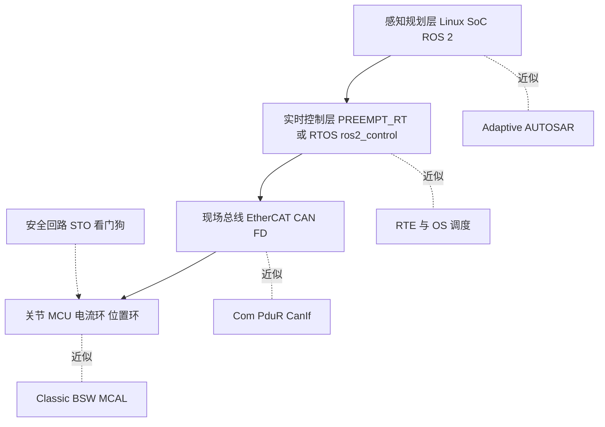

# 13 市场与行业调研：车载 MCU 趋势 与 机器人实时软件

- **目的**：回答两个问题，并说明它们对一名 RH850 + Classic AUTOSAR 工程师意味着什么。
  - Q1：目前 MCU 领域的趋势是什么？
  - Q2：机器人行业怎么解决 MCU / 类似 Classic AUTOSAR 这类要求实时性的代码？
- **调研日期**：2026-10（所有来源访问日期均为 2026-10）。本目录经过一轮事实核查，核查记录见 [`../reference/research/11-market-review-log.md`](../reference/research/11-market-review-log.md)。
- **证据标签**：[事实/有来源]、[多来源一致]、[分析师预测]（必注明机构与年份）、[推断]；厂商材料均视为营销。

## 阅读顺序

| 顺序 | 文件 | 摘要 |
|---|---|---|
| 1 | [01-automotive-mcu-trends.md](01-automotive-mcu-trends.md) | 车载 E/E 架构从域控走向区域 + 中央计算后，MCU 的技术线：多核/lockstep、新型嵌入式 NVM（RRAM/MRAM/PCM）、虚拟化、安全（PQC）、CAN XL/10BASE-T1S/TSN、OTA、RISC-V、开源 BSW。给出带机构与年份的市场数字。 |
| 2 | [02-mcu-vendor-landscape-and-roadmaps.md](02-mcu-vendor-landscape-and-roadmaps.md) | 谁占多大份额（注意口径）、各家主力家族对比、Renesas RH850 的公开路线图（U2C 2026 新品、Arm 化路线尚无具体量产型号的公开页面）、中国车规 MCU 厂商，以及对 RH850 用户的含义。 |
| 3 | [03-robotics-realtime-software-architecture.md](03-robotics-realtime-software-architecture.md) | 机器人的分层异构实时架构（ROS 2 + 实时 Linux/RTOS + 现场总线 + 关节 MCU），PREEMPT_RT、micro-ROS、ros2_control、OpenAMP、EtherCAT/CANopen，并给出与 Classic AUTOSAR 概念的逐项映射表。 |
| 4 | [04-robotics-mcu-hardware-and-safety.md](04-robotics-mcu-hardware-and-safety.md) | 机器人 MCU/SoC 选型（厂商宣传为主）、人形关节架构、ISO 10218 / 13849 / 3691-4 / 25785-1 等标准状态、车规 MCU 与 AUTOSAR 在机器人上的公开线索、市场预测（含 Goldman Sachs 新旧两版）与车企入局。 |
| 5 | [05-realtime-software-platforms-convergence.md](05-realtime-software-platforms-convergence.md) | 软件平台层横向对比（Classic/Adaptive/ROS 2/micro-ROS/Zephyr/QNX）、S-CORE 与 OpenBSW、Zephyr 认证、收敛信号与反向信号、技能迁移与 6–12 个月学习路线。 |

仓库内背景：[`../11-classic-autosar-primer/`](../11-classic-autosar-primer/README.md)、[`../12-industry-ecosystem/`](../12-industry-ecosystem/README.md)、[`../02-autosar-classic/`](../02-autosar-classic/01-classic-platform-overview.md)、[`../04-can-mcal/`](../04-can-mcal/01-can-hardware-basics.md)、[`../10-boot-debug/`](../10-boot-debug/README.md)。

## 一页纸结论

### Q1：目前 MCU 领域趋势是什么

1. **架构重新分工，而非 MCU 消失**：E/E 向区域（zonal）+ 中央计算迁移，MCU 负责实时 I/O、网关与安全岛；Yole 2025 预测车用 MCU 2030 年约 130 亿美元、CAGR 3%，是最大单一应用但并非高增长市场 [分析师预测]。
2. **价值向高端集中**：2025 全球 MCU 收入约 221 亿美元（-0.3%），Infineon 23.2% 居首，前五约 80%（Omdia 2025）[分析师数据]；车用口径各机构排名不一致。
3. **28 nm 是 eFlash 的天花板**：Infineon（RRAM，与 TSMC）、NXP S32K5（16 nm FinFET + MRAM）、ST（ePCM）各自押注新 NVM；Renesas 车规 RH850 目前仍是 28 nm，下一代 NVM 公开资料未给出。
4. **核架构多元化**：Arm Cortex-R52（ST Stellar、NXP S32Z/E、中国杰发 AC7870x）、TriCore（AURIX TC4x）、RH850（U2B/U2C，2026-03 还有新品 U2C）并存；Renesas 2023 路线图宣布 Arm 化 R-Car MCU，本次未找到具体量产型号。
5. **RISC-V 进入车规但仍在早期**：Quintauris（Bosch/Infineon/Nordic/NXP/Qualcomm，ST 2024-08 加入）做参考架构；Infineon 宣布 RISC-V AURIX 家族并已发布虚拟原型（2026-03），官方未给出量产日期。
6. **安全与隔离成为标配**：ASIL-D、硬件虚拟化/FFI 分区、HSM、PQC（NIST FIPS 203/204/205，2024-08）已写入 2025–2026 新品规格。
7. **车内网络升级**：CAN XL（ISO 11898-1:2024）、10BASE-T1S、TSN 进入新 MCU，但装车规模公开资料未给出。
8. **OTA 与存储联动**：新 NVM 支持按位写入，厂商宣传“无停机 OTA”，Fls/Fee/Bootloader 的擦除假设会变化 [推断]。
9. **软件栈：Classic 仍在演进，开源是补充**：AUTOSAR R25-11 发布（含 Classic 上的 DDS、Vehicle Data Protocol）；Eclipse S-CORE（面向中央计算）与 OpenBSW（MCU BSW，源头为 Accenture/ESR Labs）处于早期，Zephyr 的 IEC 61508 认证进行中。
10. **中国国产化提速但口径不一**：车规 MCU 国产率个位数到约 10%，厂商以 Arm R5/R52 为主追赶；认证周期与 OEM 锁定是障碍（媒体摘要）。

### Q2：机器人行业怎么解决 MCU / 类似 Classic AUTOSAR 的实时性代码

1. **没有“一个 AUTOSAR”**：机器人用“分层 + 异构”，把软实时（感知/规划/AI）放在 Linux/ROS 2，把硬实时下沉到 MCU/DSP/FPGA，用现场总线与核间通信粘合。
2. **分层架构**见下图；这与“域控 + ECU + CAN/Ethernet”在思想上同构 [推断]。
3. **实时 Linux**：PREEMPT_RT 于 2024-09-20 合入主线，随 Linux 6.12（2024-11-17）提供，支持 x86/ARM64/RISC-V；Xenomai 双内核仍有人用。
4. **控制线程**：ros2_control 的 controller manager 按固定频率 read → update → write，尝试设置 SCHED_FIFO 优先级；规划器到控制器的边界是“缓冲/插值”[推断]。
5. **MCU 上的 RTOS**：micro-ROS 支持 FreeRTOS/Zephyr/NuttX；认证路线有 SafeRTOS、QNX OS for Safety、Eclipse ThreadX，Zephyr 进行中。
6. **总线**：EtherCAT + CiA 402 是通用基础，CAN FD/CANopen 多见于小关节与手部；TUM 的 EtherCAT 人形架构报告 >2 kHz 控制、<1 ms I/O 延迟（单一学术来源）。
7. **异构核间通信**：OpenAMP（RemoteProc + RPMsg）在 Linux 与 RTOS/裸机间做生命周期管理与消息传递。
8. **安全**：靠 IEC 61508 / ISO 13849 / ISO 10218:2025（2025-02 发布）/ ISO 3691-4:2023；人形与腿式的 ISO 25785-1 仍是 Committee Draft；STO/SS1 在主动平衡机器人上含义不同（断电会倒）。
9. **汽车与机器人的趋同信号有，但多为厂商宣传或目标**：Infineon AURIX DRIVECORE TC4（含 Vector MICROSAR Classic）明确面向机器人，Apex.AI 在 ROS 2 上做 ASIL D 认证（厂商宣传）；未找到任何量产机器人采用 Classic AUTOSAR 的公开证据。
10. **市场只可当情景**：Goldman Sachs 2024-02 版 2035 年 TAM 约 380 亿美元，2026-09 上调为约 1380 亿美元/650 万台（经媒体转述）；Omdia 2025 年实际出货约 1.3 万台。

**与 AUTOSAR 概念的映射（详见 03 第 10 节）**：OS 任务/Alarm ↔ RTOS 任务/定时器/SCHED_FIFO；RTE ↔ ros2_control 的 hardware_interface/controller_interface；周期 PDU ↔ CANopen/CoE PDO；Dcm/UDS 服务 ↔ SDO（部分对应）；EcuM/BswM ↔ ROS 2 lifecycle、CiA 402 状态机、NMT；WdgM ↔ 驱动器/总线/安全 PLC 看门狗；Adaptive ↔ ROS 2（均基于 POSIX + DDS，但机器人缺统一认证体系）。

## 对你的意义

- **可迁移的技能**：周期任务与抖动/WCET 思维、CAN/CAN FD 帧与周期报文设计（= PDO）、诊断与引导/排障（= SDO/CiA 301 思维）、状态机/模式管理、看门狗与功能安全意识（ISO 26262 → IEC 61508/ISO 13849）、MCU 外设与寄存器级调试。
- **需要补的**：Linux 实时调优（PREEMPT_RT、CPU 隔离）、ROS 2/DDS/Zenoh 基础、EtherCAT 与 CiA 402、FOC/电机控制、Zephyr/devicetree、Arm R52/TriCore 的横向学习（启动、MPU、核间通信）、HSM/Csm/PQC 与 NVM 驱动。
- **策略**：RH850 经验在当前量产周期仍有直接价值；把“RH850 特有部分”和“AUTOSAR 通用部分”分开积累；用一个“MCU 关节控制器 + CAN FD/EtherCAT + ROS 2 上层”的小项目作为跨行业作品集（见 05 第 5.4 节）。

## 信息边界与可信度

- **公开来源**：仅使用公开网页（厂商新闻稿/产品页、标准组织页面、行业媒体、分析机构公开摘要）；付费研究报告正文未获取；访问日期 2026-10。
- **核查范围**：初稿主要依赖搜索摘要；核查轮对约 40 条关键论断逐一打开原页面或交叉搜索，结果见核查日志。仍有部分页面（ISO、Gasgoo、Axios、Goldman Sachs 新版原文等）返回 403/超时，只能依赖二手转述，已在正文标注。
- **厂商营销**：芯片规格、认证、“业界首个”等均为厂商自述，不等于量产或市占。
- **分析师预测**：不同机构口径（TAM/收入/保有量/出货）不同，且同一机构页面会更新（例如 Goldman Sachs 人形预测在 2026-09 上调；Meticulous、P&S 的页面数字也已变动）；一律当情景而非事实，并带机构+年份引用。
- **来源缺口**：很多机器人公司的内部软件栈与 MCU 选型不公开，本目录不臆测。

## 最大的开放问题

1. Renesas 的 Arm 化 R-Car MCU / crossover 何时、以何种型号量产？RH850 在 28 nm 之后是否有下一代与明确 longevity 承诺？
2. Infineon RISC-V AURIX 的样品/量产日期（官方稿未给出）？Renesas 是否会推出车规 RISC-V 主控？
3. RRAM/MRAM/PCM 在量产 ECU 中对 Fls/Fee/Bootloader 与 OTA 的实际影响？
4. 人形机器人量产公司实际使用什么实时软件栈与关节 MCU（多数不公开）？
5. ISO 25785-1 何时发布，其对 MCU/安全架构的具体要求？
6. 车规 MCU + Classic AUTOSAR 是否会在机器人上出现量产案例，还是始终停留在厂商推广？
7. Goldman Sachs 2026-09 新版预测的原文口径与假设（本次仅见转述）。
