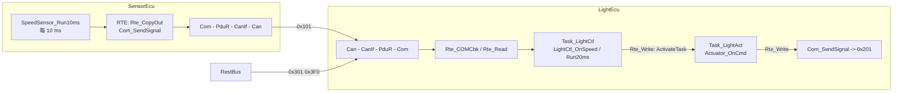

# 01 项目总览：两个 ECU、一条 CAN、一套完整的 Classic AUTOSAR 纵向通路

> 本章回答：(1) `mini_autosar_ecu` 做了什么场景、目录怎么对应 AUTOSAR 的层、每个目录在真实项目里对应什么？(2) 为什么选 STM32L552 + Renode + GCC，它们和 RH850 的距离有多远？(3) 项目里哪些东西是真实的、哪些是为了教学做了简化？
> Prerequisite: [README](README.md)；[11/01 架构全景](../11-classic-autosar-primer/01-architecture-big-picture.md)（分层概念）    Next: [02 配置与生成](02-config-and-generation.md)
> 对应代码：`examples/mini_autosar_ecu/`（`README.md`、`DESIGN.md` §1–§4、§10、§17；`tools/run_mini_autosar.py`；`target/renode/mini_autosar_2ecu.resc`；`target/stm32l552/linker/stm32l552_autosar.ld`）
> 对应规范（R25-11）：分层与模块划分见 `AUTOSAR_CP_EXP_LayeredSoftwareArchitecture`；本章不引用具体 SWS 条目，规范引用从第 03、04 章开始。
> 深入阅读：[02-autosar-classic/02 分层架构](../02-autosar-classic/02-layered-architecture.md)、[01-rh850/04 启动过程](../01-rh850/04-startup-process.md)、[04-can-mcal/](../04-can-mcal/07-hoh-hrh-hth.md)

---

## 1. 本章要回答的问题

| # | 问题 | 小节 |
|---|---|---|
| 1 | 这两个 ECU 各做什么，信号怎么流动？ | §2 |
| 2 | 每个目录属于哪个 AUTOSAR 层，真实项目里对应什么？ | §3 |
| 3 | 为什么是 STM32L552 + Renode + GCC？ | §4 |
| 4 | 这个项目换成 RH850 要改哪些文件？ | §5 |
| 5 | host 构建与 target 构建是什么关系？ | §6 |
| 6 | 和真实 ECU 相比，简化了什么？ | §7 |

## 2. 场景：两个 ECU + 一个 rest-bus

**[Educational Implementation]** 场景定义在 `DESIGN.md` §1 与 §11；通信矩阵（500 kbit/s，经典 CAN，11 位 ID）如下，数据来自 `config/system/System.arxml:120-123`（CAN-FRAME）与 `:83-113`（I-SIGNAL-I-PDU）：

| CAN ID | 帧 | 发送者 | 接收者 | DLC | 周期 | 内容（小端） |
|---|---|---|---|---|---|---|
| `0x101` | VehicleSpeed | SensorEcu | LightEcu | 2 | 20 ms（I-PDU 周期） | `VehicleSpeed` uint16 @bit0，0.1 km/h |
| `0x201` | LightStatus | LightEcu | 总线 | 6 | 100 ms | `HeadlightStatus` uint8 @bit0；`OdometerDistance` uint32 @bit16，米 |
| `0x301` | AmbientLight | RestBus | LightEcu | 1 | 100 ms | `AmbientLight` uint8，0..255 |
| `0x3F0` | EcuModeReq | RestBus | LightEcu | 1 | 100 ms | 0 = RUN，1 = POST_RUN |

信号怎么在 ECU 里流动（这张图是后面所有章节的"主线"）：



LightEcu 的业务逻辑（`swc/LightControlSWC/LightControlSWC.c:56-100`）：环境光 < 100 → 近光（LOW，cmd=1）；环境光 < 30 且车速 ≥ 60.0 km/h → 远光（HIGH，cmd=2）；
收到 `0x3F0` 的 POST_RUN 请求后（`BswM` 规则 → `Rte_Switch_P_EcuMode_EcuMode`）强制关灯。
这些行为在 `artifacts/mini-autosar/renode/uart_b.log` 里都能看到：

```
[000500114] ECUB SWC   LightCtl cmd=1 speed=409 ambient=60 postrun=0
[001500126] ECUB SWC   LightCtl cmd=2 speed=1464 ambient=20 postrun=0
[003010517] ECUB SWC   LightCtl cmd=0 speed=1464 ambient=20 postrun=1
[003520151] ECUB SWC   LightCtl cmd=2 speed=1464 ambient=20 postrun=0
```

即 0.5 s 近光、1.5 s 远光、3.0 s 进 POST_RUN 关灯、3.5 s 回 RUN 恢复。这 4 行正是 `tools/run_mini_autosar.py` 里 `check_scenario` 检查的"期望可观测行为"（`DESIGN.md` §11.3）。

## 3. 模块地图：目录 → AUTOSAR 层 → 真实世界对应物

**[Industry Practice]** 右列的商业产品名只是行业里"这一块通常由谁提供"的参照，本项目不使用它们。

| 目录 | AUTOSAR 层 | 本项目里它是什么 | 真实项目里对应什么 |
|---|---|---|---|
| `swc/<Swc>/*.c` | Application SW | 4 个手写 SWC，只 include `Rte_<Swc>.h`（第 05 章） | OEM / Tier1 的应用代码；常由 DaVinci Developer / SystemDesk 建模、手写 C 实现 |
| `config/swc/SwcTypes.arxml` | SWC 描述 | 简化 ARXML：数据类型、端口接口、SWC 类型、Runnable、RTE Event | SWC 描述 ARXML（`SoftwareComponentTemplate`） |
| `config/system/System.arxml` | 系统描述 | 简化 ARXML：ECU 实例、SWC 原型与连接、S/R→信号映射、通信矩阵 | System Description + 通信矩阵（DBC/ARXML 导入） |
| `config/ecuc/<Ecu>.ecuc.json` | ECU 配置 | JSON 形式的 ECUC：Os / Rte / Com / PduR / CanIf / Can / EcuM / BswM / MCAL | ECU Configuration ARXML；DaVinci Configurator Pro、EB tresos、RTA-CAR 等配置器里编辑 |
| `generator/*.py` | RTE 生成器 + BSW 配置器 | `gen_rte.py` 一次产出 RTE、OS 配置、全部 BSW 配置 | Vector MICROSAR RTE 生成器、ETAS RTA-RTE、各 BSW 配置器 |
| `gen/<Ecu>/*` | 生成物 | `Rte.c`、`Rte_Tasks.c`、`Rte_<Swc>.h`、`Os_Cfg.c`、`Com_Cfg.c` … | 项目里的 `Rte*.c/h`、`Os_Cfg.*`、`*_Cfg.*`、`*_Lcfg.c`、`*_PBcfg.c`（通常不入库，这里入库为了好读） |
| `rte/Rte_Common.h` | RTE 固定部分 | 手写：`RTE_E_*` 错误码、`Rte_Start/Rte_Stop` 声明 | 标准化的 `Rte_Type.h` 固定部分 |
| `os/include`、`os/src` | OS | 自写的迷你 OSEK/AUTOSAR OS 内核（可移植部分）（第 03 章） | 供应商 OS（如 Vector MICROSAR OS、ETAS RTA-OS、各家 MCU 厂商 OS） |
| `os/port/cm33`、`os/port/host` | OS port | Cortex-M33 的 PendSV 移植；Windows Fiber 的 host 移植 | OS 供应商为每个核提供的 port（RH850 / Cortex-M / TriCore …） |
| `bsw/com`、`bsw/pdur`、`ecual/canif` | 通信栈 | Com / PduR / CanIf 子集（第 06 章） | MICROSAR / RTA-BSW 等通信栈 |
| `bsw/ecum`、`bsw/bswm`、`bsw/schm`、`bsw/det` | 系统服务 | EcuM（flex 子集）、BswM 规则引擎、SchM 临界区宏、Det | 同上，系统服务模块 |
| `ecual/iohwab` | ECU 抽象 | `IoHwAb_GetWheelSpeed`、`IoHwAb_SetHeadlight` | ECU 集成者写的 IoHwAb（规范只给方法论，不给标准 API） |
| `mcal/{can,mcu,port,dio,adc}` | MCAL | 硬件无关层 + STM32L552 寄存器后端 | 芯片厂商 MCAL（Infineon / NXP / Renesas 的 MCAL 包） |
| `include/` | 基础头 | `Std_Types.h`、`Platform_Types.h`、`Compiler.h`、`MemMap.h`、`Trace.h` … | 标准基础头 + 项目 `MemMap.h` |
| `integration/` | 集成 | `Main_Target.c`（`main` 只调 `EcuM_Init`）、`Os_Hooks.c` | 集成者写的 `main`、OS Hook 实现 |
| `target/stm32l552/{startup,linker}` | 启动与链接 | 向量表、`Reset_Handler`、链接脚本 | 厂商启动文件 + 编译器相关 `.ld` / `.lsl` |
| `target/renode`、`sim/host` | 台架 / vECU | Renode 三机场景；host 的虚拟 CAN 与寄存器模型 | HIL 台架、CANoe、vECU（dSPACE VEOS、vVIRTUALtarget） |
| `tests/unit` | 单元测试 | 每个 BSW/RTE/OS 模块的行为规格 + 生成器黄金文件测试 | 供应商的模块测试 + 集成者的回归 |
| `tools/` | 构建链 | `run_mini_autosar.py`、`analyze_image.py`、`gdb/` | Make/CMake/Jenkins、map 查看器、Lauterbach TRACE32 脚本 |

**[AUTOSAR Standard]** 层规则在代码里被遵守（`DESIGN.md` §4）：只向下调用；SWC 只 include 自己的 `Rte_<Swc>.h`；MCAL 只经 `Mmio.h` 访问寄存器。
读完 02–04 章你会看到，"SWC 只能用它被配置了的 API"是靠生成**契约头**来强制的（RTE SWS R25-11 p.590, SWS_Rte_01004：应用头文件只含与该组件相关的信息）。

## 4. 为什么 STM32L552 + RAMN + Renode + GCC

**[Educational Implementation]** 选型理由（`DESIGN.md` 头注释与 §10；`target/renode/mini_autosar_2ecu.resc`）：

| 选择 | 理由 |
|---|---|
| **开源工具链** | xPack `arm-none-eabi-gcc` 15.2.1 + Renode 1.17.0 portable（`tools/setup_toolchains.py` 一键下载），没有 license、可重现、CI 友好。RH850 的真实工具链（Green Hills / IAR / CS+）和仿真器（E2 / Lauterbach）都不能随仓库发布 |
| **STM32L552（Cortex-M33）** | 外设里有 FDCAN（CAN 控制器）、ADC、GPIO、SysTick、NVIC，足够跑完整的 CAN 通信栈；Renode 对它有成熟的模型 |
| **RAMN 板定义** | Toyota 开源的 Resistant Automotive Miniature Network 板，Renode 自带 `platforms/boards/ramn.repl` 和多节点 CAN 的 `.resc` 样例；本项目的三机场景直接沿用其 `CreateCANHub` 写法（`mini_autosar_2ecu.resc:8-11`） |
| **Renode** | 能把三块"板子"（两个 ECU + rest-bus）连在同一个 `CANHub` 上（`:13-29`），每台机器的 UART1 写成文件（`CreateFileBackend`），这些 UART 文件就是 trace 日志；还带 GDB server（第 09 章） |
| **同一份源码另编 host 版** | 在 PC 上用虚拟时间跑，逐字节可重复，便于单元测试与回归；target 版才有真正的 SysTick / PendSV / NVIC 行为 |

`artifacts/mini-autosar/summary.txt` 显示两条路径都是绿的：host 的 `B: headlight HIGH` 在 `t=1500000us`，Renode 的在 `t=1500126us`，差约 126 µs（真实中断与 UART 延迟）。**注意**：Renode 的 µs 时间戳每次运行会有几 µs～几十 µs 的抖动（本系列里引用的数值是某一次运行的快照）；结构、顺序、事件名是稳定的，对照时请看"哪一行在哪一行之后"，不要逐位比较数字。

## 5. 与 RH850 的映射：只有 MCAL 与 OS port 会变

**[Conceptual]** 本仓库的主线硬件是 RH850（`docs/01-rh850/`、`docs/04-can-mcal/`），这个项目是"同样的分层，在开源硬件上能跑起来的版本"。
按文件分，换到 RH850 时：

| 保持不变（与芯片无关） | 要换（与芯片相关） | 对应 RH850 资料 |
|---|---|---|
| `swc/*`、`config/*`、`generator/*`、`gen/*`（除 `Os_Cfg.c` 里 `irqNumber`/`nvicPriority` 的取值含义） | `os/port/cm33/Os_Port_Cm33.c`：PendSV、SysTick、BASEPRI/PRIMASK、`Os_Cm33_IrqEntry` | [01-rh850/06 中断与异常](../01-rh850/06-interrupt-exception.md)（INTC、EIC、`DI/EI`、PSW.ID、PMR；§8.5 有 AUTOSAR OS ISR 与 RH850 硬件的对应表） |
| `os/src/*`（Os_Core / Task / Event / Alarm / Resource / Interrupt） | `os/port/cm33/Mini_Time_Target.c`：SysTick 1 kHz | RH850 用 OSTM 做系统 tick（`01-rh850/06` 头注释的 HW-E §22.1.4） |
| `bsw/com`、`bsw/pdur`、`ecual/canif`、`bsw/ecum`、`bsw/bswm`、`bsw/schm`、`bsw/det` | `mcal/can/Can_Hw_Stm32.c`（FDCAN 寄存器后端） | RH850 RS-CAN(FD)：[04-can-mcal/02](../04-can-mcal/02-rh850-can-peripheral.md)、[09 初始化](../04-can-mcal/09-can-init-implementation.md)、[10 发送](../04-can-mcal/10-can-write-implementation.md) |
| `rte/Rte_Common.h`、`include/*`（除 `MemMap.h` 的编译器属性写法） | `mcal/{mcu,port,dio,adc}/*.c` 里的寄存器常量；`mcal/mmio/Mmio.h` 的地址空间 | [03-mcal/](../03-mcal/) 系列；RH850 的时钟（PLL）、端口（PMC/PFC）等 |
| `tests/unit/*`（行为规格，host 上跑） | `target/stm32l552/startup/startup.c`（向量表、`Reset_Handler`）与 `.ld` | [01-rh850/04 启动](../01-rh850/04-startup-process.md)、[05 链接脚本](../01-rh850/05-linker-script.md) |

要点：**RTE 生成器、OS 内核、通信栈对芯片一无所知**，所以移植面小而清晰：一个 OS port（约 360 行，`os/port/cm33/Os_Port_Cm33.c`）、若干 MCAL 寄存器后端、启动文件与链接脚本。
`DESIGN.md` §6.4 把 Cortex-M 的做法和 RH850 的做法并排列了出来（NVIC / PendSV / `BASEPRI` 对 INTC / EIINT / `DI` `EI` / PMR）。第 09 章会专门写移植清单。

## 6. 两种构建：host 与 target

**[Educational Implementation]** 同一份 SWC / RTE / OS 内核 / BSW 源码，两种构建（`DESIGN.md` §10；编译参数在 `tools/run_mini_autosar.py:139-146`）：

| 项 | target | host |
|---|---|---|
| 编译器 | `arm-none-eabi-gcc -mcpu=cortex-m33 -mthumb -Os`，`-DMINI_PLATFORM_TARGET` | 主机 `gcc -O0`，`-DMINI_PLATFORM_HOST` |
| OS port | `os/port/cm33`（PendSV 真正切换上下文） | `os/port/host`（Windows Fiber，虚拟时间） |
| 时间 | SysTick 硬件 1 kHz | `SimTime` 虚拟时间，只在 Idle 循环与 `Os_HostBurn()` 推进 |
| MCAL 寄存器 | `Mmio.h` 内联 `volatile` 访问真实地址 | `SimMmio`：寄存器堆 + GPIO/ADC 行为模型 |
| CAN | `Can_Hw_Stm32.c` + Renode `STM32_FDCAN` + `CANHub` | `Can_Hw_Sim.c` + `SimCan`（文件互联：ECU_A 的 TX 日志就是 ECU_B 的 RX 脚本） |
| 输出 | USART1 → Renode 文件 `renode/uart_*.log` | stdout + `--log` 文件 `host/ecuA.log`、`ecuB.log` |
| 入口 | `integration/Main_Target.c:11-15`：`main` → `EcuM_Init()` | `sim/host/HostMain.c` |

源文件选择规则（`tools/run_mini_autosar.py:94-101`）：文件名含 `_Stm32` / `_Target` 或位于 `os/port/cm33/`、`target/` 的只进 target；含 `_Sim` / `_Host` 或位于 `os/port/host/`、`sim/host/` 的只进 host；其余两边共用。

这意味着：**生成器、SWC、RTE、OS 内核在两边是同一个 C 文件**；同一份 `gen/LightEcu/Rte_Tasks.c` 既在 Windows 的 Fiber 上跑，也在 Cortex-M33 的 PSP 栈上跑。
两者的 trace 不是逐字节相同（target 有 µs 级的真实延迟），但事件顺序一致，时间在 ±60 ms 容差内等价（`README.md` 的 "host 与 target 的差别"）。
一个对比（同一事件，两边的 trace）：

```
host  : [000020000] ECUB OS    ALARM Alarm_LightCtl20ms          (artifacts/mini-autosar/host/ecuB.log)
target: [000020000] ECUB OS    ALARM Alarm_LightCtl20ms          (artifacts/mini-autosar/renode/uart_b.log:61)
host  : [000020000] ECUB OS    EVENT_SET Task_LightCtl mask=0x1
target: [000020022] ECUB OS    EVENT_SET Task_LightCtl mask=0x1   <- 22 us 之后：真实 CPU 执行了 trace 打印
```

## 7. 哪些是简化、哪些是真实

| 方面 | 本项目 | 真实 ECU 项目 |
|---|---|---|
| 配置格式 | SWC / 系统描述是 ARXML **子集**（无命名空间、无 UUID、引用用纯路径）；ECUC 用 **JSON**（`DESIGN.md` §5.1） | 完整 ARXML（AUTOSAR XSD），ECUC 也是 ARXML，文件大 ~10 倍 |
| 生成器 | 一个 Python 脚本，确定性输出，**生成物入库** | 商业配置器；生成物一般不入库，由构建链每次生成 |
| RTE | 单实例（无 `Rte_Instance` 参数）；`Rte_Call_*` 做成普通函数（便于下断点与 trace）；无 queued S/R、无异步 C/S、无 IRV、无多分区 | 完整 RTE，大量宏 / 内联优化；多分区、多核、队列通信 |
| OS | SC1 子集：基本 / 扩展任务、固定优先级抢占、Event、Alarm、Resource（天花板）、Cat2 ISR、Hook；**无** ScheduleTable、OS-Application、内存保护、多核、IOC、Spinlock | 完整 SC1–SC4 |
| 通信栈 | Com 单 I-PDU group、无 signal group / 更新位 / 过滤 / 超时监控；PduR 仅 IF 1:1 路由；CanIf 无队列 | 完整栈，含 TP、Gateway、诊断 |
| 系统服务 | EcuM 只有 flexible 子集，无休眠 / 唤醒；BswM 条件只有"值 == 期望" | 完整 EcuM / BswM / ComM / NvM / Dcm / Dem |
| 内存映射 | `MemMap.h` 用 GCC `section` 属性宏（`include/MemMap.h`），不用 `#pragma` 机制，也不用 `FUNC()/P2VAR()` 编译器抽象宏 | 标准 MemMap + Compiler_Cfg |
| 安全 / 诊断 | 无 UDS、无 Dem、无看门狗管理、无 SafeRTE | 量产项目必备 |

完整偏离清单见 `DESIGN.md` §17（18 项）。**读代码时的态度**：把它当作"能完整跑通的最小骨架"：结构（谁调用谁、配置如何变成代码）是真实的，规模是缩小的。

## 8. 动手实验

**实验 1：跑一遍，读汇总。**

```
python examples/mini_autosar_ecu/tools/run_mini_autosar.py
```

打开 `artifacts/mini-autosar/summary.txt`：最上面是 `OK=89 FAIL=0 SKIP=0`；
往下看 `sim` 和 `renode` 两组，同样的 12 条场景检查在两种构建上各过一遍（时间戳不同）。

**实验 2：host / target 的 trace 对比。** 取同一事件，在两个日志里找：

```
grep -n "LightCtl cmd=" artifacts/mini-autosar/host/ecuB.log artifacts/mini-autosar/renode/uart_b.log
```

host 的时间戳是整齐的 `…0000`（虚拟时间只在 Idle 与 Burn 推进），target 的是 `…0114`、`…0125` 这样带 µs 抖动的值。想一想：为什么 host 上一个 ms 内所有行时间戳相同，而这不影响行序的因果性？（提示：`DESIGN.md` §6.5。）

**实验 3：看文件分类。** 在 `tools/run_mini_autosar.py:94-101` 的规则下，判断 `os/port/host/Os_Port_Host.c`、`sim/host/Can_Hw_Sim.c`、`mcal/can/Can.c` 分别进哪个构建？（答案：host / host / 两者。）

**实验 4：看 target 的内存占用。** 打开 `artifacts/mini-autosar/analysis/LightEcu.md` 的 "Per-module contribution"：LightEcu 总共 Flash 16776 B、RAM 10232 B（`summary.txt`），其中 OS 内核代码 3368 B，RTE（生成）代码仅 742 B、`.bss.rte` 33 B。
RTE 很小，是因为这个 ECU 只有 3 个 SWC、5 个信号；它的**结构**与真实 RTE 相同，规模差几个数量级。

## 9. 对照真实项目

**[Industry Practice]**

* 真实项目里"配置—生成—编译—链接—map 检查—测试"这条链由 Make/CMake + CI 驱动，`tools/run_mini_autosar.py` 就是它的最小版；`tools/analyze_image.py` 对应 map 查看器或链接报告。
* 真实 ECU 的 `main()` 也非常短：几乎只调 `EcuM_Init()`（`integration/Main_Target.c:13`）；其余都发生在 OS 启动之后的任务里。
* 在 RTA-CAR / Vector 项目里，SWC、系统描述、ECUC 通常是**同一批 ARXML 文件**的不同切片，由 Configurator 打开；这里把它们拆成两个 ARXML + 一个 JSON，是为了让读者直接用文本编辑器看懂每个文件的职责。
* **RH850 项目**：OS port 由 OS 供应商随 RH850 版本提供（上下文切换用软件保存 GPR + EIPC/EIPSW，常借用一个最低优先级的软件触发中断来请求切换——这是常见做法，具体以所用 OS 的 port 文档为准）；MCAL 由 Renesas 或第三方 MCAL 供应商提供，配置器生成 `Can_Cfg.c` 等。
  本项目的 `Can_Cfg.c` 与 `Os_Cfg.c` 就是这类文件的教学版。

## 10. 一句话记住

* 项目 = **两份 ARXML + 一份 JSON 配置 → Python 生成器 → RTE / OS 配置 / BSW 配置 → 与手写 SWC、BSW、OS 内核一起编译**。
* SWC 只认 RTE；RTE 是 SWC 到 OS 与 Com 的唯一通道；OS 与 RTE 的 task 体由同一个生成器从同一份配置里产出。
* 换到 RH850，变的是 **MCAL 寄存器后端 + OS port + 启动 / 链接**；SWC、生成器、OS 内核、通信栈不变。
* host 与 target 共用同一份 C 源码，区别只在 port、寄存器层、时间源。
* 本项目的简化都记在 `DESIGN.md` §17；结构真实、规模缩小。

## 11. 自测题

1. 说出 `config/` 下三个文件各自对应真实项目里的哪类文件，以及谁（哪个角色）编辑它们。
2. 为什么 RTE 生成器能同时生成 `Rte_Tasks.c`（task 体）和 `Os_Cfg.c`（OS 配置表）？它们之间的"接口"是什么？（提示：`Os_Cfg.c` 里的 `.entry = Os_Task_<Name>`，见第 02、04 章。）
3. 如果要把项目移植到另一颗 Cortex-M4 芯片（不是 RH850），按 §5 的表，最少要改哪几个文件？
4. host 构建里 `SensorEcu.exe` 和 `LightEcu.exe` 为什么要分成两个进程？（提示：`DESIGN.md` §10.2。）
5. `summary.txt` 里 host 与 Renode 的 "B: first AmbientLight RX 0x301" 时间分别是 1000 µs 与 99918 µs，差了两个数量级。这可能是什么原因？（提示：看 `artifacts/mini-autosar/renode/uart_rest.log` 里 REST 节点第一次发 `0x301` 的时刻，对比 LightEcu 在 `uart_b.log` 里 `CANIF MODE ctrl=0 mode=1`（CAN 控制器启动）的时刻。答案：Renode 里 REST 在 40 µs 就发出第一帧，此时 LightEcu 还在启动，CAN 控制器 331 µs 才 STARTED，所以第一帧丢了，要等 100 ms 周期的下一帧。）

## 12. 下一章

[02 配置与生成](02-config-and-generation.md)：把 `config/` 里每个配置项对应到 `gen/` 里的具体一行。
