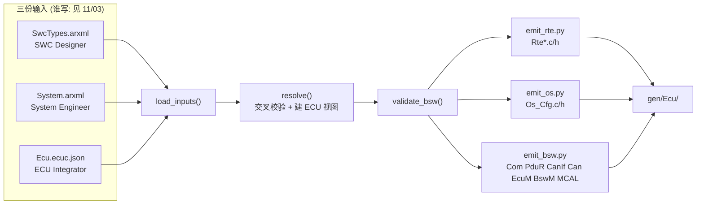
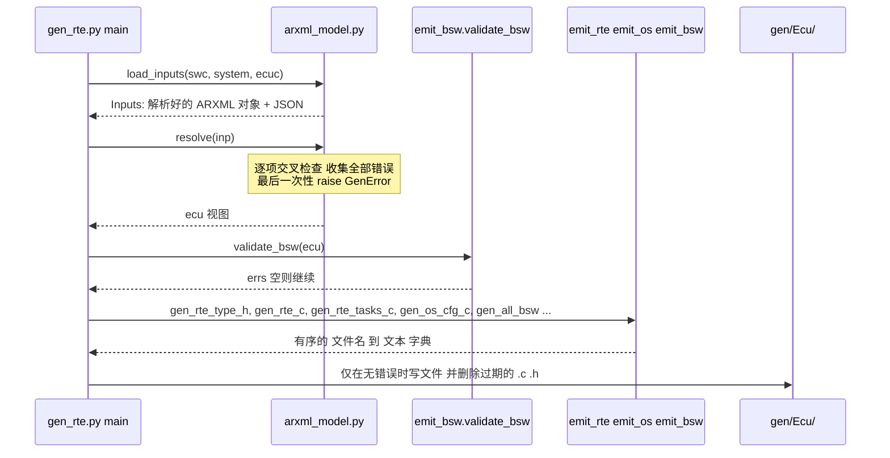
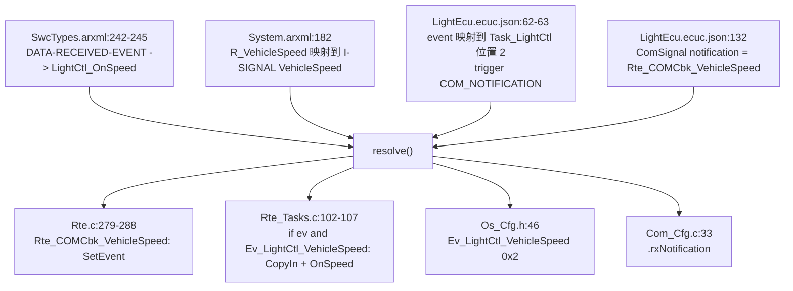

# 02 配置与生成：从 ARXML / ECUC 到 `gen/<Ecu>/`

> 本章回答：(1) 三份输入文件（`SwcTypes.arxml`、`System.arxml`、`<Ecu>.ecuc.json`）各自描述什么、里面的 SWC 类型 / 端口 / 接口 / Runnable / Event / `RteEventToTaskMapping` / OsTask / OsAlarm / Com / PduR / CanIf / Can 长什么样？(2) 生成器怎么"读入 → 校验 → 生成"？(3) **哪一个配置项产生哪一行生成代码**？
> Prerequisite: [01 项目总览](01-project-overview.md)；[11/03 方法论与工作流](../11-classic-autosar-primer/03-methodology-workflow.md)（谁产出哪份配置）    Next: [03 OS 代码](03-os-code.md)
> 对应代码：`config/swc/SwcTypes.arxml`、`config/system/System.arxml`、`config/ecuc/LightEcu.ecuc.json`、`config/ecuc/SensorEcu.ecuc.json`；`generator/gen_rte.py`、`arxml_model.py`、`emit_rte.py`、`emit_os.py`、`emit_bsw.py`；产物 `gen/LightEcu/*`、`gen/SensorEcu/*`
> 对应规范（R25-11）：RTE SWS R25-11 p.134 SWS_Rte_06200 / SWS_Rte_04560、p.135 SWS_Rte_06201、p.183 ECUC_Rte_09020 / 09023 / 09018、p.590 SWS_Rte_01004
> 深入阅读：[02-autosar-classic/04 配置 ARXML](../02-autosar-classic/04-configuration-arxml.md)、[02-autosar-classic/05 生成代码](../02-autosar-classic/05-generated-code.md)、[07-rte-swc/05 RTE 生成](../07-rte-swc/05-rte-generation.md)、[11/07 RTE 与 OS](../11-classic-autosar-primer/07-rte-and-os.md)

> 约定：本章文中的 `LightEcu.ecuc.json:n` 指 `config/ecuc/LightEcu.ecuc.json` 第 n 行；`Rte.c:n` 指 `gen/LightEcu/Rte.c`；`SwcTypes.arxml:n`、`System.arxml:n` 同理。

---

## 1. 本章要回答的问题

| # | 问题 | 小节 |
|---|---|---|
| 1 | 三份输入各管什么？ | §2 |
| 2 | `RteEventToTaskMapping` 在 JSON 里长什么样，几种 trigger 各生成什么？ | §2.3 |
| 3 | 生成器内部怎么走？哪里校验？ | §3 |
| 4 | 一个配置项变成哪一行代码？ | §4（并排对照表） |
| 5 | 配置写错了会怎样？ | §5 |
| 6 | 我自己改配置、加 Runnable 怎么做？ | §7 动手实验 |

## 2. 三份输入

**[Educational Implementation]** `DESIGN.md` §5.1 解释了拆分原则：SWC 类型、端口接口、Runnable / 事件、系统描述、通信矩阵是**真正的 ARXML 子集**（元素名取自真实 ARXML，可以对照真实文件读）；
OS、RTE 映射、Com、PduR、CanIf、Can、EcuM、BswM、MCAL 这类 ECUC 参数用 **JSON**（容器 / 参数名保留，如 `OsTask`、`RteEventToTaskMapping`、`ComSignal`），省掉 `DEFINITION-REF` / `PARAMETER-VALUES` 的 XML 包装。



### 2.1 `SwcTypes.arxml`：SWC 的"设计图纸"

文件头注释（`SwcTypes.arxml:2-12`）说明它对应真实的 SWC Template 部分。内容分三块：

**① 数据类型与模式组**（`:20-31`）：

```xml
<IMPLEMENTATION-DATA-TYPE><SHORT-NAME>uint8</SHORT-NAME><BASE-TYPE>uint8</BASE-TYPE></IMPLEMENTATION-DATA-TYPE>
...
<MODE-DECLARATION-GROUP>
  <SHORT-NAME>EcuMode</SHORT-NAME>
  <INITIAL-MODE-REF>/DataTypes/EcuMode/RUN</INITIAL-MODE-REF>
```

**② 端口接口**（`:39-118`）：S/R 接口（如 `VehicleSpeedIf`，`:39-45`，数据元素 `VehicleSpeed` 类型 `uint16`、初值 0）、C/S 接口（`WheelSpeedIf`，`:74-84`；`OdometerIf` 含 `UpdateSpeed` 与 `GetDistance` 两个操作，`:96-113`）、模式切换接口（`EcuModeIf`，`:115-118`）。

**③ SWC 类型**（`:127-370`）：每个 SWC = 端口（`R-PORT-PROTOTYPE` / `P-PORT-PROTOTYPE`）+ `SWC-INTERNAL-BEHAVIOR`（PIM、Runnable、RTE Event、独占区）。以 LightControlSWC 为例：

| 元素 | 行 | 含义 |
|---|---|---|
| 端口 | `:172-178` | `R_VehicleSpeed`、`R_AmbientLight`、`P_HeadlightCmd`、`R_Odometer`、`R_EcuMode` |
| PIM `LightCtl_State` | `:185-195` | 5 个字段，初值 `{0,0,0,0,255}` |
| Runnable `LightCtl_Run20ms` | `:199-211` | `DATA-RECEIVE-POINT-BY-ARGUMENTS`（显式读 AmbientLight）、`DATA-SEND-POINTS`（显式写 HeadlightCmd）、`MODE-ACCESS-POINTS` |
| Runnable `LightCtl_OnSpeed` | `:215-224` | `DATA-READ-ACCESSS`（**隐式**读 VehicleSpeed）+ `SYNCHRONOUS-SERVER-CALL-POINT`（调 `UpdateSpeed`） |
| Runnable `LightCtl_OnModeSwitch` | `:226-235` | 读模式，写 HeadlightCmd |
| TimingEvent `TE_LightCtl_20ms` | `:238-241` | 周期 0.020 s，`DISABLED-MODE-IREF` = POST_RUN |
| DataReceivedEvent `DRE_LightCtl_VehicleSpeed` | `:242-245` | 绑定 `LightCtl_OnSpeed` |
| ModeSwitchEvent `MSE_LightCtl_EnterRun` / `EnterPostRun` | `:246-253` | `ON-ENTRY`，同一个 Runnable `LightCtl_OnModeSwitch` |

**一个关键认识 [AUTOSAR Standard]**：这里**没有 task、没有优先级、没有 Alarm**。Runnable 与 RTE Event 属于"设计世界"，OS Task 属于"运行世界"，把二者接起来的是 §2.3 的 `RteEventToTaskMapping`（[11/07](../11-classic-autosar-primer/07-rte-and-os.md) §2 的"两张图纸"类比）。

服务端 SWC OdometerSWC（`:314-361`）是另一种形状：它只有两个由 `OPERATION-INVOKED-EVENT` 触发的 server Runnable（`:350-357`）与一个独占区 `EA_Odo`（`:322-324`），`CAN-ENTER-EXCLUSIVE-AREA-REFS`（`:341`、`:346`）声明哪些 Runnable 会进入它。
`BswM_Service`（`:364-370`）是一个 `SERVICE-SW-COMPONENT-TYPE`：BswM 作为模式管理者通过它的 P-port `P_EcuMode` 向 RTE 提供模式（第 04 章 §8）。

### 2.2 `System.arxml`：系统描述与通信矩阵

文件头（`System.arxml:2-11`）：对应真实的 System Description。三块内容：

* **ECU 实例与帧端口**（`:19-58`）：`SensorEcu` 在帧 `Frame_VehicleSpeed` 上方向 `OUT`（`:26`），`LightEcu` 同帧方向 `IN`（`:38`）；`RestBus` 带 `<GENERATE>false</GENERATE>`（`:48`），表示它是手写 sim 代码，不生成。
* **通信矩阵**（`:62-127`）：`I-SIGNAL`（`:73-77`）→ `I-SIGNAL-I-PDU`（`:83-113`，含 `START-POSITION`、周期）→ `CAN-FRAME`（`:120-123`，`IDENTIFIER` 0x101 / 0x201 / 0x301 / 0x3F0）。
* **系统**（`:133-189`）：`SW-COMPONENT-PROTOTYPE`（`:139-143`：SpeedSensor、LightControl、LightActuator、Odometer、BswM）、`ASSEMBLY-SW-CONNECTOR`（`:147-163`）、`SWC-TO-ECU-MAPPING`（`:170-176`，BswM 在两个 ECU 上各一份）、`SENDER-RECEIVER-TO-SIGNAL-MAPPING`（`:181-185`）。

S/R 数据元素有两种去向，**完全由 System.arxml 决定**（这是生成器的第一个分叉点）：

| 情形 | System.arxml | 生成物 |
|---|---|---|
| 元素出现在 `SENDER-RECEIVER-TO-SIGNAL-MAPPING` | 例：`LightControl.R_AmbientLight.AmbientLight` → I-SIGNAL `AmbientLight`（`:183`） | RTE 调 Com：`Rte_Read_R_AmbientLight_AmbientLight` → `Com_ReceiveSignal`（`Rte.c:142`） |
| 没出现在映射里，但有 `ASSEMBLY-SW-CONNECTOR` 连到同 ECU 的接收端 | 例：`C_HeadlightCmd`（`:147-149`）：LightControl.P_HeadlightCmd → LightActuator.R_HeadlightCmd | RTE 内部缓冲 `Rte_Buf_LightControl_P_HeadlightCmd_HeadlightCmd`（`Rte.c:41`）+ 激活 / 事件 |

### 2.3 `<Ecu>.ecuc.json`：ECU 配置（集成者的工作）

顶层键（`DESIGN.md` §5.2，`LightEcu.ecuc.json`）：

| 键 | 行 | 内容 |
|---|---|---|
| `Ecu` | `:11-18` | 名字、`define`（`MINI_ECU_B`）、trace 标签 `ECUB`、本 ECU 上有哪些 SWC 原型 |
| `Os` | `:20-52` | `OsOS`（tick 1000 µs）、`OsHooks`、`OsCounter`、`OsEvent`、`OsTask`、`OsAlarm`、`OsResource`、`OsIsr` |
| `Rte` | `:54-79` | `RteExclusiveArea`、**`RteEventToTaskMapping`**、`RteBswServerMapping`、`RteModeManager`、`RteTrace` |
| `SchM` | `:81-87` | 哪个 Task 里依次调用哪些 BSW MainFunction |
| `EcuM` / `BswM` | `:89-120` | 初始化列表、BswM 动作列表与规则 |
| `Com` / `PduR` / `CanIf` / `Can` | `:122-169` | I-PDU、信号、路由路径、L-PDU、硬件对象 |
| `Mcu` `Port` `Dio` `Adc` `Det` | `:171-185` | MCAL 配置 |

**OS 部分**（LightEcu，`:31-45`）：

```json
{ "name": "Task_Init",     "priority": 10, "activation": 1, "type": "BASIC",    "autostart": ["OSDEFAULTAPPMODE"], ... },
{ "name": "Task_BswMain",  "priority": 4,  ... "autostart": [] ... },
{ "name": "Task_LightCtl", "priority": 3,  "activation": 1, "type": "EXTENDED", "autostart": ["OSDEFAULTAPPMODE"], "stackWords": 384,
  "events": ["Ev_LightCtl_Timer20ms", "Ev_LightCtl_VehicleSpeed", "Ev_LightCtl_ModeSwitch"] },
{ "name": "Task_LightAct", "priority": 2,  "activation": 2, "type": "BASIC", ... }
```

设计要点：`Task_LightCtl` 是**扩展任务**，要自启动并永远停在 `WaitEvent` 里；`Task_LightAct` 的 `activation: 2` 是为了 LightControl 连续 `Rte_Write`（→ `ActivateTask`）时不丢激活（`LightEcu.ecuc.json:38` 的注释，`DESIGN.md` §17 第 9 项）。

**RteEventToTaskMapping（本章的重点，`:59-73`）**：每个 RTE Event 一条，说明"这个事件触发的 Runnable 放进哪个 Task、第几个位置、怎么唤醒这个 Task"：

```json
{ "swc": "LightControl",  "event": "TE_LightCtl_20ms",          "runnable": "LightCtl_Run20ms",   "task": "Task_LightCtl", "position": 1,
  "trigger": { "type": "OS_ALARM", "alarm": "Alarm_LightCtl20ms", "osEvent": "Ev_LightCtl_Timer20ms" } },
{ "swc": "LightControl",  "event": "DRE_LightCtl_VehicleSpeed", "runnable": "LightCtl_OnSpeed",   "task": "Task_LightCtl", "position": 2,
  "trigger": { "type": "COM_NOTIFICATION", "comSignal": "VehicleSpeed", "osEvent": "Ev_LightCtl_VehicleSpeed" } },
...
{ "swc": "Odometer", "event": "OIE_Odo_UpdateSpeed", "runnable": "Odo_UpdateSpeed", "task": null, ... }
```

**[AUTOSAR Standard]** 规范里对应的是容器 `RteEventToTaskMapping`（RTE SWS R25-11 p.183, ECUC_Rte_09020）及参数 `RtePositionInTask`（ECUC_Rte_09023）、`RteActivationOffset`（ECUC_Rte_09018）。
规范原文还写明："对于通过直接或受信函数调用执行的 RunnableEntity，仍要指定这个 `RteEventToTaskMapping`，但不含 `RteMappedToTask` 元素"（同页，ECUC_Rte_09020 Description）。这正是 `"task": null` 的来源。

五种 trigger 各自生成什么（`DESIGN.md` §5.2；生成逻辑在 `generator/emit_rte.py:55-61` `wake_code`）：

| `trigger.type` | 适用事件 | 唤醒谁、在哪一行生成 |
|---|---|---|
| `OS_ALARM` | TimingEvent | 没有"唤醒代码"，由 `Os_Cfg.c` 里已有的 `OsAlarm` 到期时 `ActivateTask` / `SetEvent`；生成器**校验**周期与 Alarm 一致（`arxml_model.py:647-649`） |
| `COM_NOTIFICATION` | 来自 Com 的 DataReceivedEvent | `Rte_COMCbk_<signal>()` 里 `SetEvent(task, 事件)` 或 `ActivateTask`（`Rte.c:279-288`）；`Com_Cfg.c:33` 的 `.rxNotification` 指向它 |
| `INTERNAL_WRITE` | 来自同 ECU SWC 的 DataReceivedEvent | `Rte_Sink_*` 里写缓冲后 `ActivateTask`（`Rte.c:97-99`） |
| `MODE_SWITCH` | ModeSwitchEvent | `Rte_Switch_*` 里 `SetEvent`（`Rte.c:257-268`） |
| `task: null` | OperationInvokedEvent（同分区同步 C/S） | 不唤醒任何 Task，`Rte_Call_*` 直接调用服务端 Runnable（`Rte.c:195-199`） |

`wake_code` 只有 7 行，却是"RTE 与 OS 的接口"在生成器里的唯一落点：

```python
def wake_code(ecu, mp):
    """C statement(s) that make the task of mapping `mp` run for this event (RTE -> OS interaction)."""
    t = ecu.tasks[mp.task]
    osev = (mp.trigger or {}).get("osEvent")
    if t.type == "EXTENDED":
        return "(void)SetEvent(%s, %s);" % (t.name, osev), "SetEvent"
    return "(void)ActivateTask(%s);" % t.name, "ActivateTask"
```
（`generator/emit_rte.py:55-61`）——**目标 Task 是扩展任务就 `SetEvent`，是基本任务就 `ActivateTask`**。第 04 章会再回到它。

## 3. 生成器流水线：parse → validate → emit

入口 `generator/gen_rte.py`（`DESIGN.md` §7）：

```
python generator/gen_rte.py --swc config/swc/SwcTypes.arxml --system config/system/System.arxml \
                            --ecuc config/ecuc/LightEcu.ecuc.json --out gen/LightEcu
```



对应代码：

* **解析** `arxml_model.py:208-216` `load_inputs`：`_parse_swc_types`（`:75`）与 `_parse_system`（`:181`）用 `xml.etree` 读 ARXML，JSON 用 `json.load(..., object_pairs_hook=OrderedDict)` 保序；`schema` 必须是 `mini-ecuc/1`。
* **校验 + 建视图** `arxml_model.py:235-854` `resolve`：这是生成器的"大脑"。按顺序做：
  ECU 上有哪些 SWC 原型（`:251-267`）→ OS 对象（`:290-337`）→ Com 信号与 System.arxml 对齐（`:339-378`）→ S/R 连接性，决定每个元素走 Com 还是 RTE 缓冲（`:380-469`）→ 每个 Runnable 的访问点解析（`:471-576`）→ **`RteEventToTaskMapping` 校验**（`:595-685`）→ 把 Runnable 排进 Task（`:697-738`）→ BSW 任务体（`:740-762`）→ 独占区与资源天花板（`:784-825`）→ API 名冲突（`:837-851`）。
  所有错误经内部 `err()`（`:239-240`）累积，最后 `raise GenError(errs)`（`:852-853`），**一次运行报出全部问题**。
* **BSW 交叉校验** `emit_bsw.py:54` `validate_bsw`：PduR 路径、CanIf L-PDU、CAN 硬件对象三者的 CAN ID / DLC / 方向是否一致。
* **生成** `gen_rte.py:26-48` `generate()`：返回有序 `{文件名: 文本}`（`Rte_Type.h`、`Rte.h`、`Rte_Cbk.h`、每个 SWC 的 `Rte_<Swc>.h`、`Rte.c`、`Rte_Tasks.c`、`Os_Cfg.h/.c`、各 BSW `*_Cfg.*`）。
* **写盘** `gen_rte.py:58-72`：先 `generate()`，**有 `GenError` 就只打印错误并 `return 1`，一个文件都不写**；成功才清理过期文件并写入。
* **确定性**：输出里没有时间戳，顺序固定，所以 `gen/` 可以入库并 diff；`tests/unit/test_generator.py` 的黄金文件测试会比较"生成器输出 == 入库的 gen/"，没人手改生成物（每个生成文件头有 `GENERATED ... do not edit` 横幅，`generator/emit_util.py:14-33`）。

**[AUTOSAR Standard]** 对应规范：RTE 生成器的"构造任务体"职责——SWS_Rte_06200（RTE SWS R25-11 p.134）：*RTE Generator shall construct task bodies for those tasks which contain RunnableEntitys*；SWS_Rte_06201（p.135）对含 BSW Schedulable Entity 的任务；SWS_Rte_04560（p.134）对 Category 2 ISR。
**但任务本身（OsTask）和"谁放进哪个 Task"是配置输入，不是 RTE 生成的**：本项目里 `OsTask` 写在 `ecuc.json`，由 `emit_os.py` 生成 `Os_Cfg.c`，由 `emit_rte.py` 生成 task 体，两边靠 task 名字和 `Os_Task_<name>` 命名约定接上（`os/include/Os.h:82` `#define TASK(name) void Os_Task_##name(void)`）。

## 4. 并排对照：哪个配置项产生哪一行生成代码

### 4.1 SWC 描述（`SwcTypes.arxml`）→ 契约头、`Rte.c`、`Rte_Tasks.c`

以 LightControlSWC（`LightEcu`）为例。每行左边是配置，右边是它**产生**的代码：

| 配置（`SwcTypes.arxml`） | 生成代码 | 说明 |
|---|---|---|
| `DATA-RECEIVE-POINT-BY-ARGUMENTS` `rd_AmbientLight`（`:202-204`） | `Rte_LightControlSWC.h:38`：`Std_ReturnType Rte_Read_R_AmbientLight_AmbientLight(uint8 *data);`；定义在 `Rte.c:134-144`，内部调 `Com_ReceiveSignal(ComConf_ComSignal_AmbientLight, data)` | 显式读：调用即通信点 |
| `DATA-SEND-POINTS` `wr_HeadlightCmd`（`:205-207`） | `Rte_LightControlSWC.h:40`：`Rte_Write_P_HeadlightCmd_HeadlightCmd(uint8 data);`；`Rte.c:147-150` 转调 `Rte_Sink_*`（`Rte.c:85-102`） | 显式写 |
| `DATA-READ-ACCESSS` `ird_VehicleSpeed`（`:218-220`） | `Rte_LightControlSWC.h:47-48`：`extern uint16 Rte_Irb_LightCtl_OnSpeed_R_VehicleSpeed_VehicleSpeed;` + 宏 `Rte_IRead_LightCtl_OnSpeed_R_VehicleSpeed_VehicleSpeed()`；缓冲 `Rte.c:49`；`Rte_CopyIn_LightCtl_OnSpeed` 在 `Rte.c:183-187`；`Rte_Tasks.c:105` 在 Runnable 前调用它 | 隐式读 = 每 Runnable 一个快照缓冲 |
| `SYNCHRONOUS-SERVER-CALL-POINT` `call_UpdateSpeed`（`:222`） | `Rte_LightControlSWC.h:53`：`Rte_Call_R_Odometer_UpdateSpeed(uint16 Speed);`；`Rte.c:195-199` 直接 `return Odo_UpdateSpeed(Speed);` | 同 ECU 服务端 → 直接函数调用 |
| `MODE-ACCESS-POINT` `mode_EcuMode`（`:208-210`） | `Rte_LightControlSWC.h:57`：宏 `Rte_Mode_R_EcuMode_EcuMode()` 读 `Rte_Mode_EcuMode`（`Rte_Type.h:30` 声明，`Rte.c:35` 定义） | 模式读取 |
| `PER-INSTANCE-MEMORY` `LightCtl_State`（`:185-195`） | 类型 `Rte_LightControlSWC_Type.h:20-26`；存储 `Rte.c:54`（`.bss.rte`）；初值常量 `Rte.c:55`；`Rte_Start` 里赋值 `Rte.c:298`；访问宏 `Rte_LightControlSWC.h:61` | PIM 由 RTE 分配而非 SWC 里的 `static` |
| `RUNNABLE-ENTITY` 三个（`:199-235`） | `Rte_LightControlSWC.h:27/30/33`：`void LightCtl_Run20ms(void);` 等"你必须实现的函数"原型，附 `executed in: Task_LightCtl (RtePositionInTask n)` 注释 | 契约：SWC 的 `.c` 里必须有这些符号，否则链接失败 |
| `TIMING-EVENT` `TE_LightCtl_20ms` 的 `DISABLED-MODE-IREF`（`:238-241`） | `Rte_Tasks.c:97`：`if (Rte_Mode_EcuMode != RTE_MODE_EcuMode_POST_RUN)` 包住 `LightCtl_Run20ms();`（`:99`） | `disabledInMode`：Alarm 继续走，只是 Runnable 不执行 |
| `EXCLUSIVE-AREA` `EA_Odo`（`:322-324`）+ ecuc `RteExclusiveArea`（`LightEcu.ecuc.json:56-58`） | `Rte_OdometerSWC.h:38-39`：`Rte_Enter_EA_Odo` / `Rte_Exit_EA_Odo` 声明；`Rte.c:219-227` 实现为 `GetResource(Res_EA_Odo)` / `ReleaseResource(Res_EA_Odo)` | 独占区 = OS Resource（优先级天花板） |
| `OPERATION-INVOKED-EVENT` + ecuc `"task": null`（`LightEcu.ecuc.json:70-72`） | `Rte_OdometerSWC.h:25-27`：`executed in: no task: direct call in the caller's context` | 服务端 Runnable 不进任何 Task 体 |

**SWC 能用的 API = 配置里声明的访问点**：`Rte_LightControlSWC.h` 里没有 `Rte_Write_P_HeadlightStatus_*`，因为 LightControl 没有这个端口。SWC 的 C 文件如果调了没声明的 API，编译就失败。
这就是 SWS_Rte_01004（RTE SWS R25-11 p.590）所要求的"应用头文件只含与该组件相关的信息"。`tests/unit/test_generator.py` 的 "contract" 用例正是验证这一点。

### 4.2 系统描述（`System.arxml`）→ 数据去向

| 配置（`System.arxml`） | 生成代码（`LightEcu`） | 说明 |
|---|---|---|
| `SENDER-RECEIVER-TO-SIGNAL-MAPPING` LightActuator.P_HeadlightStatus → `HeadlightStatus`（`:184`） | `Rte.c:113`：`rc = Rte_MapComStatus(Com_SendSignal(ComConf_ComSignal_HeadlightStatus, &data));` | 映射到信号 → RTE 调 Com |
| `SENDER-RECEIVER-TO-SIGNAL-MAPPING` SpeedSensor.P_VehicleSpeed → `VehicleSpeed`（`:181`） | `gen/SensorEcu/Rte.c:82`：`Com_SendSignal(ComConf_ComSignal_VehicleSpeed, &data)` | 发送端 ECU |
| `SENDER-RECEIVER-TO-SIGNAL-MAPPING` LightControl.R_VehicleSpeed → `VehicleSpeed`（`:182`） | `Rte.c:186`：`Com_ReceiveSignal(ComConf_ComSignal_VehicleSpeed, &Rte_Irb_…)` | 接收端 ECU（同一个 I-SIGNAL，两个 ECU 的 RTE 各自一半） |
| `ASSEMBLY-SW-CONNECTOR` `C_HeadlightCmd`（`:147-149`）且**无**信号映射 | `Rte.c:41` 缓冲、`Rte.c:85-102` 写+激活、`Rte.c:153-166` 读 | 同 ECU 内连接 → RTE 内部缓冲 |
| `ASSEMBLY-SW-CONNECTOR` `C_Odo_LightControl`（`:150-152`） | `Rte.c:195-199` 的 `Rte_Call_R_Odometer_UpdateSpeed` | 客户端到服务端的连接决定 `Rte_Call` 的目标 |
| `ASSEMBLY-SW-CONNECTOR` `C_EcuMode`（`:156-158`） | `Rte.c:242-271` 的 `Rte_Switch_P_EcuMode_EcuMode` 是"BswM 到 LightControl"的模式通道；声明在 `Rte.h:22` | 模式管理者 → 模式使用者 |
| `CAN-FRAME` 0x101 + `I-SIGNAL-I-PDU` 位置（`:120`、`:86`） | **不直接生成代码**，只用于**交叉校验** `Com_Cfg.c` 的信号位位置、DLC、CAN ID（`arxml_model.py:358-373`） | 通信矩阵是"真相源"，ECUC 必须与它一致 |

### 4.3 ECUC `Os` → `Os_Cfg.h` / `Os_Cfg.c`

| 配置（`LightEcu.ecuc.json`） | 生成（`gen/LightEcu/`） |
|---|---|
| `OsEvent`（`:26-30`）`Ev_LightCtl_Timer20ms` = `0x00000001` | `Os_Cfg.h:45`：`#define Ev_LightCtl_Timer20ms      ((EventMaskType)0x1u)` |
| `OsTask`（`:31-39`）`Task_LightCtl` priority 3、EXTENDED、autostart | `Os_Cfg.h:34`：`#define Task_LightCtl          ((TaskType)2u)   /* EXTENDED, priority 3 */`；`Os_Cfg.c:53-62` 的表项（`.priority = 3u`、`.extended = TRUE`、`.autostartModes = 0x1u`、`.stackWords = 384u`）；栈数组 `Os_Cfg.c:28` |
| `OsTask` 的 `activation: 2`（`Task_LightAct`） | `Os_Cfg.c:67`：`.maxActivations = 2u,` |
| `OsAlarm` `Alarm_LightCtl20ms`（`:43-44`）SETEVENT、start 20、cycle 20 | `Os_Cfg.h:40`：`Alarm_LightCtl20ms ((AlarmType)1u)`；`Os_Cfg.c:96-108`：`.action = OS_ALARM_SETEVENT, .task = Task_LightCtl, .event = Ev_LightCtl_Timer20ms, .autostartTime = 20u, .autostartCycle = 20u` |
| `OsResource` `Res_EA_Odo`，`accessedBy` = `Task_LightCtl`、`Task_LightAct`（`:47`） | `Os_Cfg.h:41`：`Res_EA_Odo ((ResourceType)1u)   /* ceiling priority 3 */`；`Os_Cfg.c:114`：`{ .name = "Res_EA_Odo", .ceilingPriority = 3u }   /* accessors: Task_LightCtl(3), Task_LightAct(2) */` —— **天花板是生成器算的**（`arxml_model.py:819-820`：`max(优先级)`），不是你写的 |
| `OsIsr` `Isr_CanRx`（`:50`）irq 39、nvic `0x40` | `Os_Cfg.c:119`：`{ .name = "Isr_CanRx", .handler = Os_Isr_Isr_CanRx, .irqNumber = 39u, .nvicPriority = 0x40u }`；ISR 体 `Rte_Tasks.c:136-139`：`MINI_CODE_FAST ISR(Isr_CanRx) { Can_Isr_Rx(); }` |
| `OsHooks`（`:22`） | `Os_Cfg.h:25-29`：`OS_USE_STARTUPHOOK 1` 等开关；Hook 函数体在手写的 `integration/Os_Hooks.c:24-50` |
| `OsOS.tickDurationUs`（`:21`） | `Os_Cfg.c:135`：`.tickDurationUs = 1000u` |
| `OsTask` 的 `name` | `Os_Cfg.c:35`：`.entry = Os_Task_Task_Init`；它的**定义**在 `Rte_Tasks.c:47`：`TASK(Task_Init)`（宏展开为 `void Os_Task_Task_Init(void)`） |

注意 `Os_Cfg.h` 里 `Task_Init` 是 `((TaskType)0u)`：**对象 ID = 表下标**，内核用它直接索引 `Os_Config.tasks[]`（`Os_Cfg.h:32-35` 与 `Os_Cfg.c:32-73` 次序一致）。

### 4.4 ECUC `Rte` / `SchM` → `Rte.c` / `Rte_Tasks.c`

| 配置 | 生成 |
|---|---|
| `RteEventToTaskMapping` 三条映射到 `Task_LightCtl`，`position` 1/2/3（`:59-67`） | `Rte_Tasks.c:84-114`：`TASK(Task_LightCtl)` 体里依次出现 `LightCtl_Run20ms()`（`:99`）、`LightCtl_OnSpeed()`（`:106`）、`LightCtl_OnModeSwitch()`（`:111`）。**顺序 = `RtePositionInTask`**（`arxml_model.py:724-725` 排序） |
| 这三条映射的 `osEvent`（`:61-65`） | `Rte_Tasks.c:90`：`WaitEvent(Ev_LightCtl_Timer20ms \| Ev_LightCtl_VehicleSpeed \| Ev_LightCtl_ModeSwitch)`（把本任务各 `osEvent` 做 OR，`emit_rte.py:797-802`） |
| 映射的 `trigger: COM_NOTIFICATION`（`:63`） | `Rte.c:279-288` `Rte_COMCbk_VehicleSpeed`；`Rte_Cbk.h:17` 的原型；`Com_Cfg.c:33` 的 `.rxNotification = Rte_COMCbk_VehicleSpeed` |
| 映射 `Task_LightAct` / `INTERNAL_WRITE` / `ACTIVATETASK`（`:68-69`） | `Rte.c:97-99` 在 `Rte_Sink_LightControl_P_HeadlightCmd_HeadlightCmd` 里 `(void)ActivateTask(Task_LightAct);`；`Rte_Tasks.c:123-129` `TASK(Task_LightAct)` 是个基本任务：调 `Actuator_OnCmd()` 然后 `TerminateTask()` |
| 两个 `MODE_SWITCH` 映射（`:64-67`，同一 Runnable 同一 `Ev_LightCtl_ModeSwitch`） | `Rte.c:257-268`：RUN 与 POST_RUN 两个分支各一次 `SetEvent(Task_LightCtl, Ev_LightCtl_ModeSwitch)`；而 `Rte_Tasks.c:108-112` 只有**一个** `if` 块：两个事件合并到同一个 `OsEvent`、同一个 Runnable |
| `SchM.tasks`（`:83-86`）`Task_BswMain` 的 `order` | `Rte_Tasks.c:61-70`：`Can_MainFunction_Write(); Com_MainFunctionRx(); Com_MainFunctionTx(); BswM_MainFunction(); EcuM_MainFunction(); TerminateTask();`——**顺序 = 配置里的 order** |
| `Task_Init` 的 `order: ["EcuM_StartupTwo"]`（`:84`） | `Rte_Tasks.c:47-52`：`TASK(Task_Init) { EcuM_StartupTwo(); (void)TerminateTask(); }` |
| `RteBswServerMapping`（`:75`）`R_LightHw.SetHeadlight` → `IoHwAb_SetHeadlight` | `Rte.c:201-205`：`Rte_Call_R_LightHw_SetHeadlight` 里 `return IoHwAb_SetHeadlight(State);` |
| `RteModeManager`（`:77`） | `Rte.c:242` `Rte_Switch_P_EcuMode_EcuMode`；`BswM_Cfg.c:79-81`：`Rte_Switch_P_EcuMode_EcuMode(RTE_MODE_EcuMode_RUN)` |
| `RteTrace`（`:78`）`writes: true` / `reads: false` | `Rte.c:93`、`:112`、`:125` 有 `TRACE(... "WRITE …")`；`Rte_Read_*` 里没有（`:134-144`） |
| BswM `AL_Startup` 里的 `Rte_Start`（`:105`） | `BswM_Cfg.c:50-52`：`static Std_ReturnType BswM_Act_AL_Startup_Rte_Start(void) { return Rte_Start(); }` |

### 4.5 ECUC `Com / PduR / CanIf / Can`：一条链上的一致性

一帧报文在配置里被写四次（Com、PduR、CanIf、Can），**生成器负责保证它们互相一致**。以 0x101 为例（`LightEcu`）：

| 层 | ECUC（`LightEcu.ecuc.json`） | 生成（`gen/LightEcu/`） |
|---|---|---|
| Com | `ComIPdu` `Ipdu_VehicleSpeed_Rx`：RX、2 字节、`DEFERRED`、`canId 0x101`（`:126`）；`ComSignal` `VehicleSpeed`：`bitPosition 0`、`bitSize 16`、`notification Rte_COMCbk_VehicleSpeed`（`:132`） | `Com_Cfg.c:27-33`（信号）、`:66-71`（I-PDU：`.rxProcessing = COM_RX_DEFERRED`） |
| PduR | `PduRRoutingPath` `RP_VehicleSpeed`：RX，`CanIfRxPdu_VehicleSpeed` → `Ipdu_VehicleSpeed_Rx`（`:142`） | `PduR_Cfg.c:22`：`{ .comRxPduId = ComConf_ComIPdu_Ipdu_VehicleSpeed_Rx }` |
| CanIf | `CanIfRxPduCfg` `CanIfRxPdu_VehicleSpeed`：`0x101`、dlc 2、`Hrh_VehicleSpeed`（`:152`） | `CanIf_Cfg.c:23` |
| Can | `CanHardwareObject` `Hrh_VehicleSpeed`：RECEIVE、`0x101`、mask `0x7FF`（`:164`） | `Can_Cfg.c:17` |

交叉检查在 `emit_bsw.py:54-107` `validate_bsw`（例如 `:76` 比较 CanIf L-PDU 与 Com I-PDU 的 CAN ID，`:86` 比较 HOH 与 L-PDU）以及 `arxml_model.py:339-378`（Com 信号与 System.arxml 的 I-SIGNAL 对齐）。
Com 的内部细节见第 06 章。

## 5. 校验报错：配置写错会怎样

**[Educational Implementation]** 这不是"编译到一半才发现"，而是在生成阶段就停下来，并给出"哪里错了（怎么修）"。
下面每一条都是我真的改了配置、运行 `generator/gen_rte.py` 得到的原文（在临时副本里改，没有动仓库配置）：

| 你做了什么改动 | 生成器输出（节选） | 来源 |
|---|---|---|
| 把 `Task_LightAct` 优先级改成 3（与 `Task_LightCtl` 重复） | `ERROR: LightEcu.ecuc.json: OsTask priority conflict: Task_LightCtl and Task_LightAct both have priority 3 (this project requires unique priorities so that the schedule is unambiguous; change one of them)` | `arxml_model.py:308-310` |
| 删掉 `DRE_Actuator_HeadlightCmd` 的映射条目 | `ERROR: … RTE event 'DRE_Actuator_HeadlightCmd' (DATA_RECEIVED) of runnable 'Actuator_OnCmd' in SWC 'LightActuator' has no RteEventToTaskMapping (ECUC_Rte_09020) - every event must be mapped to a task (or, for OperationInvokedEvents, to task=null)`；并连带 `OsTask Task_LightAct has no body` 与 `is never activated` 两条 | `arxml_model.py:687-692`、`:748`、`:762` |
| 把 `Res_EA_Odo` 的 `accessedBy` 删成只剩 `Task_LightCtl` | `ERROR: … OsResource Res_EA_Odo (ceiling): task(s) ['Task_LightAct'] can reach Exclusive Area via server runnables but are missing from accessedBy ['Task_LightCtl'] - the ceiling would be too low and the EA would not be mutually exclusive` | `arxml_model.py:815-818` |
| 把 `Alarm_LightCtl20ms` 的 `cycle` 改成 40 | `ERROR: … RteEventToTaskMapping[LightControl/TE_LightCtl_20ms]: TimingEvent TE_LightCtl_20ms period 20 ms != alarm Alarm_LightCtl20ms cycle 40 ticks x 1000 us` | `arxml_model.py:647-649` |
| 把 `DRE_LightCtl_VehicleSpeed` 改到基本任务 `Task_LightAct` | `ERROR: … BASIC task Task_LightAct hosts runnables with different activation sources ['DRE_Actuator_HeadlightCmd', 'DRE_LightCtl_VehicleSpeed']: use an EXTENDED task with one OsEvent per source` | `arxml_model.py:727-731` |
| 去掉 `Task_LightCtl` 的 `autostart` | `ERROR: … OsTask Task_LightCtl is EXTENDED but not autostarted: an extended task must be running (parked in WaitEvent) before anyone can SetEvent it` | `arxml_model.py:732-733` |
| 把 CanIf 的 `CanIfRxPdu_VehicleSpeed` 改成 `0x102` | `ERROR: … CAN id mismatch on path RP_VehicleSpeed: CanIf L-PDU CanIfRxPdu_VehicleSpeed=0x102, ComIPdu Ipdu_VehicleSpeed_Rx=0x101` 与 `HOH Hrh_VehicleSpeed canId 0x101 != L-PDU … canId 0x102` | `emit_bsw.py:76`、`:86` |

关注两点：(1) **错误是一次性全部报出的**（表中第 2 行就连报三条）；(2) **"天花板偏低"这种运行时才会出现的竞态，在生成期就被拦住**：
这是真实配置器（DaVinci Configurator 的 validation、EB tresos 的 verification）存在的价值，运行时才出 bug 的配置错误很难查。

## 6. 配置到运行：一次流转看全

用同一个例子（`DRE_LightCtl_VehicleSpeed`）把整条链串一遍：



少一个输入，`resolve()` 就会拒绝：`arxml_model.py:664-669` 检查 `COM_NOTIFICATION` 的 `comSignal` 与 `notification` 名字一致；`:832-835` 反向检查"有 notification 的信号必须有事件映射"。

## 7. 动手实验

> 在仓库根目录执行。**先备份**：`cp examples/mini_autosar_ecu/config/ecuc/LightEcu.ecuc.json /tmp/` 等；做完实验把改动改回去并重新生成（本仓库当前不是 git 仓库，没有 `git checkout` 可用）。
> 反馈回路只需 4 秒：`python examples/mini_autosar_ecu/tools/run_mini_autosar.py --step gen --step host --step sim`，然后读 `artifacts/mini-autosar/host/ecuB.log`。

### 实验 A：改 Task 优先级，观察抢占点移动（已验证）

1. 编辑 `config/ecuc/LightEcu.ecuc.json:37`，把 `Task_LightAct` 的 `"priority": 2` 改成 `6`（高于 `Task_BswMain` 的 4 和 `Task_LightCtl` 的 3）。
2. 运行上面那条命令。生成器报告里 `gen LightEcu` 仍为 OK（优先级在 1..255 且唯一）；看 `gen/LightEcu/Os_Cfg.c` 的变化：
   `.priority = 6u`（`:66`）、**`Res_EA_Odo` 的天花板自动变成 6**（`:114`，`{ .name = "Res_EA_Odo", .ceilingPriority = 6u }   /* accessors: Task_LightAct(6), Task_LightCtl(3) */`），`Rte.c:221` 的注释同步为 `ceiling priority 6`。你没写天花板，它被**算出来**了。
3. 打开 `host/ecuB.log`，找 `[000020000]` 一段。**改之前**（原样，来自入库配置的运行）：

   ```
   [000020000] ECUB RTE   WRITE P_HeadlightCmd_HeadlightCmd=0
   [000020000] ECUB RTE   TRIGGER DRE_Actuator_HeadlightCmd -> Task_LightAct
   [000020000] ECUB OS    TASK_WAIT Task_LightCtl mask=0x7
   [000020000] ECUB OS    TASK_START Task_LightAct prio=2
   ```

   **改之后**：

   ```
   [000020000] ECUB RTE   WRITE P_HeadlightCmd_HeadlightCmd=0
   [000020000] ECUB RTE   TRIGGER DRE_Actuator_HeadlightCmd -> Task_LightAct
   [000020000] ECUB OS    TASK_START Task_LightAct prio=6
   ...
   [000020000] ECUB OS    TASK_END Task_LightAct
   [000020000] ECUB OS    TASK_WAIT Task_LightCtl mask=0x7
   ```

   原来 `Task_LightCtl` 先走到 `WaitEvent`（`TASK_WAIT`）、`Task_LightAct` 才开始；现在 `Rte_Write` 内部的 `ActivateTask(Task_LightAct)`（`Rte.c:99`）一返回，更高优先级的 `Task_LightAct` 就**抢占**了仍在 Runnable 中间的 `Task_LightCtl`，跑完才回去。
   这是"RTE 调 OS 服务 → OS 做抢占判断 → 立即切换"的直接可见证据（OS 侧的机理见第 03 章 §4.1）。
4. 想想：为什么场景检查 `check_scenario` 仍然全绿？（因为功能行为不依赖这个顺序，只是执行时序不同。）
5. 再把 `priority` 改成 `3`，重新生成，观察 §5 第一行的报错，并确认 `gen/` 没有被覆盖（生成器不写任何文件）。
6. **还原**：改回 `2`，重新运行 `--step gen --step host --step sim`。

### 实验 B：加一个周期 Runnable（已验证）

目标：在 LightControlSWC 里加 `LightCtl_Heartbeat`，每 100 ms 打印一行 `LightCtl heartbeat`。需要 **4 处改动**，对应真实项目里 SWC 设计师、集成者、开发者各改自己那份：

1. **SWC 描述** `config/swc/SwcTypes.arxml`：在 `LightCtl_OnModeSwitch` 的注释行（`:225`）前插入 Runnable；在 `DRE_LightCtl_VehicleSpeed`（`:242`）前插入 TimingEvent：

   ```xml
   <RUNNABLE-ENTITY>
     <SHORT-NAME>LightCtl_Heartbeat</SHORT-NAME><SYMBOL>LightCtl_Heartbeat</SYMBOL>
     <CAN-BE-INVOKED-CONCURRENTLY>false</CAN-BE-INVOKED-CONCURRENTLY>
   </RUNNABLE-ENTITY>
   ...
   <TIMING-EVENT><SHORT-NAME>TE_LightCtl_100ms</SHORT-NAME><START-ON-EVENT-REF>LightCtl_Heartbeat</START-ON-EVENT-REF><PERIOD>0.100</PERIOD></TIMING-EVENT>
   ```

2. **ECU 配置** `config/ecuc/LightEcu.ecuc.json`（这三处都是 OS / RTE 的集成者工作）：
   * `OsEvent`（`:26-30`）加 `{ "name": "Ev_LightCtl_Timer100ms", "mask": "0x00000008" }`；`Task_LightCtl` 的 `events`（`:36`）加上这个名字；
   * `OsAlarm`（`:40-45`）加 `{ "name": "Alarm_LightCtl100ms", "counter": "Counter_System", "action": { "type": "SETEVENT", "task": "Task_LightCtl", "event": "Ev_LightCtl_Timer100ms" }, "autostart": { "mode": ["OSDEFAULTAPPMODE"], "type": "REL", "start": 100, "cycle": 100 } }`；
   * `RteEventToTaskMapping`（`:59-73`）加 `{ "swc": "LightControl", "event": "TE_LightCtl_100ms", "runnable": "LightCtl_Heartbeat", "task": "Task_LightCtl", "position": 4, "trigger": { "type": "OS_ALARM", "alarm": "Alarm_LightCtl100ms", "osEvent": "Ev_LightCtl_Timer100ms" } }`。
3. **SWC 实现** `swc/LightControlSWC/LightControlSWC.c` 末尾加：

   ```c
   void LightCtl_Heartbeat(void)
   {
       TRACE(TRACE_CAT_SWC, "LightCtl heartbeat");
   }
   ```

4. 运行 `--step gen --step host --step sim`，对比 `gen/` 的变化：
   * `Os_Cfg.h`：`OS_NUM_ALARMS 3u`、`Alarm_LightCtl100ms ((AlarmType)2u)`、`Ev_LightCtl_Timer100ms ((EventMaskType)0x8u)`；
   * `Os_Cfg.c`：新增第三个 `Os_AlarmCfgType`（`.autostartTime = 100u, .autostartCycle = 100u`）；
   * `Rte_LightControlSWC.h`：新增原型 `void LightCtl_Heartbeat(void);`，注释 `executed in: Task_LightCtl (RtePositionInTask 4)`；
   * `Rte_Tasks.c`：`WaitEvent(... | Ev_LightCtl_Timer100ms)`，并在 `Ev_LightCtl_ModeSwitch` 块之后新增 `if ((ev & Ev_LightCtl_Timer100ms) != 0u) { LightCtl_Heartbeat(); }`。
5. 看 trace（`host/ecuB.log`）：

   ```
   [000100000] ECUB OS    ALARM Alarm_LightCtl20ms
   [000100000] ECUB OS    EVENT_SET Task_LightCtl mask=0x1
   [000100000] ECUB OS    ALARM Alarm_LightCtl100ms
   [000100000] ECUB OS    EVENT_SET Task_LightCtl mask=0x8
   ...
   [000100000] ECUB SWC   LightCtl heartbeat
   [000100000] ECUB OS    TASK_WAIT Task_LightCtl mask=0xf
   ```

   两个 Alarm 同在 100 ms 到期，各自 `EVENT_SET`，**任务被唤醒一次，在同一轮里按 `position` 依次执行**（`Run20ms` → `Heartbeat`），`WaitEvent` 的掩码变成了 `0xf`。
6. 做对"负面测试"：(a) 去掉第 3 步里的 C 函数 → `host LightEcu` 链接失败（`undefined reference to 'LightCtl_Heartbeat'`）：契约头要求你实现这个符号；(b) 去掉第 2 步里的 `RteEventToTaskMapping` 条目 → 生成器报 §5 的 "has no RteEventToTaskMapping"。
7. `--step unit` 里 `test_rte_tasks`（`tests/unit/test_rte_tasks.c:33-35` 有一组"记录型 Runnable 桩"）会**链接失败**，因为它自己提供 Runnable 的桩；要让它通过，在那里补一行 `void LightCtl_Heartbeat(void) { note("Heartbeat"); }`。这是"任务骨架测试"的设计：每加一个 Runnable，任务骨架测试要同步更新。
8. **还原**所有四处改动后重新生成。

### 实验 C：把 `Rte_Write` 的唤醒方式从 `ActivateTask` 看成 `SetEvent`（思想实验）

阅读 `emit_rte.py:55-61` 的 `wake_code`：若把 `Task_LightAct` 改成 `EXTENDED`（并给它一个 `OsEvent`、`autostart`，把映射的 trigger 补上 `osEvent`），`Rte_Sink_*` 里生成的唤醒语句会从 `ActivateTask(Task_LightAct)` 变成 `SetEvent(Task_LightAct, <事件>)`；
`Rte_Tasks.c` 里 `TASK(Task_LightAct)` 会变成与 `Task_LightCtl` 一样的 `WaitEvent` 循环。试着改完生成，对照 diff 确认（这个实验不要求跑通场景）。

## 8. 对照真实项目

**[Industry Practice]**

* **谁改哪份文件**：SWC 设计师改 SWC 描述（`SwcTypes.arxml` 的对应部分）；系统工程师维护系统描述与通信矩阵；ECU 集成者在配置器里编辑 ECUC（OS、RTE 映射、BSW）。方法论角色见 [11/03](../11-classic-autosar-primer/03-methodology-workflow.md)（规范定义的是**角色**，OEM / Tier1 的分工是行业惯例，不是规范规定）。
* **工具**：在 Vector 方案里，你在 DaVinci Developer 画 SWC、在 DaVinci Configurator Pro 配 OS / RTE / Com，点 "Validate" 看到的错误列表，对应本项目的 `GenError` 一次性报告；点 "Generate" 对应 `gen_rte.py`。
  在 ETAS RTA-CAR 方案里，RTA-RTE 与 RTA-OS 的配置也是同源的 ECUC 数据，由各自的生成器产出 `Rte*.c` 与 `Os_Cfg.*`。这里 `Os_Cfg.c` 与 `Rte_Tasks.c` 出自同一个脚本，对应"RTE 与 OS 配置来自同一份 ECUC"的事实。
* **RTE 与 OS 的所有权**：真实项目里 **OsTask 一般由集成者在 OS 配置里创建**，RTE 生成器通过 `RteEventToTaskMapping` 引用它（本项目 §3 末尾的结论。RTE SWS R25-11 p.111, SWS_Rte_05150：`strictConfigurationCheck` 为 true 时 RTE 生成器不得创建或修改任何配置输入；该页的示例 1 说明，RTE 配置引用了 Os 配置里不存在的 OsTask 时，true 只报错，false 则**可能**补建这个 OsTask——这是规范允许的例外，本项目的生成器按 true 的语义工作：缺什么就报错）。
* **生成物入库**：量产项目一般**不**把 `gen/` 入库，由构建链每次从 ARXML 重新生成；这里入库是为了教学可读和黄金文件测试。
* **规模**：真实 ECU 的 `RteEventToTaskMapping` 有成百上千条，通常由工具按"周期、优先级、模块"批量生成，集成者再微调。
* **RH850**：配置层与 RH850 无关。RH850 项目里变的是 `Os_Cfg` 里的中断号 / 优先级的含义（EIC 通道、`EIP` 优先级，见 [01-rh850/06](../01-rh850/06-interrupt-exception.md)）与 MCAL 配置（`Can_Cfg.c` 里的 RS-CAN 通道 / 邮箱），其余 ECUC 内容不变。

## 9. 一句话记住

* 配置到代码是一张**确定的映射表**：`OsTask` → `Os_Cfg.c` 的一行；`RteEventToTaskMapping` 的 `position` → `Rte_Tasks.c` 里的调用次序；`osEvent` 的 OR → `WaitEvent` 的掩码；`COM_NOTIFICATION` → `Rte_COMCbk_*`；`MODE_SWITCH` → `Rte_Switch_*` 里的 `SetEvent`；`task: null` → `Rte_Call_*` 直接调用。
* Runnable 与 RTE Event 不知道 Task；**`RteEventToTaskMapping` 才是 SWC 世界和 OS 世界之间的桥**。
* `wake_code()` 一条规则：扩展任务 `SetEvent`，基本任务 `ActivateTask`。
* 资源天花板、Task 数组下标、事件掩码这些"容易手算错"的值，都是生成器**算出来**的。
* 生成器宁可一次性报出全部配置错误、也不写出半成品；生成物确定、可入库、可 diff。

## 10. 自测题

1. 在 `LightEcu.ecuc.json` 里，`LightCtl_OnModeSwitch` 对应两条 `RteEventToTaskMapping`，却在 `Rte_Tasks.c` 里只对应一个 `if` 块，为什么？（提示：同 `osEvent`、同 `position`；`arxml_model.py:705-715` 的合并逻辑。）
2. `Res_EA_Odo` 的天花板为什么是 3，而不是 `accessedBy` 里随便一个值？如果 `Odo_GetDistance` 之后还被一个优先级 5 的新 Task 调用，要改哪里、生成器会替你算什么？
3. 一个 `DATA-RECEIVED-EVENT` 的数据源是 Com 信号还是 RTE 缓冲，由 `System.arxml` 的什么元素决定？对应的 `trigger.type` 分别是什么？
4. 实验 A 里把 `Task_LightAct` 优先级调高后，为什么 `Res_EA_Odo` 的天花板也变了？这个值是在生成器的哪几行算出来的？
5. 为什么生成器要求同一 ECU 内 OsTask 优先级唯一（§5 第一行）？这会损失什么、换来什么？（提示：`DESIGN.md` §6.1。）
6. 如果 `Task_LightCtl` 是基本任务（`BASIC`），三种事件（20 ms 定时、车速到达、模式切换）还能放进同一个 Task 吗？生成器会报什么？为什么？

## 11. 下一章

[03 OS 代码](03-os-code.md)：`Os_Cfg.c` 里这些表被谁读、`ActivateTask` / `SetEvent` / `WaitEvent` 在内核里到底做了什么、PendSV 怎么真的切换上下文。
