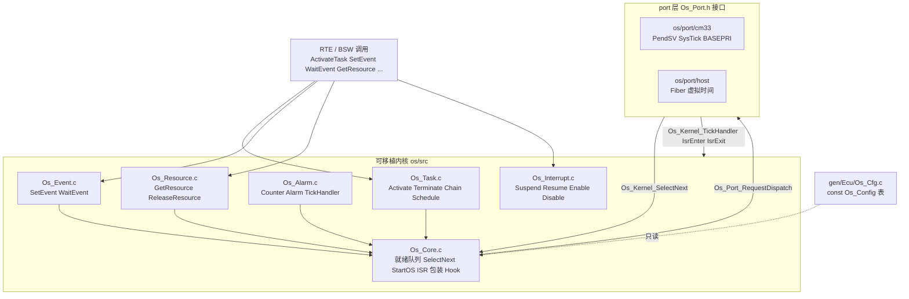
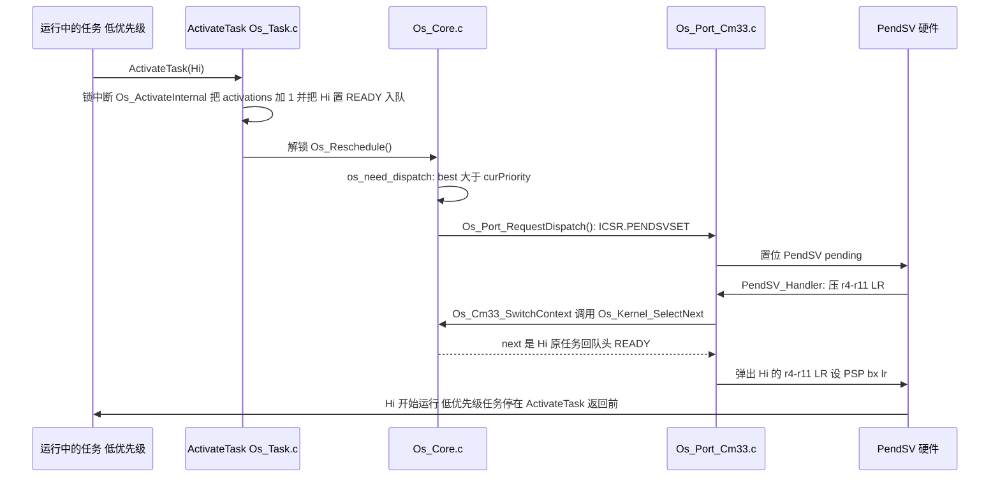
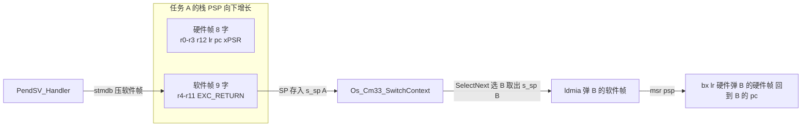

# 03 OS 代码：从 `ActivateTask` 到 PendSV 上下文切换

> 本章回答：(1) 一个迷你 AUTOSAR OS 的数据结构（TCB、就绪队列、Alarm、Resource）长什么样，调度算法是什么？(2) `ActivateTask` / `TerminateTask` / `ChainTask` / `WaitEvent` / Alarm / Resource / Cat2 ISR 在代码里各做了什么？(3) Cortex-M33 上 PendSV 怎样真的把 CPU 从一个任务切到另一个（逐行）？host 上又是怎么模拟的？(4) Renode 上的 OS 自检 trace 每一行是谁打印的？
> Prerequisite: [02 配置与生成](02-config-and-generation.md)（`Os_Cfg.c` 从哪来）；[11/06 OS 基础](../11-classic-autosar-primer/06-os-basics.md)（Task / Event / Alarm / Resource 概念）    Next: [04 RTE 代码](04-rte-code.md)
> 对应代码：`os/include/{Os.h,Os_CfgTypes.h,Os_Port.h}`、`os/src/{Os_Internal.h,Os_Core.c,Os_Task.c,Os_Event.c,Os_Alarm.c,Os_Resource.c,Os_Interrupt.c}`、`os/port/cm33/{Os_Port_Cm33.c,Mini_Time_Target.c,selftest/}`、`os/port/host/{Os_Port_Host.c,Os_PortFiber_Host.c,SimTime.c}`、`gen/LightEcu/Os_Cfg.{h,c}`、`integration/Os_Hooks.c`
> 对应规范（R25-11）：Os SWS R25-11 p.38 SWS_Os_00424 / 00425（StartOS / ShutdownOS）、p.79 SWS_Os_00052 / 00069 / 00070 / 00239、p.80 SWS_Os_00368 / 00369 / 00071 / 00092 / 00093、p.110 SWS_Os_00801、p.58 SWS_Os_00067 / 00068、p.109 §7.9.21（Resource handling）、p.91 §7.9.2（Scheduling）
> 深入阅读：[02-autosar-classic/06 OS Task ISR](../02-autosar-classic/06-os-task-isr.md)、[01-rh850/06 中断与异常](../01-rh850/06-interrupt-exception.md)、`DESIGN.md` §6

> **读法**：Os SWS R25-11 把任务 / 事件 / 闹钟的核心语义**委托给 OSEK/VDX OS 2.2.3**（本项目各 `os/src/*.c` 的文件头都这样写），SWS 自己主要补充多核、保护、错误码；所以本章里"状态机"和"调度策略"的依据是 OSEK，SWS 条目只在确有对应时引用。

---

## 1. 本章要回答的问题

| # | 问题 | 小节 |
|---|---|---|
| 1 | 内核有哪些数据结构？ | §3 |
| 2 | 调度算法？谁决定"要不要切换"、谁真的切换？ | §4 |
| 3 | `ActivateTask` / `TerminateTask` / `ChainTask` / `Schedule`？ | §5 |
| 4 | Event 与扩展任务（`WaitEvent`）？ | §6 |
| 5 | Alarm 与 tick？ | §7 |
| 6 | Resource 与优先级天花板？ | §8 |
| 7 | Cat2 ISR 框架、Hook、`StartOS`？ | §9、§10 |
| 8 | Cortex-M33 port：PendSV 逐行、PSP/MSP、BASEPRI、SysTick？ | §11 |
| 9 | host port：Fiber 与虚拟时间？ | §12 |
| 10 | Renode OS 自检 trace 怎么读？ | §13 |

## 2. 内核文件地图



`os/src/Os_Internal.h:10-16` 有同样的文件表。**两条最重要的接缝**：

1. **配置接缝**：内核只读 `const Os_ConfigType Os_Config`（`os/include/Os_CfgTypes.h:74-89`），由生成的 `Os_Cfg.c` 提供，内核不含任何应用知识。
2. **port 接缝**：`os/include/Os_Port.h:15-44`。内核通过 `Os_Port_RequestDispatch()` **请求**切换；port 在"最早的合法时刻"调用 `Os_Kernel_SelectNext()` 问内核"下一个跑谁"，然后保存 / 恢复 CPU 上下文。

## 3. 数据结构

### 3.1 配置表（只读，来自 `Os_Cfg.c`）

`Os_Cfg.c` 的各表在第 02 章已展示。内核读它的方式：任务 ID 就是 `Os_Config.tasks[]` 的下标（`Os_Cfg.h:32-35`），如 `Task_LightCtl = 2`；
`Os_TaskCfgType`（`os/include/Os_CfgTypes.h:21-31`）有 `entry`、`priority`、`maxActivations`、`extended`、`schedule`、`autostartModes`、`stackBase`、`stackWords`。`Os_Config` 把它们打包（`:74-87`）。

### 3.2 TCB（Task Control Block）

`os/src/Os_Internal.h:65-76`：

```c
typedef struct {
    TaskStateType  state;                 /* RUNNING / WAITING / READY / SUSPENDED (OSEK 4.2) */
    uint8          activations;           /* pending + running instances; state==SUSPENDED <=> 0 */
    uint8          curPriority;           /* dynamic priority: base, or raised by a resource ceiling */
    boolean        started;               /* FALSE: next dispatch must build a fresh context (Os_Port_InitTaskContext) */
    uint8          resCount;              /* number of resources currently held */
    uint8          resId[OS_MAX_HELD_RESOURCES];    /* LIFO stack of held resources ...                     */
    uint8          resPrio[OS_MAX_HELD_RESOURCES];  /* ... and the curPriority that was valid before each GetResource */
    EventMaskType  eventsSet;             /* extended tasks: events that are set */
    EventMaskType  eventsWaited;          /* mask of the pending WaitEvent (0 if not waiting) */
} Os_TcbType;
```

* TCB 数组 `Os_Tcb[OS_NUM_TASKS + 1u]`（`Os_Core.c:32`）：**多出来的最后一个是 Idle 任务**（`OS_IDLE_TASK`，`Os_Internal.h:32`），优先级 0，永远 READY，永不入队（`Os_Core.c:391`）。有了它，"没有任务可跑"不需要特判，PendSV 永远有一个可切换的目标。
* `curPriority` 与配置里的 `priority` 分开：持有 Resource 时被抬高到天花板（§8）。
* `started`：FALSE 表示"下次被选中时要从任务入口重新构造上下文"。新激活、被 `TerminateTask` 终止后又有排队激活，都会置 FALSE；而从 `WaitEvent` 中被唤醒的任务 `started` 仍为 TRUE，它接着在 `WaitEvent` 里继续跑（`Os_Event.c:39` 的注释）。

### 3.3 就绪队列

`os/src/Os_Core.c:47-95`：**每个优先级一个小环形 FIFO + 一个 32 位位图**：

```c
static TaskType s_q[OS_MAX_PRIORITY + 1u][OS_QUEUE_DEPTH];
static uint8    s_qHead[OS_MAX_PRIORITY + 1u];
static uint8    s_qCount[OS_MAX_PRIORITY + 1u];
static uint32   s_readyMask;
```

```c
static uint8 q_best(void)
{
    return (s_readyMask == 0u) ? 0u : (uint8)(31u - (uint32)__builtin_clz(s_readyMask));
}
```
（`Os_Core.c:87-90`）——位图第 p 位为 1 表示优先级 p 的队列非空；**最高就绪优先级 = `31 - clz(mask)`**，Cortex-M 上是一条 `CLZ` 指令，O(1)。

`q_push(t, prio, front)`（`:57-72`）有两个入口：新激活 / 被唤醒的任务进**队尾**（`front == FALSE`），被抢占的任务回**队头**（`front == TRUE`），这是 OSEK 的规则：
同优先级按激活顺序跑，被抢占的任务比后激活的同级任务先继续（`Os_Core.c:19-20` 注释；Os SWS R25-11 p.91 §7.9.2 的图 7.16 说明同一核上相同优先级的任务按激活顺序执行）。
`OS_MAX_PRIORITY = 31`、`OS_QUEUE_DEPTH = 16`（`Os_Internal.h:33-34`）；`os_check_config()`（`Os_Core.c:317-362`）在 `StartOS` 里验证配置：优先级必须在 1..31，且每个优先级队列的容量够用（一个任务持资源被抢占时会落在**天花板**队列里，所以天花板队列要为"所有更低优先级任务"各留一个槽，`:342-355`）。

### 3.4 Alarm / Counter 运行时

`os/src/Os_Alarm.c:21-30`：

```c
typedef struct {
    boolean  active;
    TickType expiry;            /* counter value at which the alarm fires */
    TickType cycle;             /* 0 = single shot */
} Os_AlarmRtType;
...
static TickType        s_counter[OS_NUM_COUNTERS + 1u];
static Os_AlarmRtType  s_alarm[OS_NUM_ALARMS + 1u];
```

Alarm 数 ≤ 4，到期检查就是线性扫描（`Os_Alarm.c:97-106`），**可读性优先**；真实 OS 会用按到期时间排序的链表或 delta list。

### 3.5 Resource 运行时

`os/src/Os_Resource.c:23`：`static TaskType s_resOwner[OS_NUM_RESOURCES + 1u];`（`[0]` 是 `RES_SCHEDULER`）。持有关系同时记在 TCB 的 `resId[]` / `resPrio[]` 里：这是一个 **LIFO 栈**，`resPrio[]` 保存"拿这个资源之前的 curPriority"，释放时原样恢复。

## 4. 调度算法

**[AUTOSAR Standard / OSEK]** 固定优先级抢占（`OS_SCHED_FULL`）；`OS_SCHED_NON` 的任务只在 `Schedule` / `TerminateTask` / `WaitEvent` 点让出（`Os_Core.c:152-154`）。**数字越大越紧急，0 是 Idle**（`Os.h:11-12`）。

### 4.1 谁决定切换、谁执行切换

两步分工（`Os_Core.c:22-27` 的头注释）：

```
service (e.g. ActivateTask)  -> changes TCB/queue under lock
                             -> Os_Reschedule(): "is the best READY task more urgent than the running one?"
                             -> Os_Port_RequestDispatch()
port, at its earliest legal point -> Os_Kernel_SelectNext(): pick the next task (this file)
                                  -> port saves/restores the CPU context.
```

**决定**（`Os_Core.c:137-168`）：

```c
static boolean os_need_dispatch(void)
{
    const Os_TcbType *run;
    uint8 best = q_best();

    if (Os_Started == FALSE) {
        return FALSE;                             /* still inside StartOS: nothing runs yet */
    }
    if ((Os_Running == INVALID_TASK) || (Os_Running == OS_IDLE_TASK)) {
        return (boolean)(best != 0u);             /* idle (or first dispatch): any READY task wins */
    }
    run = &Os_Tcb[Os_Running];
    if (run->state != RUNNING) {
        return TRUE;                              /* running task just terminated / went WAITING */
    }
    if (Os_Config.tasks[Os_Running].schedule == OS_SCHED_NON) {
        return FALSE;                             /* non-preemptive: only Schedule/Terminate/WaitEvent give up the CPU */
    }
    return (boolean)(best > run->curPriority);    /* strictly higher: equal priority never preempts (FIFO) */
}
```

最后一行是整个调度器的核心：**严格大于**当前任务的 `curPriority` 才抢占；同级永不抢占。注意比较的是 `curPriority`（含天花板抬高），不是配置里的基础优先级。
`Os_Reschedule()`（`:158-168`）在**锁中断状态下**调用 `os_need_dispatch()`，解锁后若需要就 `Os_Port_RequestDispatch()`，最后 `Os_Port_InterruptPoint()`（host 用于投递到期的模拟中断；target 为空）。

**执行**（`Os_Kernel_SelectNext`，`:190-242`，由 port 在锁定状态下调用）：

```c
    if ((prev != INVALID_TASK) && (prev != OS_IDLE_TASK)) {
        Os_TcbType *p = &Os_Tcb[prev];

        if (Os_Port_StackCheck(prev) == FALSE) {
            ShutdownOS(E_OS_STACKFAULT);          /* SWS_Os_00068 (no ProtectionHook in this OS) */
        }
        if (p->state == RUNNING) {
            if ((best <= p->curPriority) ||
                ((Os_Config.tasks[prev].schedule == OS_SCHED_NON) && (s_yield == FALSE))) {
                s_yield = FALSE;
                return prev;                      /* stale request: the running task keeps the CPU */
            }
            p->state = READY;                     /* preempted */
            q_push(prev, p->curPriority, TRUE);
        }
```
```c
    if (best == 0u) {
        next = OS_IDLE_TASK;
    } else {
        next = q_pop(best);
        Os_Tcb[next].state = RUNNING;
        if (Os_Tcb[next].started == FALSE) {      /* first run of this activation: build the initial context */
            Os_Tcb[next].started = TRUE;
            Os_Port_InitTaskContext(next);
            if (MINI_TRACE_OS_SWITCH == STD_ON) {
                TRACE(TRACE_CAT_OS, "TASK_START %s prio=%u", Os_Config.tasks[next].name,
                      (unsigned)Os_Config.tasks[next].priority);
            }
        }
    }
    Os_Running = next;
```

读法：(1) 先检查离开任务的栈 canary（SWS_Os_00067/00068，Os SWS R25-11 p.58：栈监控检测到栈故障且没配 ProtectionHook → `ShutdownOS(E_OS_STACKFAULT)`）；
(2) 如果离开的任务还是 `RUNNING`（说明是被抢占而不是自己终止 / 等待），但已没有更高优先级者 → **过期请求**，原任务继续（PendSV 可能在请求之后、实际执行之前状况已变）；否则标 READY 并**回队头**；
(3) 取 `best` 优先级队列的队首作为 `next`，标 RUNNING；若这是新实例（`started == FALSE`）就让 port 构造初始上下文，并打印 `TASK_START`——所以 trace 里的 `TASK_START` **只在任务从入口新开始时出现**，被抢占后恢复、`WaitEvent` 唤醒后恢复都没有这一行。

### 4.2 一次完整的"服务 → 切换"



## 5. 任务服务：`Os_Task.c`

### 5.1 任务状态机

`os/src/Os_Task.c:13-18`：

```
SUSPENDED --Activate--> READY --dispatch--> RUNNING --Terminate/Chain/return--> SUSPENDED
                           ^                  |   \--(activations left)--> READY (new instance)
                           |   preempt        v
                           +---------------- (higher priority READY) ;  RUNNING --WaitEvent--> WAITING --SetEvent--> READY
```

### 5.2 `ActivateTask`

`Os_Task.c:27-67`。核心 `Os_ActivateInternal`（被 `ActivateTask`、Alarm 到期、`StartOS` 自启动三处共用，**调用者持锁**）：

```c
    limit = (cfg->extended != FALSE) ? 1u : cfg->maxActivations;   /* extended tasks cannot queue activations */
    if (tcb->activations >= limit) {
        return E_OS_LIMIT;
    }
    tcb->activations++;
    if (tcb->state == SUSPENDED) {                 /* first (non-queued) activation: make a fresh READY instance */
        tcb->state = READY;
        tcb->started = FALSE;
        tcb->eventsSet = 0u;                       /* OSEK: events are cleared when the task is activated */
        tcb->eventsWaited = 0u;
        tcb->curPriority = cfg->priority;
    }
    Os_Ready_Enqueue(t);                           /* every activation = one FIFO entry (activation order is kept) */
    return E_OK;
```

两点：(1) `activations` 计"运行中 + 排队中"的实例数，超过 `maxActivations` 返回 `E_OS_LIMIT`——这就是 `Task_LightAct` 配 `activation: 2` 的意义（第 02 章）：`Rte_Write` 连续激活时第二次进队而不是报错；(2) **每个激活是队列里的一项**，即使任务当前正在运行，第二次激活也入队，等第一次 `TerminateTask` 后再跑。
`ActivateTask` 本身（`:54-67`）：加锁 → `Os_ActivateInternal` → 解锁 → 出错调 `Os_ReportError`（→ ErrorHook）→ `Os_Reschedule()`：**更高优先级的任务在 `ActivateTask` 返回之前就已抢占调用者**（第 02 章实验 A 的现象）。

### 5.3 `TerminateTask`、`ChainTask`、`Schedule`

* `Os_Task_Finish()`（`:71-89`）：打印 `TASK_END`，`activations--`，清事件，`curPriority` 恢复为基础值；若还有排队激活 → `READY`、`started = FALSE`（入口还在队列里），否则 `SUSPENDED`。
* `TerminateTask`（`:106-121`）：先做阻塞型服务的公共检查 `os_check_blocking_call()`（`:92-104`）：不在任务上下文 → `E_OS_CALLEVEL`；中断被 Suspend/Disable → `E_OS_DISABLEDINT`（SWS_Os_00093，Os SWS R25-11 p.80：中断被禁时调用 OS 服务应忽略并返回 `E_OS_DISABLEDINT`；**这里只对阻塞型服务检查**，见 `DESIGN.md` §17 第 5 项）；持有 Resource → `E_OS_RESOURCE`。通过后 `Os_Task_Finish()`，然后 `Os_Port_RequestDispatch(); for (;;) { }`——**永不返回**：PendSV 一发生，这个任务的栈就被丢弃，下一次激活由 `Os_Port_InitTaskContext` 重建。
* `ChainTask`（`:123-150`）：同样检查，加上目标任务激活数限制；**在一个临界区内**先 `Os_Task_Finish()` 再 `Os_ActivateInternal(TaskID)`，保证"终止 + 激活"原子。自链（`TaskID == Os_Running`）时 `Os_Task_Finish` 腾出了槽位。
* `Schedule`（`:152-162`）：调 `Os_Sched_Yield()`（`Os_Core.c:171-183`）：**只让给严格更高优先级的就绪任务**（`q_best() > curPriority`），同级的就绪任务不会被让出（这是 OSEK 语义，`DESIGN.md` §17 第 3 项记录了与初稿的差异）。
* **任务体返回而没调 `TerminateTask`**：port 把任务栈帧里的 `LR` 设成 `Os_Port_TaskReturn`（§11.2），任务一 `return` 就进 `Os_Kernel_TaskReturn`（`Os_Core.c:263-275`）：`ErrorHook(E_OS_MISSINGEND)`、释放所持 Resource、恢复中断、隐式终止。
  **[AUTOSAR Standard]** 对应 SWS_Os_00052（终止任务）、SWS_Os_00069（调 ErrorHook）、SWS_Os_00070（释放 OSEK Resource）、SWS_Os_00239（重新使能中断），Os SWS R25-11 p.79。
  这也解释了为什么 `gen/…/Rte_Tasks.c` 的基本任务体末尾都显式写 `(void)TerminateTask();`（`Rte_Tasks.c:51,69,128`）。

## 6. Event 与扩展任务：`Os_Event.c`

**[AUTOSAR Standard / OSEK]** Event 只属于**扩展任务**；`SetEvent` 可从任务、ISR、Alarm 动作调用。

`Os_SetEventInternal`（`Os_Event.c:21-43`）：

```c
    if (Os_Config.tasks[t].extended == FALSE) {
        return E_OS_ACCESS;                        /* basic tasks own no events */
    }
    tcb = &Os_Tcb[t];
    if (tcb->state == SUSPENDED) {
        return E_OS_STATE;                         /* events of a suspended task are meaningless */
    }
    tcb->eventsSet |= mask;
    TRACE(TRACE_CAT_OS, "EVENT_SET %s mask=0x%x", Os_Config.tasks[t].name, (unsigned)mask);
    if ((tcb->state == WAITING) && ((tcb->eventsSet & tcb->eventsWaited) != 0u)) {
        tcb->eventsWaited = 0u;
        tcb->state = READY;                        /* started stays TRUE: it resumes inside WaitEvent */
        Os_Ready_Enqueue(t);
    }
    return E_OK;
```

`SetEvent`（`:45-58`）= 加锁调内部函数 + 解锁 + `Os_Reschedule()`：被唤醒的扩展任务若优先级高于调用者，就在 `SetEvent` 返回前抢占。

`WaitEvent`（`:103-138`）：

```c
        if ((tcb->eventsSet & Mask) != 0u) {       /* event already there: no blocking (OSEK) */
            Os_Port_RestoreAll(lk);
            return E_OK;
        }
        tcb->state = WAITING;
        tcb->eventsWaited = Mask;
        if (MINI_TRACE_OS_SWITCH == STD_ON) {
            TRACE(TRACE_CAT_OS, "TASK_WAIT %s mask=0x%x", Os_Config.tasks[Os_Running].name, (unsigned)Mask);
        }
        Os_Port_RestoreAll(lk);
    }
    Os_Port_RequestDispatch();                     /* we continue here after SetEvent made us READY and the dispatcher chose us */
    return E_OK;
```

关键：**扩展任务阻塞在 `WaitEvent` 的"中间"**：它的栈（含局部变量、返回地址）被完整保留；`SetEvent` 使它 READY 后，调度器再选中它时，PendSV 恢复它的上下文，**`Os_Port_RequestDispatch()` 返回，任务从 `WaitEvent` 的下一行继续**。
所以 `started` 保持 TRUE（不重建上下文）。这是 Fiber / PendSV 这类"每任务独立栈"的设计才能提供的语义；基本任务（run-to-completion）没有这个需求。

`ClearEvent`（`:60-80`）只清**调用者自己**的位；`GetEvent`（`:82-101`）读不清。第 04 章的 `Task_LightCtl` 正是 `WaitEvent → GetEvent → ClearEvent` 三连。

## 7. Alarm 与 tick：`Os_Alarm.c`

### 7.1 tick 是怎么进来的

target 上：SysTick 异常（`Mini_Time_Target.c:80-84`）：

```c
MINI_CODE_FAST void SysTick_Handler(void)
{
    s_ms++;
    Mini_Time_TickHook();
}
```

`Mini_Time_TickHook` 在本文件里有一个 **weak** 空实现（`:75-77`），OS port（`Os_Port_Cm33.c:145-148`）提供 strong 定义调 `Os_Kernel_TickHandler()`。这样 rest-bus 镜像（没有 OS）也能用同一个时间文件。
SysTick 的初始化在 `Mini_Time_Init`（`:32-43`）：`LOAD = MINI_CPU_CLOCK_HZ/1000 - 1`（80 MHz → 79999 = 1 ms），`CSR = 0x7`（核心时钟 | TICKINT | ENABLE）。

### 7.2 tick → Alarm → 任务

`Os_Kernel_TickHandler`（`Os_Alarm.c:112-123`）：`Os_Counter_Advance(systemCounter)` → `Os_Reschedule()`。
`Os_Counter_Advance`（`:90-107`）：

```c
    value = (s_counter[c] >= Os_Config.counters[c].maxAllowedValue) ? 0u : (TickType)(s_counter[c] + 1u);
    s_counter[c] = value;
    for (a = 0u; a < Os_Config.numAlarms; a++) {
        if ((Os_Config.alarms[a].counter == c) && (s_alarm[a].active != FALSE) && (s_alarm[a].expiry == value)) {
            if (s_alarm[a].cycle != 0u) {
                s_alarm[a].expiry = ctr_add(c, value, s_alarm[a].cycle);     /* cyclic: re-arm before running the action */
            } else {
                s_alarm[a].active = FALSE;
            }
            alarm_fire(a);
        }
    }
```

`alarm_fire`（`:52-87`）打印 `ALARM <name>` 并按 `action` 分派：`ACTIVATETASK` → `Os_ActivateInternal`；`SETEVENT` → `Os_SetEventInternal`；`CALLBACK` → 调回调（在 tick/ISR 上下文、中断已锁）；`INCREMENTCOUNTER`。
注意 tick 处理程序里用的是 **`*Internal`**（不做 reschedule），所有 Alarm 处理完再统一 `Os_Reschedule()` 一次：多个 Alarm 在同一 tick 到期时，先全部变为 READY，再选最高的。

`Os_Alarm_Init`（`:137-154`）在 `StartOS` 里调用：计数器清零、按 `autostart` 与应用模式装载 Alarm（`alarm_arm`，`:128-135`：相对 = 当前值 + start；绝对 = start）。
LightEcu 的 `Alarm_LightCtl20ms`：`start = 20`、`cycle = 20` → 第一次在计数 20 到期，之后每 20 tick 一次。

## 8. Resource 与优先级天花板：`Os_Resource.c`

**[AUTOSAR Standard / OSEK]** Os SWS R25-11 p.109 §7.9.21 提到"GetResource 使用的优先级天花板协议临时改变任务的优先级"，且 p.110 SWS_Os_00801：Resource（及 Spinlock）必须按严格 LIFO 释放，否则 `ReleaseResource` 返回 `E_OS_NOFUNC`。

`GetResource`（`Os_Resource.c:39-73`）：

```c
        if ((s_resOwner[ResID] != INVALID_TASK) ||                         /* already occupied (also by the caller) */
            (Os_Config.tasks[Os_Running].priority > res_ceiling(ResID))) { /* task not covered by the ceiling */
            st = E_OS_ACCESS;
```
```c
    tcb->resId[tcb->resCount] = ResID;
    tcb->resPrio[tcb->resCount] = tcb->curPriority;       /* remember the priority to restore on release */
    tcb->resCount++;
    s_resOwner[ResID] = Os_Running;
    if (res_ceiling(ResID) > tcb->curPriority) {
        tcb->curPriority = res_ceiling(ResID);            /* priority ceiling: now nobody that uses it can preempt us */
    }
```

* 获取时：持有者的 `curPriority` 提升到天花板，**不需要锁中断、没有阻塞**。因为天花板 = 所有访问者的最高优先级，别的访问者都不可能抢占持有者，所以访问者之间天然互斥；而优先级高于天花板的任务（与这个资源无关）仍然可以抢占。
* "任务不被天花板覆盖"（任务基础优先级 > 天花板）→ `E_OS_ACCESS`：这是对**配置错误**（漏掉了某个访问者）的运行时防线；第 02 章 §5 的"天花板偏低"校验在生成期就把它挡住了。

`ReleaseResource`（`:83-110`）：检查持有者与 LIFO（`resId[resCount-1] == ResID`，否则 `E_OS_NOFUNC`），`res_pop` 恢复 `resPrio`，**然后 `Os_Reschedule()`**——优先级降下来了，之前被挡住的任务现在可以抢占。
**Resource 只能由任务获取**：ISR 里调用返回 `E_OS_CALLEVEL`（`:47-48`、`:91-92`；`DESIGN.md` §17 第 4 项）。

LightEcu 的实例：`Res_EA_Odo` 天花板 3（`Os_Cfg.c:114`）。`Task_LightAct`（2）进入 `Odo_GetDistance` 的独占区后 `curPriority = 3`；这时 `Task_LightCtl`（3）被唤醒，`best(3) > curPriority(3)`？否 → 不抢占，等 `Rte_Exit_EA_Odo()` → `ReleaseResource` → `Os_Reschedule()` 才切过去。
§13 的 OS 自检里有一个**可以直接看到**的版本。

## 9. Cat2 ISR 框架与中断服务

### 9.1 包装与退出检查（`Os_Core.c:277-312`）

```c
void Os_Kernel_IsrEnter(ISRType id)
{
    if (Os_IsrDepth < OS_MAX_ISR_NEST) {
        Os_IsrIds[Os_IsrDepth] = id;
        s_isrSnap[Os_IsrDepth] = Os_Interrupt_Snapshot();
    }
    Os_IsrDepth++;
    ...TRACE "ISR_ENTER %s"
}
void Os_Kernel_IsrExit(void)
{
    ...
    Os_IsrDepth--;
    if (Os_IsrDepth < OS_MAX_ISR_NEST) {
        id = Os_IsrIds[Os_IsrDepth];
        if (Os_Interrupt_Unwind(s_isrSnap[Os_IsrDepth]) != FALSE) {
            Os_ReportError(OSServiceId_IsrExit, E_OS_DISABLEDINT);
        }
    }
    ...TRACE "ISR_EXIT %s"
    Os_Reschedule();
}
```

进入时记下"中断嵌套状态快照"，退出时对比：ISR 若调了 `SuspendOSInterrupts` 等却没配对的 `Resume…`，内核代为恢复并 `ErrorHook(E_OS_DISABLEDINT)`——**[AUTOSAR Standard]** SWS_Os_00368（Os SWS R25-11 p.80）；对未释放的 Resource 则是 SWS_Os_00369（同页，`E_OS_RESOURCE`；本项目里 ISR 根本不能 `GetResource`，所以这条被更早的 `E_OS_CALLEVEL` 覆盖）。
最后 `Os_Reschedule()`：**ISR 里 `ActivateTask` / `SetEvent` 唤醒了更高优先级任务，在最外层 ISR 返回后才切换**（target：`Os_Reschedule` 只 pend PendSV，而 PendSV 优先级最低，必须等所有 ISR 结束，§11.3）。

### 9.2 Suspend / Resume（`Os_Interrupt.c`）

* `SuspendOSInterrupts` / `ResumeOSInterrupts`（`:47-67`）：嵌套计数；最外层 `Os_Port_SetOsMask(TRUE/FALSE)`（target：`BASEPRI = 0x40`）。只屏蔽 Cat2 与 SysTick，**不影响更高优先级的 Cat1 / 故障**。RTE 与 BSW 的短临界区都用它（`Rte.c:94`、`bsw/schm/SchM.h:28-36`）。
* `SuspendAllInterrupts` / `ResumeAllInterrupts`（`:25-45`）：嵌套计数 + `PRIMASK`；`DisableAllInterrupts` / `EnableAllInterrupts`（`:69-84`）：不嵌套。
* **[AUTOSAR Standard]** SWS_Os_00092（Os SWS R25-11 p.80）：没有配对的 Disable 就调用 Enable/Resume → OS 不执行该服务（`Os_Interrupt.c:37-39` 的 `if (s_allNest == 0u) { return; }`）。

### 9.3 target 上的 IRQ 分发：`Os_Cm33_IrqEntry`

`target/stm32l552/startup/startup.c:74` 用 GCC 范围指示符 `[16 ... NUM_VECTORS - 1u] = Os_Cm33_IrqEntry` 把**所有外部 IRQ 向量都指向同一个函数**（`DESIGN.md` §17 第 14 项）。`Os_Port_Cm33.c:303-322`：

```c
MINI_CODE_FAST void Os_Cm33_IrqEntry(void)
{
    ...
    __asm volatile ("mrs %0, ipsr" : "=r" (ipsr));
    irq = ipsr - 16u;
    for (i = 0u; i < Os_Config.numIsrs; i++) {
        if (Os_Config.isrs[i].irqNumber == irq) {
            Os_Kernel_IsrEnter((ISRType)i);
            Os_Config.isrs[i].handler();
            Os_Kernel_IsrExit();                        /* may pend PendSV: the switch happens after the last ISR ends */
            return;
        }
    }
    /* No handler configured for this interrupt: switch the line off, otherwise it would fire forever. */
    NVIC_ICER(irq >> 5) = (1uL << (irq & 31u));
    TRACE(TRACE_CAT_OS, "ERROR spurious irq=%u", (unsigned)irq);
}
```

`IPSR` 是当前异常号（外部 IRQ n 的 IPSR = 16 + n）；表 `Os_Config.isrs[]` 里 `irqNumber == 39` 的那一项就是 `Isr_CanRx`（`Os_Cfg.c:119`），`handler` = `Os_Isr_Isr_CanRx`（`Rte_Tasks.c:136-139`），它只做一件事 `Can_Isr_Rx();`。
**这就是真实 OS 的 "ISR wrapper" 的最小版**：向量表只有一个入口，OS 负责 Enter / Exit 记账与 reschedule。商业 OS 通常为每个 ISR 生成一个独立的向量入口，原理相同。

## 10. Hook、`StartOS`、`ShutdownOS`

### 10.1 Hook：`integration/Os_Hooks.c:24-50`

`StartupHook`、`PreTaskHook`、`PostTaskHook` 为空；`ErrorHook`（`:28-33`）打印 `OS ERROR svc=%u err=%u` 并 `Det_ReportRuntimeError`；`ShutdownHook`（`:35-42`）打印 `OS SHUTDOWN err=%u`，host 版再 `SCENARIO END` 并 `SimCan_Deinit()` 刷新 TX 日志。
内核按 `Os_Cfg.h:25-29` 的 `OS_USE_*HOOK` 开关调用（LightEcu：Startup/Error/Shutdown 开，Pre/PostTask 关）。
`Os_ReportError(svc, err)`（`Os_Core.c:100-112`）：记下失败服务号（`OSErrorGetServiceId()` 可取），防重入地调 `ErrorHook`。
**SWS_Os_00071**（Os SWS R25-11 p.80）：`ShutdownOS` 时不调用 `PostTaskHook`——`ShutdownOS` 里确实没有（`Os_Core.c:417-431`）。

### 10.2 `StartOS`（`Os_Core.c:368-413`）

```c
    (void)Os_Port_DisableAll();                   /* the port re-enables interrupts when the first task starts */
    s_appMode = Mode;

    st = os_check_config();
    ...
    for (i = 0u; i <= OS_NUM_TASKS; i++) {
        Os_Tcb[i].state = SUSPENDED; ... 
    }
    Os_Tcb[OS_IDLE_TASK].state = READY;            /* the idle task is always ready, never queued */
    Os_Resource_Init();

    Os_Port_Init();                                /* NVIC/SysTick priorities, stack paint, host fiber environment */
    TRACE(TRACE_CAT_OS, "STARTOS mode=%u", (unsigned)Mode);
    Os_Tcb[OS_IDLE_TASK].started = TRUE;
    Os_Port_InitTaskContext(OS_IDLE_TASK);

    for (i = 0u; i < Os_Config.numTasks; i++) {   /* autostart tasks of this application mode */
        if ((Os_Config.tasks[i].autostartModes & (1uL << Mode)) != 0u) {
            (void)Os_ActivateInternal(i);
        }
    }
    Os_Alarm_Init(Mode);                           /* counters := 0 and autostart alarms */

#if OS_USE_STARTUPHOOK
    StartupHook();
#endif
    Os_Port_StartTick();
    Os_Started = TRUE;
    Os_Port_StartFirstTask();                      /* never returns */
```

顺序：关中断 → 配置检查 → TCB 初始化（所有任务 SUSPENDED，Idle READY）→ port 初始化（栈涂 `0xDEADBEEF`、NVIC 优先级与使能）→ 打印 `STARTOS` → 自启动任务入队 → Alarm 装载 → `StartupHook` → 启动 SysTick → `Os_Started = TRUE` → 交给 port，**永不返回**。
**[AUTOSAR Standard]** SWS_Os_00424（Os SWS R25-11 p.38）：`StartOS` 第一次调用不返回；SWS_Os_00425（同页）：`ShutdownOS` 且 `ShutdownHook` 返回后，OS 须关所有中断并进入死循环——`Os_Port_Halt`（target：`cpsid i` + `wfi` 循环，`Os_Port_Cm33.c:256-262`）。

LightEcu 的自启动任务是 `Task_Init`（优先级 10）与 `Task_LightCtl`（3）（`Os_Cfg.c:40,60` 的 `.autostartModes = 0x1u`），所以第一个 PendSV 选中 `Task_Init`；它跑完 `TerminateTask`，`Task_LightCtl` 才开始，直至 `WaitEvent`。
对应 Renode 上 `uart_b.log` 的第 5–32 行（`OS STARTOS` → `TASK_START Task_Init` → … → `TASK_END Task_Init` → `TASK_START Task_LightCtl prio=3` → `TASK_WAIT Task_LightCtl mask=0x7`）。

## 11. Cortex-M33 port：`os/port/cm33/Os_Port_Cm33.c`

### 11.1 内存模型与中断优先级

头注释（`:15-33`）：

* **MSP**（主栈，链接脚本 `.stack` 4 KB）：Reset、全部异常 / ISR / PendSV、第一个任务启动之前的代码。
* **PSP**（进程栈）：每个任务一个私有栈（`.os_stack`，由生成的 `Os_Cfg.c` 的数组提供），任务运行在 thread 模式。
* **中断优先级**（`Os_Port.h:46-49`）：`OS_CM33_PRIO_BITS = 4`（STM32L5 有 16 级，数值在 bit[7:4]）；`OS_CM33_MAX_SYSCALL_PRIO = 0x40`（Cat2 ISR 与 SysTick 必须 ≥ 这个值）；`OS_CM33_PENDSV_PRIO = 0xF0`（最低紧急度，PendSV 只在没有其他 ISR 活动时运行）。
  `Os_Port_Init`（`:101-137`）设置 `SHPR` 的 PendSV / SysTick 优先级，给所有任务栈涂 `0xDEADBEEF`，并按 `Os_Config.isrs[]` 设置 NVIC 优先级、清挂起、使能（`:126-136`；低于 `0x40` 的会被拉到 `0x40`）。
* **锁**：`Os_Port_DisableAll` / `RestoreAll`（`:266-277`）= 读 `PRIMASK` 后 `cpsid i` / 写回，**返回前一状态所以可嵌套**——内核里每个临界区都是 `lk = Os_Port_DisableAll(); ...; Os_Port_RestoreAll(lk);`；`Os_Port_SetOsMask`（`:279-284`）= 写 `BASEPRI`（`0x40` 或 0）。

### 11.2 初始栈帧：任务第一次"被恢复"时看到什么

`Os_Port_InitTaskContext`（`:151-174`）在任务栈顶构造一个**假的"已被中断过"的栈帧**，使第一次切换到它时和恢复一个旧任务走同一条路径：

```c
    top = (uint32 *)((uintptr_t)(base + words) & ~(uintptr_t)7u);      /* AAPCS: 8-byte aligned stack top */
    frame = top - FRAME_WORDS;
    for (i = 0u; i < FRAME_WORDS; i++) {
        frame[i] = 0u;                                  /* r4-r11, r0-r3, r12 start as 0 */
    }
    frame[8]  = EXC_RETURN_THREAD_PSP;                  /* popped into LR by PendSV: "return to thread mode on PSP" */
    frame[14] = (uint32)(uintptr_t)Os_Port_TaskReturn;  /* LR  : where the task body returns to */
    frame[15] = (uint32)(uintptr_t)entry & ~1u;         /* PC  : first instruction of the task (Thumb bit lives in xPSR) */
    frame[16] = XPSR_THUMB;                             /* xPSR: T bit must be 1 on Cortex-M */
```

17 个字（`FRAME_WORDS`，`:55`），**从低地址到高地址**：

| 下标 | 内容 | 谁来弹出 |
|---|---|---|
| 0–7 | r4–r11（初值 0） | PendSV 的 `ldmia`（软件帧） |
| 8 | `EXC_RETURN = 0xFFFFFFFD`（"返回 thread 模式、用 PSP、无 FPU 帧"） | `ldmia` 弹入 `lr` |
| 9–12 | r0–r3（0） | 异常返回时硬件弹出（硬件帧） |
| 13 | r12（0） | 硬件 |
| 14 | `lr` = `Os_Port_TaskReturn`（任务体返回到这里，§5.3） | 硬件 |
| 15 | `pc` = 任务入口 `Os_Task_<name>`（清 bit0） | 硬件 |
| 16 | `xPSR = 0x01000000`（T 位必须为 1） | 硬件 |

### 11.3 PendSV 上下文切换：逐行

`Os_Port_Cm33.c:197-216`：

```c
__attribute__((naked, used)) MINI_CODE_FAST void PendSV_Handler(void)
{
    __asm volatile (
        "mrs   r0, psp                \n"   /* r0 = PSP of the task that was interrupted (hardware frame is on top of it)   */
        "isb                          \n"
        "stmdb r0!, {r4-r11, lr}      \n"   /* push r4-r11 and EXC_RETURN below the hardware frame, r0 = new PSP            */
        "mov   r1, #0x40              \n"   /* OS_CM33_MAX_SYSCALL_PRIO: from now on no OS interrupt may touch kernel data   */
        "msr   basepri, r1            \n"
        "isb                          \n"
        "bl    Os_Cm33_SwitchContext  \n"   /* r0 = old PSP in, new PSP out (C function, may clobber r0-r3, r12, lr)         */
        "mov   r1, #0                 \n"
        "msr   basepri, r1            \n"   /* unmask again */
        "ldmia r0!, {r4-r11, lr}      \n"   /* pop r4-r11 and EXC_RETURN of the entering task, r0 -> its hardware frame      */
        "msr   psp, r0                \n"   /* PSP := hardware frame of the entering task                                    */
        "isb                          \n"
        "bx    lr                     \n"   /* EXC_RETURN: hardware pops r0-r3,r12,lr,pc,xPSR and resumes the task           */
    );
}
```

先看全貌（`:19-28` 的头注释）：硬件在进入异常时已把 `r0-r3, r12, lr, pc, xPSR`（8 个字，**硬件帧**）压到被中断任务的 PSP；PendSV 再压 `r4-r11 + EXC_RETURN`（9 个字，**软件帧**）。一个"睡着的"任务的栈顶就是这 17 个字，格式与 §11.2 构造的初始帧完全一致。



逐行：

1. `mrs r0, psp`：被打断任务的 PSP（指向它的硬件帧）。
2. `stmdb r0!, {r4-r11, lr}`：把 r4–r11 和 `lr`（此时 `lr` 里是 `EXC_RETURN`）压在硬件帧下面，`r0` 更新为新的栈顶。**这是 C 编译器不会替你保存的寄存器**（r4–r11 是 callee-saved，调用约定保证任何 C 函数返回时它们不变；但**任务切换**要在"别的任务的函数里"返回，所以必须手动保存）。
3. `mov r1,#0x40; msr basepri,r1`：把 BASEPRI 抬到 `0x40`，**屏蔽 SysTick 与所有 Cat2 ISR**（它们的优先级值 ≥ 0x40），因为接下来 `Os_Kernel_SelectNext` 要改就绪队列，而 tick / ISR 里也会改（`ActivateTask`…）。PendSV 本身优先级 `0xF0`，所以它在**所有** ISR 之后才能运行；此时 BASEPRI 再抬高保证内核数据一致。
4. `bl Os_Cm33_SwitchContext`（C 函数，`:180-195`）：

   ```c
       s_curSp = sp;
       next = Os_Kernel_SelectNext(&prev);
       if ((prev != INVALID_TASK) && (s_fresh[prev] == FALSE)) {
           s_sp[prev] = sp;                                /* leaving task keeps its context (unless it was just re-initialised) */
       }
       ...
       return s_sp[next];
   ```
   `r0` 入 = 离开任务的新 PSP，出 = 进入任务的 PSP（它的软件帧最低地址）。`s_fresh[]` 处理一个边界：被 `TerminateTask` 终止后，`Os_Port_InitTaskContext` 已经重建了那个任务的栈帧，**不能**再用 `sp` 覆盖它。
   第一次启动时 `prev == INVALID_TASK`，什么都不用存（§11.4）。
5. `mov r1,#0; msr basepri,r1`：放开中断。
6. `ldmia r0!, {r4-r11, lr}`：弹出进入任务的 r4–r11 与 `EXC_RETURN`，`r0` 指向它的硬件帧。
7. `msr psp, r0`：PSP 指向进入任务的硬件帧。
8. `bx lr`：`lr` 是 `EXC_RETURN`（`0xFFFFFFFD`）；这个特殊值触发**异常返回**：硬件从 PSP 弹出 `r0-r3, r12, lr, pc, xPSR`，从新任务的 `pc` 继续。
   对一个**新任务**，那个 `pc` 就是任务入口；对一个**被抢占的任务**，是它当时被打断的指令；对一个**在 `WaitEvent` 里睡着的任务**，是 `Os_Port_RequestDispatch()` 里 `dsb/isb` 之后（`:222-223`）——从 `WaitEvent` 返回。

`Os_Port_RequestDispatch`（`:220-224`）只是 `SCB_ICSR = ICSR_PENDSVSET` 加 `dsb; isb`：**在任务上下文且中断开着时**，PendSV 立即被取走，调用者在这里就被切走；**在 ISR 里或中断被屏蔽时**，PendSV 保持挂起，等 ISR 全部结束 / BASEPRI 放开才执行。
这样，同一个 `Os_Reschedule()` 在任务里是"立刻抢占"，在 ISR 里是"ISR 结束后抢占"，内核代码不用区分。

### 11.4 启动第一个任务：`Os_Port_StartFirstTask`（`:230-249`）

```c
        "msr   psp, %0                \n"   /* PSP -> dummy stack (the first PendSV pushes its 9 words there)                */
        "msr   msp, %1                \n"   /* MSP -> top of main stack: discard StartOS's frames                            */
        "isb                          \n"
        "str   %3, [%2]               \n"   /* ICSR.PENDSVSET = 1                                                            */
        "dsb                          \n"
        "cpsie i                      \n"   /* PRIMASK = 0: PendSV is taken here and starts the first task                   */
        "isb                          \n"
        "1: b 1b                      \n"   /* never reached (PendSV does not come back to this thread context)              */
```

此时 CPU 仍在 thread 模式、用 MSP（代码里没有写 `CONTROL`）。步骤：PSP 指到一块哑栈 `s_bootStack`；MSP 复位到主栈顶（`vector[0]`，丢弃 `StartOS` 的栈帧）；挂起 PendSV；`cpsie i` → PendSV 立即被取走。
`Os_Kernel_SelectNext` 看到 `prev == INVALID_TASK`，选中最高优先级任务；PendSV 末尾的 `bx lr` 用的是**新任务初始帧里的 `EXC_RETURN=0xFFFFFFFD`**，该值让硬件切到 PSP（`CONTROL.SPSEL` 由异常返回设置）。
所以哑栈上压的 9 个字、MSP 上压的硬件帧都不会被再用到，"离开的上下文"根本不存在，这也是为什么需要给 `Os_Port_StartFirstTask` 一块哑栈。`gdb_session.txt` 第 5 节正是停在这里：`Os_Cm33_SwitchContext (sp=0x20001484 <s_bootStack+92>)`。

### 11.5 SysTick、栈监控与其它

* **SysTick**：§7.1。
* **栈监控**：`Os_Port_StackCheck`（`:327-346`）检查栈底 4 个字的 `0xDEADBEEF` canary 与保存的 SP 是否越界，`Os_Kernel_SelectNext` 每次切换都调用；`Os_Port_StackUsage`（`:349-363`）从底部数第一个不是 `0xDEADBEEF` 的字，给出高水位（字节）。
  `analysis/LightEcu.md` 的 "Os_Stack_*" 与 gdb 的 `mini_stacks`（`gdb_session.txt` 第 6 节：`Task_LightCtl 384 words, used 17`）用的是同一个涂色法。
* **Idle**（`Os_Cm33_IdleEntry`，`:84-89`）：在独立的 64 字栈上循环 `Os_Port_Idle()` = `wfi`（`:251-254`）。

### 11.6 RH850 上会换什么 [Conceptual / Industry Practice]

`Os_Port.h:15-44` 的这套接口就是移植面：`Os_Port_Init`、`StartTick`、`InitTaskContext`、`RequestDispatch`、`StartFirstTask`、`Idle`、`Halt`、`DisableAll/RestoreAll`、`SetOsMask`、`InIsr`，加上 `Os_Kernel_TickHandler/IsrEnter/IsrExit/SelectNext` 的调用点。
RH850 上（见 [01-rh850/06](../01-rh850/06-interrupt-exception.md) §8.5）：`DisableAllInterrupts` 对应 PSW.ID（`DI`/`EI`），`SuspendOSInterrupts` 用 PMR 或等效机制屏蔽 Cat2 所在优先级，ISR wrapper 要保存 GPR 与 EIPC/EIPSW。
任务切换的"请求"在 RH850 上常借助一个最低优先级、软件触发的中断来实现（类似 PendSV 的角色），上下文保存格式由 OS 供应商的 port 决定——**这属于行业常见做法，具体以所用 OS 的 port 文档为准**，不是 AUTOSAR 规定。
**内核（`os/src`）一个字都不用改。**

## 12. host port：Fiber 与虚拟时间（`os/port/host/`）

**[Educational Implementation]** 同一份内核在 Windows 上跑，需要"每任务一个独立栈、可在中途挂起"。选型 = **Windows Fiber**（`DESIGN.md` §6.5）。

* `os/port/host/HostFiber.h:12-15` 的 4 个函数（`ConvertThread` / `Create` / `Switch` / `Delete`）是对 `ConvertThreadToFiber` / `CreateFiber` / `SwitchToFiber` / `DeleteFiber` 的薄封装，放在独立的 `Os_PortFiber_Host.c`（`:10-42`），因为 `<windows.h>` 与 AUTOSAR 的 `SetEvent` 同名冲突（`Os.h:22-28` 在 host 构建里把 `SetEvent` 宏重命名为 `Os_SetEvent`，`DESIGN.md` §17 第 15 项）。
* 主线程变成 Idle 任务（`Os_Port_Init`，`Os_Port_Host.c:210-217`）。
* **切换**（`host_switch`，`:94-105`）：

  ```c
      TaskType next = Os_Kernel_SelectNext(&prev);
      void *target = s_fiber[next];

      if (target != s_curFiber) {
          s_curFiber = target;
          HostFiber_Switch(target);                    /* returns when some other fiber switches back to us */
          fiber_reap();
      }
  ```
  同一个 `Os_Kernel_SelectNext`，只是"保存/恢复上下文"变成了 `SwitchToFiber`。
* **任务入口**（`host_fiber_main`，`:83-91`）：`Os_Config.tasks[t].entry(); Os_Kernel_TaskReturn();`——与 target 的 `LR = Os_Port_TaskReturn` 对应：入口函数返回即 `E_OS_MISSINGEND`。
  `Os_Port_InitTaskContext`（`:228-238`）"重建上下文" = 创建一个新 Fiber（旧 Fiber 延迟到切走后再 `DeleteFiber`，因为不能删除正在运行的 Fiber，`fiber_retire` / `fiber_reap`，`:51-80`）。
* **虚拟时间**：时间不跟墙钟，只在 Idle 与 `Os_HostBurn()` 里推进。Idle（`Os_Port_Idle`，`:252-260`）：没有 READY 任务时 `host_advance(到下一个 1 ms 边界)`；
  `host_advance`（`:182-189`）= `SimTime_AdvanceUs` → 到 tick 边界就 `host_on_boundary()`（`:167-180`：+1 个 pending tick、投递 tick、跑 sim step hooks——CAN 脚本 / rest-bus、检查仿真结束）→ `host_deliver()`（投递 Cat2 ISR、执行挂起的任务切换）。
  所以 **同一毫秒内的所有 trace 时间戳相同**，行序即因果序。
* **Cat2 ISR 模拟**：`host_run_isr`（`:117-131`）在**当前 Fiber 的栈上以函数调用方式**运行 ISR，期间 `s_inIsr > 0`（`Os_Port_InIsr()` 返回 TRUE，`GetISRID` / `E_OS_CALLEVEL` 检查照常生效），退出时 `Os_Kernel_IsrExit()` 做 reschedule，而 `Os_Port_RequestDispatch` 在 ISR 内只置 `s_dispatchPending`，等 ISR 返回后再切（`:242-250`）——**与 PendSV 的可观察行为一致**。
* **锁**：`Os_Port_DisableAll` 等只是标志位（`:279-295`），投递点遵守标志（`host_may_deliver`，`:143-146`）。
* **不模拟**：真正的异步抢占（只在 Idle / `Os_HostBurn` / 内核服务返回处发生）与 PendSV 的真实延迟。

`tests/unit/test_os_*.c`（`sched / events / alarms / resources / isr / errors`，`SOURCES: os/src/*.c os/port/host/*.c`，见 `tests/unit/test_os_resources.c:1`）就在 host port 上测内核行为：同一个内核源码，被当作"行为规格"逐条验证。

## 13. Renode 上的 OS 自检：`os/port/cm33/selftest`

**[Educational Implementation]** 在把 RTE 和 BSW 接上之前，先单独验证 OS port：`os/port/cm33/selftest/main.c` + 手写的 `Os_Cfg.c`（`selftest/Os_Cfg.c:23-53`，这就是生成器要产出的 `Os_Cfg.c` 的"微缩版"）。
运行：`python examples/mini_autosar_ecu/os/port/cm33/selftest/run_selftest.py`（build → Renode 无头运行 → 校验 UART 日志里事件顺序，`run_selftest.py:71-96` 的 `EXPECT`）。

配置（`selftest/Os_Cfg.c:24-46`）：

| 对象 | 配置 |
|---|---|
| `Task_Low` | 优先级 1，基本任务，自启动 |
| `Task_Ext` | 优先级 3，**扩展任务**，自启动 |
| `Task_Hi` | 优先级 5，基本任务，由 `Alarm_Hi` 激活 |
| `Res_X` | 天花板 5（`{ "Res_X", 5u }`，`:41`，= max(Task_Low 1, Task_Hi 5)） |
| `Alarm_Hi` | 20 ms 单次 → `ActivateTask(Task_Hi)` |
| `Alarm_Ev` | 50 ms，每 50 ms → `SetEvent(Task_Ext, Ev1)` |
| `Alarm_Cb` | 10 ms，每 10 ms → 回调（只计数） |
| `Isr_Sw` | IRQ 10，由软件置 NVIC 挂起位触发 |

场景（`selftest/main.c:6-14`）：Low 拿 `Res_X` 后忙等到 30 ms；20 ms 时 Hi 被激活，但 Low 持有天花板 5 的资源，**Hi 不应运行**；30 ms Low 释放 → Hi 立即抢占；50 ms `Alarm_Ev` → Ext（3）抢占 Low（1）；56 ms Low 触发软件中断 → `Isr_Sw` 给 Ext 置 Ev2 → ISR 返回后 Ext 先跑；第三次 Ev1 时 Ext 打印 `SELFTEST PASS` 并 `ShutdownOS(E_OK)`。

真实日志（`artifacts/mini-autosar/os-selftest/uart.log`），逐行解释：

```
[000000000] ECUA OS    STARTOS mode=0
```
`Os_Core.c:395`：`StartOS` 在 `Os_Port_Init()` 之后打印。（标签 `ECUA` 是因为自检用 `-DMINI_ECU_A` 编译。）
```
[000000000] ECUA SIM   StartupHook
```
`selftest/main.c:92` 的 `StartupHook`，被 `Os_Core.c:407` 调用，早于 `Os_Port_StartTick()`。
```
[000000088] ECUA OS    TASK_START Task_Ext prio=3
[000000106] ECUA SIM   EXT start
[000000118] ECUA OS    TASK_WAIT Task_Ext mask=0x3
```
第一次 PendSV：`Os_Kernel_SelectNext` 在两个自启动任务里选优先级高的 `Task_Ext`（3 > 1），打印 `TASK_START`（`Os_Core.c:230`）。88 µs 是复位到首次调度的真实耗时。`EXT start` 来自 `main.c:62`；随后 `WaitEvent(Ev1 | Ev2)`（`main.c:64`）找不到事件，状态 WAITING，打印 `TASK_WAIT mask=0x3`（`Os_Event.c:132`，`0x3 = Ev1|Ev2`），并 `RequestDispatch`。
```
[000000141] ECUA OS    TASK_START Task_Low prio=1
[000000159] ECUA SIM   LOW start
[000000171] ECUA SIM   LOW got Res_X, burning until 30 ms
```
Ext 在等，就绪队列只剩 Low → 它开始；`GetResource(Res_X)`（`main.c:35`）→ `curPriority` 从 1 抬到 5（`Os_Resource.c:68-70`）。
```
[000010001] ECUA OS    ALARM Alarm_Cb
[000020000] ECUA OS    ALARM Alarm_Hi
[000020015] ECUA OS    ALARM Alarm_Cb
```
SysTick 每毫秒进 `Os_Kernel_TickHandler`；到 10 ms 计数器值等于 `Alarm_Cb` 的 `expiry`，`alarm_fire` 打印 `ALARM`（`Os_Alarm.c:59`）。20 ms 时 `Alarm_Hi` 到期 → `Os_ActivateInternal(Task_Hi)`，Hi 入优先级 5 队列。
**但没有 `TASK_START Task_Hi`**：`Os_Reschedule` → `os_need_dispatch`：`best = 5`，`run->curPriority = 5`（Low 持资源），`5 > 5` 为假 → 不切换。这就是天花板。
```
[000030016] ECUA SIM   LOW releasing Res_X (Hi was activated at 20 ms and must run NOW)
[000030053] ECUA OS    TASK_START Task_Hi prio=5
[000030071] ECUA SIM   HI run
[000030082] ECUA OS    TASK_END Task_Hi
[000030098] ECUA SIM   LOW resumed after Hi
```
`ReleaseResource`（`main.c:39`）→ `res_pop` 把 `curPriority` 恢复为 1 → `Os_Reschedule()`（`Os_Resource.c:108`）→ `5 > 1` → PendSV → Hi 运行。`TASK_END Task_Hi` 来自 `Os_Task_Finish`（`Os_Task.c:76`）；Hi 终止后 Low 从 `ReleaseResource` 返回继续（**没有** `TASK_START Task_Low`，因为是被抢占后恢复，不是新实例）。
```
[000050001] ECUA OS    ALARM Alarm_Ev
[000050015] ECUA OS    EVENT_SET Task_Ext mask=0x1
[000050035] ECUA OS    ALARM Alarm_Cb
[000050051] ECUA SIM   EXT woken ev=0x1
[000050067] ECUA OS    TASK_WAIT Task_Ext mask=0x3
```
50 ms：同一个 tick 里 `Alarm_Ev`（表中第 1 号）与 `Alarm_Cb`（第 2 号）都到期，`Os_Counter_Advance` 按表序处理（`Os_Alarm.c:97-106`）。`SETEVENT` → `Os_SetEventInternal`：Ext 状态为 WAITING 且命中 → READY、入队（`Os_Event.c:37-41`，打印 `EVENT_SET`）。
tick 处理完后统一 `Os_Reschedule()`：Ext（3）> Low（1，已无资源）→ 抢占。Ext 从 `WaitEvent` 返回，`GetEvent` → `ClearEvent` → 打印 `EXT woken ev=0x1`（`main.c:67`），循环回到 `WaitEvent` → `TASK_WAIT`。
```
[000056002] ECUA SIM   LOW pends IRQ 10 (Cat2 ISR sets Ev2 for Task_Ext)
[000056029] ECUA OS    ISR_ENTER Isr_Sw
[000056043] ECUA SIM   ISR Isr_Sw id=0
[000056058] ECUA OS    EVENT_SET Task_Ext mask=0x2
[000056078] ECUA OS    ISR_EXIT Isr_Sw
[000056095] ECUA SIM   EXT woken ev=0x2
[000056110] ECUA OS    TASK_WAIT Task_Ext mask=0x3
[000056130] ECUA SIM   LOW after IRQ (Ext already ran)
```
`main.c:43` 写 `NVIC_ISPR0` 置 IRQ 10 挂起 → 硬件进 `Os_Cm33_IrqEntry` → `Os_Kernel_IsrEnter`（`ISR_ENTER`，`Os_Core.c:287-289`）→ `Isr_Sw`（`main.c:80-84`，`GetISRID()` 返回 0）→ `SetEvent(Task_Ext, Ev2)`（`EVENT_SET mask=0x2`；这里 `SetEvent` 内部的 `Os_Reschedule` 只能 pend PendSV，因为 ISR 活动中）→ `Os_Kernel_IsrExit`（`ISR_EXIT`）→ 最外层 ISR 返回，PendSV 执行 → Ext 先运行；Ext 又 `WaitEvent`，Low 才继续（`LOW after IRQ`）。
**证明了 ISR 里唤醒更高优先级任务是"ISR 结束后立刻切换"。**
```
[000130016] ECUA SIM   LOW end, callback count=13
[000130035] ECUA OS    TASK_END Task_Low
...
[000150051] ECUA SIM   EXT woken ev=0x1
[000150102] ECUA SIM   SELFTEST PASS cb=15 stack_low=336 ext=384 hi=336
[000150130] ECUA SIM   ShutdownHook err=0
```
Low 在 `main.c:48` `TerminateTask`（`TASK_END`）；回调计数 13（10 ms…130 ms）。150 ms 第三次 Ev1：Ext 调 `Os_GetTaskStackUsage`（`stack_low=336`、`ext=384`、`hi=336` 字节，含 trace 格式化的栈深度）与 `ShutdownOS(E_OK)`（`main.c:74`）→ `ShutdownHook`（`ShutdownHook err=0`）→ `Os_Port_Halt`。

## 14. 生成的 `Os_Cfg.c` 与内核的接口，一眼看全

LightEcu 的 `gen/LightEcu/Os_Cfg.c` 与 §13 手写的 `selftest/Os_Cfg.c` **结构完全相同**，只是多了生成器注释和字段名：

| 内核读取点 | 在 `Os_Cfg.c` 里的位置 |
|---|---|
| `Os_Config.tasks[i].priority / maxActivations / extended / autostartModes / entry / stackBase / stackWords`（`Os_Core.c:333,385,400`；`Os_Task.c:38,48`；`Os_Cm33` `:78,161`） | `Os_Cfg.c:32-73` |
| `Os_Config.alarms[a].counter / action / task / event / autostart*`（`Os_Alarm.c:54,150-151`） | `Os_Cfg.c:82-109` |
| `Os_Config.resources[id-1].ceilingPriority`（`Os_Resource.c:36`） | `Os_Cfg.c:113-115` |
| `Os_Config.isrs[i].irqNumber / handler / nvicPriority`（`Os_Port_Cm33.c:127-128,312-314`） | `Os_Cfg.c:118-120` |
| `Os_Config.systemCounter / tickDurationUs`（`Os_Alarm.c:120`；host `Os_Port_Host.c:169`） | `Os_Cfg.c:134-135` |
| 数组大小宏 `OS_NUM_TASKS` 等（`Os_Core.c:32,382`；`os_check_config` 校验表与宏一致，`:324-327`） | `Os_Cfg.h:18-22` |

## 15. OS 与 RTE 的接口（预告第 04 章）

RTE（`gen/LightEcu/Rte.c`、`Rte_Tasks.c`）**只通过公开的 `Os.h` API 使用 OS**，不碰 `Os_Tcb` 之类的内部结构（`DESIGN.md` §6.8）：

| OS 服务 | 在 RTE 生成代码里的使用点 | 目的 |
|---|---|---|
| `ActivateTask(Task_LightAct)` | `Rte.c:99` | `INTERNAL_WRITE` 事件 → 唤醒基本任务 |
| `SetEvent(Task_LightCtl, …)` | `Rte.c:261,267,287` | 模式切换事件、Com 通知事件 → 唤醒扩展任务 |
| `WaitEvent` / `GetEvent` / `ClearEvent` | `Rte_Tasks.c:90-92` | 扩展任务体的主循环 |
| `TerminateTask` | `Rte_Tasks.c:51,69,128` | 基本任务体结尾 |
| `GetResource` / `ReleaseResource` | `Rte.c:221,226` | `Rte_Enter/Exit_EA_Odo` |
| `SuspendOSInterrupts` / `ResumeOSInterrupts` | `Rte.c:94,96,161,163,250,253` | RTE 缓冲 / 模式变量的短临界区 |

## 16. 动手实验

**实验 1：天花板的作用（已验证）。** 在**副本**里改 `os/port/cm33/selftest/Os_Cfg.c:41` 的 `{ "Res_X", 5u }` 为 `{ "Res_X", 4u }`，运行 `python examples/mini_autosar_ecu/os/port/cm33/selftest/run_selftest.py`。
预期（我实测的结果）：日志变成

```
[000020000] ECUA OS    ALARM Alarm_Hi
[000020015] ECUA OS    ALARM Alarm_Cb
[000020034] ECUA OS    TASK_START Task_Hi prio=5
[000020052] ECUA SIM   HI run
[000020064] ECUA OS    TASK_END Task_Hi
...
[000030016] ECUA SIM   LOW releasing Res_X (Hi was activated at 20 ms and must run NOW)
```

Hi 在 20 ms 就抢占了仍持有 `Res_X` 的 Low，因为天花板 4 < Hi 的优先级 5，`best(5) > curPriority(4)`；脚本的 `check()` 报 `FAIL Hi started before Low released Res_X`，`OS target selftest: FAIL`。
**结论**：天花板必须 ≥ 所有访问者的优先级，这就是第 02 章生成器要**计算**并**校验**天花板的原因。做完把值改回 `5u`。

**实验 2：把 tick 看成"一切的心跳"。** 在 `Os_Alarm.c:59` 的 `TRACE(... "ALARM %s" ...)` 之前想一想：为什么 trace 里 `ALARM Alarm_Ev` 与 `EVENT_SET` 之间有 14 µs 的间隔，而 host 的同一行时间戳相同？（答：target 上每行 `TRACE` 都真的要通过 UART 格式化输出，花 CPU 时间；host 的虚拟时间不因计算而前进。）

**实验 3：用 GDB 看就绪队列（需要 §第 09 章的环境，这里给出读法）。** 打开 `artifacts/mini-autosar/gdb_session.txt` 第 5 节：首次 `Os_Kernel_SelectNext` 之前，`ready bitmap s_readyMask = 0x00000408`：位 3 与位 10 为 1，对应优先级 3（`Task_LightCtl`）与 10（`Task_Init`）；任务表里 `Task_Init READY`、`Task_LightCtl READY`、其余 `SUSPENDED`。这就是 §3.3 的位图，`q_best()` 返回 10，所以第一个跑 `Task_Init`。

**实验 4：读单元测试当规格。** 打开 `tests/unit/test_os_resources.c`，把它的 `lo_ceiling_body`（`:21`）与 §13 的场景对照；然后运行 `python examples/mini_autosar_ecu/tools/run_mini_autosar.py --step unit` 看 `test_os_*` 全绿。

**实验 5：Alarm 周期是配置约束（已验证）。** 把 `config/ecuc/LightEcu.ecuc.json:42` 里 `Alarm_BswMain` 的 `"cycle": 10` 改成 `20`，运行 `python examples/mini_autosar_ecu/generator/gen_rte.py --swc config/swc/SwcTypes.arxml --system config/system/System.arxml --ecuc config/ecuc/LightEcu.ecuc.json --out <某个临时目录>`，得到：

```
ERROR: LightEcu.ecuc.json: alarm Alarm_BswMain (cycle 20 ticks) activates Task_BswMain which calls Com_MainFunction*: Com.mainFunctionPeriodMs=10
```

（来自 `arxml_model.py:753-759`）。`Task_BswMain` 里有 `Com_MainFunctionRx/Tx`，Com 按"每 10 ms 调一次"计时（`Com_Cfg.c:97` 的 `.mainFunctionPeriodMs = 10u`），Alarm 周期与之不一致会让周期发送变慢，生成器替你把关。（用临时 `--out` 是为了不覆盖入库的 `gen/`；改完把 `cycle` 改回 `10`。）

## 17. 对照真实项目

**[Industry Practice]**

* **真实 OS 的代码量**：商业 OS（如 Vector MICROSAR OS、ETAS RTA-OS、各 MCU 厂商 OS）内核通常更复杂：Alarm 用 delta list、ISR 为每个中断生成独立入口、`Os_Cfg.c` 里有大量静态表、关键数据放在核本地 RAM、带 OS-Application 与 MPU / 时间保护（SC2–SC4）。
  但**骨架**与本章一致：TCB + 每优先级就绪队列 + 位图 + 配置表 + 一个很薄的 port。
* **"RTA-OS" 一类的做法**：配置工具在生成阶段就**静态分析**出每个任务的最大栈、每个资源的天花板（本项目 `ceilingPriority` 是它的最小版），并把它们写进 `Os_Cfg.c`；运行时只做"查表"。
* **Hook 与 Trace**：生产环境里 `PreTaskHook` / `PostTaskHook` 常用于执行时间统计；本项目的 `TASK_START` / `TASK_END` trace 在真实项目里由调试器（Lauterbach TRACE32 的 OS-aware trace）或 OS 自带的 trace 机制提供。
* **RH850**：OS port 见 §11.6；系统 tick 一般用 OSTM（`01-rh850/06` 头注释）；`E_OS_STACKFAULT` 的栈监控在 RH850 上可借助硬件的栈指针检查或 MPU 实现。
* **看 OS 的常用手段**：Hook、OS-aware 调试器（任务列表 / 就绪队列视图）；本项目的 `tools/gdb/mini_autosar.gdb` 里的 `mini_tasks`、`mini_ready`、`mini_stacks` 就是同样的东西。

## 18. 一句话记住

* OS = **TCB 数组 + 每优先级就绪 FIFO + 位图 + 一张只读配置表**；切换只有两步：服务里 `Os_Reschedule()` **决定**，port 里 `Os_Kernel_SelectNext()` **执行**。
* 抢占规则只有一行：`best > run->curPriority`（严格大于）；同级不抢占，被抢占者回队头。
* `ActivateTask` / `SetEvent` / `ReleaseResource` 都以 `Os_Reschedule()` 收尾，所以**更高优先级任务在服务返回前就已运行**；`TerminateTask` / `WaitEvent` 则主动让出。
* 扩展任务 = 独立栈 + 可在 `WaitEvent` 中途挂起；唤醒后从 `WaitEvent` 的下一行继续，`started` 不重置。
* 天花板协议靠一次 `curPriority` 抬高实现互斥，不关中断、不阻塞；天花板偏低会让保护失效（实验 1）。
* Cortex-M33 上 PendSV（最低优先级）保存 r4–r11 + EXC_RETURN，调用 `SelectNext`，恢复另一任务；硬件自动保存 r0–r3/r12/lr/pc/xPSR。
* host 上同一套内核用 Fiber 与虚拟时间跑，行为一致，可逐字节重复。

## 19. 自测题

1. `os_need_dispatch()` 为什么用 `best > run->curPriority` 而不是 `>=`？如果改成 `>=`，同优先级的任务会出现什么现象？
2. `Os_Kernel_SelectNext` 里，离开的任务若 `state == RUNNING` 却 `best <= curPriority`，为什么返回 `prev`？什么情况下会出现"过期的切换请求"？
3. 扩展任务从 `WaitEvent` 醒来时，为什么没有 `TASK_START` 行、`started` 也没被重置？它的栈上保存了什么？
4. 在 §13 的日志里，20 ms 时 `Alarm_Hi` 触发但 Hi 没有立即运行；请用 `curPriority`、`Os_Config.tasks[].priority`、天花板这三个量解释，并指出哪一行代码阻止了切换。
5. PendSV 里为什么要把 BASEPRI 抬到 `0x40`，而不是直接用 PRIMASK（`cpsid i`）？提示：想想哪些中断在 PendSV 期间仍应能进来。
6. 初始栈帧里 `frame[14]` 为什么是 `Os_Port_TaskReturn`？如果基本任务体忘了写 `TerminateTask()`，会发生什么，trace 上会看到什么？
7. host port 里 `Os_Port_RequestDispatch` 在 ISR 内为什么只置 `s_dispatchPending`？target 上有什么机制与它对应？
8. 生成的 `Os_Cfg.h` 里 `Task_LightAct` 是 `((TaskType)3u)`。如果在 ecuc 里把 `Task_LightAct` 移到 `OsTask` 数组的第一位，哪些生成文件会变？运行行为会变吗？

## 20. 下一章

[04 RTE 代码](04-rte-code.md)：这些 OS 服务被谁调用、在哪里调用，`Rte_Tasks.c` 的任务体与 `Rte.c` 的回调如何把 SWC 的 Runnable 挂到 OS 的 Task 上。
