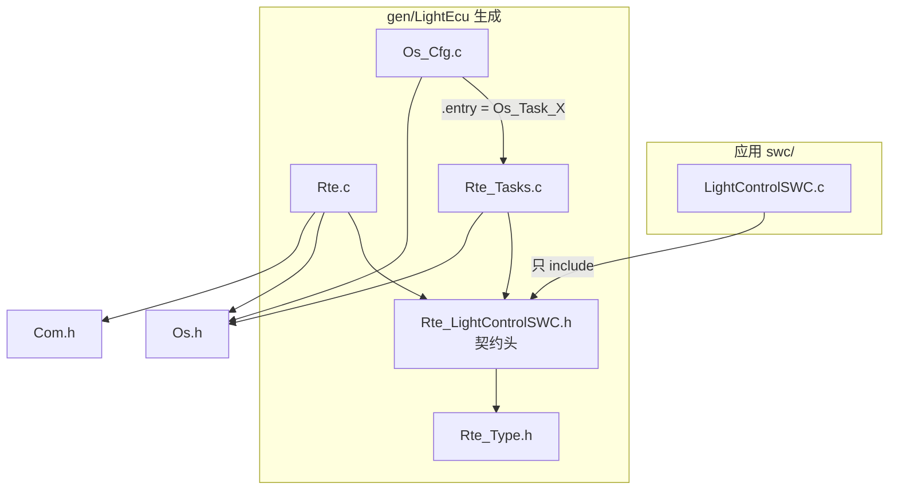
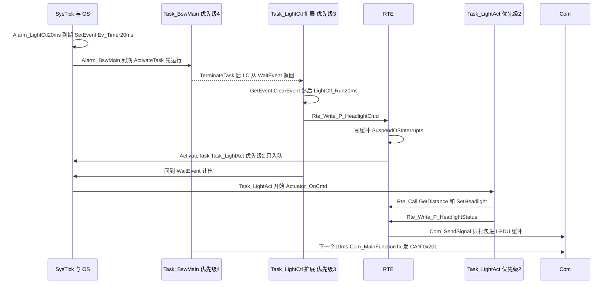
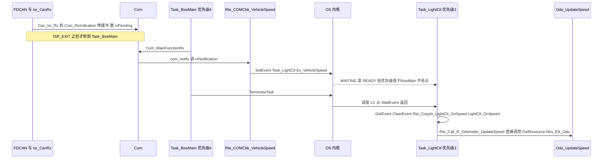

# 04 RTE 代码：契约头、`Rte.c`、`Rte_Tasks.c`，以及 RTE 如何"挂"在 OS 上

> 本章回答：(1) **RTE 和 OS 的关系在代码里长什么样？** (2) 生成的 `Rte_<Swc>.h` 契约头、`Rte_Type.h`、`Rte.c`（缓冲、隐式拷贝、`Rte_Start`、Com 回调、`Rte_Call_*`、独占区、模式切换）、`Rte_Tasks.c`（基本任务体、扩展任务 `Task_LightCtl` 的 `WaitEvent` 循环、BSW MainFunction 的放置）各是什么、怎么读？(3) 一条 Alarm → Event → Runnable → `Rte_Write` → Com 的完整链在 trace 里长什么样？
> Prerequisite: [02 配置与生成](02-config-and-generation.md)（配置如何变成这些文件）、[03 OS 代码](03-os-code.md)（`ActivateTask` / `SetEvent` / `WaitEvent` 在内核里做什么）；[11/07 RTE 与 OS](../11-classic-autosar-primer/07-rte-and-os.md)、[11/08 SWC 与 RTE 交互](../11-classic-autosar-primer/08-swc-rte-interaction.md)    Next: [05 SWC 代码](05-swc-code.md)
> 对应代码：`gen/LightEcu/{Rte_Type.h,Rte.h,Rte_Cbk.h,Rte_LightControlSWC.h,Rte_LightControlSWC_Type.h,Rte_LightActuatorSWC.h,Rte_OdometerSWC.h,Rte.c,Rte_Tasks.c,Os_Cfg.c}`、`gen/SensorEcu/{Rte.c,Rte_Tasks.c,Rte_SpeedSensorSWC.h}`、`rte/Rte_Common.h`、`generator/emit_rte.py`、`bsw/com/Com.c`、`swc/**`
> 对应规范（R25-11）：RTE SWS R25-11 p.134 SWS_Rte_06200 / SWS_Rte_04560、p.135 SWS_Rte_06201、p.183 ECUC_Rte_09020 / 09023 / 09018、p.590 SWS_Rte_01004、p.699 SWS_Rte_01071（`Rte_Write`）、p.719 SWS_Rte_01091（`Rte_Read`）、p.707 SWS_Rte_02631（`Rte_Switch`）、p.731 SWS_Rte_01102（`Rte_Call`）、p.766 SWS_Rte_01120（`Rte_Enter`）、p.746 SWS_Rte_03741（`Rte_IRead`）、p.749 SWS_Rte_03744（`Rte_IWrite`）、p.805 SWS_Rte_CONSTR_09035 与 p.806 SWS_Rte_CONSTR_09036（`Rte_Start`）
> 深入阅读：[07-rte-swc/04 RTE 概念](../07-rte-swc/04-rte-concept.md)、[07-rte-swc/05 RTE 生成](../07-rte-swc/05-rte-generation.md)、[07-rte-swc/06 Client/Server](../07-rte-swc/06-client-server.md)、[07-rte-swc/07 Sender/Receiver](../07-rte-swc/07-sender-receiver.md)

> 约定：`Rte.c:n`、`Rte_Tasks.c:n`、`Rte_<Swc>.h:n`、`Os_Cfg.c:n` 默认指 `gen/LightEcu/` 下的文件；SensorEcu 的写作 `gen/SensorEcu/…`。

---

## 0. 直接回答："RTE 和 OS 的关系在代码里长什么样"

> 一句话：**RTE 是 OS 的"客户"，不是 OS 的一部分，也不是调度器。** 它们之间只有三种代码级关系：名字约定、API 调用、共同的配置来源。

| # | 关系 | 代码里的证据 |
|---|---|---|
| 1 | **task 体归 RTE，task 表归 OS，用名字接起来** | `Os_Cfg.c:35` 写 `.entry = Os_Task_Task_Init`，而函数本体在 `Rte_Tasks.c:47` `TASK(Task_Init)`；`TASK(name)` 宏展开为 `void Os_Task_##name(void)`（`os/include/Os.h:82`）。内核（`os/src/*`）**一个字都不提 RTE**（`grep Rte os/` 无结果） |
| 2 | **RTE 用 OS 的公开 API 去"唤醒"和"保护"** | 只有 5 种调用：`ActivateTask`（`Rte.c:99`）、`SetEvent`（`Rte.c:261,267,287`）、`WaitEvent / GetEvent / ClearEvent`（`Rte_Tasks.c:90-92`）、`TerminateTask`（`Rte_Tasks.c:51,69,128`）、`GetResource / ReleaseResource`（`Rte.c:221,226`），外加 `SuspendOSInterrupts`（`Rte.c:94`）。`Rte.c:19` 只 `#include "Os.h"`，不碰 `Os_Tcb` / `Os_Config` |
| 3 | **时间只来自 OS 的 Alarm** | `Rte.c` / `Rte_Tasks.c` 里**没有任何计时器**；20 ms 周期来自 `Os_Cfg.c:96-108` 的 `Alarm_LightCtl20ms`，它到期时 `SetEvent(Task_LightCtl, Ev_LightCtl_Timer20ms)`。RTE 只管"事件到了该调哪个 Runnable" |
| 4 | **事件 → Task 的映射是配置，两边代码由同一份配置生成** | `LightEcu.ecuc.json:59-73`（`RteEventToTaskMapping`）→ `Rte_Tasks.c` 里 `if (ev & …)` 块的次序与 `Os_Cfg.h` 里事件掩码的值（第 02 章 §4.4） |
| 5 | **独占区 = OS Resource** | `Rte_Enter_EA_Odo()` 就是 `GetResource(Res_EA_Odo)`（`Rte.c:219-222`），天花板由生成器算进 `Os_Cfg.c:114` |
| 6 | **谁唤醒谁，由目标 Task 的类型决定** | 目标是扩展任务 → `SetEvent`；是基本任务 → `ActivateTask`（`generator/emit_rte.py:55-61` 的 `wake_code`；对应 `Rte.c:99` vs `Rte.c:287`） |

反过来：**OS 不知道 SWC、Runnable、Port**；**SWC 不知道 Task、优先级、`SetEvent`**。RTE 站在中间，把"设计世界"的事件翻译成"运行世界"的 OS 调用。
下面所有章节都是这六行的展开。

---

## 1. 本章要回答的问题

| # | 问题 | 小节 |
|---|---|---|
| 1 | RTE 生成了哪些文件，谁 include 谁？ | §2 |
| 2 | 契约头 `Rte_<Swc>.h` 里有什么？为什么 SWC 只能 include 它？ | §3 |
| 3 | `Rte.c` 的各个部分：缓冲、`Rte_Write` / `Rte_Read`、隐式拷贝、`Rte_Call_*`、独占区、模式、Com 回调、`Rte_Start`？ | §4 |
| 4 | `Rte_Tasks.c`：基本任务体、`Task_LightCtl` 的 `WaitEvent` 循环、BSW MainFunction 放哪？ | §5 |
| 5 | 配置里的每种事件怎么变成"唤醒代码"？ | §6 |
| 6 | 完整 trace：Alarm → Event → Runnable → `Rte_Write` → Com | §7 |
| 7 | 两个 ECU 的 RTE 有什么区别？ | §8 |

## 2. RTE 生成了哪些文件

**[Educational Implementation]** 每个 ECU 的 RTE 部分（`DESIGN.md` §7.1）：

| 文件 | 谁 include / 谁用 | 内容 |
|---|---|---|
| `Rte_Type.h`（32 行） | 每个 `Rte_<Swc>.h` | 数据类型、模式类型 `Rte_ModeType_EcuMode` 与 `RTE_MODE_EcuMode_*`、`extern volatile Rte_ModeType_EcuMode Rte_Mode_EcuMode`（`Rte_Type.h:23-30`）；include 手写的 `rte/Rte_Common.h`（`RTE_E_*` 错误码、`Rte_Start/Rte_Stop` 声明，`Rte_Common.h:25-42`） |
| `Rte_<Swc>.h` | **只**被对应 SWC 的 `.c` include，以及 RTE 自己（`Rte.c:25-27`、`Rte_Tasks.c:25-27`） | **契约头**：该 SWC 可以用的全部 `Rte_*` API + 它必须实现的 Runnable 原型 |
| `Rte_<Swc>_Type.h` | 契约头 | 仅当 SWC 有 PIM：PIM 的 `struct`（`Rte_LightControlSWC_Type.h:20-26`） |
| `Rte.h` | BswM_Cfg.c、`Rte_Tasks.c`（**SWC 不 include**） | `Rte_Switch_P_EcuMode_EcuMode` 与 `Rte_CopyIn_*` / `Rte_CopyOut_*` 声明（`Rte.h:22-27`） |
| `Rte_Cbk.h` | `Com_Cfg.c:16` | Com 通知回调原型 `void Rte_COMCbk_VehicleSpeed(void);`（`Rte_Cbk.h:17`） |
| `Rte.c` | 链接 | 全部 `Rte_*` 的**实现**：缓冲、API、回调、模式、`Rte_Start/Stop`（314 行） |
| `Rte_Tasks.c` | 链接；`Os_Cfg.c` 引用它定义的 `Os_Task_*` | 所有 `TASK(...)` 与 `ISR(...)` 体（139 行） |



读图要点：**SWC 的 include 链到 `Rte_Type.h` 就停了**；`Os.h`、`Com.h` 只出现在 RTE 自己的 `.c` 里。`swc/*/*.c` 里的 include 只有 `Rte_<Swc>.h` 与 `Trace.h`（教学打印，非 AUTOSAR API）：
`swc/LightControlSWC/LightControlSWC.c:33-34`、`swc/OdometerSWC/OdometerSWC.c:23-24`、`swc/SpeedSensorSWC/SpeedSensorSWC.c:30-31`。

## 3. 契约头 `Rte_<Swc>.h`

**[AUTOSAR Standard]** SWS_Rte_01004（RTE SWS R25-11 p.590）：应用头文件只含与该组件相关的信息。这是 RTE 对 SWC 的"合同"：**配置里有的访问点才有 API**。
以 `gen/LightEcu/Rte_LightControlSWC.h` 为例（全文 63 行），每一段对应 `SwcTypes.arxml` 里的一类访问点（第 02 章 §4.1）。下面代码块里右侧的 `// :n` 是本文为标注行号加的，原文件里没有：

```c
void LightCtl_Run20ms(void);                                                    // :27   你必须实现（RTE 来调你）
void LightCtl_OnSpeed(void);                                                    // :30
void LightCtl_OnModeSwitch(void);                                               // :33

Std_ReturnType Rte_Read_R_AmbientLight_AmbientLight(uint8 *data);               // :38   显式读
Std_ReturnType Rte_Write_P_HeadlightCmd_HeadlightCmd(uint8 data);               // :40   显式写

extern uint16 Rte_Irb_LightCtl_OnSpeed_R_VehicleSpeed_VehicleSpeed;             // :47   隐式读缓冲
#define Rte_IRead_LightCtl_OnSpeed_R_VehicleSpeed_VehicleSpeed()  (Rte_Irb_LightCtl_OnSpeed_R_VehicleSpeed_VehicleSpeed)   // :48

Std_ReturnType Rte_Call_R_Odometer_UpdateSpeed(uint16 Speed);                   // :53   C/S 调用

#define Rte_Mode_R_EcuMode_EcuMode()  ((Rte_ModeType_EcuMode)Rte_Mode_EcuMode)  // :57   模式读取

extern LightCtl_StateType Rte_Pim_LightControl_LightCtl_State;                  // :60   PIM
#define Rte_Pim_LightCtl_State()  (&Rte_Pim_LightControl_LightCtl_State)        // :61
```

**命名规则**（`rte/Rte_Common.h:9-18`）：`Rte_Read/Write_<port>_<element>`、`Rte_IRead/IWrite_<runnable>_<port>_<element>`、`Rte_Call_<port>_<operation>`、`Rte_Mode_<port>_<group>`、`Rte_Pim_<name>`、`Rte_Enter/Exit_<area>`。
其中 `Rte_IRead_…` 带**runnable 名**——因为隐式缓冲是"每 Runnable 一份"（`DESIGN.md` §17 第 6 项）；而 `Rte_Read_…` 不带——显式读的是端口，不属于某个 Runnable。

几点观察：

* **运行时开销最小化**：`Rte_IRead_*` 与 `Rte_Mode_*` 是宏，直接访问变量（"优化过的 RTE"的常见形态，头注释 `Rte_LightControlSWC.h:42-46`）；`Rte_Read` / `Rte_Write` / `Rte_Call` 是函数（`Rte_Call_*` 做成函数是为了有地方放 trace、也便于在 GDB 里下断点，`DESIGN.md` §17 第 7 项）。
* **没有 `Rte_Write_P_HeadlightStatus_*`**：LightControl 没有这个端口；它出现在 `Rte_LightActuatorSWC.h:34`。SWC 如果调了没声明的 API，**编译失败**——这就是"契约"。
* **"Runnable 你来实现"也在契约里**：`Rte_LightControlSWC.h:25-33` 为每个 Runnable 生成原型并注释 `executed in: Task_LightCtl (RtePositionInTask n)`。SWC 的 `.c` 若漏实现，链接失败。
* **服务端 SWC 的契约**：`Rte_OdometerSWC.h:25-27` 声明 `Std_ReturnType Odo_UpdateSpeed(uint16 Speed);` 并注释 `executed in: no task: direct call in the caller's context`；`:38-39` 声明 `Rte_Enter_EA_Odo / Rte_Exit_EA_Odo`——只有声明了独占区的 SWC 才有这对 API。

`Rte_Type.h:30` 的 `extern volatile Rte_ModeType_EcuMode Rte_Mode_EcuMode;`：模式变量是 `volatile`，因为"任务与模式管理者（BswM）是不同的执行上下文"（`Rte_Type.h:27-29` 注释）。

## 4. `Rte.c`：RTE 的"机器房"（314 行）

`Rte.c:1-16` 的头注释概括：通信缓冲、每个 `Rte_*` API 对本 ECU 连接的实现（Com 信号 / RTE 内部缓冲 / 直接服务调用 / OS 事件）、模式切换、独占区、触发 DataReceivedEvent 的 Com 回调、`Rte_Start/Stop`。**"连接去向"由 System.arxml 决定，这个文件是决定的结果**。

### 4.1 状态与缓冲（`Rte.c:29-59`）

```c
MINI_VAR_RTE_BUF static boolean Rte_Started;
MINI_VAR_RTE_BUF volatile Rte_ModeType_EcuMode Rte_Mode_EcuMode;   /* declared in Rte_Type.h */
MINI_VAR_RTE_BUF static uint8 Rte_Buf_LightControl_P_HeadlightCmd_HeadlightCmd;   /* LightControl.P_HeadlightCmd.HeadlightCmd */
MINI_VAR_RTE_BUF uint16 Rte_Irb_LightCtl_OnSpeed_R_VehicleSpeed_VehicleSpeed;
MINI_VAR_RTE_BUF LightCtl_StateType Rte_Pim_LightControl_LightCtl_State;
MINI_CONST_CFG static const LightCtl_StateType Rte_PimInit_LightControl_LightCtl_State = {0,0,0,0,255};
```
（`Rte.c:34,35,41,49,54,55`）

| 变量 | 作用 | 谁读 / 谁写 |
|---|---|---|
| `Rte_Started`（`:34`） | RTE 是否已启动；未启动时所有 API 返回 `RTE_E_COM_STOPPED`、回调直接返回 | `Rte_Start` 置位（`:304`） |
| `Rte_Buf_<provider>`（`:41`） | **ECU 内部连接**的缓冲：LightControl 写、LightActuator 读（连接 `C_HeadlightCmd`） | `Rte_Sink_*`（`:95`）写，`Rte_Read_R_HeadlightCmd_*`（`:162`）读 |
| `Rte_Irb_<runnable>_…`（`:49`） | 隐式读缓冲 = `LightCtl_OnSpeed` 的车速**快照** | `Rte_CopyIn_LightCtl_OnSpeed`（`:186`）写，Runnable 通过宏读 |
| `Rte_Pim_…`（`:54`）+ 初值 `Rte_PimInit_…`（`:55`） | PIM 存储与初值 | `Rte_Start` 用初值覆盖（`:298`） |

* **`MINI_VAR_RTE_BUF`** 展开为 `__attribute__((section(".bss.rte")))`（`include/MemMap.h:23`）：全部 RTE 变量集中在一个段里（`artifacts/mini-autosar/analysis/LightEcu.md` 里 `.bss.rte` 共 33 字节，`0x20001310..0x20001331`）。零初始化，由 `Rte_Start` 赋真正的初值——**BSW（Com…）初始化之前，SWC 数据不应变有效**（`Rte.c:29-33` 注释）。
* **为什么这些 RTE 变量要放在 RTE 里、而不是 SWC 里的 `static`？** RTE 要知道每一块内存才能做分区、MemMap、多实例；PIM 同理（`Rte_LightControlSWC_Type.h:9-12` 注释）。

### 4.2 发送侧：`Rte_Sink_*`（`Rte.c:80-128`）

显式 `Rte_Write_*`（`:147-150`，`:169-178`）与隐式 `Rte_CopyOut_*`（SensorEcu 里有）**都落到同一个 `Rte_Sink_<provider>_<port>_<element>`**——"数据去向"只在一处决定。LightEcu 有三个：

**(a) 同 ECU 连接（缓冲 + 激活）**，`Rte.c:85-102`：

```c
static Std_ReturnType Rte_Sink_LightControl_P_HeadlightCmd_HeadlightCmd(uint8 data)
{
    Std_ReturnType rc = RTE_E_OK;

    if (Rte_Started == FALSE)
    {
        return RTE_E_COM_STOPPED;
    }
    TRACE(TRACE_CAT_RTE, "WRITE P_HeadlightCmd_HeadlightCmd=%u", (unsigned)data);
    SuspendOSInterrupts();            /* intra-ECU: another task may read the buffer concurrently */
    Rte_Buf_LightControl_P_HeadlightCmd_HeadlightCmd = data;
    ResumeOSInterrupts();
    /* DataReceivedEvent DRE_Actuator_HeadlightCmd (RteEventToTaskMapping, trigger INTERNAL_WRITE): wake Task_LightAct via ActivateTask */
    TRACE(TRACE_CAT_RTE, "TRIGGER DRE_Actuator_HeadlightCmd -> Task_LightAct");
    (void)ActivateTask(Task_LightAct);
    /* an E_OS_LIMIT here means the task is still pending: it will pick up the newest value anyway (last-is-best) */
    return rc;
}
```

四步：检查启动 → `SuspendOSInterrupts()` 保护下写缓冲（`Task_LightAct` 也可能在读）→ **`ActivateTask(Task_LightAct)`** → 返回。
这里是"RTE 调 OS"最典型的一行：LightControl（优先级 3）写数据，LightActuator（优先级 2）是接收方的 DataReceivedEvent 对应的基本任务，RTE 用 `ActivateTask` 唤醒它。
`Task_LightAct` 的 `maxActivations = 2`（`Os_Cfg.c:67`）使连续两次写都能排队；返回 `E_OS_LIMIT` 也无妨（`(void)` 忽略，注释解释"最新值总会被读到"，即 *last-is-best* 语义）。

**(b) 发往 Com（跨 ECU）**，`Rte.c:104-115`：

```c
    rc = Rte_MapComStatus(Com_SendSignal(ComConf_ComSignal_HeadlightStatus, &data));   /* inter-ECU: Com packs it into I-PDU Ipdu_LightStatus_Tx */
```

`Com_SendSignal` 只是把值**打包进 I-PDU 缓冲**（`bsw/com/Com.c:275-278`），不发帧——这个信号是 `PENDING`、I-PDU 是 `PERIODIC` 100 ms，真正的发送由 `Com_MainFunctionTx` 在 `Task_BswMain` 里完成（第 06 章、本章 §7.1 的 trace）。
`Rte_MapComStatus`（`:62-78`）把 Com 的返回码翻译成 RTE 的：`E_OK → RTE_E_OK`、`COM_SERVICE_NOT_AVAILABLE → RTE_E_COM_STOPPED`、其余 → `RTE_E_LIMIT`。

**(c) 同时去缓冲和 Com**：生成器支持（`sk.buf` 与 `sk.signal` 可同时非空，`emit_rte.py:442-448`），本项目没有这种连接。

**[AUTOSAR Standard]** `Rte_Write` 见 RTE SWS R25-11 p.699 SWS_Rte_01071；`Rte_Read` 见 p.719 SWS_Rte_01091。本项目实现的是 "explicit, data semantics" 子集，无队列通信。

### 4.3 显式读与隐式读写

**显式读**，`Rte.c:134-144` 与 `:153-166`：数据源是 Com → `Com_ReceiveSignal`；数据源是 RTE 缓冲 → `SuspendOSInterrupts` 下拷贝出来。

**隐式读**：`Task_LightCtl` 的 `LightCtl_OnSpeed` 用 `Rte_IRead_…`（宏，只读 `Rte_Irb_…`）。快照由 `Rte_CopyIn_LightCtl_OnSpeed`（`Rte.c:183-187`）在**Runnable 开始前**拷入：

```c
void Rte_CopyIn_LightCtl_OnSpeed(void)
{
    /* snapshot of Com signal VehicleSpeed; if Com has nothing new the previous snapshot stays */
    (void)Com_ReceiveSignal(ComConf_ComSignal_VehicleSpeed, &Rte_Irb_LightCtl_OnSpeed_R_VehicleSpeed_VehicleSpeed);
}
```
`Rte_Tasks.c:105` 在调用 `LightCtl_OnSpeed()` 之前调它。结果：Runnable 执行期间即使 Com 又收到新帧，`Rte_IRead_…` 也返回**同一个值**（`LightControlSWC.c:109-111` 的注释"Calling Rte_IRead twice returns the same value"）。

**隐式写**（SensorEcu）：`SpeedSensor_Run10ms` 调 `Rte_IWrite_…`（宏，写 `Rte_Iwb_…`，`gen/SensorEcu/Rte_SpeedSensorSWC.h:35`）；Runnable 结束后，任务体调 `Rte_CopyOut_SpeedSensor_Run10ms()`（`gen/SensorEcu/Rte.c:89-92`）把缓冲经 `Rte_Sink_*` 发往 `Com_SendSignal`（`gen/SensorEcu/Rte_Tasks.c:79`）。
**"每 Runnable 一份缓冲，在 Runnable 前 / 后做拷贝"** 就是 RTE SWS 规定的隐式通信行为：读在 Runnable 开始、写在 Runnable 终止（`Rte.h:24-26` 的注释；规范条目 SWS_Rte_03741 `Rte_IRead`，p.746；SWS_Rte_03744 `Rte_IWrite`，p.749）。
**[Educational Implementation]** 按 Runnable 而不是按 Task 生成拷贝，使同一个扩展任务里由不同事件触发的 Runnable 各自只快照 / 发布自己用到的数据（`DESIGN.md` §6.8、§17 第 6 项）：`Task_LightCtl` 里只有 `LightCtl_OnSpeed` 前有 `CopyIn`，`LightCtl_Run20ms`（显式读）前没有。

### 4.4 Client/Server 与独占区

**`Rte_Call_*`**（`Rte.c:195-211`），三个：

```c
Std_ReturnType Rte_Call_R_Odometer_UpdateSpeed(uint16 Speed)
{
    TRACE(TRACE_CAT_RTE, "CALL R_Odometer_UpdateSpeed");
    return Odo_UpdateSpeed(Speed);
}
```
`Rte_Call_R_LightHw_SetHeadlight`（`:201-205`）转调 BSW 的 `IoHwAb_SetHeadlight`（来自 ecuc 的 `RteBswServerMapping`）；`Rte_Call_R_Odometer_GetDistance`（`:207-211`）与第一个一样直接调服务端 Runnable。
**关键事实**：服务端 Runnable 没有自己的 Task（`"task": null`），**在调用者的 Task、用调用者的优先级执行**。所以 `Odo_UpdateSpeed` 跑在 `Task_LightCtl`（3）里，`Odo_GetDistance` 跑在 `Task_LightAct`（2）里——这两个 Task 都可能进入它的独占区，这就是为什么 `Res_EA_Odo` 的 `accessedBy` 要包含它们，天花板由 `arxml_model.py:764-782` 的 `tasks_of()`（"服务端 Runnable 继承其调用者的 Task"）算出。
**[AUTOSAR Standard]** `Rte_Call` 见 p.731 SWS_Rte_01102。

**独占区**（`Rte.c:213-227`）：

```c
void Rte_Enter_EA_Odo(void)
{
    (void)GetResource(Res_EA_Odo);   /* ceiling priority 3 = highest priority among tasks that can reach this area */
}

void Rte_Exit_EA_Odo(void)
{
    (void)ReleaseResource(Res_EA_Odo);
}
```

`OdometerSWC.c:32-37` 在 `Odo_UpdateSpeed` 里用它包住 PIM 访问：

```c
    Rte_Enter_EA_Odo();                         /* GetResource(Res_EA_Odo): ceiling priority protects the PIM */
    s->distanceMm += ((uint32)Speed * 20u) / 36u;
    ...
    Rte_Exit_EA_Odo();                          /* ReleaseResource: a higher-priority task may now preempt */
```
效果（第 03 章 §8）：`Task_LightAct` 在 `Odo_GetDistance` 里时 `curPriority` 抬到 3，`Task_LightCtl`（3）不能抢占它，因此读不到被写了一半的 32 位距离；而且**不关中断、不阻塞**。
ECUC 的 `RteExclusiveAreaImplementation` 决定机制：`OS_RESOURCE`（本项目所用）、`OS_INTERRUPT_BLOCKING`、`ALL_INTERRUPT_BLOCKING`（`arxml_model.py:790` 接受这三种）。**[AUTOSAR Standard]** `Rte_Enter` / `Rte_Exit` 见 p.766 SWS_Rte_01120。

### 4.5 模式：`Rte_Switch_P_EcuMode_EcuMode`（`Rte.c:229-271`）

```c
    SuspendOSInterrupts();            /* tasks read Rte_Mode_EcuMode without a lock: update atomically w.r.t. OS ISRs */
    previous = Rte_Mode_EcuMode;
    Rte_Mode_EcuMode = mode;
    ResumeOSInterrupts();
    TRACE(TRACE_CAT_RTE, "MODE EcuMode=%s", Rte_ModeName_EcuMode(mode));
    if (mode != previous)
    {
        if (mode == RTE_MODE_EcuMode_RUN)
        {
            /* ModeSwitchEvent MSE_LightCtl_EnterRun: on entry of RUN -> Task_LightCtl via SetEvent */
            TRACE(TRACE_CAT_RTE, "TRIGGER MSE_LightCtl_EnterRun -> Task_LightCtl");
            (void)SetEvent(Task_LightCtl, Ev_LightCtl_ModeSwitch);
        }
        else if (mode == RTE_MODE_EcuMode_POST_RUN)
        {
            ...
            (void)SetEvent(Task_LightCtl, Ev_LightCtl_ModeSwitch);
```

这是 **BswM 到 RTE 的接口**：BswM 动作调用它（`gen/LightEcu/BswM_Cfg.c:79-81` 等）。它更新模式变量（原子地），**仅当模式真的变化时**才对每个匹配的 `MODE_SWITCH` 映射 `SetEvent`——所以启动时 `RTE MODE EcuMode=RUN` 后没有 `TRIGGER`（RUN → RUN 无变化），见 `artifacts/mini-autosar/renode/uart_b.log:28`。
SWC 侧只有 `Rte_Mode_R_EcuMode_EcuMode()`（读）与模式切换事件。**[AUTOSAR Standard]** `Rte_Switch` 见 p.707 SWS_Rte_02631。

### 4.6 Com 回调：`Rte_COMCbk_VehicleSpeed`（`Rte.c:273-288`）

```c
void Rte_COMCbk_VehicleSpeed(void)
{
    if (Rte_Started == FALSE)
    {
        return;                   /* RTE not started: ignore, Rte_Start() establishes a clean state */
    }
    /* DRE_LightCtl_VehicleSpeed (DataReceivedEvent R_VehicleSpeed.VehicleSpeed) -> task Task_LightCtl via SetEvent */
    TRACE(TRACE_CAT_RTE, "TRIGGER DRE_LightCtl_VehicleSpeed -> Task_LightCtl");
    (void)SetEvent(Task_LightCtl, Ev_LightCtl_VehicleSpeed);
}
```

调用链：`Com_Cfg.c:33` 把它填进信号表的 `.rxNotification`；`Com.c:172-182` 的 `com_notify()` 在收到 I-PDU 后调用（打印 `COM NOTIFY sig=0`，然后 `sg->rxNotification()`，`Com.c:178-179`）。
**谁调用 `com_notify` 取决于 I-PDU 的 `rxProcessing`**：

* `DEFERRED`（`Ipdu_VehicleSpeed_Rx`，`Com_Cfg.c:71`）：`Com_RxIndication`（在 CAN RX ISR 里）只拷贝缓冲并置 `rxPending`（`Com.c:418-421`）；10 ms 后 `Com_MainFunctionRx` 在 **`Task_BswMain` 任务上下文**里调 `com_notify`（`Com.c:355-369`，`:366` 注释 "task context: may call SetEvent etc."）。
* `IMMEDIATE`（`AmbientLight`、`EcuModeRequest`）：`Com_RxIndication` 在 **ISR 里**直接调（`Com.c:423-425`，注释 "ISR context (Cat2): callbacks must be ISR-safe"）。

所以 **`Rte_COMCbk_*` 必须 ISR 安全**：它只做了 `TRACE` 与 `SetEvent`，而 `SetEvent` 在 ISR2 里是合法的（第 03 章 §6）。本章 §10 的实验 B 会把 `DEFERRED` 改成 `IMMEDIATE`，让你看到这个回调在 ISR 内被调用。
注意 `SetEvent` 只是**置位**，不是计数：两次回调间若 `Task_LightCtl` 还没处理，事件合并为一次（Runnable 看快照里的最新值，*last-is-best*）。

### 4.7 `Rte_Start` / `Rte_Stop`（`Rte.c:290-314`）

```c
Std_ReturnType Rte_Start(void)
{
    /* 1. RTE-internal buffers and implicit buffers -> init values from the ARXML (INIT-VALUE) */
    Rte_Buf_LightControl_P_HeadlightCmd_HeadlightCmd = 0u;
    Rte_Irb_LightCtl_OnSpeed_R_VehicleSpeed_VehicleSpeed = 0u;
    Rte_Pim_LightControl_LightCtl_State = Rte_PimInit_LightControl_LightCtl_State;
    ...
    /* 2. mode machine starts in the initial mode of the mode declaration group */
    Rte_Mode_EcuMode = RTE_MODE_EcuMode_RUN;
    /* 3. from now on the API works and Com callbacks are honoured */
    Rte_Started = TRUE;
    TRACE(TRACE_CAT_RTE, "START");
    return RTE_E_OK;
}
```

**谁调用 `Rte_Start`？** 在本项目里是 **BswM 的动作列表 `AL_Startup`**（`LightEcu.ecuc.json:105`；生成的 `BswM_Cfg.c:50-52`）：`Rte_Start` 在 `Com_Init` 之后（ecuc 里第 104 行 → 第 105 行）、`EcuM_RequestRUN` 之前（第 106 行）。
**[AUTOSAR Standard] 规范间不一致，如实说明**：RTE SWS R25-11 p.805, SWS_Rte_CONSTR_09035 说 `Rte_Start` "由 EcuStateManager 在 RTE 需要的 BSW 模块（OS、COM、内存服务）初始化之后，从受信 OS 上下文调用一次"；p.806, SWS_Rte_CONSTR_09036 要求在 `SchM_Init` 之后（§4.6.1.2，p.460 的正文也写"ECU state manager calls Rte_Start"，见第 07 章 §5.3 的对照表）；
而 BSW Mode Manager SWS 定义了动作 `BswMRteStart`（ECUC_BswM_01073）去调 `Rte_Start`，flexible EcuM 的 post-OS 初始化全由 BswM 驱动。本项目按 BswM 方案实现，并在 `bsw/ecum/EcuM.c:24-28` 与 `bsw/bswm/BswM.c:17-19` 的头注释里写明。
顺序满足 CONSTR_09036：`EcuM_StartupTwo` 先 `SchM_Init`（`EcuM.c:97-100`），再触发 BswM 的 `AL_Startup`（`EcuM.c:102`）。真实项目以工具与集成方案为准（见 [11/04 §4.6](../11-classic-autosar-primer/04-ecu-startup-ecum.md)）。

## 5. `Rte_Tasks.c`：task 体（139 行）

**[AUTOSAR Standard]** SWS_Rte_06200（RTE SWS R25-11 p.134）：*RTE Generator shall construct task bodies for those tasks which contain RunnableEntitys*；SWS_Rte_06201（p.135）：对含 BSW Schedulable Entity 的任务；SWS_Rte_04560（p.134）：对含 Runnable 的 Category 2 ISR。
**但"哪个 Runnable 在哪个 Task、什么位置"是配置输入**：`RteEventToTaskMapping`（ECUC_Rte_09020）、`RtePositionInTask`（ECUC_Rte_09023）、`RteActivationOffset`（ECUC_Rte_09018），均在 RTE SWS R25-11 p.183；
"通过直接或受信函数调用执行的 RunnableEntity 仍要配置 `RteEventToTaskMapping`，但不含 `RteMappedToTask`"（同页，对应 `"task": null`）。`Rte_Tasks.c:9-15` 的头注释把这些 ID 写在了文件里。

文件开头的任务表（`Rte_Tasks.c:30-38`，由生成器根据配置打印）是最好的"一页纸总览"：

```
 *   task            prio  type      activated by                                  contents
 *   Task_Init       10    BASIC     autostart                                     EcuM_StartupTwo
 *   Task_BswMain    4     BASIC     Alarm_BswMain/10ms                            Can_MainFunction_Write, Com_MainFunctionRx, Com_MainFunctionTx, BswM_MainFunction, EcuM_MainFunction
 *   Task_LightCtl   3     EXTENDED  autostart + Alarm_LightCtl20ms/20ms + RTE trigger LightCtl_Run20ms, LightCtl_OnSpeed, LightCtl_OnModeSwitch
 *   Task_LightAct   2     BASIC     RTE trigger                                   Actuator_OnCmd
```

### 5.1 基本任务体：run-to-completion

**`Task_LightAct`**（`Rte_Tasks.c:123-129`）：

```c
TASK(Task_LightAct)
{
    /* position 1: Actuator_OnCmd <- DRE_Actuator_HeadlightCmd */
    Actuator_OnCmd();

    (void)TerminateTask();            /* basic task: one activation = one run to completion */
}
```
一次激活 = 调一次 Runnable，然后 `TerminateTask()`。激活者是 `Rte_Sink_*` 里的 `ActivateTask`。

**SensorEcu 的 `Task_Swc10ms`**（`gen/SensorEcu/Rte_Tasks.c:75-82`）：周期基本任务，激活者是 OS 的 `Alarm_Swc10ms`（`ACTIVATETASK`，10 ms）。任务体多一行隐式写：

```c
TASK(Task_Swc10ms)
{
    /* position 1: SpeedSensor_Run10ms <- TE_SpeedSensor_10ms */
    SpeedSensor_Run10ms();
    Rte_CopyOut_SpeedSensor_Run10ms();     /* implicit write: publish after the runnable terminated */

    (void)TerminateTask();            /* basic task: one activation = one run to completion */
}
```

生成规则（`emit_rte.py:821-833`）：一个基本任务可以挂多个 Runnable，按 `position` 顺序依次调用；`disabledInMode` 的包一层 `if`；每个 Runnable 前后按需插入 `CopyIn` / `CopyOut`（`_call_runnable`，`:696-702`）；末尾 `TerminateTask()`。
**约束**（`arxml_model.py:727-731`）：同一个基本任务里的所有 Runnable 必须有同一个激活源，否则任务体无法知道"为什么被激活"——不同激活源必须放扩展任务（每个源一个 `OsEvent`）。

### 5.2 扩展任务 `Task_LightCtl`：`WaitEvent` 循环（`Rte_Tasks.c:84-114`）

```c
TASK(Task_LightCtl)
{
    EventMaskType ev = 0u;

    for (;;)                          /* extended task: never terminates, it parks in WaitEvent */
    {
        (void)WaitEvent(Ev_LightCtl_Timer20ms | Ev_LightCtl_VehicleSpeed | Ev_LightCtl_ModeSwitch);
        (void)GetEvent(Task_LightCtl, &ev);
        (void)ClearEvent(ev);             /* consume what we serve now; events set meanwhile stay pending */

        if ((ev & Ev_LightCtl_Timer20ms) != 0u)
        {
            /* position 1: LightCtl_Run20ms <- TE_LightCtl_20ms */
            if (Rte_Mode_EcuMode != RTE_MODE_EcuMode_POST_RUN)         /* disabledInMode */
            {
                LightCtl_Run20ms();
            }
        }
        if ((ev & Ev_LightCtl_VehicleSpeed) != 0u)
        {
            /* position 2: LightCtl_OnSpeed <- DRE_LightCtl_VehicleSpeed */
            Rte_CopyIn_LightCtl_OnSpeed();      /* implicit read: snapshot before the runnable starts */
            LightCtl_OnSpeed();
        }
        if ((ev & Ev_LightCtl_ModeSwitch) != 0u)
        {
            /* position 3: LightCtl_OnModeSwitch <- MSE_LightCtl_EnterRun, MSE_LightCtl_EnterPostRun */
            LightCtl_OnModeSwitch();
        }
    }
}
```

逐行读：

1. **为什么是扩展任务**：这个任务承载三种**不同激活源**的 Runnable（20 ms 定时、车速到达、模式切换）。基本任务只有"被激活"这一种信号，无法区分；扩展任务用 Event 位区分，一个位一个源。
2. **`WaitEvent(三个位的 OR)`**：任务停在这里（状态 WAITING，`TASK_WAIT Task_LightCtl mask=0x7`）。它的**栈和局部变量被完整保留**（第 03 章 §6）；唤醒后从下一行继续。
3. **`GetEvent` → `ClearEvent(ev)`**：先取出当前事件位，再**只清掉已取走的位**。注释 "events set meanwhile stay pending" 是关键：Runnable 执行期间可能有新的事件到来（比如 `Task_BswMain`（4）抢占了正在跑的 `LightCtl_Run20ms`，并通过 `Rte_COMCbk_VehicleSpeed` 置了 `Ev_LightCtl_VehicleSpeed`）。若这里 `ClearEvent(所有位)`，这个新事件就丢了；现在它仍挂着，下一次 `WaitEvent` 立即返回。
4. **三个 `if`，次序 = `RtePositionInTask`**（1、2、3）：**一次唤醒里多个事件同时置位时，按 position 顺序依次处理**。每个 `if` 对应一个 `OsEvent` 位；映射到同一个 `OsEvent` 的多个 RTE 事件（`MSE_LightCtl_EnterRun` 与 `EnterPostRun`）合并在同一个块里（`emit_rte.py:793-820` 按 `os_event` 分组）。
5. **`disabledInMode`**（`:97`）：Alarm 继续走、事件继续置位，但 POST_RUN 时 Runnable 不执行——模式判断放在**任务体**里，不是在 Alarm 上。
6. **隐式读的快照**（`:105`）：只有会用 `Rte_IRead_*` 的 `LightCtl_OnSpeed` 前才调 `Rte_CopyIn_*`。
7. **永不 `TerminateTask`**：`for(;;)`。因此这个任务必须 `autostart`（`LightEcu.ecuc.json:34`，`Os_Cfg.c:60`）才能先跑到 `WaitEvent`，否则别人 `SetEvent` 它会得到 `E_OS_STATE`（`Os_Event.c:32-34`）——这也是生成器报错 "EXTENDED but not autostarted"（第 02 章 §5）的原因。

### 5.3 BSW MainFunction 放在哪：`Task_Init` 与 `Task_BswMain`

```c
TASK(Task_BswMain)                        // Rte_Tasks.c:61-70
{
    Can_MainFunction_Write();
    Com_MainFunctionRx();
    Com_MainFunctionTx();
    BswM_MainFunction();
    EcuM_MainFunction();

    (void)TerminateTask();
}
```
`Task_Init`（`:47-52`）：`EcuM_StartupTwo(); TerminateTask();`——**StartPostOS 序列在任务上下文里执行**（`SchM_Init`、`BswM_Init`、BswM 的 `AL_Startup`/`AL_Run` 都在这个优先级 10 的任务里，第 07 章）。

**这是 [Educational Implementation] 的简化**：**RTE 生成器同时承担了 SchM 的角色**（`DESIGN.md` §3 偏离第 6 条）。
`SchM.tasks[].order`（`LightEcu.ecuc.json:83-86`）直接指定每个任务体里依次调用哪些 BSW 函数，`Task_BswMain` 由 `Alarm_BswMain`（10 ms，`ACTIVATETASK`）驱动。
**[AUTOSAR Standard]** 规范里对应的是 `RteBswEventToTaskMapping`（把 BSW 的 `BswSchedulableEntity` 映射到 OsTask）与 SWS_Rte_06201（RTE 为含 BSW Schedulable Entity 的 Task 生成任务体），并由 SchM 提供 `SchM_Init`、`SchM_Enter/Exit_<Mod>_<EA>` 与 MainFunction 调度。

放置顺序有后果（LightEcu 的优先级 `Task_BswMain` 4 > `Task_LightCtl` 3 > `Task_LightAct` 2）：

* `Task_BswMain` 比应用任务**优先**，所以 `Com_MainFunctionRx` 先把"收到车速"变成 `SetEvent`，`Task_BswMain` 结束后 `Task_LightCtl` 才被调度到；
* `Com_MainFunctionTx` 在 `Task_BswMain` 里，所以 `Rte_Write` 写到 Com 缓冲的值要等**下一个 10 ms 整点**才可能被周期发送（§7.1）；
* SensorEcu 里 `Task_BswMain` 优先级 3 > `Task_Swc10ms` 的 2，同一个 10 ms 整点：先发**上一周期**写入缓冲的车速，再跑本周期的 `SpeedSensor_Run10ms`（`artifacts/mini-autosar/host/ecuA.log` 第 32–44 行：`TASK_START Task_BswMain` / `CAN TX id=0x101` 在前，`TASK_START Task_Swc10ms` 在后）。一个周期的采样 → 发送延迟，这是任务优先级配置的直接后果。

### 5.4 ISR 体（`Rte_Tasks.c:131-139`）

```c
MINI_CODE_FAST ISR(Isr_CanRx)
{
    Can_Isr_Rx();
}
```
Cat2 ISR 体由生成器按 `OsIsr.calls` 产出（SWS_Rte_04560），**只转发给驱动的 ISR 主体**；`ISR_ENTER` / `ISR_EXIT` 记账、中断优先级、退出时的 reschedule 由内核的 `Os_Cm33_IrqEntry` 包装完成（第 03 章 §9.3）。`MINI_CODE_FAST` 把它放进 `.text.fast` 段。

## 6. 配置里的事件 → 唤醒代码 → trace 行

| RTE 事件（配置） | 唤醒机制（代码位置） | 谁在什么上下文里执行唤醒 | 目标 | trace 上看到什么 |
|---|---|---|---|---|
| `TE_LightCtl_20ms`：`OS_ALARM`（`LightEcu.ecuc.json:60-61`） | `Os_Cfg.c:96-108` 的 `Alarm_LightCtl20ms`：`alarm_fire` → `Os_SetEventInternal`（`Os_Alarm.c:65-68`） | SysTick（tick 处理，中断上下文） | `Task_LightCtl` / `Ev_LightCtl_Timer20ms` | `OS ALARM Alarm_LightCtl20ms` → `OS EVENT_SET Task_LightCtl mask=0x1`（**没有 `RTE TRIGGER` 行**，RTE 没参与唤醒） |
| `DRE_LightCtl_VehicleSpeed`：`COM_NOTIFICATION`（`:62-63`） | `Rte_COMCbk_VehicleSpeed` → `SetEvent`（`Rte.c:279-288`） | `Com_MainFunctionRx` 里（DEFERRED：`Task_BswMain` 任务上下文） | `Task_LightCtl` / `Ev_LightCtl_VehicleSpeed` | `COM NOTIFY sig=0` → `RTE TRIGGER DRE_LightCtl_VehicleSpeed -> Task_LightCtl` → `OS EVENT_SET … mask=0x2` |
| `MSE_LightCtl_EnterRun` / `EnterPostRun`：`MODE_SWITCH`（`:64-67`） | `Rte_Switch_P_EcuMode_EcuMode` → `SetEvent`（`Rte.c:257-268`） | BswM 动作，在 `BswM_MainFunction`（`Task_BswMain`）里 | `Task_LightCtl` / `Ev_LightCtl_ModeSwitch` | `RTE MODE EcuMode=POST_RUN` → `RTE TRIGGER MSE_LightCtl_EnterPostRun -> Task_LightCtl` → `OS EVENT_SET … mask=0x4` |
| `DRE_Actuator_HeadlightCmd`：`INTERNAL_WRITE`（`:68-69`） | `Rte_Sink_*` → `ActivateTask`（`Rte.c:97-99`） | 写者任务（`Task_LightCtl` 里的 `Rte_Write`） | `Task_LightAct`（基本任务） | `RTE WRITE P_HeadlightCmd_HeadlightCmd=…` → `RTE TRIGGER DRE_Actuator_HeadlightCmd -> Task_LightAct`；之后 `OS TASK_START Task_LightAct` |
| `OIE_Odo_UpdateSpeed`：`task: null`（`:70`） | `Rte_Call_*` 直接 `Odo_UpdateSpeed()`（`Rte.c:195-199`） | **调用者的 Task** | — | `RTE CALL R_Odometer_UpdateSpeed`，没有任何 OS 行 |

注意第一行与其余行的区别：**TimingEvent 的唤醒完全是 OS 的 Alarm 做的**，RTE 在运行时不参与，它只在配置期决定 Alarm 的目标是哪个 Task / 哪个事件位（并在生成时校验周期，`arxml_model.py:647-649`），并在任务体里决定"事件位 → Runnable"。

## 7. 完整 trace：Alarm → Event → Runnable → `Rte_Write` → Com

下面所有 trace 摘自 `artifacts/mini-autosar/renode/uart_b.log`（LightEcu 在 Renode 里的 UART）。每行注释给出打印它的代码位置。Renode 日志的 µs 时间戳每次运行都有几 µs～几十 µs 抖动，下面引用的是某一次运行的快照；重跑后数字会略有不同，但**行的顺序与事件名不变**，对照时请看顺序，不要逐位比较数字。

### 7.1 链 A：20 ms 定时 → 控制 Runnable → 写出 → 经 Com 上总线（`t = 500 ms`）

```
[000500006] ECUB OS    ALARM Alarm_BswMain                      Os_Alarm.c:59   10 ms 的 BSW 闹钟（表中第 0 号）
[000500007] ECUB OS    ALARM Alarm_LightCtl20ms                 Os_Alarm.c:59   20 ms 的应用闹钟（第 1 号）：同一 tick 到期
[000500029] ECUB OS    EVENT_SET Task_LightCtl mask=0x1         Os_Event.c:36  Os_SetEventInternal：Task_LightCtl 由 WAITING 变 READY
[000500049] ECUB OS    TASK_START Task_BswMain prio=4           Os_Core.c:230   4 > 3：Task_BswMain 先抢占（它被 Alarm_BswMain 激活）
[000500076] ECUB OS    TASK_END Task_BswMain                    Os_Task.c:76    ......它结束后，Task_LightCtl 才被调度（无 TASK_START，是从 WaitEvent 恢复）
[000500114] ECUB SWC   LightCtl cmd=1 speed=409 ambient=60 postrun=0   LightControlSWC.c:49   LightCtl_Run20ms 里的 lightctl_trace
[000500141] ECUB RTE   WRITE P_HeadlightCmd_HeadlightCmd=1      Rte.c:93        Rte_Write → Rte_Sink_*
[000500163] ECUB RTE   TRIGGER DRE_Actuator_HeadlightCmd -> Task_LightAct   Rte.c:98   紧接着 ActivateTask(Task_LightAct)
[000500192] ECUB OS    TASK_WAIT Task_LightCtl mask=0x7         Os_Event.c:132  Runnable 返回，任务体回到 WaitEvent。优先级 2 < 3，LightAct 此前只是入队
[000500216] ECUB OS    TASK_START Task_LightAct prio=2          Os_Core.c:230   Task_LightCtl 等待后，LightAct 获得 CPU
[000500237] ECUB RTE   CALL R_Odometer_GetDistance              Rte.c:209       Actuator_OnCmd 调服务端（在 Task_LightAct 里）
[000500257] ECUB RTE   CALL R_LightHw_SetHeadlight              Rte.c:203       C/S → BSW IoHwAb
[000500276] ECUB BSW   IOHWAB LIGHT state=1
[000500292] ECUB SWC   Actuator state=1 dist=1                  LightActuatorSWC.c:48
[000500310] ECUB RTE   WRITE P_HeadlightStatus_HeadlightStatus=1   Rte.c:112       Rte_Write → Com_SendSignal（只打包进 I-PDU 缓冲）
[000500337] ECUB RTE   WRITE P_OdometerDistance_Distance=1      Rte.c:125
[000500365] ECUB OS    TASK_END Task_LightAct                   Os_Task.c:76
...
[000510006] ECUB OS    ALARM Alarm_BswMain                      下一个 10 ms 整点
[000510111] ECUB OS    TASK_START Task_BswMain prio=4
[000510213] ECUB COM   TX ipdu=3 len=6                          Com.c:167       Com_MainFunctionTx：100 ms 周期到了，发送 0x201
[000510228] ECUB PDUR  TX com=3 canif=0
[000510247] ECUB CAN   TX id=0x201 dlc=6 data=01 00 01 00 00 00     Can.c           第 0 字节 = HeadlightStatus=1，第 2 字节起 = Distance=1
[000510273] ECUB CANIF TX pdu=0
```

要点：(1) `ALARM` 之后 `EVENT_SET` 之前的 22 µs 是真实 CPU 在 tick 中断里处理 Alarm；(2) **应用 Runnable（优先级 3）被 BSW 任务（4）"插队"**，这正是任务优先级配置的可见后果；
(3) `Task_LightCtl` 的 `TASK_WAIT` 出现在 `TRIGGER … -> Task_LightAct` **之后**：`ActivateTask(Task_LightAct)` 返回后（2 < 3 不抢占），`Task_LightCtl` 继续跑完 Runnable，回到 `WaitEvent`，这时 `Task_LightAct` 才运行；
(4) **`Rte_Write(Status)` 与 CAN 上出帧之间隔了 ~10 ms**：`Com_SendSignal` 只写缓冲，真正发送在下一个 `Task_BswMain` 的 `Com_MainFunctionTx`（100 ms 周期，`Com_Cfg.c:88`）。

对应的 GDB 证据（`artifacts/mini-autosar/gdb_session.txt` 第 8 节）：在 `Task_LightAct` 里断在 `Rte_Write_P_HeadlightStatus_HeadlightStatus`（`Rte.c:171`），调用栈是 `Actuator_OnCmd (LightActuatorSWC.c:54)` ← `Os_Task_Task_LightAct (Rte_Tasks.c:126)`；
继续断在 `Com_SendSignal (Com.c:254)`，调用栈 `Rte_Sink_… (Rte.c:113)` ← `Rte_Write_… (Rte.c:171)` ← `Actuator_OnCmd`；最后在 **另一个任务** `Task_BswMain` 里断在 `Can_Write (Can.c:208)`，栈是 `Can_Write ← CanIf_Transmit (CanIf.c:138) ← PduR_ComTransmit (PduR.c:72) ← com_transmit (Com.c:168) ← Com_MainFunctionTx (Com.c:384) ← Os_Task_Task_BswMain (Rte_Tasks.c:65)`——两条栈分属两个任务，中间隔着 Com 的缓冲。



### 7.2 链 B：CAN 收到车速 → Com → RTE 回调 → `SetEvent` → Runnable → `Rte_Call`（`t = 510 ms`）

```
[000510006] ECUB OS    ALARM Alarm_BswMain
[000510019] ECUB OS    ISR_ENTER Isr_CanRx                      Os_Core.c:288   Os_Cm33_IrqEntry → Os_Kernel_IsrEnter
[000510033] ECUB CAN   RX id=0x101 dlc=2 data=b7 01             Can_Isr_Rx 逐帧读出 FDCAN FIFO
[000510053] ECUB CANIF RX pdu=0
[000510073] ECUB PDUR  RX canif=0 com=0
[000510073] ECUB COM   RX ipdu=0 len=2                          Com.c:422       Com_RxIndication：DEFERRED，只拷贝缓冲并置 rxPending
[000510106] ECUB OS    ISR_EXIT Isr_CanRx                       Os_Core.c:309
[000510111] ECUB OS    TASK_START Task_BswMain prio=4           ISR 前已激活的 BswMain 此时才得以运行
[000510137] ECUB COM   NOTIFY sig=0                            Com.c:178       Com_MainFunctionRx → com_notify
[000510161] ECUB RTE   TRIGGER DRE_LightCtl_VehicleSpeed -> Task_LightCtl   Rte.c:286   Rte_COMCbk_VehicleSpeed
[000510188] ECUB OS    EVENT_SET Task_LightCtl mask=0x2         SetEvent(Task_LightCtl, Ev_LightCtl_VehicleSpeed)：LC 变 READY，优先级 3 < 4，不抢占 BswMain
[000510213] ECUB COM   TX ipdu=3 len=6                          同一个 BswMain 里接着 Com_MainFunctionTx（链 A 的发送）
...
[000510289] ECUB OS    TASK_END Task_BswMain
[000510310] ECUB RTE   CALL R_Odometer_UpdateSpeed              Rte.c:197       Task_LightCtl 醒来：先 CopyIn，再 LightCtl_OnSpeed → Rte_Call
[000510331] ECUB OS    TASK_WAIT Task_LightCtl mask=0x7
```



三个值得记住的点：(1) 一帧 CAN 报文经过了 **ISR → 任务 BswMain → 任务 LightCtl** 三个执行上下文才到达应用 Runnable，每一跳都是一次 OS 服务（`Com` 置 pending 标志、`SetEvent`、任务切换）；
(2) `Rte_COMCbk_*` 运行在 `Task_BswMain` 的栈上、优先级 4，**所以它必须短**，只置事件；(3) 从 ISR 到 Runnable 的延迟最多 10 ms（`Com_MainFunctionRx` 周期，`Com_Cfg.c:97`）加上调度——这是 DEFERRED 的代价，也是它的好处：ISR 里只做拷贝。

### 7.3 链 C：模式切换 + 车速事件合并（`t ≈ 3010 ms`）

```
[003010319] ECUB BSW   BSWM RULE R_EcuModeRequest TRUE
[003010339] ECUB RTE   MODE EcuMode=POST_RUN                    Rte.c:254  BswM 动作 → Rte_Switch_P_EcuMode_EcuMode
[003010355] ECUB RTE   TRIGGER MSE_LightCtl_EnterPostRun -> Task_LightCtl   Rte.c:266
[003010382] ECUB OS    EVENT_SET Task_LightCtl mask=0x4         此时 Ev_VehicleSpeed(0x2) 也已置位（见上面 3010192 的 TRIGGER，未画出）
[003010403] ECUB BSW   BSWM ACTION Rte_SwitchPostRun rc=0
[003010425] ECUB OS    TASK_END Task_BswMain
[003010447] ECUB RTE   CALL R_Odometer_UpdateSpeed              同一次唤醒：先 position 2 的 LightCtl_OnSpeed
[003010467] ECUB RTE   WRITE P_HeadlightCmd_HeadlightCmd=0      再 position 3 的 LightCtl_OnModeSwitch：Rte_Write OFF
[003010490] ECUB RTE   TRIGGER DRE_Actuator_HeadlightCmd -> Task_LightAct
[003010517] ECUB SWC   LightCtl cmd=0 speed=1464 ambient=20 postrun=1
[003010546] ECUB OS    TASK_WAIT Task_LightCtl mask=0x7
```

同一个 `Task_BswMain` 里 `Com_MainFunctionRx` 先置了 `Ev_VehicleSpeed(0x2)`，`BswM_MainFunction` 又通过 `Rte_Switch` 置了 `Ev_ModeSwitch(0x4)`。`Task_LightCtl` 一次醒来时 `GetEvent` 得到 `0x6`，**按 position 依次**调用 `LightCtl_OnSpeed`（2）、`LightCtl_OnModeSwitch`（3）——trace 里的顺序与 `Rte_Tasks.c:102-112` 完全一致。
如果 position 是 3、2，顺序就反过来；这就是 `RtePositionInTask` 的意义。

### 7.4 启动阶段：RTE 何时"活"（`t = 0..0.5 ms`）

```
[000000212] ECUB RTE   START                                    Rte.c:305  Rte_Start，在 AL_Startup 里，Com_Init 之后
[000000404] ECUB RTE   MODE EcuMode=RUN                         Rte.c:254  AL_Run：RUN → RUN，无 TRIGGER（mode == previous）
[000000452] ECUB OS    TASK_END Task_Init
[000000471] ECUB OS    TASK_START Task_LightCtl prio=3          Task_Init 结束后，自启动的扩展任务才获得 CPU
[000000492] ECUB OS    TASK_WAIT Task_LightCtl mask=0x7         第一次进入 WaitEvent：从此它只被事件唤醒
```

`Rte_Start`（`RTE START`）出现在 `Com_Init` 之后，`EcuM_RequestRUN` 之前；在它之前，所有 `Rte_*` 返回 `RTE_E_COM_STOPPED`、`Rte_COMCbk_*` 直接返回（`Rte_Started == FALSE`）。

## 8. SensorEcu 的 RTE：同一个生成器的另一个输出

`gen/SensorEcu/` 只有 `Rte_SpeedSensorSWC.h` + 一个 SWC，没有扩展任务、没有 Com 回调、没有模式事件：

| 项 | SensorEcu | LightEcu |
|---|---|---|
| Task | `Task_Init`、`Task_BswMain`（3）、`Task_Swc10ms`（2），全是基本任务 | + 扩展任务 `Task_LightCtl`、基本任务 `Task_LightAct` |
| 应用 Runnable 的激活 | `Alarm_Swc10ms` → `ActivateTask(Task_Swc10ms)`（`ACTIVATETASK`） | `SETEVENT` / `COM_NOTIFICATION` / `MODE_SWITCH` / `INTERNAL_WRITE` |
| 发送 | 隐式写 + `Rte_CopyOut_*`（`gen/SensorEcu/Rte.c:89-92`）→ `Com_SendSignal` | 显式 `Rte_Write_*` |
| C/S | 只有 `Rte_Call_R_WheelSpeed_GetWheelSpeed` → BSW `IoHwAb_GetWheelSpeed`（`gen/SensorEcu/Rte.c:100-104`） | + 同 ECU 服务端 Odometer、独占区 |
| `Rte_Switch` | 没有 `MODE_SWITCH` 映射，函数体里只有一句注释 `no ModeSwitchEvents are mapped on this ECU`（`gen/SensorEcu/Rte.c:132-135`） | 有 |
| 文件大小 | `Rte.c` 160 行、`Rte_Tasks.c` 82 行 | 314 行、139 行 |

同一个 `emit_rte.py` 按配置**裁剪**输出：配置里没有的访问点，不会产生任何代码——这是 §3 "契约 = 配置" 的另一面。

## 9. 常见误解

* **"RTE 是个线程 / 调度器"**：不是。`Rte.c` 里没有循环、没有计时器；所有"什么时候跑"都来自 OS 的 Alarm / ISR / 其他任务的调用。RTE 只提供 **函数**（`Rte_Write` 等）和 **task 体**（让 OS 调度）。
* **"每个 Runnable 一个 Task"**：不是。Runnable 与 Task 是 *n:1*，由 `RteEventToTaskMapping` 决定。`Task_LightCtl` 里有三个 Runnable。
* **"服务端 Runnable 有自己的 Task"**：同分区同步 C/S 不需要。它在调用者的 Task 里运行，用调用者的优先级，所以互斥要靠独占区（OS Resource）。
* **"`Rte_Write` 就是发 CAN 帧"**：不是。`Rte_Write` → `Com_SendSignal` 只写 Com 缓冲，帧在 `Com_MainFunctionTx` 周期里出（本项目的 `PERIODIC` I-PDU）。
* **"事件会排队计数"**：不会。`SetEvent` 是置位；多次置位合并成一次。需要计数的场景用基本任务多重激活（`Task_LightAct` 的 `maxActivations = 2`）或队列通信。
* **"SWC 能直接调 `ActivateTask`"**：不能。SWC 只 include `Rte_<Swc>.h`，里面没有 OS API；RTE SWS 也不允许 Runnable 直接调用 OS 服务（见 [11/07 §0](../11-classic-autosar-primer/07-rte-and-os.md)）。

## 10. 动手实验

> 在仓库根目录执行；做完把改动改回去（本仓库没有 git），再 `--step gen` 重新生成。反馈回路 4 秒：`python examples/mini_autosar_ecu/tools/run_mini_autosar.py --step gen --step host --step sim`，读 `artifacts/mini-autosar/host/ecuB.log`。

### 实验 A：把 Task_LightAct 优先级调到 6，看 `ActivateTask` 当场抢占（已验证，同第 02 章实验 A）

`config/ecuc/LightEcu.ecuc.json:37` 把 `Task_LightAct` 的 `priority` 改成 `6`。在 `host/ecuB.log` 的 `t=20000` 附近：

```
[000020000] ECUB RTE   WRITE P_HeadlightCmd_HeadlightCmd=0
[000020000] ECUB RTE   TRIGGER DRE_Actuator_HeadlightCmd -> Task_LightAct
[000020000] ECUB OS    TASK_START Task_LightAct prio=6        <-- 以前这里是 TASK_WAIT Task_LightCtl
```

`Rte.c:99` 的 `ActivateTask` 一返回，高优先级的 `Task_LightAct` 就抢占了仍在 `Rte_Sink_*` 里的 `Task_LightCtl`。同时 `Rte.c:221` 的注释变成 `ceiling priority 6`。**这是"RTE 调 OS，OS 立即抢占"的直接证据。** 做完改回 `2`。

### 实验 B：把 `0x101` 的接收从 DEFERRED 改成 IMMEDIATE，看 `Rte_COMCbk_*` 跑到 ISR 里（已验证）

编辑 `config/ecuc/LightEcu.ecuc.json:126`，把 `Ipdu_VehicleSpeed_Rx` 的 `"rxProcessing": "DEFERRED"` 改为 `"IMMEDIATE"`，运行上面的命令。生成的变化只有一行：`gen/LightEcu/Com_Cfg.c:71` 变成 `.rxProcessing = COM_RX_IMMEDIATE`。
对比 `host/ecuB.log` 在 `t=10000` 的一段。**改之前**（入库配置）：

```
[000010000] ECUB OS    ISR_ENTER Isr_CanRx
[000010000] ECUB COM   RX ipdu=0 len=2
[000010000] ECUB OS    ISR_EXIT Isr_CanRx
[000010000] ECUB OS    TASK_START Task_BswMain prio=4
[000010000] ECUB COM   NOTIFY sig=0
[000010000] ECUB RTE   TRIGGER DRE_LightCtl_VehicleSpeed -> Task_LightCtl
[000010000] ECUB OS    EVENT_SET Task_LightCtl mask=0x2
```

**改之后**：

```
[000010000] ECUB OS    ISR_ENTER Isr_CanRx
[000010000] ECUB COM   RX ipdu=0 len=2
[000010000] ECUB COM   NOTIFY sig=0                       <-- 回调在 ISR 里
[000010000] ECUB RTE   TRIGGER DRE_LightCtl_VehicleSpeed -> Task_LightCtl
[000010000] ECUB OS    EVENT_SET Task_LightCtl mask=0x2   <-- ISR 里调 SetEvent
[000010000] ECUB OS    ISR_EXIT Isr_CanRx
[000010000] ECUB OS    TASK_START Task_BswMain prio=4
```

`COM NOTIFY`、`RTE TRIGGER`、`EVENT_SET` 都搬到了 `ISR_ENTER` / `ISR_EXIT` 之间：RTE 回调现在直接在 CAN 接收中断里执行（`Com.c:423-425`），延迟从"最多 10 ms"降到"ISR 返回即可"，代价是 ISR 变长、`Rte_COMCbk_*` 必须 ISR 安全。
`Rte.c` 一个字没变——**RTE 的回调与"在哪个上下文被调用"是解耦的**，这由 Com 配置决定。再想想：改成 IMMEDIATE 后，`Task_LightCtl` 的 `TASK_WAIT` / 被唤醒的时刻会怎样？（`EVENT_SET` 仍在 ISR 里完成，唤醒后的调度要等 `Task_BswMain` 结束，因为它优先级 4 更高。）做完改回 `DEFERRED`。

### 实验 C：关掉 RTE 写 trace（已验证）

`config/ecuc/LightEcu.ecuc.json:78` 把 `"writes": true` 改成 `false`，重新生成：`gen/LightEcu/Rte.c` 里三行 `TRACE(TRACE_CAT_RTE, "WRITE …")`（原 `:93`、`:112`、`:125`）消失，日志里不再有 `RTE WRITE …` 行，其余全部不变。
这说明 trace 是 `RteTrace` 配置的产物，不是 RTE 行为的一部分（`generator/emit_rte.py:440-441` 的 `if tr("writes")`）。做完改回 `true`。

### 实验 D：加一个周期 Runnable，看任务体怎么长出新的 `if` 块

按第 02 章实验 B 做（4 处改动），然后对比 `Rte_Tasks.c`：`WaitEvent` 的掩码多了一位、`TASK(Task_LightCtl)` 里多了 `if ((ev & Ev_LightCtl_Timer100ms) != 0u) { /* position 4 */ LightCtl_Heartbeat(); }`，trace 里两个 Alarm 在 100 ms 同时到期时，`Run20ms` 与 `Heartbeat` 在**同一次唤醒**里先后执行。

### 实验 E：读 RTE 单元测试当规格

`tests/unit/test_rte_tasks.c` 用**记录型 Runnable 桩**与 `tests/unit/rte_mock/` 里的 OS / Com mock，验证"哪个事件执行哪些 Runnable、什么顺序、disabledInMode、CopyIn / CopyOut 的位置、BSW 任务的调用顺序"；
`test_rte_lightecu.c`、`test_rte_sensorecu.c` 验证 `Rte.c` 的 API 行为。运行 `python examples/mini_autosar_ecu/tools/run_mini_autosar.py --step unit`，在 `artifacts/mini-autosar/unit/test_rte_tasks/run.log` 里看结果。

## 11. 对照真实项目

**[Industry Practice]**

* **文件形态相同，规模不同**：Vector MICROSAR RTE 与 ETAS RTA-RTE 同样生成 `Rte_<Swc>.h`（契约头）、`Rte_Type.h`、`Rte.c` / `Rte_<Swc>.c`、`Rte_Cbk.h`，BSW 侧另有 `SchM_<Mod>.h`；任务体通常生成在 `Rte.c` 或单独的 task 文件里，名字与 OsTask 同名，由 OS 配置的 `.entry` 引用——和本项目 §0 第 1 行同构。
* **宏与内联**：商业 RTE 为性能把大量 API（如 `Rte_Read` / `Rte_Write` 在同分区的实现）做成宏或 `static inline`；多实例 SWC 的 API 带 `Rte_Instance` 句柄参数。本项目是单实例、函数式，便于下断点和 trace（`DESIGN.md` §17 第 7 项）。
* **谁创建 OsTask**：真实项目里 OsTask 一般由集成者在 OS 配置里建好，RTE 生成器通过 `RteEventToTaskMapping` 引用（RTE SWS R25-11 p.111, SWS_Rte_05150：`strictConfigurationCheck` 为 true 时 RTE 生成器不得创建或修改配置输入）；在 RTA-CAR / DaVinci 里你在 RTE 配置页面"把 Runnable 拖到 Task 上、调 position"，对应这里的 JSON。
* **BSW 调度**：真实 SchM 生成 MainFunction 的任务体（`RteBswEventToTaskMapping`）；本项目把 SchM 的职责并入 RTE 生成器（`SchM.tasks[].order`），是教学简化。
* **常见调试手段**：RTE 的 trace（本项目的 `RTE WRITE` / `RTE TRIGGER`）在真实项目里常由 RTE 的 hook（`Rte_Hook`）或调试器的 OS-aware 视图提供；看 `Rte_Tasks.c`（或同类文件）里 task 体的 `if (ev & …)` 块，是排查"我的 Runnable 为什么没跑"的第一步。
* **RH850**：RTE 是纯可移植 C，换到 RH850 不改一行；变的是 OS 配置里的任务栈大小、ISR 映射（EIC 通道与 `EIP` 优先级，见 [01-rh850/06](../01-rh850/06-interrupt-exception.md)）与 MemMap 的段属性（`include/MemMap.h`，GCC `section` 属性换成 RH850 编译器的 pragma / 链接脚本段）。

## 12. 一句话记住

* **RTE 对 OS 只做三件事：用名字把 task 体挂到 `Os_Cfg.c` 的表上；在事件到来时调 `ActivateTask` / `SetEvent`；用 `GetResource` 实现独占区。** 时间来自 OS 的 Alarm，调度归 OS。
* **契约头 = 配置的投影**：配置里有的访问点才有 API；Runnable 与端口访问写在 ARXML，C 文件只能用头里声明的东西。
* **目标 Task 是扩展任务就 `SetEvent`，是基本任务就 `ActivateTask`**（`wake_code`）。
* `Task_LightCtl` 的循环：`WaitEvent` → `GetEvent` → `ClearEvent(已取走的位)` → 按 `position` 依次 `if` 调 Runnable；**事件不丢、顺序固定**。
* 服务端 Runnable 在**调用者的 Task** 里直接调用，独占区用 OS Resource 的优先级天花板保护。
* `Rte_Write` 只写 Com 缓冲，帧在 `Com_MainFunctionTx` 周期里出；`Rte_COMCbk_*` 在哪个上下文被调用取决于 Com 的 `rxProcessing`。

## 13. 自测题

1. 用自己的话回答："RTE 和 OS 的关系在代码里长什么样？" 至少举出三个代码位置（文件:行）。
2. 为什么 `Task_LightCtl` 必须是扩展任务、必须自启动？如果它是基本任务，三个事件源会出什么问题？（提示：`arxml_model.py:727-733`。）
3. `Rte_Tasks.c:92` 的 `ClearEvent(ev)` 如果改成清除全部事件位，哪种场景下会丢事件？请用 §7.1 的时序举例。
4. 实验 B 里，`DEFERRED` 改 `IMMEDIATE` 之后，`Rte_COMCbk_VehicleSpeed` 里的 `SetEvent` 在 ISR 里调用是否合法？它的行为（是否立刻抢占）与在任务里调用有何不同？（提示：第 03 章 §9。）
5. `Odo_UpdateSpeed` 与 `Odo_GetDistance` 分别在哪个 Task 里执行？`Res_EA_Odo` 的天花板 3 是怎么得到的？如果新增一个优先级 5 的 Task 也调 `GetDistance`，需要改什么，生成器会替你做什么？
6. 为什么 SWC 的 `.c` 里不能写 `ActivateTask`？说出两层保护（头文件层面 + 规范层面）。
7. `Rte_Start` 在 `AL_Startup` 里的位置为什么必须在 `Com_Init` 之后？如果放在 `Com_Init` 之前，`Rte_COMCbk_*` 与 `Rte_Write_*` 会有什么问题？
8. 在 §7.2 的 trace 里，从 `ISR_ENTER Isr_CanRx` 到 `LightCtl_OnSpeed` 被调用，经过了几次执行上下文切换？每次由哪个 OS 服务 / 机制引起？

## 14. 下一章

[05 SWC 代码](05-swc-code.md)：四个 SWC 的 `.c` 怎样只靠 `Rte_<Swc>.h` 写出业务逻辑。
