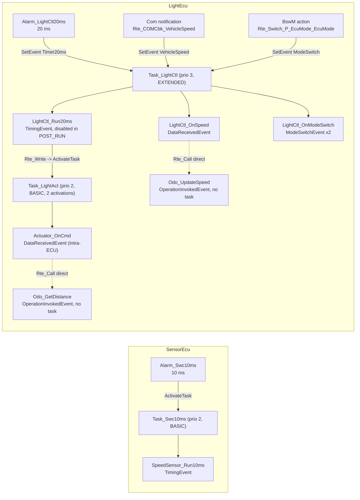
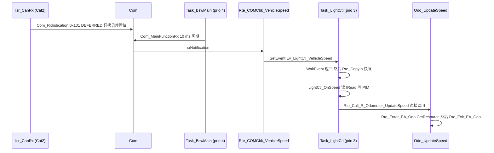
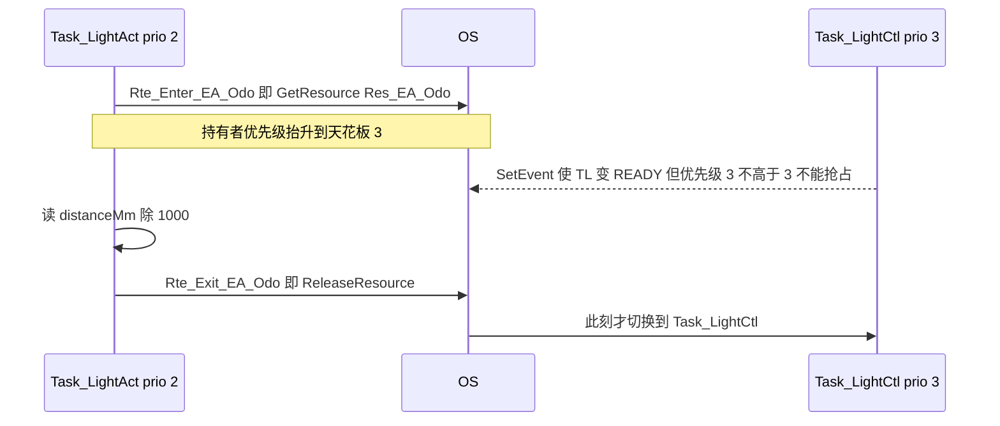

# 05 SWC 代码：四个 SWC 怎么写、能写什么、不能写什么

> 本章回答：(1) 四个应用 SWC（SpeedSensor / LightControl / LightActuator / Odometer）里每个 Runnable 由什么事件触发、为什么用这一族 `Rte_` API；(2) SWC **绝对不能做什么**（include BSW 头、碰寄存器、自己调 OS），这条规则在工程里怎么被"编译器"强制；(3) 怎么不起 OS、不起 CAN，只用一个"假 RTE"把一个 SWC 单独测起来。
> Prerequisite: [01 项目总览](01-project-overview.md)、[02 配置与生成](02-config-and-generation.md)、[03 OS 代码](03-os-code.md)、[04 RTE 代码](04-rte-code.md)；理论基础 [docs/11 第 08 章 SWC 与 RTE 交互](../11-classic-autosar-primer/08-swc-rte-interaction.md)、[docs/07-rte-swc/03 Runnable 与 Event](../07-rte-swc/03-runnable-event.md)。   Next: [06 通信栈代码](06-com-can-stack-code.md)
> 对应代码（路径均相对 `examples/mini_autosar_ecu/`，格式 `路径:行号`）：`swc/*/*.c`、`gen/LightEcu/Rte_<Swc>.h`、`gen/LightEcu/Rte_Tasks.c`、`gen/LightEcu/Rte.c`、`tests/unit/rte_mock/`、`tests/unit/test_rte_lightecu.c`
> 对应规范（R25-11，RTE SWS，页码为 PDF 页码，已在 `artifacts/pdf-text/autosar-cp-R25-11/AUTOSAR_CP_SWS_RTE.txt` 中核对）：SWS_Rte_01004（应用头文件只含本组件相关信息，p.590）、Rte_Write SWS_Rte_01071（p.699）、Rte_Read SWS_Rte_01091（p.719）、Rte_Call SWS_Rte_01102（p.731）、Rte_IRead SWS_Rte_03741（p.746）、Rte_IWrite SWS_Rte_03744（p.749）、Rte_Enter SWS_Rte_01120（p.766）、Rte_Mode SWS_Rte_02628（p.768）、Rte_Switch SWS_Rte_02631（p.707）、任务体由 RTE 生成 SWS_Rte_06200（p.134）。   深入阅读：[docs/07-rte-swc/07 Sender/Receiver](../07-rte-swc/07-sender-receiver.md)、[docs/07-rte-swc/06 Client/Server](../07-rte-swc/06-client-server.md)、[docs/autosar-swc-rte-tutorial.md](../autosar-swc-rte-tutorial.md)

---

## 1. 本章要回答的问题

四个 SWC 加起来只有约 310 行 C（`swc/` 下 4 个 `.c`：59 + 142 + 56 + 54 行，含大段注释），却几乎用到了 Classic RTE 的全部 API 族。本章把它们拆开看：

1. **谁触发它？** 每个 Runnable 的 RTE Event（Timing / DataReceived / ModeSwitch / OperationInvoked）是什么、最后落在哪个 OS Task 里、靠什么 OS 机制被唤醒。
2. **它为什么用这个 API？** 同样是"发数据"，为什么 SpeedSensor 用 `Rte_IWrite`（隐式），LightControl 却用 `Rte_Write`（显式）？同样是"调服务"，为什么 `Rte_Call` 有时是调 BSW（IoHwAb），有时是调另一个 SWC（Odometer）？
3. **它不知道什么？** 一个 SWC 对 CAN ID、Com 信号、任务优先级、寄存器地址应当**一无所知**。工程如何证明这一点？
4. **怎么测？** 把 RTE 换成二十来行手写桩，SWC 就能在 PC 上不带任何 BSW 地单测——这正是 SWC 层"可移植、可虚拟化"的实际含义。

> `[Educational Implementation]` 四个 SWC 全部是**手写**的；它们所有"和系统的接触面"都在生成的契约头 `Rte_<Swc>.h` 里。想读懂 SWC，先读契约头，再读 `.c`。

---

## 2. 直觉理解：SWC = 只会"填表"的函数

把 SWC 想成一份只能通过窗口办事的工作人员：

- 他手里只有一张**服务清单**（`Rte_<Swc>.h`）：能读哪些端口、写哪些端口、调哪些服务。清单之外的东西，他**看不见**——不是"不被允许"，而是"头文件里根本没有声明，编译直接报错"（`SWS_Rte_01004`：应用头文件只包含与该组件相关的信息，R25-11 RTE SWS p.590）。
- 他不知道什么时候被叫醒（事件→任务映射是配置，不是代码）。
- 他不知道数据去了哪里：`Rte_Write_P_HeadlightStatus_HeadlightStatus(cmd)` 可能是写 RTE 内部缓冲、也可能是 `Com_SendSignal`，换一个 ECU 部署方式，SWC 一行都不用改。

这就是 **location transparency（位置透明）**。本项目里恰好有现成的对照：`LightControl → LightActuator` 是**同一 ECU**内的 S/R（走 RTE 缓冲 + `ActivateTask`），`LightActuator → CAN 0x201` 是**跨 ECU**的 S/R（走 `Com_SendSignal`）——两者在 SWC 里都是同一种 `Rte_Write_*` 调用。

---

## 3. 先看全局：四个 SWC、七个 Runnable、四个任务

下图把"事件 → 任务 → Runnable"画在一起。数据来源：`config/ecuc/LightEcu.ecuc.json:59-73`（`RteEventToTaskMapping`）、`config/ecuc/SensorEcu.ecuc.json`、生成的 `gen/LightEcu/Rte_Tasks.c`。



读图要点：

| Runnable | 事件种类 | 谁"叫醒"任务 | 落在哪个任务 | 位置（`Rte_Tasks.c` / `.ecuc.json`） |
|---|---|---|---|---|
| `SpeedSensor_Run10ms` | TimingEvent 10 ms | OS 闹钟 `Alarm_Swc10ms` 直接 `ActivateTask` | `Task_Swc10ms`（SensorEcu，基础任务） | `gen/SensorEcu/Rte_Tasks.c:75-82` |
| `LightCtl_Run20ms` | TimingEvent 20 ms，`disabledInMode POST_RUN` | 闹钟 `Alarm_LightCtl20ms` `SetEvent(Ev_LightCtl_Timer20ms)` | `Task_LightCtl`（扩展任务）位置 1 | `gen/LightEcu/Rte_Tasks.c:94-101` |
| `LightCtl_OnSpeed` | DataReceivedEvent（来自 CAN 0x101） | `Com_MainFunctionRx` → `Rte_COMCbk_VehicleSpeed` → `SetEvent` | `Task_LightCtl` 位置 2 | `gen/LightEcu/Rte_Tasks.c:102-107`、`gen/LightEcu/Rte.c:279-288` |
| `LightCtl_OnModeSwitch` | ModeSwitchEvent（ON-ENTRY RUN / POST_RUN 两个事件映射同一个 Runnable） | BswM 动作 → `Rte_Switch_P_EcuMode_EcuMode` → `SetEvent` | `Task_LightCtl` 位置 3 | `gen/LightEcu/Rte_Tasks.c:108-112`、`gen/LightEcu/Rte.c:242-271` |
| `Actuator_OnCmd` | DataReceivedEvent（**同 ECU** 的 LightControl 写入） | `Rte_Write_P_HeadlightCmd_*` → `ActivateTask(Task_LightAct)` | `Task_LightAct`（基础任务，激活上限 2） | `gen/LightEcu/Rte_Tasks.c:123-129`、`gen/LightEcu/Rte.c:85-102` |
| `Odo_UpdateSpeed` / `Odo_GetDistance` | OperationInvokedEvent | 无——调用方直接函数调用 | **调用者的任务**（`task: null`） | `config/ecuc/LightEcu.ecuc.json:70-72` |

`[AUTOSAR Standard]` 规范层面：RTE Generator 负责**生成任务体和 ISR 体**（SWS_Rte_06200，R25-11 RTE SWS p.134），但"哪个 Runnable 放进哪个任务"是**配置输入**（`RteEventToTaskMapping`、`RtePositionInTask`），不是 RTE 自己的决定。本项目的 `RteEventToTaskMapping` 就是 `LightEcu.ecuc.json` 的第 59-73 行。

---

## 4. SpeedSensorSWC：最小的传感器 SWC

`swc/SpeedSensorSWC/SpeedSensorSWC.c`（59 行）。整个文件只有一个 Runnable：

```c
#include "Rte_SpeedSensorSWC.h"
#include "Trace.h"      /* teaching trace only (not an AUTOSAR API); the SWC includes no BSW/MCAL/OS header */

void SpeedSensor_Run10ms(void)
{
    SpeedSensor_StateType *state = Rte_Pim_SpeedSensor_State();   /* PIM: persistent across activations */
    uint16 raw = 0u;
    uint16 speed = 0u;

    /* 1. sample the wheel-speed ADC through the client/server port (12-bit raw value, 0..4095) */
    if (Rte_Call_R_WheelSpeed_GetWheelSpeed(&raw) == RTE_E_OK)
    {
        /* 2. scale: 4095 counts = 200.0 km/h, result in 0.1 km/h (0..2000) -> fits the uint16 element */
        speed = (uint16)(((uint32)raw * 2000u) / 4095u);
    }
    else
    {
        raw = 0u;                       /* sensor not available: publish speed 0 (no error management in this demo) */
    }

    /* 3. implicit write: lands in the runnable's buffer now, is sent to Com when the runnable terminates */
    Rte_IWrite_SpeedSensor_Run10ms_P_VehicleSpeed_VehicleSpeed(speed);

    /* teaching trace: one line per 10 activations (= every 100 ms) so the log stays readable */
    state->calls++;
    if ((state->calls % 10u) == 0u)
    {
        TRACE(TRACE_CAT_SWC, "SpeedSensor raw=%u speed=%u", (unsigned)raw, (unsigned)speed);
    }
}
```

逐行解读：

| 行 | 做什么 | 为什么这样写 |
|---|---|---|
| `:30-31` | 只 include `Rte_SpeedSensorSWC.h` 和 `Trace.h` | 第一个是契约头；`Trace.h` 是教学用打印（不是 AUTOSAR API，见 §8.3） |
| `:35` | `Rte_Pim_SpeedSensor_State()` | **PIM（Per-Instance Memory）**：跨激活保存的状态（调用计数）由 RTE 分配，而不是 SWC 文件里的 `static`。RTE 因此知道这块内存（分区、MemMap 节、`Rte_Start` 初始化），SWC 也可多实例化 |
| `:40` | `Rte_Call_R_WheelSpeed_GetWheelSpeed(&raw)` | **同步 C/S**，服务端是 **BSW**（IoHwAb）。SWC 看不出服务端是 SWC 还是 BSW——这是 `RteBswServerMapping`（`SensorEcu.ecuc.json`）配置的事 |
| `:43` | `raw * 2000 / 4095` | 把 12 位 ADC 值换算成 0.1 km/h，结果 0..2000 装进 `uint16` |
| `:47` | 服务失败时发布速度 0 | 教学 demo 里没有错误管理；真实项目这里会用 `Rte_Call` 的返回码做降级/标记无效 |
| `:51` | `Rte_IWrite_..._VehicleSpeed(speed)` | **隐式写**：只是往 RTE 的 Runnable 私有缓冲写一个值（宏，`gen/SensorEcu/Rte_SpeedSensorSWC.h:35`），**Runnable 结束之后** RTE 才发布 |
| `:54-58` | 每 10 次打一行 trace | 状态在 PIM 里，而不是全局变量 |

为什么这里选**隐式**（`Rte_IWrite`）？因为这是"每周期算一次、发布一次"的典型周期 Runnable：不需要处理返回值，而且保证"一次激活只发布一个一致的值"。发布发生在任务体里 Runnable 返回之后：

```c
TASK(Task_Swc10ms)
{
    /* position 1: SpeedSensor_Run10ms <- TE_SpeedSensor_10ms */
    SpeedSensor_Run10ms();
    Rte_CopyOut_SpeedSensor_Run10ms();     /* implicit write: publish after the runnable terminated */

    (void)TerminateTask();            /* basic task: one activation = one run to completion */
}
```

`Rte_CopyOut_SpeedSensor_Run10ms()`（`gen/SensorEcu/Rte.c:89-92`）把缓冲值交给 `Rte_Sink_...`，后者再调 `Com_SendSignal`（`gen/SensorEcu/Rte.c:82`）。这就是 `[AUTOSAR Standard]` "implicit communication 在 Runnable 开始时读、结束时写"的语义落到代码上的样子（SWS_Rte_03744 `Rte_IWrite`，R25-11 RTE SWS p.749）。

> **一个容易忽略的细节**：`Com_SendSignal` 只是把值**打包进 I-PDU 影子缓冲**。真正发出 CAN 0x101 的是 `Com_MainFunctionTx`（周期 20 ms，`gen/SensorEcu/Com_Cfg.c:39`）。所以 UART 日志里 t=10092 µs 的第一帧 0x101（`CAN TX`）里的值是 Com 的**初始值 0**，在 SWC 第一次运行（t=10134 µs）**之前**就已经发出了。下一章会用日志看这件事。

---

## 5. LightControlSWC：三个事件、三种 Runnable、同一个任务

`swc/LightControlSWC/LightControlSWC.c`（142 行）是全项目 API 族最全的 SWC。文件头注释（`:15-31`）自己就列了"每个 API 族为什么用"，我们把它展开成表：

| API 族 | 用在哪（行号） | 为什么用它而不是别的 |
|---|---|---|
| 显式 S/R `Rte_Read` | `LightCtl_Run20ms`：`:63` 读 AmbientLight | AmbientLight **没有**触发事件（接收方只是周期性轮询最新值），读的时刻由 Runnable 自己决定；返回码要处理（`RTE_E_COM_STOPPED`） |
| 显式 S/R `Rte_Write` | `:99` 写 HeadlightCmd，`:134` 在 POST_RUN 里写 OFF | **写必须立刻让接收方看到**：这次写入同时触发 `ActivateTask(Task_LightAct)`（`gen/LightEcu/Rte.c:99`）。如果用隐式写，要等 Runnable 结束 |
| 隐式 S/R `Rte_IRead` | `LightCtl_OnSpeed`：`:111` | 一次激活里只需要**一个一致的速度值**；`Rte_CopyIn_LightCtl_OnSpeed()` 在 Runnable 启动前就把 Com 信号拷成快照（`gen/LightEcu/Rte_Tasks.c:105`、`gen/LightEcu/Rte.c:183-187`） |
| 同步 C/S `Rte_Call` | `:118` 调 Odometer | Odometer 是**服务**，不是数据；同分区同步调用 = 一次函数调用，**在调用者任务里执行** |
| Mode `Rte_Mode` + ModeSwitchEvent | `:73`（防御性检查）、`:127` | 模式是 BswM 拥有的状态机，SWC 只观察；用事件通知"进入新模式" |
| PIM `Rte_Pim` | `:58`、`:107`、`:126` | 跨激活状态（上次命令、上次速度、POST_RUN 标志） |

### 5.1 `LightCtl_Run20ms`：周期决策

```c
void LightCtl_Run20ms(void)
{
    LightCtl_StateType *s = Rte_Pim_LightCtl_State();
    uint8 ambient = 255u;                  /* default = bright: if no value is available the lamp stays off */
    uint8 cmd = LIGHT_OFF;

    /* Explicit read: RTE_E_OK, or RTE_E_COM_STOPPED while Com is not running. Keep the last value on error. */
    if (Rte_Read_R_AmbientLight_AmbientLight(&ambient) == RTE_E_OK)
    {
        s->lastAmbient = ambient;
    }
    else
    {
        ambient = s->lastAmbient;
    }

    /* Defensive: the RTE already suppresses this runnable in POST_RUN (disabledInMode), a second check costs one load. */
    if (Rte_Mode_R_EcuMode_EcuMode() == RTE_MODE_EcuMode_POST_RUN)
    {
        return;
    }

    if ((ambient < AMBIENT_VERY_DARK) && (s->lastSpeed >= SPEED_HIGH_BEAM_01KMH))
    {
        cmd = LIGHT_HIGH;
    }
    else if (ambient < AMBIENT_DARK_THRESHOLD)
    {
        cmd = LIGHT_LOW;
    }
    else
    {
        cmd = LIGHT_OFF;
    }

    if (cmd != s->lastCmd)
    {
        s->lastCmd = cmd;
        lightctl_trace(s, cmd);
    }

    /* Explicit write EVERY cycle (not only on change): the RTE stores it in its buffer and activates the actuator task,
     * which also refreshes the odometer distance in the LightStatus frame. */
    (void)Rte_Write_P_HeadlightCmd_HeadlightCmd(cmd);
}
```

要点：

1. **默认值保守**：`:59` 的 `ambient = 255`（"很亮"）——如果 Com 没数据，灯保持关。读取失败时（`:67-70`）用 PIM 里上次的值，而不是默认值。
2. **防御性模式检查（`:73-76`）**：RTE 已经通过 `disabledInMode POST_RUN` 在任务体里跳过了这个 Runnable（`gen/LightEcu/Rte_Tasks.c:97`），这里再检查一次"成本是一次加载"。这是**纵深防御**，不是冗余——如果配置改动（比如把 disabledInMode 去掉），SWC 的行为仍然正确。
3. **每个周期都写**（`:97-99`）：不是只在变化时写。注释说明了原因：这次写会 `ActivateTask(Task_LightAct)`，由它刷新 0x201 帧里的里程值。**这是 SWC 逻辑依赖 RTE 触发语义的例子**——也是为什么 `Task_LightAct` 要把激活上限设成 2（`gen/LightEcu/Os_Cfg.c:67`，避免连续两次写入时 `E_OS_LIMIT`）。
4. **trace 只在命令变化时打**（`:91-95`），否则 20 ms 一行会淹没日志。

### 5.2 `LightCtl_OnSpeed`：数据到达 + 调服务

```c
void LightCtl_OnSpeed(void)
{
    LightCtl_StateType *s = Rte_Pim_LightCtl_State();

    /* Implicit read: the RTE copied the signal into a runnable-private buffer BEFORE this function started
     * (Rte_CopyIn_LightCtl_OnSpeed in the task body). Calling Rte_IRead twice returns the same value. */
    uint16 speed = Rte_IRead_LightCtl_OnSpeed_R_VehicleSpeed_VehicleSpeed();

    s->lastSpeed = speed;
    s->speedRxCount++;

    /* Synchronous client/server call into OdometerSWC. The RTE realises it as a direct call in THIS task's context
     * (Task_LightCtl); inside the server an exclusive area (OS resource with ceiling priority) protects the shared distance. */
    (void)Rte_Call_R_Odometer_UpdateSpeed(speed);
}
```

这里同时出现了三件事：

- **隐式读**（`:111`）：`Rte_IRead_LightCtl_OnSpeed_R_VehicleSpeed_VehicleSpeed()` 是一个宏，展开为读一个全局缓冲（`gen/LightEcu/Rte_LightControlSWC.h:47-48`）。这个缓冲在 Runnable 之前被 `Rte_CopyIn_LightCtl_OnSpeed()` 填充。调用多次返回同一个值。
- **PIM 更新**（`:113-114`）：只有 `Task_LightCtl` 里的 Runnable 会碰 `LightCtl_State`，所以**不需要锁**——这正是"把同一个 SWC 的 Runnable 映射到同一个任务"的好处（见文件头 `:22-24`）。
- **同步 C/S 调用**（`:118`）：`Rte_Call_R_Odometer_UpdateSpeed(speed)` 在 `gen/LightEcu/Rte.c:195-199` 里就是 `return Odo_UpdateSpeed(Speed);`——一个普通函数调用，加一行 RTE trace。



### 5.3 `LightCtl_OnModeSwitch`：对模式作出反应

```c
void LightCtl_OnModeSwitch(void)
{
    LightCtl_StateType *s = Rte_Pim_LightCtl_State();
    Rte_ModeType_EcuMode mode = Rte_Mode_R_EcuMode_EcuMode();      /* atomic read of the current mode */

    if (mode == RTE_MODE_EcuMode_POST_RUN)
    {
        /* Entering POST_RUN: lamps off at once; Run20ms is disabled by the RTE from now on. */
        s->postRun = 1u;
        s->lastCmd = LIGHT_OFF;
        (void)Rte_Write_P_HeadlightCmd_HeadlightCmd(LIGHT_OFF);
        lightctl_trace(s, LIGHT_OFF);
    }
    else
    {
        /* Back in RUN: Run20ms is enabled again and takes over at its next period. */
        s->postRun = 0u;
    }
}
```

注意**两个** ModeSwitchEvent（`MSE_LightCtl_EnterRun`、`MSE_LightCtl_EnterPostRun`）映射到**同一个** Runnable（`gen/LightEcu/Rte_LightControlSWC.h:31`），所以 Runnable 必须自己用 `Rte_Mode_R_EcuMode_EcuMode()`（`:127`）判断是进入了哪个模式。`Rte_Mode_...()` 是 `gen/LightEcu/Rte_LightControlSWC.h:57` 里的宏，读一个 `volatile uint8`——一次读，天然原子。

模式切换是谁发起的？不是 SWC：BswM 的规则 `R_EcuModeRequest`（`config/ecuc/LightEcu.ecuc.json:117`）读到 Com 信号 EcuModeRequest=1 → 动作列表 `AL_ModePostRun` → `Rte_Switch_P_EcuMode_EcuMode(POST_RUN)`（`gen/LightEcu/BswM_Cfg.c:91-94`）。SWC 只是**被通知**。

---

## 6. LightActuatorSWC：执行器 + 状态发布

`swc/LightActuatorSWC/LightActuatorSWC.c`（56 行），一个 Runnable，**同一 ECU 内被 LightControl 触发**：

```c
void Actuator_OnCmd(void)
{
    Actuator_StateType *s = Rte_Pim_Actuator_State();
    uint8 cmd = 0u;
    uint32 distance = 0u;

    /* 1. fetch the command (explicit read of the RTE buffer written by LightControlSWC) */
    if (Rte_Read_R_HeadlightCmd_HeadlightCmd(&cmd) != RTE_E_OK)
    {
        return;                              /* RTE not started / no data: nothing to do */
    }

    /* 2. read the odometer (server in OdometerSWC; the RTE enters the exclusive area EA_Odo inside the server) */
    (void)Rte_Call_R_Odometer_GetDistance(&distance);

    /* 3. drive the hardware only when the command changed: IoHwAb -> Dio_WriteChannel */
    if (cmd != s->lastState)
    {
        if (Rte_Call_R_LightHw_SetHeadlight(cmd) == RTE_E_OK)
        {
            s->lastState = cmd;
            TRACE(TRACE_CAT_SWC, "Actuator state=%u dist=%u", (unsigned)cmd, (unsigned)distance);
        }
    }
    s->calls++;

    /* 4. publish status + distance: both are packed by Com into I-PDU 0x201 (sent every 100 ms by Com_MainFunctionTx) */
    (void)Rte_Write_P_HeadlightStatus_HeadlightStatus(cmd);
    (void)Rte_Write_P_OdometerDistance_Distance(distance);
}
```

四步流程值得逐步看：

1. **`:34` 显式 `Rte_Read`**，从 RTE 内部缓冲读 HeadlightCmd（`gen/LightEcu/Rte.c:153-166`，`SuspendOSInterrupts` 保护）。读不到就 `return`（RTE 没 Start）。
2. **`:40` `Rte_Call_R_Odometer_GetDistance`**：调 Odometer 的服务，距离是 `uint32 m`。**RTE 在服务端 Runnable 内部**拿独占区（见 §7）。
3. **`:43-50` 只在命令变化时驱动硬件**：`Rte_Call_R_LightHw_SetHeadlight(cmd)` 经 `RteBswServerMapping`（`config/ecuc/LightEcu.ecuc.json:75`）映射到 `IoHwAb_SetHeadlight`（`gen/LightEcu/Rte.c:201-205`），再往下是 `Dio_WriteChannel`（`ecual/iohwab/IoHwAb.c:105-106`）。SWC 不知道 PC7/PB7。
4. **`:54-55` 发布两个 Com 信号**：HeadlightStatus 和 OdometerDistance 被 Com 打进**同一个** I-PDU（0x201，6 字节：`uint8` @bit0，`uint32` @bit16，见 `gen/LightEcu/Com_Cfg.c:48-61`）。**SWC 对"两个信号共用一个帧"毫不知情**。

`Task_LightAct` 的优先级是 2，**低于** `Task_LightCtl`(3) 和 `Task_BswMain`(4)（`gen/LightEcu/Os_Cfg.c:36,46,56,66`）：Actuator 随时可以被抢占。这就是为什么 Odometer 的 PIM 需要独占区——见下一节。

---

## 7. OdometerSWC：纯服务端 SWC + 独占区

`swc/OdometerSWC/OdometerSWC.c`（54 行）没有 TimingEvent，只有两个 `OperationInvokedEvent`，配置为 `task: null`：

```c
Std_ReturnType Odo_UpdateSpeed(uint16 Speed)
{
    Odo_StateType *s = Rte_Pim_Odo_State();
    uint32 updates;
    uint32 distanceM;

    Rte_Enter_EA_Odo();                         /* GetResource(Res_EA_Odo): ceiling priority protects the PIM */
    s->distanceMm += ((uint32)Speed * 20u) / 36u;
    s->updates++;
    updates = s->updates;
    distanceM = s->distanceMm / 1000u;
    Rte_Exit_EA_Odo();                          /* ReleaseResource: a higher-priority task may now preempt */

    if ((updates % 50u) == 0u)                  /* about once per second at 20 ms update period */
    {
        TRACE(TRACE_CAT_SWC, "Odometer dist_m=%u", (unsigned)distanceM);
    }
    return RTE_E_OK;
}

Std_ReturnType Odo_GetDistance(uint32 *Distance)
{
    Odo_StateType *s = Rte_Pim_Odo_State();

    Rte_Enter_EA_Odo();
    *Distance = s->distanceMm / 1000u;          /* metres, consistent snapshot of the 32-bit value */
    Rte_Exit_EA_Odo();
    return RTE_E_OK;
}
```



这里藏着本项目最重要的"为什么这样配置"：

- 服务端 Runnable **运行在调用者的任务里、用调用者的优先级**。`Odo_UpdateSpeed` 被 `Task_LightCtl`(3) 调；`Odo_GetDistance` 被 `Task_LightAct`(2) 调。两者都读写 `Odo_State.distanceMm`（`uint32`，在 32 位 Cortex-M 上读写本身是原子的，但 `distanceMm += ...` 加 `updates++` 是**多步**，且 `GetDistance` 需要读到一致的快照）。
- 解法：独占区 `EA_Odo`，实现为 `OS_RESOURCE`（`config/ecuc/LightEcu.ecuc.json:57`），**天花板优先级 = 所有访问者里最高的优先级 = 3**（`gen/LightEcu/Os_Cfg.c:114`，生成器计算，不是手填）。
- 实现：`Rte_Enter_EA_Odo()` = `GetResource(Res_EA_Odo)`，`Rte_Exit_EA_Odo()` = `ReleaseResource(Res_EA_Odo)`（`gen/LightEcu/Rte.c:219-227`）。持有者被临时抬到优先级 3，`Task_LightCtl`（3）不能抢占 `Task_LightAct`，`Task_BswMain`（4）仍然可以抢占。代价：没有额外任务、没有阻塞、没有死锁风险（**优先级天花板协议**）。

对比另外两种 `RteExclusiveAreaImplementation`（注释在 `gen/LightEcu/Rte.c:213-218`）：`OS_INTERRUPT_BLOCKING` / `ALL_INTERRUPT_BLOCKING`（用 `Suspend*Interrupts`，会连 ISR 一起挡住，只适合极短的临界区）。本项目选 `OS_RESOURCE`（`DESIGN.md` §1 把独占区映射到 OS 资源的优先级天花板作为展示点），一个通用的理由是：不应该为了应用层的数据一致性去关中断（连 CAN RX ISR 一起挡住）。

> **`[AUTOSAR Standard]`**：`Rte_Enter`（SWS_Rte_01120，R25-11 RTE SWS p.766）与 `Rte_Exit`（§5.6.31，p.767）是 SWC 标记独占区起止的 API；SWS_Rte_01122（p.766）要求 RTE 允许**嵌套**使用不同的独占区，但必须按进入的反序退出。SWC 不关心实现；`Rte_Enter_EA_Odo` 在契约头里就是普通函数声明（`gen/LightEcu/Rte_OdometerSWC.h:38-39`）。

---

## 8. SWC **不能**做什么

这是本章最重要的一节。用一个清单列出，再说明工程里怎么**机械地**验证。

### 8.1 禁止清单

| 禁止 | 原因 | 违反的后果（真实项目） |
|---|---|---|
| `#include "Can.h" / "Com.h" / "Os.h" / "Dio.h" ...` | SWC 一旦直接用 BSW，就**绑死了部署**（换 ECU / 换总线就要改应用）；也越过了 RTE 的数据一致性与访问控制 | 集成时编译报错或（更糟）能编译但行为依赖于某个 BSW 实现 |
| 直接读写寄存器（`*(volatile uint32*)0x...`） | 硬件访问属于 **MCAL**；SWC 要能在 PC 上虚拟化（vECU） | 一个 SWC 无法移植到 RH850；无法单测 |
| 自己 `ActivateTask` / `SetEvent` / `WaitEvent` | 任务划分是**集成者的配置决策**（`RteEventToTaskMapping`），不是 SWC 作者的 | 任务映射一改，SWC 里的硬编码就崩 |
| 自己做 `static` 全局状态（跨激活） | RTE 不知道这块内存：不能分区、不能 MemMap、多实例冲突 | 用 `Rte_Pim_*` / IRV 代替 |
| 假设自己在哪个任务/优先级 | 同一个 SWC 在不同项目里可能放进不同任务 | 隐式假设导致数据竞争（见 Odometer 的 `canBeInvokedConcurrently`） |
| 假设数据来自 CAN / 来自本 ECU | 位置透明 | 部署一变就坏 |

### 8.2 工程里怎么机械地验证（"编译器就是裁判"）

DESIGN.md 把这条规则写成了评审项（"SWC 只 include `Rte_<Swc>.h`（及 `Trace.h`），绝不 include BSW/MCAL/OS 头"，`DESIGN.md` §4 "层规则"）。最简单的机械检查：**只给 SWC 一个最小的 include 路径**，看它能不能编译。

下面是一次真实运行（在 `examples/mini_autosar_ecu/` 下，host `gcc`）：

```text
$ for s in "SpeedSensorSWC SensorEcu" "LightControlSWC LightEcu" "LightActuatorSWC LightEcu" "OdometerSWC LightEcu"; do
>   set -- $s
>   gcc -std=c99 -pedantic -Wall -Wextra -Werror -fsyntax-only -DMINI_PLATFORM_HOST \
>       -Iinclude -Irte -Igen/$2 swc/$1/$1.c && echo "OK $1"
> done
OK SpeedSensorSWC
OK LightControlSWC
OK LightActuatorSWC
OK OdometerSWC
```

`-Iinclude -Irte -Igen/<Ecu>` 是**最小集**：没有 `mcal/`、`bsw/`、`ecual/`、`os/` 目录。四个 SWC 全部通过，说明它们**只依赖**公共基础头、`Rte_Common.h` 和自己的契约头。反过来，在 `OdometerSWC.c` 的 `#include "Trace.h"` 后面加一行 `#include "Can.h"`（我在一份**拷贝**上做的实验，文件名因此是拷贝的名字，真实输出里文件名前还有拷贝所在的目录，这里省略；其余逐字一致），同样的命令给出（真实输出）：

```text
Bad.c:25:10: fatal error: Can.h: No such file or directory
   25 | #include "Can.h"
      |          ^~~~~~~
compilation terminated.
```

> `[Educational Implementation]` **诚实说明**：项目自己的构建（`tools/run_mini_autosar.py` 的 `include_dirs()`，`:82-91`）给所有源文件一套**统一**的 include 路径（`include`、`os/include`、`mcal/*`、`bsw/*` 等都在里面），所以主构建**不会**拦住 SWC 误 include `Can.h`。这条规则目前靠"评审 + 本节的最小 include 路径检查"保证。真实项目通常把它做成**构建系统层面**的约束——每个 SWC 的编译单元只拿到它自己的 `Rte_<Swc>.h` 目录，或者用静态分析（MISRA / 依赖检查）把"SWC 引用了 BSW 头文件"做成 CI 失败项。动手实验 3 让你把它补成脚本。

### 8.3 `Trace.h`：一个有意的"逃生口"

四个 SWC 都 include 了 `Trace.h`（`swc/*/*.c` 里各一行：`LightActuatorSWC.c:25`、`LightControlSWC.c:34`、`OdometerSWC.c:24`、`SpeedSensorSWC.c:31`），并调用 `TRACE(TRACE_CAT_SWC, ...)`。它**不是** AUTOSAR API：这是项目为了让 UART 日志能打印 SWC 事件而开的口子，宏在目标上最终写 USART1，在 host 上写 stdout。真实 SWC **不会**有这个依赖；真实项目里 SWC 想产生可观测事件，要么用 `Rte_Write`（给诊断/日志 SWC），要么走 DLT/Det 的 SWC 端口。本项目的代价是：**SWC 在没有 `Trace_Log` 的环境里要么提供一个桩（§9 做法），要么把 `MINI_TRACE_MASK` 的 SWC 位关掉**。

---

## 9. 怎么单测一个 SWC：把 RTE 换成"假 RTE"

项目里有**两层**测试，别混淆：

| 层 | 文件 | 被测对象 | 被替换成 mock 的东西 |
|---|---|---|---|
| **A. 生成 RTE + 真 SWC** | `tests/unit/test_rte_lightecu.c`、`test_rte_sensorecu.c`、`test_rte_tasks.c` | **生成的 `Rte.c`/`Rte_Tasks.c`** 和真 SWC 一起 | RTE **之下**的一切：OS、Com、IoHwAb（`tests/unit/rte_mock/rte_mocks.c`） |
| **B. 只有 SWC** | （本章动手实验 2：`test_speedsensor_pure.c`） | **只有一个 SWC `.c`** | RTE 本身：用手写桩实现契约头声明的符号 |

### 9.1 A 层：`rte_mock` 记录调用序列

`tests/unit/rte_mock/rte_mocks.h`（45 行）给出了 mock 的"词汇"：

```c
typedef struct {
    const char *fn;
    uint32      a;
    uint32      b;
} MockCall;

void            mock_reset(void);
uint32          mock_ncalls(void);
const MockCall *mock_call(uint32 i);
uint32          mock_count(const char *fn);
int             mock_index_of(const char *fn, uint32 from);          /* -1 if not found */
int             mock_index_of_args(const char *fn, uint32 a, uint32 from);

/* Com: value store (size in bytes, little endian like the real packing) */
void            mock_com_set(uint16 sig, uint8 size, uint32 value);
uint32          mock_com_sent(uint16 sig);                           /* last value passed to Com_SendSignal */
void            mock_com_set_stopped(boolean stopped);               /* Com returns COM_SERVICE_NOT_AVAILABLE */

/* OS: the queue of event masks that WaitEvent hands out; when it is empty WaitEvent leaves the task via longjmp */
void            mock_set_events(const uint32 *evs, uint32 n);
int             mock_run_task(void (*task)(void));                   /* returns 1 if the task body was left through WaitEvent */
int             mock_irq_depth(void);                                /* nesting of Suspend/Resume OS interrupts (must end at 0) */
int             mock_res_depth(void);                                /* GetResource - ReleaseResource */

/* IoHwAb / trace */
extern uint16   mock_wheel_raw;
extern void   (*mock_iohwab_hook)(void);                             /* called inside IoHwAb_GetWheelSpeed */
int             mock_trace_has(const char *text);                    /* was a trace line containing text emitted? */
```

核心想法（`:1-10` 的文件头自己写得很清楚）：**RTE 的行为 = 它调用下层的序列**。所以 mock 记录每次调用（函数名 + 两个参数），测试断言"序列对不对"：

- `Rte_COMCbk_VehicleSpeed()` 之后必须出现 `SetEvent(Task_LightCtl, Ev_LightCtl_VehicleSpeed)`（`tests/unit/test_rte_lightecu.c:62-71`）。
- `Rte_CopyIn` 之后信号再变，Runnable 仍看到旧值——**隐式读快照**（`:73-87`）。
- `Rte_Call_R_Odometer_*` 被 `GetResource`/`ReleaseResource(Res_EA_Odo)` 包住，且成对（`:101-112`）。
- 隐式写：Runnable 运行**期间**没有 `Com_SendSignal`，结束后才有（`tests/unit/test_rte_sensorecu.c:44-45`，用 `mock_iohwab_hook` 在 Runnable 内部取样）。

mock 对"扩展任务永不返回"这件事用了一个小技巧：`WaitEvent` 在事件队列用尽时 `longjmp` 出任务体（`rte_mocks.c:137-146`），`mock_run_task()` 捕获它。

运行方式（注意：`--step` 只执行指定步骤，但**会用这一次的结果覆盖 `artifacts/mini-autosar/summary.txt`**；想保留完整汇总，之后再无参数跑一遍全量）：

```
python examples/mini_autosar_ecu/tools/run_mini_autosar.py --step unit
```

真实结果见 `artifacts/mini-autosar/unit/test_rte_lightecu/run.log`：`test_rte_lightecu: all checks passed`。

### 9.2 B 层：真"mock RTE"——二十来行桩测一个 SWC

A 层测的是 RTE。要测 **SWC 自己的逻辑**（换算公式、阈值、状态机），更直接的办法是：不要 `Rte.c`，自己实现契约头声明的符号。因为契约头 `Rte_SpeedSensorSWC.h` 只声明了 3 个东西：

1. `Rte_Call_R_WheelSpeed_GetWheelSpeed`（函数）
2. `Rte_Iwb_SpeedSensor_Run10ms_P_VehicleSpeed_VehicleSpeed`（缓冲，`Rte_IWrite_*` 宏往里写，`gen/SensorEcu/Rte_SpeedSensorSWC.h:34-35`）
3. `Rte_Pim_SpeedSensor_SpeedSensor_State`（PIM 存储，`:43-44`）

把这三样在测试里定义出来，再提供一个 `Trace_Log` 桩（因 SWC 用了 `TRACE`），SWC 就能链接、运行：

```c
// SOURCES: swc/SpeedSensorSWC/SpeedSensorSWC.c
// INCLUDES: gen/SensorEcu swc/SpeedSensorSWC
/* test_speedsensor_pure.c - unit test of ONE SWC against hand-written RTE stubs (no generated Rte.c, no mock OS/Com) */
#include <stdio.h>
#include "Rte_SpeedSensorSWC.h"     /* the contract header: declares everything the SWC may call */
#include "Trace.h"

/* ---- the "mock RTE": define exactly the symbols that Rte_SpeedSensorSWC.h declares ---- */
static uint16         g_adcRaw  = 0u;                   /* what the fake IoHwAb server returns   */
static Std_ReturnType g_adcRc   = RTE_E_OK;             /* ... and with which return code        */
uint16                Rte_Iwb_SpeedSensor_Run10ms_P_VehicleSpeed_VehicleSpeed;   /* target of Rte_IWrite_... (macro) */
SpeedSensor_StateType Rte_Pim_SpeedSensor_SpeedSensor_State;                      /* PIM storage (macro Rte_Pim_...)  */

Std_ReturnType Rte_Call_R_WheelSpeed_GetWheelSpeed(uint16 *Raw) { *Raw = g_adcRaw; return g_adcRc; }
void Trace_Log(Trace_CategoryType cat, const char *fmt, ...) { (void)cat; (void)fmt; }   /* swallow TRACE() */

static int failures;
#define CHECK(c) do { if (!(c)) { printf("FAIL %s:%d: %s\n", __FILE__, __LINE__, #c); failures++; } } while (0)
#define PUBLISHED  (Rte_Iwb_SpeedSensor_Run10ms_P_VehicleSpeed_VehicleSpeed)

int main(void)
{
    g_adcRaw = 2048u; SpeedSensor_Run10ms();  CHECK(PUBLISHED == 1000u);    /* 2048*2000/4095 = 1000 (100.0 km/h) */
    g_adcRaw = 4095u; SpeedSensor_Run10ms();  CHECK(PUBLISHED == 2000u);    /* full scale = 200.0 km/h            */
    g_adcRc = RTE_E_LIMIT; g_adcRaw = 777u; SpeedSensor_Run10ms();
    CHECK(PUBLISHED == 0u);                                                 /* server failed -> speed 0           */
    CHECK(Rte_Pim_SpeedSensor_SpeedSensor_State.calls == 3u);               /* PIM counted every activation       */
    if (failures == 0) { printf("test_speedsensor_pure: all checks passed\n"); return 0; }
    printf("test_speedsensor_pure: %d check(s) FAILED\n", failures);
    return 1;
}
```

这份测试在 `-std=c99 -pedantic -Wall -Wextra -Werror`（和项目单测完全一致的告警基线）下通过：

```text
test_speedsensor_pure: all checks passed
```

把 SWC 里的 `2000u` 故意改成 `2001u`（拷贝一份改，不要动原文件），满量程用例立刻失败：

```text
FAIL .../test_speedsensor_pure.c:24: PUBLISHED == 2000u
test_speedsensor_pure: 1 check(s) FAILED
```

**这一层 mock 的价值**：

- SWC 逻辑可以在**没有 OS、Com、CAN、IoHwAb** 的情况下测，毫秒级反馈。
- 同一个测试可以在 **target（RH850）和 host** 上编译——因为 SWC 只依赖契约头。真实项目里，这类测试跑在 vECU / 单元测试框架里（`[Industry Practice]` 例如 Vector vTESTstudio、Parasoft、Tessy 等，用生成的 Rte mock 头文件）。
- 对于要读 `Rte_Read` 的 SWC（如 `LightCtl_Run20ms`），桩变成"函数 + 可控返回值"：

```c
static uint8 g_ambient = 255u;  static Std_ReturnType g_rc = RTE_E_OK;
Std_ReturnType Rte_Read_R_AmbientLight_AmbientLight(uint8 *d) { *d = g_ambient; return g_rc; }
Std_ReturnType Rte_Write_P_HeadlightCmd_HeadlightCmd(uint8 d) { g_lastCmd = d; return RTE_E_OK; }
```

再加 `Rte_Pim_LightControl_LightCtl_State`（存储）与 `Rte_Mode_EcuMode`（`volatile` 变量）即可。

---

## 10. 常见误解

| 误解 | 事实 |
|---|---|
| "Runnable 就是一个任务" | Runnable 是**可执行实体**；任务是 OS 对象。`Task_LightCtl` 里有三个 Runnable，`Odo_*` 两个 Runnable 根本不在任何任务里（调用者的任务里执行） |
| "`Rte_Write` 立刻发 CAN 帧" | `Rte_Write` 到 Com 只是**打包进 I-PDU 缓冲**（`Com_SendSignal`）。发帧是 `Com_MainFunctionTx` 的周期（本项目 `PENDING` 属性，不触发立即发送，`gen/LightEcu/Com_Cfg.c:53,60`） |
| "隐式比显式好/快" | 隐式换来**一致性快照**，代价是写入延迟到 Runnable 结束。本项目两种都用，因各有道理 |
| "SWC 里调 `Rte_Call` 会阻塞/切换任务" | **同分区同步 C/S** 就是函数调用，不会切换。跨分区/异步才要队列和任务 |
| "SWC 不能有状态" | 可以，但要放 PIM / IRV，让 RTE 知道 |
| "独占区 = 关中断" | 本项目 `EA_Odo` 是 OS 资源的**优先级天花板**：不关中断，只抬高持有者优先级 |

---

## 11. 动手实验

**实验 1：看契约头怎么随配置变化**

1. 阅读 `config/ecuc/LightEcu.ecuc.json:59-73`，把 `Actuator_OnCmd` 的 `trigger` 改成 `COM_NOTIFICATION`（仅为实验，不要提交）；
2. 运行 `python examples/mini_autosar_ecu/tools/run_mini_autosar.py --step gen`；
3. 观察 `gen/LightEcu/Rte.c` 里 `Rte_Sink_LightControl_P_HeadlightCmd_HeadlightCmd` 的 `ActivateTask` 消失、`Rte_Tasks.c` 里任务体变化；`swc/LightActuatorSWC/LightActuatorSWC.c` **一行都没改**。
4. `git`/备份还原 `config/` 与 `gen/`（`gen/` 是入库产物，实验后务必还原）。

**实验 2：给 SWC 写一个纯桩单测（§9.2）**

1. 新建 `examples/mini_autosar_ecu/tests/unit/test_speedsensor_pure.c`，内容用 §9.2 那份；文件头两行 `// SOURCES:` 和 `// INCLUDES:` 是项目单测约定（`tools/run_mini_autosar.py:294-317`）。
2. 跑 `python examples/mini_autosar_ecu/tools/run_mini_autosar.py --step unit` 或手工编译：
   ```
   cd examples/mini_autosar_ecu
   gcc -O0 -DMINI_PLATFORM_HOST -DMINI_UNIT_TEST -std=c99 -Wall -Wextra -Werror -pedantic \
       -Igen/SensorEcu -Iswc/SpeedSensorSWC -Iinclude -Ios/include -Imcal/mmio -Irte -Isim/include \
       tests/unit/test_speedsensor_pure.c swc/SpeedSensorSWC/SpeedSensorSWC.c -o t.exe && ./t.exe
   ```
3. 把 `LightCtl_Run20ms` 也做成纯桩测试：覆盖三个分支（ambient<30 且 speed≥600、ambient<100、否则）和 `RTE_E_COM_STOPPED` 回退到 `lastAmbient`。

**实验 3：把 §8.2 的"最小 include 路径"检查写成脚本**

写一个 20 行 Python/shell：遍历 `swc/*/*.c`，用 `-fsyntax-only -Iinclude -Irte -Igen/<Ecu>` 编译，失败则退出 1。再用 `grep -n '#include' swc/*/*.c` 核对只出现 `Rte_*.h` 和 `Trace.h`。思考：真实项目里它应该挂在哪一步（CI？生成器后？）。

**实验 4：看隐式写的延迟**

用 GDB（见[第 09 章](09-renode-gdb-and-rh850-porting.md)）在 `SpeedSensor_Run10ms` 与 `Com_SendSignal` 上各下一个断点，确认**先**命中 `SpeedSensor_Run10ms` 的返回，**再**命中 `Com_SendSignal`，而不是在 `Rte_IWrite_*` 处（它只是宏）。

---

## 12. 对照真实项目 `[Industry Practice]` / RH850 / GHS

| 本项目 | 真实项目里你会看到 |
|---|---|
| 手写 `swc/<Swc>/<Swc>.c` + 生成 `Rte_<Swc>.h` | SWC 由功能开发者在 DaVinci Developer / SystemDesk 里建模（ARXML），生成骨架 `.c`（runnable 空函数）+ `Rte_<Swc>.h`、`Rte_<Swc>_Type.h`；或 MATLAB/Simulink + Embedded Coder 生成 SWC 代码（RTA-CAR / Vector 两条工具链都支持）。 |
| 契约头里 `Rte_IRead` 是宏、`Rte_Call` 是函数 | 优化的 RTE 生成器（Vector MICROSAR RTE、ETAS RTA-RTE）把大量 `Rte_Read/Write/IRead/IWrite` 展开成宏或内联，`Rte_Call` 同分区同步时展开为服务函数直调；**API 名称**遵循 `Rte_<API>_<port>_<element>`（SWS 规定，本项目一致，R25-11 SWS_Rte_01071 等）。 |
| `Trace.h` 逃生口 | 真实 SWC 没有；用 DLT SWC 端口或 `Dem`/`Det` 服务端口。 |
| `RteEventToTaskMapping` 在 JSON | 在 ECUC（DaVinci Configurator Pro 的 Rte 配置页 / RTA-CAR 的 RTE 配置）里按 Runnable 逐个拖到任务，工具会按 `RtePositionInTask` 排序；任务优先级和 Runnable 的 WCET 一起决定可调度性（用 RTA-OSEK / Timing Architects 做分析）。 |
| 独占区 = `OS_RESOURCE` | 同样是常见选择；RTA-OS 把 `RteExclusiveArea` → `OsResource`，天花板自动算；某些工具默认 `OS_INTERRUPT_BLOCKING`，要主动改。 |
| 纯 SWC 单测 + 假 RTE | 汽车行业常称 "SWC 单元测试 / MIL-SIL"；常见的单元测试工具（例如 Vector vUnit、Tessy 等）支持为 `Rte_<Swc>.h` 提供桩或 mock（具体能力以工具文档为准）。 |
| RH850 / GHS 视角 | **SWC 代码一行都不变**。差别全在下面的层：任务切换（G3M 不用 PendSV，而是 EIRET/TRAP 或 OS 自己的上下文）、`Rte_Enter` 的实现（`DI/EI` 或 PSW/PMR）、`Com_SendSignal` 之下的 MCAL。变化清单见[第 09 章](09-renode-gdb-and-rh850-porting.md)。 |

---

## 13. 一句话记住

1. SWC 只通过 `Rte_<Swc>.h` 这一份"合同"与外界交往；**合同之外的东西在编译期就不存在**。
2. **事件→任务映射是配置，不是代码**：`Task_LightCtl` 里放三个 Runnable，是为了让它们共享 PIM 而不需要锁。
3. 显式 `Rte_Write` 立刻生效（并可触发接收方），隐式 `Rte_IWrite` 在 Runnable 结束后才发布——选哪个取决于**一致性 vs 即时性**。
4. 同分区同步 `Rte_Call` = 函数调用，在**调用者**任务里执行；共享状态就用独占区（本项目：OS 资源 + 优先级天花板 = 3）。
5. SWC 的单测不需要 OS、Com、CAN：把契约头声明的符号用桩实现即可。

---

## 14. 自测题

1. `LightCtl_OnSpeed` 为什么用 `Rte_IRead`，而 `LightCtl_Run20ms` 对 AmbientLight 用 `Rte_Read`？如果把 `Rte_Read` 换成隐式读，`LightCtl_Run20ms` 需要在任务体里新增什么？（提示：看 `gen/LightEcu/Rte_Tasks.c:105` 的 CopyIn）
2. `Task_LightAct` 的 `maxActivations` 为什么是 2？如果改回 1，在什么时序下 `Rte_Write_P_HeadlightCmd_*` 里的 `ActivateTask` 会返回 `E_OS_LIMIT`？RTE 对此的处理策略是什么？（`gen/LightEcu/Rte.c:100`）
3. 如果把 `EA_Odo` 的实现改成 `ALL_INTERRUPT_BLOCKING`，哪些行为变了？CAN RX ISR 的延迟会怎样？
4. `Odo_UpdateSpeed` 在 `Task_LightCtl` 里执行，`GetResource` 并不改变持有者优先级（它本来就是 3）。那么在这个调用路径上，独占区还起作用吗？它在保护谁免受谁的影响？
5. 给 `LightCtl_OnModeSwitch` 写一个纯桩测试：需要桩出哪些符号？（看 `gen/LightEcu/Rte_LightControlSWC.h:57-61`）
6. 为什么契约头里 `Rte_Mode_R_EcuMode_EcuMode()` 是宏读 `volatile` 变量，而不是函数？这对"原子性"的假设是什么（提示：变量宽度）？
7. 把 `swc/LightActuatorSWC/LightActuatorSWC.c` 移植到 RH850：需要改它的几行？为什么？

---

## 15. 下一章

[06 通信栈代码](06-com-can-stack-code.md)：`Rte_Write_P_HeadlightStatus_HeadlightStatus` 调完之后，那 1 个字节怎么变成 CAN 总线上的一帧，再怎么从另一个 ECU 的 FDCAN 中断一路爬回 `SetEvent`。
