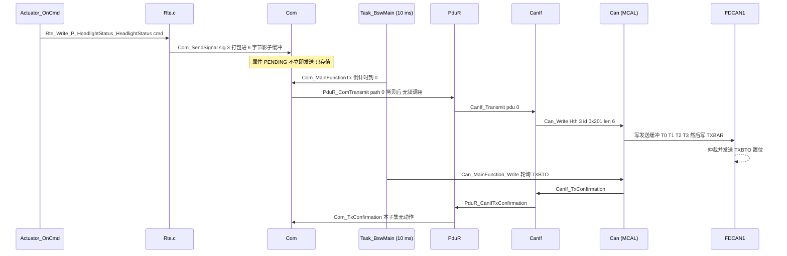
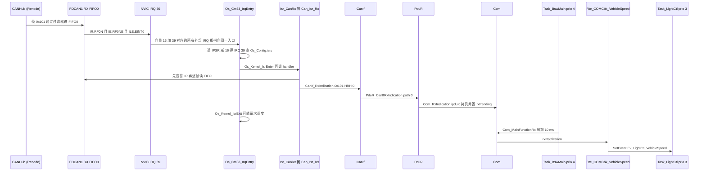

# 06 通信栈代码：从 `Rte_Write` 到总线，再从 FDCAN 中断回到 `SetEvent`

> 本章回答：(1) 一个 SWC 的 `Rte_Write_*` 调用，经过哪些函数、哪些 handle 转换、哪些寄存器写入，才变成 CAN 总线上的一帧？(2) 另一个 ECU 收到这一帧后，FDCAN 中断怎么经 OS 的 Cat2 ISR 分发器，一路爬回 `Rte_COMCbk_*` 和 `SetEvent`，让 SWC 的 Runnable 被唤醒？(3) 这一路上用到的 FDCAN 寄存器事实（`RXGFC` 的 LSS/LSE 位等）是怎么在 Renode 里验证出来的？换成 RH850 的 RS-CANFD 要改哪里？
> Prerequisite: [05 SWC 代码](05-swc-code.md)、[03 OS 代码](03-os-code.md)；理论基础 [docs/11 第 09 章 信号的一生](../11-classic-autosar-primer/09-life-of-a-signal.md)、[docs/05-can-stack/01 CanIf](../05-can-stack/01-canif.md)、[docs/04-can-mcal/10 Can_Write 实现](../04-can-mcal/10-can-write-implementation.md)、[docs/04-can-mcal/11 CAN RX 实现](../04-can-mcal/11-can-rx-implementation.md)、[docs/04-can-mcal/12 CAN 中断与 MainFunction 实现](../04-can-mcal/12-can-interrupt-implementation.md)。   Next: [07 启动追踪](07-startup-trace.md)
> 对应代码（路径均相对 `examples/mini_autosar_ecu/`）：`gen/LightEcu/Rte.c`、`bsw/com/Com.c`、`bsw/pdur/PduR.c`、`ecual/canif/CanIf.c`、`mcal/can/Can.c`、`mcal/can/Can_Hw_Stm32.c`、`os/port/cm33/Os_Port_Cm33.c`、`gen/LightEcu/{Com,PduR,CanIf,Can,Os}_Cfg.c`、`gen/LightEcu/Rte_Tasks.c`
> 对应规范（R25-11，页码为 PDF 页码，已用 grep 核对）：Com_SendSignal `SWS_Com_00197`（COM SWS p.105）、Com_ReceiveSignal `SWS_Com_00198`（p.107）、Com_RxIndication §8.4.2、Com_MainFunctionRx/Tx §8.5.1/§8.5.2；`PduR_<User:Up>Transmit` `SWS_PduR_00406`（PduR SWS p.86，模板化命名：本项目的 `PduR_ComTransmit` 即 User=Com 的实例）；`CanIf_Transmit` `SWS_CANIF_00005`（p.85）、`CanIf_RxIndication` `SWS_CANIF_00006`、`CanIf_TxConfirmation` `SWS_CANIF_00007`；`Can_Init` `SWS_Can_00223`（CAN Driver SWS p.56）、`Can_Write` `SWS_Can_00233`（p.74）、HTH 互斥/忙 `SWS_Can_00212`/`SWS_Can_00213`（p.74/p.75）。   深入阅读：[docs/04-can-mcal/05 CAN 中断](../04-can-mcal/05-can-interrupt.md)、[docs/04-can-mcal/07 HOH/HRH/HTH](../04-can-mcal/07-hoh-hrh-hth.md)、[docs/01-rh850/06 中断与异常](../01-rh850/06-interrupt-exception.md)

---

## 1. 本章要回答的问题

两条路径，两个方向，同一份 handle 表：

- **TX（LightEcu 发 0x201）**：`Rte_Write_P_HeadlightStatus_HeadlightStatus` → `Com_SendSignal`（打包） → `Com_MainFunctionTx`（定时） → `PduR_ComTransmit` → `CanIf_Transmit` → `Can_Write` → FDCAN 发送缓冲 + `TXBAR`。
- **RX（LightEcu 收 0x101）**：FDCAN RX FIFO0 → IRQ 39 → `Os_Cm33_IrqEntry` → `Isr_CanRx` → `Can_Isr_Rx` → `CanIf_RxIndication` → `PduR_CanIfRxIndication` → `Com_RxIndication`（DEFERRED：只拷贝并置位） → 10 ms 后 `Com_MainFunctionRx` → `Rte_COMCbk_VehicleSpeed` → `SetEvent(Task_LightCtl)`。

> `[Educational Implementation]` 这条链是项目里**最长**的一条垂直通路。本章每一跳都给 `路径:行号`、真实 UART 日志（带时间戳）和真实 GDB 回溯，你能把"代码里的函数调用"与"日志里的一行"一一对上。

---

## 2. 直觉理解：四次"换包装"

一个信号从 SWC 到总线，要换四次"包装"，每一层只认自己这一层的包装：

| 层 | 它认识的"东西" | 本项目的句柄 | 下一层是谁 |
|---|---|---|---|
| RTE | **数据元素**（`HeadlightStatus`，`uint8`） | `Rte_Write_P_HeadlightStatus_HeadlightStatus` | Com |
| Com | **信号**（位位置、位宽、字节序）→ **I-PDU**（6 字节的一块缓冲） | `ComConf_ComSignal_HeadlightStatus = 3`，`ComConf_ComIPdu_Ipdu_LightStatus_Tx = 3` | PduR |
| PduR | **路由路径**（只负责把 Com 的 PDU ID 换成下层的 PDU ID） | tx path 0：`comTxPduId=3 → canIfTxPduId=0` | CanIf |
| CanIf | **L-PDU**（CAN ID、DLC、HTH） | `CanIfTxPdu_LightStatus`：`canId=0x201, dlc=6, hth=3` | Can |
| Can（MCAL） | **硬件对象 HOH**（HTH）→ **FDCAN 发送缓冲元素** | `Hth=3` → TX buffer 0 | 硬件 |

`[AUTOSAR Standard]` 这就是 AUTOSAR 通信栈的核心设计：**每一层都有自己的 PDU ID 空间，层间用生成的配置表换算**。你在 `gdb_session.txt` 里看到的 `SignalId=3`、`ipdu=3`、`TxPduId=0`、`Hth=3` 看上去像巧合，其实都是配置表里的下标。

---

## 3. 全景：两张时序图

### 3.1 TX 路径



### 3.2 RX 路径



### 3.3 一张"句柄追踪表"

本项目 LightEcu 上，**同一帧**在每层的名字（数据来自 `gen/LightEcu/*_Cfg.[ch]`）：

| 方向 | CAN ID | Com 信号 | Com I-PDU | PduR 路径 | CanIf L-PDU | Can HOH | 处理方式 |
|---|---|---|---|---|---|---|---|
| TX | 0x201 | `HeadlightStatus`(3)、`OdometerDistance`(4) | `Ipdu_LightStatus_Tx`(3)，6 字节，PERIODIC 100 ms | tx 0 | tx pdu 0，dlc 6 | `Hth_LightStatus` = 3 | `gen/LightEcu/Com_Cfg.c:84-89` |
| RX | 0x101 | `VehicleSpeed`(0) | `Ipdu_VehicleSpeed_Rx`(0)，2 字节 | rx 0 | rx pdu 0 | `Hrh_VehicleSpeed` = 0 | **DEFERRED**，有通知 `Rte_COMCbk_VehicleSpeed`（`gen/LightEcu/Com_Cfg.c:66-71`） |
| RX | 0x301 | `AmbientLight`(1) | `Ipdu_AmbientLight_Rx`(1) | rx 1 | rx pdu 1 | `Hrh_AmbientLight` | **IMMEDIATE**，无通知（`:72-77`） |
| RX | 0x3F0 | `EcuModeRequest`(2) | `Ipdu_EcuModeReq_Rx`(2) | rx 2 | rx pdu 2 | `Hrh_EcuModeReq` | **IMMEDIATE**，无通知，BswM 轮询（`:78-83`） |

---

## 4. TX：逐跳走读

### 4.1 `Rte_Write` → `Com_SendSignal`

`Rte_Write_P_HeadlightStatus_HeadlightStatus`（`gen/LightEcu/Rte.c:169-172`）只是转手给内部的"sink"：

```c
static Std_ReturnType Rte_Sink_LightActuator_P_HeadlightStatus_HeadlightStatus(uint8 data)
{
    Std_ReturnType rc = RTE_E_OK;

    if (Rte_Started == FALSE)
    {
        return RTE_E_COM_STOPPED;
    }
    TRACE(TRACE_CAT_RTE, "WRITE P_HeadlightStatus_HeadlightStatus=%u", (unsigned)data);
    rc = Rte_MapComStatus(Com_SendSignal(ComConf_ComSignal_HeadlightStatus, &data));   /* inter-ECU: Com packs it into I-PDU Ipdu_LightStatus_Tx */
    return rc;
}
```

注意 `:113` 的 `Rte_MapComStatus`：**Com 的返回码**（`E_OK` / `COM_SERVICE_NOT_AVAILABLE` / `COM_BUSY`）被翻译成 **RTE 的返回码**（`RTE_E_OK` / `RTE_E_COM_STOPPED` / `RTE_E_LIMIT`，`gen/LightEcu/Rte.c:62-78`）。SWC 永远只看到 `RTE_E_*`。

### 4.2 `Com_SendSignal`：打包

```c
uint8 Com_SendSignal(Com_SignalIdType SignalId, const void *SignalDataPtr)
{
    const Com_SignalConfigType *sg;
    const Com_IpduConfigType   *ip;
    uint32 raw;
    if (com_status != COM_INIT) {
        (void)Det_ReportError(MINI_MODULE_COM, 0u, COM_API_SEND_SIGNAL, MINI_E_UNINIT);
        return COM_SERVICE_NOT_AVAILABLE;
    }
    if (SignalId >= com_cfg->numSignals) {
        (void)Det_ReportError(MINI_MODULE_COM, 0u, COM_API_SEND_SIGNAL, MINI_E_PARAM_INVALID);
        return COM_SERVICE_NOT_AVAILABLE;
    }
    if (SignalDataPtr == NULL_PTR) {
        (void)Det_ReportError(MINI_MODULE_COM, 0u, COM_API_SEND_SIGNAL, MINI_E_PARAM_POINTER);
        return COM_SERVICE_NOT_AVAILABLE;
    }
    sg = &com_cfg->signals[SignalId];
    ip = &com_cfg->ipdus[sg->ipduId];
    if (ip->direction != COM_PDU_TX) {
        (void)Det_ReportError(MINI_MODULE_COM, 0u, COM_API_SEND_SIGNAL, MINI_E_PARAM_INVALID);
        return COM_SERVICE_NOT_AVAILABLE;
    }
    if (!com_groupActive(ip->group)) {
        return COM_SERVICE_NOT_AVAILABLE;                     /* I-PDU group stopped */
    }
    raw = com_loadValue(sg->type, SignalDataPtr) & com_bitMask(sg->bitSize);
    SchM_Enter_Com_COM_EXCLUSIVE_AREA_0();
    com_packBits(ip->buffer, sg->bitPosition, sg->bitSize, sg->endianness, raw);
    SchM_Exit_Com_COM_EXCLUSIVE_AREA_0();

    if ((sg->transferProperty == COM_TRIGGERED) &&
        ((ip->txMode == COM_TX_MODE_DIRECT) || (ip->txMode == COM_TX_MODE_MIXED))) {
        if (com_transmit(sg->ipduId) != E_OK) {
            return COM_BUSY;                                  /* value is stored; a cyclic frame (if any) carries it */
        }
    }
    return E_OK;
}
```

要点：

- `:254-274`：一连串**状态/参数/方向/I-PDU 组**检查。任何一项不满足就返回 `COM_SERVICE_NOT_AVAILABLE`。`I-PDU group 停止`（`:272`）是 `RTE_E_COM_STOPPED` 的来源之一——EcuM/BswM 启动阶段 `Com_IpduGroupStart` 之前，所有 `Rte_Write` 都会得到这个返回码（见第 7 章）。
- `:275`：`com_loadValue(...) & com_bitMask(...)`：按信号**应用类型**取值，再按**位宽**截断。
- `:276-278`：**独占区**。影子缓冲被 Task、Cat2 ISR 共享，所以 `com_packBits` 在 `SchM_Enter_Com_COM_EXCLUSIVE_AREA_0()` 里（在 `bsw/schm/SchM.h` 里展开成 `SuspendOSInterrupts()`）。
- `:280-285`：**只有** `transferProperty == COM_TRIGGERED` 且 PDU 模式是 DIRECT/MIXED 才立即发。本项目所有信号都是 `COM_PENDING`（`gen/LightEcu/Com_Cfg.c:32,39,46,53,60`），所以 `Com_SendSignal` **只存值**。

`com_packBits`（`bsw/com/Com.c:52-72`）的小端打包：信号 LSB 在 `bitPosition`，逐位写入 `buf[p>>3]`。0x201 帧的布局：

| 信号 | `bitPosition` | `bitSize` | 字节 | 例（真实日志） |
|---|---|---|---|---|
| `HeadlightStatus` | 0 | 8 | byte0 | `02` |
| （空） | 8–15 | — | byte1 | `00` |
| `OdometerDistance` | 16 | 32 | byte2..5（小端） | `30 00 00 00` = 0x30 = 48 m |

对应真实日志（`artifacts/mini-autosar/renode/uart_b.log`）里的一行：

```text
[001910265] ECUB CAN   TX id=0x201 dlc=6 data=02 00 30 00 00 00
```

即 HeadlightStatus = 2（远光），里程 48 m。

### 4.3 `Com_MainFunctionTx`：周期发送

```c
void Com_MainFunctionTx(void)
{
    PduIdType i;
    uint16 period;
    if (com_status != COM_INIT) { return; }
    period = com_cfg->mainFunctionPeriodMs;
    for (i = 0u; (i < com_cfg->numIpdus) && (i < COM_NUM_IPDUS); i++) {
        const Com_IpduConfigType *ip = &com_cfg->ipdus[i];
        boolean periodic = (boolean)((ip->direction == COM_PDU_TX) &&
                                     ((ip->txMode == COM_TX_MODE_PERIODIC) || (ip->txMode == COM_TX_MODE_MIXED)));
        if (!periodic || !com_groupActive(ip->group)) { continue; }
        /* countdown model: send when it reached 0, reload, then age by one main-function period */
        if (com_txCountdownMs[i] == 0u) {
            if (com_transmit(i) == E_OK) {
                com_txCountdownMs[i] = ip->txPeriodMs;
            }                                                 /* else: stays 0 -> retried next cycle */
        }
        com_txCountdownMs[i] = (com_txCountdownMs[i] > period) ? (uint16)(com_txCountdownMs[i] - period) : 0u;
    }
}
```

倒计时模型：I-PDU `Ipdu_LightStatus_Tx` 的 `txPeriodMs=100`、`txOffsetMs=0`、`mainFunctionPeriodMs=10`（`gen/LightEcu/Com_Cfg.c:84-89,97`）。`Com_IpduGroupStart` 把计数器设成 `txOffsetMs`（`bsw/com/Com.c:225`），所以第一次 `Com_MainFunctionTx` 就发（计数器已是 0）——这就是为什么 0x201 的**第一帧**在 t=10240 µs 发出，内容全是**初始值 0**：

```text
[000010206] ECUB COM   TX ipdu=3 len=6
[000010221] ECUB PDUR  TX com=3 canif=0
[000010240] ECUB CAN   TX id=0x201 dlc=6 data=00 00 00 00 00 00
[000010265] ECUB CANIF TX pdu=0
```

（摘自 `uart_b.log`，第 50-53 行。）`com_transmit()`（`bsw/com/Com.c:153-169`）先**在独占区里拷贝**到栈上的 `tmp[]`，**出了锁**才调 `PduR_ComTransmit`——源码注释（`Com.c:19-20`）明确："The lock is NEVER held while calling out"。这是个好习惯：持锁时间受控，且不会在持锁时进入未知代码。

### 4.4 `PduR_ComTransmit` → `CanIf_Transmit`

PduR 这一跳极薄（`bsw/pdur/PduR.c:56-73`）：状态与参数检查后，用**配置表**把 Com 的 PDU ID 换成 CanIf 的 PDU ID，调 `CanIf_Transmit`：

```c
    if (id >= pdur_cfg->numTxPaths) {
        (void)Det_ReportError(MINI_MODULE_PDUR, 0u, PDUR_API_TRANSMIT, MINI_E_PARAM_INVALID);
        return E_NOT_OK;
    }
    TRACE(TRACE_CAT_PDUR, "TX com=%u canif=%u", (unsigned)pdur_cfg->txPaths[id].comTxPduId,
          (unsigned)pdur_cfg->txPaths[id].canIfTxPduId);
    return CanIf_Transmit(pdur_cfg->txPaths[id].canIfTxPduId, PduInfoPtr);
}
```

配置表 `gen/LightEcu/PduR_Cfg.c:17-19`：`{ .comTxPduId = ComConf_ComIPdu_Ipdu_LightStatus_Tx, .canIfTxPduId = CanIfConf_CanIfTxPduCfg_CanIfTxPdu_LightStatus }`。日志里的 `PDUR TX com=3 canif=0` 就是这一行的运行时影子。

> `[AUTOSAR Standard]` R25-11 把 PduR 的上层 API 改成模板化命名 `PduR_<User:Up>Transmit`（`SWS_PduR_00406`，PduR SWS p.86）；当 User 是 Com 时就是 `PduR_ComTransmit`。较老的资料里是 `PduR_Transmit` 之类，读旧代码时要注意。

`CanIf_Transmit`（`ecual/canif/CanIf.c:108-144`）做三件事：

1. **查表**：`TxPduId` → `p = &canif_cfg->txPdus[TxPduId]`（`:126`），拿到 `canId=0x201`、`dlc=6`、`hth=3`。
2. **检查**：长度不能超过配置 DLC（`:127-130`）；**控制器必须 STARTED**（`:131-133`），否则返回 `E_NOT_OK`（这是 `Com_MainFunctionTx` 里"失败后下个周期重试"的来源，`bsw/com/Com.c:384-387`）。
3. **组 `Can_PduType`** 调 `Can_Write(p->hth, &can)`（`:134-138`）。`can.swPduHandle = TxPduId`（`:134`）会在 TX 确认时原样回来。

### 4.5 `Can_Write`：HTH 与"忙"

```c
    if (can_state != CAN_CS_STARTED) {
        return CAN_NOT_OK;
    }

    SchM_Enter_Can_CAN_EXCLUSIVE_AREA_0();                 /* HTH "mutex" (SWS_Can_00212/00214): Can_Write vs. MainFunction */
    for (i = 0u; i < CAN_HW_TX_BUFFERS; i++) {
        if (can_tx[i].used && (can_tx[i].hth == Hth)) {    /* depth 1 per HTH: object busy, do not cancel (SWS_Can_00213) */
            SchM_Exit_Can_CAN_EXCLUSIVE_AREA_0();
            return CAN_BUSY;
        }
    }
    if (CanHw_TxRequest(PduInfo->id, PduInfo->length, PduInfo->sdu, &idx) == E_OK) {
        can_tx[idx].used        = TRUE;                    /* remember the L-PDU for the confirmation (SWS_Can_00276) */
        can_tx[idx].hth         = Hth;
        can_tx[idx].swPduHandle = PduInfo->swPduHandle;
        ret = CAN_OK;
    }                                                      /* else: all hardware buffers occupied -> CAN_BUSY */
    SchM_Exit_Can_CAN_EXCLUSIVE_AREA_0();

    if (ret == CAN_OK) {
        TRACE(TRACE_CAT_CAN, "TX id=0x%03x dlc=%u data=%B", (unsigned)PduInfo->id, (unsigned)PduInfo->length,
              PduInfo->sdu, (unsigned)PduInfo->length);
    }
    return ret;
}
```

- `:235`：`SchM_Enter_Can_CAN_EXCLUSIVE_AREA_0()` 是 HTH 的"互斥"（`SWS_Can_00212`，CAN Driver SWS p.74）。
- `:236-241`：**深度 1**：同一 HTH 上还有一帧在途就返回 `CAN_BUSY`，**不取消**在途的帧（`SWS_Can_00213`，p.75）。
- `:242-246`：调后端 `CanHw_TxRequest`，成功才登记 `can_tx[idx]`（含 `swPduHandle`，给确认用）。
- `:250-253`：成功才打 `CAN TX` trace——所以日志里 `CAN TX` 出现在 `PDUR TX` **之后**、`CANIF TX` **之前**（`CANIF TX pdu=%u` 是 `CanIf_Transmit` 在 `Can_Write` 返回 `CAN_OK` 后才打的，`ecual/canif/CanIf.c:139-141`）。这解释了日志里看起来"倒着"的顺序：**trace 是在调用返回后才打印的**。

### 4.6 FDCAN 寄存器：真正写硬件的地方

```c
Std_ReturnType CanHw_TxRequest(Can_IdType id, uint8 dlc, const uint8 *data, uint8 *bufIdx)
{
    uint32 fqs = Mmio_Read32(FD_TXFQS);
    uint32 idx;
    uint32 base;
    uint32 w0 = 0u;
    uint32 w1 = 0u;
    uint8  i;

    if ((fqs & (1u << 21)) != 0u) {                        /* TFQF: TX FIFO/queue full */
        return E_NOT_OK;
    }
    idx  = (fqs >> 16) & 0x1Fu;                            /* TFQPI: element the hardware wants to be filled next */
    if (idx >= CAN_HW_TX_BUFFERS) {
        return E_NOT_OK;
    }
    base = RAM_TXB_BASE + idx * RAM_TXB_ELEM;
    for (i = 0u; i < dlc; i++) {
        if (i < 4u) { w0 |= ((uint32)data[i]) << (8u * i); }
        else        { w1 |= ((uint32)data[i]) << (8u * (i - 4u)); }
    }
    Mmio_Write32(base + 0u,  (id & 0x7FFu) << 18);         /* T0: standard id, data frame, no ESI */
    Mmio_Write32(base + 4u,  ((uint32)dlc << 16) | (idx << 24));   /* T1: DLC, MM = buffer index, no FD/BRS/event */
    Mmio_Write32(base + 8u,  w0);
    Mmio_Write32(base + 12u, w1);
    Mmio_Write32(FD_TXBAR, 1u << idx);                     /* "add request": hardware arbitrates and sends */
    hw_txPendingMask |= (1u << idx);
    *bufIdx = (uint8)idx;
    return E_OK;
}
```

M_CAN IP 的发送缓冲元素（TX buffer element，每个 18 个字 = 72 字节，位于消息 RAM `0x4000AC00 + 0x278`，`mcal/can/Can_Hw_Stm32.c:28-32,78-79`）：

| 字 | 位 | 内容 | 本帧值（0x201，dlc 6，buffer 0） |
|---|---|---|---|
| T0 | `[28:18]` | 标准 ID（11 位） | `0x201 << 18 = 0x08040000` |
| T1 | `[19:16]` DLC，`[31:24]` MM（消息标记） | DLC=6，MM=buffer 索引 | `0x00060000` |
| T2/T3 | 数据字节 0–3 / 4–7，小端 | 数据 | `0x00000000`/`0x00000000` |

写完四个字后，**写 `TXBAR`**（`:206`，"add request"）——硬件开始仲裁、发送。注意 `:193` 用 `TXFQS.TFQPI` 作为"硬件希望你填的下一个元素"。

下面是在 Renode 里用 GDB 现场读出来的值（断点停在 `Can_Write` 里、`CanHw_TxRequest` 刚返回之后；方法见 §11 实验 2）：

```text
TXFQS = 0x00000003
TX buffer 0: T0=0x08040000 T1=0x00060000 T2=0x00000000 T3=0x00000000
TXBRP = 0x00000000 TXBTO = 0x00000001
```

`T0=0x08040000`、`T1=0x00060000` 与表中完全一致。`TXBRP=0`（无待发）、`TXBTO=1`（buffer 0 已发送）说明 Renode 的 FDCAN 模型在 `TXBAR` 写入的同一时刻就把帧推给了 CANHub。`TXFQS=3` 表示 3 个 TX 元素又都空闲了。

### 4.7 TX 确认：轮询

`Task_BswMain` 的第一个调用是 `Can_MainFunction_Write()`（`gen/LightEcu/Rte_Tasks.c:63`）。它扫描 `can_tx[]`，对已完成的缓冲调 `CanHw_TxIsDone`（读 `TXBRP`/`TXBTO`，`mcal/can/Can_Hw_Stm32.c:212-221`），然后 `CanIf_TxConfirmation(handle)` → `PduR_CanIfTxConfirmation` → `Com_TxConfirmation`（本子集无动作，`bsw/com/Com.c:428-440`）。注意 `mcal/can/Can.c:323` 在上调之前先 `can_tx[i].used = FALSE`：**先释放 HTH、再回调**，因为回调里 CanIf 可能马上再发。

### 4.8 一次真实的 GDB 回溯（TX）

`artifacts/mini-autosar/gdb_session.txt` 第 8 节在 `Can_Write` 上停下，回溯如下（已省略路径前缀 `D:\side_project\rh850\examples\mini_autosar_ecu\`，其他字符与文件一致）：

```text
#0  Can_Write (Hth=3, PduInfo=PduInfo@entry=0x20000d9c <Os_Stack_Task_BswMain+908>) at mcal\can\Can.c:208
#1  0x08000f08 in CanIf_Transmit (TxPduId=0, PduInfoPtr=PduInfoPtr@entry=0x20000dc4 <Os_Stack_Task_BswMain+948>) at ecual\canif\CanIf.c:138
#2  0x08000d5c in PduR_ComTransmit (id=<optimized out>, PduInfoPtr=PduInfoPtr@entry=0x20000dc4 <Os_Stack_Task_BswMain+948>) at bsw\pdur\PduR.c:72
#3  0x080005be in com_transmit (ipdu=3) at bsw\com\Com.c:168
#4  0x0800099c in Com_MainFunctionTx () at bsw\com\Com.c:384
#5  0x08001400 in Os_Task_Task_BswMain () at gen\LightEcu\Rte_Tasks.c:65
```

自底向上读：`Os_Task_Task_BswMain`（`Rte_Tasks.c:65`，即 `Com_MainFunctionTx()`）→ `Com_MainFunctionTx`（`Com.c:384`）→ `com_transmit`（`Com.c:168`）→ `PduR_ComTransmit`（`PduR.c:72`）→ `CanIf_Transmit`（`CanIf.c:138`）→ `Can_Write`。**每一行的"行号"都是上面 §4 列的调用点**。

---

## 5. 总线：Renode 的 CANHub

两台 ECU 并不互相知道对方存在。它们只是各自的 FDCAN1 外设连到了同一个 `CANHub`（`target/renode/mini_autosar_2ecu.resc:10-29`）：

```text
emulation SetGlobalQuantum "0.0001"
emulation CreateCANHub "canHub"

mach create "ECU_A"
machine LoadPlatformDescription @platforms/boards/ramn.repl
sysbus LoadELF $elf_a
sysbus.usart1 CreateFileBackend $uart_a true
connector Connect sysbus.fdcan1 canHub

mach create "ECU_B"
machine LoadPlatformDescription @platforms/boards/ramn.repl
sysbus LoadELF $elf_b
sysbus.usart1 CreateFileBackend $uart_b true
connector Connect sysbus.fdcan1 canHub

mach create "REST"
machine LoadPlatformDescription @platforms/boards/ramn.repl
sysbus LoadELF $elf_rest
sysbus.usart1 CreateFileBackend $uart_rest true
connector Connect sysbus.fdcan1 canHub
```

- `emulation CreateCANHub "canHub"`：一条虚拟总线，把任一接入者发出的帧**广播**给其他接入者。
- `connector Connect sysbus.fdcan1 canHub`：把这台机器的 FDCAN1 接到总线。
- `emulation SetGlobalQuantum "0.0001"`：三台机器共用 100 µs 的同步量子，决定了跨机器时间戳的精度上限。

没有连接 hub 的单机运行时，Renode 会在日志里警告：`fdcan1: Attempted to send CAN frame while not connected to a CAN network`（我在单机 Renode 里跑 LightEcu 25 ms 时确实看到了它）——这是"CAN 帧发不出去"的最快诊断。

**一个必须诚实说的现象：开机瞬间发出的帧会丢。** `uart_rest.log` 的前两行：

```text
[000000040] REST CAN   TX id=0x301 dlc=1 data=c8
[000003002] REST CAN   TX id=0x3f0 dlc=1 data=00
```

REST 节点在 t=40 µs 就发了 0x301，但 LightEcu 此时的 CAN 控制器还在 `STOPPED`（`BSWM ACTION Can_Init` 的日志行出现在 t=108 µs，控制器 STARTED 的 `CANIF MODE ctrl=0 mode=1` 在 t=331 µs，见第 7 章日志），所以那一帧**没有被接收**——LightEcu 的第一条 `CAN RX` 是 0x3F0（`uart_b.log` 里 t=2917 µs），0x301 要等 100 ms 周期的下一次（t≈100 ms）。这和真实总线完全一致：**控制器没进入 operating 状态就收不到帧**。

> **跨机器时间戳的陷阱**：LightEcu 在 t=230002 µs 进入 `Isr_CanRx` 处理 0x101，而 SensorEcu 的 `CAN TX id=0x101` trace 在 t=230092 µs。接收"早于"发送，是因为**每台机器的时间零点是自己的 `StartOS`（SysTick 启动）时刻**，而且 A 的 trace 是在 `Can_Write` 把帧交给硬件**之后**才逐字符从 UART 打出来的（`mcal/can/Can.c:250-253`）。**不要用跨机器的时间戳做精确因果判断**；同一台机器内部的行序才是因果序。

---

## 6. RX：逐跳走读

下面这段是同一个 0x101 帧在 SensorEcu 与 LightEcu 两份 UART 日志里的"一生"（µs 时间戳每次运行有轻微抖动，请看行序）（`uart_a.log` 第 255-262 行，`uart_b.log` 第 378-392 行）：

SensorEcu 侧（周期发送）：

```text
[000230017] ECUA OS    ALARM Alarm_Swc10ms
[000230037] ECUA OS    TASK_START Task_BswMain prio=3
[000230059] ECUA COM   TX ipdu=0 len=2
[000230075] ECUA PDUR  TX com=0 canif=0
[000230092] ECUA CAN   TX id=0x101 dlc=2 data=1d 00
[000230113] ECUA CANIF TX pdu=0
[000230120] ECUA OS    TASK_END Task_BswMain
[000230137] ECUA OS    TASK_START Task_Swc10ms prio=2
```

LightEcu 侧（中断接收 → 通知 → 事件）：

```text
[000230002] ECUB OS    ALARM Alarm_BswMain
[000230002] ECUB OS    ISR_ENTER Isr_CanRx
[000230027] ECUB CAN   RX id=0x101 dlc=2 data=1d 00
[000230047] ECUB CANIF RX pdu=0
[000230067] ECUB PDUR  RX canif=0 com=0
[000230067] ECUB COM   RX ipdu=0 len=2
[000230102] ECUB OS    ISR_EXIT Isr_CanRx
[000230102] ECUB OS    TASK_START Task_BswMain prio=4
[000230144] ECUB COM   NOTIFY sig=0
[000230157] ECUB RTE   TRIGGER DRE_LightCtl_VehicleSpeed -> Task_LightCtl
[000230184] ECUB OS    EVENT_SET Task_LightCtl mask=0x2
[000230213] ECUB OS    TASK_END Task_BswMain
[000230234] ECUB RTE   CALL R_Odometer_UpdateSpeed
[000230255] ECUB OS    TASK_WAIT Task_LightCtl mask=0x7
[000240002] ECUB OS    ALARM Alarm_BswMain
```

### 6.1 中断入口：所有外部 IRQ → 同一个 C 函数

向量表里 IRQ 0–108 全部指向 `Os_Cm33_IrqEntry`（`target/stm32l552/startup/startup.c:74`，GCC 范围初始化 `[16 ... NUM_VECTORS - 1u] = Os_Cm33_IrqEntry`）。它读 `IPSR` 得到当前异常号，减 16 得 IRQ 号，在 `Os_Config.isrs[]` 里查：

```c
MINI_CODE_FAST void Os_Cm33_IrqEntry(void)
{
    uint32 ipsr;
    uint32 irq;
    uint8 i;

    __asm volatile ("mrs %0, ipsr" : "=r" (ipsr));
    irq = ipsr - 16u;
    for (i = 0u; i < Os_Config.numIsrs; i++) {
        if (Os_Config.isrs[i].irqNumber == irq) {
            Os_Kernel_IsrEnter((ISRType)i);
            Os_Config.isrs[i].handler();
            Os_Kernel_IsrExit();                        /* may pend PendSV: the switch happens after the last ISR ends */
            return;
        }
    }
    /* No handler configured for this interrupt: switch the line off, otherwise it would fire forever. */
    NVIC_ICER(irq >> 5) = (1uL << (irq & 31u));
    TRACE(TRACE_CAT_OS, "ERROR spurious irq=%u", (unsigned)irq);
}
```

配置表（`gen/LightEcu/Os_Cfg.c:117-120`）：`{ .name = "Isr_CanRx", .handler = Os_Isr_Isr_CanRx, .irqNumber = 39u, .nvicPriority = 0x40u }`。IRQ 39 = STM32L552 的 `FDCAN1_IT0`（Renode 的 `ramn.repl` 里 `fdcan1: Int0 -> nvic@39`，见 §10）。`ISR_ENTER Isr_CanRx` / `ISR_EXIT Isr_CanRx` 两行日志分别来自 `Os_Kernel_IsrEnter`（`os/src/Os_Core.c:288`）与 `Os_Kernel_IsrExit`（`:309`）。

GDB 里读到的 IPSR 是 `0x37`（= 55 = 16 + 39），`Os_IsrDepth = 1`（现场数据见 §6.6）。

### 6.2 ISR 体 → 驱动

`Isr_CanRx` 的**函数体**是生成的（`gen/LightEcu/Rte_Tasks.c:136-139`）：

```c
MINI_CODE_FAST ISR(Isr_CanRx)
{
    Can_Isr_Rx();
}
```

`MINI_CODE_FAST` 把它放进 `.text.fast`（见第 8 章）。它只转发给驱动的 ISR 体（`mcal/can/Can.c:362-369`）：

```c
void Can_Isr_Rx(void)                                      /* body of the Cat2 ISR bound to FDCAN1_IT0 (IRQ 39) */
{
    if (can_cfg == NULL_PTR) {
        return;
    }
    CanHw_RxIrqAck();                                      /* ack first: a frame arriving while draining raises the line again */
    can_rx_drain();
}
```

**先应答（`CanHw_RxIrqAck`，写 `IR` 清标志），再排空 FIFO**——这个顺序很重要：如果先读 FIFO 再清标志，在读和清之间新到的帧会丢中断；如果先清标志，再来一帧会重新拉起中断线，保证不丢。（RH850 上有同样的原则，见 §9。）

### 6.3 `can_rx_drain`：FIFO → 帧 → HRH → CanIf

```c
static void can_rx_drain(void)
{
    CanHw_FrameType f;
    uint32 lost;
    while (CanHw_RxFetch(&f)) {
        const Can_HohConfigType *h = NULL_PTR;
        uint8 i;
        for (i = 0u; i < can_cfg->numHoh; i++) {            /* software repeat of the hardware filter: which HRH is it? */
            const Can_HohConfigType *c = &can_cfg->hoh[i];
            if ((c->type == CAN_HOH_RECEIVE) && (((f.id ^ c->canId) & c->filterMask) == 0u)) {
                h = c;
                break;
            }
        }
        if (h == NULL_PTR) {
            continue;                                      /* not for us (hardware filter should have rejected it) */
        }
        {
            Can_HwType  mb;
            PduInfoType pdu;
            TRACE(TRACE_CAT_CAN, "RX id=0x%03x dlc=%u data=%B", (unsigned)f.id, (unsigned)f.dlc, f.data, (unsigned)f.dlc);
            mb.CanId        = f.id;
            mb.Hoh          = h->hoh;
            mb.ControllerId = CAN_CONTROLLER_ID;
            pdu.SduDataPtr  = f.data;
            pdu.MetaDataPtr = NULL_PTR;
            pdu.SduLength   = f.dlc;
            CanIf_RxIndication(&mb, &pdu);                 /* may run in ISR context: CanIf only passes the data on */
        }
    }
    lost = CanHw_GetRxLostCount();
    if (lost != can_lostReported) {                        /* FIFO overrun in the meantime: runtime error CAN_E_DATALOST */
        can_lostReported = lost;
        (void)Det_ReportRuntimeError(MINI_MODULE_CAN, 0u, CAN_SID_MAINFN_READ, CAN_E_DATALOST);
    }
}
```

- `:97`：`CanHw_RxFetch` 逐帧读（`mcal/can/Can_Hw_Stm32.c:223-253`）：读 `RXF0S` 判空（`F0FL`），取 `F0GI`（get index）定位元素，读四个字，**写 `RXF0A` 把元素还给硬件**。
- `:100-106`：**软件重复一遍硬件过滤**：用 `(id ^ canId) & filterMask == 0` 找到 HRH。这是因为 M_CAN 的 FIFO 元素里没有"命中了哪条过滤规则"的标签，而 RH850 的 RS-CANFD 有（`GAFLPTR` label，见 §9）。
- `:113`：`CAN RX` trace。
- `:114-120`：组 `Can_HwType`（`CanId`、`Hoh`、`ControllerId`）和 `PduInfoType`，调 `CanIf_RxIndication`。
- `:123-127`：硬件丢帧计数变化 → `Det_ReportRuntimeError(CAN_E_DATALOST)`（对应 `docs/04-can-mcal/11` 里讲的 `RFMLT`）。

### 6.4 CanIf → PduR → Com：ISR 里能做什么

`CanIf_RxIndication`（`ecual/canif/CanIf.c:160-193`）用 `canId` 和 `hrh` **精确匹配**配置的 L-PDU（`:176-178`），检查 DLC（`:180-183`），然后 `PduR_CanIfRxIndication(p->upperPduId, &up)`（`:188`）。PduR（`bsw/pdur/PduR.c:75-91`）查表 → `Com_RxIndication`。

`Com_RxIndication`（`bsw/com/Com.c:394-426`）是 ISR 上下文里**唯一**做实事的地方：

```c
    ip = &com_cfg->ipdus[RxPduId];
    if (!com_groupActive(ip->group)) {
        return;                                               /* stopped group: indication is dropped silently */
    }
    if (PduInfoPtr->SduLength < ip->length) {
        (void)Det_ReportRuntimeError(MINI_MODULE_COM, 0u, COM_API_RX_INDICATION, MINI_E_PARAM_INVALID);
        return;
    }
    SchM_Enter_Com_COM_EXCLUSIVE_AREA_0();
    for (i = 0u; i < ip->length; i++) { ip->buffer[i] = PduInfoPtr->SduDataPtr[i]; }
    if (ip->rxProcessing == COM_RX_DEFERRED) { com_rxPending[RxPduId] = TRUE; }
    SchM_Exit_Com_COM_EXCLUSIVE_AREA_0();
    TRACE(TRACE_CAT_COM, "RX ipdu=%u len=%u", (unsigned)RxPduId, (unsigned)ip->length);
    if (ip->rxProcessing == COM_RX_IMMEDIATE) {
        com_notify(RxPduId);                                  /* ISR context (Cat2): callbacks must be ISR-safe */
    }
```

- `:418-421`：独占区内把 PDU 拷进 I-PDU 缓冲；若是 **DEFERRED**，只置 `com_rxPending[RxPduId]`。
- `:423-425`：若是 **IMMEDIATE**，当场 `com_notify`——**在 ISR 里**调用通知回调。所以 IMMEDIATE 的回调必须是 ISR 安全的（本项目 0x301/0x3F0 没有通知，所以没问题）。

为什么 0x101 选 DEFERRED？因为它的通知是 `Rte_COMCbk_VehicleSpeed`，里面要 `SetEvent`；在 Cat2 ISR 里调 `SetEvent` 技术上允许（见 DESIGN §6.6），但把"信号被应用感知"的时间点推迟到任务上下文（`Com_MainFunctionRx`），能让 ISR 更短，也演示了 `Com_MainFunctionRx` 的作用。**代价**：从帧到达到 `SetEvent` 最多延迟一个 10 ms 周期——日志里 ISR 在 t=230016 µs，`COM NOTIFY` 在 t=230118 µs，只差 0.1 ms，是因为 `Task_BswMain` 的 `Alarm_BswMain` 恰好在 t=230002 µs 触发。最坏情况是帧刚到、BswMain 刚跑完，要等 ~10 ms。

### 6.5 通知 → `SetEvent`

`Task_BswMain` 的第二个调用是 `Com_MainFunctionRx()`（`gen/LightEcu/Rte_Tasks.c:64`）：

```c
void Com_MainFunctionRx(void)
{
    PduIdType i;
    if (com_status != COM_INIT) { return; }
    for (i = 0u; (i < com_cfg->numIpdus) && (i < COM_NUM_IPDUS); i++) {
        boolean pending;
        SchM_Enter_Com_COM_EXCLUSIVE_AREA_0();                /* the flag is written by the RX ISR */
        pending = com_rxPending[i];
        com_rxPending[i] = FALSE;
        SchM_Exit_Com_COM_EXCLUSIVE_AREA_0();
        if (pending) {
            com_notify(i);                                    /* task context: may call SetEvent etc. */
        }
    }
}
```

`com_notify`（`bsw/com/Com.c:172-182`）遍历该 I-PDU 的信号，调 `sg->rxNotification()`，也就是 `Rte_COMCbk_VehicleSpeed`（`gen/LightEcu/Rte.c:279-288`），里面 `SetEvent(Task_LightCtl, Ev_LightCtl_VehicleSpeed)`（`:287`）。`Task_LightCtl` 的优先级(3)低于正在运行的 `Task_BswMain`(4)，所以它变 READY 后要等 BswMain 结束才跑——日志里 `EVENT_SET`(t=230184) 之后是 `TASK_END Task_BswMain`(230213)，再是 `RTE CALL R_Odometer_UpdateSpeed`(230234)：这就是 `LightCtl_OnSpeed` 里 `Rte_Call_R_Odometer_UpdateSpeed` 的第一行 trace。

### 6.6 一次真实的 GDB 现场（RX）

`gdb_session.txt` 目前只覆盖 TX。RX 路径我用同一套 `tools/gdb/mini_autosar.gdb` + 三机场景（`target/renode/debug_scenario.resc`，GDB 挂在 ECU_B）现场跑了一次（脚本见 §11 实验 2）。**在 `CanIf_RxIndication` 上停下（条件 `Mailbox->CanId == 0x101`）**：

```text
Breakpoint 1, CanIf_RxIndication (Mailbox=Mailbox@entry=0x2000278c, PduInfoPtr=PduInfoPtr@entry=0x20002794) at ecual\canif\CanIf.c:163
163	    if (canif_cfg == NULL_PTR) {
#0  CanIf_RxIndication (Mailbox=Mailbox@entry=0x2000278c, PduInfoPtr=PduInfoPtr@entry=0x20002794) at ecual\canif\CanIf.c:163
#1  0x08001644 in can_rx_drain () at mcal\can\Can.c:120
#2  0x080002cc in Os_Cm33_IrqEntry () at os\port\cm33\Os_Port_Cm33.c:314
#3  <signal handler called>
```

注意：

- 回溯里没有 `Os_Isr_Isr_CanRx` 和 `Can_Isr_Rx` 两帧：`-Os` 下 `Os_Isr_Isr_CanRx` 是一条 `b Can_Isr_Rx` 的**尾调用**，`Can_Isr_Rx` 又尾调用了 `can_rx_drain`（地址 `0x080001f4` 的 `Os_Isr_Isr_CanRx` 只有 4 字节，见 `artifacts/mini-autosar/target/LightEcu/LightEcu.map` 的 `.text.fast` 条目）。
- `<signal handler called>` 是 GDB 对 Cortex-M **异常栈帧**的称呼，它后面本应是被中断的任务（此时是 idle）。Renode 的 GDB stub 此时还会打印 `warning: Could not fetch required XPSR content. Further unwinding is impossible.`——无害。
- 异常入口（`IPSR`）、FDCAN 寄存器现场：

```text
Mailbox: CanId=0x101 Hoh=0  PduInfo: len=2 data=00 00
IPSR = 0x37  Os_IsrDepth = 1
CCCR  = 0x00000000
NBTP  = 0x02090c01
IE    = 0x00000001
ILE   = 0x00000001
RXGFC = 0x0003002b
RXF0S = 0x00020200
std filter[0..2] = 0x890107ff 0x8b0107ff 0x8bf007ff
```

解读：`Mailbox: CanId=0x101 Hoh=0`——HRH 0 就是 `Hrh_VehicleSpeed`。`IPSR=0x37=55=16+39`。`IE=ILE=1`：RX FIFO0 新消息中断已使能，且中断线 0 已打开。`RXGFC=0x0003002b`，`std filter[0..2]` 是三条标准过滤器（见 §7）。

沿着调用链继续往下，`Com_RxIndication` 之后，**任务上下文里**的回溯（断点在 `Rte_COMCbk_VehicleSpeed`）：

```text
#0  Rte_COMCbk_VehicleSpeed () at gen\LightEcu\Rte.c:281
#1  0x08000566 in com_notify (ipdu=ipdu@entry=0) at bsw\com\Com.c:179
#2  0x08000922 in Com_MainFunctionRx () at bsw\com\Com.c:366
#3  0x080013fc in Os_Task_Task_BswMain () at gen\LightEcu\Rte_Tasks.c:64
#4  0x0800202c in Os_Cm33_IdleEntry () at os\port\cm33\Os_Port_Cm33.c:86
Backtrace stopped: previous frame identical to this frame (corrupt stack?)
```

和 `SetEvent` 被调用的瞬间：

```text
#0  SetEvent (TaskID=2 '\002', Mask=2) at os\src\Os_Event.c:48
#1  0x08000566 in com_notify (ipdu=ipdu@entry=0) at bsw\com\Com.c:179
#2  0x08000922 in Com_MainFunctionRx () at bsw\com\Com.c:366
#3  0x080013fc in Os_Task_Task_BswMain () at gen\LightEcu\Rte_Tasks.c:64
```

`SetEvent (TaskID=2, Mask=2)`：`TaskID=2` 是 `Task_LightCtl`（`gen/LightEcu/Os_Cfg.h:34`），`Mask=2` 是 `Ev_LightCtl_VehicleSpeed`（`:46`）。从 ISR 里的"第一个字节落地"到 `SetEvent`，我们走过了 **10 个函数、2 种上下文（ISR → Task）**。

---

## 7. FDCAN 寄存器事实：Renode 里验证过的与没验证过的

`mcal/can/Can_Hw_Stm32.c:10-41` 的文件头注释是这部分的"事实登记表"，用 `[V]`（在 Renode 1.17.0 里实测验证）和 `[R]`（只来自参考手册，Renode 没建模或未测，**对真实芯片是未验证的**）两种标记。重点：

| 寄存器 | 偏移 | 本驱动写入 | 事实 | 状态 |
|---|---|---|---|---|
| `CCCR` | 0x18 | INIT→CCE→清 FDOE/BRSE | 复位值 `0x1`；INIT 位 0、CCE 位 1、FDOE 位 8；INIT/CCE 握手在 Renode 里是**即时**的 | `[V]` |
| `NBTP` | 0x1C | 16 TQ，采样点 87.5% | 复位值 `0x06000A03`；字段都存"值-1"；Renode 接受任意值 | `[V]` |
| `RXGFC` | 0x80 | `(nf<<16) \| ANFS=2 \| ANFE=2 \| RRFS \| RRFE` | **LSS = bits[20:16]**（标准过滤器数量），**LSE = bits[27:24]**（扩展过滤器数量） | `[V]` |
| `IE` / `ILE` | 0x54 / 0x5C | `RF0NE` / `EINT0` | RX FIFO0 新消息中断 → 线 0 → IRQ 39 | `[V]` |
| `RXF0S` / `RXF0A` | 0x90 / 0x94 | 读 `F0FL/F0GI`；写 get index 应答 | 填充/get/put 索引 | `[V]` |
| `TXFQS`/`TXBAR`/`TXBTO`/`TXBRP` | 0xC4/0xCC/0xD4/0xC8 | TX 流程 | 复位 `TXFQS=3`；`TXBAR` 加请求；`TXBTO` 发送完成 | `[V]` |
| `RCC_APB1ENR1.FDCANEN`、`RCC_CCIPR1.FDCANSEL` | RCC 0x58 / 0x88 | 使能时钟、选 PLL "Q" | Renode 的 RCC **没实现**这两个寄存器（读回 0） | `[R]` |

### 7.1 `RXGFC` 的 LSS/LSE：一个"静默丢帧"的坑

`mcal/can/Can_Hw_Stm32.c:145-154`：

```c
    /* One classic standard-id filter (id + mask, store in RX FIFO0) per receive HOH: the "CanHardwareObject" of AUTOSAR. */
    for (i = 0u; (i < cfg->numHoh) && (nf < RAM_SIDF_MAX); i++) {
        if (cfg->hoh[i].type == CAN_HOH_RECEIVE) {
            Mmio_Write32(RAM_SIDF_BASE + 4u * nf,
                         (2u << 30) | (1u << 27) | ((cfg->hoh[i].canId & 0x7FFu) << 16) | (cfg->hoh[i].filterMask & 0x7FFu));
            nf++;
        }
    }
    /* RXGFC: list size, non matching std/ext frames rejected (ANFS = ANFE = 2), remote frames rejected, FIFO0 blocking mode */
    Mmio_Write32(FD_RXGFC, (nf << 16) | (2u << 4) | (2u << 2) | (1u << 1) | (1u << 0));
```

`:154` 的 `(nf << 16)` 是**标准过滤器个数（LSS）**，位置是 `[20:16]`；扩展过滤器个数（LSE）在 `[27:24]`。项目文件头记录了一次失败的历史：**第一次猜反了**，把标准过滤器数量填进了 bit 24 起的字段，结果 Renode 的模型**静默地丢弃了所有帧**（没有任何报错），直到用 Renode 的寄存器转储才看出 `LSS` 在 16–20（`mcal/can/Can_Hw_Stm32.c:21-23`）。`target/renode/probe/probe.c:127` 里还保留着当时那句猜错的写法 `(1u << 24)  /* ANFS/ANFE reject, LSS=1 */`——它只验证了"寄存器可写"，没验证字段含义。

**我把这件事现场复现了一次**（在 `mcal/can/Can_Hw_Stm32.c` 的**拷贝**里把 `(nf << 16)` 改成 `(nf << 24)`，只重编这一个目标文件并重新链接，其余目标文件用现成的，然后跑同一个三机场景 100 ms）：

| 构建 | LightEcu 的 `CAN   RX` 行数（前 100 ms） | LightEcu 的 `CAN   TX` 行数 |
|---|---|---|
| 正常（`artifacts/mini-autosar/renode/uart_b.log`） | **7** | 有 |
| `RXGFC` 的数量字段写到 bit 24（拷贝） | **0** | 1（`TX id=0x201`，发送不受影响） |

同时 SensorEcu 和 REST 仍在不断发帧（`uart_rest.log` 里 `CAN   RX id=0x101` / `0x201` 都有）。**发送正常、接收全丢、没有任何错误输出**——这类"静默失败"是写寄存器驱动时最难排查的一类。验证办法：

用 Renode 的外设寄存器转储（`sysbus.fdcan1 DumpDoubleWordRegister 0x80`，LightEcu 正常运行 30 ms 后）：

```text
|RRFE    |0    |True  |           |
|RRFS    |1    |True  |           |
|ANFE    |2-3  |Reject|           |
|ANFS    |4-5  |Reject|           |
|LSS     |16-20|0x3   |           |
|LSE     |24-27|0x0   |           |
```

`sysbus ReadDoubleWord 0x4000A480` 同时返回 `0x0003002B`。解码：`LSS=3`（0x30000）、`ANFS=ANFE=2`（拒绝不匹配的帧，`0x20 + 0x08`）、`RRFS=RRFE=1`（拒绝远程帧，`0x3`）→ `0x3002B`。

### 7.2 过滤器元素与发送元素的位布局

GDB 读出的三个标准过滤器字（`std filter[0..2]`）：`0x890107ff`、`0x8b0107ff`、`0x8bf007ff`。按 M_CAN 标准过滤器元素格式（`mcal/can/Can_Hw_Stm32.c:30-31`）：

| 位 | 含义 | `0x890107ff` |
|---|---|---|
| `[31:30]` SFT | 过滤类型：`10b` = 经典（SFID1 为 ID，SFID2 为掩码） | `10b` |
| `[29:27]` SFEC | 命中后动作：`001b` = 存入 RX FIFO0 | `001b` |
| `[26:16]` SFID1 | 过滤 ID | `0x101` |
| `[10:0]` SFID2 | 掩码 | `0x7FF` |

三条分别是 `0x101`、`0x301`、`0x3F0`，掩码全是 `0x7FF`（精确匹配）——正是 `gen/LightEcu/Can_Cfg.c:17-19` 里三个 HRH 的 `canId/filterMask`。写入这些字的代码是 `mcal/can/Can_Hw_Stm32.c:146-152`。

`ANFS = ANFE = 2`（`:154`）意味着**不匹配过滤器的帧被拒绝**，所以 FIFO0 里永远只有 0x101/0x301/0x3F0。`can_rx_drain` 的软件二次过滤（`mcal/can/Can.c:100-106`）在这个配置下理论上总命中，它是 AUTOSAR "HRH 由驱动判断"的教学演示，不是防御。

### 7.3 `[R]` 未验证项的含义

`FDCANEN`、`FDCANSEL`、`CKDIV` 等时钟相关寄存器在 Renode 里读回 0，写进去也没有任何效果，所以**即便你把时钟配错，仿真里 CAN 仍然能跑**。这是仿真器的**盲区**：真实 STM32L552 上这几个寄存器配错会让 FDCAN 根本不动。`Can_Hw_Stm32.c:33-36` 对此有明确声明。这也是本项目 `Mcu`/`Can` 驱动中**必须在真实硬件上重新验证**的部分。

---

## 8. 对照 host 构建

同一份 `Can.c`（硬件无关半边），host 上的后端是 `sim/host/Can_Hw_Sim.c`；"总线"不是 CANHub，而是文本文件：`SensorEcu.exe` 把每个发出的帧写进 `ecuA_can_tx.txt`（格式 `时间µs id dlc 字节…`），`LightEcu.exe` 用 `--can-rx-script` 读它并在虚拟时间到达时注入 RX FIFO（`DESIGN.md` §10.3）。例如 `artifacts/mini-autosar/host/ecuA_can_tx.txt` 的头几行：

```text
# time_us id dlc data...   (SimCan TX log = RX script format)
10000 101 2 00 00
30000 101 2 00 00
50000 101 2 00 00
70000 101 2 00 00
```

host 与 target 在 `Com_RxIndication` **以上**逐字节相同；以下的差别只有后端寄存器访问方式——这正是 MCAL 分层的价值。host 上 Cat2 ISR 在固定点递送（不是真异步），所以 host 日志里同一毫秒内所有 trace 时间戳相同（`artifacts/mini-autosar/host/ecuB.log` 里 `ISR_ENTER` 紧跟 `RESTBUS TX` 都是 `[000001000]`）。

---

## 9. 对照 RH850：RS-CANFD 要改什么

`[RH850 Hardware]` 本节的 RH850 事实均引自本仓库已有的章节（它们引用硬件手册 `r01uh0585ej0120`，HW-E），本章不另做硬件断言。**驱动的硬件无关半边（`Can.c` 的 API、HOH 管理、状态机、CanIf/PduR/Com 以上全部）不变，只换 `Can_Hw_*.c` 后端**。

| 动作 | 本项目（M_CAN / STM32L552） | RH850 RS-CANFD（P1M-E） | 详细章节 |
|---|---|---|---|
| 初始化进入配置模式 | `CCCR.INIT` + `CCCR.CCE` | 全局复位→全局操作 / 通道复位→通信，`GCTR`/`CmCTR.CHMDC`；`GSTS.GRAMINIT` 期间不能配置 | [06 CAN 控制器初始化](../04-can-mcal/06-can-controller-init.md) |
| 位时序 | `NBTP`（值-1） | `CmNCFG`（NBRP/NTSEG1/NTSEG2/NSJW） | [03 CAN 时钟与位时序](../04-can-mcal/03-can-clock-bit-timing.md) |
| 接收过滤 | 标准过滤器元素（消息 RAM）+ `RXGFC` | 接收规则表 AFL：`GAFLIDj / GAFLMj / GAFLP0_j / GAFLP1_j`，每通道规则数 `GAFLCFG0`；规则分页写 | [07 HOH/HRH/HTH](../04-can-mcal/07-hoh-hrh-hth.md) §7.2 |
| 命中规则 → HRH | **无标签**，驱动软件再判一遍（本项目 `Can.c:100-106`） | 规则里的 `GAFLPTR` **label**（12 位）随帧存入 FIFO，ISR 读 `RFPTRx` 就知道是哪个 HRH | [11 CAN RX 实现](../04-can-mcal/11-can-rx-implementation.md) |
| 发送 | 填 TX buffer 元素 4 个字 + `TXBAR` | 判空（`TMSTSp.TMTRM`、`TMTRF`）→ 写 `TMIDp`/`TMPTRp`/`TMDF0_p`/`TMDF1_p` → **8 位写** `TMCp.TMTR`（寄存器是 8 位的） | [10 Can_Write 实现](../04-can-mcal/10-can-write-implementation.md) |
| 发送完成 | 轮询 `TXBTO` | `TMSTSp.TMTRF=10b`；中断 EI185；**必须写 `TMSTSp=0` 清源**，电平型中断不清会风暴 | 同上 §7.3 |
| 接收完成 | `IR.RF0N`，写 1 清 | `RFSTSx.RFIF`（W0C，写 0 清、其余位写 1）；**所有 RX FIFO 共用 EI190** | [05 CAN 中断](../04-can-mcal/05-can-interrupt.md) §4 |
| 读帧 | 读 `RXF0S`，元素在消息 RAM，写 `RXF0A` 释放 | 读 `RFIDx`/`RFPTRx`/`RFDF0_x`/`RFDF1_x`，**`RFPCTRx = 0xFF`** 弹出 | [11 CAN RX 实现](../04-can-mcal/11-can-rx-implementation.md) §7 |
| ISR 末尾 | 应答在**前**（`CanHw_RxIrqAck` 在 drain 之前） | 清 `RFIF` → drain → **dummy read + `SYNCP`**（HW-E p.254：写外设后同步） | [06 中断与异常](../01-rh850/06-interrupt-exception.md) §7.5、§8.1 |
| 中断入口 | 所有 IRQ → `Os_Cm33_IrqEntry`，IPSR 查表 | INTC2 的 EIC190；表引用或直接向量；Cat2 由 OS 的 ISR 包装保存 GPR、调主体、`EIRET` | [06 中断与异常](../01-rh850/06-interrupt-exception.md) §8 |
| 总线 | Renode CANHub | 物理 CAN 收发器 + 总线；或 CANoe / 台架 | [04 CAN 引脚与收发器](../04-can-mcal/04-can-pin-transceiver.md) |

一个**值得先警告的陷阱**，来自 [docs/04-can-mcal/05](../04-can-mcal/05-can-interrupt.md) §4.1：RH850 上若你的 HRH 映射到 RX FIFO，OS 里必须配置的是 **EI190**（RX FIFO 汇集），**不是 EI184**（那是通道 0 的 *common* FIFO）。本项目只有一个 IRQ 39，没有这个问题；移植时这条是常见的"帧永远到不了 CanIf"的原因。

---

## 10. 常见误解

| 误解 | 事实 |
|---|---|
| "`Rte_Write` 就是把帧发出去了" | 它只是 `Com_SendSignal`（打包）。发出去是 `Com_MainFunctionTx` 在下一个 10 ms 边界、并且 `CanIf` 控制器 STARTED、`Can_Write` 不忙的时候 |
| "PduR 做了很多事" | 在这条路径上它只是一张**ID 换算表**。真实项目里 PduR 还负责 TP 路由、网关、多路复用，本子集没实现 |
| "`Com_RxIndication` 里会通知 SWC" | 只有 **IMMEDIATE** 才会（在 ISR 里）。DEFERRED 只置位，要等 `Com_MainFunctionRx` |
| "RX 中断里应该做完所有事" | 本项目 ISR 只做：读 FIFO → CanIf → PduR → Com 拷贝。SWC 逻辑一律在任务里 |
| "日志里 `CAN TX` 在 `CANIF TX` 之前，说明 CanIf 在 Can 之后" | trace 是**调用返回后**才打的；调用顺序是 CanIf → Can_Write，trace 顺序是 PDUR TX → CAN TX → CANIF TX |
| "Renode 里能跑就说明寄存器配对了" | 不一定：`FDCANEN`/`FDCANSEL` 在 Renode 里是空操作；`RXGFC` 字段位置错了会静默丢帧。**仿真通过只说明"模型接受"，不是"芯片接受"** |
| "两台机器的日志时间戳可以直接相减" | 不能；见 §5 |

---

## 11. 动手实验

**实验 1：在日志里追一帧**

```
python examples/mini_autosar_ecu/tools/run_mini_autosar.py --step renode     # 约 1 分钟；覆盖 summary.txt，之后再跑一次全量
grep -n "id=0x101" artifacts/mini-autosar/renode/uart_a.log | head -3        # A 发出
grep -n "id=0x101" artifacts/mini-autosar/renode/uart_b.log | head -3        # B 收到
grep -n -A12 "ISR_ENTER Isr_CanRx" artifacts/mini-autosar/renode/uart_b.log | head -30
```

对照 §6 的日志，在每一行旁边写上对应的源码 `路径:行号`。

**实验 2：用 GDB 现场看 RX 路径和 FDCAN 寄存器**

1. 终端 1（三机场景，GDB 挂在 ECU_B，见 [第 09 章](09-renode-gdb-and-rh850-porting.md)）：
   ```
   renode.exe --disable-gui --console -e "$elf_a=@<abs>/SensorEcu.elf; $elf_b=@<abs>/LightEcu.elf; $elf_rest=@<abs>/RestBus.elf; $uart_a=@<abs>/ua.log; $uart_b=@<abs>/ub.log; $uart_rest=@<abs>/ur.log; include @<abs>/examples/mini_autosar_ecu/target/renode/debug_scenario.resc"
   ```
2. 终端 2：`arm-none-eabi-gdb -nx -x examples/mini_autosar_ecu/tools/gdb/mini_autosar.gdb artifacts/mini-autosar/target/LightEcu/LightEcu.elf`，然后：
   ```
   (gdb) mini_connect
   (gdb) break CanIf_RxIndication if Mailbox->CanId == 0x101
   (gdb) continue
   (gdb) bt
   (gdb) printf "RXGFC = 0x%08x\n", *(unsigned int*)0x4000A480
   (gdb) printf "std filter[0..2] = 0x%08x 0x%08x 0x%08x\n", *(unsigned int*)0x4000AC00, *(unsigned int*)0x4000AC04, *(unsigned int*)0x4000AC08
   (gdb) printf "IPSR = 0x%02x\n", ($xpsr & 0x1ff)
   ```
3. 再 `break Can_Write` / `continue`，在 `Can.c` 的 `TRACE` 行（`mcal/can/Can.c:250` 附近）停下后读 `TXFQS`（`0x4000A4C4`）和 TX buffer（`0x4000AC00+0x278`）。
4. 退出前用 `detach`（不要用 `monitor machine Reset`，见第 09 章）。

**实验 3：复现"静默丢帧"**

复制 `mcal/can/Can_Hw_Stm32.c` 到临时目录，把 `(nf << 16)` 改成 `(nf << 24)`，只重编这个文件并和 `artifacts/mini-autosar/target/LightEcu/*.o`（去掉原来的 `mcal__can__Can_Hw_Stm32.c.o`）一起重新链接（链接命令见 [第 08 章](08-map-elf-linker-analysis.md) §9），在三机场景里把 ECU_B 换成新 ELF，数 UART 日志里 `CAN   RX` 的行数。预期：**0**。然后思考：如果你只看 SensorEcu 的日志，会不会误以为"LightEcu 不收帧是因为总线问题"？

**实验 4：改 Com 周期**

把 `config/ecuc/LightEcu.ecuc.json:129` 里 `Ipdu_LightStatus_Tx` 的 `txPeriodMs` 从 100 改成 50，运行 `--step gen`，观察 `gen/LightEcu/Com_Cfg.c:88`。重新构建并运行 Renode 场景，用 `grep -c "CAN   TX id=0x201" artifacts/mini-autosar/renode/uart_b.log` 数 4 秒内的帧数（改前我数到 **40** 帧，改后应约为两倍，≈ 80）。**改完务必还原 `config/` 与 `gen/`**。

**实验 5：让 Com 组停止**

在 `gen/LightEcu/BswM_Cfg.c` 的 `AL_Run` 里去掉 `Com_IpduGroupStart`（仅实验），观察 `Rte_Write_*` 返回 `RTE_E_COM_STOPPED`，0x201 永不发出，RX 帧被 `Com_RxIndication` 静默丢弃（`bsw/com/Com.c:411-413`）。

---

## 12. 对照真实项目 `[Industry Practice]`

| 本项目 | 真实项目里你会看到什么 |
|---|---|
| Com / PduR / CanIf / Can 四个手写模块 | Vector MICROSAR（`Com`、`PduR`、`CanIf`、`Can` 驱动由 BSW 厂商提供）或 ETAS RTA-BSW；MCAL（`Can`）通常由芯片厂（Renesas）提供，集成者在 DaVinci Configurator Pro / ORIENTAIS / EB tresos 里配置 |
| `Com_Cfg.c` / `PduR_Cfg.c` / `CanIf_Cfg.c` / `Can_Cfg.c` | `Com_Cfg.c`+`Com_Lcfg.c`+`Com_PBcfg.c`；PDU ID 从 **EcuC** 模块的 `EcucPduCollection` 统一分配，再由每个模块引用——本项目把它简化成"数组下标" |
| `Com_MainFunctionTx` / `Com_MainFunctionRx` | R25-11 起带 `_<shortName>` 后缀（每个 MainFunction 实体一个，`Com_MainFunctionTx_<shortName>`），分别映射到不同周期的任务，由 `RteBswEventToTaskMapping` 配置 |
| 无 ComM / CanSM | 真实栈里 `CanIf_SetControllerMode(STARTED)` 是 CanSM 在 ComM 请求通信后调的；`Com_IpduGroupStart` 是 ComM/EcuM 经 BswM 触发的。本项目由 BswM 动作 `AL_Run` 直接做（`gen/LightEcu/BswM_Cfg.c:70-87`） |
| `PENDING` 信号 + 周期发送 | 实车矩阵里信号同时有周期、事件触发、`ComTransferProperty` 的组合；GRI（signal group）、更新位、超时监控（deadline）、过滤器在本子集没实现 |
| Renode CANHub | 台架上是 CANoe / PEAK / vVIRTUALtarget；诊断用 Vector CANalyzer 看帧 |
| **RH850 / GHS** | 你会在 MCAL 里看到 `Can_Hw` 层类似 `Can_ProcessRxFifo()` / `Can_ProcessTxComplete()`；ISR 命名遵循 OS/MCAL 约定（如 `CanIsr_0_Rx`），由 OS 配置绑定到 EIC 通道；GHS 下 ISR 前后要插入 `SYNCP`（见 docs/01-rh850/06）；`Can_Cfg` 里的 HOH 映射到 AFL 规则和 TX 缓冲号，需要和 CanIf 的 L-PDU 表严格对齐 |

---

## 13. 一句话记住

1. 通信栈 = **四次换 ID**：数据元素 → 信号/I-PDU → PduR 路径 → CanIf L-PDU → HTH/HRH；每层只认自己的 ID 空间，层间靠生成的配置表换算。
2. `Com_SendSignal` 只**打包**；真正发帧靠 `Com_MainFunctionTx` 的周期（或 TRIGGERED 信号立即发）。
3. 接收端 ISR 里**只拷贝**；DEFERRED 的通知推迟到 `Com_MainFunctionRx`，由 `Rte_COMCbk_*` 变成 `SetEvent`。
4. 寄存器驱动里"仿真接受 ≠ 硬件接受"：`RXGFC` 位字段放错会**静默丢帧**，而 Renode 不建模的时钟寄存器配错在仿真里**毫无症状**。
5. 换 RH850 只换 MCAL 后端文件（`Can_Hw_*`）和中断入口；`Com`/`PduR`/`CanIf`/`Rte` 不变。

---

## 14. 自测题

1. 在 UART 日志里，LightEcu 第一帧 0x201（t=10240 µs）的内容全是 0。为什么它在 `Actuator_OnCmd` 第一次运行**之前**就发出了？要让第一帧就带上真实值需要改什么？
2. `Com_MainFunctionTx` 里 `com_transmit()` 失败（`E_NOT_OK`）时，倒计时为什么"保持 0、下周期重试"（`bsw/com/Com.c:383-387`）？如果 CAN 控制器长时间 STOPPED，会发生什么？
3. 为什么 `Can_Write` 里 `CAN TX` 的 trace 要放在**出独占区之后**（`mcal/can/Can.c:250-253`）？如果放进持锁区，会有什么风险？（提示：`Trace_Log` 逐字符轮询 UART）
4. 把 0x101 的 `rxProcessing` 改成 `IMMEDIATE`，端到端延迟、`Rte_COMCbk_VehicleSpeed` 的调用上下文、ISR 的最坏执行时间各怎么变？`SetEvent` 在 Cat2 ISR 里调用，OS 在什么时刻真正切换到 `Task_LightCtl`？（`os/src/Os_Core.c:294-312`）
5. `RXGFC` 的 LSS/LSE 搞反后，为什么 `Can_Init` 完全没有报错？你会在代码里加什么检查，才能让这个 bug 在 Renode 里**不静默**？
6. 在 RH850 上，`can_rx_drain` 里的"软件重复过滤找 HRH"能省掉吗？用什么硬件机制替代？（§9）
7. 一个 8 字节 CAN 帧的传输时间在 500 kbit/s 下大约 250 µs。`Can_Write` 返回后立刻再调一次会得到什么？`CAN_BUSY` 在这个驱动里是怎么实现的？（`mcal/can/Can.c:236-241`）

---

## 15. 下一章

[07 启动追踪](07-startup-trace.md)：本章里反复出现的"STARTED"、"I-PDU 组"、"`Rte_Start`"是怎么在开机后的前 0.5 ms 被依次打开的？用 UART 日志的前 40 行把它们按时间排好。
