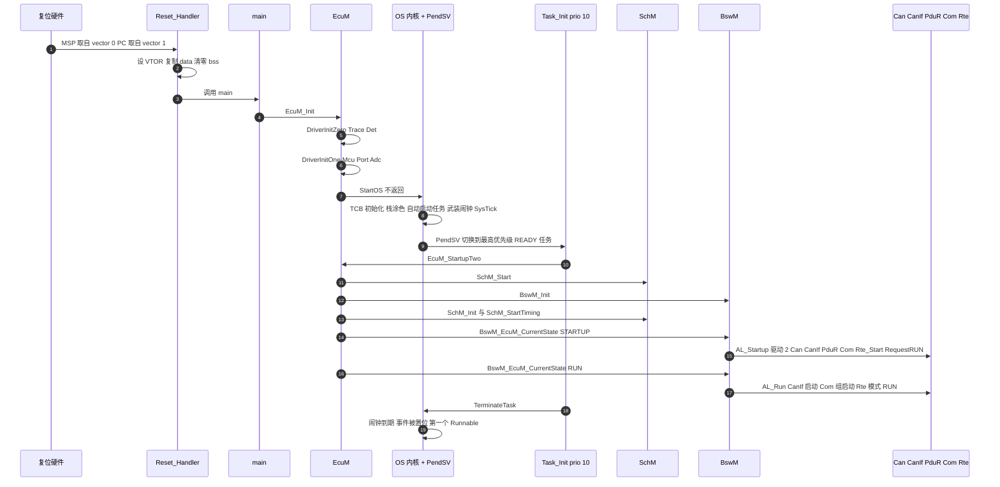

# 07 启动追踪：从复位向量到第一个 Runnable

> 本章回答：(1) 开机后的前 0.5 ms 里，从 `Reset_Handler` 到第一次 `LightCtl_OnSpeed` / `SpeedSensor_Run10ms`，究竟按什么顺序调用了哪些函数？UART 日志里的每一行对应哪一段代码？(2) EcuM、OS、SchM、BswM、RTE 各自在哪个阶段"接棒"，谁调用 `Rte_Start`，为什么？(3) 这套顺序与 R25-11 EcuM / BswM 规范、与 RH850 的启动流程有什么对应与差异？
> Prerequisite: [03 OS 代码](03-os-code.md)、[04 RTE 代码](04-rte-code.md)、[06 通信栈代码](06-com-can-stack-code.md)；理论基础 [docs/11 第 04 章 ECU 启动：EcuM](../11-classic-autosar-primer/04-ecu-startup-ecum.md)、[docs/02-autosar-classic/03 ECU 启动流程](../02-autosar-classic/03-ecu-startup.md)、[docs/01-rh850/04 启动过程](../01-rh850/04-startup-process.md)。   Next: [08 map / ELF / 链接脚本分析](08-map-elf-linker-analysis.md)
> 对应代码（路径相对 `examples/mini_autosar_ecu/`）：`target/stm32l552/startup/startup.c`、`integration/Main_Target.c`、`bsw/ecum/EcuM.c`、`gen/LightEcu/EcuM_Cfg.c`、`os/src/Os_Core.c`、`os/port/cm33/Os_Port_Cm33.c`、`bsw/schm/SchM.c`、`bsw/bswm/BswM.c`、`gen/LightEcu/BswM_Cfg.c`、`gen/LightEcu/Rte.c`、`gen/LightEcu/Rte_Tasks.c`
> 对应规范（R25-11，页码为 PDF 页码，已 grep 核对）：EcuM SWS §7.3 与 Figure 7.3 "STARTUP Phase"（p.37：`EcuM_Init → StartOS → StartupHook → ActivateTask → EcuM_StartupTwo`，"集成者必须实现一个自动启动、并以 `EcuM_StartupTwo` 作为第一个动作的 OS 任务"）、Table 7.1 "StartPreOS Sequence"（p.38）、`SWS_EcuM_02934` StartPostOS Sequence（p.41–42）、`EcuM_Init` `SWS_EcuM_02811` 与 `EcuM_StartupTwo` `SWS_EcuM_02838`（p.112）、`EcuM_AL_DriverInitZero/One` `SWS_EcuM_02905/02907`（p.137/p.138）；BswM SWS：`BswM_Init` `SWS_BswM_00002`（p.69）、`BswMRteStart` `ECUC_BswM_01073`（p.169）；RTE SWS §4.6.1.2（p.460）。   深入阅读：[docs/10-boot-debug/05 启动代码失败点清单](../10-boot-debug/05-startup-code-failure-points.md)、[docs/10-boot-debug/06 增量式上板策略](../10-boot-debug/06-incremental-bring-up-strategy.md)、[docs/08-integration/01 ECU 配置检查清单](../08-integration/01-ecu-configuration-checklist.md)

---

## 1. 本章要回答的问题

LightEcu 上电后，**第一个被 SWC 代码处理的事件**是什么？它发生在什么时间？在它之前有哪些函数必须先完成，**换一下顺序会发生什么**？

本章用 `artifacts/mini-autosar/renode/uart_b.log`（LightEcu）和 `uart_a.log`（SensorEcu）的前 60 行回答这些问题，并配合 `gdb_session.txt` 里 Reset_Handler → main → EcuM_Init → StartOS → 第一个任务的断点回溯。每行日志都给出时间戳（µs）和对应的源码行。

> `[Educational Implementation]` 时间戳的来源：`Mini_Time_GetUs()`（`os/port/cm33/Mini_Time_Target.c:50-71`），基于 SysTick 的 1 kHz 计数 + 当前计数值换算；**在 `Mini_Time_Init()` 之前它恒返回 0**（`:58-59`）。这解释了日志前 5 行时间戳全是 `000000000`：那时 SysTick 还没启动，不是"那些事真的耗时 0"。另外，Renode 里的 µs 时间戳每次运行有几 µs～几十 µs 抖动，本章引用的是某一次运行的快照：对照时看行序和事件名，不要逐位比较数字。

---

## 2. 直觉理解："三棒接力"

| 棒 | 谁在跑 | 栈 / 上下文 | 干什么 | 结束标志 |
|---|---|---|---|---|
| 第 1 棒 | **复位硬件 + `Reset_Handler` + `main` + `EcuM_Init`** | MSP，无 OS，中断全关 | 让 C 能运行（.data/.bss）；初始化**不依赖 OS 的**驱动（Trace、Det、Mcu、Port、Adc） | `StartOS()`（**不返回**） |
| 第 2 棒 | **OS 内核 + `Task_Init`（优先级 10，自动启动）** | PSP，任务上下文 | `EcuM_StartupTwo`：SchM/BswM 起来，再由 **BswM 规则**驱动剩余初始化 | `Task_Init` 终止 |
| 第 3 棒 | **周期任务 + 事件任务** | PSP | 闹钟/事件/ISR 驱动的稳态运行 | — |

规范的原话（EcuM SWS Figure 7.3 后的正文，R25-11 p.37）："With the call to StartOS, the ECU Manager module temporarily relinquishes control. To regain control, the Integrator has to implement an OS task that is automatically started and calls EcuM_StartupTwo as its first action." 本项目的 `Task_Init` 就是这个任务（`gen/LightEcu/Rte_Tasks.c:47-52`）。

---

## 3. 全景时序



---

## 4. 第 1 棒：从复位到 `StartOS`

### 4.1 硬件复位：只做两件事

Cortex-M33 复位后，**硬件**从向量表取 `vector[0]` 装入 MSP、取 `vector[1]` 装入 PC（`target/stm32l552/startup/startup.c:59-60` 就是这两项）。GDB 连上 Renode 时 CPU 停在复位向量，所以 `Reset_Handler` 断点就是**连接后的第一个停点**（`DESIGN.md` §14.2；`gdb_session.txt` 第 1 节，已省略路径前缀）：

```text
===== 1. attach: the CPU is held at the reset vector =====
Reset_Handler () at target\stm32l552\startup\startup.c:84
84	    *(volatile uint32_t *)0xE000ED08u = (uint32_t)(uintptr_t)&g_vectors[0];
connected: pc=0x08003414 sp=0x200027f8
Reset_Handler in section .text
VTOR = 0x08000000
vector[0] initial MSP  = 0x200027f8   (_estack = 0x200027f8)
vector[1] Reset        = 0x08003415   (Reset_Handler = 0x08003414, bit0 = Thumb)
vector[14] PendSV      = 0x08000251
vector[15] SysTick     = 0x080001f9
vector[16+39] FDCAN1_IT0 = 0x08000283   (all external IRQs -> Os_Cm33_IrqEntry = 0x08000282)

```

读法：

- `pc=0x08003414 sp=0x200027f8`：PC 是 `Reset_Handler`，SP 是 `_estack`（`.stack` 4 KB 的顶，链接脚本符号）。
- `vector[1] = 0x08003415`：低位 1 是 **Thumb 位**（`Reset_Handler = 0x08003414`）。
- `vector[16+39]` 指向 `Os_Cm33_IrqEntry`（`target/stm32l552/startup/startup.c:74`）：所有外部 IRQ 共用一个入口，见第 6 章。
- Renode 自己的日志也印证了这点（`artifacts/mini-autosar/renode/renode.log`）：`ECU_B/cpu: Setting initial values: PC = 0x8003415, SP = 0x200027F8.`

> **`[Real Project Consideration]` 一个已知的调试怪癖**：因为 `StartGdbServer` 把 CPU 停在复位向量，`Reset_Handler` 里的断点要在**连接后**设置才有意义；`monitor machine Reset` 会让这版 Renode 的 GDB 连接崩溃，不要用（详见[第 09 章](09-renode-gdb-and-rh850-porting.md)）。

### 4.2 `Reset_Handler`：C 运行时的最小集

```c
void Reset_Handler(void)
{
    uint32_t *src;
    uint32_t *dst;

    /* Point VTOR at our table (reset value 0 is only an alias of FLASH on this chip). SCB->VTOR = 0xE000ED08 */
    *(volatile uint32_t *)0xE000ED08u = (uint32_t)(uintptr_t)&g_vectors[0];

    /* .data: initialised globals live in FLASH (load address) and must be copied to RAM */
    src = &_sidata;
    for (dst = &_sdata; dst < &_edata; ) {
        *dst++ = *src++;
    }
    /* .bss: zero-initialised globals */
    for (dst = &_sbss; dst < &_ebss; ) {
        *dst++ = 0u;
    }

    (void)main();
    for (;;) { }                /* main() must not return on an ECU; stay here if it does */
}
```

| 行 | 做什么 | 链接脚本里的对应物（第 8 章） |
|---|---|---|
| `:84` | 写 `SCB->VTOR`（`0xE000ED08`）指向 `g_vectors` | `.isr_vector`，512 字节对齐（500 字节的表需要 VTOR 对齐到 2 的幂） |
| `:87-90` | 把 `.data` 从 FLASH 的**装载地址**复制到 RAM 的**运行地址** | `_sidata = 0x0800417c` → `_sdata = 0x20000000 .. _edata = 0x2000000c`（共 **12 字节**，`mcu_sysClockHz` 等） |
| `:92-94` | 把 `.bss` 清零 | `_sbss = 0x20001310 .. _ebss = 0x200017f8`（**1256 字节**，含 `.bss.rte`、`.bss.com`） |
| `:96` | 调 `main()` | — |

**注意没清零/没复制什么**：`.os_stack`（4864 字节，NOLOAD，由 `Os_Port_Init` 涂成 `0xDEADBEEF`）、`.noinit`（RAM2，未使用）、`.stack`（MSP 主栈）。**写 `Reset_Handler` 时不能依赖已初始化的全局变量**——这是函数体里只用寄存器和局部变量的原因（`target/stm32l552/startup/startup.c:10-12` 的注释）。

对应的汇编（取自 `artifacts/mini-autosar/analysis/LightEcu.md` 第 8 节，真实 `objdump -d --disassemble=Reset_Handler` 输出）：

```text
08003414 <Reset_Handler>:
 8003414:	b508      	push	{r3, lr}
 8003416:	f04f 23e0 	mov.w	r3, #3758153728	@ 0xe000e000
 800341a:	4a0c      	ldr	r2, [pc, #48]	@ (800344c <Reset_Handler+0x38>)
 800341c:	490c      	ldr	r1, [pc, #48]	@ (8003450 <Reset_Handler+0x3c>)
 800341e:	f8c3 2d08 	str.w	r2, [r3, #3336]	@ 0xd08
 8003422:	4b0c      	ldr	r3, [pc, #48]	@ (8003454 <Reset_Handler+0x40>)
 8003424:	4a0c      	ldr	r2, [pc, #48]	@ (8003458 <Reset_Handler+0x44>)
 8003426:	428b      	cmp	r3, r1
 8003428:	d307      	bcc.n	800343a <Reset_Handler+0x26>
 800342a:	2100      	movs	r1, #0
 800342c:	4b0b      	ldr	r3, [pc, #44]	@ (800345c <Reset_Handler+0x48>)
 800342e:	4a0c      	ldr	r2, [pc, #48]	@ (8003460 <Reset_Handler+0x4c>)
 8003430:	4293      	cmp	r3, r2
 8003432:	d307      	bcc.n	8003444 <Reset_Handler+0x30>
 8003434:	f7fe f819 	bl	800146a <main>
 8003438:	e7fe      	b.n	8003438 <Reset_Handler+0x24>
 800343a:	f852 0b04 	ldr.w	r0, [r2], #4
 800343e:	f843 0b04 	str.w	r0, [r3], #4
 8003442:	e7f0      	b.n	8003426 <Reset_Handler+0x12>
 8003444:	f843 1b04 	str.w	r1, [r3], #4
 8003448:	e7f2      	b.n	8003430 <Reset_Handler+0x1c>
 800344a:	bf00      	nop
 800344c:	08000000 	.word	0x08000000
 8003450:	2000000c 	.word	0x2000000c
 8003454:	20000000 	.word	0x20000000
 8003458:	0800417c 	.word	0x0800417c
 800345c:	20001310 	.word	0x20001310
```

（`0xe000e000 + 0xd08 = 0xE000ED08`，即 `SCB->VTOR`；`bl 800146a <main>` 是 `:96`；`ldr.w r0,[r2],#4` / `str.w r0,[r3],#4` 是 `.data` 复制循环；`str.w r1,[r3],#4`（r1=0）是 `.bss` 清零。最后几行 `.word` 是**字面量池**：`0x08000000`（`g_vectors`，写 VTOR）、`0x2000000c`（`_edata`）、`0x20000000`（`_sdata`）、`0x0800417c`（`_sidata`）、`0x20001310`（`_sbss`）——正是 §4.2 表里链接脚本符号的实际值，由链接器在重定位时填进去。）

### 4.3 `main` → `EcuM_Init`：StartPreOS

`integration/Main_Target.c:11-15`：

```c
int main(void)
{
    EcuM_Init();            /* DriverInitZero -> DriverInitOne -> StartOS: does not return */
    for (;;) { }
}
```

`EcuM_Init`（`bsw/ecum/EcuM.c:78-91`）：

```c
void EcuM_Init(void)
{
    ecum_runRequests = 0u;
    EcuM_AL_DriverInitZero();                       /* Trace_Init, Det_Init, Det_Start: trace works from here */
    ecum_setState(ECUM_STATE_STARTUP, FALSE);       /* BswM does not exist yet: not pushed */
    TRACE(TRACE_CAT_BSW, "ECUM INIT_ZERO");
    EcuM_AL_DriverInitOne();                        /* Mcu_Init, clock, Port_Init, Adc_Init */
    TRACE(TRACE_CAT_BSW, "ECUM INIT_ONE");
    EcuM_AL_SetProgrammableInterrupts();
    StartOS(OSDEFAULTAPPMODE);                      /* does not return: Task_Init will call EcuM_StartupTwo */
#if !defined(MINI_UNIT_TEST)
    for (;;) { }                                    /* unreachable; unit tests mock StartOS and return */
#endif
}
```

对应日志（`uart_b.log` 第 1-5 行；时间戳全为 0，原因见 §1）：

```text
[000000000] ECUB BSW   ECUM STATE STARTUP
[000000000] ECUB BSW   ECUM INIT_ZERO
[000000000] ECUB BSW   MCU clock=80000000
[000000000] ECUB BSW   ECUM INIT_ONE
[000000000] ECUB OS    STARTOS mode=0
```

- **`EcuM_AL_DriverInitZero`**（生成，`gen/LightEcu/EcuM_Cfg.c:26-31`）：`Trace_Init`、`Det_Init`、`Det_Start`。从这一刻起 `TRACE()` 才能用（`Trace_PutChar` 字符输出在 `os/port/cm33/Trace_Target.c`，USART1 轮询发送，在 Renode 里不需要引脚配置）。**日志的第一行**（`ECUM STATE STARTUP`，`EcuM.c:82`）就是 DriverInitZero 之后的。
- **`EcuM_AL_DriverInitOne`**（`gen/LightEcu/EcuM_Cfg.c:34-41`）：`Mcu_Init`、`Mcu_InitClock`、`Mcu_DistributePllClock`、`Port_Init`、`Adc_Init`。`MCU clock=80000000` 这行 trace 来自 `Mcu_InitClock`。顺序是**依赖顺序**：Mcu（时钟）在 Port 之前，Port（引脚复用）在 Adc 之前。这个列表来自 `config/ecuc/LightEcu.ecuc.json:91-92`。
- `StartOS(OSDEFAULTAPPMODE)`：不返回；`:89` 的 `for(;;){}` 在单元测试里被 `MINI_UNIT_TEST` 排除，因为单测里 `StartOS` 被 mock。

#### 与 R25-11 的对照（Table 7.1 StartPreOS Sequence，EcuM SWS p.38）

规范列出的顺序：`EcuM_AL_SetProgrammableInterrupts` → `EcuM_AL_DriverInitZero` → `EcuM_DeterminePbConfiguration` → 配置一致性检查 → `EcuM_AL_DriverInitOne` → 获取复位原因 → 选择默认关机目标 → `EcuM_LoopDetection` → `StartOS`。

| 规范步骤 | 本项目 | 说明 |
|---|---|---|
| `EcuM_AL_SetProgrammableInterrupts` **在最前** | 在 DriverInitOne **之后**（`bsw/ecum/EcuM.c:86`，弱默认空函数 `:74-76`） | **偏离**：本项目的 OS 端口在 `StartOS` → `Os_Port_Init` 里自己设 NVIC 优先级（`os/port/cm33/Os_Port_Cm33.c:126-136`），所以这个 callout 无事可做 |
| `EcuM_DeterminePbConfiguration` + 一致性检查 | 无 | 本项目没有 post-build 配置；所有配置是链接时常量 |
| 获取复位原因 | 无 | `Mcu_GetResetReason` 存在于 Mcu 驱动，EcuM 未使用 |
| `EcuM_LoopDetection` | 无 | 无复位循环检测 |
| `StartOS` | ✓ | 一致 |

### 4.4 `StartOS`：OS 的启动序列

```c
void StartOS(AppModeType Mode)
{
    uint8 i;
    StatusType st;

    (void)Os_Port_DisableAll();                   /* the port re-enables interrupts when the first task starts */
    s_appMode = Mode;

    st = os_check_config();
    if (st != E_OK) {
        Os_ReportError(OSServiceId_StartOS, st);
        ShutdownOS(st);
    }

    for (i = 0u; i <= OS_NUM_TASKS; i++) {
        Os_Tcb[i].state = SUSPENDED;
        Os_Tcb[i].activations = 0u;
        Os_Tcb[i].curPriority = (i < OS_NUM_TASKS) ? Os_Config.tasks[i].priority : 0u;
        Os_Tcb[i].started = FALSE;
        Os_Tcb[i].resCount = 0u;
        Os_Tcb[i].eventsSet = 0u;
        Os_Tcb[i].eventsWaited = 0u;
    }
    Os_Tcb[OS_IDLE_TASK].state = READY;            /* the idle task is always ready, never queued */
    Os_Resource_Init();

    Os_Port_Init();                                /* NVIC/SysTick priorities, stack paint, host fiber environment */
    TRACE(TRACE_CAT_OS, "STARTOS mode=%u", (unsigned)Mode);
    Os_Tcb[OS_IDLE_TASK].started = TRUE;
    Os_Port_InitTaskContext(OS_IDLE_TASK);

    for (i = 0u; i < Os_Config.numTasks; i++) {   /* autostart tasks of this application mode */
        if ((Os_Config.tasks[i].autostartModes & (1uL << Mode)) != 0u) {
            (void)Os_ActivateInternal(i);
        }
    }
    Os_Alarm_Init(Mode);                           /* counters := 0 and autostart alarms */

#if OS_USE_STARTUPHOOK
    StartupHook();
#endif
    Os_Port_StartTick();
    Os_Started = TRUE;
    Os_Port_StartFirstTask();                      /* never returns */
    for (;;) { }
}
```

按行读：

1. `:373` 关全局中断；`:376-380` 配置一致性检查（"教学奢侈"）。
2. `:382-392` 所有 TCB 置 `SUSPENDED`；Idle 任务（下标 `OS_NUM_TASKS`）永远 `READY`。
3. `:394` `Os_Port_Init()`：设 PendSV/SysTick 优先级、**把所有任务栈涂成 `0xDEADBEEF`**、配置并使能 NVIC 里的 Cat2 ISR（IRQ 39，优先级 0x40）（`os/port/cm33/Os_Port_Cm33.c:101-137`）。
4. `:395` `TRACE ... "STARTOS mode=%u"`——**此时 SysTick 还没启动**，所以时间戳仍为 0。
5. `:399-403` **自动启动任务**：LightEcu 里 `Task_Init`（优先级 10）和 `Task_LightCtl`（优先级 3）的 `autostartModes` 含 `OSDEFAULTAPPMODE`（`gen/LightEcu/Os_Cfg.c:40,60`）。
6. `:404` `Os_Alarm_Init(Mode)`：计数器清零，**自动启动的闹钟**武装（`os/src/Os_Alarm.c:137-154`）：`Alarm_BswMain`（start=10, cycle=10 tick）、`Alarm_LightCtl20ms`（start=20, cycle=20）（`gen/LightEcu/Os_Cfg.c:93-94,106-107`）。
7. `:406-408` `StartupHook()`：本项目是**空函数**（`integration/Os_Hooks.c:24-26`）。EcuM SWS Figure 7.3 把 `StartupHook` 画在 `ActivateTask` 之前，但 post-OS 的初始化放在 `Task_Init` 里做（本项目的选择）。
8. `:409` `Os_Port_StartTick()` → `Mini_Time_Init()`：SysTick 1 kHz 开始，**此后时间戳才不再是 0**。
9. `:411` `Os_Port_StartFirstTask()`：把 PSP 指向一个 `s_bootStack`，MSP 复位到 `vector[0]`（丢弃 `StartOS` 的栈帧），`PENDSVSET`，`cpsie i`——PendSV 立刻被接受，做第一次任务选择（`os/port/cm33/Os_Port_Cm33.c:230-249`）。

GDB 在 `Os_Kernel_SelectNext` 上停下时的就绪队列（`gdb_session.txt` 第 5 节，已省略路径前缀）：

```text
running task: none yet (INVALID_TASK, before the first dispatch)
Os_Started=1  Os_IsrDepth=0  IPSR=0x0e
pc             0x80026e8           0x80026e8 <Os_Kernel_SelectNext>
sp             0x200027c0          0x200027c0
lr             0x8000221           134218273
#0  Os_Kernel_SelectNext (prevOut=prevOut@entry=0x200027c7 "") at os\src\Os_Core.c:192
#1  0x08000220 in Os_Cm33_SwitchContext (sp=0x20001484 <s_bootStack+92>) at os\port\cm33\Os_Port_Cm33.c:186
#2  0x0800026c in PendSV_Handler () at os\port\cm33\Os_Port_Cm33.c:201
Backtrace stopped: previous frame identical to this frame (corrupt stack?)
id  task             state      base  cur  act  res  eventsSet eventsWait
0   Task_Init        READY        10   10    1    0 0x00000000 0x00000000
1   Task_BswMain     SUSPENDED     4    4    0    0 0x00000000 0x00000000
2   Task_LightCtl    READY         3    3    1    0 0x00000000 0x00000000
3   Task_LightAct    SUSPENDED     2    2    0    0 0x00000000 0x00000000
4   (idle)           READY         0    0    0    0 0x00000000 0x00000000
ready bitmap s_readyMask = 0x00000408 (bit p set = queue of priority p not empty)
  prio 10 (1 queued): Task_Init
  prio  3 (1 queued): Task_LightCtl

```

- `IPSR=0x0e`（14 = PendSV）、`running task: none yet`。
- `ready bitmap = 0x408` = bit 10 + bit 3：**优先级 10 的 `Task_Init` 和优先级 3 的 `Task_LightCtl`** 在队列里；`Task_Init` 优先级更高，**先跑**，`Task_LightCtl` 要等 `Task_Init` 终止之后才轮到它——这在日志里体现为：`TASK_START Task_LightCtl` 出现在 `TASK_END Task_Init` **之后**（t=471 vs t=452 µs）。
- 回溯的最底层 `Backtrace stopped: previous frame identical to this frame (corrupt stack?)`：GDB 不认识 PendSV 的异常帧，无害。

> **`Os_Cm33_IdleEntry` 的"怪帧"**：后面几节你会在回溯底部看到 `Os_Cm33_IdleEntry`。它不是任务真的在 idle 入口里——是 `Os_Port_InitTaskContext` 在任务初始栈帧里放的**假返回地址** `Os_Port_TaskReturn`（紧跟在 `Os_Cm33_IdleEntry` 后面），GDB 对返回地址取 `pc-1`，于是显示成前一个函数（`os/port/cm33/Os_Port_Cm33.c:151-174`、`tools/gdb/mini_autosar.gdb:175-179` 的 `document mini_current`）。

---

## 5. 第 2 棒：`Task_Init` → `EcuM_StartupTwo`

### 5.1 StartPostOS：规范 vs 实现

`Task_Init` 的任务体（`gen/LightEcu/Rte_Tasks.c:47-52`）：

```c
TASK(Task_Init)
{
    EcuM_StartupTwo();

    (void)TerminateTask();
}
```

`EcuM_StartupTwo`（`bsw/ecum/EcuM.c:93-104`）：

```c
void EcuM_StartupTwo(void)
{
    TRACE(TRACE_CAT_BSW, "ECUM STARTUP_TWO");
    /* ---- StartPostOS sequence, EcuM SWS 7.3.3 / Figure 7.5 ---- */
    (void)SchM_Start();
    BswM_Init(&BswM_Config);
    SchM_Init();
    SchM_StartTiming();
    /* ---- hand over to BswM: it runs the configured action lists ---- */
    BswM_EcuM_CurrentState(ECUM_STATE_STARTUP);     /* R_Startup -> AL_Startup (ends with EcuM_RequestRUN) */
    ecum_setState(ECUM_STATE_RUN, TRUE);            /* R_Run -> AL_Run */
}
```

规范 `SWS_EcuM_02934`（EcuM SWS p.41–42）的 StartPostOS 表按顺序是：**Start BSW Scheduler → Init BSW Mode Manager → Init BSW Scheduler → Start Scheduler Timing**，对应 `SchM_Start` / `BswM_Init` / `SchM_Init` / `SchM_StartTiming`——**本项目的 `:97-100` 与规范逐项一致**。`SchM`（`bsw/schm/SchM.c:17-34`）在本项目里只是 trace（`SCHM START/INIT/TIMING`），因为闹钟已经由 OS 自动启动（`:31-33` 的注释）；真实 SchM 在这里启动自己的定时源。

日志（`uart_b.log` 第 6-10 行）：

```text
[000000018] ECUB OS    TASK_START Task_Init prio=10
[000000032] ECUB BSW   ECUM STARTUP_TWO
[000000044] ECUB BSW   SCHM START
[000000056] ECUB BSW   SCHM INIT
[000000068] ECUB BSW   SCHM TIMING
```

> **`SWS_EcuM_02838` 的使用限制**（EcuM SWS p.112）：`EcuM_StartupTwo` 必须在 StartOS 直接引起的任务里调用（要么自动启动任务，要么由某个 `StartupHook` 激活）。本项目是自动启动任务，所以 `Task_Init` 在 OS 配置里 `autostart: ["OSDEFAULTAPPMODE"]`（`config/ecuc/LightEcu.ecuc.json:32`）。

### 5.2 BswM：规则 + 动作列表 = 启动编排

`BswM_Init`（`bsw/bswm/BswM.c:67-80`）只做一件事：把所有规则状态置 `UNDEFINED`。然后 `EcuM_StartupTwo` **推送**两个状态，规则引擎据此执行动作：

| 推送 | 规则（`gen/LightEcu/BswM_Cfg.c:111-118`） | 动作列表 |
|---|---|---|
| `BswM_EcuM_CurrentState(STARTUP)`（`bsw/ecum/EcuM.c:102`） | `R_Startup`：EcuM 状态 == STARTUP → TRUE | `AL_Startup`（7 个动作，`gen/LightEcu/BswM_Cfg.c:58-67`） |
| `ecum_setState(RUN, TRUE)`（`bsw/ecum/EcuM.c:103`） | `R_Run`：EcuM 状态 == RUN → TRUE | `AL_Run`（3 个动作，`gen/LightEcu/BswM_Cfg.c:83-88`） |

规则引擎（`bsw/bswm/BswM.c:44-65`）的语义：**状态从 `UNDEFINED`/`FALSE` 变到 `TRUE` 时执行 `trueList`；变到 `FALSE` 时执行 `falseList`；第一次求值也算一次变化**。这就解释了日志里**多出来的几行**：

```text
[000000086] ECUB BSW   BSWM RULE R_Startup TRUE
[000000100] ECUB BSW   BSWM ACTION EcuM_AL_DriverInitTwo rc=0
[000000108] ECUB BSW   BSWM ACTION Can_Init rc=0
[000000126] ECUB BSW   BSWM ACTION CanIf_Init rc=0
[000000145] ECUB BSW   BSWM ACTION PduR_Init rc=0
[000000200] ECUB BSW   BSWM ACTION Com_Init rc=0
[000000212] ECUB RTE   START
[000000228] ECUB BSW   BSWM ACTION Rte_Start rc=0
[000000246] ECUB BSW   BSWM ACTION EcuM_RequestRUN rc=0
[000000266] ECUB BSW   BSWM RULE R_Run FALSE
[000000283] ECUB BSW   ECUM STATE RUN
[000000297] ECUB BSW   BSWM RULE R_Startup FALSE
[000000312] ECUB BSW   BSWM RULE R_Run TRUE
[000000331] ECUB CANIF MODE ctrl=0 mode=1
[000000346] ECUB BSW   BSWM ACTION CanIf_Start rc=0
[000000369] ECUB COM   GROUP_START 0
[000000384] ECUB BSW   BSWM ACTION Com_IpduGroupStart rc=0
[000000404] ECUB RTE   MODE EcuMode=RUN
[000000432] ECUB BSW   BSWM ACTION Rte_SwitchRun rc=0
```

逐行对应（时间戳取自这份真实日志）：

| t (µs) | 日志 | 来自 |
|---|---|---|
| 88 | `BSWM RULE R_Startup TRUE` | `BswM_EcuM_CurrentState(STARTUP)`（`bsw/ecum/EcuM.c:102`）→ `bswm_evaluate`（`bsw/bswm/BswM.c:55-65`） |
| 100 | `ACTION EcuM_AL_DriverInitTwo` | `AL_Startup[0]`：`IoHwAb_Init()`（`gen/LightEcu/EcuM_Cfg.c:44-47`）——**需要 OS 才能起的驱动**，所以不在 InitOne 里 |
| 108 / 126 / 145 | `ACTION Can_Init / CanIf_Init / PduR_Init` | **自下而上**的初始化顺序：Can → CanIf → PduR（上层引用下层的配置和句柄） |
| 200 | `ACTION Com_Init` | Com 在 PduR 之后 |
| 212 / 228 | `RTE START` 与 `ACTION Rte_Start` | `Rte_Start()`（`gen/LightEcu/Rte.c:293-307`）：缓冲/PIM/模式置初值，`Rte_Started = TRUE`。`RTE START` 是 `Rte_Start` 内部打的 trace（`:305`），`ACTION ... rc=0` 是 BswM 在动作返回之后打的 |
| 246 | `ACTION EcuM_RequestRUN` | `AL_Startup` 的最后一项：BswM 申请 RUN（`bsw/ecum/EcuM.c:106-116`） |
| **266** | **`BSWM RULE R_Run FALSE`** | **容易困惑的一行**：`BswM_EcuM_CurrentState(STARTUP)` 对**所有**源为 `ECUM_STATE` 的规则求值，`R_Run` 的期望是 RUN，当前是 STARTUP → 从 `UNDEFINED` 变成 `FALSE`，算一次"变化"，但 `falseList` 为空，没有动作 |
| 283 | `ECUM STATE RUN` | `ecum_setState(RUN, TRUE)`（`bsw/ecum/EcuM.c:103`） |
| 297 | `BSWM RULE R_Startup FALSE` | RUN 状态下 `R_Startup` 变 FALSE，`falseList` 空 |
| 312 | `BSWM RULE R_Run TRUE` | → `AL_Run` |
| 331 / 346 | `CANIF MODE ctrl=0 mode=1`、`ACTION CanIf_Start` | `CanIf_SetControllerMode(0, STARTED)` → `Can_SetControllerMode(START)` → `CanHw_Start`（离开 INIT）→ `CanIf_ControllerModeIndication`（`mode=1` = `CAN_CS_STARTED`）。**从这里起 CAN 才能收发** |
| 369 / 384 | `COM GROUP_START 0`、`ACTION Com_IpduGroupStart` | I-PDU 组 0 启动；从此 `Com_SendSignal`/`Com_ReceiveSignal` 不再返回 `COM_SERVICE_NOT_AVAILABLE` |
| 404 / 418 | `RTE MODE EcuMode=RUN`、`ACTION Rte_SwitchRun` | `Rte_Switch_P_EcuMode_EcuMode(RUN)`；与 `Rte_Start` 设的初始模式相同，所以**不会**触发 ModeSwitchEvent |
| 452 | `TASK_END Task_Init` | `Task_Init` 的 `TerminateTask` |

> **启动期内的"关口"顺序必须是这样的**：`Can_Init` 之前不能 `CanIf_Init`；`Com_Init` 之前不能 `Rte_Start`（`Rte_Write` 会调 `Com_SendSignal`）；`Rte_Start` 之前 `Com_IpduGroupStart` 无意义；`CanIf_Start` 与 `Com_IpduGroupStart` 都在 `AL_Run` 里。这些就是 `config/ecuc/LightEcu.ecuc.json:99-113` 里动作列表的顺序。**BswM 把"启动编排"从代码变成了配置**。

### 5.3 谁调用 `Rte_Start`？——规范间的不一致（如实说明）

| 规范 | 说法 | 位置 |
|---|---|---|
| RTE SWS（R25-11） | "The ECU state manager calls the startup routine Rte_Start of the RTE at the end of startup phase II when the OS is available and all basic software modules are initialized." | §4.6.1.2，p.460 |
| BSW Mode Manager SWS（R25-11） | 容器 `BswMRteStart`：BswM 的一个**动作**，调用 `Rte_Start()` | `ECUC_BswM_01073`，p.169 |

两处**不一致**。本项目（和多数真实项目）按 BswM SWS 做：`Rte_Start` 是 `AL_Startup` 动作列表里的一项（`gen/LightEcu/BswM_Cfg.c:50-53`、`:64`）；`EcuM.c` 里**不**直接调用它（`bsw/ecum/EcuM.c:24-28` 的头注释解释了这点）。`[Industry Practice]` 真实项目以**生成工具和集成方案**为准：Vector 的集成通常由 BswM 的 `BswMRteStart` 动作或 EcuM 的 callout 调用 `Rte_Start`，具体看工具链模板。

### 5.4 试一试：拿掉 `Rte_Start` 会怎样（真实实验）

我做了一个实验：把 `gen/LightEcu/BswM_Cfg.c` 的 `Rte_Start` 动作函数（`:50-53`）改成 `return E_OK;`（**只改一份拷贝**，只重编这个目标文件，用现有目标文件重新链接，在三机场景里跑 200 ms）。真实 LightEcu 日志摘录（对比 §5.2 的正常日志；`<-` 之后是我加的注释，不属于日志）：

```text
[000000212] ECUB BSW   BSWM ACTION Rte_Start rc=0           <- 没有前一行的 "RTE START"
...
[000010128] ECUB COM   NOTIFY sig=0                           <- Com 通知了
[000010158] ECUB COM   TX ipdu=3 len=6                        <- 没有 "RTE TRIGGER ..." 和 "EVENT_SET"
...
[000020106] ECUB SWC   LightCtl cmd=1 speed=0 ambient=0 postrun=0
```

三个后果：

1. `Rte_COMCbk_VehicleSpeed` 因 `Rte_Started == FALSE` 直接返回（`gen/LightEcu/Rte.c:281-284`）：**没有** `RTE TRIGGER DRE_LightCtl_VehicleSpeed`，没有 `EVENT_SET`，`LightCtl_OnSpeed` **永远不会运行**——收到的 0x101 帧就此石沉大海。
2. `Rte_Read_R_AmbientLight_AmbientLight` 返回 `RTE_E_COM_STOPPED`，`LightCtl_Run20ms` 回退到 PIM 里的 `lastAmbient`——但 **PIM 从未被 `Rte_Start` 初始化**，值是 `.bss` 的 0，不是 ARXML 里的初值 255（`gen/LightEcu/Rte.c:55`）。于是 `ambient=0` → 判定"很暗" → **`cmd=1`（近光灯点亮）**。一个未初始化状态直接变成了一个**看起来合理的错误输出**。
3. `Rte_Write_P_HeadlightCmd_*` 返回 `RTE_E_COM_STOPPED`（`gen/LightEcu/Rte.c:89-92`），**没有** `RTE WRITE`、没有 `ActivateTask(Task_LightAct)`；200 ms 内 `RTE   WRITE` 行数为 **0**。

这就是 `Rte_Start` 在整个启动序列里的位置：**在 Com 之后、通信组启动之前、任何 Runnable 之前**。

---

## 6. 第 3 棒：第一个闹钟、第一个 Runnable

### 6.1 LightEcu：第一个 Runnable 是谁？

日志（`uart_b.log` 第 30-59 行）：

```text
[000000452] ECUB OS    TASK_END Task_Init
[000000471] ECUB OS    TASK_START Task_LightCtl prio=3
[000000492] ECUB OS    TASK_WAIT Task_LightCtl mask=0x7
[000002900] ECUB OS    ISR_ENTER Isr_CanRx
[000002917] ECUB CAN   RX id=0x3f0 dlc=1 data=00
[000002937] ECUB CANIF RX pdu=2
[000002949] ECUB PDUR  RX canif=2 com=2
[000002965] ECUB COM   RX ipdu=2 len=1
[000002982] ECUB OS    ISR_EXIT Isr_CanRx
[000010000] ECUB OS    ALARM Alarm_BswMain
[000010013] ECUB OS    ISR_ENTER Isr_CanRx
[000010026] ECUB CAN   RX id=0x101 dlc=2 data=00 00
[000010046] ECUB CANIF RX pdu=0
[000010046] ECUB PDUR  RX canif=0 com=0
[000010066] ECUB COM   RX ipdu=0 len=2
[000010100] ECUB OS    ISR_EXIT Isr_CanRx
[000010102] ECUB OS    TASK_START Task_BswMain prio=4
[000010128] ECUB COM   NOTIFY sig=0
[000010154] ECUB RTE   TRIGGER DRE_LightCtl_VehicleSpeed -> Task_LightCtl
[000010180] ECUB OS    EVENT_SET Task_LightCtl mask=0x2
[000010206] ECUB COM   TX ipdu=3 len=6
[000010221] ECUB PDUR  TX com=3 canif=0
[000010240] ECUB CAN   TX id=0x201 dlc=6 data=00 00 00 00 00 00
[000010265] ECUB CANIF TX pdu=0
[000010280] ECUB BSW   BSWM RULE R_EcuModeRequest FALSE
[000010300] ECUB RTE   MODE EcuMode=RUN
[000010314] ECUB BSW   BSWM ACTION Rte_SwitchRun2 rc=0
[000010335] ECUB OS    TASK_END Task_BswMain
[000010357] ECUB RTE   CALL R_Odometer_UpdateSpeed
[000010377] ECUB OS    TASK_WAIT Task_LightCtl mask=0x7
```

读法：

- `t=452`：`Task_Init` 结束；`t=471`：`Task_LightCtl` 第一次被调度，立刻 `WaitEvent(0x7)`（`gen/LightEcu/Rte_Tasks.c:90`），`TASK_WAIT mask=0x7`（t=492）：它在等三个事件之一。
- `t=2900~2982`：REST 节点的 0x3F0 帧到达，`ISR_ENTER Isr_CanRx` … `COM RX ipdu=2`（IMMEDIATE，无通知）。**第一个 0x301 帧（REST 在 t=40 µs 发出）已丢**，见第 6 章。
- **`t=10000`：`ALARM Alarm_BswMain`**——10 个 tick 的第一个闹钟到期（`gen/LightEcu/Os_Cfg.c:93`，`autostartTime = 10u`）。
- `t=10013`：0x101 的 ISR（A 的第一帧，值是 Com 初始值 0）。
- `t=10102`：`Task_BswMain`(prio 4) 开始，`Com_MainFunctionRx` → `COM NOTIFY sig=0`（t=10128）→ `RTE TRIGGER DRE_LightCtl_VehicleSpeed`（10154）→ **`EVENT_SET Task_LightCtl mask=0x2`**（10180）。
- `t=10335`：`Task_BswMain` 结束，`Task_LightCtl` 才得到 CPU（它的优先级 3 < 4）：`RTE CALL R_Odometer_UpdateSpeed`（t=10357）——**这就是 LightEcu 上第一个被执行的 SWC 代码：`LightCtl_OnSpeed` 的第 118 行**（`swc/LightControlSWC/LightControlSWC.c:118`，被 `Rte_Call` 的 trace 暴露出来）。
- `t=10377`：`TASK_WAIT Task_LightCtl mask=0x7`：处理完又回到 `WaitEvent`。
- 第一个 `LightCtl_Run20ms` 要等到 t=20000（`Alarm_LightCtl20ms`，start=20）：`EVENT_SET mask=0x1`（t=20022），然后 `RTE WRITE P_HeadlightCmd...`（t=20108，见 `uart_b.log` 第 62–65 行）。

### 6.2 SensorEcu：第一个 Runnable

`uart_a.log`（SensorEcu，第 28-44 行）：

```text
[000000446] ECUA RTE   MODE EcuMode=RUN
[000000483] ECUA BSW   BSWM ACTION Rte_SwitchRun rc=0
[000000500] ECUA OS    TASK_END Task_Init
[000010001] ECUA OS    ALARM Alarm_BswMain
[000010017] ECUA OS    ALARM Alarm_Swc10ms
[000010037] ECUA OS    TASK_START Task_BswMain prio=3
[000010059] ECUA COM   TX ipdu=0 len=2
[000010074] ECUA PDUR  TX com=0 canif=0
[000010092] ECUA CAN   TX id=0x101 dlc=2 data=00 00
[000010101] ECUA CANIF TX pdu=0
[000010118] ECUA OS    TASK_END Task_BswMain
[000010134] ECUA OS    TASK_START Task_Swc10ms prio=2
[000010166] ECUA RTE   CALL R_WheelSpeed_GetWheelSpeed
[000010187] ECUA BSW   IOHWAB ADC raw=0
[000010200] ECUA RTE   WRITE P_VehicleSpeed_VehicleSpeed=0
[000010219] ECUA OS    TASK_END Task_Swc10ms
[000020001] ECUA OS    ALARM Alarm_BswMain
```

SensorEcu 里 `Task_BswMain` 优先级是 **3**，`Task_Swc10ms` 是 **2**（对比 LightEcu 里 BswMain 是 4）。所以 t=10037 先跑 `Task_BswMain`，**发出第一帧 0x101（值 0，Com 初始值）**；接着 t=10134 `Task_Swc10ms` 才跑 `SpeedSensor_Run10ms`（`RTE CALL R_WheelSpeed_GetWheelSpeed` → `IOHWAB ADC raw=0` → `RTE WRITE P_VehicleSpeed_VehicleSpeed=0`）。这就是第 6 章里"第一帧带的是初始值"的来源，也是**任务优先级配置影响可观测行为**的一个例子。

### 6.3 host 构建：同一份代码，不同的时间

`artifacts/mini-autosar/host/ecuB.log` 的头 38 行与上面的启动序列**逐行相同**，只是所有时间戳都是 `000000000`：host 用**虚拟时间**，只在 Idle 循环和 `Os_HostBurn()` 里推进（`DESIGN.md` §6.5）；启动阶段没有"idle"，所以时间不动。这是 host 与 target 的核心差别，也是用 host 做**逻辑回归**、用 Renode 做**时序回归**的理由。

---

## 7. 与 RH850 的启动对比

`[RH850 Hardware]` 下表的 RH850 一侧引自本仓库 [docs/01-rh850/04-startup-process.md](../01-rh850/04-startup-process.md)（引用 HW-E 页码处以该章为准）和 [docs/10-boot-debug/](../10-boot-debug/README.md)。

| 阶段 | 本项目（Cortex-M33） | RH850/P1M-E |
|---|---|---|
| 复位向量 | 硬件从 `vector[0]` 装 MSP、`vector[1]` 装 PC | 复位入口在 `0x00000000`（RBASE）；向量区只放一条跳转；**SP 必须由启动汇编设置** |
| 启动汇编 | **没有**（`Reset_Handler` 是 C 函数，硬件已设好 SP） | 必须有：给**所有 GPR 赋确定值**（lock-step：读未定义寄存器会触发比较错误）、设 SP(r3)/GP(r4)/TP(r5)/EP(r30)、设 EBASE（PSW.EBV=1）与 INTBP |
| 复位原因 | 本项目未读取 | **尽早读取并保存 RESF**（`FFF8_1000H`），因为 RAM 清零/WDT 可能抹掉线索 |
| 看门狗 | 无 | OPBT0 决定 WDTA0 启动方式；启动阶段的第一道时间约束 |
| `.data` 复制 / `.bss` 清零 | `target/stm32l552/startup/startup.c:87-94` 的两个循环 | GHS 的**复制表/清零表**（`.secinfo` 等），由 crt0 或启动文件遍历；P1M-E 的 LRAM/GRAM 复位时**硬件已清零并写好 ECC**，软件仍应清（防止关闭 STAC 后失效）；`.noinit` 不清 |
| 向量表 | `VTOR` 指向 512 B 对齐的 `g_vectors`；所有 IRQ → `Os_Cm33_IrqEntry` | EBASE（异常/直接向量）与 INTBP（表引用中断），均 512 B 对齐；EIC 的 EIP/EITB/EIMK 由 OS 或 MCAL 写 |
| 时钟 | `Mcu_InitClock`（Renode 里 PLL 80 MHz；真实 L552 需验证） | P1M-E 的时钟结构特殊（见该章 §8），`Mcu_InitClock` 在无 PLL 的型号上会"退化"；有"永远等不到 LOCKED"的陷阱 |
| 进入 `main` | `Reset_Handler` 里 `main()` | 启动汇编 → `_StartupC`/crt0 → `main()` |
| `main` → `EcuM_Init` | **完全相同** | **完全相同** |
| `StartOS` | `Os_Port_StartFirstTask`：`msp`/`psp`、`PENDSVSET`、`cpsie i` | OS 端口设 INTBP/EIC、启动 OSTM tick，进入第一个任务（RTA-OS 的 RH850 端口实现细节需查端口文档） |
| 中断何时被打开 | `Os_Port_StartFirstTask` 的 `cpsie i`（`os/port/cm33/Os_Port_Cm33.c:242`） | OS 在 `StartOS` 进入第一个任务时清 PSW.ID；**不能在 OS 建立上下文之前进入生成的 Cat2 ISR** |
| `EcuM_Init` 之后 | **完全相同**：`StartOS` → `Task_Init` → `EcuM_StartupTwo` → BswM | **完全相同** |

结论：**差异集中在 `StartOS` 之前的"第 1 棒"的前半段**（复位、启动汇编、向量/中断控制器、时钟）和 OS 端口；`EcuM_Init` 以后，直到第一个 Runnable，**代码完全相同**。这也是[第 09 章](09-renode-gdb-and-rh850-porting.md)移植清单只列"启动 + OS port + MCAL"的原因。

调试启动问题的 RH850 侧工具书：[05 启动代码失败点清单](../10-boot-debug/05-startup-code-failure-points.md)（逐步骤的排查）、[06 增量式上板策略](../10-boot-debug/06-incremental-bring-up-strategy.md)（Stage 0–8）。本项目的 `bringup/stage0_hello` 就是 Stage 0。

---

## 8. 常见误解

| 误解 | 事实 |
|---|---|
| "`StartOS` 之后 `main` 还会继续" | 不会：`StartOS` 不返回，`main` 里的 `for(;;)` 是不可达保险 |
| "StartupHook 里做 post-OS 初始化" | 规范允许；本项目选择放在**自动启动任务** `Task_Init` 里（EcuM SWS Figure 7.3 展示的是 `StartupHook → ActivateTask → EcuM_StartupTwo` 的完整流程） |
| "BswM 规则 FALSE 就一定有动作" | `falseList` 可以为空；日志里 `R_Run FALSE`、`R_Startup FALSE` 都是**状态变化日志**，没有动作行 |
| "时间戳 0 说明启动很快" | 只说明 SysTick 还没启动。真正的启动耗时要看 `STARTOS` 之后：`Task_Init` 从 t=18 µs 开始，到 `TASK_END` 在 t=452 µs（其中大部分是 UART 逐字符轮询的 trace 开销） |
| "`Rte_Start` 随便放哪都行" | 见 §5.4：放早了 Com 还没 init；放晚了 Com 通知、`Rte_Write` 全被拒绝；PIM 不初始化会产生**看似合理**的错误输出 |

---

## 9. 动手实验

**实验 1：给日志每一行标上源码行**

打开 `artifacts/mini-autosar/renode/uart_b.log` 前 32 行，复制到编辑器，每行右边写 `路径:行号`。验证标准：每一行都能在 `rg` 里找到产生它的 `TRACE(` 语句。提示：`rg -n 'ECUM INIT_ONE|SCHM TIMING|BSWM ACTION|GROUP_START' examples/mini_autosar_ecu`。

**实验 2：用 GDB 走一遍启动**（命令见[第 09 章](09-renode-gdb-and-rh850-porting.md)）

```
(gdb) mini_connect            # 停在 Reset_Handler
(gdb) mini_break_boot         # Reset_Handler / main / EcuM_Init / StartOS
(gdb) continue                # → main
(gdb) continue                # → EcuM_Init
(gdb) continue                # → StartOS
(gdb) break EcuM_StartupTwo
(gdb) continue                # 从 Task_Init 里进入 EcuM_StartupTwo（bt 看栈底的 Os_Cm33_IdleEntry）
(gdb) break Rte_Start
(gdb) continue                # 在 BswM 动作里进入 Rte_Start（bt 里能看到 bswm_runList → BswM_Act_AL_Startup_Rte_Start）
(gdb) mini_state
```

**实验 3：重现 §5.4**

复制 `gen/LightEcu/BswM_Cfg.c` 到临时目录，把 `BswM_Act_AL_Startup_Rte_Start` 的 `return Rte_Start();` 改成 `return E_OK;`，用 `arm-none-eabi-gcc -c`（参数同 `tools/run_mini_autosar.py:144-146`）重编，用 `artifacts/mini-autosar/target/LightEcu/*.o`（去掉 `gen__LightEcu__BswM_Cfg.c.o`）重新链接，在三机场景里跑，对比日志。

**实验 4：改变 `Task_Init` 优先级**

在 `config/ecuc/LightEcu.ecuc.json:32` 把 `Task_Init` 的优先级从 10 改成 **2**（低于 `Task_LightAct`）。重新生成（`--step gen`）并构建，观察启动日志：`Task_LightCtl`(3) 现在先于 `Task_Init` 运行，它会在 `Rte_Start` 之前就进入 `WaitEvent`。哪些行为变了？（还原改动。）

**实验 5：看 `.data` 和 `.bss` 的复制与清零**

```
arm-none-eabi-nm -n artifacts/mini-autosar/target/LightEcu/LightEcu.elf | grep -E " _s?data$| _edata$| _sidata$| _sbss$| _ebss$| _estack$"
```

对比 §4.2 的数字，然后在 GDB 里 `x/3wx 0x20000000` 在 `main` 断点处和 `Reset_Handler` 刚进入时各看一次（后者是 RAM 的复位值，前者是复制后的初值）。

---

## 10. 对照真实项目 `[Industry Practice]`

| 本项目 | 真实项目里你会看到什么 |
|---|---|
| `Reset_Handler` 里 C 写的 `.data/.bss` 初始化 | GHS：`crt0`/`start.850`（编译器自带或 BSP 提供）+ 链接器生成的 `.secinfo`/复制表；Vector 项目里还会有 `Startup` 模块（`Os_Startup`/`Mcu_Startup`）做早期 RAM/ECC 初始化、读 RESF |
| `main()` 直接 `EcuM_Init()` | 真实 `main()` 先做：关看门狗/早期 Wdg 喂狗、读复位原因、`Mcu_Init`、调试器握手，再 `EcuM_Init()`；Vector 的 `EcuM_Init` 后面还会 `StartOS(Mode)` |
| 自动启动任务 `Task_Init` | 惯例名称 `Os_InitTask`/`EcuM_StartupTwoTask`；很多项目里 `EcuM_StartupTwo` 在 `StartupHook` 或 `Os_Init` 任务里；`Rte_Start`/`SchM_Init` 在 BswM 或 EcuM 的 callout 里 |
| BswM 动作列表启动编排 | DaVinci Configurator 的 BswM 规则；`BswMModeInitSequence` 等惯用命名；ComM/CanSM/NvM 的 init/ReadAll 也在这里编排（本项目无 NvM/ComM） |
| `EcuM_AL_DriverInitTwo` 由 BswM 动作调用 | 真实 R25 flexible EcuM 中，DriverInitListTwo 由 BswM 配置的动作（`BswMEcuMDriverInit` 等）完成 |
| 单 `.ld` | GHS `.ld`/`.lnk` + 启动文件由集成者维护；见[第 08 章](08-map-elf-linker-analysis.md) |

---

## 11. 一句话记住

1. 启动 = **三棒接力**：复位到 `StartOS`（无 OS）→ `Task_Init` 里 `EcuM_StartupTwo`（BswM 规则驱动）→ 闹钟/事件驱动的稳态。
2. `StartOS` **不返回**，所以 post-OS 初始化必须放在自动启动任务里（EcuM SWS Figure 7.3 的要求）。
3. 初始化顺序是**依赖顺序**，由 EcuM init list 和 BswM 动作列表**配置**出来：`Can_Init → CanIf_Init → PduR_Init → Com_Init → Rte_Start → RequestRUN`，然后 `CanIf_Start → Com_IpduGroupStart → Rte 模式`。
4. `Rte_Start` 在 RTE SWS 里属于 EcuM，在 BswM SWS 里属于 BswM 动作——规范不一致，项目以集成方案为准；拿掉它会得到**看起来合理的错误输出**（`ambient=0 → cmd=1`）。
5. 换到 RH850，`EcuM_Init` 之后的启动序列**完全不变**，变的是复位、启动汇编、向量/中断、时钟与 OS 端口。

---

## 12. 自测题

1. 日志前 5 行时间戳全是 0，第 6 行是 18 µs。是什么机制决定了"从哪一行开始时间戳才非零"？如果把 `Os_Port_StartTick()` 提前到 `Os_Port_Init()` 之前会有什么变化？
2. `Task_LightCtl` 也是自动启动任务，为什么它在日志里比 `Task_Init` **晚**启动？如果它的优先级是 11，日志会变成什么样？它在 `Rte_Start` 之前就 `WaitEvent`，有什么风险？
3. `BSWM RULE R_Run FALSE` 在 `ECUM STATE RUN` **之前**出现。请用 `bswm_evaluate` 的代码（`bsw/bswm/BswM.c:55-65`）解释。
4. 把 `AL_Startup` 里 `Com_Init` 和 `Rte_Start` 的顺序对调，会发生什么？`Rte_Start` 里没有调用 Com，那问题在哪里出现？
5. 为什么 `Can_Init` 和 `CanIf_Start` 不在同一个动作列表里（一个在 `AL_Startup`，一个在 `AL_Run`）？如果 `CanIf_Start` 提前到 `Can_Init` 之后立刻执行，对"开机瞬间的帧"有什么影响？
6. R25-11 EcuM SWS Table 7.1 里 `EcuM_AL_SetProgrammableInterrupts` 在最前，本项目放在 `DriverInitOne` 之后。在什么情况下这个顺序差异会变成真实问题？（提示：RH850 上 EIC 的 EIP 谁写？）
7. 在 RH850 上，`Reset_Handler` 之前需要的"所有 GPR 赋确定值"在 Cortex-M33 上为什么不需要？

---

## 13. 下一章

[08 map / ELF / 链接脚本分析](08-map-elf-linker-analysis.md)：本章里反复出现的 `_sidata`、`_sbss`、`_estack`、`.os_stack` 到底长什么样？怎么用 `size/nm/readelf/objdump` 和 map 文件自己验证？
