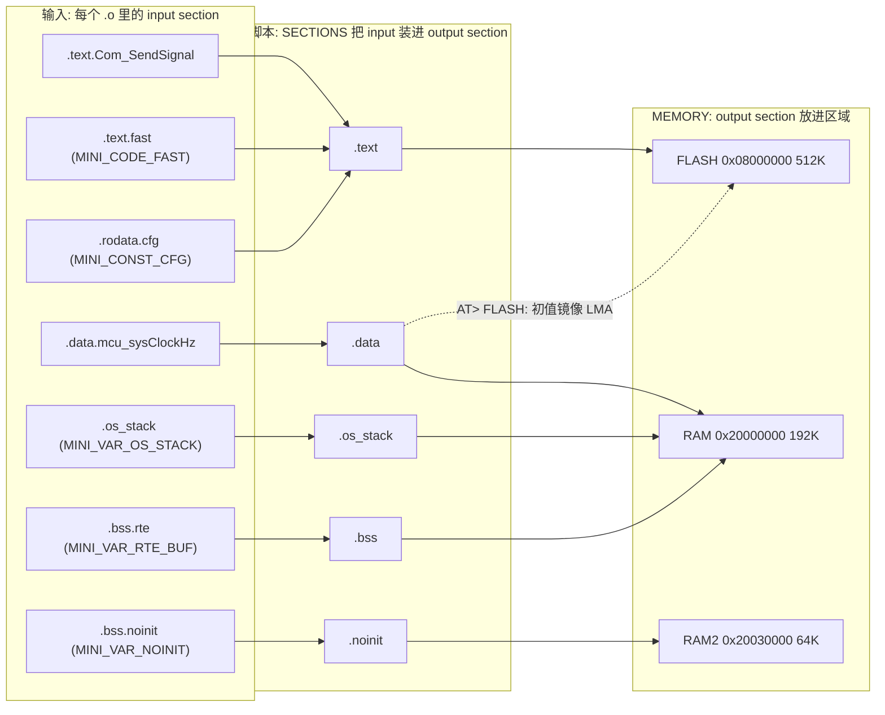

# 08 map / ELF / 链接脚本分析：用编译器自带的工具把镜像"读"出来

> 本章回答：(1) 链接脚本 `stm32l552_autosar.ld` 的每一行在做什么（`MEMORY`、`SECTIONS`、LMA/VMA、`AT>`、`NOLOAD`、`KEEP`、`ALIGN`、`_estack`、`.noinit`、OS 栈、MemMap 段命名）？(2) 怎样读 `.map` 文件：内存配置、段落点、被丢弃的段、交叉引用表分别在哪？(3) 怎样只用 `size / nm / readelf / objdump` 重现 `analyze_image.py` 报告里的每个数字，并动手做三个练习（把缓冲区挪到 RAM2、把栈撑到溢出、用 `--cref` 查谁引用了 `Can_Write`）？(4) 每个概念在 RH850 / GHS 工程里对应什么？
> Prerequisite: [07 启动追踪](07-startup-trace.md)（`_sidata/_sbss/_estack` 的用法）、[02 配置与生成](02-config-and-generation.md)；理论基础 [docs/01-rh850/03 存储器映射](../01-rh850/03-memory-map.md)、[docs/01-rh850/05 链接脚本与 map 文件](../01-rh850/05-linker-script.md)、[docs/reference/p1me-memory-layout-ghs-memmap.md](../reference/p1me-memory-layout-ghs-memmap.md)。   Next: [09 Renode、GDB 与 RH850 移植](09-renode-gdb-and-rh850-porting.md)
> 对应代码（路径相对 `examples/mini_autosar_ecu/`）：`target/stm32l552/linker/stm32l552_autosar.ld`、`include/MemMap.h`、`target/stm32l552/startup/startup.c`、`tools/analyze_image.py`、`tools/BINUTILS_CHEATSHEET.md`、`tools/run_mini_autosar.py:144-146,201-204`；产物 `artifacts/mini-autosar/target/LightEcu/LightEcu.{elf,map,link.log}`、`artifacts/mini-autosar/analysis/LightEcu.{md,txt}`
> 对应规范（R25-11）：AUTOSAR **Memory Mapping SWS**（`AUTOSAR_CP_SWS_MemoryMapping.txt`：`<MIP>_START_SEC_<TYPE>` / `STOP_SEC` 机制）；本仓库对 GHS 语法的说明均为 `[Conceptual]`，见 [p1me-memory-layout-ghs-memmap.md](../reference/p1me-memory-layout-ghs-memmap.md) 开头的限制声明。   深入阅读：[docs/02-autosar-classic/05 生成代码与 MemMap](../02-autosar-classic/05-generated-code.md)、[docs/10-boot-debug/05 §6 烧写之前：map 文件 / ELF 静态检查](../10-boot-debug/05-startup-code-failure-points.md)

---

## 1. 本章要回答的问题

做嵌入式 AUTOSAR 项目，**"镜像里到底有什么、放在哪里"** 是每次集成都要回答的问题：

- 这个变量为什么在 RAM2、不是 RAM？它会被启动代码清零吗？
- 栈是不是快溢出了？谁占了最多 RAM？
- FLASH 用了 3.2%，那 `.data` 的初值藏在哪？
- 某个函数明明写了，为什么链接后"消失"了？
- 有人说"谁调用了 `Can_Write`"，怎么从二进制里**证明**而不是靠 grep 源码？

这些问题的答案都在**链接脚本 + map 文件 + ELF** 里，工具就是 GNU binutils（`arm-none-eabi-size/nm/readelf/objdump`）。本章把它们和 `analyze_image.py` 一一对应起来。

> `[Educational Implementation]` 本章所有命令输出都是我在 2026-10-02/03 对 `artifacts/mini-autosar/target/LightEcu/LightEcu.elf` 实际运行的结果。**数字会随你重新构建而变化**（但在代码不变时应当一致）。

---

## 2. 直觉理解：链接器是个"装箱员"



三个词，必须分清：

| 术语 | 含义 | 在本项目 |
|---|---|---|
| **input section** | 每个 `.o` 里编译器产生的段，名字来自 `-ffunction-sections`（`.text.<函数名>`）、`-fdata-sections`（`.data.<变量名>`）、`__attribute__((section("...")))` | `.text.Com_SendSignal`、`.bss.rte` |
| **output section** | 链接脚本里 `SECTIONS { 名字 : { ... } > 区域 }` 定义的段，最终出现在 ELF 的段表里 | `.text`、`.data`、`.os_stack` |
| **region（MEMORY）** | 地址空间里的一块，有属性 `rwx` | `FLASH`、`RAM`、`RAM2` |

**VMA** = 运行时的地址（CPU 访问变量时用的地址）；**LMA** = 装载地址（镜像里存放的位置）。对 `.text` 两者相同；对 `.data`，**VMA 在 RAM、LMA 在 FLASH**——这就是为什么需要启动代码把它从 FLASH 搬到 RAM（第 7 章 §4.2）。

---

## 3. 编译与链接选项：这些 map 是怎么产生的

`tools/run_mini_autosar.py` 的目标构建选项（`tools/run_mini_autosar.py:144-146` 编译、`:201-204` 链接）：

```text
编译: arm-none-eabi-gcc -mcpu=cortex-m33 -mthumb -Os -ffunction-sections -fdata-sections -DMINI_PLATFORM_TARGET
      -std=c99 -Wall -Wextra -Werror -Wno-unused-parameter -g -DMINI_ECU_B -pedantic  -c x.c
链接: arm-none-eabi-gcc <所有 .o> -o LightEcu.elf -Wl,-Map=LightEcu.map -Wl,--cref
      -mcpu=cortex-m33 -mthumb -nostartfiles --specs=nano.specs --specs=nosys.specs
      -Wl,--gc-sections -Wl,--print-memory-usage -T<...>/stm32l552_autosar.ld
```

| 选项 | 作用 | 影响你读 map 的地方 |
|---|---|---|
| `-ffunction-sections` / `-fdata-sections` | 每个函数/变量一个 input section（`.text.xxx`、`.data.xxx`、`.bss.xxx`） | map 里能按函数看大小；**也是 `--gc-sections` 能逐函数回收的前提** |
| `-Wl,--gc-sections` | 回收**未被引用**的 input section | map 的 "Discarded input sections"；也是 `KEEP()` 存在的原因（§4.2） |
| `-Wl,-Map=...` | 生成 map | 本章主角 |
| `-Wl,--cref` | map 末尾追加"交叉引用表" | §6.4、练习 3 |
| `-Wl,--print-memory-usage` | 链接结束打印各区域占用 | `LightEcu.link.log`，§6.1 |
| `-nostartfiles` | 不用工具链自带 `crt0`，用我们的 `Reset_Handler` | 入口是 `ENTRY(Reset_Handler)` |
| `--specs=nano.specs --specs=nosys.specs` | newlib-nano、空系统调用 | 库代码（`memset`、`__udivmoddi4`）来自 libc/libgcc |

---

## 4. 链接脚本逐行走读：`stm32l552_autosar.ld`

文件只有 104 行。下面按顺序读（行号是 `target/stm32l552/linker/stm32l552_autosar.ld` 的行号）。

### 4.1 入口、区域、符号（`:25-34`）

```text
ENTRY(Reset_Handler)

MEMORY
{
  FLASH (rx)  : ORIGIN = 0x08000000, LENGTH = 512K
  RAM   (rwx) : ORIGIN = 0x20000000, LENGTH = 192K
  RAM2  (rw)  : ORIGIN = 0x20030000, LENGTH = 64K
}

_stack_size = 0x1000;   /* 4 KB main stack (MSP): idle loop + nested ISR frames */
```

| 行 | 含义 |
|---|---|
| `:25` `ENTRY(Reset_Handler)` | ELF 入口地址 = `Reset_Handler`（`readelf -h` 的 `Entry point 0x8003415`，低位 1 = Thumb）。真正上电入口是**向量表第 1 项**，`ENTRY` 主要给调试器/加载器看 |
| `:27-32` `MEMORY` | 三个区域：`FLASH (rx)` 512 KB @ `0x08000000`、`RAM (rwx)` 192 KB（SRAM1）@ `0x20000000`、`RAM2 (rw)` 64 KB（SRAM2）@ `0x20030000`。**属性**决定 ld 是否允许把某类段放进去：`rx` 区域不放可写段；`RAM2` 无 `x`，不能放代码 |
| `:34` `_stack_size = 0x1000;` | 在 `SECTIONS` **外面**给符号赋值 = **绝对符号**（`nm` 里类型 `A`）。map 里是 `0x00001000  _stack_size = 0x1000` |

`MEMORY` 的数字要和硬件一致（"Verify against RM0438 for real hardware"，文件头注释）。它在 map 里被原样回显（`LightEcu.map` 第 355-361 行，已把对象文件路径省略）：

```text
Memory Configuration

Name             Origin             Length             Attributes
FLASH            0x08000000         0x00080000         xr
RAM              0x20000000         0x00030000         xrw
RAM2             0x20030000         0x00010000         rw
*default*        0x00000000         0xffffffff
```

`Length 0x00080000` = 512 KB；`0x00030000` = 192 KB；`0x00010000` = 64 KB。`*default*` 是 ld 的兜底区域，不用管。**读 map 的第一件事就是核对这张表**——`analyze_image.py` 的第 1 节会把它和链接脚本里的 `MEMORY{}` 对比，不一致就告警"stale map?"（`tools/analyze_image.py:327`）。

### 4.2 `.isr_vector`（`:38-41`）：KEEP 与对齐

```text
  .isr_vector : ALIGN(4)
  {
    KEEP(*(.isr_vector))
  } > FLASH
```

- **`KEEP(...)`**：`--gc-sections` 会回收"没有被任何东西引用"的 input section。向量表只被**硬件**引用（复位时 CPU 读 `0x08000000`），链接器看不到引用，所以不加 `KEEP` 它会被当死代码删掉。`target/stm32l552/startup/startup.c:57` 虽然写了 `used` 属性（`__attribute__((section(".isr_vector"), used, aligned(512)))`），但 **`used` 只告诉编译器别删，不告诉链接器**——这是 §7 练习 1 里踩的同一个坑。
- **`ALIGN(4)`** 是 output section 的最小对齐；**实际的 512 字节对齐来自 input section**：`aligned(512)`（`target/stm32l552/startup/startup.c:57`）。`readelf -S` 的 `Al` 列是 512 就是这个。原因是 Cortex-M 的 VTOR 要求向量表对齐到不小于表大小的 2 的幂（500 B → 512 B）。

### 4.3 `.text`（`:43-50`）：模式顺序就是放置顺序

```text
  .text : ALIGN(4)
  {
    *(.text.fast*)
    *(.text*)
    *(.rodata.cfg*)
    *(.rodata*)
    . = ALIGN(4);
  } > FLASH

  _sidata = LOADADDR(.data);
```

- **模式的先后决定放置顺序，且"先匹配先得"**：`*(.text.fast*)` 必须在 `*(.text*)` 之前，否则 `.text.fast`（`MINI_CODE_FAST`，ISR 与调度器代码）会被后者吞掉，失去"成组"的效果；同理 `*(.rodata.cfg*)`（`MINI_CONST_CFG`，生成的配置表）要在 `*(.rodata*)` 之前。真实 map 里 `.text` 的开头（第 429-436 行）就是 `.text.fast` 的条目：

```text
                0x00001000                        _stack_size = 0x1000

.isr_vector     0x08000000      0x1f4
 *(.isr_vector)
 .isr_vector    0x08000000      0x1f4 <obj>\target__stm32l552__startup__startup.c.o
                0x08000000                g_vectors

.text           0x080001f4     0x3f88
 *(.text.fast*)
 .text.fast     0x080001f4        0x4 <obj>\gen__LightEcu__Rte_Tasks.c.o
                0x080001f4                Os_Isr_Isr_CanRx
 .text.fast     0x080001f8       0x14 <obj>\os__port__cm33__Mini_Time_Target.c.o
                0x080001f8                SysTick_Handler
 .text.fast     0x0800020c       0xd4 <obj>\os__port__cm33__Os_Port_Cm33.c.o
                0x0800020c                Mini_Time_TickHook
```

- 这段显示：`.isr_vector` 在 `0x08000000`，大小 `0x1f4` = 500；紧接着 `.text` 在 `0x080001f4`（向量表之后立刻接上，因为 `.isr_vector` 的大小 500 已是 4 的倍数）。`.text.fast` 条目（`Os_Isr_Isr_CanRx`、`SysTick_Handler`、`Mini_Time_TickHook`、`PendSV_Handler` …）共 236 字节（`analysis/LightEcu.md` 第 6 节）。
- `*(.rodata.cfg*)` 的落点（第 955-961 行）：

```text
 *(.rodata.cfg*)
 .rodata.cfg    0x080037e0        0x2 <obj>\gen__LightEcu__Adc_Cfg.c.o
 *fill*         0x080037e2        0x2 
 .rodata.cfg    0x080037e4       0xbc <obj>\gen__LightEcu__BswM_Cfg.c.o
 .rodata.cfg    0x080038a0       0x40 <obj>\gen__LightEcu__Can_Cfg.c.o
 .rodata.cfg    0x080038e0       0x30 <obj>\gen__LightEcu__CanIf_Cfg.c.o
 .rodata.cfg    0x08003910       0xb4 <obj>\gen__LightEcu__Com_Cfg.c.o
```

  这里可以看到 `*fill*  0x080037e2  0x2`：`Adc_Cfg` 的表只有 2 字节，下一个（4 字节对齐）从 `0x080037e4` 开始，中间 2 字节是**对齐填充**。`analyze_image.py` 把它们归入 `(alignment fill)` 一行。
- `:52` `_sidata = LOADADDR(.data);`：**取 `.data` 的 LMA**（即它在 FLASH 里的位置）赋给符号，供 `Reset_Handler` 复制用（`target/stm32l552/startup/startup.c:87`）。`LOADADDR` 要在 `.data` 之后才有确定值，但 ld 允许前向引用。

### 4.4 `.data`（`:54-60`）：`AT>` = VMA 与 LMA 分离

```text
  .data : ALIGN(4)
  {
    _sdata = .;
    *(.data*)
    . = ALIGN(4);
    _edata = .;
  } > RAM AT > FLASH
```

- `> RAM` 指定 **VMA** 区域，`AT > FLASH` 指定 **LMA** 区域：变量**运行时**在 RAM，**初值镜像**存在 FLASH。
- `_sdata`/`_edata` 是 VMA 边界（RAM 里的 `0x20000000..0x2000000c`），`_sidata` 是 LMA 起点（`0x0800417c`）。`Reset_Handler` 就是 `for (dst = &_sdata; dst < &_edata;) *dst++ = *src++;`（`target/stm32l552/startup/startup.c:87-90`）。
- 真实 map（第 1158、1178-1198 行附近）：

```text
.data           0x20000000        0xc load address 0x0800417c
                0x20000000                        _sdata = .
 *(.data*)
 .data.ecum_state
                0x20000000        0x1 <obj>\bsw__ecum__EcuM.c.o
 .data.iohwab_lastLight
                0x20000001        0x1 <obj>\ecual__iohwab__IoHwAb.c.o
 .data.mcu_resetReason
                0x20000002        0x1 <obj>\mcal__mcu__Mcu.c.o
 *fill*         0x20000003        0x1 
 .data.mcu_sysClockHz
                0x20000004        0x4 <obj>\mcal__mcu__Mcu.c.o
 .data.Os_Running
                0x20000008        0x1 <obj>\os__src__Os_Core.c.o
                0x20000008                Os_Running
                0x2000000c                        . = ALIGN (0x4)
 *fill*         0x20000009        0x3 
                0x2000000c                        _edata = .

.igot.plt       0x2000000c        0x0 load address 0x08004188
 .igot.plt      0x2000000c        0x0 <obj>\bsw__bswm__BswM.c.o
```

  `.data  0x20000000  0xc  load address 0x0800417c`：**这一行里同时出现 VMA、大小和 LMA**。内容只有 12 字节：`ecum_state`、`iohwab_lastLight`、`mcu_resetReason`、`mcu_sysClockHz`、`Os_Running` 等 5 个有初值的变量（其余全是 `.bss`——AUTOSAR 项目的"有初值"变量很少，大部分初值靠 `Xxx_Init()` 设置）。
- `.igot.plt` 是 ld 为 IFUNC 预留的 0 字节空段，无害。

### 4.5 `.os_stack`（`:62-68`）：NOLOAD 与"为什么 LMA 在 FLASH 末尾"

```text
  .os_stack (NOLOAD) : ALIGN(8)
  {
    __os_stack_start = .;
    *(.os_stack*)
    . = ALIGN(8);
    __os_stack_end = .;
  } > RAM
```

- **`(NOLOAD)`**：该段在镜像文件里**没有内容**（ELF 类型 `NOBITS`，`readelf -S` 里 `.os_stack NOBITS`），只在运行时占地址空间——所以也**不会被 `Reset_Handler` 清零**（它只清 `_sbss.._ebss`）。内核在 `Os_Port_Init` 里把它涂成 `0xDEADBEEF`（`os/port/cm33/Os_Port_Cm33.c:113-122`），之后靠"第一个不是 `0xDEADBEEF` 的字"做栈水位（`Os_Port_StackUsage`，`:349-363`；GDB 的 `mini_stacks`）。
- 内容来自 `MINI_VAR_OS_STACK`（`include/MemMap.h:22` 的 `__attribute__((section(".os_stack"), aligned(8)))`）：生成的 `gen/LightEcu/Os_Cfg.c:26-29`（4 个任务栈，共 4608 B）和 `os/port/cm33/Os_Port_Cm33.c:67` 的 `s_idleStack`（256 B）。`__os_stack_start/__os_stack_end` 两个符号供调试器/分析脚本使用。
- **一个有趣的现象**：`objdump -h` 里 `.os_stack` 的 LMA 是 `08004188`，**不等于 VMA `20000010`**，也不是 RAM 的地址：

```text

artifacts/mini-autosar/target/LightEcu/LightEcu.elf:     file format elf32-littlearm

Sections:
Idx Name          Size      VMA       LMA       File off  Algn
  0 .isr_vector   000001f4  08000000  08000000  00001000  2**9
                  CONTENTS, ALLOC, LOAD, READONLY, DATA
  1 .text         00003f88  080001f4  080001f4  000011f4  2**2
                  CONTENTS, ALLOC, LOAD, READONLY, CODE
  2 .data         0000000c  20000000  0800417c  00006000  2**2
                  CONTENTS, ALLOC, LOAD, DATA
  3 .os_stack     00001300  20000010  08004188  00006010  2**3
                  ALLOC
  4 .noinit       00000000  20030000  20030000  00000000  2**2
                  ALLOC
  5 .bss          000004e8  20001310  20001310  00006310  2**3
```

  这是 ld 的**默认 LMA 启发式**（ld 手册 "Output Section LMA"）：没写 `AT` 的段，若所在区域里已有一个带 `AT>` 的段，则**保持与上一个段相同的 VMA−LMA 偏移**。`.os_stack` 紧跟在 `.data` 之后，所以它的 LMA = `0x20000010 + (0x0800417c − 0x20000000) = 0x08004188`。因为是 NOLOAD（`FileSiz = 0`），**不占 FLASH 空间**，但 `readelf -l` 会给它一个 `FileSiz=0` 的 PT_LOAD（第二个 LOAD 下面那个）：

```text

Elf file type is EXEC (Executable file)
Entry point 0x8003415
There are 4 program headers, starting at offset 52

Program Headers:
  Type           Offset   VirtAddr   PhysAddr   FileSiz MemSiz  Flg Align
  LOAD           0x001000 0x08000000 0x08000000 0x0417c 0x0417c R E 0x1000
  LOAD           0x006000 0x20000000 0x0800417c 0x0000c 0x0000c RW  0x1000
  LOAD           0x000010 0x20000010 0x08004188 0x00000 0x01300 RW  0x1000
  LOAD           0x000310 0x20001310 0x20001310 0x00000 0x014e8 RW  0x1000

 Section to Segment mapping:
  Segment Sections...
   00     .isr_vector .text 
   01     .data 
   02     .os_stack 
   03     .bss .stack 
```

  Renode 日志里也能看到它：`ECU_B/sysbus: Loading block of 4864 bytes length at 0x8004188.`（`artifacts/mini-autosar/renode/renode.log`）——Renode 按 `MemSiz` 把这块"装载"成 0，无害（`DESIGN.md` §17 第 18 项）。
- 我验证了这个启发式：把链接脚本里夹在中间的 `.noinit` 段整个删掉（只在临时副本里做），`.bss` 与 `.stack` 的 LMA 也变成了 `08004188`：

```text
  2 .data         0000000c  20000000  0800417c  00006000  2**2
  3 .os_stack     00001300  20000010  08004188  00006010  2**3
  4 .bss          000004e8  20001310  08004188  00006310  2**3
  5 .stack        00001000  200017f8  08004188  000067f8  2**3
```

  而在真实脚本里 `.bss`/`.stack` 的 LMA 等于 VMA（见上面 `objdump -h`），因为中间插进了一个 `> RAM2` 的 `.noinit`，打断了偏移的继承。**结论**：想要"NOLOAD 段的 LMA 干净"，最好给它显式写 `AT> RAM`，或把所有 NOLOAD 段放在 `.data` **之前**。在 GHS 里这个问题以另一种形式存在：非初始化段本来就没有 ROM 镜像（`ROM()` 才产生镜像）。

### 4.6 `.noinit`（`:70-77`）：为什么必须排在 `.bss` 之前

```text
  .noinit (NOLOAD) : ALIGN(4)
  {
    __noinit_start = .;
    *(.bss.noinit*)
    *(.noinit*)
    . = ALIGN(4);
    __noinit_end = .;
  } > RAM2
```

- 两个模式：`*(.bss.noinit*)`（`MINI_VAR_NOINIT` 展开成 `__attribute__((section(".bss.noinit")))`，`include/MemMap.h:21`）和 `*(.noinit*)`。**它们要在 `.bss` 段之前出现**：因为 `.bss` 段里有 `*(.bss*)`，`.bss.noinit` 也匹配这个模式，"先匹配先得"——排在后面会被吞进 `.bss`，然后被 `Reset_Handler` 清零，"掉电保留"的语义就没了（`DESIGN.md` §13.4 表格）。
- 放在 **`RAM2`**（SRAM2，64 KB）：**与 RAM 物理分离**，复位后是否保留由硬件与选项决定（本项目未验证，`[Real Project Consideration]`）。
- 当前这个镜像里 **`.noinit` 为空**：没有任何模块用 `MINI_VAR_NOINIT`（`analysis/LightEcu.md` 第 6 节的 `.bss.noinit` 一行 Size 0，第 10 节也有"Notes"）。练习 1 会让它第一次被用上。

### 4.7 `.bss`（`:79-92`）：符号"书挡"和通配符的陷阱

```text
  .bss (NOLOAD) : ALIGN(4)
  {
    _sbss = .;
    __rte_buf_start = .;
    *(.bss.rte*)
    __rte_buf_end = .;
    __com_buf_start = .;
    *(.bss.com*)
    __com_buf_end = .;
    *(.bss*)
    *(COMMON)
    . = ALIGN(4);
    _ebss = .;
  } > RAM
```

- 先 `.bss.rte*`（`MINI_VAR_RTE_BUF`，RTE 缓冲/PIM/模式变量）、再 `.bss.com*`（`MINI_VAR_COM_BUF`，Com I-PDU 缓冲）、最后 `.bss*` 与 `COMMON`。`__rte_buf_start/end`、`__com_buf_start/end` 是**"书挡"符号**：夹出一块连续区，方便 map/调试器识别、将来也能给 MPU 分区。
- `_sbss`/`_ebss`：`Reset_Handler` 清零的范围（第 7 章 §4.2）。
- **通配符的陷阱（我在 map 里发现的）**：`-fdata-sections` 让 `Com.c` 里的 `static` 变量各自成段：`.bss.com_rxPending`、`.bss.com_txCountdownMs`、`.bss.com_groupMask`、`.bss.com_status`、`.bss.com_cfg`——它们**也匹配 `*(.bss.com*)`**。真实 map（第 1226-1239 行）：

```text
                0x20001331                        __com_buf_start = .
 *(.bss.com*)
 .bss.com_rxPending
                0x20001331        0x4 <obj>\bsw__com__Com.c.o
 *fill*         0x20001335        0x1 
 .bss.com_txCountdownMs
                0x20001336        0x8 <obj>\bsw__com__Com.c.o
 .bss.com_groupMask
                0x2000133e        0x1 <obj>\bsw__com__Com.c.o
 .bss.com_status
                0x2000133f        0x1 <obj>\bsw__com__Com.c.o
 .bss.com_cfg   0x20001340        0x4 <obj>\bsw__com__Com.c.o
 .bss.com       0x20001344        0xa <obj>\gen__LightEcu__Com_Cfg.c.o
                0x2000134e                        __com_buf_end = .
```

  于是 `__com_buf_start..__com_buf_end` = `0x20001331..0x2000134e` = **29 字节**，而真正的 Com I-PDU 缓冲 `.bss.com`（`Com_Cfg.c` 里的 `Com_Buf_*`，`MINI_VAR_COM_BUF`）只有 10 字节（`0x20001344..0x2000134e`）。**前 19 字节是 `Com.c` 的内部 static 变量，被通配符"顺手"收进来了**。这无害（都在 `.bss`，同样被清零），但说明：**节名前缀通配要小心与 `-fdata-sections` 生成的名字冲突**。`analyze_image.py` 第 6 节同时打印了"`.bss.com` 的 Range = `0x20001344..0x2000134e`"和"`__com_buf_start = 0x20001331`"，两个数字不一致就是这个原因。真实项目里 MemMap 的节名通常带模块与类别前缀（如 `.bss.Com_VAR_CLEARED_8`），就是为了避免这种冲突。

### 4.8 `.stack`（`:94-99`）：符号赋值与地址计数器

```text
  .stack (NOLOAD) : ALIGN(8)
  {
    __stack_start = .;
    . = . + _stack_size;
    _estack = .;
  } > RAM

  /DISCARD/ : { *(.ARM.exidx*) *(.ARM.extab*) }

  ASSERT(_estack <= ORIGIN(RAM) + LENGTH(RAM), "RAM overflow: .data/.bss/.os_stack/.stack do not fit SRAM1")
}
```

- `. = . + _stack_size;`：**移动位置计数器** `.`，等于"在这里空出 4096 字节"；`_estack = .` 记下栈顶。真实 map：`.stack 0x200017f8 0x1000`，`_estack = 0x200027f8`，向量表第 0 项就是它（`target/stm32l552/startup/startup.c:59`）。
- 它是 `NOLOAD`，且放在 **`.bss` 之后**（地址更高）。Cortex-M 栈**向下**生长，所以 MSP 主栈溢出时先踩到的是 `.bss` 的尾部——`.bss` 是 RAM 里最后一块，溢出会悄悄破坏运行时数据而不是立刻触发 fault。**这是和 RH850 推荐布局相反的地方**：[p1me-memory-layout-ghs-memmap.md §2.2](../reference/p1me-memory-layout-ghs-memmap.md) 建议把栈放在 RAM **低端**，溢出时冲向区外 reserved 区（触发总线错误/MPU 违规）而不是悄悄踩坏数据。本项目 MSP 只用于复位、ISR 和 PendSV，任务栈在最低地址的 `.os_stack`（`0x20000010` 起），**它们**溢出会冲向 `.data`（12 字节）然后是区外——OS 另有栈底 canary（`os/port/cm33/Os_Port_Cm33.c:326-346` 的 `Os_Port_StackCheck`）作保险。
- `/DISCARD/`（`:101`）：把 `.ARM.exidx*`/`.ARM.extab*`（C++ 异常展开表）直接丢掉。
- **`ASSERT`**（`:103`）：链接期断言。`_estack <= ORIGIN(RAM) + LENGTH(RAM)`；失败时链接器输出这条消息并**失败**（练习 2 里亲眼看到）。map 里它显示为 `0x00000001 ASSERT (...)`（第 1364 行）：值 1 表示断言通过。

### 4.9 MemMap：节名从哪里来

`include/MemMap.h:20-34` 是 AUTOSAR MemMap 的 GCC 版：

```c
#if defined(MINI_PLATFORM_TARGET)
  #define MINI_VAR_NOINIT     __attribute__((section(".bss.noinit")))             /* survives warm reset (RAM2) */
  #define MINI_VAR_OS_STACK   __attribute__((section(".os_stack"), aligned(8)))   /* OS task stacks             */
  #define MINI_VAR_RTE_BUF    __attribute__((section(".bss.rte")))                /* RTE buffers (zeroed)       */
  #define MINI_VAR_COM_BUF    __attribute__((section(".bss.com")))                /* Com I-PDU buffers (zeroed) */
  #define MINI_CODE_FAST      __attribute__((section(".text.fast")))              /* ISR / dispatcher code      */
  #define MINI_CONST_CFG      __attribute__((section(".rodata.cfg")))             /* generated config tables    */
#else
  #define MINI_VAR_NOINIT
  #define MINI_VAR_OS_STACK
  #define MINI_VAR_RTE_BUF
  #define MINI_VAR_COM_BUF
  #define MINI_CODE_FAST
  #define MINI_CONST_CFG
#endif
```

AUTOSAR 真正的机制是 `#define <MIP>_START_SEC_<TYPE>` + `#include "<MIP>_MemMap.h"` 展开成编译器 `#pragma`（见 [p1me-memory-layout-ghs-memmap.md §4](../reference/p1me-memory-layout-ghs-memmap.md)）。GCC 没有可压栈的 `#pragma section`，所以本项目用**属性宏放在定义前**，**节类别一一对应**：

| 本项目宏（`include/MemMap.h`） | 真实 MemMap 节类别 `[AUTOSAR Standard]` | 输出到 |
|---|---|---|
| `MINI_VAR_NOINIT`（`:21`） | `<MIP>_START_SEC_VAR_NO_INIT_<ALIGN>` | `.noinit` / RAM2 |
| `MINI_VAR_OS_STACK`（`:22`） | OS 任务栈：真实 OS（RTA-OS 等）自带的专用节 | `.os_stack` |
| `MINI_VAR_RTE_BUF`（`:23`） | `<RTE>_START_SEC_VAR_CLEARED_<ALIGN>` | `.bss` 内的 `.bss.rte` |
| `MINI_VAR_COM_BUF`（`:24`） | `COM_START_SEC_VAR_CLEARED_8` | `.bss` 内的 `.bss.com` |
| `MINI_CODE_FAST`（`:25`） | `<MIP>_START_SEC_CODE_FAST` | `.text` 开头 |
| `MINI_CONST_CFG`（`:26`） | `<MIP>_START_SEC_CONST_<ALIGN>`/`CONFIG_DATA` | `.text` 内的 `.rodata.cfg` |

> host 构建里这些宏全是空（`include/MemMap.h:27-34`），host 用默认链接脚本。这是"同一份源码，两个目标"的又一个体现。

---

## 5. 把链接脚本"画"出来：这个镜像的内存布局

用 `nm`/`objdump` 的真实数字画出的布局：

```text
FLASH 0x08000000 ............................................ 512 KB
  0x08000000  .isr_vector  500 B   (g_vectors, 对齐 512)
  0x080001f4  .text        16264 B (.text.fast 236 B, ..., .rodata.cfg 744 B, .rodata)
  0x0800417c  .data 的装载镜像 12 B  (_sidata)
  0x08004188  <-- FLASH 已用 16776 B 的高水位

RAM  0x20000000 ............................................. 192 KB (SRAM1)
  0x20000000  .data        12 B   (_sdata .. _edata=0x2000000c)
  0x20000010  .os_stack    4864 B (4 个任务栈 4608 + idle 256, NOLOAD, 涂 0xDEADBEEF)
  0x20001310  .bss         1256 B (.bss.rte 33 + .bss.com... + 其它; _sbss .. _ebss=0x200017f8)
  0x200017f8  .stack       4096 B (MSP 主栈; _estack = 0x200027f8)
  0x200027f8  <-- RAM 已用 10232 B 的高水位 (5.2 %)

RAM2 0x20030000 ............................................. 64 KB (SRAM2)
  0x20030000  .noinit      0 B    (本镜像未使用)
```

注意：**RAM 的 87.6 % 是栈**（`4608 + 256 + 4096 = 8960`，占 `10228` 字节的 87.6 %，`analysis/LightEcu.md` 第 4 节）。想省 RAM 先看栈。

---

## 6. 读 `.map` 文件：地图在哪

`LightEcu.map` 共 2581 行。它的结构（行号是这份 map 的实际位置）：

| 区段 | 起始行 | 内容 | 怎么用 |
|---|---:|---|---|
| **Archive member included to satisfy reference by file (symbol)** | 1 | 从静态库（`libgcc.a`、`libc_nano.a`）里拉进来了哪些成员、为了满足谁的哪个符号 | 查"为什么多了一个 `__udivmoddi4`"：`Os_Alarm.c` 引用了 `__aeabi_uldivmod`，后者再拉进 `__udivmoddi4`（map 开头 `libgcc.a(_aeabi_uldivmod.o)` / `libgcc.a(_udivmoddi4.o)` 两条） |
| **Discarded input sections** | 12 | `--gc-sections` 回收的段（大小非 0 的才有意义） | 查"这个函数去哪了"：被回收 = 没人引用 |
| **Memory Configuration** | 355 | `MEMORY{}` 的回显 | 核对区域（§4.1） |
| **Linker script and memory map** | 363 | `LOAD` 行（输入文件）→ 符号赋值 → 每个 output section 的每个 input section（地址、大小、来自哪个 `.o`、其中定义的全局符号） | 本章主力：段落点、`load address`、`*fill*`、符号地址 |
| **Cross Reference Table** | 2059 | 每个符号：第一行是**定义**它的目标文件，后面是**引用**它的目标文件 | "谁用了它"（§6.4、练习 3） |

### 6.1 `--print-memory-usage`：最快的一眼

`artifacts/mini-autosar/target/LightEcu/LightEcu.link.log`：

```text
Memory region         Used Size  Region Size  %age Used
           FLASH:       16776 B       512 KB      3.20%
             RAM:       10232 B       192 KB      5.20%
            RAM2:           0 B        64 KB      0.00%
```

`Used Size` 是**区域内最高地址**减去区域起点：FLASH `16776 = 0x4188`（正好是 `.data` 镜像末尾 `0x08004188`），RAM `10232 = 0x27f8`（`_estack - 0x20000000`）——**不是各段大小之和**（段间有对齐空洞；`.data` 12 字节后到 `.os_stack` 之间空了 4 字节）。`size` 的结果是另一套口径，见 §7.1。

### 6.2 "Linker script and memory map"：怎么读一个条目

```text
 .text.com_transmit
                0x08000574       0x64 <obj>\bsw__com__Com.c.o
```

三列：**地址**（VMA）、**大小**、**来自哪个 `.o`**。名字长时地址与大小折到下一行。若该段里定义了全局符号，下面缩进列出（如 `0x080006e4  Com_SendSignal`）。`*fill*` 是对齐填充。**条目顺序就是放置顺序**。所以 `.text` 里模块的先后（`BswM`、`Com`、`Det`、`EcuM`、…）按**链接命令行里 `.o` 的顺序**排列（`run_mini_autosar.py` 的 `sorted` 文件名）。

### 6.3 "Discarded input sections"：`--gc-sections` 到底删了什么

这段（第 12-354 行）列出被丢弃的 input section。我用脚本统计了这份 map：**大小非 0 的丢弃段共 102 个、5366 字节；其中 `.text.*`（函数）86 个、4062 字节**，其余主要是 `.debug_*`（1117 字节，大头来自 `Dio_Cfg.c.o`，该 ECU 的 Dio 配置为空）和少量 `.rodata`（69 字节）及其它小段。被回收的函数都是"实现了 API 但这个应用没用到"的，例如：

```text
 .text.BswM_Deinit          0xc    <obj>\bsw__bswm__BswM.c.o
 .text.BswM_RequestMode     0x60   <obj>\bsw__bswm__BswM.c.o
 .text.Com_IpduGroupStop    0x44   <obj>\bsw__com__Com.c.o
 .text.Com_TriggerTransmit  0x78   <obj>\bsw__com__Com.c.o
 .text.ChainTask            0x78   <obj>\os__src__Os_Task.c.o
```

这正是 **AUTOSAR 项目里"BSW 厂商交付全功能库，集成者靠 gc 删掉没用的"** 的最小演示。**风险**：`--gc-sections` 只看**符号引用**；被硬件引用的东西（向量表、ISR）必须 `KEEP` 或被代码显式引用。`-Wl,-u,<符号>`（`--undefined`）也能强制保留（练习 1 用到）。

### 6.4 "Cross Reference Table"

第 2059 行起。格式：

```text
Symbol                                            File
Can_Write                                         <obj>\mcal__can__Can.c.o
                                                  <obj>\ecual__canif__CanIf.c.o
```

第一个文件是**定义者**（`Can.c.o`），之后是**引用者**（只有 `CanIf.c.o`）。真实输出见 map 第 2148-2149 行，也可由 `analyze_image.py --xref Can_Write` 查询；练习 3 会用它做"证明"。

---

## 7. binutils 动手：每条命令显示什么

`tools/BINUTILS_CHEATSHEET.md` 是命令速查；下面给出**真实输出和读法**（`$E` = `artifacts/mini-autosar/target/LightEcu/LightEcu.elf`，在仓库根目录下执行，前缀 `arm-none-eabi-` 来自 `tools/toolchains/xpack-arm-none-eabi-gcc-15.2.1-1.1/bin/`）。

### 7.1 `size`：两种口径

```
arm-none-eabi-size $E        # Berkeley（默认）
arm-none-eabi-size -A $E     # System-V，每个段一行
```

```text
   text	   data	    bss	    dec	    hex	filename
  16764	     12	  10216	  26992	   6970	artifacts/mini-autosar/target/LightEcu/LightEcu.elf
```

```text
artifacts/mini-autosar/target/LightEcu/LightEcu.elf  :
section             size        addr
.isr_vector          500   134217728
.text              16264   134218228
.data                 12   536870912
.os_stack           4864   536870928
.noinit                0   537067520
.bss                1256   536875792
.stack              4096   536877048
```

**Berkeley 的三个数是个约定，不是物理分区**：

| 列 | 含义 | 本镜像 | 怎么算 |
|---|---|---:|---|
| `text` | 代码 + 只读数据（+ `.data` 的装载镜像不算，它归 `data`） | 16764 | `.isr_vector` 500 + `.text` 16264 |
| `data` | `.data` | 12 | `.data` |
| `bss` | **所有 ALLOC 但无文件内容的段** | 10216 | `.os_stack` 4864 + `.bss` 1256 + `.stack` 4096 |

**注意 `bss` 里包含了 NOLOAD 的 `.os_stack` 与 `.stack`**——这就是 `size` 报的 `bss` 为什么远大于 `.bss` 的 1256 字节。`dec/hex` 是三者之和（26992 = 0x6970）。想知道真正的 FLASH 占用要用 `--print-memory-usage` 或 `-A`（System-V）逐段加。

### 7.2 `nm`：符号与大小

```
arm-none-eabi-nm -S --size-sort $E | tail -12   # 最大的 12 个符号
arm-none-eabi-nm -S -n $E                       # 按地址排序
```

```text
080018e0 00000134 T CanHw_Init
08001e3c 00000168 T Port_Init
08002818 000001b8 T StartOS
08003078 000001f0 T Trace_Log
08000000 000001f4 R g_vectors
2000153c 00000200 b s_q
08003494 00000336 T __udivmoddi4
20000a10 00000400 b Os_Stack_Task_BswMain
20000e10 00000400 b Os_Stack_Task_Init
20000010 00000400 b Os_Stack_Task_LightAct
20000410 00000600 b Os_Stack_Task_LightCtl
200017f8 00001000 B __stack_start
```

列：地址、大小（十六进制）、类型字母、名字。类型：`T/t` 代码、`R/r` 只读、`D/d` 已初始化数据、`B/b` 零初始化（`b` 小写 = `static`，文件内可见）、`A` 绝对、`W` 弱。**读法**：最大的 5 个是四个任务栈和主栈（`Os_Stack_*` 加 `__stack_start` 4096 字节）——**RAM 大户一目了然**。链接器符号也在里面：

```text
00001000 A _stack_size
08000000 000001f4 R g_vectors
08003414 00000050 T Reset_Handler
08004118 00000024 T Os_Config
0800417c A _sidata
20000000 D _sdata
2000000c D _edata
20000010 B __os_stack_start
20001310 B __os_stack_end
20001310 B __rte_buf_start
20001310 B _sbss
20001331 B __com_buf_start
20001331 B __rte_buf_end
2000134e B __com_buf_end
200017f8 B __stack_start
200017f8 B _ebss
200027f8 B _estack
20030000 B __noinit_start
```

对照 §4：`_sidata`（A，绝对值，因为是 `LOADADDR` 的赋值）= `0x0800417c`、`_sdata/_edata`、`_sbss/_ebss`、`__rte_buf_*`、`__com_buf_*`（§4.7 的 29 字节）、`__os_stack_*`、`__stack_start`、`_estack`、`__noinit_start`。**`_stack_size` 是类型 `A`**（`SECTIONS` 之外的赋值）。

### 7.3 `readelf -S`：段表

```text
There are 22 section headers, starting at offset 0x3f22c:

Section Headers:
  [Nr] Name              Type            Addr     Off    Size   ES Flg Lk Inf Al
  [ 0]                   NULL            00000000 000000 000000 00      0   0  0
  [ 1] .isr_vector       PROGBITS        08000000 001000 0001f4 00   A  0   0 512
  [ 2] .text             PROGBITS        080001f4 0011f4 003f88 00  AX  0   0  4
  [ 3] .data             PROGBITS        20000000 006000 00000c 00  WA  0   0  4
  [ 4] .os_stack         NOBITS          20000010 006010 001300 00  WA  0   0  8
  [ 5] .noinit           NOBITS          20030000 000000 000000 00  WA  0   0  4
  [ 6] .bss              NOBITS          20001310 006310 0004e8 00  WA  0   0  8
  [ 7] .stack            NOBITS          200017f8 006310 001000 00  WA  0   0  8
  [ 8] .debug_info       PROGBITS        00000000 00600c 012ccb 00      0   0  1
  [ 9] .debug_abbrev     PROGBITS        00000000 018cd7 0050af 00      0   0  1
  [10] .debug_loclists   PROGBITS        00000000 01dd86 006a1f 00      0   0  1
  [11] .debug_aranges    PROGBITS        00000000 0247a8 000ca0 00      0   0  8
```

关键列：`Type`（`PROGBITS` = 文件里有内容；**`NOBITS` = 文件里没有，运行时才分配**）、`Addr`（VMA）、`Size`、`Flg`（`A` 分配、`W` 可写、`X` 可执行）、`Al`（对齐）。观察：`.isr_vector` 对齐 **512**；`.data` 是 `PROGBITS`（有 12 字节初值）；`.os_stack`、`.noinit`、`.bss`、`.stack` 全是 `NOBITS`。

### 7.4 `readelf -l`：段 ≠ 区

`readelf -l -W $E` 的结果（含 Section to Segment mapping）见 §4.5 的 `o_readelf_l`。**读法**：`VirtAddr` = VMA，`PhysAddr` = LMA。第二行 `LOAD 0x006000 0x20000000 0x0800417c 0x0000c 0x0000c`：**这就是 `.data`**——文件偏移 `0x6000` 处的 12 字节，要装到 `0x0800417c`（FLASH）、运行时在 `0x20000000`（RAM）。烧录工具/Renode 按 `PhysAddr` 写入。`FileSiz=0` 的行是 NOLOAD 段（`MemSiz` 才是它们的大小）。

### 7.5 `objdump -h`：VMA/LMA/文件偏移

见 §4.5 的 `o_objdump_h`。`ALLOC` 但没有 `LOAD`/`CONTENTS` 的段（`.os_stack`、`.noinit`、`.bss`、`.stack`）= 无文件内容；`READONLY, CODE` = 代码。

### 7.6 `objdump -s`：向量表

```
arm-none-eabi-objdump -s -j .isr_vector $E | head
```

```text
Contents of section .isr_vector:
 8000000 f8270020 15340008 11340008 11340008  .'. .4...4...4..
 8000010 11340008 11340008 11340008 11340008  .4...4...4...4..
 8000020 00000000 00000000 00000000 11340008  .............4..
 8000030 11340008 00000000 51020008 f9010008  .4......Q.......
 8000040 83020008 83020008 83020008 83020008  ................
```

小端字，一行 4 个字。对着 §4.2/§4.8 读：word0 = `f8270020` → `0x200027f8` = `_estack` ✓；word1 = `15340008` → `0x08003415` = `Reset_Handler | 1` ✓（Thumb 位）；word2…= `0x08003411` = `Default_Handler | 1`；`0x8000038` 处（word 14）= `0x08000251` = `PendSV_Handler | 1`；`0x800003c`（word 15）= `0x080001f9` = `SysTick_Handler | 1`；`0x8000040` 起（word 16+）= `0x08000283` = `Os_Cm33_IrqEntry | 1`（`nm` 里它在 `0x08000282`）——**整个外部中断段都指向同一地址**（第 6 章 §6.1）。`analyze_image.py` 第 8 节的 "Os_Cm33_IrqEntry 109 项" 就是这么数出来的。

### 7.7 `objdump -d`：读一个任务体和 PendSV

任务体 `Os_Task_Task_LightAct`（`TASK(Task_LightAct)`，`gen/LightEcu/Rte_Tasks.c:123-129`）：

```text
0800145c <Os_Task_Task_LightAct>:
 800145c:	b508      	push	{r3, lr}
 800145e:	f001 ff03 	bl	8003268 <Actuator_OnCmd>
 8001462:	e8bd 4008 	ldmia.w	sp!, {r3, lr}
 8001466:	f001 bdab 	b.w	8002fc0 <TerminateTask>
```

读法：`push {r3, lr}` → `bl Actuator_OnCmd` → `ldmia sp!, {r3, lr}` → `b.w TerminateTask`。**最后一条是 `b.w`（跳转）而不是 `bl`（调用）**：这是**尾调用优化**，`-Os` 把"`return TerminateTask();`"变成了跳转，`TerminateTask` 直接返回到 `Os_Task_Task_LightAct` 的调用者。这也解释了为什么 GDB 回溯里看不到 `TerminateTask` 栈帧。

PendSV 处理函数（`os/port/cm33/Os_Port_Cm33.c:199-216`，`naked` 内联汇编）：

```text
08000250 <PendSV_Handler>:
 8000250:	f3ef 8009 	mrs	r0, PSP
 8000254:	f3bf 8f6f 	isb	sy
 8000258:	e920 4ff0 	stmdb	r0!, {r4, r5, r6, r7, r8, r9, sl, fp, lr}
 800025c:	f04f 0140 	mov.w	r1, #64	@ 0x40
 8000260:	f381 8811 	msr	BASEPRI, r1
 8000264:	f3bf 8f6f 	isb	sy
 8000268:	f7ff ffd2 	bl	8000210 <Os_Cm33_SwitchContext>
 800026c:	f04f 0100 	mov.w	r1, #0
 8000270:	f381 8811 	msr	BASEPRI, r1
 8000274:	e8b0 4ff0 	ldmia.w	r0!, {r4, r5, r6, r7, r8, r9, sl, fp, lr}
 8000278:	f380 8809 	msr	PSP, r0
 800027c:	f3bf 8f6f 	isb	sy
 8000280:	4770      	bx	lr
```

与源码逐条对应：`mrs r0, PSP`（`:202`）→ `isb` → `stmdb r0!, {r4-r11, lr}`（`:204`，保存软件栈帧）→ `mov.w r1, #64; msr BASEPRI, r1`（`:205-206`，`0x40` = `OS_CM33_MAX_SYSCALL_PRIO`）→ `bl Os_Cm33_SwitchContext`（`:208`）→ `msr BASEPRI, #0` → `ldmia.w r0!, {r4-r11, lr}`（`:211`）→ `msr PSP, r0` → `bx lr`（`:214`，`EXC_RETURN`）。整个函数 **0x32 = 50 字节**（`0x08000250..0x08000282`），后面紧跟 `Os_Cm33_IrqEntry`。

**读反汇编的目的**：不是读懂每条指令，而是**确认源码意图在二进制里成立**——栈帧布局、BASEPRI 的值、有没有意外的库调用。

---

## 8. `analyze_image.py`：一份报告怎么对应上面的命令

```
python examples/mini_autosar_ecu/tools/analyze_image.py --ecu LightEcu [--top 20] [--xref Os_Config --xref Can_Write]
```

脚本 625 行，**只**用 `arm-none-eabi-{nm,size,readelf,objdump}` 与 map 解析（`tools/analyze_image.py:1-26` 文件头）。输出 `artifacts/mini-autosar/analysis/LightEcu.md/.txt`。下表把每一节对应到手工命令和脚本里的函数：

| 报告节 | 内容 | 对应手工命令 / 数据源 | 实现位置 |
|---|---|---|---|
| 1 Memory regions | 各区域 Used/Free/% | `--print-memory-usage` / map 的 Memory Configuration；链接脚本的 `MEMORY{}` | `parse_ld`（`:123`）、`parse_map_regions`（`:142`）；`analyze` 的第 1 节（`:354-370`，`FULL_WARN_PCT = 80.0`，`:40`） |
| 2 Output sections | VMA/LMA/大小/区域；`.data` 的 LMA≠VMA 高亮 | `objdump -h` | `parse_objdump_h`（`:229`） |
| 3 Program headers | PT_LOAD、PhysAddr≠VirtAddr | `readelf -l -W` | `parse_segments`（`:253`） |
| 4 Per-module | 每个模块的 Code/RO/data/bss/栈/Flash/RAM | **map 的 input section 表**，按 `.o` 文件名映射到模块 | `parse_map_sections`（`:162`）、`MODULE_RULES`（`:265`）、`module_of`（`:289`） |
| 5 Top-N symbols | 最大符号 | `nm -S --size-sort -C` | `parse_nm`（`:242`） |
| 6 MemMap sections | `.text.fast .rodata.cfg .bss.rte .bss.com .bss.noinit .os_stack` 落点 | map 的 input section 条目 | `analyze` 第 6 节（`:456-480`） |
| 7 Stacks | 任务栈地址/大小 + 主栈 | `nm` 的 `Os_Stack_*`、`__stack_start/_estack` | `analyze` 第 7 节（`:481-503`） |
| 8 Vectors | 向量表校验、`Reset_Handler`、`_estack`、IRQ 直方图 | `objdump -s -j .isr_vector`、`readelf -h`、`objdump -d --disassemble=Reset_Handler` | `analyze` 第 8 节（`:504-551`） |
| 9 Cross reference | `--xref` 指定的符号 | map 的 Cross Reference Table | `parse_cref`（`:211`） |
| 10 Warnings | 孤儿段、区域>80%、`.data` 无 LMA、向量表未对齐… | 全部上面 | `analyze` 内 `warnings.append`（`:327,365,389,395,399,401,406,496,518,527,539,544`） |

**告警列表**（`:565-574`）值得记住——它们是"从 map 能机械检查出的错误"的清单：

1. MEMORY{} 与 map 的 Memory Configuration 不一致 → map 是旧的。
2. 区域 > 80 %。
3. **孤儿段**：output section 不在链接脚本里，被 ld 的默认规则放了。
4. `.data` 没有 FLASH 里的 LMA（初值会丢）。
5. `_sidata`/`_sdata` 符号与 `.data` 的 LMA/VMA 不一致。
6. map 与 ELF 对某个段的说法不一致。
7. 向量表没对齐到 512 B；向量项与符号表不一致；入口不是 `Reset_Handler`。

我还用脚本"制造"了两个告警（§9 练习 4），可以看到它们真的会触发。

---

## 9. 练习（全部在临时目录里做，**不修改仓库文件**；我已把每个都跑过，输出是真实的）

下面所有"重新链接"的命令都是同一个模板（对应 `tools/run_mini_autosar.py:201-204`）。在 `examples/mini_autosar_ecu/` 下，设：

```
ARM=../../tools/toolchains/xpack-arm-none-eabi-gcc-15.2.1-1.1/bin/arm-none-eabi-gcc
OBJ=../../artifacts/mini-autosar/target/LightEcu          # 构建产生的 .o
LD=target/stm32l552/linker/stm32l552_autosar.ld
LINK="-mcpu=cortex-m33 -mthumb -nostartfiles --specs=nano.specs --specs=nosys.specs -Wl,--gc-sections -Wl,--print-memory-usage"
```

### 练习 1：用 section 属性把一个缓冲区挪到 RAM2，并在 map 里验证

1. 新建 `extra.c`（放哪都行）：

   ```c
   #include <stdint.h>
   __attribute__((section(".bss.noinit"))) uint8_t g_scratch_buf[1024];   /* = MINI_VAR_NOINIT uint8_t g_scratch_buf[1024]; */
   ```

2. 编译并链接（先**不加** `-Wl,-u`）：

   ```
   $ARM -mcpu=cortex-m33 -mthumb -Os -ffunction-sections -fdata-sections -c extra.c -o extra.o
   $ARM $OBJ/*.o extra.o -o ex1.elf -Wl,-Map=ex1.map $LINK -T$LD
   ```

   **结果（真实）**：

   ```text
   Memory region         Used Size  Region Size  %age Used
              FLASH:       16776 B       512 KB      3.20%
                RAM:       10232 B       192 KB      5.20%
               RAM2:           0 B        64 KB      0.00%
   ```

   **RAM2 仍是 0 B**——缓冲区**不见了**。原因：没有任何代码引用 `g_scratch_buf`，`--gc-sections` 把它的 input section（`.bss.noinit`）回收了（同一个坑：`__attribute__((used))` 也没用，它只管编译器；`retain` 属性在这个 GCC 配置里被忽略，警告 `'retain' attribute ignored`）。

3. 让它"被引用"：真实代码里就是有函数在用它；练习里用 `-Wl,-u,g_scratch_buf`（`--undefined`：把符号标成"被引用"）重链：

   ```
   $ARM $OBJ/*.o extra.o -o ex1.elf -Wl,-Map=ex1.map -Wl,-u,g_scratch_buf $LINK -T$LD
   ```

   **结果（真实）**：

   ```text
              FLASH:       16776 B       512 KB      3.20%
                RAM:       10232 B       192 KB      5.20%
               RAM2:          1 KB        64 KB      1.56%
   ```

4. 在 map 里验证（`grep -n "^\.noinit" -A8 ex1.map`）：

   ```text
   .noinit         0x20030000      0x400
                   0x20030000                        __noinit_start = .
    *(.bss.noinit*)
    .bss.noinit    0x20030000      0x400 extra.o
                   0x20030000                g_scratch_buf
    *(.noinit*)
                   0x20030400                        . = ALIGN (0x4)
                   0x20030400                        __noinit_end = .
   ```

   `nm -S ex1.elf | grep scratch` → `20030000 00000400 B g_scratch_buf`；`objdump -h ex1.elf` 的 `.noinit` 行：`00000400  20030000  20030000  00007000  2**2` + `ALLOC`；`readelf -l` 多了第 5 个 PT_LOAD：`0x001000 0x20030000 0x20030000 0x00000 0x00400 RW`（`Section to Segment mapping` 里 `04 .noinit`）。

5. 想一想：`Reset_Handler` 会不会清零它？（不会，`.noinit` 不在 `_sbss.._ebss` 里。）那它的初值是什么？（RAM2 复位后的内容，在 Renode 里是 0；真实芯片取决于 SRAM2 的保留设置与复位类型。）这就是为什么 [p1me-memory-layout-ghs-memmap.md §4.3](../reference/p1me-memory-layout-ghs-memmap.md) 把"noinit 三件套"（MemMap 放对段、链接脚本 `NOCLEAR`、复位类型相关的 RAM 清零开关）列为必须一致的检查项。

> **在项目里的正规做法**：在某个模块 `.c` 里写 `MINI_VAR_NOINIT uint32 Mod_ResetCount;`（`#include "MemMap.h"`），并且**在代码里使用它**（否则 gc 会回收）。然后 `python tools/run_mini_autosar.py --step target --step analyze`，看 `analysis/LightEcu.md` 第 6 节的 `.bss.noinit` 一行不再是 0。

### 练习 2：把栈撑大，看区域溢出错误

两种撑法：

**(a) 主栈**：复制链接脚本，把 `_stack_size = 0x1000;` 改成 `0x30000;`（192 KB），重链：

```
sed 's/_stack_size = 0x1000;/_stack_size = 0x30000;/' $LD > big.ld
$ARM $OBJ/*.o -o ex2.elf $LINK -Tbig.ld
```

**结果（真实）**：

```text
ld.exe: ex2.elf section `.stack' will not fit in region `RAM'
ld.exe: RAM overflow: .data/.bss/.os_stack/.stack do not fit SRAM1
ld.exe: region `RAM' overflowed by 6136 bytes
Memory region         Used Size  Region Size  %age Used
           FLASH:       16776 B       512 KB      3.20%
             RAM:      202744 B       192 KB    103.12%
            RAM2:           0 B        64 KB      0.00%
collect2.exe: error: ld returned 1 exit status
```

（以下三行已省略 `ld.exe` 的目录前缀；第 1 行真实输出里 `ex2.elf` 前面还有完整路径。）三条消息各有来源：第 1 条 ld 自己的区域检查（`will not fit in region`，点名**哪个段**放不下）；第 2 条是我们脚本里的 **`ASSERT`**（`:103`，自定义文案）；第 3 条 `overflowed by 6136 bytes`（`202744 - 196608 = 6136`）。注意 `--print-memory-usage` 的百分比超过 100 %。

**(b) 一个任务栈**：复制生成的 `gen/LightEcu/Os_Cfg.c`，把 `Os_Stack_Task_LightCtl[384]` 与 `.stackWords = 384u` 都改成 `50000`（200000 字节），重编这一个文件再链接。**结果（真实）**：

```text
ld.exe: x.elf section `.os_stack' will not fit in region `RAM'
ld.exe: RAM overflow: .data/.bss/.os_stack/.stack do not fit SRAM1
ld.exe: region `RAM' overflowed by 12088 bytes
Memory region         Used Size  Region Size  %age Used
           FLASH:       16776 B       512 KB      3.20%
             RAM:      208696 B       192 KB    106.15%
            RAM2:           0 B        64 KB      0.00%
```

这一次被点名的是 `.os_stack`。**教训**：RAM 配额由链接器**在构建时**强制，是"栈开太大"的最后一道保险；但"栈开太小"链接器管不了，只能靠运行时（栈涂色水位 / canary / MPU）。

### 练习 3：用 `--cref` 查谁引用了 `Can_Write`

方法 A：直接读 map 的交叉引用表（第 2148-2149 行）：

```text
Can_Write                                         <obj>\mcal__can__Can.c.o
                                                  <obj>\ecual__canif__CanIf.c.o
```

方法 B：`analyze_image.py`（真实输出）：

```
python examples/mini_autosar_ecu/tools/analyze_image.py --ecu LightEcu --xref Can_Write --xref Com_SendSignal --xref Can_Isr_Rx --out <tmp> --quiet
```

```text
| Symbol | Defined in | Referenced by |
|---|---|---|
| Can_Write | mcal__can__Can.c.o | ecual__canif__CanIf.c.o |
| Com_SendSignal | bsw__com__Com.c.o | gen__LightEcu__Rte.c.o |
| Can_Isr_Rx | mcal__can__Can.c.o | gen__LightEcu__Rte_Tasks.c.o |
```

方法 C：从机器码确认（调用点）：

```
arm-none-eabi-objdump -d $E | grep "bl.*<Can_Write>"
 8000f04:	f000 fc30 	bl	8001768 <Can_Write>
```

（这一条调用指令位于 `CanIf_Transmit` 内，对应源码 `ecual/canif/CanIf.c:138`；GDB 回溯里的返回地址 `0x08000f08` 就是它的下一条。）

**读法与结论**：

- `Can_Write` **只**被 `CanIf.c.o` 引用——**分层规则在二进制层面成立**（只有 CanIf 能调 Can 的发送；SWC、RTE、Com 都不直接调）。如果你发现 `gen__LightEcu__Rte.c.o` 出现在 `Can_Write` 的引用者里，说明有人破坏了分层。
- `Com_SendSignal` 被 `Rte.c.o` 引用：RTE 是 Com 的上层用户。
- `Can_Isr_Rx` 只被 `Rte_Tasks.c.o`（`ISR(Isr_CanRx)` 的函数体）引用——**没有任何代码直接"调用"它**，它是通过 OS 的 ISR 表（`Os_Isrs[]` 里的 `handler = Os_Isr_Isr_CanRx`）运行的。**用 cref 能看出"调用图里缺失的边"**，这类边都是函数指针/中断。

### 练习 4：让 analyzer 报警

用一个"忘了 MemMap"的变量制造**孤儿段**，同时把 `_stack_size` 撑到 `0x28000`（160 KB）：

```c
/* orph.c */
#include <stdint.h>
__attribute__((section(".mydata"))) uint32_t g_orphan[16] = {1,2,3};     /* 链接脚本里没有 .mydata */
```

```
$ARM ... -c orph.c -o orph.o
sed 's/_stack_size = 0x1000;/_stack_size = 0x28000;/' $LD > big.ld
$ARM $OBJ/*.o orph.o -o w.elf -Wl,-Map=w.map -Wl,--cref -Wl,-u,g_orphan $LINK -Tbig.ld
python tools/analyze_image.py --ecu Warn --elf w.elf --map w.map --ld big.ld --out <tmp> --quiet
```

**真实输出**（第 10 节）：

```text
| 1 | region RAM is 86.5% full (> 80%) |
| 2 | orphan output section .mydata (64 B at 0x2000000c) is placed by ld defaults, not by the linker script |
```

map 里的真身：

```text
.mydata         0x2000000c       0x40 load address 0x08004188
 .mydata        0x2000000c       0x40 orph.o
                0x2000000c                g_orphan
```

**这是个真实的 bug 模式**：`.mydata` 被 ld 放在 `0x2000000c`——**正好是 `_edata`**，且 LMA 在 FLASH（`0x08004188`），也就是说镜像里**存了初值 `{1,2,3}`**；但 `Reset_Handler` 只复制 `_sdata.._edata`（`target/stm32l552/startup/startup.c:87-90`），**这个段不在范围内，初值永远不会被复制**，运行时 `g_orphan` 是 RAM 里的随机内容。**map 看起来"一切正常"，二进制里还有初值，但程序不工作**——这就是"孤儿段"警告存在的原因。

### 练习 5（自选）

1. 用 `nm -S --size-sort` 找出 FLASH 里最大的 3 个函数，再用 map 的 "Discarded input sections" 看哪些同级大小的函数被回收了。
2. 在 `config/ecuc/LightEcu.ecuc.json` 里给 `Task_LightCtl` 的 `stackWords` 减半（384→192），重新生成/构建，用 GDB 的 `mini_stacks`（第 9 章）看水位（`gdb_session.txt` 第 6 节那一刻，`Task_LightCtl` 水位 17 words，`Task_Init` 92 words）。思考：为什么 `Task_Init` 的水位高得多？（提示：看它的调用链有多深：`EcuM_StartupTwo` → BswM 动作 → 各模块 Init。）
3. 在 `include/MemMap.h` 里新增一个 `MINI_VAR_FAST`（`.bss.fast`），在链接脚本里加一个 `.fast` 输出段放 RAM2，再让一个模块用它。检查 map、`readelf -l`、`analyze_image.py` 的孤儿段告警——**如果你忘了改链接脚本，应当看到孤儿段告警**。

---

## 10. 与 GHS / RH850 的对应

`[Conceptual]` GHS 的语法与选项**以你手里的 GHS 版本手册为准**，本仓库没有 GHS 手册（见 [p1me-memory-layout-ghs-memmap.md](../reference/p1me-memory-layout-ghs-memmap.md) 开头的限制说明）。下表给的是**概念对应**。

| 本章概念（GNU ld） | RH850 / GHS 对应 | 说明 / 链接 |
|---|---|---|
| `MEMORY { FLASH ... RAM ... RAM2 ... }` | GHS `.ld` 的 `MEMORY { iROM ... iRAM ... gRAM ... }`（Code Flash `0x00000000` 1 MB、Local RAM self `FEDE_0000` 128 KB、Global RAM `FEEF_8000` 64 KB 等） | [p1me §1 地址空间表、§5 GHS 链接脚本](../reference/p1me-memory-layout-ghs-memmap.md)；**不要**把 `FEBE_0000` 别名区再分配一次 |
| `SECTIONS { .text : {...} > FLASH }` | GHS 的段声明 `.text : > iROM`（段名后接 `: > 区域`，`.` 表示"紧接上一个"） | [p1me §5](../reference/p1me-memory-layout-ghs-memmap.md) |
| `.data` 的 `> RAM AT > FLASH` | GHS 用 `ROM(.data)` 声明 `.ROM.data` 镜像段放 Code Flash，启动代码按**复制表**（`.secinfo` 一类）搬到 RAM | 本项目手写循环（`target/stm32l552/startup/startup.c:87-90`）≈ GHS 的 crt0 遍历复制表 |
| `_sidata/_sdata/_edata/_sbss/_ebss` | GHS 运行库符号（`__ghsbegin_*`/`__ghsend_*` 一类）和复制/清零表；名字**由 GHS crt0 决定** | [docs/01-rh850/04 §6.2](../01-rh850/04-startup-process.md)（教学伪代码，标注了"名字需按工具链确认"） |
| `_estack` 与 `vector[0]` 装 MSP | **SP(r3) 由启动汇编设置**，值取自链接符号（如 `___ghsend_stack`）；RH850 栈建议在 RAM **低端** | 本章 §4.8；[p1me §2.2](../reference/p1me-memory-layout-ghs-memmap.md) |
| `ALIGN(512)` 的向量表 | **EBASE / INTBP 低 9 位为 0 → 512 B 对齐**（`.reset`、`.intvect`） | [p1me §5 链接脚本模板](../reference/p1me-memory-layout-ghs-memmap.md)、[docs/01-rh850/06](../01-rh850/06-interrupt-exception.md) |
| `KEEP(*(.isr_vector))` | GHS 链接器有"删除未引用函数/段"的选项；向量表这类**只被硬件引用**的段同样要确保保留（具体选项与关键字以 GHS 手册为准） | 通用原则；本章 §4.2 |
| `(NOLOAD)` / `.noinit` | `NOCLEAR` 段 + 放到专门的 noinit 区（如 Local RAM 高端 `iRAM_NI`），**并**用 `STAC_*` 关闭相应复位类型的硬件 RAM 清零 | [p1me §2.2、§3、§4.3 (4)](../reference/p1me-memory-layout-ghs-memmap.md)；[docs/01-rh850/03 §7.4](../01-rh850/03-memory-map.md) |
| `.bss` 的 `*(.bss*)` 与 `_sbss.._ebss` 清零 | GHS 的 `CLEAR` 属性 + 清零表；P1M-E 的 LRAM/GRAM 复位时硬件清零，软件仍应清 | [p1me §1、§2.2](../reference/p1me-memory-layout-ghs-memmap.md) |
| `MINI_VAR_*` 属性宏（`include/MemMap.h`） | **MemMap**：`<Msn>_MemMap.h` 里 `#pragma ghs section text=".text.CAN"` / `bss=".bss.CAN_VAR_CLEARED_8"` 等，**成对的 START/STOP + `MEMMAP_ERROR` 守卫** | [p1me §4.2](../reference/p1me-memory-layout-ghs-memmap.md)；§4.9 的对应表 |
| 节名通配陷阱（`.bss.com*`） | MemMap 里统一用 `.bss.<MODULE>_*` 命名并在链接脚本里用通配收集，同样要防冲突；评审要点"map 里没有不带模块前缀的野变量" | [p1me §4.3 (3)(6)](../reference/p1me-memory-layout-ghs-memmap.md) |
| OS 任务栈 `.os_stack`（NOLOAD） | RTA-OS 等 OS 会生成它要求的栈段名与 MPU 对齐；**需在真实项目确认** | [p1me §5.1 检查表](../reference/p1me-memory-layout-ghs-memmap.md) |
| `-Wl,-Map` + `--cref` | GHS 链接器有等价的 map 与交叉引用输出（选项名以手册为准）；Vector 环境还会有 `vLinkGen` 一类的内存报告 `[Industry Practice]` | 本章 §6；`tools/analyze_image.py` ≈ 编译器 map 查看器 |
| `arm-none-eabi-size/nm/readelf/objdump` | GHS 自带同类命令行工具（如 `gsize`、`gnm`，具体名称以所用版本为准）；MULTI 里有图形化的 map/符号视图；ELF 文件格式同样适用 | — |
| `ASSERT(_estack <= ...)` | GHS 链接脚本里也有等价的断言/`DEFAULTS{ stack_reserve = 10K }`（栈保留量） | [p1me §5](../reference/p1me-memory-layout-ghs-memmap.md) |
| `analyze_image.py` 的告警（孤儿段、>80%、`.data` 无 LMA） | 真实项目的"烧写前 map/ELF 静态检查"清单 | [docs/10-boot-debug/05 §6](../10-boot-debug/05-startup-code-failure-points.md)（含 `p1me_image_check.py` 伪代码） |

**RH850 上最容易与本章混淆的三点**：

1. **RAM 别名**：`FEBE_xxxx` 与 `FEDE_xxxx` 是同一块物理 RAM，链接脚本里只能定义其一；DMA 缓冲要放 Global RAM（DMA 看不到 `FEDE_xxxx`）。STM32 没有这个问题。
2. **有 ECC 的 RAM**：读未初始化的 RAM 可能触发 ECC 错误；`.noinit`、`.ramfunc`（末尾多留 48 B）都有额外要求。
3. **GP/EP 相对寻址**（small data area）：RH850 的编译器把小变量放进 `.sdata/.sbss/.tdata/.tbss`，要求启动代码设好 GP(r4)/EP(r30)，**与编译选项一致**。Cortex-M 没有这一层。

---

## 11. 常见误解

| 误解 | 事实 |
|---|---|
| "`size` 的 `bss` 就是 `.bss` 段" | 它是所有"ALLOC 但无内容"的段之和，**包含 NOLOAD 的 `.os_stack` 和 `.stack`**（§7.1） |
| "加了 `__attribute__((used))` 就不会被链接器删" | `used` 只管**编译器**；链接器的 `--gc-sections` 另算，需要 `KEEP()` 或 `-u` 或真实引用（§9 练习 1） |
| "NOLOAD 段 LMA 无所谓" | 它的 LMA 是 ld 启发式推出来的，可能落在 FLASH 末尾；无害但会让 readelf/烧写日志里多出一块 0 字节"装载"（§4.5） |
| "map 里的 `.noinit` 有符号就一定保留" | 还要看**启动代码不清它**（本项目 `Reset_Handler` 不清）、**硬件复位类型**是否保留 RAM（RH850 用 `STAC_*` 控制） |
| "栈溢出一定会触发 fault" | 本项目 MSP 栈在 `.bss` 之后，溢出先踩 `.bss`；任务栈溢出靠栈底 canary 检测。真实项目要 MPU 或 OS 的栈监控 |
| "FLASH 用了 3 %，所以以后随便加" | `Used Size` 是高水位；还要看 `.data` 的装载镜像、向量表/配置表对齐、bootloader 分区边界 |

---

## 12. 一句话记住

1. **链接器是装箱员**：input section（`.text.fn`、`.bss.rte`）→ output section（`.text`、`.bss`）→ region（`FLASH`、`RAM`、`RAM2`）；**模式的先后 = 放置的先后，先匹配先得**。
2. **LMA ≠ VMA** 只发生在带初值的数据：`> RAM AT > FLASH`，由 `Reset_Handler` 复制；`.bss` 只清零，`.noinit` 不碰，NOLOAD 段在文件里没内容。
3. **读 map 先看五个地方**：Memory Configuration → 各 output section 的地址/大小/`load address` → `*fill*` 与通配范围 → Discarded（gc 删了什么）→ Cross Reference（谁引用谁）。
4. **每个数字都能用 `size / nm / readelf / objdump` 复现**；`analyze_image.py` 只是把它们整理成一份报告并加上机械检查（孤儿段、>80 %、`.data` 无 LMA、向量表对齐）。
5. 映射到 RH850/GHS：区域换成 Code Flash / Local RAM / Global RAM，`AT>` 换成 `ROM()` + 复制表，`.noinit` 换成 `NOCLEAR` + `STAC_*`，`MemMap.h` 的属性宏换成 `#pragma ghs section`；**分析方法完全相同**。

---

## 13. 自测题

1. 为什么 `*(.text.fast*)` 必须写在 `*(.text*)` 之前？如果颠倒，`MINI_CODE_FAST` 还有意义吗？
2. `.data` 的 VMA 是 `0x20000000`、LMA 是 `0x0800417c`，大小 12 字节。`Reset_Handler` 复制的"源"和"目的"分别是哪个符号？如果 `_edata` 比真实值小 4，会发生什么？
3. `readelf -l` 里为什么 `.os_stack` 有一个 `FileSiz=0` 的 LOAD 段？Renode 加载它会有什么现象？
4. 如果把 `.noinit` 段挪到 `.bss` **之后**，会发生什么？map 里应该看到什么？
5. §6.3 说 `Com_TriggerTransmit` 被 gc 回收了。如果某个后续需求要在 Com 里用它，需要修改哪里（代码/脚本/配置）？
6. `Can_Isr_Rx` 的交叉引用只有 `Rte_Tasks.c.o`，但它确实在每个 CAN 帧到达时运行。在 map/ELF 里你能找到哪一份"间接引用"的证据？（提示：`Os_Isrs`、`Os_Isr_Isr_CanRx`）
7. 把栈放在 `.bss` 之后（本项目）与放在 RAM 低端（RH850 推荐）各自的溢出后果是什么？哪种更容易调试？
8. 解释 §9 练习 4 的"孤儿段变量初值丢失"现象：为什么 map 和 ELF 都"看起来正常"？用 `readelf -l` 的哪一列能发现问题？

---

## 14. 下一章

[09 Renode、GDB 与 RH850 移植](09-renode-gdb-and-rh850-porting.md)：用 Renode 把镜像跑起来，用 GDB 在上面设断点、读寄存器；然后回答"如果要把这个项目移到 RH850，到底要改哪些文件"。
