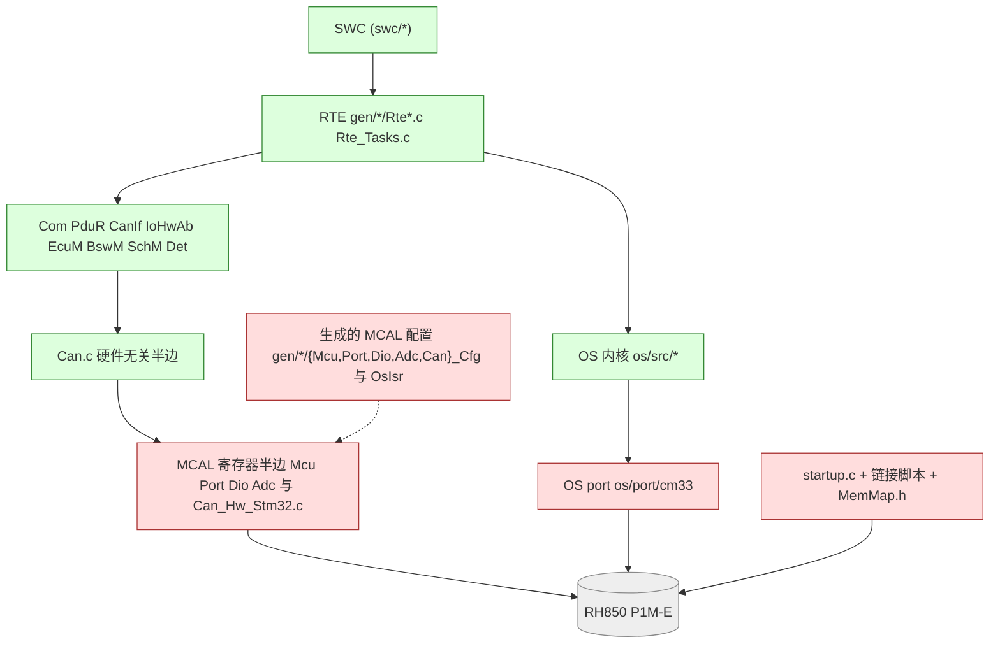

# 09 Renode、GDB 与 RH850 移植：跑起来、停下来、再搬家

> 本章回答：(1) Renode 的基本概念（`.repl` / `.resc`、machine、sysbus、CANHub、UART 文件后端、`SetVoltage` 的单位、日志）和三机场景是怎么跑起来的？(2) 怎样用 GDB 连到 Renode 里的 ECU，用 `mini_autosar.gdb` 看 OS 任务表、就绪队列、栈水位，以及已知的坑（连上时已在 `Reset_Handler`、不要 `monitor machine Reset`、`Os_Cm33_IdleEntry` 栈帧）？(3) **如果要把这个项目移植到 RH850（P1M-E + GHS），到底哪些文件要改、哪些完全不动？** 给一份可打钩的清单。
> Prerequisite: [06 通信栈代码](06-com-can-stack-code.md)、[07 启动追踪](07-startup-trace.md)、[08 map/ELF/链接脚本分析](08-map-elf-linker-analysis.md)；理论基础 [Part I RH850](../01-rh850/)、[Part II AUTOSAR Classic](../02-autosar-classic/)、[Part III MCAL](../03-mcal/)、[Part IV CAN MCAL](../04-can-mcal/)、[Part X 启动与调试](../10-boot-debug/)。   Next: 回到 [README](README.md) 的阅读路线，或开始自己的移植。
> 对应代码（路径相对 `examples/mini_autosar_ecu/`）：`target/renode/*.resc`、`tools/gdb/mini_autosar.gdb`、`tools/gdb/demo_session.gdb`、`tools/gdb/run_gdb_session.py`、`tools/run_mini_autosar.py:385-392,418-436`、`os/include/Os_Port.h`、`os/port/cm33/*`、`mcal/*`、`target/stm32l552/*`、`include/MemMap.h`、`include/Mini_Cfg.h`
> 对应规范（R25-11）：本章以工程实践为主。涉及：MCAL 模块分层（EXP_LayeredSoftwareArchitecture）、MemMap（MemoryMapping SWS）、OS/EcuM 启动要求（EcuM SWS Figure 7.3，p.37）。**本仓库没有 RH850G3M Software Manual、GHS 手册、RTA-OS 端口文档**，所有 RH850/GHS/RTA-OS 一侧的具体细节均为 `[Conceptual]`，落地前必须对照真实资料。   深入阅读：[docs/10-boot-debug/04 调试器如何拿到控制权](../10-boot-debug/04-debugger-attach-and-recovery.md)、[docs/10-boot-debug/06 增量式上板策略](../10-boot-debug/06-incremental-bring-up-strategy.md)、[docs/reference/p1me-memory-layout-ghs-memmap.md](../reference/p1me-memory-layout-ghs-memmap.md)、[docs/mcal-reference-guide.md](../mcal-reference-guide.md)

---

## 1. 本章要回答的问题

教学项目的价值不在于它在 STM32L552 上跑得通，而在于：**把 SWC → RTE → OS → BSW → MCAL 这条链搭起来之后，你知道每一层"换平台时动哪里"。** 本章分两半：

- **A 半（§2–§5）**：运行环境。Renode 怎么用；三机场景怎么跑；GDB 怎么挂；已知怪癖。
- **B 半（§6–§9）**：移植。RH850 版本要改哪些文件、不改哪些，附检查清单。

---

## 2. Renode 基础：一页纸

`[Educational Implementation]` 本项目使用仓库内的 Renode 1.17.0 便携版（`tools/toolchains/renode_1.17.0-portable/renode.exe`，由 `python tools/setup_toolchains.py` 下载）。

### 2.1 两种文件：`.repl` 与 `.resc`

| 文件 | 描述什么 | 本项目里 |
|---|---|---|
| **`.repl`**（platform description） | **硬件**：CPU、总线、外设、地址、中断连线 | `platforms/boards/ramn.repl`（RAMN 板，`using "platforms/cpus/stm32l552.repl"`）。关键行：`tools/toolchains/renode_1.17.0-portable/platforms/cpus/stm32l552.repl:127-131`：`fdcan1: CAN.STM32_FDCAN @ sysbus 0x4000A400`、`Int0 -> nvic@39`；`tools/toolchains/renode_1.17.0-portable/platforms/boards/ramn.repl:53-54`：`nvic: systickFrequency: 80000000`（基础文件里是 1 MHz，板文件改成 80 MHz） |
| **`.resc`**（script） | **场景**：创建机器、加载 ELF、接 UART/CAN、运行多久 | `target/renode/mini_autosar_2ecu.resc`、`debug_ecu.resc`、`debug_scenario.resc`、`probe/probe.resc`、`smoke/mcal_can_smoke.resc` |

### 2.2 常用命令（本项目用到的）

下表中签名来自我在 Renode 里直接敲命令得到的帮助输出（例如 `sysbus.usart1 CreateFileBackend` 不带参数会打印 `Void CreateFileBackend (String path, Boolean immediateFlush = False)`）：

| 命令 | 作用 | 位置 |
|---|---|---|
| `mach create "ECU_B"` | 新建一台机器（之后的命令作用于它） | `target/renode/mini_autosar_2ecu.resc:19` |
| `machine LoadPlatformDescription @platforms/boards/ramn.repl` | 加载硬件描述 | `:20` |
| `sysbus LoadELF $elf_b` | 把 ELF 按 **PT_LOAD** 装进内存，并设置 PC/SP（Renode 日志：`Guessing VectorTableOffset value to be 0x8000000` / `Setting initial values: PC = 0x8003415, SP = 0x200027F8.`） | `:21` |
| `sysbus.usart1 CreateFileBackend $uart_b true` | 把 USART1 的输出写进文件；第二参数 `immediateFlush`：每个字符立即写盘 | `:22` |
| `emulation CreateCANHub "canHub"` / `connector Connect sysbus.fdcan1 canHub` | 虚拟 CAN 总线；把这台机器的 FDCAN1 接上去 | `:11`、`:23` |
| `emulation SetGlobalQuantum "0.0001"` | 多机同步量子 100 µs（越小越精确越慢；也是跨机器时间戳误差的上限） | `:10` |
| `sysbus.adc1 SetVoltage <µV> 6` | 设置 ADC1 通道 6 的输入电压，**单位微伏**（不是毫伏）；`raw ≈ floor(µV · 4095 / 3.3e6)`，±1 LSB | `tools/run_mini_autosar.py:385-392` 的 `write_profile()` |
| `emulation RunFor "0.010"` | 让**虚拟时间**前进 10 ms | 同上，场景由 `profile` 片段驱动 |
| `machine StartGdbServer 3333` | 在这台机器上开 GDB server | `target/renode/debug_ecu.resc:17` |
| `include @file.resc` | 执行脚本 | `-e` 参数里 |
| `logLevel` | 无参数时打印当前日志级别表 | — |
| `quit` | 退出 | `-e "...; quit"` |

### 2.3 三条要记住的行为（都是真踩过的）

1. **`RunFor` 与 `start` 不能混用**：我在单机脚本里先 `start` 再 `emulation RunFor "0.025"`，得到：`There was an error executing command 'emulation RunFor "0.025"': This action is not available when emulation is already started`。本项目的场景脚本**不用 `start`**，只用 `RunFor` 推进虚拟时间。
2. **脚本里任何一条命令出错，脚本就停在那里**，Renode 仍留在交互控制台等待输入。无人值守运行时务必在 `-e` 里带 `; quit`，并检查退出（否则 CI 会挂起——我也因此遇到过一个命令超时）。
3. **没有连 CANHub 的机器发帧会警告**：`fdcan1: Attempted to send CAN frame while not connected to a CAN network`。这是 CAN 帧"发不出去"的最快诊断（第 6 章 §5）。

### 2.4 Renode 日志里的"常见噪音"

`renode.log`（`artifacts/mini-autosar/renode/renode.log`）和 Renode 控制台里有几类**无害**的警告，不要被吓到（下面省略了每行开头的时间戳，第 2 行起来自我单机跑 LightEcu 时的控制台输出）：

```text
[WARNING] ECU_A/gpioPortA: Unhandled read from offset 0x2C.
[WARNING] adc1: Unhandled write to offset 0x8. Unhandled bits: [31] when writing value 0x90000000. Tags: ADCAL (0x1).
[WARNING] fdcan1: Unhandled write to offset 0x50. Unhandled bits: [24-31] when writing value 0xFFFFFFFF. Tags: RESERVED (0xFF).
```

含义：驱动访问了 Renode 外设模型**没有建模**的寄存器位（GPIO 的 `0x2C`、ADC 校准位、FDCAN `IR` 的保留位）。它们是"**仿真器盲区**"的指示灯（第 6 章 §7.3）：**如果驱动正确性依赖这些位，仿真结果不可信**。

### 2.5 仿真器的边界：这个版本里没有 RH850

我在便携版的 `platforms/` 下检索过：**只有 Renesas RA（`renesas-r7fa*`）、RZ、DA 系列的平台描述，没有 RH850**。所以 RH850 版本无法直接用 Renode 做同款的"整机仿真"；验证路径是 **host 构建（逻辑）+ 实机 + 调试器（时序/硬件）**，见 §9。

---

## 3. 运行三机场景

### 3.1 一条命令（含构建）

```
python examples/mini_autosar_ecu/tools/run_mini_autosar.py            # 全量：生成 → 头检查 → 链接脚本检查 → host/target 构建 → 分析 → 单测 → host 双 ECU 仿真 → Renode 三机 → GDB 会话
python examples/mini_autosar_ecu/tools/run_mini_autosar.py --step renode   # 只跑 Renode 三机场景（要求 target ELF 已构建）
```

`--step renode` 执行的就是 `tools/run_mini_autosar.py:418-436` 的 `step_renode()`：生成 `adc_profile.resc`（`write_profile`），然后

```text
renode.exe --disable-gui --console -e "$elf_a=@<...>/SensorEcu.elf; $elf_b=@<...>/LightEcu.elf; $elf_rest=@<...>/RestBus.elf;
   $uart_a=@<...>/renode/uart_a.log; $uart_b=@<...>/renode/uart_b.log; $uart_rest=@<...>/renode/uart_rest.log;
   $profile=@<...>/renode/adc_profile.resc; include @<...>/target/renode/mini_autosar_2ecu.resc; quit"
```

（这与 `artifacts/mini-autosar/renode/renode.log` 开头回显的命令一致。）`mini_autosar_2ecu.resc` 的最后一行 `include $profile` 把"轮速 ADC 台阶 + `RunFor`"拼在场景后面（`target/renode/mini_autosar_2ecu.resc:31-36`：注释 + `include $profile`），整个场景 4 s 虚拟时间。

> **注意**：`--step X` 只执行这一步，但**会用这一次的结果覆盖 `artifacts/mini-autosar/summary.txt`**。想要完整汇总请再无参数跑一遍。

### 3.2 看结果

Renode 场景完成后，`check_scenario`（`tools/run_mini_autosar.py:340-`）按 DESIGN §11.3 校验 UART 日志。`summary.txt` 里的真实结果（2026-10-03 干净重建后的一次运行；Renode 行的 µs 数值每次会有轻微抖动，PASS/FAIL 的判据是顺序与阈值而不是精确值）：

```text
OK   sim      SensorEcu.exe                                 rc=0
OK   sim      LightEcu.exe                                  rc=0
OK   sim      A: EcuM startup reaches RUN                   t=0us
OK   sim      A: OS StartOS                                 t=0us
OK   sim      A: first VehicleSpeed frame 0x101             t=10000us
OK   sim      B: EcuM startup reaches RUN                   t=0us
OK   sim      B: first AmbientLight RX 0x301                t=1000us
OK   sim      B: headlight LOW  (dusk, speed>0)             t=500000us
OK   sim      B: headlight HIGH (dark, speed>=60)           t=1500000us
OK   sim      B: mode POST_RUN                              t=3010000us
OK   sim      B: headlight OFF in POST_RUN                  t=3010000us
OK   sim      B: mode back to RUN                           t=3510000us
OK   sim      B: HeadlightStatus frame 0x201                t=10000us
OK   sim      B: Odometer GetDistance served                t=20000us
OK   renode   renode.exe run                                rc=0
OK   renode   A: EcuM startup reaches RUN                   t=318us
OK   renode   A: OS StartOS                                 t=0us
OK   renode   A: first VehicleSpeed frame 0x101             t=10092us
OK   renode   B: EcuM startup reaches RUN                   t=283us
OK   renode   B: first AmbientLight RX 0x301                t=99918us
OK   renode   B: headlight LOW  (dusk, speed>0)             t=500114us
OK   renode   B: headlight HIGH (dark, speed>=60)           t=1500126us
OK   renode   B: mode POST_RUN                              t=3010339us
OK   renode   B: headlight OFF in POST_RUN                  t=3010517us
OK   renode   B: mode back to RUN                           t=3510345us
OK   renode   B: HeadlightStatus frame 0x201                t=10240us
OK   renode   B: Odometer GetDistance served                t=20204us
```

对比 host 的同一组检查（`sim` 行，时间由虚拟时钟给出，整齐到 µs）可以看到有趣的**差异**：`B: first AmbientLight RX 0x301`——host 上是 `t=1000us`，Renode 上是 `t=99918us`。差异不是 bug：Renode 里 REST 节点在 t=40 µs 就发了第一帧 0x301，此时 LightEcu 的 CAN 控制器还没 STARTED，**那一帧丢了**，要等 REST 的 100 ms 周期的下一帧（第 6 章 §5）。host 的 RX 脚本是按虚拟时间注入的，不存在这种竞态。这个差异正是用 **host 做逻辑回归、用 Renode 做时序回归**的理由。

### 3.3 其他 Renode 场景

| 脚本 | 用途 |
|---|---|
| `target/renode/probe/probe.resc` | 寄存器探针固件：验证 RCC/GPIO/ADC1/FDCAN1 的寄存器行为（`SetVoltage` 单位、FDCAN 寄存器偏移） |
| `target/renode/smoke/mcal_can_smoke.resc` | 两节点 MCAL CAN 冒烟（不带 OS/RTE），`emulation RunFor "0.5"` |
| `target/renode/debug_ecu.resc` | 单 ECU + GDB server（§4） |
| `target/renode/debug_scenario.resc` | 三机 + GDB server 挂 ECU_B（§4） |

---

## 4. GDB + Renode

### 4.1 为什么能连、停在哪

`target/renode/debug_ecu.resc`（17 行）：

```text
$gdb_port?=3333
$speed_uV?=1650000

mach create "ECU"
machine LoadPlatformDescription @platforms/boards/ramn.repl
sysbus LoadELF $elf
sysbus.usart1 CreateFileBackend $uart true
sysbus.adc1 SetVoltage $speed_uV 6
machine StartGdbServer $gdb_port
```

`machine StartGdbServer $gdb_port` 的签名是 `StartGdbServer(Int32 port, Boolean autostartEmulation = True, String cpuCluster = "")`（我敲 `machine StartGdbServer` 得到的帮助）。默认 `autostartEmulation=True`：GDB 连上之后才开始跑，**连接时 CPU 停在复位向量**（`PC = Reset_Handler`、`SP = _estack`）。**所以 `Reset_Handler` 断点就是连接后的第一个停点**（`gdb_session.txt` 第 1 节：`connected: pc=0x08003414 sp=0x200027f8`）。这对应真实硬件上的 "reset and halt"（[docs/10-boot-debug/04 §5.2 "复位后停在复位向量"是头号工具](../10-boot-debug/04-debugger-attach-and-recovery.md)）。

三机场景 `debug_scenario.resc`（31 行）把 GDB server 挂在 **ECU_B**（`:25`）；A 和 REST 与 B **共用同一个虚拟时钟**，B 在断点停下时整个仿真暂停——你可以从容检查另外两台的 UART 日志和内存。

### 4.2 两个终端

```
# 终端 1：起 Renode（单 ECU）
renode.exe --disable-gui --console -e "$elf=@<abs>/LightEcu.elf; $uart=@<abs>/uart.log; include @<abs>/examples/mini_autosar_ecu/target/renode/debug_ecu.resc"

# 终端 2：
arm-none-eabi-gdb -nx -x examples/mini_autosar_ecu/tools/gdb/mini_autosar.gdb artifacts/mini-autosar/target/LightEcu/LightEcu.elf
(gdb) mini_connect          # target remote localhost:3333；打印 pc/sp
(gdb) mini_break_boot       # Reset_Handler / main / EcuM_Init / StartOS
(gdb) continue
```

可选变量：`$gdb_port`（默认 3333）、`$speed_uV`（轮速 ADC 输入，默认 1650000 µV = 1.65 V，`target/renode/debug_ecu.resc:9-10`）。三机场景需要传 `$elf_a $elf_b $elf_rest $uart_a $uart_b $uart_rest`。

### 4.3 `mini_autosar.gdb` 的命令（本 GDB 无 Python，全部用 GDB 命令语言）

`tools/gdb/mini_autosar.gdb:13-26` 列出了全部命令。要点：

| 命令（行号） | 作用 |
|---|---|
| `mini_connect`（`:37`） | 连接并打印停在哪 |
| `mini_break_boot`（`:46`）/ `_os`（`:56`）/ `_tasks`（`:64`）/ `_swc`（`:71`）/ `_comstack`（`:79`）/ `_all`（`:88`） | 成组下断点：启动路径；`Os_Kernel_SelectNext`/`Os_Cm33_SwitchContext`；所有 `Os_Task_Task_*`；`LightCtl_Run20ms`/`LightCtl_OnSpeed`；所有 `Rte_Write_*` + `Com_SendSignal` + `Can_Write` |
| `mini_tasks`（`:100`） | OS 任务表：id、名字、状态、基础/当前优先级、激活数、事件 |
| `mini_ready`（`:133`） | 就绪位图 + 每个优先级的 FIFO |
| `mini_current`（`:161`） | 当前运行任务、`Os_IsrDepth`、`IPSR`、寄存器和短回溯 |
| `mini_stacks`（`:181`） | 每个任务栈的水位（扫描 `0xDEADBEEF` 涂色，同 `Os_GetTaskStackUsage`） |
| `mini_vectors`（`:200`） | VTOR、初始 MSP、Reset、PendSV、SysTick、`FDCAN1_IT0` 向量 |
| `mini_state`（`:212`） | `mini_current` + `mini_tasks` + `mini_ready` |

它们读的是内核的**静态/全局变量**（`Os_Tcb[]`、`Os_Config`、`s_readyMask`、`s_q`、`s_qCount`、`s_qHead`），所以**依赖符号表**（ELF 带 `-g`，`s_*` 是文件内 `static` 变量，GDB 在 `-g` 下可见）。

### 4.4 一次真实会话的片段

`python tools/gdb/run_gdb_session.py`（`run_mini_autosar.py --step gdb`）后台起 Renode，运行 `mini_autosar.gdb` + `demo_session.gdb`（`tools/gdb/demo_session.gdb`，48 行）：Reset_Handler → main → EcuM_Init → StartOS → `Os_Kernel_SelectNext` → `TASK(Task_LightCtl)` → `LightCtl_Run20ms` → `Rte_Write_*` → `Com_SendSignal` → `Can_Write`，记录在 `artifacts/mini-autosar/gdb_session.txt`。

在第一个任务体上停下后的 `mini_current` / `mini_tasks` / `mini_stacks`（`gdb_session.txt` 第 6 节，已省略路径前缀 `D:\side_project\rh850\examples\mini_autosar_ecu\`）：

```text
===== 6. a task body: TASK(Task_LightCtl) (extended task, autostarted) =====
Temporary breakpoint 6 at 0x8001410: file gen\LightEcu\Rte_Tasks.c, line 86.

Temporary breakpoint 6, Os_Task_Task_LightCtl () at gen\LightEcu\Rte_Tasks.c:86
86	    EventMaskType ev = 0u;
running task: 2 = Task_LightCtl (priority 3)
Os_Started=1  Os_IsrDepth=0  IPSR=0x00
pc             0x8001410           0x8001410 <Os_Task_Task_LightCtl>
sp             0x20000a10          0x20000a10 <Os_Stack_Task_BswMain>
lr             0x800202d           134225965
#0  Os_Task_Task_LightCtl () at gen\LightEcu\Rte_Tasks.c:86
#1  0x0800202c in Os_Cm33_IdleEntry () at os\port\cm33\Os_Port_Cm33.c:86
Backtrace stopped: previous frame identical to this frame (corrupt stack?)
id  task             state      base  cur  act  res  eventsSet eventsWait
0   Task_Init        SUSPENDED    10   10    0    0 0x00000000 0x00000000
1   Task_BswMain     SUSPENDED     4    4    0    0 0x00000000 0x00000000
2   Task_LightCtl    RUNNING       3    3    1    0 0x00000000 0x00000000
3   Task_LightAct    SUSPENDED     2    2    0    0 0x00000000 0x00000000
4   (idle)           READY         0    0    0    0 0x00000000 0x00000000
task                   base  words   used   free
Task_Init        0x20000e10    256     92    164
Task_BswMain     0x20000a10    256      0    256
Task_LightCtl    0x20000410    384     17    367
Task_LightAct    0x20000010    256      0    256

```

**读法**：

- `running task: 2 = Task_LightCtl (priority 3)`、`IPSR=0x00`（线程模式）。
- 回溯：`Os_Task_Task_LightCtl () … gen/LightEcu/Rte_Tasks.c:86` ← `Os_Cm33_IdleEntry () … os/port/cm33/Os_Port_Cm33.c:86`。**第二行不是真的 `Os_Cm33_IdleEntry`**，见 §4.5 第 3 条。
- `Task_Init` 已是 `SUSPENDED`（刚终止），`Task_LightCtl` `RUNNING`，`Task_BswMain`/`Task_LightAct` 还没被激活。
- 栈水位：`Task_Init` 用了 92 words，`Task_LightCtl` 才 17 words（刚进入 `WaitEvent` 之前）。

### 4.5 已知怪癖（逐条）

1. **连上时 CPU 已经在 `Reset_Handler`。** 在 GDB 里 `break Reset_Handler` 然后 `continue` **不会**命中——它已经在那里了。需要"从头再来"就重启 Renode，不要在 GDB 里"重启"。
2. **不要用 `monitor machine Reset`。** `DESIGN.md` §14.2 记录它会让这版 Renode 的 GDB 连接崩溃。我复现了一次：在连接后发 `monitor machine Reset`，GDB 这边没有崩溃（`info registers pc` 仍显示 `0x8003414`），但 **Renode 日志显示机器被复位成了一个无效状态**：

   ```text
   [WARNING] sysbus: [cpu: 0x0] ReadDoubleWord from non existing peripheral at 0x4.
   [WARNING] sysbus: [cpu: 0x0] ReadDoubleWord from non existing peripheral at 0x0.
   [INFO] cpu: Setting initial values: PC = 0x0, SP = 0x0.
   [INFO] ECU: Machine resumed.
   ```

   原因：复位后 `VTOR` 回到 0，而这个平台的 `0x0` 处没有映射 Flash 别名，CPU 从 `0x0/0x4` 取到的不是向量表，于是 `PC=0, SP=0`（首次加载 ELF 时 Renode 会"猜" `VectorTableOffset = 0x8000000`，复位不会再猜）。**结论一致：要重来就重启 Renode。**
3. **回溯底部的 `Os_Cm33_IdleEntry`。** 任务最外层栈帧在 GDB 里显示为 `Os_Cm33_IdleEntry`。它是 `Os_Port_InitTaskContext` 放在初始栈帧里的假返回地址 `Os_Port_TaskReturn`（紧跟在 `Os_Cm33_IdleEntry` 之后），GDB 对返回地址取 `pc-1`，于是查到前一个函数（`os/port/cm33/Os_Port_Cm33.c:151-174`；`tools/gdb/mini_autosar.gdb:175-179`）。随后是 `Backtrace stopped: previous frame identical to this frame (corrupt stack?)`——GDB 不认识这个边界，**无害**。
4. **在 ISR 里停下时的 stub 警告。** `warning: Invalid state, unable to determine sp alias, assuming msp.` 和 `warning: Could not fetch required XPSR content. Further unwinding is impossible.`：Renode 的 GDB stub 在异常帧上拿不到完整的 XPSR；回溯显示 `<signal handler called>`，并在那里结束。ISR 内部的回溯（`can_rx_drain` → `Os_Cm33_IrqEntry`）仍然可靠（第 6 章 §6.6）。
5. **`-Os` 带来的 `<optimized out>` 与行号偏移。** 目标构建用 `-Os -g`（`tools/run_mini_autosar.py:144-146`），所以 GDB 会显示 `data=<optimized out>`、`id=<optimized out>`；`break Can.c:250`（`mcal/can/Can.c:250`） 实际停在第 251 行。**用函数名下断点**更稳。要读局部变量，换 `-Og` 重编（临时）。
6. **尾调用。** `Os_Isr_Isr_CanRx` 是 `b Can_Isr_Rx`，`Can_Isr_Rx` 又尾调用 `can_rx_drain`，所以 ISR 回溯里缺这两帧（第 6 章 §6.6，第 8 章 §7.7）。
7. **GDB 构建的编码警告**：这版 `arm-none-eabi-gdb` 会在 stderr 打印 `could not convert ...` / `This normally should not happen` 的 CP1252→UTF-32 警告，`tools/gdb/run_gdb_session.py:59-60` 把它们过滤掉。无害。
8. **GDB 无 Python**：所以 `mini_autosar.gdb` 用命令语言实现，不要期待 `python` 命令可用。

### 4.6 与真实调试器的对应

`[Industry Practice]` / `[Conceptual]`：

| 本项目 | 真实 RH850 项目 |
|---|---|
| Renode `StartGdbServer` + `arm-none-eabi-gdb` | Lauterbach TRACE32 / GHS MULTI（配 E1/E2 或 GHS 探针）/ iSYSTEM winIDEA；具体命令名与选项以所用版本手册为准（见 [docs/10-boot-debug/04](../10-boot-debug/04-debugger-attach-and-recovery.md) §5 与 §9：该章**明确声明**本仓库没有这些工具手册） |
| "连接后在 `Reset_Handler`" | "reset and halt" 连接方式 |
| `mini_tasks`/`mini_ready`/`mini_stacks` | TRACE32 的 OS-aware 窗口（RTA-OS、Vector OS 的 awareness 插件）；MULTI 的 task 窗口 |
| `mini_stacks`（0xDEADBEEF 涂色） | RTA-OS/Vector 栈监控 + MPU；TRACE32 `Var.Watch` |
| `run_gdb_session.py` | 烧录后的"smoke 脚本"：CMM/MULTI 脚本做 "load → 停在 main → 读 BootStatus"（[docs/10-boot-debug/06](../10-boot-debug/06-incremental-bring-up-strategy.md)） |

---

## 5. host 构建：移植时的"标准答案"

host 构建（`os/port/host/`、`sim/host/`）与 target **共用** SWC/RTE/OS 内核/BSW 源码，只替换 OS port、时间、寄存器后端、CAN 后端。这给移植带来一个重要的策略：**把 host 构建当作 oracle**。RH850 版本的行为（trace 序列、`Com` 打包、`BswM` 启动顺序）应当与 host 的 trace **一致**，时间容差内。`check_scenario` 已经在 host 和 Renode 上使用同一个 DESIGN §11.3 的期望表（`tools/run_mini_autosar.py:340-`），移植后你只需要再加一个"实机 UART 日志"的输入。

---

## 6. 移植到 RH850：先看分层



绿色 = **不改**；红色 = **要改**。边界的依据是 DESIGN §4 的**层规则**：MCAL 只经 `Mmio.h` 访问寄存器；BSW 的临界区只用 `SchM.h` 宏；SWC 只 include `Rte_<Swc>.h`。这些规则让"换芯片"变成**只改红色部分**。

---

## 7. 逐文件清单：改什么

下表的"RH850 侧参考"列链接到本仓库已有章节/代码；**GHS/RH850 具体语法与寄存器细节一律以真实手册为准**。

### 7.1 必须新写/重写（红色）

| # | 文件（相对 `examples/mini_autosar_ecu/`） | 现状 | RH850 要做什么 | RH850 侧参考 |
|---|---|---|---|---|
| 1 | `os/port/cm33/Os_Port_Cm33.c`（363 行） → 新建 `os/port/rh850/Os_Port_Rh850.c`（+ 汇编） | PendSV 上下文切换（`:199-216`）、BASEPRI/PRIMASK 锁（`:266-284`）、`Os_Cm33_IrqEntry`（`:303-322`）、栈涂色/canary（`:326-363`）、`Os_Port_Init`（NVIC 优先级，`:101-137`） | 实现 `os/include/Os_Port.h:15-44` 里**同一组函数**：`Os_Port_Init/StartTick/InitTaskContext/RequestDispatch/StartFirstTask/Idle/Halt/DisableAll/RestoreAll/SetOsMask/InIsr`、`Os_Port_StackCheck/StackUsage`，并在 ISR 包装里调 `Os_Kernel_IsrEnter/IsrExit`。**G3M 上要重新设计的点**：(a) 没有 PendSV：用软件触发的中断/`TRAP` 做"调度请求"；(b) 没有 MSP/PSP 双栈：单个 SP(r3)，ISR 在被中断任务的栈上跑（或 ISR 包装里切换到专用 ISR 栈），每个任务栈要计入最坏中断嵌套；(c) 上下文帧 = r1–r31 + EIPC/EIPSW（嵌套前必须保存）；(d) 临界区 `DI/EI`（PSW.ID）与 PMR/ISPR 屏蔽 OS 优先级；(e) idle 用 `HALT` 之类；(f) EIC 的 EIP/EITB/EIMK 谁写（OS 在 `StartOS`） | [docs/01-rh850/06 §8.1–§8.5（Cat2 ISR 与硬件的对应表）](../01-rh850/06-interrupt-exception.md)、[docs/01-rh850/02 §8、§11](../01-rh850/02-cpu-architecture.md)、[docs/02-autosar-classic/06 OS/Task/ISR](../02-autosar-classic/06-os-task-isr.md)。**本仓库没有 G3M Software Manual 与 RTA-OS 端口文档，细节需确认** |
| 2 | `os/port/cm33/Mini_Time_Target.c`（84 行） | SysTick 1 kHz、`Mini_Time_GetUs` | 用 **OSTM0/1** 做 1 ms tick 和自由运行计数；`Mini_Time_GetUs` 用 OSTM 计数换算；tick 中断（EI74/75）接 `Os_Kernel_TickHandler` | [docs/01-rh850/06 §7.3（OSTM EI74/75）](../01-rh850/06-interrupt-exception.md)；已有参考实现 `examples/rh850_mcal_reference/mcal/gpt/Ostm.c`、`integration/Tick_Accumulator.c`（32 位计数累加到 1 ms tick） |
| 3 | `os/port/cm33/Trace_Target.c`（60 行） | USART1 轮询发送 | 换成板上可用的串口（SCI3 或 RLIN3 的 UART 模式等，**以板子为准**；基址表见 [docs/01-rh850/08](../01-rh850/08-peripheral-overview.md)）或调试器侧的等价输出；也可输出到 RAM 环形缓冲给调试器读 | [docs/04-can-mcal/04 CAN 引脚与收发器](../04-can-mcal/04-can-pin-transceiver.md) 里引脚复用的写法类比 |
| 4 | `target/stm32l552/startup/startup.c`（98 行） → 新建 `target/rh850/startup/` | C 版 `Reset_Handler`、125 项向量表（IRQ 全指向 `Os_Cm33_IrqEntry`） | **启动汇编**：复位入口跳转、给所有 GPR 赋值（lock-step）、设 SP/GP/TP/EP、EBASE+PSW.EBV、INTBP、读 RESF、GHS 复制/清零表、跳 C 启动；EIC 通道到向量的绑定；每个 Cat2 向量入口调 OS 包装 | [docs/01-rh850/04 启动过程 §5–§9](../01-rh850/04-startup-process.md)；已有目标参考 `examples/can_irq_demo/startup/target/reset_ccrh.asm`、`crt_tables_ccrh.asm`（CC-RH 版本，GHS 需改写）；[docs/10-boot-debug/05 启动代码失败点清单](../10-boot-debug/05-startup-code-failure-points.md) |
| 5 | `target/stm32l552/linker/stm32l552_autosar.ld`（104 行） → 新建 GHS `.ld` | GNU ld 脚本 | GHS 语法的 `MEMORY`（Code Flash `0x00000000` 1 MB、Local RAM self `FEDE_0000`、Global RAM `FEEF_8000`…）、`.reset`/`.intvect` 512 B 对齐、`ROM()` 镜像、`CLEAR/NOCLEAR`、栈放 Local RAM 低端、OS 栈段、noinit 区 + `STAC_*` | [docs/reference/p1me-memory-layout-ghs-memmap.md §1–§5](../reference/p1me-memory-layout-ghs-memmap.md)、[docs/01-rh850/03](../01-rh850/03-memory-map.md)、[docs/01-rh850/05](../01-rh850/05-linker-script.md)；本章 [第 08 章 §10 的对应表](08-map-elf-linker-analysis.md) |
| 6 | `include/MemMap.h`（37 行） | GCC `section` 属性宏 | 改为 **`<Msn>_MemMap.h`** 体系：`#pragma ghs section text=".text.xxx"` / `bss=...`，成对 START/STOP + `MEMMAP_ERROR` 守卫；或保留一套**属性宏**但映射到 GHS 支持的属性（以编译器手册为准） | [p1me §4](../reference/p1me-memory-layout-ghs-memmap.md) |
| 7 | `mcal/mcu/Mcu.c`（236 行） | STM32 RCC/PLL（`RCC_BASE 0x40021000` 等，`:48-54`） | P1M-E 的时钟初始化（该型号**没有 PLL**，`Mcu_InitClock` 等 API 会"退化"）、CLMA 监视、`0xA5` 保护写序列、复位原因（RESF）、`Mcu_PerformReset` | [docs/01-rh850/07 时钟系统](../01-rh850/07-clock-system.md)、[docs/03-mcal/02 Mcu 驱动](../03-mcal/02-mcu-driver.md) |
| 8 | `mcal/port/Port.c`（205 行） | STM32 GPIOx：`MODER/AF`（`GPIO_BASE 0x42020000`，`:40`） | RH850 的 `PMC/PFC/PM/PIBC…` 引脚复用寄存器；保护命令寄存器（PCMD/PPCMD）；`Port_Init` 的引脚表 | [docs/03-mcal/03 Port 驱动](../03-mcal/03-port-driver.md)、[docs/03-mcal/07 RH850 硬件映射](../03-mcal/07-rh850-hardware-mapping.md) |
| 9 | `mcal/dio/Dio.c`（122 行） | `GPIO BSRR/IDR/ODR`（`:34-38`） | RH850 `P/PSR/PPR` 等读写寄存器；保持"写不做读改写"的原子性语义（STM32 的 BSRR 是原子的，RH850 用 PSR 位置/清除寄存器） | [docs/03-mcal/04 Dio 驱动](../03-mcal/04-dio-driver.md) |
| 10 | `mcal/adc/Adc.c`（253 行） | STM32 ADC1（`ADC1_BASE 0x42028000`，`:48`） | P1M-E 的 ADC（HW-E §30 的 ADCG0/1，见 [docs/01-rh850/08 外设总览](../01-rh850/08-peripheral-overview.md)；**寄存器细节需查硬件手册**）：扫描组/触发/结果读取。本仓库**没有**专门的 Adc 章节 | [docs/03-mcal/01 MCAL 概览](../03-mcal/01-mcal-overview.md)；`[Conceptual]` |
| 11 | `mcal/can/Can_Hw_Stm32.c`（277 行） → 新建 `Can_Hw_Rh850.c` | FDCAN（M_CAN）：消息 RAM、TX buffer + `TXBAR`、RX FIFO0、`RXGFC` | **RS-CANFD**：全局/通道复位模式、`CmNCFG` 位时序、AFL 规则（`GAFLIDj/GAFLMj/GAFLP0_j/GAFLP1_j`）、RX FIFO（`RFCCx`/`RFSTSx`/`RFPCTRx`）、TX 消息缓冲（`TMIDp/TMPTRp/TMDFp/TMCp`，**TMCp/TMSTSp 8 位写**）。`Can_Hw.h` 的**后端接口不变**（`CanHw_Init/Start/Stop/TxRequest/TxIsDone/RxFetch/RxIrqAck/RxIrqEnable/IsBusOff/GetRxLostCount`） | [docs/04-can-mcal/02–12](../04-can-mcal/)（逐章对应）；对照表见[第 06 章 §9](06-com-can-stack-code.md) |
| 12 | `mcal/mmio/Mmio.h`（38 行） | target 分支：32 位 volatile 读写（`:20-24`） | 增加 **8/16 位**访问（RS-CANFD 的 TMCp/TMSTSp、部分保护寄存器必须 8 位写）、必要的同步（`SYNCP`） | 已有参考 `examples/rh850_mcal_reference/platform/Rh850_Mmio.{h,c}` |
| 13 | `include/Mini_Cfg.h`、`include/Platform_Types.h`、`include/Compiler.h` | `MINI_CPU_CLOCK_HZ 80000000u`（`include/Mini_Cfg.h:39`）、GCC 属性 | CPU/外设时钟、GHS 的 `inline`/`packed`/`naked` 写法；平台类型（RH850 小端，类型宽度一致） | [docs/reference/p1me-memory-layout-ghs-memmap.md](../reference/p1me-memory-layout-ghs-memmap.md) |
| 14 | `integration/Main_Target.c`（15 行） | `EcuM_Init(); for(;;){}` | **基本不变**；板级早期动作（Wdg 喂狗、读 RESF）在启动汇编/`main` 之前 | [docs/01-rh850/04 §6.3–§6.4](../01-rh850/04-startup-process.md) |

### 7.2 生成物与配置（也会变，但是由生成器产生）

| 文件 | 变什么 |
|---|---|
| `config/ecuc/<Ecu>.ecuc.json` 的 `Mcu/Port/Dio/Adc/Can` 段（如 `config/ecuc/LightEcu.ecuc.json:171-185`） | 引脚名（`PA1` → RH850 的 `P0_x`）、时钟设置、Dio 通道、ADC 组、`CanController`（`hardware` 字段）、`CanHardwareObject` 的 filter 语义（掩码要带 IDE/RTR，见 [docs/04-can-mcal/07](../04-can-mcal/07-hoh-hrh-hth.md) §7.2） |
| `config/ecuc/<Ecu>.ecuc.json` 的 `Os.OsIsr`（`:49-51`） | `irq: 39` → RH850 的 EIC 通道（**RX FIFO 汇集在 EI190**，不是 EI184）；`nvicPriority: 0x40` → EIC 的 EIP 值（OS 优先级到 EIP 的映射由 OS 端口规定，不能假设相等） |
| `generator/emit_bsw.py`、`emit_os.py` | MCAL 配置结构体的字段名（若 `Can_HohConfigType` 增加 RS-CANFD 需要的字段，如规则索引/FIFO 号）；`Os_IsrCfgType` 的 `nvicPriority` 字段改名（`os/include/Os_CfgTypes.h`） |
| `gen/<Ecu>/{Mcu,Port,Dio,Adc,Can}_Cfg.[ch]`、`Os_Cfg.c` | 重新生成；**不手改** |
| `tools/run_mini_autosar.py` | 增加 RH850 目标：GHS 编译/链接命令、MemMap 头路径、`-D` 宏；`MINI_PLATFORM_TARGET` 之外再加 `MINI_CPU_RH850` 之类的选择（文件名约定 `_Rh850` = 仅 RH850 目标） |

### 7.3 完全不改（绿色）

| 路径 | 为什么不变 |
|---|---|
| `swc/**` | 只依赖契约头 `Rte_<Swc>.h`（第 5 章 §8.2 的"最小 include 路径"检查保证了这一点） |
| `gen/<Ecu>/Rte*.c|h`、`Rte_Tasks.c`（**结构**） | RTE 只依赖 `Os.h`、`Com.h`、`IoHwAb.h`、`SchM.h` 的 API；任务/事件映射是配置。（若 OS 优先级编号方向或任务数变化，会**重新生成**，但生成器逻辑不变） |
| `os/src/Os_Core.c`、`Os_Task.c`、`Os_Event.c`、`Os_Alarm.c`、`Os_Resource.c`、`Os_Interrupt.c`、`Trace.c` | 可移植内核，只经 `Os_Port.h` 与硬件交互 |
| `bsw/com`、`bsw/pdur`、`ecual/canif`、`ecual/iohwab` | 只调用下层 **API**（`Can_Write`、`Dio_*`、`Adc_*`） |
| `bsw/ecum`、`bsw/bswm`、`bsw/schm`、`bsw/det` | 启动编排与模式管理；`SchM.h` 的独占区宏映射到 `Suspend*Interrupts`（OS API） |
| `mcal/can/Can.c`（硬件无关半边） | 经 `Can_Hw.h` 访问后端 |
| `integration/Os_Hooks.c`、`integration/Main_Target.c` | 钩子和 main 与芯片无关 |
| `sim/**`、`os/port/host/**`、`tests/unit/**`（除 MCAL 相关） | host 构建与单测**继续作为回归基线** |

**一个用数字说明"哪些不改"**：`artifacts/mini-autosar/analysis/LightEcu.md` 第 4 节的模块表（FLASH 共 16776 B）按"移植时动不动"重新分类，粗略结果：

| 类别 | FLASH | 占比 | 包含 |
|---|---:|---:|---|
| **不改** | ≈ 12.0 KB | ≈ 72 % | OS 内核 3369、RTE 742、SWC 424、Com 1686、PduR 292、CanIf 540、BswM 1858、EcuM 307、SchM 44、Det 226、IoHwAb 123、Integration 70、Trace.c 676、`Can.c` 硬件无关半边（`Can` 行 1604 减去 `CanHw_*` ≈ 860 得约 744），以及会被重新生成但逻辑不变的 `Os_Cfg/BswM_Cfg/Com_Cfg/EcuM_Cfg/CanIf_Cfg/PduR_Cfg`（共 925） |
| **重写** | ≈ 3.8 KB | ≈ 23 % | OS port 770、启动/向量 582、Trace/Time port 258、Mcu 453、Port 396、Dio 70、Adc 284、CAN 硬件后端 `CanHw_*`（`nm -S` 汇总约 860）、MCAL 配置表 158 |
| 工具链库与填充 | ≈ 0.9 KB | ≈ 5 % | libc/libgcc 892、对齐填充 27 |

（这是用于建立直觉的粗略估算，数字来自本镜像；换了编译器、优化级别、`Can.c`/`CanHw_*` 的划分方式都会变化。）**移植工作量的主要部分在 OS port 和启动/时钟/CAN 后端**，而不是应用代码。

---

## 8. 移植检查清单（建议顺序）

按 [docs/10-boot-debug/06 增量式上板策略](../10-boot-debug/06-incremental-bring-up-strategy.md) 的思想：**每一步都能独立验证，失败时只有一个新变量**。

**阶段 0：环境（只有编译，没有硬件）**

- [ ] 在 host 构建上跑全绿（`python tools/run_mini_autosar.py`）：这是基线与 oracle。
- [ ] 用 GHS 编译器把**可移植部分**（`swc`、`gen/*/Rte*.c`、`os/src`、`bsw`、`ecual`、`mcal/can/Can.c`）编译通过，`-Wall` 级别无警告；移除/替换 GCC 专有写法（`__attribute__((section...))`、`naked`、内联汇编语法）。
- [ ] `MemMap.h` 改为 GHS 版本；跑一遍"最小 include 路径"检查（[第 05 章 §8.2](05-swc-code.md)），确保 SWC 仍只依赖契约头。

**阶段 1：启动与链接（Part I、Part X）**

- [ ] GHS 链接脚本通过 `ldcheck` 等价检查（本项目的 `--step ldcheck`：用 stage0 小程序验证脚本）。
- [ ] 启动汇编：复位向量、GPR 初始化、SP/GP/TP/EP、EBASE/INTBP、RESF 读取；**先只做"死循环 + LED/串口一个字节"**（`bringup/stage0_hello` 的等价物）。
- [ ] 调试器能 "reset and halt" 连接（[docs/10-boot-debug/04](../10-boot-debug/04-debugger-attach-and-recovery.md)）；先准备好 safe image 与恢复路径（Option Bytes 不要乱改，见 [p1me §3](../reference/p1me-memory-layout-ghs-memmap.md)）。
- [ ] 用第 08 章的方法检查 map：区域占用、`.data` LMA、向量表对齐 512 B、没有孤儿段。

**阶段 2：MCAL（Part III、Part IV）**

- [ ] `Mcu`（时钟、复位原因）→ `Port` → `Dio`：先用 LED/Dio 验证。每个模块先在 host 上有等价的单测（项目已有 `tests/unit/test_mcal_*.c`，只替换后端后复用）。
- [ ] `Gpt`/OSTM tick 稳定（`examples/rh850_mcal_reference` 的 OSTM 测试）。
- [ ] `Can_Hw_Rh850.c`：先 **loopback/内部回环**（若支持）→ 单帧发送 → AFL 接收 → 中断（EI190）→ 溢出。参考 [docs/04-can-mcal/14 CAN 驱动从零开始](../04-can-mcal/14-can-driver-from-scratch.md)、[15 调试](../04-can-mcal/15-can-driver-debugging.md)。
- [ ] 每个寄存器位字段写进 `[V]`/`[R]` 标记（第 06 章 §7 的做法）：**实机验证过的**与**只来自手册的**必须区分开。**这次没有 Renode 替你兜底。**

**阶段 3：OS port（Part II）**

- [ ] `Os_Port_*` 全部实现；先跑 `os/port/cm33/selftest` 的等价自测（`selftest/main.c`、`run_selftest.py`：不带 BSW 只测 OS）。
- [ ] 验证：任务切换、优先级抢占、`WaitEvent/SetEvent`、闹钟、资源天花板、Cat2 ISR 里 `ActivateTask/SetEvent`、栈 canary；对照 `tests/unit/test_os_*.c` 的行为。
- [ ] 最坏栈深度计入 ISR 嵌套（G3M 没有独立中断栈）。

**阶段 4：BSW 通信 + RTE + SWC**

- [ ] 重新生成 `gen/<Ecu>/`；`BswM` 启动顺序、`Rte_Start`、`Com_IpduGroupStart` 的 trace 与 host 逐行对比（本章 §5 的 oracle 思路）。
- [ ] 用 CANoe / 总线分析仪看 0x101/0x201 的实际帧（周期、DLC、字节序），对照 `config/system/System.arxml` 的通信矩阵。
- [ ] 场景检查（DESIGN §11.3 的 10 条期望）在实机 UART 日志上通过。

**阶段 5：安全与集成**

- [ ] 栈水位、`ErrorHook`/`Det` 输出、看门狗喂狗点（本项目没有 Wdg）、复位原因。
- [ ] 以 [docs/08-integration](../08-integration/) 的检查清单收尾。

---

## 9. 验证策略：host 是 oracle，Renode 是"形状"，实机是"事实"

| 层次 | 能证明什么 | 不能证明什么 |
|---|---|---|
| **host 构建 + 单测** | 逻辑与协议（Com 打包、BswM 顺序、OS 调度语义）正确；确定性、可 diff | 时序、中断异步性、寄存器正确性 |
| **Renode（STM32）** | 真实 SysTick/PendSV/NVIC 行为；整机时序；FDCAN 的**被建模部分** | 仿真器盲区（时钟寄存器、未建模位）；**对 RH850 完全没用**（没有 RH850 模型） |
| **RH850 实机 + 调试器** | 一切——但调试代价最高 | — |

所以移植策略是：**把能在 host 证明的都在 host 证明，把 RH850 实机的时间花在寄存器与时序上。** 本项目在 STM32 上学到的一个教训（第 06 章 §7）直接适用：**"仿真通过"与"硬件通过"之间有一道鸿沟，寄存器位字段要逐个核对手册，并标注验证状态。**

---

## 10. 对照真实项目 `[Industry Practice]`

| 本章内容 | 真实项目 |
|---|---|
| 红色文件清单 | 对应 **BSW 厂商端口（Vector MICROSAR RH850 端口、ETAS RTA-OS/RTA-BSW RH850 GHS 端口）与芯片厂 MCAL（Renesas）**：你通常**不自己写** OS port 和 MCAL，而是**集成、配置、验证**；理解本章清单，等于理解"端口包里有什么"以及"出问题时该找谁"（见 [docs/12-industry-ecosystem](../12-industry-ecosystem/README.md) 中交付物与责任划分）。 |
| 绿色文件 | 业务/应用层与大部分 BSW 模块栈，随工具链生成或由厂商提供，跨平台通用；集成者的主要产出是 **ECUC 配置**与 **集成胶水**（EcuM/BswM 动作、MemMap、链接脚本、启动代码）。 |
| 启动/链接/MemMap | 集成者负责（METH p.184："配置 MCAL、配置 IoHwAb 是 ECU Integrator 的任务"，见 [docs/11 第 02 章](../11-classic-autosar-primer/02-who-builds-what.md)）。 |
| Renode + GDB | RH850 上用 TRACE32/MULTI + E2；host 单测对应 vECU/SIL 流程；台架用 CANoe。 |

---

## 11. 常见误解

| 误解 | 事实 |
|---|---|
| "移植就是换 MCAL" | 还有 **OS port**（上下文切换、中断入口、临界区）、**启动汇编**、**链接脚本/MemMap**、**调试环境**。MCAL 只是其中一块 |
| "SWC 不用改，所以 RTE 也不用改" | RTE 的**源码结构**不改，但 `Rte_Tasks.c`/`Os_Cfg.c` 由生成器根据 OS 配置**重新生成**；任务栈大小、优先级、闹钟周期都可能变 |
| "STM32 上跑通就等于驱动对" | 仿真器盲区；时钟、保护寄存器序列、ECC 初始化都要在 RH850 上重新验证 |
| "Renode 能仿真 RH850" | 本仓库的 Renode 1.17.0 便携版里没有 RH850 平台 |
| "PendSV 可以直接照搬" | G3M 没有 PendSV/双栈指针，调度请求与上下文切换必须按 EIINT/TRAP/PSW/ISPR 重新设计 |
| "GHS 的 MemMap 就是换个 pragma" | 还要保证与链接脚本的节名匹配、`MEMMAP_ERROR` 守卫、noinit 三件套、OS/分区的 MPU 对齐 |

---

## 12. 动手实验

**实验 1：跑三机场景并读结果**

```
python examples/mini_autosar_ecu/tools/run_mini_autosar.py --step renode
```

对照 `summary.txt` 里 `renode` 开头的 12 行，和 `artifacts/mini-autosar/renode/uart_b.log` 的第一条 `RTE MODE EcuMode=POST_RUN`（t≈3010339 µs）。（别忘了再无参数跑一遍恢复完整 summary。）

**实验 2：GDB 单步走启动，并看任务表**

按 §4.2 起 Renode 和 GDB，`mini_break_boot` → `continue` 四次 → `break Os_Task_Task_LightCtl` → `continue` → `mini_state`、`mini_stacks`。把输出与 §4.4 的真实片段对照。

**实验 3：复现 `monitor machine Reset` 的坏状态**

连接后 `monitor machine Reset`，然后读 Renode 控制台/`renode.log` 的最后几行，确认 `PC = 0x0, SP = 0x0`；再 `monitor sysbus.cpu PC` 之类确认状态；最后重启 Renode。

**实验 4：写一份"RH850 移植评审表"**

把 §7 的表复制成 Excel/Markdown，增加三列：负责人、验证方式（host 单测 / 实机 / 示波器 / 分析仪）、状态。对 `Can_Hw_Rh850.c` 的每个寄存器位字段增加 `[V]/[R]` 标记列。

**实验 5：估算工作量**

用 `tools/analyze_image.py --ecu LightEcu` 的第 4 节表，把每个模块标成"不改/重写/改配置"，算出各占的 FLASH/RAM 百分比，和 §7.3 末尾的估算对比。

---

## 13. 一句话记住

1. **Renode = `.repl`（硬件）+ `.resc`（场景）**；`SetVoltage` 单位是微伏；`RunFor` 与 `start` 不混用；多机用 CANHub；脚本任何命令出错就会停在那里。
2. **GDB 连上时 CPU 已在 `Reset_Handler`**；不要 `monitor machine Reset`（机器会被复位到 `PC=0`）；任务栈底的 `Os_Cm33_IdleEntry` 是假返回地址；`-Os` 带来 `<optimized out>` 和行号偏移。
3. **移植只改红色**：OS port、启动汇编、链接脚本/MemMap、MCAL 寄存器半边（Mcu/Port/Dio/Adc/Can 后端）、对应的 ECUC 配置；**SWC、RTE、OS 内核、Com/PduR/CanIf、EcuM/BswM 都不动**。
4. **host 是 oracle**：RH850 的 trace 应与 host 的 trace 一致；实机时间用在寄存器和时序上。
5. 这个仓库的 Renode 没有 RH850；**RH850 一侧的细节（G3M、GHS、RTA-OS）本仓库没有手册，一律 `[Conceptual]`，上板前必须确认。**

---

## 14. 自测题

1. `debug_ecu.resc` 里为什么没有 `start`？`StartGdbServer` 的 `autostartEmulation` 默认值如何影响"连上时 PC 在哪"？
2. 在 GDB 里 `break Reset_Handler` 后 `continue`，为什么永远不会在那里停下？你会怎么得到"从 `Reset_Handler` 开始的第二次运行"？
3. `mini_ready` 显示 `ready bitmap = 0x408`，它代表哪两个任务？为什么 `Task_LightCtl` 在 `Task_Init` 之后才运行？
4. 为什么 RH850 的 OS port 不能照搬 PendSV 的 `stmdb r0!, {r4-r11, lr}` / `bx lr(EXC_RETURN)` 流程？列出至少三个硬件差异（栈指针、中断返回、保存的寄存器）。
5. §7.1 的第 12 项说 `Mmio.h` 要增加 8/16 位访问。哪个 RS-CANFD 寄存器必须 8 位写？写 32 位会怎样？（[docs/04-can-mcal/10](../04-can-mcal/10-can-write-implementation.md) §7.2）
6. 把 `LightEcu.ecuc.json` 的 `OsIsr.irq` 从 39 改成 190、把 CAN 后端换成 RS-CANFD，`Os_Cm33_IrqEntry` 的"查表分发"思想还成立吗？RH850 上的向量入口怎么实现同样的效果？
7. 列出 host 构建 + 单测能验证的 5 件事和**不能**验证的 3 件事。
8. 为什么说"Renode 里 `FDCANEN` 配错也能跑"对 RH850 移植是个警告？你会用什么手段在 RH850 上确认时钟寄存器的配置确实生效？

---

## 15. 收尾

到这里，本系列的 [README](README.md) → [01 总览](01-project-overview.md) → [02 配置与生成](02-config-and-generation.md) → [03 OS](03-os-code.md) → [04 RTE](04-rte-code.md) → [05 SWC](05-swc-code.md) → [06 通信栈](06-com-can-stack-code.md) → [07 启动](07-startup-trace.md) → [08 映像分析](08-map-elf-linker-analysis.md) → 本章就走完了：**从一个信号的一生，到一个镜像的内部，再到换一块芯片要动哪里。** 下一步是用 [Part IX 真实项目准备](../09-real-project-preparation/01-how-to-read-real-autosar-project.md) 的方法，去读一个真正的 RTA-CAR / Vector 工程。
