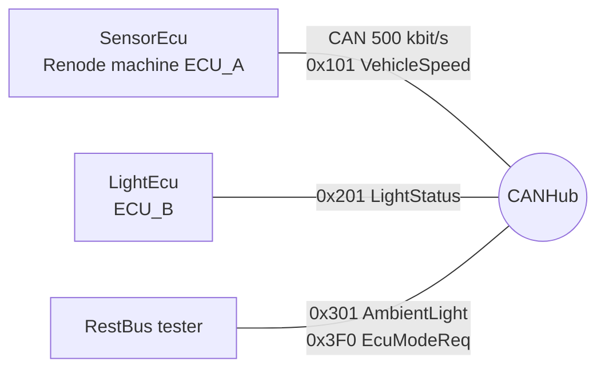
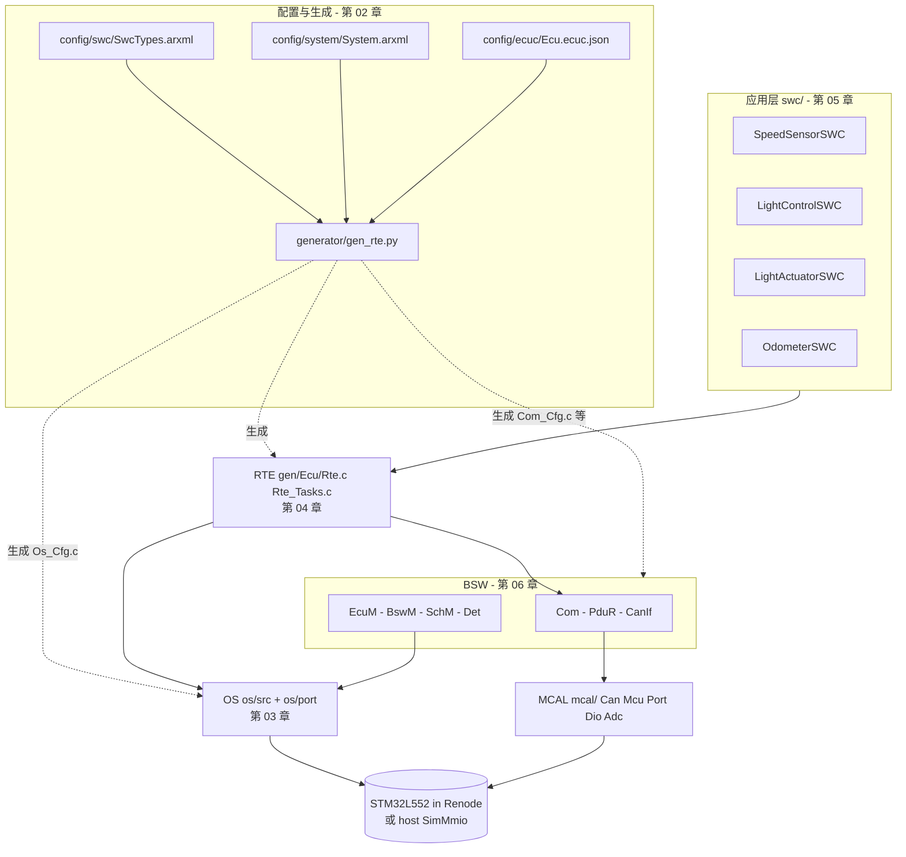

# 14 mini_autosar_ecu 代码走读系列（索引）

> 本系列回答：(1) 在 Classic AUTOSAR 里，**SWC、RTE、OS 的代码到底长什么样、怎么拼在一起**？(2) 一个配置项（ARXML / ECUC）会变成哪一行生成代码、哪一个运行时行为？(3) 在 Renode 里实际跑起来的 trace，每一行分别由谁打印？
> Prerequisite: 读过 [11 入门系列](../11-classic-autosar-primer/README.md) 的 06（OS）、07（RTE 与 OS）、08（SWC 与 RTE 交互）更好，但不是必须，每章都会指回去。
> Next: [01 项目总览](01-project-overview.md)
> 对应代码：`examples/mini_autosar_ecu/`（下文所有路径默认相对于它；`artifacts/…` 与 `docs/…` 相对于仓库根）
> 对应规范（R25-11）：Os SWS、RTE SWS（页码在各章正文逐条给出）

> **[Educational Implementation]** `mini_autosar_ecu` 是本仓库里教学用的 Classic AUTOSAR 项目：两个 ECU（SensorEcu、LightEcu）加一个 rest-bus 测试节点，
> 跑在 STM32L552（Toyota 开源 RAMN 板的 MCU）上，用 Renode 仿真，同一份 SWC / RTE / OS 内核 / BSW 源码还能编成 Windows 可执行文件（host 构建）。
> 它的"架构"忠实于 AUTOSAR，但它不是认证过的产品，所有偏离都记录在 [`DESIGN.md`](../../examples/mini_autosar_ecu/DESIGN.md) §17。

---

## 0. 30 分钟第一次运行（先跑起来，再回头读）

目标：不读任何章节，先在自己机器上看到"配置 → 生成 → 构建 → 仿真 → trace → 调试 → 镜像分析"的完整一圈。下表每一步都给出预期现象和接下来读哪一章。命令都在**仓库根目录**执行。

| 分钟 | 做什么 | 预期结果 | 然后读 |
|---|---|---|---|
| 0–10（仅一次） | `python tools/setup_toolchains.py`（下载 xPack `arm-none-eabi-gcc` 与 Renode portable 到 `tools/toolchains/`；另需 PATH 里有主机 `gcc`） | `tools/toolchains/` 下出现 `xpack-arm-none-eabi-gcc-*` 与 `renode_*-portable` | 本 README §4 |
| 10–13 | `python examples/mini_autosar_ecu/tools/run_mini_autosar.py`（可先加 `--clean` 清掉旧产物；全流程约 1–2 分钟） | 终端逐行 `[OK  ]`，末尾 `OK=89 FAIL=0 SKIP=0`，并写出 `artifacts/mini-autosar/summary.txt` | [01 项目总览](01-project-overview.md) |
| 13–18 | 打开 trace：`artifacts/mini-autosar/renode/uart_b.log`（LightEcu 的 UART，= trace）。用 `grep -n "LightCtl cmd=" artifacts/mini-autosar/renode/uart_b.log` 找到大灯状态变化；再从头看前 60 行 | 每行格式 `[<µs>] ECUB <类别> <文本>`；前 5 行时间戳全是 0（SysTick 还没启动）；之后能看到 `STARTOS`、`TASK_START Task_Init`、`BSWM ACTION …`、`RTE MODE EcuMode=RUN` | [07 启动与 trace](07-startup-trace.md) §3–§6 |
| 18–23 | 读生成的 `examples/mini_autosar_ecu/gen/LightEcu/Rte_Tasks.c`（约 140 行）：先看 `TASK(Task_LightCtl)`（第 84 行起，`WaitEvent` 循环）和 `TASK(Task_LightAct)`（第 123 行起），再回 trace 里找 `EVENT_SET Task_LightCtl` / `TASK_WAIT Task_LightCtl` | 你会发现 trace 里每个 `TASK_*`、`EVENT_SET` 都能在这个文件或 `Rte.c` 里找到触发它的那一行——这就是"RTE 与 OS 的关系" | [04 RTE 代码](04-rte-code.md) §5、§7；背景 [03 OS 代码](03-os-code.md) |
| 23–27 | 看 GDB 会话：打开 `artifacts/mini-autosar/gdb_session.txt`（第一步的全流程已经生成它）。想亲手重跑：`python examples/mini_autosar_ecu/tools/run_mini_autosar.py --step gdb`（会覆盖 `summary.txt`，之后再无参数跑一遍恢复完整汇总） | 依次停在 `Reset_Handler` → `main` → `EcuM_Init` → `StartOS` → `Os_Kernel_SelectNext` → `Task_LightCtl` → `Rte_Write_*` → `Can_Write`，每站有回溯栈和寄存器 | [09 Renode、GDB 与 RH850 移植](09-renode-gdb-and-rh850-porting.md) §4 |
| 27–30 | 打开镜像分析报告 `artifacts/mini-autosar/analysis/LightEcu.md`（`LightEcu.txt` 是纯文本版） | 内存区域用量、段表、最大符号、栈、向量表；FLASH/RAM 用量都很低（本镜像约 16 KB FLASH） | [08 map / ELF / 链接脚本分析](08-map-elf-linker-analysis.md) |

**两个要提前知道的事**：(1) Renode 里的时间戳每次运行会有几 µs～几十 µs 抖动，本系列引用的数字是某一次运行的快照——对照时看**行的顺序和事件名**，不要逐位比较数字（host 构建的时间戳由虚拟时钟给出，是整齐的 `…0000`）；(2) 文中的 `path:line` 取自当前仓库，改过文件后行号会漂移，以符号名为准。

## 1. 这个项目是什么

场景（来自 `DESIGN.md` §1、§11）：

| ECU | SWC | 做什么 |
|---|---|---|
| **SensorEcu**（ECU_A） | SpeedSensorSWC | 每 10 ms 读轮速 ADC，经 CAN `0x101` 周期发出 VehicleSpeed |
| **LightEcu**（ECU_B） | LightControlSWC、LightActuatorSWC、OdometerSWC | 收 `0x101`（车速）、`0x301`（环境光）、`0x3F0`（模式请求），控制大灯，发 `0x201`（灯状态 + 里程） |
| **RestBus** | 手写，不是 AUTOSAR ECU | 发 `0x301`、`0x3F0`，模拟总线上的其他节点 |



## 2. 架构（本系列的"地图"）



读图要点：**SWC 只认 RTE，RTE 是唯一替 SWC 使用 OS 与 Com 的层，OS 的配置表和 RTE 的 task 体都由同一个生成器从同一份配置产生**。
这就是"RTE 和 OS 的关系"的全部骨架，第 04 章会逐行指给你看。

## 3. 阅读顺序

| # | 章节 | 一句话 |
|---|---|---|
| 01 | [项目总览](01-project-overview.md) | 场景、目录 → AUTOSAR 层 → 真实对应物、为什么用 STM32L552 + Renode + GCC、host / target 两种构建、与真实系统的差别 |
| 02 | [配置与生成](02-config-and-generation.md) | ARXML / ECUC 每个配置项如何变成生成代码（并排对照表）、生成器流水线、校验报错、动手加一个 Runnable |
| 03 | [OS 代码](03-os-code.md) | TCB / 就绪队列 / Alarm / Resource / Cat2 ISR / Hook、cm33 的 PendSV 上下文切换逐行、host 的 Fiber 移植、Renode 上的 OS 自检 trace |
| 04 | [RTE 代码](04-rte-code.md) | **核心章**：`Rte_<Swc>.h` 契约头、`Rte.c`、`Rte_Tasks.c`、事件到 task 的映射、RTE 与 OS 在代码里的关系、完整 trace |
| 05 | [SWC 代码](05-swc-code.md) | 四个 SWC 怎么只靠 `Rte_<Swc>.h` 写业务 |
| 06 | [Com / CAN 栈代码](06-com-can-stack-code.md) | Com → PduR → CanIf → Can，一帧报文的完整路径 |
| 07 | [启动与 trace](07-startup-trace.md) | Reset → `EcuM_Init` → `StartOS` → `Task_Init` → BswM 规则 |
| 08 | [map / ELF / 链接脚本分析](08-map-elf-linker-analysis.md) | 用 `analysis/*.md` 读镜像：段、符号、栈、向量表 |
| 09 | [Renode、GDB 与 RH850 移植](09-renode-gdb-and-rh850-porting.md) | 在 Renode 里下断点、读 `gdb_session.txt`；把项目移植到 RH850 要换什么 |

建议顺序：**严格按编号 01 → 02 → … → 09**（每章开头的 `Prerequisite` / `Next` 就是这条链：README → 01 → 02 → 03 → 04 → 05 → 06 → 07 → 08 → 09）。
赶时间、只想最快搞懂"RTE / SWC / OS 怎么结构化"：读 **02（只看对照表）→ 03 的 §3–§5（先知道 `ActivateTask` / `SetEvent` / `WaitEvent` 做什么）→ 04**。

## 4. 怎么运行

前置（仅一次，`README.md` 的 "前置条件"）：

```
python tools/setup_toolchains.py        # 下载 xPack arm-none-eabi-gcc 与 Renode portable 到 tools/toolchains/
```

另需 PATH 里有主机 `gcc`（TDM / MinGW）；Python 只用标准库。

一条命令全流程（在仓库根执行）：

```
python examples/mini_autosar_ecu/tools/run_mini_autosar.py
```

它依次做：生成 → 头文件检查 → 链接脚本检查 → host / target 构建 → 镜像分析 → 单元测试 → host 双 ECU 仿真 → Renode 三机场景 → GDB 会话。
也可只跑部分步骤（`tools/run_mini_autosar.py:453` 的 `--step` 选项，可选值 `headers ldcheck gen gencc host target unit sim renode analyze gdb`）：

```
python examples/mini_autosar_ecu/tools/run_mini_autosar.py --step gen --step host --step sim    # 约 4 秒：改配置后的"改-生成-看 trace"循环
```

OS 单独的 Cortex-M33 自检（第 03 章用）：

```
python examples/mini_autosar_ecu/os/port/cm33/selftest/run_selftest.py
```

## 5. 输出在哪里（`artifacts/mini-autosar/` 下）

| 内容 | 路径 |
|---|---|
| 汇总（`OK=… FAIL=… SKIP=…`，本次 `OK=89 FAIL=0 SKIP=0`） | `artifacts/mini-autosar/summary.txt` |
| host 运行的 trace 日志 | `artifacts/mini-autosar/host/ecuA.log`、`ecuB.log`；CAN 帧 `ecuA_can_tx.txt` |
| Renode 三机场景的 UART（= trace）日志 | `artifacts/mini-autosar/renode/uart_a.log`（SensorEcu）、`uart_b.log`（LightEcu）、`uart_rest.log` |
| OS 单独自检的 UART 日志 | `artifacts/mini-autosar/os-selftest/uart.log` |
| 镜像分析报告 | `artifacts/mini-autosar/analysis/LightEcu.md`、`SensorEcu.md`（及 `.txt`） |
| GDB 脚本化会话 | `artifacts/mini-autosar/gdb_session.txt` |
| 目标镜像 / map / 内存占用 | `artifacts/mini-autosar/target/<Ecu>/`（`.elf` `.map` `.link.log`） |

**Trace 行格式**（`DESIGN.md` §12，`include/Trace.h`）：`[<t_us:09u>] <ECU:4> <CAT:5> <text>`，例如
`[000000018] ECUB OS    TASK_START Task_Init prio=10`（`artifacts/mini-autosar/renode/uart_b.log` 第 6 行）。
本系列大量引用这些行：**每章里出现的 trace 片段都是从上述真实日志里原样摘出来的**。

## 6. 本系列的约定

* 文中标记：`[AUTOSAR Standard]`（规范明文规定）、`[Educational Implementation]`（本项目的教学实现）、`[Industry Practice]`（行业常见做法，非规范）、`[Conceptual]`（概念类比）。
* 代码引用写成 `path:line`，行号取自当前仓库；引用的代码块与文件一致。若你改了文件，行号会漂移，请以符号名为准。
* 规范引用写成 “Os SWS R25-11 p.38, SWS_Os_00424”，页码是 `artifacts/pdf-text/autosar-cp-R25-11/*.txt` 里 `=== PDF PAGE n ===` 的 PDF 页码。
* 生成文件（`gen/<Ecu>/*`）已入库，所以不跑生成器也能读；但它们**不要手改**，改配置再重新生成（第 02 章）。
* 商业工具名（Vector MICROSAR / DaVinci、ETAS RTA-CAR / RTA-OS、EB tresos 等）只在 `[Industry Practice]` 对照里出现；本项目不使用也不包含它们。

## 7. 与其它章节的关系

| 想看理论 | 去哪 |
|---|---|
| OS 概念（Task/ISR/Event/Alarm/Resource） | [11/06 OS 基础](../11-classic-autosar-primer/06-os-basics.md)、[02/06 OS Task ISR](../02-autosar-classic/06-os-task-isr.md) |
| RTE 与 OS 的桥 | [11/07 RTE 与 OS](../11-classic-autosar-primer/07-rte-and-os.md)、[07/04 RTE 概念](../07-rte-swc/04-rte-concept.md)、[07/05 RTE 生成](../07-rte-swc/05-rte-generation.md) |
| SWC 如何与 RTE 交互 | [11/08 SWC 与 RTE 交互](../11-classic-autosar-primer/08-swc-rte-interaction.md) |
| ECU 启动与 EcuM / BswM | [11/04 ECU 启动](../11-classic-autosar-primer/04-ecu-startup-ecum.md)、[02/03 ECU 启动](../02-autosar-classic/03-ecu-startup.md) |
| 配置（ARXML / ECUC）与生成代码 | [02/04 配置 ARXML](../02-autosar-classic/04-configuration-arxml.md)、[02/05 生成代码](../02-autosar-classic/05-generated-code.md) |
| RH850 硬件、启动、链接、中断 | [01-rh850/04 启动](../01-rh850/04-startup-process.md)、[05 链接脚本](../01-rh850/05-linker-script.md)、[06 中断](../01-rh850/06-interrupt-exception.md) |
| CAN MCAL | [04-can-mcal/](../04-can-mcal/07-hoh-hrh-hth.md) |
