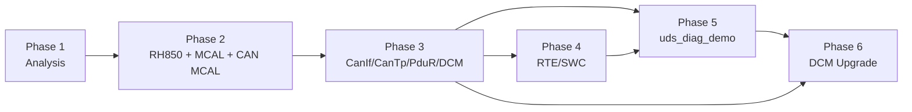

# Phase 1 分析与学习计划（Analysis and Learning Plan）

> 对应要求：`claude_plan.md` §1–§4、§13、§20（Phase 1）、§23、§24，以及 “Project Context / Information Boundary / 文档架构要求”。
> 依据：`docs/reference/research/00-writing-conventions.md` 与 Phase 1 research notes 01–04（下文简称 **N01**–**N04**）。
> 日期：2026-10-01。本文件只做分析与规划，不承载教学正文。
> Source of Truth 优先级：AUTOSAR SWS > RH850 hardware manual > actual source code > project docs > previous agent output。

资料简称（与 N01/N04 一致）：

| 简称 | 文件 | 说明 |
|---|---|---|
| HW-E | `references/downloads/r01uh0585ej0120.pdf` | RH850/P1M-E User's Manual: Hardware Rev.1.20（目标器件主依据） |
| DS-E | `r01ds0505ed0100-rh850p1m-e.pdf` | RH850/P1M-E Datasheet |
| HW-X | `REN_r01uh0436ej0140-rh850p1x_MAH_20180330_1.pdf` | RH850/P1x（P1H/P1M，**非 -E**）硬件手册，仅作对照 |
| DS-C | `REN_r01ds0506ed0100-rh850p1x-c_DST_20251218.pdf` | P1x-C 数据手册（M_CAN），与目标器件无关 |
| SWS-MCU | `AUTOSAR_CP_SWS_MCUDriver.pdf` | Classic **R24-11** |
| SWS-CAN | `AUTOSAR_SWS_CANDriver.pdf` | Classic **R22-11** |
| SWS-DCM | `AUTOSAR_SWS_DiagnosticCommunicationManager.pdf` | Classic **R20-11** |
| SWS-IoHwAb | `AUTOSAR_CP_SWS_IOHardwareAbstraction.pdf` | Classic **R24-11** |
| SWS-Diag(AP) | `AUTOSAR_SWS_Diagnostics.pdf` | **Adaptive Platform R22-11**（不是 Classic DCM） |

---

## 1. 当前状态（Project Mental Model）

### 1.1 这是什么项目

[Real Project Consideration] 本仓库是一个**个人学习 / 教学 / 技术准备项目**，不是公司内部的 RTA-CAR 工程。真实的 RH850 ECU、RTA-CAR 工程、MCAL、BSW 配置、generated code、原理图、CAN database、诊断配置都**不在本仓库**，也不应被推断或虚构（`claude_plan.md` “Project Context”“Information Boundary”）。

项目目标经历过三次变化（N01 §1.1），这决定了既有文档的“语气”为什么和现在的要求不一致：

| 阶段 | 目标 | 产物 | 对当前教程的意义 |
|---|---|---|---|
| ① 上板实施计划（历史） | 在 R7F701381 上解决 RTA-CAR 12.9.0 工程的 `Rte_TickCounter` 链接阻塞、生成 ELF、上板 | `plan-implementation-history.md` | bring-up checklist 的雏形，可作为“真实项目会遇到什么问题”的案例 |
| ② “交给内部 agent”的技术解说（历史） | 回答 A1–J4、K1、R1–R7 共 40+ 问，产出硬件交接资料 | `plan.md`、`docs/agent-guide.md`、`docs/rh850-hardware-handoff.md`、`docs/internal-agent-task.md` 等 | 硬件事实质量高，但叙事是“内部 agent 去改内部工程”，与当前 Project Context 冲突 |
| ③ 当前（`claude_plan.md`） | 中文工程教程：RH850 → MCAL → CAN → CanIf → CanTp → PduR → DCM → RTE → SWC，为未来 RTA-CAR DCM 升级建立 transferable knowledge | 本文件及后续章节 | 以“教学 + 真实项目需确认”为唯一语境 |

### 1.2 目标器件（已核实）

[RH850 Hardware] **R7F701381 = RH850/P1M-E**，DPS，Code Flash 1 MB，LFQFP100（DS-E p.2 Table 1.1）。

| 项 | 事实 | 出处 |
|---|---|---|
| CPU core | **RH850G3M**，1 个主核 + lock-step checker（checker 不是第二个可调度核），**不是 G4MH** | DS-E p.1–2；HW-E p.187、p.250 |
| 时钟 | MainOSC 16 MHz（only）→ PLL → CLK_CPU 160 MHz；CLK_HSB 80 MHz；CLK_LSB 40 MHz；IOSC 8 MHz | HW-E p.469–470 |
| PLL / 写保护 | **没有软件可编程的 PLL/MOSC 使能或 CPU 时钟选择寄存器**；**没有 PROTCMDn/PROTSn**；时钟控制器靠 Slave Guard 防误写（p.471），复位寄存器靠 P-Bus Guard（p.420）；`0xA5` 解锁序列只用于 CLMA / ECM / FLMDCNT | HW-E §12.3 p.471、p.2764、p.2795、p.2870；全文 grep `PROTCMD` 0 命中（N04 §4.4） |
| CAN 外设 | **RS-CANFD**，1 unit（RSCFD0）、3 channels，base `0xFFD2_0000`；Classical / FD 两套寄存器偏移（GRMCFG.RCMC 选择） | HW-E p.788–802、p.916–919 |
| fCAN | GCFG.DCS：0 = clkc 40 MHz，1 = clk_xincan 16 MHz；pclk 80 MHz 只是接口时钟，**不能用来算波特率** | HW-E p.791、p.817 |
| CAN 中断 | EI183–193；CAN0 ERR/REC/TRX = 183/184/185；global error = 189；**RX FIFO0–7 = 190（INTRCANGRECC）**；EI184 是 CAN0 **common（Tx/Rx）FIFO** 接收中断 | HW-E p.285–286、p.792 |
| 存储 | Code Flash `0000_0000–000F_FFFF`；LRAM self `FEDE_0000–FEDF_FFFF`（128 KB）；GRAM A/B 各 32 KB；Data Flash `FF20_0000–FF20_7FFF` | HW-E p.257 |

[Real Project Consideration] 公司内部实际使用哪颗 derivative，**需要在真实项目环境中确认**（读 PRDNAME1–4，HW-E p.2880；或核对 BOM）。如果是 P1x（非 E），CAN 是 RS-CAN 且有 PROT1PHCMD；如果是 P1x-C，CAN 是 M_CAN（DS-C p.4）——三者寄存器不能互相套用（N04 §1.1）。

### 1.3 什么是真实 C 代码、什么是 mock、什么只是文档

| 内容 | 分类 | 路径 | 实际做了什么 / 局限 |
|---|---|---|---|
| MMIO 抽象 | [Educational Implementation] | `examples/rh850_mcal_reference/platform/Rh850_Mmio.[ch]` | 8/16/32 位写、8/32 位读，可替换为 fake bus；**无 read16**、无 SYNCP、无临界区（N01 §2.1） |
| OSTM 底层驱动 | [RH850 Hardware] 寄存器级，非 AUTOSAR Gpt API | `examples/rh850_mcal_reference/mcal/gpt/Ostm.[ch]` | OSTM0/1 初始化、Start/Stop（有界轮询）、CMP=N−1 换算；无 `Gpt_Init`/通知/ISR/EIC |
| CAN 位时间计算 | [RH850 Hardware] 纯计算 | `examples/rh850_mcal_reference/mcal/can/Can_BitTiming.[ch]` | 只支持 FD 接口 NCFG/DCFG 编码；Classical CFG 只在文档和 `tools/build_hardware_index.py` 的 assert 中；不写寄存器 |
| Tick 累计器 | [Educational Implementation] | `examples/rh850_mcal_reference/integration/Tick_Accumulator.[ch]` | 32 位自由计数 → 16 位 1 ms tick；无 `Os_Cbk_*` |
| 主机测试 | 测试 | `examples/rh850_mcal_reference/tests/test_reference.c` | 5 组测试，TDM-GCC 10.3.0 复测通过（N01 §2.3）；**只证明算术与访问宽度，不证明任何目标硬件行为** |
| 寄存器索引 | 数据 | `docs/hardware-registers.csv/.json` | 1185 条，`build_hardware_index.py --check` 通过；不是 SVD，无位域 |
| Mcu/Port/Dio/Gpt/Icu/Wdg/Fls 驱动、Can_Init/Write/ISR、启动代码、链接脚本、CanIf、CanTp、PduR、DCM、DEM、NvM、RTE、SWC、OS port | **doc-only 或完全没有** | — | 本仓库**没有**这些代码（N01 §2.1；`docs/mcal-reference-guide.md:193-202` 自己也如实列出） |

结论：当前项目在 C 代码层面只覆盖“RH850 寄存器访问模型 + 两个计算组件”。**诊断链路（CAN → … → DCM → RTE → SWC）在本仓库中一行代码都没有**，这正是 Phase 5 要补的 `examples/uds_diag_demo/`（见 §5）。

### 1.4 外部参考：openAUTOSAR

`D:\side_project\openAUTOSAR`（HEAD `13499119`）= **Arctic Core 2.18.0，主体 AUTOSAR R3.1.5 风格**（N03 §0、§1.7）：

- BSW 上层（CanIf / CanTp / PduR / Dcm / Dem / NvM / EcuM / SchM / OS kernel）源码较完整、可读；
- **没有 Can driver**（`boards/linuxOs/MCAL/Can/` 只有 `Can_Cfg.h`）、**没有 CAN 仿真**、没有 OS arch port、大部分 `*_Cfg.c/*_PBcfg.c` 缺失、**没有任何 `add_executable` 把 BSW 链接起来**——“能单文件编译，不能链接，更不能运行”（N03 §1.2、§8.4）；
- 诊断路径在现有配置下不通：CanIf 未开 `USE_CANTP`；`CanTpRxIdList` 为 NULL；`PduR_Cfg.h:77-130` 的 zero-cost 宏无条件生效导致路由表被绕过并产生重复符号；`DCM_Config` 未定义；`DCM_USE_SERVICE_*` 全仓无人定义 → 所有请求回 NRC 0x11（N03 §3.3）；
- TP 接口是 R3.x 的 `Dcm_ProvideRxBuffer/ProvideTxBuffer + NotifResultType`，不是 R4.x 的 `StartOfReception/CopyRxData/CopyTxData + Std_ReturnType`（N03 §4.8）；
- DCM 没有 RTE port 路径：`DspDidUsePort` 是死字段，`Rte_Dcm.h` 是空文件，应用接口全是配置中的 C 函数指针（N03 §4.4、§5）；
- `rte/src/rte.c` 是 65 行命名草稿，不是 RTE（N03 §5）。

### 1.5 既有文档质量（引用 N01 §3）

| 文件 | 质量评估 | 对 DCM 升级价值 | 处理 |
|---|---|---|---|
| `docs/rh850-hardware-handoff.md` | **全仓最有价值的 RH850 硬件资料**；抽查全部正确；偏 register cookbook，缺“为什么”与 AUTOSAR API 对应；“内部 agent”语境 | 高（CAN 链路 debug 必需） | 主要种子，按节拆入 01-rh850 / 04-can-mcal |
| `docs/agent-guide.md` | A–J 问答，硬件事实大多正确；EI184 措辞有误；无 SWS 映射、无 DCM | 中 | 拆分；问答形式本身转为 legacy |
| `docs/hardware-findings.md` | 首轮核查，抽查吻合；与 handoff 重复 | 中 | merge 到 reference/ 与 01-rh850 |
| `docs/counter-design.md` | Rte_TickCounter 硬件/软件计数器设计，技术扎实；缺 OS SWS（本地无） | 中 | 拆入 02-autosar-classic/06 与 03-mcal/05 |
| `docs/mcal-reference-guide.md` | R1–R7 七模块设计解说；只有“职责+步骤”，无 SWS API 表、无配置容器、无代码 | 中 | 拆入 03-mcal 各章 |
| `docs/rh850-autosar-tutorial-content.md` | 单页大教程 Markdown 源（532 行）；硬件/CAN 部分可用；**DCM 只有 1 段**；24 个悬空锚点、7 个 HTML 占位；无 H1 | 中-高 | 重构为 Master Index |
| `docs/internal-agent-task.md` | 给“内部 agent”的指令，**语境违反 Project Context** | 中（改写为真实项目 checklist） | 内容迁入 09-real-project-preparation |
| `docs/hardware-review.md` | 对前次文档的 15 项修正，是“常见误区”素材 | 低 | 误区并入 04-can-mcal/15 |
| `docs/source-index.md` / `online-references.md` | 溯源与外部资源；未列 5 份 AUTOSAR PDF 及其 release；无 openAUTOSAR 条目 | 中 / 低 | 迁入 reference/source-traceability.md 并补全 |
| `docs/requirements-status.md`、`plan.md`、`README.md` | 项目管理；自称“完成”，易误导 | 低 | legacy |
| openAUTOSAR `docs/autosar-classic/`（13 篇，git 未跟踪） | 结构好、诚实度较好，但**未指出链接期重复符号与 CanIf 未接 CanTp**；单篇 1000–2300 行，偏百科；与 RH850 无关（N03 §1.5） | 中（代码导读） | 只作二级参考，行号需复核 |

既有文档的**优点值得延续**：证据分级（手册事实 / 推导 / 未知）、拒绝编造 ABI、“候选值 ≠ 实测值”——这与本教程的 `[AUTOSAR Standard] / [RH850 Hardware] / [Educational Implementation] / [Real Project Consideration]` 标签可以一一对应（N01 §3.1 第 6 条）。

---

## 2. AUTOSAR module / source / RH850 hardware mapping

说明：
- “SWS 本地？”= 仓库根目录是否有该模块 SWS PDF。没有的模块，教程中**不得编造 SWS ID**，只描述公认的 R4.x API 形态并标注“本仓库无该 SWS，需以真实项目所用 release 的 SWS 确认”。
- openAUTOSAR 路径相对 `D:\side_project\openAUTOSAR\`，全部来自 N03 的实际 grep。
- “当前项目”列中 `examples/uds_diag_demo/` 为 **Phase 5 计划新增**，此刻尚不存在。

| AUTOSAR module | SWS 本地？release | openAUTOSAR path & status | 当前项目 path / status | RH850/P1M-E hardware |
|---|---|---|---|---|
| **Mcu** | ✔ SWS-MCU **R24-11** | `boards/linuxOs/MCAL/Mcu/src/Mcu.c`（`Mcu_Init :345`、`Mcu_InitClock :382`、`Mcu_DistributePllClock :400`）；AR **2.2.2**，PowerPC 遗留；配置实例缺失 | 无代码；`docs/mcal-reference-guide.md` R1 设计解说 | 无软件 PLL 寄存器（HW-E p.471）→ `McuNoPll` 场景（`ECUC_Mcu_00180`）；RESF `0xFFF8_1000`（p.420–422）→ `Mcu_GetResetReason`；SWSRESA0/SWARESA0 → `Mcu_PerformReset`；STAC_* → RAM init；CLMA 0xA5 序列 |
| **Port** | ✘ | `boards/linuxOs/MCAL/Port/src/Port.c`（`Port_Init :98`，写 STM32 GPIO）；AR 3.1.0；无 CMake | 无代码；handoff §3 寄存器资料 | PORT base `0xFFC1_0000`；PMC/PFC/PFCE/PFCAE/PM/PIPC；ALT 编码 `[PFCAE,PFCE,PFC]`（HW-E p.94）；CAN 引脚 PIPC=0（p.131）；无 PPCMD 保护 |
| **Dio** | ✘ | `boards/linuxOs/MCAL/Dio/src/Dio.c`（STM32）；无 CMake | 无代码 | Pn / PSRn（原子置位）/ PPRn（HW-E p.96–99）；收发器 STB/EN 引脚由原理图决定 |
| **Gpt** | ✘ | `boards/linuxOs/MCAL/Gpt/src/Gpt.c`（STM32 TIM）；无 CMake | `examples/rh850_mcal_reference/mcal/gpt/Ostm.[ch]`（底层，非 Gpt API） | OSTM0/1（EI74/75，PCLK 80 MHz）；OSTM3–7 只能 FEINT；无 OSTM2（HW-E p.1542–1544） |
| **Icu** | ✘ | 无 | 无 | TAUD0–2 / TAUJ0–2 输入测量、INTP0–12（HW-E p.1679、p.1687、p.280） |
| **Can** | ✔ SWS-CAN **R22-11** | **定义缺失**：仅 `include/Can.h:313-334` 声明、`boards/linuxOs/MCAL/Can/include/Can_Cfg.h`；AR 3.1.5；Arctic 特有 `Can_CallbackType` 函数指针表 | `mcal/can/Can_BitTiming.[ch]`（FD 位时间计算）；无 Can_Init/Write/ISR | RS-CANFD：channel ↔ CanController；TX buffer ↔ HTH；AFL 规则 + RX FIFO/RX buffer ↔ HRH + CanHwFilter（GAFLM 位=1 比较）；TMSTSp.TMTRF ↔ TxConfirmation；EI183–193 |
| **CanIf** | ✘ | `communication/CAN/CanIf/src/CanIf.c`（`CanIf_Transmit :424`、`CanIf_RxIndication :764` R3 四参数签名）；`CanIf_Cfg.c` 只有 1 Tx + 1 Rx PDU、**未接 CanTp**；`:820` 死循环缺陷 | 无 → `examples/uds_diag_demo/`（计划） | 无直接硬件（ECU Abstraction 侧）；PduMode/ControllerMode 闸门 |
| **CanTp** | ✘ | `communication/CAN/CanTp/src/CanTp.c`（状态机完整，`CanTp_MainFunction :1172`）；`CanTpRxIdList` 未初始化；周期宏 1000 ms | 无 → `uds_diag_demo`（计划） | 无直接硬件；N_Ar/N_Bs/N_Cr 计时依赖 MainFunction 周期（最终来自 OSTM/OS counter） |
| **PduR** | ✘ | `communication/ComServices/PDURouter/src/*`；`PduR_Cfg.h:77-130` zero-cost 宏 bug；`PduR_Config` 实例缺失 | 无 → `uds_diag_demo`（计划） | 无 |
| **ComStack_Types** | ✘ | `include/ComStack_Types.h`（版本宏 0.1.0，未维护） | 无 → `uds_diag_demo`（计划） | 无 |
| **Dcm** | ✔ SWS-DCM **R20-11**（`AUTOSAR_SWS_Diagnostics.pdf` 是 **AP**，不可用） | `diagnostic/Dcm/src/Dcm.c`、`Dcm_Dsl.c`、`Dcm_Dsd.c`、`Dcm_Dsp.c`；AR 3.1.5；`DCM_Config` 缺失；`DCM_USE_SERVICE_*` 未定义 | 无代码；既有 docs 仅 tutorial §13 一段 → `uds_diag_demo`（计划） | 无直接硬件；`Dcm_MainFunction` 在 OS task 中周期运行（周期 `DcmTaskTime`） |
| **Dem** | ✘ | `diagnostic/Dem/src/Dem.c`；`Dem_LCfg.c` 错放在 `include/`、未编译 | 无（Phase 3 只做 stub） | 无 |
| **NvM** | ✘ | `memory/NvM/src/NvM.c`；`NvM_Config` 缺失 | 无（Phase 4/5 只做 stub） | Data Flash `FF20_0000`，FACI 细节需 Flash 手册（本仓库无） |
| **Rte** | ✘ | `rte/src/rte.c` 65 行草稿；`examples/rte_simple/`（AR 3.1.5 ARXML，生成头缺失） | 无 → `uds_diag_demo` 中手写 `Rte_VehicleInfoSWC.h`（计划，[Educational Implementation]） | 无 |
| **Os** | ✘ | `system/kernel/src/*`（OSEK kernel；无 arch port、无 `Os_TaskConstList`；`isr.c` 未编译） | `integration/Tick_Accumulator.[ch]`；`docs/counter-design.md` | OSTM0/1 作 OS counter；EIC/INTBP/EIBD；PSW.ID/PMR/ISPR 实现临界区 |
| **SchM** | ✘ | `system/SchM/src/SchM.c`（单 BSW task + 计数分频；实际周期 ≈25 ms 与 Dcm 10 ms / CanTp 1000 ms 假设不一致） | 无 → `uds_diag_demo` 用单一周期配置的 super-loop（计划） | 无 |
| **EcuM** | ✘ | `system/EcuM/src/EcuM.c`、`EcuM_Callout_Stubs.c`（DriverInitZero/One/Two/Three）；`EcuMConfig` 缺失 | 无 | 启动顺序：startup code → Mcu → Port → Can … |
| **BswM** | ✘ | **完全没有**（全仓 0 命中） | 无 | 无（0x11 ECUReset 的 `DcmEcuReset=EXECUTE` 最终经 BswM 落到 `Mcu_PerformReset`，需真实项目确认） |
| **ComM / CanSM** | ✘ | `system/ComM/src/ComM.c`（`ComM_DCM_ActiveDiagnostic :400`）；`CanSM.c` 极简 | 无 | Bus-off 恢复策略 ↔ CmCTR.BOM（HW-E p.807） |
| **Det** | ✘ | `debug/Det/src/Det.c` | 无 → `uds_diag_demo` 用 printf 版 Det（计划） | 无 |
| **IoHwAb** | ✔ SWS-IoHwAb **R24-11** | 无（`iohwabs/` 只有 Fee/MemIf/Ea/WdgIf） | 无 | 组合 ADC/PWM/DIO/ICU；取决于原理图，示例只能 [Conceptual] |
| **Wdg / Fls** | ✘ | `boards/linuxOs/MCAL/Wdg|Fls` 仅头文件/少量源码 | 无；mcal-reference-guide R6/R7 解说 | WDTA0（OPBT0 决定是否自启动）；Code/Data Flash FACI（手册缺） |

---

## 3. 现有文档的错误、重复与知识缺口

### 3.1 需要修正的具体错误 / 误导点

> 行号为本次复核时的当前行号。注意：N01 中对 `docs/hardware-findings.md` 的部分行号与当前文件不符（例如 EI184 实际在 `hardware-findings.md:86`，文件只有 138 行），后续章节引用前必须重新 grep。

| # | 位置 | 问题 | 正确事实 / 处理 | 依据 |
|---|---|---|---|---|
| E1 | `docs/agent-guide.md:71` | 把 EI183/184/185 写成 “CAN0 error/**RxFIFO**/Tx”，易让人把 Rx FIFO 中断挂在 EI184 | EI184 = INTRCAN0REC，CAN0 **common（Tx/Rx）FIFO** 接收中断；RX FIFO0–7 共用 **EI190**（INTRCANGRECC）。若只配 CAN0 的 183/184/185，用 RX FIFO 收的诊断请求永远进不了 CanIf | HW-E p.285–286、p.792；`rh850-hardware-handoff.md:282` 已写对 |
| E2 | `docs/hardware-findings.md:86` | 标签 “CAN0 Tx/Rx FIFO receive completion” 与手册一致，但与 RX FIFO 行并列时读者难区分 | 章节中明确 common FIFO（k，每通道 3 个）≠ RX FIFO（x，全模块 8 个） | HW-E p.789–790 |
| E3 | `docs/rh850-autosar-tutorial-content.md:231` vs `docs/mcal-reference-guide.md:26` / `docs/counter-design.md` / `docs/agent-guide.md:18` | “本案例可为 OS 独占 **OSTM0**” 与 “OSTM0 保留给原有 Gpt、OSTM1 = OS 候选” 不一致 | 这是**配置选择，不是硬件事实**。教程统一写：OSTM0/1 都可作 OS counter 或 Gpt channel；教学 demo 选择一种并说明；真实项目以 OS/MCAL 配置为准 | 00-writing-conventions §2 |
| E4 | `docs/rh850-autosar-tutorial-content.md:333` | `return CAN_OK;` 未标注 AUTOSAR release | R22-11：`Can_Write` 返回 `Std_ReturnType`（E_OK / E_NOT_OK / CAN_BUSY）[SWS_Can_00233] SWS-CAN p.80–81；`Can_ReturnType`（CAN_OK/CAN_NOT_OK/CAN_BUSY）属 ≤4.2.x 时代（本地无 4.2.2 SWS，unverified locally）。**RTA-CAR 环境的 Renesas MCAL 标称 AR 4.2.2 API，真实项目里很可能看到 `CAN_OK`**——两种都要教 | N01 §1.5、N02 §2.11 |
| E5 | `docs/rh850-autosar-tutorial-content.md` 全文 | 24 处 `[R01]…[R21](#ref-rNN)` 锚点未定义（例：`:78`、`:82`、`:83`）；7 个 `<div id=...>` HTML 占位（`:59`、`:292`、`:368`、`:479`、`:517`、`:529`、`:531`）指向不存在的 HTML 构建；无 H1 | 重构为 Master Index 时删除占位，改为相对链接到 `reference/source-traceability.md` | N01 §6 |
| E6 | `docs/rh850-autosar-tutorial-content.md:12, :214, :498, :500-502, :523`；`docs/rh850-hardware-handoff.md:1, :3, :7, :46`；`docs/internal-agent-task.md:1-3` | “内部 agent / 内部工程”叙事违反 Project Context | 改写为“教学项目 + 真实项目需确认”；内容迁入 09-real-project-preparation | `claude_plan.md` Project Context |
| E7 | `docs/mcal-reference-guide.md:54` | 列 `Mcu_GetPllStatus / Mcu_DistributePllClock`，未把 P1M-E “无软件 PLL” 连接到 SWS 的 `McuNoPll` 机制（同文件 `:44` 已正确说明不要写 PLL 序列） | 写清：在 P1M-E 上这两个 API 大概率是平凡实现——`McuNoPll=TRUE` 时 `Mcu_DistributePllClock` 被禁用、`Mcu_GetPllStatus` 恒返回 `MCU_PLL_STATUS_UNDEFINED`；真实 MCAL 如何实现需确认 | `ECUC_Mcu_00180`、`SWS_Mcu_00205/00206`（SWS-MCU p.28–29、p.41）；HW-E p.471 |
| E8 | **PROTCMD / PLL 概念误区**（风险来源：`claude_plan.md` §6/§15 的教学模板“unlock protected registers → configure PLL → wait lock”；仓库里同时存在 HW-X） | 学习者容易把 F1x / P1x（非 E）的 `PROTCMD`/`PROT1PHCMD` + PLL 启动序列套到 P1M-E | P1M-E：无 PROTCMDn/PROTSn、无软件 PLL；写保护 = Slave Guard（时钟控制器，p.471）/ P-Bus Guard（复位寄存器，p.420）；`0xA5` 序列只用于 CLMA / ECM / FLMDCNT。**既有 docs 在这点上是对的**（`rh850-hardware-handoff.md:40`、`mcal-reference-guide.md:44`），新章节必须保持：先讲 AUTOSAR 通用模型 + “典型 RH850（F1x/P1x/U2A）有 PLL/PROTCMD”，再明确 P1M-E 实际情况 | HW-E p.471、p.2764；HW-X p.257–261；N04 §4.4 |
| E9 | `requirements-extracted.md:47, :70` | 写 “RS-CAN”；`iROM 2048K`；`80 MHz fCAN` | 应为 RS-CANFD；R7F701381 是 1 MB；fCAN 为 40/16 MHz。文件属原始需求转录，**保持原样**，教程中以“案例问题”引用 | HW-E p.791；DS-E p.2 |
| E10 | `claude_plan.md` §3 把 `AUTOSAR_SWS_Diagnostics.pdf` 列为要读的规范 | 该 PDF 是 **Adaptive Platform R22-11 Diagnostic Management（ara::diag）** | 只能作为 CP DCM 的“概念对照”（如校验顺序 `SWS_DM_00096`），**不能**用于推导 CP DCM API/配置 | SWS-Diag(AP) p.1、p.26；N02 §4 |
| E11 | 全部 `docs/*.md` | `grep "SWS_"` 0 命中：零 SWS 追溯 | 每章至少给出关键 SWS ID + release + 页码 | N01 §3.1 |
| E12 | Classical 500 kbps 示例：`hardware-review.md:11`、`rh850-autosar-tutorial-content.md:286`、`rh850-hardware-handoff.md:162` 为 `CFG=0x023E0003`；N04 §8.4 示例为 `0x003E0003` | **两者都对**，区别是 SJW（3 Tq vs 1 Tq）。但文档没有说明 SJW 选择，且手册 Fig.17.17 “TSEG1>TSEG2>SJW” 与 p.922 “SJW ≤ TSEG2” 内部不一致 | 04-can-mcal/03 必须写出 SJW 取舍与手册不一致处 | HW-E p.804、p.922、p.1092 |
| E13 | CAN pin ALT 号（`rh850-hardware-handoff.md` §3） | ALT 号来自旋转排版表格（HW-E p.151–154），文本抽取列对齐不可靠 | 标 “◐ 需在 PDF 原表逐格核对”；板卡实际引脚由原理图决定 | N01 F-CAN-13；N04 §6.3 |
| E14 | openAUTOSAR `docs/autosar-classic/10-...md:2160` | 称诊断栈“可读、可编译” | 单文件可编译属实；但**无法链接**（PduR 宏导致 `Dcm_ProvideRxBuffer`/`CanTp_Transmit`/`Com_RxIndication` 重复定义），且 CanIf 未接 CanTp、DCM 无服务 | N03 §1.5、§3.3 |

### 3.2 重复

存储表、时钟表、中断表、OSTM 寄存器、CAN 位时间至少在 `agent-guide.md`、`hardware-findings.md`、`rh850-hardware-handoff.md`、`rh850-autosar-tutorial-content.md` 四处重复，措辞略有差异（E1/E2 就是差异导致的）。**原则：单一事实源**——硬件事实写在 `reference/rh850-autosar-mapping.md` 与对应章节一处，其他地方链接。

### 3.3 知识缺口（按对 DCM 升级目标的重要性排序）

1. **DCM / RTE / SWC 几乎空白**：DSL/DSD/DSP、会话/安全、DID、OpStatus 异步模型、DEM/NvM 交互、RTE/SWC 在既有 docs 合计不足一屏（tutorial `:370-405`）。这是与最终目标最相关、也是最大的缺口。
2. **CanIf / CanTp / PduR 很薄**，且本地无 SWS；openAUTOSAR 只有 R3.1.5 形态。
3. **Can driver 那一跳（RS-CANFD ISR/polling → `CanIf_RxIndication`）无任何参考实现**：openAUTOSAR 没有 Can.c（N03 §2.1），必须由本教程基于 SWS-CAN + HW-E 自己写。
4. **启动代码 / 链接脚本 / 向量表**：没有任何真实 `.ld` 或 `crt0`；异常向量偏移（除 FENMI/FEINT/EIINT 外）需要 RH850G3M Software Manual（本仓库没有）。
5. **配置链**：ARXML → generator → `*_Cfg.c/PBcfg.c` 的过程只有概念描述；`McuClockReferencePoint → CanCpuClockRef → 位时间` 这种跨模块配置链没有讲过（N02 §7）。
6. **Scheduling**：Interrupt / OS Task / MainFunction / Runnable 的关系只有零散段落；openAUTOSAR 的周期不一致（N03 §6.2）正好是反面教材。
7. **ICU、IoHwAb、Wdg、Fls**：几乎空白（优先级低，非第一里程碑）。
8. **新发现但既有 docs 缺失的硬件事实**（N01 §7.3）：直接向量偏移 +100H…+1F0H（HW-E p.281–282）、EIIC 源码 = 0x1000 + ch（p.282–286，debug 时读 EIIC 用）、EIC 复位值、P1M-E 写保护机制、清中断源后的 store → dummy read → SYNCP 顺序（p.254）。

---

## 4. 技术风险

| # | 风险 | 影响 | 缓解策略 |
|---|---|---|---|
| R1 | **AUTOSAR release 不一致**：本地 SWS-MCU/IoHwAb = R24-11，SWS-CAN = R22-11，SWS-DCM = R20-11；目标环境截图为 RTA-CAR 12.9.0 + Renesas MCAL “AR 4.2.2 API”；openAUTOSAR = R3.1.5 | API 签名、返回类型（`CAN_OK` vs `E_OK`）、Dem 接口（4.3.0 重做为 ClientId + `Dem_SelectDTC`）、BswM 交互方式都可能不同 | 每次引用 API 必须写 release + SWS ID + 页码；关键差异做对照表（R3.1.5 ↔ 4.2.x ↔ R20-11/R22-11）；凡 4.2.2 细节标 “unverified locally” |
| R2 | **缺 SWS**：CanIf、CanTp、PduR、ComStack_Types、Dem、NvM、Rte、Os、SchM、EcuM、BswM、ComM、CanSM、Det、Port、Dio、Gpt、Icu、Layered Architecture | 这些模块不能给 SWS ID；容易凭记忆写错签名 | 只描述公认 R4.x API 形态并标注“本仓库无该 SWS”；优先使用 SWS-CAN / SWS-DCM 中作为调用方/被调用方出现的接口（例如 SWS-DCM p.243–247 的 TP 接口、SWS-CAN p.88 的 CanIf 回调列表）；在 reference/ 维护“待补 SWS 清单” |
| R3 | **`AUTOSAR_SWS_Diagnostics.pdf` 是 Adaptive** | 若误用会把 `ara::diag`/DEXT 概念带进 Classic DCM | 06-dcm 章节只用 SWS-DCM R20-11；AP 文档仅出现在“对照”框中 |
| R4 | **openAUTOSAR 是 R3.1.5 且不可运行** | 学习者把 `Dcm_ProvideRxBuffer` 当现行标准；以为 PduR 在路由；以为 DCM 支持服务 | openAUTOSAR 只作“read-only 架构代码参考”；所有引用给 path:line 并说明与 R4.x 差异；用 N03 §4.8 的 R3→R4 映射表作为 DCM upgrade 的练习材料 |
| R5 | **没有 RH850 硬件和交叉编译器**（无 GHS `ccrh850`、无 CC-RH；本机只有 TDM-GCC 10.3.0，无 cmake） | 所有 RH850 寄存器级代码无法上板验证；启动代码/链接脚本只能讲概念 | 寄存器级代码通过 MMIO 注入层 + fake bus 做主机测试（沿用 `Rh850_Mmio`）；明确标注“主机测试只证明访问顺序/宽度/算术，不证明硬件行为”；端到端 demo 用 host-runnable 教学栈 |
| R6 | **没有 RH850G3M Software Manual** | 异常向量偏移（SYSERR/TRAP/FPE 等）、EIRET/FERET 语义、SYNCP/SYNCI 精确要求无法给出 | 01-rh850/06 只写 HW-E 能确认的部分（FENMI/FEINT/EIINT、SYNCP 要求），其余写“需根据 RH850G3M Software Manual 确认” |
| R7 | **CAN pin ALT 表不确定**（文本抽取错位）；板卡实际引脚、收发器型号/STB/EN 未知 | Port 配置错误 → CAN 完全不通 | 04-can-mcal/04 中把 ALT 号标为 ◐，给出“在 PDF 原表核对 + 读回 PMC/PFC 寄存器”的验证方法；收发器部分标 [Real Project Consideration] |
| R8 | **手册 / 规范内部不一致**（SJW 约束 p.1092 vs p.922；SWS-DCM 的 `Xxx_Stop` 原型缺 OpStatus、NRC 0x34 标保留、DET 错误码同值 0x02 等，N02 §6.2） | 实现与测试期望不一致 | 在对应章节显式列出“规范瑕疵”框，并给出真实项目中如何确认（看生成的 `Rte_*.h` / `Dcm_Externals.h`） |
| R9 | **公司内部信息边界** | 诱惑：用截图中的 C:\VMEPS 路径、RTA-CAR 版本当作事实 | 只作“可能的真实环境 / 示例场景”；每章“对未来真实项目的意义”给出“去哪里找、查哪些文件” |
| R10 | **多 agent 并行写作的一致性** | 同一事实多处不同写法、链接断裂 | 遵循 `00-writing-conventions.md`；只有 index agent 更新 `rh850-autosar-tutorial-content.md`；最终统一链接校验 |
| R11 | `tools/run_host_tests.py` 会覆盖 `artifacts/host-build/results.txt` | 证据文件被意外改写 | 只读复核使用 scratch 副本或 `build_hardware_index.py --check`（N01 §7.6） |

---

## 5. 决策：openAUTOSAR 的定位与端到端 demo

### 5.1 决策

1. **openAUTOSAR = read-only code reference for architecture。** 用它讲“每个模块内部的算法与状态机”：CanTp 的 ISO 15765-2 状态机、DSL 的 buffer 所有权状态机、DSD 的检查顺序、DSP 的配置驱动查表、EcuM 分阶段初始化、SchM 计数分频；也用它讲“配置/代码分离出错时会怎样”（缺失的 `*_Cfg.c`、周期不一致、zero-cost 宏 bug）。**不修改、不构建、不作为 demo 的代码基础。**
2. **端到端 demo = 新写的 host-runnable 教学诊断栈 `examples/uds_diag_demo/`**：

```text
Tester script（PC 侧，ISO-TP 帧序列）
   ↓  Virtual CAN（内存队列）
Mock Can（Can_Write / Can_MainFunction_Read / 模拟 Rx/Tx 中断）  [Educational Implementation]
   ↓  CanIf_RxIndication / CanIf_TxConfirmation
CanIf（HOH → L-PDU 映射、PduMode/ControllerMode 闸门）
   ↓
CanTp（ISO-TP：SF/FF/CF/FC，N_Ar/N_Bs/N_Cr 计时）
   ↓  PduR_CanTpStartOfReception / CopyRxData / RxIndication …
PduR（静态路由表，不用 zero-cost 宏）
   ↓  Dcm_StartOfReception / Dcm_CopyRxData / Dcm_TpRxIndication
Dcm（DSL：会话/P2/S3/buffer；DSD：SID 表 + 校验链；DSP：0x10/0x11/0x22/0x27/0x2E/0x31/0x3E）
   ↓  Rte_Call_<port>_<op>（手写生成风格 RTE）
Rte
   ↓
VehicleInfoSWC（DID 0xF190 VIN、0xF187 SW Version；SecurityAccess seed/key；示例 Routine）
```

3. **API 命名采用 R4.x 风格**，具体以本地 SWS 为准：Can 层按 SWS-CAN R22-11（`Can_Write` 返回 `Std_ReturnType` + `CAN_BUSY`，`Can_PduType`、`Can_HwType`）；DCM TP 接口按 SWS-DCM R20-11（`Dcm_StartOfReception/CopyRxData/TpRxIndication/CopyTxData/TpTxConfirmation`，`Dcm_OpStatusType`、`Dcm_NegativeResponseCodeType`）；CanIf / CanTp / PduR / Rte 采用公认 R4.x 形态（例如 `CanIf_RxIndication(const Can_HwType*, const PduInfoType*)`），并标注“本仓库无该 SWS”。

### 5.2 为什么这样决定

| 选项 | 优点 | 否决 / 采用理由 |
|---|---|---|
| 修好 openAUTOSAR 并跑起来 | 代码量现成 | 要补 Can 仿真、全部 `*_Cfg.c`、修 PduR 宏、补 OS port 或改超级循环、补 DCM 服务宏；改完仍是 **R3.1.5 API**，与目标环境（AR 4.2.2 风格 MCAL + RTA-CAR）不一致，学到的接口无法迁移；且会修改外部参考仓库（违反只读约定）→ 否决 |
| 只写文档、不做 demo | 工作量小 | 无法回答“`22 F1 90` 到底经过哪些函数”，无法练习 debug（`claude_plan.md` §11、§19）→ 否决 |
| **新写最小但架构正确的教学栈** | R4.x 接口可直接迁移到真实项目；每一跳都可下断点；可在本机 TDM-GCC 10.3.0 上编译运行；Mock Can 可按 RS-CANFD 资源模型设计，为替换真实驱动预留接口 | 代价：约 2–3k 行 C；必须持续标注 [Educational Implementation]，避免被误认为 production code → **采用** |

### 5.3 demo 的设计约束（Phase 5 必须满足）

- **最小但架构正确**：每个模块只实现走通 demo 所需的功能，但模块边界、调用方向、sync/async、callback 与 MainFunction 的位置必须与 AUTOSAR 一致。
- **单一周期配置**：一个头文件定义 MainFunction 周期，所有 ms→cycle 换算从它派生（N03 §8.5 第 3 条，避免 openAUTOSAR 的周期错位）。
- **配置与代码分离**：每个模块有 `Xxx_Cfg.h/Xxx_Cfg.c`（手写，模拟 generator 输出），并在注释中写出对应的 ECUC 容器（如 `DcmDspDid`、`CanHardwareObject`）。
- **Mock Can 按 RS-CANFD 资源模型**：HTH ↔ TX buffer 号、HRH ↔ RX FIFO；`Can_MainFunction_Read` 轮询与“模拟 ISR”两种路径都可选，以便讲清 `CanRxProcessing = INTERRUPT | POLLING`。
- **测试链**：`10 03` → `27 01` → `27 02` → `22 F1 90`（响应 `62 F1 90` + 17 字节 VIN = 20 字节，**必然走 FF/FC/CF 多帧**，正好演示 CanTp）→ `2E xxxx` → `31 01 xxxx` → `3E 00` / 功能寻址 `3E 80`；以及负响应用例（0x11、0x13、0x31、0x33、0x35、0x7F）和 P2 超时 → NRC 0x78。
- **构建**：本机无 cmake，用一个简单的 Python 或 makefile 脚本调用 gcc；输出 trace 日志（每一跳打印 API 名与参数），作为 debug 章节的素材。

### 5.4 以后如何把 Mock Can 换成 RH850 MCAL CAN Driver

[Real Project Consideration]

```text
Mock Can（host）                         RH850 Can Driver（target）
------------------------------------------------------------------------------
Can_Init(cfg)        → 设置内存队列     → GRAMINIT 等待 / global reset / AFL 规则 / RX FIFO / CmCFG（HW-E p.1090–1091）
Can_SetControllerMode→ 标志位           → CmCTR.CHMDC + 确认 CmSTS / COMSTS（p.1065–1068）
Can_Write(Hth, pdu)  → 入队虚拟总线     → TMSTSp 检查 → TMIDp/TMPTRp/TMDF → TMCp=0x01（p.1107）
模拟 Tx 完成         → CanIf_TxConfirmation ← INTRCANmTRX / TMTRF=10B（p.1109）
模拟 Rx              → CanIf_RxIndication   ← INTRCANGRECC(EI190) / RFSTSx → RFPCTRx=0xFF（p.1102）
```

替换时 **CanIf 以上一行不改**——这正是“Can 是 MCAL、CanIf 不是”的工程意义（SWS-CAN p.14、p.22 脚注 3、`SWS_Can_00058`）。该映射在 `04-can-mcal/14-can-driver-from-scratch.md` 中展开为实现。

---

## 6. 教学结构

### 6.1 目标 docs 目录

采用 `claude_plan.md` “推荐目录结构”（比 §13 的扁平编号更细，二者不同时创建，避免重复）。§13 扁平编号与目录结构的对应关系见 §6.3。

```text
docs/
├── README.md                         ← 新教程总入口（Phase 2 起由 index agent 重写）
├── rh850-autosar-tutorial-content.md ← Master Index / Learning Map（不再承载正文）
├── 00-learning-roadmap.md            ← 学习路线（Phase 1）
├── analysis-and-learning-plan.md     ← 本文件（Phase 1）
│
├── 01-rh850/            01-rh850-overview · 02-cpu-architecture · 03-memory-map · 04-startup-process
│                        05-linker-script · 06-interrupt-exception · 07-clock-system · 08-peripheral-overview
├── 02-autosar-classic/  01-classic-platform-overview · 02-layered-architecture · 03-ecu-startup
│                        04-configuration-arxml · 05-generated-code · 06-os-task-isr · 07-mainfunction-scheduling
├── 03-mcal/             01-mcal-overview · 02-mcu-driver · 03-port-driver · 04-dio-driver
│                        05-gpt-driver · 06-icu-driver · 07-rh850-hardware-mapping
├── 04-can-mcal/         01-can-hardware-basics … 15-can-driver-debugging（15 章）
├── 05-can-stack/        01-canif · 02-canif-configuration · 03-cantp · 04-isotp · 05-pdur
│                        06-can-rx-path · 07-can-tx-path
├── 06-dcm/              01-dcm-overview · 02-dsl · 03-dsd · 04-dsp · 05-dcm-configuration
│                        06-diagnostic-session · 07-security-access · 08-did · 09-dtc-dem
│                        10-uds-services · 11-dcm-runtime-flow · 12-dcm-mainfunction · 13-dcm-debugging
├── 07-rte-swc/          01-swc-concept · 02-port-interface · 03-runnable-event · 04-rte-concept
│                        05-rte-generation · 06-client-server · 07-sender-receiver · 08-dcm-rte-integration
├── 08-integration/      01-ecu-configuration-checklist · 02-can-stack-integration · 03-dcm-integration
│                        04-f190-vin-demo · 05-uds-end-to-end · 06-canoe-test
├── 09-real-project-preparation/  01-how-to-read-real-autosar-project · 02-how-to-read-mcal
│                        03-how-to-read-dcm · 04-how-to-read-generated-code · 05-how-to-trace-can-signal
│                        06-how-to-trace-uds-request · 07-rtacar-dcm-upgrade-preparation
│
├── dcm-upgrade-guide.md                 ← 独立文档（§9 要求）
├── autosar-swc-rte-tutorial.md          ← 独立文档（§10 要求）
├── debugging-autosar-diagnostics.md     ← 独立文档（§19 要求）
│
└── reference/           autosar-api-map · autosar-module-map · rh850-autosar-mapping
                         can-configuration-map · dcm-configuration-map · glossary · source-traceability
                         research/（Phase 1 research notes，保持不变）
```

### 6.2 三个独立文档与目录章节的去重规则

| 独立文档 | 定位 | 与目录章节的关系（避免重复） |
|---|---|---|
| `docs/dcm-upgrade-guide.md` | 面向 RTA-CAR DCM 升级的**操作手册**：读陌生 DCM → 识别版本 → 对比 release → API/配置/callback/Dcm_Cfg/generated code/集成依赖 → regression test；dependency graph（PduR、CanTp、DEM、NvM、RTE、BswM、EcuM、SchM、Application）；“为什么不能只换 `Dcm.c`” | `06-dcm/14-dcm-upgrade-guide.md` **不另建**，目录中直接链接到本文件；`09-real-project-preparation/07-rtacar-dcm-upgrade-preparation.md` 只写“进入真实项目第一周的检查清单”，并链接本文件 |
| `docs/autosar-swc-rte-tutorial.md` | 从零写 `VehicleInfoSWC`（DID 0xF190 / 0xF187）的**一条龙教程**：ARXML → RTE generator → `Rte_VehicleInfoSWC.h` → Runnable → DCM `DataServices_*` 调用 | `07-rte-swc/01–08` 讲概念；原计划的 `07-rte-swc/09-diagnostic-swc-example.md` **并入本文件**，目录中链接到这里 |
| `docs/debugging-autosar-diagnostics.md` | “CANoe 发 `22 F1 90`，ECU 不响应”的**逐层排查手册**：每层 breakpoint、变量、返回值、callback、常见配置错误 | `04-can-mcal/15-can-driver-debugging.md` 只讲 CAN 控制器/引脚/位时间层；`06-dcm/13-dcm-debugging.md` 只讲 DCM 内部状态；`08-integration/07-integration-debugging.md` **并入本文件** |

### 6.3 `claude_plan.md` §13 扁平编号 → 目录结构

| §13 扁平名 | 目标位置 |
|---|---|
| 01-rh850-architecture | 01-rh850/01, 02 |
| 02-rh850-startup-memory | 01-rh850/03, 04, 05 |
| 03-rh850-interrupt | 01-rh850/06 |
| 04-autosar-classic-architecture | 02-autosar-classic/01, 02 |
| 05-mcal-overview / 06-mcu-driver / 07-port-dio / 08-gpt-icu | 03-mcal/01 / 02 / 03+04 / 05+06 |
| 09-rh850-can-hardware / 10-autosar-can-driver | 04-can-mcal/01–06 / 07–14 |
| 11-canif / 12-cantp / 13-pdur | 05-can-stack/01–02 / 03–04 / 05 |
| 14-dcm-architecture / 15-dcm-uds-services / 16-dcm-runtime-flow | 06-dcm/01–05 / 06–10 / 11–12 |
| 17-autosar-swc / 18-rte / 19-dcm-rte-swc-integration | 07-rte-swc/01–03 / 04–07 / 08 |
| 20-diagnostic-demo / 21-canoe-test-guide | 08-integration/04, 05 / 06 |

### 6.4 legacy 文档的去向

原则：**不删除、不搬移**（避免断链），在 Phase 2 由 index agent 在文件顶部加 “Legacy reference — 已被 xx 章节取代” 横幅；技术内容按下表作为新章节的种子，**引用时回到手册页码，不引用 legacy 文档本身作为事实来源**。

| Legacy 文件 | 处理 | 内容种子 → 新章节 |
|---|---|---|
| `docs/rh850-autosar-tutorial-content.md` | **重构为 Master Index**（保留文件名） | §02 → 01-rh850/01, 02；§05 → 01-rh850/04 + 02-autosar-classic/03；§06 → 01-rh850/03, 05；§07 → 03-mcal/01；§08 → 04-can-mcal/04 + 03-mcal/03, 04；§09 → 02-autosar-classic/06, 07 + 03-mcal/05（修 E3）；§10 → 04-can-mcal/07, 09–12（修 E4）；§11 → 04-can-mcal/02, 03, 06, 11；§12 → 04-can-mcal/10, 11, 05；§13 → 04-can-mcal/07（“四种编号”）+ 05-can-stack/06, 07 + 08-integration/05；§15 → 02-autosar-classic/04, 05 + 04-can-mcal/08；§16 → 08-integration/01；§17 → 04-can-mcal/15 + debugging-autosar-diagnostics；§18 → 09-real-project-preparation（去掉“内部 agent”） |
| `docs/rh850-hardware-handoff.md` | legacy reference（主要种子） | §2 → 01-rh850/03, 07；§3 → 04-can-mcal/04；§4–5 → 04-can-mcal/02；§6 → 04-can-mcal/03；§7–9 → 04-can-mcal/07, 10, 11；§10 → 04-can-mcal/05 + 01-rh850/06；§11 → 04-can-mcal/06；§12 → 03-mcal/05 + 01-rh850/04；§13 故障表 → 04-can-mcal/15 + debugging-autosar-diagnostics |
| `docs/agent-guide.md` | legacy reference | A → 01-rh850/03, 07；B/J3 → 01-rh850/06；C → 03-mcal/05 + 02-autosar-classic/06；D → 04-can-mcal/02–04；G/H → 01-rh850/04, 05；I2/I3 → 03-mcal/03（修 E1） |
| `docs/mcal-reference-guide.md` | legacy reference | R1 → 03-mcal/02（修 E7）；R2 → 03-mcal/03；R3 → 03-mcal/04；R4 → 03-mcal/05；R5 → 04-can-mcal/06, 09–11；R6/R7 → 后续附录 |
| `docs/hardware-findings.md` | legacy reference | 差异表/存储/时钟/中断/OSTM 表 → reference/rh850-autosar-mapping.md、01-rh850/03, 06, 07 |
| `docs/counter-design.md` | legacy reference | → 02-autosar-classic/06（Counter/Alarm）+ 03-mcal/05（OSTM 时基）；回调部分标 [Conceptual] |
| `docs/hardware-review.md` | legacy reference | 15 项修正 → 04-can-mcal/15 “常见错误” |
| `docs/internal-agent-task.md` | legacy（语境错误） | 10 步工作流 → 09-real-project-preparation/02, 07 的 checklist |
| `docs/source-index.md`、`docs/online-references.md` | legacy → 迁移 | → reference/source-traceability.md（补 5 份 AUTOSAR PDF 及 release、openAUTOSAR 条目） |
| `docs/requirements-status.md`、`plan.md`、`plan-implementation-history.md`、根 `README.md` | legacy（项目管理） | `plan-implementation-history.md:78-89, :150-160` → 08-integration/01、09-real-project-preparation/01；根 `README.md` 后续改为指向新教程 |
| `requirements-extracted.md` | **原样保留**（原始需求） | 截图中的真实现象（Rte_TickCounter HARDWARE、四回调缺失、13 邮箱/7 规则、mask=0 疑问）→ 各章“真实项目会遇到的问题”案例 |
| `docs/hardware-registers.csv/.json` | keep | 04-can-mcal 附录数据源；reference/rh850-autosar-mapping.md 链接 |

---

## 7. Implementation Roadmap

### 7.1 Phase 1–6

| Phase | 内容 | 交付物 | Done criteria |
|---|---|---|---|
| **1 Repository Analysis** | 分析 plan history、docs、AUTOSAR PDFs、source tree、openAUTOSAR | `docs/reference/research/00–04`；`docs/analysis-and-learning-plan.md`；`docs/00-learning-roadmap.md` | 四份 research note 完成并带页码/行号；本文件含状态、映射表、错误清单、风险、决策、结构与路线；roadmap 链接全部指向目标路径 |
| **2 Core Mental Model** | RH850 → Startup → MCAL → CAN（第一里程碑：**理解并能够自己实现 RH850 CAN MCAL Driver**） | 第一轮优先文件：`01-rh850/01, 04, 06, 07`；`02-autosar-classic/01, 03, 07`；`03-mcal/01, 02, 03`；`04-can-mcal/01–08, 14`；`reference/rh850-autosar-mapping.md`；Master Index 初版；可选：扩展 `examples/rh850_mcal_reference/`（Classical CmCFG 编码 + Can 驱动骨架，host 测试） | 每章含 Prerequisite/Next/对应规范/对应源码头部、四类标签、Mermaid 图、“对未来真实项目的意义”；E1–E8、E12、E13 在新章节中已纠正；硬件事实均带 HW-E 页码；`04-can-mcal/14` 给出可在 fake bus 上测试的 Can_Init/Can_Write/Rx 教学实现设计 |
| **3 Diagnostics** | CanIf → CanTp → PduR → DCM → UDS | `05-can-stack/01–07`；`06-dcm/01–13`；`reference/dcm-configuration-map.md`、`can-configuration-map.md`、`autosar-api-map.md` | `22 F1 90` 从 `CanIf_RxIndication` 到 DSP handler 的每一跳给出 R4.x API + openAUTOSAR R3.1.5 对照（path:line）；DSD 校验顺序引用 `SWS_Dcm_01535`；0x10/0x11/0x14/0x19/0x22/0x27/0x2E/0x31/0x3E 均有 SWS ID + NRC 表；R3→R4 TP API 映射表完成 |
| **4 Application** | DCM → RTE → SWC | `07-rte-swc/01–08`；`docs/autosar-swc-rte-tutorial.md` | VehicleInfoSWC 的 ARXML（教学简化）→ `Rte_VehicleInfoSWC.h` → Runnable 全链路讲清；S/R、C/S、Runnable、Event、Port、Interface、DataElement、Operation 均有例子；说明 `DcmDspDataUsePort` 各取值如何决定 `Xxx_ReadData` 签名（SWS-DCM p.269–276、p.537–539） |
| **5 Integration Demo** | `UDS 0x22 → DID F190 → RTE → SWC → VIN response` 端到端 | `examples/uds_diag_demo/`（Mock Can、CanIf、CanTp、PduR、Dcm、Rte、VehicleInfoSWC、tester script、构建脚本、trace 日志）；`08-integration/01–06`；`docs/debugging-autosar-diagnostics.md` | 本机 `gcc` 构建通过（`-Wall -Wextra -Werror`）；脚本化测试覆盖 `10 03 / 27 01 / 27 02 / 22 F1 90（多帧）/ 2E / 31 / 3E 00 / 3E 80` 与至少 6 个 NRC 场景、1 个 0x78 场景，全部 PASS；trace 日志可逐跳对照 `08-integration/05`；debug 文档每层的断点/变量指向 demo 中真实存在的符号 |
| **6 DCM Upgrade Preparation** | 把知识迁移到 RTA-CAR DCM upgrade | `docs/dcm-upgrade-guide.md`；`09-real-project-preparation/01–07`；`reference/glossary.md`、`source-traceability.md`；Master Index 最终版；legacy 横幅 | upgrade guide 覆盖 §9 的 10 项 + dependency graph + “为什么不能只换 `Dcm.c`”；release 差异只列 PDF 能证明的（N02 §6.1），其余标“需在真实项目确认”；regression test 清单可直接用 demo 的测试用例改写；全部相对链接校验通过 |

### 7.2 Phase 依赖



Phase 5 的 demo 代码可以与 Phase 3/4 文档并行开发（文档的“当前教学项目实现”小节在 demo 存在后回填路径），但**引用 demo 文件路径前必须确认文件存在**（00-writing-conventions §2）。

### 7.3 `claude_plan.md` §23 “最重要的问题” → 回答它的章节

| # | 问题 | 主要章节 | 辅助章节 |
|---|---|---|---|
| 1 | **Hardware**：RH850 reset 后到底发生了什么？ | `01-rh850/04-startup-process.md` | `01-rh850/02, 03, 05, 06, 07`；`02-autosar-classic/03-ecu-startup.md` |
| 2 | **MCAL**：Mcu/Port/Can Driver 如何操作 RH850 hardware？ | `03-mcal/02-mcu-driver.md`、`03-mcal/03-port-driver.md`、`04-can-mcal/06-can-controller-init.md`、`04-can-mcal/14-can-driver-from-scratch.md` | `03-mcal/01, 07`；`04-can-mcal/09–12` |
| 3 | **CAN**：一个 CAN frame 如何从 RH850 CAN peripheral 一路进入 DCM？ | `05-can-stack/06-can-rx-path.md` | `04-can-mcal/05, 11`；`05-can-stack/01, 03, 05` |
| 4 | **DCM**：`22 F1 90` 到达 ECU 后到底经过哪些函数？ | `06-dcm/11-dcm-runtime-flow.md`、`08-integration/05-uds-end-to-end.md` | `06-dcm/02–04, 08`；`08-integration/04-f190-vin-demo.md` |
| 5 | **RTE**：DCM 如何最终调用 application software？ | `07-rte-swc/08-dcm-rte-integration.md` | `docs/autosar-swc-rte-tutorial.md`；`06-dcm/08-did.md` |
| 6 | **SWC**：一个真实 Classic AUTOSAR SWC 如何定义、生成并运行？ | `docs/autosar-swc-rte-tutorial.md` | `07-rte-swc/01–07` |
| 7 | **Configuration**：ARXML / generated configuration 起什么作用？ | `02-autosar-classic/04-configuration-arxml.md`、`02-autosar-classic/05-generated-code.md` | `04-can-mcal/08`；`06-dcm/05`；`07-rte-swc/05`；`reference/*-configuration-map.md`；`09-real-project-preparation/04` |
| 8 | **Scheduling**：Interrupt、OS Task、MainFunction、Runnable 的关系？ | `02-autosar-classic/07-mainfunction-scheduling.md` | `02-autosar-classic/06`；`01-rh850/06`；`06-dcm/12`；`07-rte-swc/03` |
| 9 | **Debug**：CANoe 发 UDS request 后 ECU 不响应，从哪里查？ | `docs/debugging-autosar-diagnostics.md` | `04-can-mcal/15`；`06-dcm/13`；`08-integration/06` |
| 10 | **Upgrade**：升级 RTA-CAR DCM 要检查哪些 dependency / configuration / API / behavior？ | `docs/dcm-upgrade-guide.md` | `09-real-project-preparation/03, 07`；`06-dcm/05`；`reference/dcm-configuration-map.md` |

---

## 8. 本阶段结论

1. 硬件事实基础扎实（N01 抽查约 40 项全部吻合），可作为 Phase 2 的主要种子；但必须统一纠正 E1–E8，并换成教学语境。
2. 最大缺口在 DCM / RTE / SWC 与 CanIf / CanTp / PduR，且这些模块大多没有本地 SWS——写作时必须严格区分“SWS 可证”与“公认 R4.x 形态”。
3. openAUTOSAR 只用于读架构与状态机；端到端验证依靠新写的 `examples/uds_diag_demo/`（R4.x API 命名、host 可运行、Mock Can 可替换为 RH850 MCAL）。
4. 第一学习里程碑是 **理解并能够自己实现 RH850 CAN MCAL Driver**；学习路线与自测题见 [00-learning-roadmap.md](00-learning-roadmap.md)。

