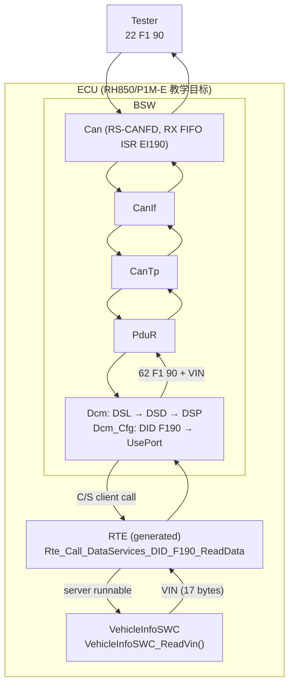
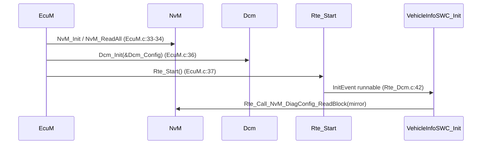
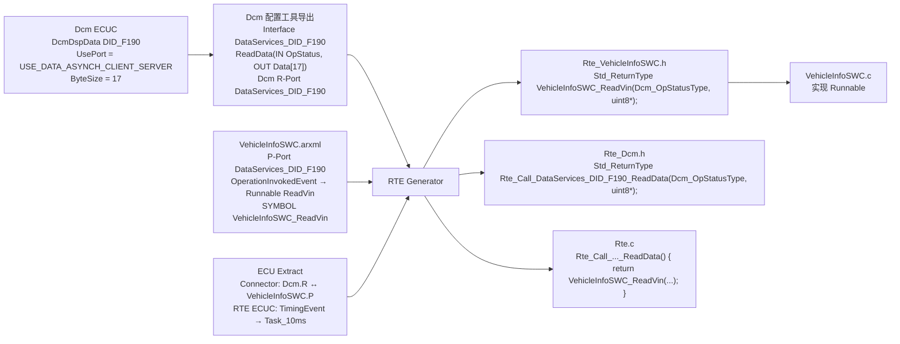
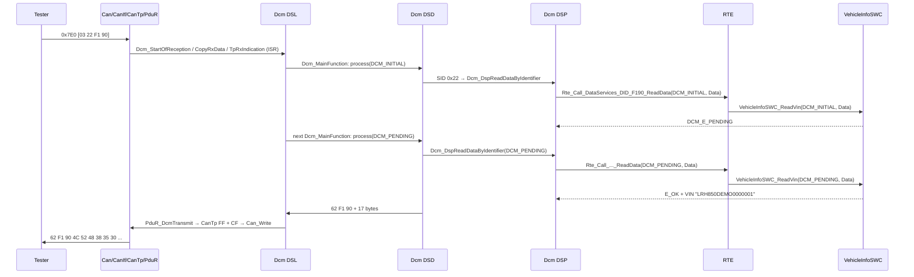

# AUTOSAR Classic SWC + RTE 教程：从最简单的 SWC 到 `22 F1 90` 读出 VIN

> Prerequisite: [分层架构](02-autosar-classic/02-layered-architecture.md), [配置与 ARXML](02-autosar-classic/04-configuration-arxml.md), [Interrupt / Task / MainFunction / Runnable](02-autosar-classic/07-mainfunction-scheduling.md)；DCM 基础见 [DCM 总览](06-dcm/01-dcm-overview.md)
> Next: 深入阅读 Part VII 各章 [07-rte-swc/01–09](07-rte-swc/01-swc-concept.md)；端到端集成见 [F190 VIN 端到端 Demo](08-integration/04-f190-vin-demo.md)
> 对应规范: DCM SWS CP R20-11（§8.8 Service Interfaces p.335–415；`DataServices_<Data>` `SWS_Dcm_00686`；`DcmDspDataUsePort` `ECUC_Dcm_00713` p.537–539；`Xxx_ReadData` sync `00793` / async `91006`；OpStatus `00984`；`DCM_E_PENDING = 10` p.338/p.363）。**本仓库无 RTE SWS、无 Software Component Template**：所有 `Rte_*` API 命名（`Rte_Call_<p>_<o>`、`Rte_Read/Write`、`Rte_IRead/IWrite`、`Rte_Mode`）、Runnable / Event / Contract Phase 等均按 AUTOSAR R4.x 公认约定描述，**需以项目所用 release 的 RTE SWS 确认**。
> 对应源码: 本项目 `examples/uds_diag_demo/`（`swc/VehicleInfoSWC.c`、`rte/Rte_VehicleInfoSWC.h`、`rte/Rte_Dcm.c`、`rte/Rte_Dcm.h`、`diag/Dcm_Dsp.c`、`diag/Dcm_Cfg.c`）；openAUTOSAR `examples/rte_simple/`（AR 3.1.5 SWC 例子，生成头缺失）、`rte/src/rte.c`（占位草稿）

---

## 0. 这篇文章怎么读

这是一篇**导读**（`claude_plan.md` §10 要求的独立教程）。它不重复 Part VII 各章的细节，而是沿一条路线把所有概念串起来：

```text
Level 1  最简单的 SWC：一个 runnable，一个周期事件
Level 2  加一个 Port：Sender/Receiver，DataElement
Level 3  再加一个 Port：Client/Server，Operation
Level 4  让 DCM 成为 client：VehicleInfoSWC 提供 DID F187 / F190
Level 5  从 ARXML 到代码：ARXML → RTE Generator → Rte_VehicleInfoSWC.h → Runnable
Level 6  整条链：Tester → DCM → RTE → VehicleInfoSWC → VIN
Level 7  回头看：为什么不写成 VehicleInfo_ReadVIN() + memcpy 直接调用
```

每个 Level 结尾都有"深入阅读"链接。所有能运行的代码都在 `examples/uds_diag_demo/`（运行：`python tools/run_uds_demo.py`）；标注 `[Conceptual]` 的代码是教学伪代码，**不要当成 production code**。

---

## 1. 本章目标

读完本教程，你应该能用自己的话回答：

1. **Classic AUTOSAR 的 SWC 到底怎么写？**——一个只 include `Rte_<Swc>.h` 的 `.c` 文件 + 一份描述它的 ARXML；函数（Runnable）由 RTE 调用，触发条件（Event）在 ARXML 里。
2. **DCM 如何最终调用 application software？**——Dcm 的配置决定一个 DID 用哪种端口；C/S 端口时，Dcm 调用生成的 `Rte_Call_DataServices_<Data>_ReadData`，RTE 按连线调用 SWC 的 server runnable。
3. 下列八个词各是什么、在 demo 的哪里：**Sender/Receiver、Client/Server、Runnable、Event、Port、Interface、DataElement、Operation**。

---

## 2. 为什么需要 SWC 和 RTE？

一句话：**让应用代码不依赖于"它和谁通信、怎么通信、在哪个 task 里执行"。**

| 没有 SWC/RTE | 有 SWC/RTE |
|---|---|
| 诊断模块里写死 `VehicleInfo_ReadVIN()` | Dcm 只调用标准名 `Rte_Call_DataServices_DID_F190_ReadData` |
| 应用直接 `#include "Dcm.h"` 查会话 | 应用读 Mode 端口 `Rte_Mode_...` |
| 周期函数手写在 `task_10ms()` 里 | ARXML：`TimingEvent 10ms → Runnable`，集成者决定放哪个 task |
| 接口不一致只能运行时发现 | RTE 生成时检查 |

详细论证：[RTE 概念 §2](07-rte-swc/04-rte-concept.md)。

---

## 3. 在系统中的位置：一张总图



`Can → … → PduR → Dcm` 是 BSW 之间的直接 C API 调用（Part V/VI 的内容）；**本教程关注 `Dcm → RTE → SWC` 这一段**。

---

## 4. AUTOSAR 如何定义？八个核心概念速查

> `[AUTOSAR Standard]` R4.x 公认概念（本仓库无 RTE SWS / SWC Template，需以项目 release 确认）。

| 概念 | 一句话 | 在 demo 中 | 深入 |
|---|---|---|---|
| **Port** | SWC 上具名的"插座"；P-Port 提供、R-Port 需要。API 名用的是 Port 名 | VehicleInfoSWC 的 P-Port `DataServices_DID_F190`（`rte/Rte_VehicleInfoSWC.h:13`） | [02](07-rte-swc/02-port-interface.md) |
| **Interface** | 插座的形状：S/R、C/S、Mode | `DataServices_DID_F190`（C/S，名字模板来自 DCM SWS `SWS_Dcm_00686`） | [02](07-rte-swc/02-port-interface.md) |
| **DataElement** | S/R Interface 中的一个数据项（类型、queued/unqueued） | demo 无 S/R；openAUTOSAR `ArgumentIf.arg1`（`examples/rte_simple/rte_simple_lib.arxml:206-233`） | [07](07-rte-swc/07-sender-receiver.md) |
| **Operation** | C/S Interface 中的一个可调用服务（参数 IN/OUT + ApplicationError） | `ReadData(IN OpStatus, OUT Data)`；错误 `DCM_E_PENDING = 10`（`rte/Rte_Dcm_Type.h:27`） | [02](07-rte-swc/02-port-interface.md)、[06](07-rte-swc/06-client-server.md) |
| **Sender/Receiver** | 状态广播：写缓冲、读缓冲，时间解耦 | demo 无；Mode 端口最接近（`rte/Rte_Dcm.c:134-144`） | [07](07-rte-swc/07-sender-receiver.md) |
| **Client/Server** | 请求-应答：`Rte_Call` → server runnable | Dcm → `Rte_Call_DataServices_DID_F190_ReadData` → `VehicleInfoSWC_ReadVin`（`rte/Rte_Dcm.c:54-62`） | [06](07-rte-swc/06-client-server.md) |
| **Runnable** | SWC 中由 RTE 调用的函数；C 名 = ARXML 的 `SYMBOL` | `VehicleInfoSWC_Init/Run10ms/ReadVin/...`（`rte/Rte_VehicleInfoSWC.h:26-36`） | [03](07-rte-swc/03-runnable-event.md) |
| **Event** | 什么时候调用 Runnable：Timing / Init / OperationInvoked / DataReceived / ModeSwitch | Init → `Rte_Start`（`rte/Rte_Dcm.c:38-44`）；Timing 10 ms → `Rte_Task_10ms`（`:46-50`）；OperationInvoked → `Rte_Call_*`（`:54-130`） | [03](07-rte-swc/03-runnable-event.md) |

---

## 5. 核心数据结构：一个 SWC 的三层

```text
Component Type    : 对外有哪些 Port，每个 Port 引用哪个 Interface
Internal Behavior : 有哪些 Runnable，每个被哪个 Event 触发，访问哪些 Port（data access / server call point）
Implementation    : C 代码，只 include Rte_<Swc>.h
```

demo 中 VehicleInfoSWC 的"三层"被写成 `rte/Rte_VehicleInfoSWC.h:12-17` 的注释 + `:26-51` 的原型 + `swc/VehicleInfoSWC.c`。深入：[SWC 概念](07-rte-swc/01-swc-concept.md)。

---

## 6. 初始化流程



逐跳：BSW 先初始化（NvM 先把数据读进 RAM），再 `Rte_Start`，RTE 调用 SWC 的 InitEvent runnable。顺序反了，SWC 会读到未初始化的数据。文件均在 `examples/uds_diag_demo/` 下。深入：[RTE 概念 §6](07-rte-swc/04-rte-concept.md)。

---

## 7. Runtime Flow：七个 Level

### Level 1 — 最简单的 SWC：一个 runnable，一个 TimingEvent

`[Conceptual]` 一个每 10 ms 计数的 SWC：

```c
/* [Conceptual] HelloSWC.c — the smallest meaningful SWC */
#include "Rte_HelloSWC.h"          /* the ONLY include: generated by the RTE generator */

static uint32 HelloSWC_Ticks;      /* internal state (single instance) */

void HelloSWC_Init(void)           /* Runnable, triggered by InitEvent   */
{
    HelloSWC_Ticks = 0u;
}

void HelloSWC_Run10ms(void)        /* Runnable, triggered by TimingEvent (PERIOD = 0.01 s) */
{
    HelloSWC_Ticks++;
}
```

要点：

- 没有 `main`，没有 `while(1)`，没有人"直接"调用这两个函数——是 RTE 生成的代码在 `Rte_Start` 和 10 ms task body 中调用它们。
- 函数名 `HelloSWC_Run10ms` 中的 "10ms" 只是习惯，真正决定周期的是 ARXML 中的 TimingEvent 和集成者的 task 映射。

demo 中对应：`swc/VehicleInfoSWC.c:54-72`（`VehicleInfoSWC_Init`、`VehicleInfoSWC_Run10ms`），调用点 `rte/Rte_Dcm.c:42`、`:49`，task 节拍 `integration/BswScheduler.c:48-52`。

> 深入阅读：[01-swc-concept.md](07-rte-swc/01-swc-concept.md)、[03-runnable-event.md](07-rte-swc/03-runnable-event.md)

### Level 2 — 加一个 Port：Sender/Receiver 与 DataElement

`[Conceptual]` 让 HelloSWC 把计数"广播"出去：

```text
Interface  TickCountIf (Sender/Receiver)
  DataElement  count : uint32   (unqueued, init value 0)
HelloSWC   P-Port  TickCount : TickCountIf      (sender)
DisplaySWC R-Port  TickCount : TickCountIf      (receiver)
```

```c
/* [Conceptual] sender side */
void HelloSWC_Run10ms(void)
{
    HelloSWC_Ticks++;
    (void)Rte_Write_TickCount_count(HelloSWC_Ticks);          /* explicit write */
}

/* [Conceptual] receiver side, implicit read: value is stable during the runnable */
void DisplaySWC_Run100ms(void)
{
    uint32 c = Rte_IRead_DisplaySWC_Run100ms_TickCount_count();
    ...
}
```

要点：

- API 名 = `Rte_Write_<Port>_<DataElement>`；隐式访问 API 名里还多一个 runnable 名。
- Sender 不知道 receiver 是谁、有几个、在不在同一 ECU；RTE 可能把这次 `Rte_Write` 生成为一次变量赋值，也可能生成 `Com_SendSignal`。
- 真实例子：openAUTOSAR `examples/rte_simple/Tester.c:12-18`（`Rte_IRead_*` / `Rte_IWrite_*`）、`Logger.c:16` 与 `Logger2.c:16` 两个 receiver 读同一数据。

> 深入阅读：[07-sender-receiver.md](07-rte-swc/07-sender-receiver.md)

### Level 3 — 再加一个 Port：Client/Server 与 Operation

`[Conceptual]` 让别人可以"问"HelloSWC 当前计数：

```text
Interface  TickQueryIf (Client/Server)
  Operation  GetTicks(OUT uint32 value)  PossibleErrors: E_NOT_OK
HelloSWC  P-Port  TickQuery : TickQueryIf   (server)
OtherSWC  R-Port  TickQuery : TickQueryIf   (client)
```

```c
/* [Conceptual] server runnable — triggered by OperationInvokedEvent(TickQuery.GetTicks) */
Std_ReturnType HelloSWC_GetTicks(uint32 *value)
{
    *value = HelloSWC_Ticks;
    return E_OK;
}

/* [Conceptual] client */
uint32 t;
if (Rte_Call_TickQuery_GetTicks(&t) == RTE_E_OK) { ... }
```

要点：

- client 调 `Rte_Call_<Port>_<Operation>`；RTE 找到连线另一端的 server runnable 并调用它。
- **同步、同分区时，server runnable 在 client 的上下文（client 的 task、client 的栈）中执行**。这一点决定了 Level 4 中 VehicleInfoSWC 的代码在 Dcm 的 task 中运行。
- 真实例子：openAUTOSAR `examples/rte_simple/Tester.c:16`（client `Rte_Call_Tester_Calculator_Multiply`）与 `Calculator.c:10-13`（server `Multiply`）；ARXML 中 server 侧 `OPERATION-INVOKED-EVENT`（`rte_simple_lib.arxml:110-122`）、client 侧 `SYNCHRONOUS-SERVER-CALL-POINT`（`:419-434`）。

> 深入阅读：[06-client-server.md](07-rte-swc/06-client-server.md)

### Level 4 — 让 DCM 成为 client：VehicleInfoSWC 提供 F187 与 F190

现在把 Level 3 的 "OtherSWC" 换成 **Dcm**。Dcm 是 BSW 模块，同时有一份 Service Component 描述；它的端口接口由 DCM SWS R20-11 §8.8 规定：

| 需求 | Dcm 配置（`DcmDspDataUsePort`） | Interface / Operation | server runnable（demo） |
|---|---|---|---|
| DID F187 SW 版本（常量，立即可用） | `USE_DATA_SYNCH_CLIENT_SERVER` | `DataServices_DID_F187.ReadData(OUT Data[8])`（`SWS_Dcm_00793`） | `VehicleInfoSWC_ReadSwVersion`（`swc/VehicleInfoSWC.c:98-103`） |
| DID F190 VIN（演示"需要等待"） | `USE_DATA_ASYNCH_CLIENT_SERVER` | `DataServices_DID_F190.ReadData(IN OpStatus, OUT Data[17])`（`SWS_Dcm_91006`） | `VehicleInfoSWC_ReadVin`（`swc/VehicleInfoSWC.c:77-96`） |

F187 的 server 与 Level 3 一样朴素：

```c
/* [Educational Implementation] swc/VehicleInfoSWC.c:98-103 */
Std_ReturnType VehicleInfoSWC_ReadSwVersion(uint8 *Data)
{
    (void)memcpy(Data, VehicleInfoSWC_SwVersion, VEHINFO_SWVER_LENGTH);
    return E_OK;
}
```

F190 多了 DCM 的异步协议 **OpStatus**：

```c
/* [Educational Implementation] swc/VehicleInfoSWC.c:77-96 (trace calls removed) */
Std_ReturnType VehicleInfoSWC_ReadVin(Dcm_OpStatusType OpStatus, uint8 *Data)
{
    if (OpStatus == DCM_CANCEL) {                       /* Dcm gave up (timeout / pre-emption) */
        VehicleInfoSWC_VinPendingLeft = 0u;
        return E_OK;                                    /* return value ignored by Dcm */
    }
    if (OpStatus == DCM_INITIAL) {                      /* first call for this request */
        VehicleInfoSWC_VinPendingLeft = VehicleInfoSWC_VinPendingCycles;
    }
    if (VehicleInfoSWC_VinPendingLeft != 0u) {          /* not ready: ask Dcm to call again */
        VehicleInfoSWC_VinPendingLeft--;
        return DCM_E_PENDING;                           /* ApplicationError 10, not an NRC */
    }
    (void)memcpy(Data, VehicleInfoSWC_Vin, VEHINFO_VIN_LENGTH);   /* OUT valid only with E_OK */
    return E_OK;
}
```

规则（DCM SWS R20-11）：首次 `DCM_INITIAL`（`00527`）；返回 `DCM_E_PENDING` 后，Dcm 在每个 `Dcm_MainFunction` 以 `DCM_PENDING` 再调（`00530`）；超过 P2 时 Dcm 自己发 NRC 0x78（`00024`）——**SWC 不知道 0x78**；取消时以 `DCM_CANCEL` 调用（`01046`）；OUT 参数只在 `E_OK` 时有效（`01187`）。

Dcm 侧怎么"找到"这个函数？demo 的 Dcm 配置表里放着 RTE API 的函数指针（`diag/Dcm_Cfg.c:34-43`）：

```c
    {   0xF190u, 17u, DCM_USE_DATA_ASYNCH_CLIENT_SERVER,  /* [Educational Implementation] */
        NULL_PTR, Rte_Call_DataServices_DID_F190_ReadData, NULL_PTR, ... "VIN" },
    {   0xF187u, 8u, DCM_USE_DATA_SYNCH_CLIENT_SERVER,
        Rte_Call_DataServices_DID_F187_ReadData, NULL_PTR, NULL_PTR, ... },
```

而 RTE 把这两个 API "连"到 SWC（`rte/Rte_Dcm.c:54-68`）：

```c
Std_ReturnType Rte_Call_DataServices_DID_F190_ReadData(Dcm_OpStatusType OpStatus, uint8 *Data)  /* [Educational Implementation] */
{
    ...
    r = VehicleInfoSWC_ReadVin(OpStatus, Data);
    ...
    return r;
}
```

`DcmDspDataUsePort` 的其它取值（`USE_DATA_SENDER_RECEIVER` 让 Dcm 读 RTE 缓冲、`USE_DATA_SYNCH_FNC` 直接调 C callout 不经 RTE、`USE_BLOCK_ID` 直接读 NvM……）决定了完全不同的调用路径。

> 深入阅读：[08-dcm-rte-integration.md](07-rte-swc/08-dcm-rte-integration.md)（UsePort 全表、逐行 trace）、[09-diagnostic-swc-example.md](07-rte-swc/09-diagnostic-swc-example.md)（再加 NvM 可写 DID、Routine、SecurityAccess）

### Level 5 — 从 ARXML 到代码：`ARXML → RTE Generator → Rte_VehicleInfoSWC.h → Runnable`

上面的 `Rte_Call_DataServices_DID_F190_ReadData` 和 `VehicleInfoSWC_ReadVin` 原型从哪来？



逐步解释：

1. **Dcm ECUC → Interface**：`DcmDspData` 的 short name 给出 `<Data>`；UsePort 决定是 C/S、有无 OpStatus；ByteSize/Type 决定 `Data` 类型。
2. **SWC ARXML**：应用团队声明 P-Port（引用上面的 Interface）、Runnable（`SYMBOL` = C 函数名）、OperationInvokedEvent（"调用 ReadData 时执行它"）。
3. **ECU Extract**：集成者把 Dcm 的 R-Port 与 SWC 的 P-Port 连起来，并把 TimingEvent 映射到 task。
4. **生成器**：
   - `Rte_VehicleInfoSWC.h`：给 SWC 的 runnable 原型（以及 SWC 可用的 `Rte_*` API）——demo：`rte/Rte_VehicleInfoSWC.h:26-51`；
   - `Rte_Dcm.h`：给 Dcm 的 `Rte_Call_*` 原型——demo：`rte/Rte_Dcm.h:30-47`；
   - `Rte.c`：`Rte_Call_*` 的实现（同分区时就是一次直接调用，甚至一个宏）——demo：`rte/Rte_Dcm.c:54-130`。
5. **SWC 实现 runnable**：签名必须与生成头一致，否则编译失败——"接口一致性由生成保证"。

完整的教学级 ARXML（`[Conceptual]`，未经 schema 校验）和生成文件样例见 [05-rte-generation.md §4.3、§5](07-rte-swc/05-rte-generation.md)。Contract Phase（只凭一个 SWC 生成契约头，供应商可先开发）与 Generation Phase（整个 ECU）的区别见 [04-rte-concept.md §4.1](07-rte-swc/04-rte-concept.md)。

> 对照：openAUTOSAR `examples/rte_simple/` 有 AR 3.1.5 的 ARXML 和 SWC 代码，但**所有生成头都缺失**（研究笔记 03 §5）——它展示了"输入"和"用户代码"，缺了中间的"生成物"。demo 的 `rte/*` 正是手写补上的"生成物"。

### Level 6 — 整条链：Tester → DCM → RTE → VehicleInfoSWC → VIN



逐个 transition（与 `artifacts/uds-demo/trace.txt:25-46` 一一对应）：

| Transition | API | 位置 | 上下文 |
|---|---|---|---|
| Tester → 栈 | 总线帧 `03 22 F1 90` | `trace.txt:26` | 总线 |
| 栈 → DSL | `Dcm_StartOfReception` / `Dcm_CopyRxData` / `Dcm_TpRxIndication`（DCM SWS R20-11 p.243–245）；DSL 只登记请求、启动 P2 | `trace.txt:31-33` | ISR（真实 RH850：RS-CANFD RX FIFO 中断 EI190 → CanIf → CanTp → PduR → Dcm） |
| DSL → DSD | `Dcm_DsdProcessRequest(DCM_INITIAL)` | `diag/Dcm_Dsl.c:254-257` | `Dcm_MainFunction`，10 ms task |
| DSD → DSP | 查 `Dcm_Services[]` 0x22，检查会话/安全/长度，`fnc(OpStatus, ...)` | `diag/Dcm_Dsd.c:151-163`；`diag/Dcm_Cfg.c:120` | 同上 |
| DSP → RTE | 查 `Dcm_Dids[]` 0xF190，`d->readAsync(st->currentOpStatus, &out[2])` | `diag/Dcm_Dsp.c:296-349`；指针 `diag/Dcm_Cfg.c:36` | 同上 |
| RTE → SWC | `VehicleInfoSWC_ReadVin(OpStatus, Data)` | `rte/Rte_Dcm.c:59` | **同上——server runnable 在 Dcm 的 task 中执行** |
| SWC → DSP（PENDING） | `return DCM_E_PENDING`；DSP 记 `currentOpStatus = DCM_PENDING` | `swc/VehicleInfoSWC.c:87-92`；`diag/Dcm_Dsp.c:351-353` | 同上 |
| DSL → DSD（PENDING） | 下一个 `Dcm_MainFunction`：`Dcm_DsdProcessRequest(DCM_PENDING)` | `diag/Dcm_Dsl.c:258-261` | t+10 ms |
| SWC → DSP（E_OK） | `memcpy(Data, VIN, 17); return E_OK` | `swc/VehicleInfoSWC.c:93-95`；`diag/Dcm_Dsp.c:360-366` | 同上 |
| DSD → DSL | 正响应 `0x62 + resData`（19 字节数据） | `diag/Dcm_Dsd.c:181-185` | 同上 |
| DSL → 栈 → Tester | `PduR_DcmTransmit(len=20)` → CanTp 分段（FF + 2 CF）→ `Can_Write` | `trace.txt:46` 之后 | task / 1 ms CanTp |

CAN 栈与 DCM 内部的细节分别在 Part V / Part VI；整条链的集成视角见 [F190 VIN 端到端 Demo](08-integration/04-f190-vin-demo.md)。

### Level 7 — 回头看：为什么不直接 `VehicleInfo_ReadVIN()`？

`claude_plan.md` §10 的教学级例子：

```c
/* [Conceptual] the naive version */
Std_ReturnType VehicleInfo_ReadVIN(uint8 *Data)
{
    memcpy(Data, VinData, 17);
    return E_OK;
}
```

它**能用**——事实上它等于 R20-11 的 `USE_DATA_SYNCH_FNC` C callout（规范示例 p.225–226），也等于 openAUTOSAR Dcm 唯一支持的方式（`diagnostic/Dcm/src/Dcm_Dsp.c:1250-1254`，配置中的 C 函数指针）。但在真实 AUTOSAR 中，通常不这样直接连接，而是通过生成的 RTE API，原因是：

1. **解耦**：Dcm（供应商代码）里不出现应用函数名；换实现、换 SWC 只改连线并重新生成 RTE。
2. **签名由生成保证**：`extern` 声明与实现不一致时 C 链接器不报错；RTE 生成头让编译器检查。
3. **长度/类型有来源**：`17` 来自 `DcmDspDataByteSize` 和 Interface 的数组类型，而不是魔数。
4. **异步能力**：VIN 若要从 NvM/外部 ECU 获取，需要 `OpStatus` + `DCM_E_PENDING`，朴素签名无法表达。
5. **跨分区/内存保护**：SWC 在 User 模式分区时，BSW 直接调用会违反保护；RTE 生成合法的跨分区调用。
6. **可描述、可分析**：ARXML 中的 Port/Runnable/Event 让工具能做连线检查、时序分析、文档。
7. **调用上下文明确**：OperationInvokedEvent + Dcm 的 task 映射，在生成代码中可查。

注意 Level 4 中 F187 的 server 函数体和朴素版本**几乎一样**——**AUTOSAR 的价值不在函数体，而在"连接"由配置描述、由工具生成。**

> 深入阅读：[09-diagnostic-swc-example.md §7 Step 0–1](07-rte-swc/09-diagnostic-swc-example.md)

---

## 8. RH850 Hardware Mapping

`[RH850 Hardware]` SWC 与 RTE 不访问寄存器。它们在 RH850/P1M-E 上的落点：

| 软件概念 | 硬件落点 |
|---|---|
| Runnable / task | RH850G3M 单个可调度核（另有 lock-step checker core，不是第二个可调度核） |
| TimingEvent 周期 | OS counter ← OSTM 比较中断（通道归属为配置选择） |
| Exclusive Area | PSW.ID / INTC PMR 或 OS Resource，由 OS port 实现（需以 RTA-OS RH850 port 文档确认） |
| 请求到达 | RS-CANFD，RX FIFO 中断 EI190（INTRCANGRECC） |
| NvM 数据 | Data Flash（细节需以 Flash 手册确认） |

---

## 9. openAUTOSAR 实现

| 能学到 | 学不到 |
|---|---|
| AR 3.1.5 的 SWC ARXML 结构（`examples/rte_simple/rte_simple_lib.arxml`） | R4.x ARXML 结构 |
| SWC 用户侧代码的正确写法（`Tester.c`、`Calculator.c`、`Logger.c`），以及一个反例（`Tester.c:9` include `Os.h`） | 生成的 `Rte_*.h`（全部缺失） |
| RTE API 命名草稿（`rte/src/rte.c:22-47`） | 可运行的 RTE（`Rte_Start` 无定义：`include/Rte_Main.h:25` 声明、`system/EcuM/src/EcuM.c:228` 调用） |
| Dcm DSP 查表逻辑（`diagnostic/Dcm/src/Dcm_Dsp.c:1237-1302`） | Dcm → RTE → SWC（`Rte_Dcm.h` 是空文件、`UsePort` 是死字段） |

---

## 10. 当前教学项目实现

`[Educational Implementation]` `examples/uds_diag_demo/` 是可在 PC 上运行的完整诊断栈（Mock Can → CanIf → CanTp → PduR → Dcm → Rte → SWC），12/12 测试通过（`examples/uds_diag_demo/README.md` §5）。与本教程相关的文件：

| 文件 | 角色 |
|---|---|
| `swc/VehicleInfoSWC.c` | 应用 SWC：F190 / F187 / F1A0 / Routine FF00 |
| `swc/SecurityAccessSWC.c` | 应用 SWC：Level 01 seed/key（**不安全的教学算法**） |
| `rte/Rte_VehicleInfoSWC.h`、`rte/Rte_SecurityAccessSWC.h` | "as if generated" 的 Application Header |
| `rte/Rte_Dcm.h`、`rte/Rte_Dcm_Type.h`、`rte/SchM_Dcm.h` | "as if generated" 的 Dcm 侧 RTE 头 |
| `rte/Rte_Dcm.c`、`rte/Rte.h` | "as if generated" 的 RTE 实现：`Rte_Start`、task body、`Rte_Call_*`、mode switch |
| `diag/Dcm_Cfg.c` | "as if generated" 的 Dcm 配置：DID 表指向 `Rte_Call_*` |

与真实项目的差别：没有 ARXML 与生成器；RTE 全部是同步直接调用；没有 S/R、Exclusive Area、跨分区；F1A0 读写签名混用 SYNCH/ASYNCH（真实配置中不会出现）。

---

## 11. Code Walkthrough：只读三个文件就能看懂"DCM 如何调用应用"

按顺序读：

1. `diag/Dcm_Cfg.c:1-49`——Dcm 如何知道 F190 对应哪个函数（文件头 `:10-13` 的三问三答）。
2. `rte/Rte_Dcm.c:1-62`——RTE 如何把 Dcm 的调用转给 SWC（文件头 `:8-14` 解释了同步直连与异步的关系）。
3. `swc/VehicleInfoSWC.c:1-96`——SWC 只知道 runnable 签名和 OpStatus（文件头 `:7-8`："It knows nothing about CAN, ISO-TP, SIDs or NRC 0x78"）。

然后运行 demo，对照 `artifacts/uds-demo/trace.txt:34-46` 看这三个文件在运行时的先后顺序。

---

## 12. Debug 方法

"DCM 调不到应用"时的断点阶梯（demo 行号；真实项目找对应位置）：

| 断点 | 命中说明 | 没命中说明 |
|---|---|---|
| `swc/VehicleInfoSWC.c:77`（server runnable） | Dcm→RTE 正常，问题在 SWC 返回值或之后 | 往上找 |
| `rte/Rte_Dcm.c:59`（RTE；若为宏则跳过） | RTE 被调用 | 问题在 Dcm 配置（函数指针/UsePort） |
| `diag/Dcm_Dsp.c:349`（DSP 调用点） | DID 检查通过 | 0x31/0x33/0x13 在此之前已被 Dcm 拒绝——RTE 和 SWC 根本不会被调用 |
| `diag/Dcm_Dsd.c:163`（DSD 分发） | 服务已分发 | 服务表/会话/安全检查失败 |
| `diag/Dcm_Dsl.c:256`（DSL 开始处理） | 请求已完整到达 | 问题在 CanTp/PduR 或更下层 |

详细见 [08-dcm-rte-integration.md §12](07-rte-swc/08-dcm-rte-integration.md)。

---

## 13. 常见问题 / 常见错误

1. **SWC include BSW 头**（`Dcm.h`、`NvM.h`、`Os.h`）：破坏可移植性；用 RTE 端口。
2. **以为函数名决定周期**：周期来自 TimingEvent + task 映射。
3. **server runnable 里 busy-wait**：阻塞 Dcm 的 task；返回 `DCM_E_PENDING`。
4. **SWC 试图"发 0x78"**：0x78 不在 `Dcm_NegativeResponseCodeType` 中（`rte/Rte_Dcm_Type.h:50-54`），由 Dcm DSL 自动发送。
5. **改了 `DcmDspDataUsePort` 不改 SWC 签名**：SYNCH ↔ ASYNCH 会增删 `OpStatus` 参数。
6. **手改生成的 RTE 代码**：下次生成即丢失。
7. **把 S/R DID 当成会调用应用代码**：`USE_DATA_SENDER_RECEIVER` 时 Dcm 只读 RTE 缓冲。
8. **用 openAUTOSAR 理解 R4.x 的 Dcm → RTE**：它没有这条路径。

---

## 14. 实验

所有实验不修改 demo（若想改，请复制到自己的目录）：

1. **跑起来**：`python tools/run_uds_demo.py`，打开 `artifacts/uds-demo/trace.txt`，用 `Select-String -Pattern 'Rte|SWC'` 只看 RTE 与 SWC 行，说出每一行属于 Level 4 的哪个步骤。
2. **画出你自己的 Level 5**：为 F187 画出"Dcm ECUC → Interface → SWC ARXML → 生成头 → runnable"的图，与 `rte/Rte_VehicleInfoSWC.h:29`、`rte/Rte_Dcm.h:31` 对照。
3. **对照 openAUTOSAR**：在 `D:\side_project\openAUTOSAR\examples\rte_simple\` 中找出 Level 2（S/R）与 Level 3（C/S）的真实例子，指出缺失的生成头文件名。
4. **改写朴素版本（纸上）**：把 Level 7 的 `VehicleInfo_ReadVIN` 改造成 Level 4 的 F190 server，写出需要的 Dcm 配置、Interface、生成原型和实现。

---

## 15. 思考题

1. 如果 VIN 由网关 ECU 通过 CAN 提供，VehicleInfoSWC 的代码要不要改？哪些 ARXML/生成物要改？
2. 为什么 server runnable 在 Dcm 的 task 中执行是"默认"的？什么配置会改变这一点，那时 `DCM_E_PENDING` 起什么作用？
3. 一个 DID 用 C/S、S/R、`USE_DATA_SYNCH_FNC`、`USE_BLOCK_ID` 各有什么优缺点？你会怎么为 VIN、车速、SW 版本、标定数据分别选择？
4. 把 Level 1 的 HelloSWC 部署到两个 ECU 上，哪些东西完全不变？

---

## 16. 对未来真实项目的意义

`[Real Project Consideration]` 进入真实 RTA-CAR（或其他 R4.x 工具链）项目时：

1. **找 SWC 清单与 ECU Extract**：哪些 SWC，Dcm 的 `DataServices_*` 端口连到谁。
2. **对每个 DID 查 `DcmDspDataUsePort`**：决定了它是 RTE server、S/R、C callout 还是 NvM 直读——这决定了你去哪里找实现、去哪里打断点。
3. **读生成的 `Rte_Dcm.h` / `Rte.c` / `Rte_<Swc>.h`**：这是"DCM 最终调用哪个函数"的权威答案，比在 GUI 里点更可靠。
4. **DCM 升级时**：重新导出 Dcm Service Component 描述 → 重新生成 RTE → diff 生成头 → 修 SWC 签名（OpStatus/ErrorCode）→ 检查 `DCM_CANCEL` 处理 → 回归测试（例如把 `examples/uds_diag_demo/tests/test_uds_demo.c` 的字节级用例迁移到 CANoe）。
5. 截图中的真实工程（RTA-CAR 12.9.0、RTA-OS、GHS、Renesas P1M MCAL）本仓库不存在，以上内部细节均需在真实项目环境中确认。

---

## 17. 本章总结

```text
SWC = C 代码（只 include Rte_<Swc>.h）+ ARXML 描述（Port / Runnable / Event）
Port + Interface：S/R（DataElement）/ C/S（Operation）/ Mode
Runnable 由 RTE 调用；Event 决定何时：Init / Timing / OperationInvoked / DataReceived / ModeSwitch
RTE 由工具从 ARXML 生成：Rte_<Swc>.h（runnable 原型 + 可用 API）、Rte_Dcm.h、Rte.c（连线 + task body + Rte_Start）

DCM 如何最终调用应用：
  22 F1 90 → Dcm DSP 查 DID F190 → DcmDspDataUsePort = USE_DATA_ASYNCH_CLIENT_SERVER
  → Rte_Call_DataServices_DID_F190_ReadData(OpStatus, Data)
  → (RTE 按 Connector) VehicleInfoSWC_ReadVin(OpStatus, Data)   [在 Dcm 的 task 中]
  → DCM_E_PENDING ⇒ 下个 MainFunction 以 DCM_PENDING 重调；E_OK ⇒ 62 F1 90 + VIN

朴素的 VehicleInfo_ReadVIN() + memcpy 能用（= USE_DATA_SYNCH_FNC），
但真实 AUTOSAR 通过生成的 RTE API 连接，以获得解耦、生成检查、异步、跨分区和可描述性。
```

## 18. 下一步

- 系统学习：从 [01-swc-concept.md](07-rte-swc/01-swc-concept.md) 开始按顺序读 Part VII。
- 只关心诊断：直接读 [08-dcm-rte-integration.md](07-rte-swc/08-dcm-rte-integration.md) 和 [09-diagnostic-swc-example.md](07-rte-swc/09-diagnostic-swc-example.md)。
- 想看 CAN 帧级的完整往返：[F190 VIN 端到端 Demo](08-integration/04-f190-vin-demo.md)、demo 的 [README](../examples/uds_diag_demo/README.md)。
