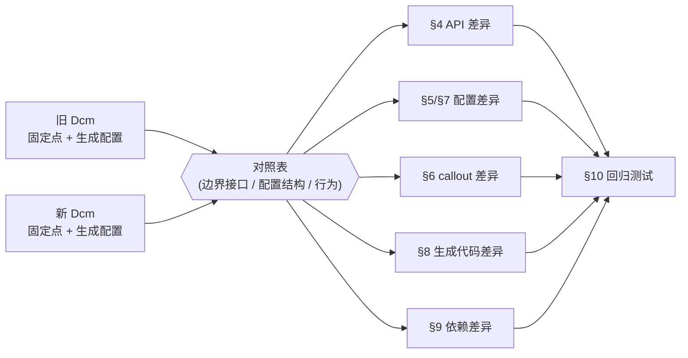
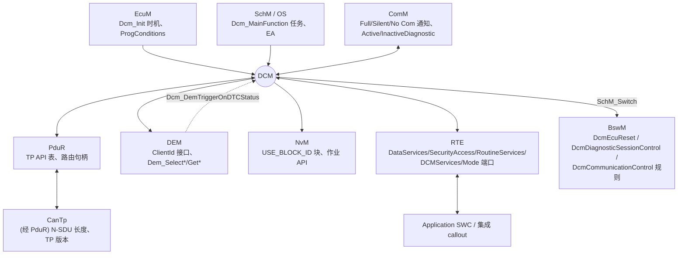
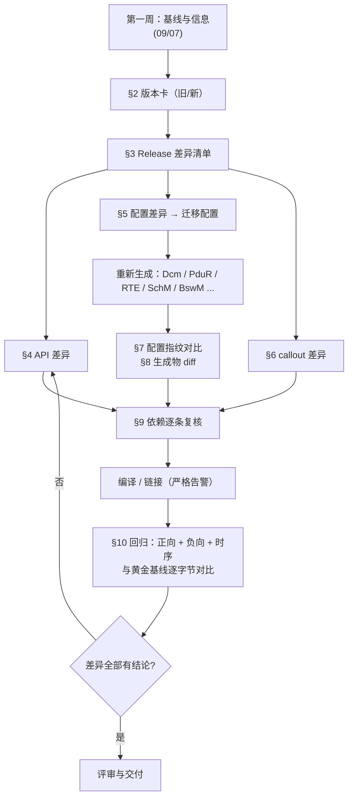

# DCM 升级指南：版本、API、配置、callout、生成代码、依赖与回归测试

> 定位: 独立指南（`claude_plan.md` §9 要求）。章节式摘要入口见 [06-dcm/14-dcm-upgrade-guide.md](06-dcm/14-dcm-upgrade-guide.md)；进入真实项目第一周的准备清单见 [09-real-project-preparation/07](09-real-project-preparation/07-rtacar-dcm-upgrade-preparation.md)。
> Prerequisite: [DCM 总览](06-dcm/01-dcm-overview.md)、[DCM 配置](06-dcm/05-dcm-configuration.md)、[08-integration/03 DCM 集成](08-integration/03-dcm-integration.md)、[09/03 如何阅读 DCM](09-real-project-preparation/03-how-to-read-dcm.md)、[09/04 如何阅读生成代码](09-real-project-preparation/04-how-to-read-generated-code.md)
> 对应规范: SWS DCM **CP R20-11**（Doc ID 18；Change History p.1–5；依赖 p.30–31；DSL/DSD/DSP 不强制 p.50；对外 API p.236–261；可选/必需接口 p.261–265；callout C 原型 p.265–295；RTE 端口 p.335–415；类型 p.226–307；配置 p.442–678）。**本仓库只有 R20-11 的 CP DCM SWS**：R21-11 及之后（R22-11/R23-11/R24-11/R25-11）的 CP DCM 变化**在本仓库没有任何证据**；`AUTOSAR_SWS_Diagnostics.pdf` 是 **Adaptive Platform**，不能用于推导 CP DCM。DEM、PduR、CanTp、ComM、BswM、NvM、RTE 的 SWS 本仓库均没有。
> 对应源码: 本项目 `examples/uds_diag_demo/`（R4.x / R20-11 风格教学 Dcm，作为"新版本"参照）、`examples/uds_diag_demo/tests/test_uds_demo.c`（回归测试模板）；openAUTOSAR `diagnostic/Dcm/`（R3.1.5 风格，作为"旧版本"参照）；研究笔记 [02 §3、§6](reference/research/02-autosar-sws-notes.md)、[03 §4](reference/research/03-openautosar-trace.md)

---

## 0. 如何使用本指南

[Real Project Consideration] 未来的真实任务是"升级公司 RH850 + RTA-CAR 项目中的 DCM"。该项目**不在本仓库**：RTA-CAR 的版本、DCM 的供应商实现与源码结构、当前与目标 AUTOSAR Release、配置工具、derivative 都**需在真实项目环境中确认**。本指南提供的是**方法、证据来源和检查清单**，不是对某个具体 DCM 的描述。

建议顺序：

```text
09/07 第一周准备（基线） → 本指南 §1–§2（读懂并定位当前版本） → §3（两个 Release 之间有什么不同）
→ §4–§8（API / 配置 / callout / Dcm_Cfg / 生成代码 逐项分析） → §9（依赖） → §10（回归） → §12 清单
```

全文标记约定：`[AUTOSAR Standard]` 有 R20-11 PDF 证据；`[Conceptual]` 公认做法或推断；`[Educational Implementation]` 本仓库 demo；`[Real Project Consideration]` 需在真实项目确认。

---

## 1. 如何阅读一个陌生 DCM implementation

详细方法见 [09/03 如何阅读 DCM](09-real-project-preparation/03-how-to-read-dcm.md)，这里只强调**为升级而读**时的三个不同点：

1. **读两份，而不是一份**：旧版本与新版本要用同一套"固定点"（`Dcm_Init`、`Dcm_MainFunction`、TP 回调、`PduR_DcmTransmit`、`Rte_Call_*` / `Xxx_*` callout、`Dem_*`、`ComM_DCM_*`、`SchM_Switch_*`）各读一遍，记录差异。
2. **关注"边界"而不是"内部"**：内部函数名（DSL/DSD/DSP 的实现方式）升级时可以完全不同，SWS DCM R20-11 p.50 明确子模块划分不强制；**边界上的签名、调用时机、返回值语义**才决定集成是否要改。
3. **以"对照表"为产出**：用 [09/03 §7](09-real-project-preparation/03-how-to-read-dcm.md) 的"教学 Dcm ↔ 真实 Dcm"表，为旧/新版本各填一列。



---

## 2. 如何识别 DCM version

### 2.1 证据来源（由强到弱）

| # | 来源 | 能告诉你什么 | 依据 / 示例 |
|---|---|---|---|
| 1 | `Dcm.h`（或供应商公共头）中的版本宏 | AR Release（major/minor/revision）、供应商软件版本（major/minor/patch）、Vendor ID、Module ID | [Conceptual] R4.x 惯例宏名：`DCM_AR_RELEASE_MAJOR_VERSION` / `..._MINOR_...` / `..._REVISION_...`、`DCM_SW_MAJOR_VERSION` / `..._MINOR_...` / `..._PATCH_...`、`DCM_VENDOR_ID`、`DCM_MODULE_ID`（由 BSW General 规范定义，**本仓库无该 SWS**）；R3.x 惯例为 `DCM_AR_MAJOR_VERSION` 等——openAUTOSAR `diagnostic/Dcm/include/Dcm.h:28-36`（值 3.1.5，软件版本 1.0.0） |
| 2 | `Dcm_GetVersionInfo(Std_VersionInfoType*)` | 运行时读取 vendorID、moduleID、sw 版本 | `SWS_Dcm_00065`（R20-11 p.237，SID 0x24，"Available via Dcm.h"） |
| 3 | Module ID | 确认这是 Dcm（防止读错模块） | AUTOSAR 统一编号中 Dcm = **53（0x35）**：openAUTOSAR `include/Modules.h:60` `MODULE_ID_DCM (53)`；demo `general/Det.h:24` `DET_MODULE_ID_DCM 53u`。编号表（"List of Basic Software Modules"）本仓库没有，需以项目头文件确认 |
| 4 | BSWMD（Basic Software Module Description，ARXML） | 模块的参数定义、版本、供应商、实现的接口——**配置工具读的就是它** | R20-11 p.41 列出 `SRS_BSW_00379`（"provide a module identifier in the header file and in the module XML description file"），但在 DCM SWS 中标为 `SWS_Dcm_NA_00999`（不在 DCM SWS 内展开）；BSWMD 的格式由 AUTOSAR 模板规范定义（本仓库无） |
| 5 | 生成文件头部注释 | 生成器名称与版本、生成时间 | [Real Project Consideration] 格式因工具而异 |
| 6 | 配置 ARXML 的 schema 声明 | 配置所用的 AUTOSAR 模板版本 | R3.x 例：openAUTOSAR `examples/rte_simple/rte_simple_lib.arxml:2` 使用 `http://autosar.org/3.1.5`；R4.x 使用 `http://autosar.org/schema/r4.0` 命名空间，`schemaLocation` 中的 xsd 文件名是版本线索（具体对应关系**需以 AUTOSAR 发布说明确认**） |
| 7 | 供应商交付包 / release note | 产品版本与 AR Release 的对应 | 供应商文档 |
| 8 | 代码"指纹"（见 §2.2） | 当以上都缺失时，判断"年代" | 研究笔记 03 §4.8 |

[Educational Implementation] demo 的 Dcm **没有**版本宏，也没有实现 `Dcm_GetVersionInfo`（`diag/Dcm.h:20-41` 只声明了 Init、MainFunction、TP 回调和三个 Get/Reset API），其 R20-11 归属只写在注释里（`diag/Dcm.h:4-15`）。在真实项目中如果遇到类似情况，版本只能从交付包和 BSWMD 确认——这本身就是一个需要记录的风险。

### 2.2 代码指纹：没有版本宏时如何判断"年代"

| 指纹 | 指向 | 证据 |
|---|---|---|
| `Dcm_ProvideRxBuffer` / `Dcm_ProvideTxBuffer` / `NotifResultType` | R3.x | openAUTOSAR `diagnostic/Dcm/include/Dcm_Cbk.h:32-35` |
| `Dcm_StartOfReception` / `Dcm_CopyRxData` / `Dcm_CopyTxData` / `Std_ReturnType result` | R4.x | SWS DCM R20-11 p.243–247 |
| DID 回调无 `OpStatus` | R3.x | openAUTOSAR `Dcm_Lcfg.h:44-93` |
| `USE_DATA_SYNCH_FNC` / `USE_DATA_ASYNCH_FNC` 两套 DataServices | ≥ 4.1.2 | DCM Change History 4.1.2（p.3） |
| `Dem_SelectDTC` + ClientId（`DcmDemClientRef`） | ≥ 4.3.0 | Change History 4.3.0 "Redesign interfaces between Dem and Dcm"（p.2）；`SWS_Dcm_01369` p.82、p.116 |
| `Xxx_GetSecurityAttemptCounter` / `Xxx_SetSecurityAttemptCounter` | ≥ 4.3.0（Security Access 重做） | Change History 4.3.0（p.2）；`SWS_Dcm_01152/01153` |
| `DcmDspDidUsePort = USE_ATOMIC_*` | ≥ 4.4.0 | Change History 4.4.0（p.2）；`ECUC_Dcm_01122` p.510–511 |
| `USE_ATOMIC_NV_DATA_INTERFACE` | ≥ R19-11（NVData Handling Enhancements） | Change History R19-11（p.1）；p.398 |
| 0x29 Authentication、IdsM 安全事件（ID 23–43） | R20-11 已含 | p.147 起；`SWS_Dcm_01589/01590` p.46–47 |
| 需求编号 `DCMxxx` | R3.x | openAUTOSAR 源码中的 `@req DCMxxx` |
| `BswM_Dcm_RequestSessionMode` | **早于 R20-11** 的基线（R20-11 DCM SWS 中检索不到） | 研究笔记 02 §3.11 |

### 2.3 版本卡（模板）

[Real Project Consideration]

| 项 | 旧版本 | 新版本 | 出处 |
|---|---|---|---|
| Dcm AR Release | | | |
| Dcm 供应商软件版本 | | | |
| Vendor ID / Module ID | | | |
| 配置工具 / 版本 | | | |
| RTE 生成器 / 版本 | | | |
| Dem / PduR / CanTp / ComM / BswM / NvM 版本 | | | |
| ARXML schema | | | |
| 代码指纹结论（§2.2） | | | |

---

## 3. 如何对比两个 AUTOSAR release

### 3.1 方法

1. 拿到**两个 Release 的 CP DCM SWS**（以及与接口相关的 DEM、PduR、ComM、BswM、RTE SWS）和对应的 **Change Documentation**。
2. 以 **SWS ID 为键**做三类比较：新增 / 删除 / 修改的需求；新增 / 删除 / 修改的 ECUC 参数（`ECUC_Dcm_xxxxx`）；新增 / 删除 / 修改的 API 与类型。
3. 把每一条差异归入 §4（API）、§5（配置）、§6（callout）、§9（依赖）或 §10（行为，需测试）之一。
4. 对每条差异写"对本项目的影响：无 / 需配置 / 需改代码 / 需测试"。

[AUTOSAR Standard] R20-11 PDF 自身在 Change History 中多处写 "For details please refer to the ChangeDocumentation"（p.1–2）——**详细变更文档不在本仓库中**，必须另行获取。

### 3.2 本仓库有证据的 DCM 演进（R20-11 Change History，p.1–5）

| Release | 规范要点 | 升级影响（解读） |
|---|---|---|
| R20-11 | Concept 671 IdsM（安全事件上报）；新增 `DcmDspExternalSRDataElementClass`；更新错误分类 | 新增 `DcmEnableSecurityEventReporting`、安全事件 ID 23–43（p.46–47）；DET / 运行时错误表要重新比对 |
| R19-11 | NVData Handling Enhancements；PeriodicDID Scheduler Type2；`SRS_Diagnostics` → `RS_Diagnostics` | `USE_ATOMIC_NV_DATA_INTERFACE` 等新配置；需求追溯 ID 体系变化 |
| 4.4.0 | Security Extensions；S/R DID 接口重做，新增 Atomic SenderReceiver；0x2F S/R 控制重做；0x31 RequestResults 支持输入信号 | `DcmDspDidUsePort`（USE_ATOMIC_*）；Routine `RequestResults` 签名可能增加 dataIn → SWC 接口重生成 |
| 4.3.1 | 清理追溯；修正 Dcm/Dem 交互不一致；为配置参数增加约束需求 | 配置校验更严格（`SWS_Dcm_CONSTR_*`），旧配置在新工具中可能报错 |
| 4.3.0 | **重新设计 Dem ↔ Dcm 接口**；**重做 Security Access 管理**；OBD 与 UDS 并行 | Dem API 改为 ClientId + select 模式；尝试计数器/延时；集成代码影响最大 |
| 4.2.2 | 规定 Dem 接口返回负值时 Dcm 发送的 NRC；澄清 Routine 原型；Debugging 标为 obsolete | NRC 映射表可能变化 |
| 4.2.1 | 升级到 ISO 14229-1:2013（**NRC 顺序**、0x19/0x28 扩展子功能、0x38）；安全锁定时间、静态 seed；0x2A UUDT；**例程配置参数重组**；DIDRange | 例程配置迁移；NRC 顺序回归 |
| 4.1.3 | bootloader 交互；头文件结构修订；服务接口 API 表 | 头文件 include 关系变化 |
| 4.1.2 | DataServices callout 提供同步与异步两套 API；RDBI/WDBI/RC 长度参数统一为字节 | `USE_DATA_SYNCH_FNC` vs `USE_DATA_ASYNCH_FNC` 的来源 |
| 4.0.3 | **改变与 BswM 的模式管理交互**；服务/子服务 callout 配置管理变化；`ComM_DCM_InactiveDiagnostic/ActiveDiagnostic` 定为必需 | 解释 R20-11 用 ModeDeclarationGroup 而非直接 BswM 调用 |
| 3.1.4 / 4.0.1 | 加入 BswM、IoHwAb、DLT 交互；ReadMemory/WriteMemory/下载上传等服务 | — |

### 3.3 R20-11 文本自身的"规范瑕疵"——升级时最易踩的文本型差异

[AUTOSAR Standard]（研究笔记 02 §6.2 第 5 条，均有页码）

| 瑕疵 | 位置 | 对升级的含义 |
|---|---|---|
| `Xxx_Stop` 的 C 原型缺 `OpStatus`，却标为 Asynchronous；`Xxx_Start`/`RequestResults` 都有 | `SWS_Dcm_01204` p.289 vs p.362–377 | 新旧版本的 Routine Stop 原型可能不同——看生成的 `Rte_*.h` / `Dcm_Externals.h` |
| NRC 类型表中 0x34 标为 "reserved by ISO"，而认证失败时 Dcm 会发 0x34 | p.305 vs `SWS_Dcm_01544` | 类型定义与行为不一致 |
| `DCM_E_INTERFACE_RETURN_VALUE` 与 `DCM_E_INVALID_VALUE` 同值 0x02 | p.48 | DET 钩子按错误码分类时可能误判 |
| `DCM_E_FORCE_RCRRP_IN_SILENT_COMM` 被引用但不在 DET 表 | p.85 | — |
| `Dem_SelectDTC` 等在服务描述中使用，但不在可选接口表 | p.116 vs p.261–265 | Dem 接口清单要以 DEM SWS / 实现为准 |
| 图 8.1 回调名与正文 API 名不一致 | p.243 | 以正文为准 |
| 0x2E/0x31 的长度检查在需求编号顺序中排在会话/安全之后，与 ISO 14229-1 图示不完全一致 | p.174–177、p.188–196 | **NRC 优先顺序必须用测试确认** |

### 3.4 本仓库无证据的部分（必须在真实项目确认）

- R21-11 → R24-11（及更新）CP DCM 的具体 API / 配置变化；
- 真实项目所用 DCM/DEM/CanIf/PduR/BswM 的 Release 与供应商实现差异；
- `Dem_*` API 的完整签名与返回类型（需 DEM SWS）；
- BswM 对 `DcmEcuReset = EXECUTE` 的动作如何落到 `Mcu_PerformReset`。

### 3.5 一个可以在本仓库演练的"跨 Release 对比"：R3.1.5 → R4.x

以 openAUTOSAR（旧）与 demo（新）为两端（研究笔记 03 §4.8）：

| 方面 | 旧（openAUTOSAR，R3.1.5） | 新（demo，R4.x / R20-11 API） | 影响 |
|---|---|---|---|
| RX TP | `Dcm_ProvideRxBuffer(PduIdType, PduLengthType, PduInfoType**)`（`Dcm_Cbk.h:32`） | `Dcm_StartOfReception` + `Dcm_CopyRxData`（`diag/Dcm.h:29-31`） | CanTp/PduR 必须同时升级；缓冲所有权模型改变 |
| RX 完成 | `Dcm_RxIndication(PduIdType, NotifResultType)` | `Dcm_TpRxIndication(PduIdType, Std_ReturnType)` | 结果类型 |
| TX TP | `Dcm_ProvideTxBuffer` | `Dcm_CopyTxData` | "借整块" → "按帧拉" |
| Init | `Dcm_Init(void)`，全局 `DCM_Config` | `Dcm_Init(const Dcm_ConfigType*)` | EcuM 调用处 |
| DID 回调 | `ReadData(uint8*)`，配置函数指针 | `Rte_Call_DataServices_<X>_ReadData(OpStatus, Data)` 或同步版本 | SWC/callout 签名 |
| 会话切换 | 处理 0x10 时立即切换（`Dcm_Dsp.c:487`） | TX 确认后切换（`SWS_Dcm_00311`；`diag/Dcm_Dsl.c:163-172`） | **行为变化**：P2 新值何时生效 |
| SecurityAccess | 无尝试计数/延时（`Dcm_Dsp.c:1614-1731`） | 计数 + 延时 + 0x35/0x36/0x37（`diag/Dcm_Dsp.c:383-482`） | **行为变化**，需新增测试 |
| 0x7E | 未使用 | DSD 检查（`diag/Dcm_Dsd.c:127-131`） | 新 NRC |
| Dem | `Dem_ClearDTC(dtc, group, origin)` | `Dem_SelectDTC` + `Dem_ClearDTC(ClientId)`（`diag/Dcm_Dsp.c:187-192`） | Dem 必须同步升级 |

---

## 4. 如何分析 API changes

### 4.1 Dcm 的 API 面

| 类别 | 方向 | R20-11 中的成员（节选） | 影响谁 |
|---|---|---|---|
| 生命周期 | EcuM/BswM → Dcm | `Dcm_Init`（`00037`）、`Dcm_MainFunction`（`00053`，`SchM_Dcm.h`） | 初始化列表、OS/RTE task body |
| TP（下层） | PduR ↔ Dcm | `Dcm_StartOfReception`、`Dcm_CopyRxData`、`Dcm_TpRxIndication`、`Dcm_CopyTxData`、`Dcm_TpTxConfirmation`、`Dcm_TxConfirmation`（IF，周期传输） | PduR 路由 API 表；CanTp 版本 |
| ComM | ComM ↔ Dcm | `Dcm_ComM_NoComModeEntered/SilentComModeEntered/FullComModeEntered(uint8 NetworkId)`；`ComM_DCM_ActiveDiagnostic/InactiveDiagnostic` | ComM 配置与版本 |
| Dem | Dcm → Dem；Dem → Dcm | `Dem_*`（§3.2 4.3.0）；`Dcm_DemTriggerOnDTCStatus` | Dem 版本 |
| BswM / Mode | Dcm → mode users | `SchM_Switch_<bsnp>_Dcm*`；`BswM_Dcm_ApplicationUpdated`、`BswM_Dcm_CommunicationMode_CurrentState` | BswM 规则、RTE 生成 |
| SW-C 服务 | SW-C → Dcm | `Dcm_GetSesCtrlType`、`Dcm_GetSecurityLevel`、`Dcm_GetActiveProtocol`、`Dcm_ResetToDefaultSession`、`Dcm_SetActiveDiagnostic`、`Dcm_GetVin` | 应用 SWC（经 `DCMServices` 端口） |
| callout / 端口 | Dcm → SW-C / 集成代码 | 见 §6 | SWC、集成代码 |
| 类型 | 公共 | `Dcm_OpStatusType`、`Dcm_NegativeResponseCodeType`、`Dcm_SesCtrlType`、`Dcm_SecLevelType`、`Dcm_ProtocolType`、`Dcm_ConfirmationStatusType`、`Dcm_MsgContextType`、`Dcm_ProgConditionsType` | 所有使用者 |

### 4.2 分析步骤

1. **收集头文件**：旧/新版本的 `Dcm.h`、`Dcm_Cbk.h`（若有）、`Dcm_ComM.h`、`Rte_Dcm_Type.h`、`Rte_Dcm.h`、`Dcm_Externals.h`、`SchM_Dcm.h`（文件划分**以真实交付为准**）。
2. **提取原型并 diff**：只比较函数原型、类型定义、宏常量（例如 NRC 值、OpStatus 值）。
3. **对每个变化找调用方/实现方**：在全工程搜索该符号；列出必须修改的文件。
4. **用编译器帮忙**：在打开 `-Werror`（或项目编译器的等价选项）、严格原型检查的情况下编译；函数指针表（Dcm 配置中的 callout 指针、PduR 的 Dcm API 表）的类型不匹配往往只在这里暴露。
5. **对"签名没变、语义变了"的 API 单独列表**：例如 `Dcm_TpTxConfirmation` 之后才切换会话（R20-11 `00311`）、返回值 `BUFREQ_E_OVFL` 的含义、`DCM_E_FORCE_RCRRP` 的支持——这些编译器发现不了，只能靠 §10 的测试。

[Educational Implementation] demo 中 API 变化会波及哪里，可以直接看到：PduR 的 Dcm API 表 `com/PduR_Cfg.c:12-15` 存的就是 `Dcm_StartOfReception` 等 5 个函数指针——Dcm 的 TP 签名一变，这张表编译即失败（这是好事）。

### 4.3 API 变化检查表

| # | 检查 | 结果（填写） |
|---|---|---|
| A1 | 所有 TP 回调的名字、参数、返回类型 | |
| A2 | `Dcm_Init` 参数（配置指针类型） | |
| A3 | `Dcm_MainFunction` 是否拆分（多个 MainFunction？） | |
| A4 | ComM 回调参数（NetworkId 类型） | |
| A5 | Dcm 调用的全部 `Dem_*` 原型 | |
| A6 | Dcm 调用的全部 `NvM_*` 原型 | |
| A7 | 模式切换：`SchM_Switch_*` 名称与模式值（`RTE_MODE_Dcm*`） | |
| A8 | 公共类型的值（NRC、OpStatus、SesCtrl、SecLevel、ProtocolType） | |
| A9 | 新增的必需 API（新版本要求集成者提供的回调） | |
| A10 | 删除的 API（旧集成代码中仍在调用的） | |

---

## 5. 如何分析 configuration changes

### 5.1 证据来源

- **BSWMD / 参数定义**：新旧版本 Dcm 的参数定义 ARXML 直接 diff（参数增删、改名、多重性、取值范围、默认值）。
- **配置工具的导入/迁移报告**：用新工具打开旧配置时，工具通常会报告无法映射或被赋默认值的参数（报告形式**需在真实项目确认**）。
- **SWS 的 ECUC 章节**：以 `ECUC_Dcm_xxxxx` 为键对比两个 Release（R20-11：p.442–678）。

### 5.2 对行为影响最大的参数（R20-11，研究笔记 02 §3.13）

| 参数 | ECUC ID / 页 | 升级时为什么要盯 |
|---|---|---|
| `DcmTaskTime` | `00820` p.678 | 所有计时的单位；须与 OS 任务一致 |
| `DcmDslBufferSize` | `00738` p.459 | 最长请求/响应 |
| `DcmDslDiagRespMaxNumRespPend` | `00693` p.460 | 未配置 = 无限（`SWS_Dcm_01567` p.62）——**默认值变化会改变 0x78 行为** |
| `DcmDslDiagRespOnSecondDeclinedRequest` | `00914` p.460 | 第二个请求回 0x21 还是直接拒绝 |
| `DcmTimStrP2ServerAdjust` / `DcmTimStrP2StarServerAdjust` | `00729` / `00728` p.466–467 | 0x78 发送时刻 |
| `DcmSendRespPendOnRestart` | `01114` p.466 | 复位/跳 boot 前是否发 0x78 |
| `DcmDemClientRef` | `01083` p.467 | 4.3.0 起必需 |
| `DcmRespondAllRequest` | `00600` p.677 | 0x40–0x7F / 0xC0–0xFF 是否响应 |
| `DcmDspDataUsePort` / `DcmDspDidUsePort` / `DcmDspSecurityUsePort` / `DcmDspRoutineUsePort` | `00713` p.537–539 / `01122` p.510–511 / `00967` p.652 / `00724` p.608 | 决定 callout / RTE 端口签名（§6） |
| `DcmDspSessionP2ServerMax` / `P2StarServerMax` | `00766` / `00768` p.656 | 0x10 响应内容与时序 |
| `DcmDspSecurityNumAttDelay` / `DelayTime` / `AttemptCounterEnabled` | `00762` / `00757` / `01050` p.647–652 | 安全访问行为 |
| `DcmDspMaxDidToRead` | `00638` p.483 | 0x22 多 DID |
| `DcmResponseToEcuReset` | `01039` p.565 | 复位前/后响应 |

### 5.3 配置变化检查表

| # | 检查 | 结果 |
|---|---|---|
| C1 | 新版本中删除或改名的参数：旧配置的值去哪了？ | |
| C2 | 新增的**必需**参数：取了什么默认值？是否符合 OEM 规范？ | |
| C3 | 默认值变化的参数（尤其是 §5.2 表中的） | |
| C4 | 多重性变化（例如某容器从 0..1 变成 1..*） | |
| C5 | 新增约束（`SWS_Dcm_CONSTR_*`）是否被旧配置违反 | |
| C6 | 容器结构重组（例如 4.2.1 的例程参数重组、4.4.0 的 DID 端口重做） | |
| C7 | 引用到其他模块的参数（PDU、ComM 通道、Dem client、NvM 块）是否仍然闭合 | |

---

## 6. 如何分析 callback changes

### 6.1 Dcm 的 callout / 端口家族（R20-11）

[AUTOSAR API] 以 C 原型（`Dcm_Externals.h` 视角）列出；使用 RTE 端口时对应 `DataServices_*`、`SecurityAccess_*`、`RoutineServices_*` 等接口的操作（p.335–415）。**原型随配置变化**（`UsePort`、是否 `_ERROR` 变体、信号定长/变长）。

| 家族 | 原型（R20-11） | SWS ID / 页 | 由什么配置决定 |
|---|---|---|---|
| ReadData | `Std_ReturnType Xxx_ReadData(uint8* Data)`（同步） | `00793` p.269 | `USE_DATA_SYNCH_*` |
| | `Xxx_ReadData(Dcm_OpStatusType OpStatus, uint8* Data)`（异步） | `91006` p.269–270 | `USE_DATA_ASYNCH_*` |
| | `Xxx_ReadData(OpStatus, Data, Dcm_NegativeResponseCodeType* ErrorCode)` | `91005` | `USE_DATA_ASYNCH_*_ERROR` |
| WriteData | 同步定长 / 同步变长 / 异步定长 / 异步变长 | `00794` / `91007` / `91008` / `91009` | `UsePort` + 数据是否变长 |
| ReadDataLength | `(uint16* DataLength)` / `(OpStatus, uint16*)` | `00796` / `91010` | 动态长度数据 |
| ConditionCheckRead | `(ErrorCode*)` / `(OpStatus, ErrorCode*)` | `00797` / `91011` | — |
| GetSeed | `(const uint8* SecurityAccessDataRecord, OpStatus, uint8* Seed, ErrorCode*)` / `(OpStatus, Seed, ErrorCode*)` | `01151` / `91003` p.265–268 | 是否带 ADR |
| CompareKey | `(const uint8* Key, OpStatus, ErrorCode*)` | `91004` | — |
| Get/SetSecurityAttemptCounter | `(OpStatus, uint8* / uint8)` | `01152` / `01153` | `DcmDspSecurityAttemptCounterEnabled` |
| Routine Start / Stop / RequestResults | `([dataIn…], [dataInVar], OpStatus, [dataOut…], [dataOutVar], [currentDataLength], ErrorCode*)` | `01203` / `01204`（**文本缺 OpStatus**）/ `91013` p.287–292 | 信号配置 |
| StartProtocol / StopProtocol | `(Dcm_ProtocolType, uint16 TesterSourceAddress, uint16 ConnectionId)` | `01339` / `01340` p.293–294 | `DcmDslCallbackDCMRequestService` |
| Indication / Confirmation | `(SID, RequestData, DataSize, ReqType, ConnectionId, ErrorCode*, ProtocolType, TesterSourceAddress)` 等 | `01341` / `01342` p.294–295 | Manufacturer/Supplier notification |
| 编程条件 | `Dcm_SetProgConditions` / `Dcm_GetProgConditions` | `00535` / `00536` p.219–221 | bootloader 交互 |

### 6.2 分析步骤

1. **列出旧版本中所有项目实现的 callout / runnable**（链接 map 中被 Dcm 引用、由项目提供的符号；或 RTE 端口连接）。
2. **对每一个，查新版本中的原型**（由新配置 + 新生成器决定），比较参数个数、类型、顺序、返回值语义。
3. **语义变化**比签名变化更危险：
   - 异步接口：OUT 参数只在最后一次（E_OK）有效，ErrorCode 只在 E_NOT_OK 时有效（`SWS_Dcm_01187–01189` p.223–224）；
   - `E_NOT_OK` 时 ErrorCode 必须在 0x01–0xFF（`01414` p.103），填 `DCM_POS_RESP` 却返回 E_NOT_OK → 运行时错误 `DCM_E_INVALID_VALUE`（`01415`）；
   - `DCM_CANCEL` 调用时返回值被忽略（`01046` p.81）——旧实现若在 CANCEL 时做了副作用，要检查；
   - `DCM_E_FORCE_RCRRP`（应用主动要求 0x78）是否支持（`00528/00529`）。
4. **SWC 侧影响**：若走 RTE 端口，接口变化要求 SWC 描述（ARXML）和 runnable 代码一起改，并重新生成 RTE。

[Educational Implementation] demo 中能直接看到 `UsePort` 如何决定签名：F190 配置为异步（`diag/Dcm_Cfg.c:35`），所以 DSP 调用带 `OpStatus` 的指针（`diag/Dcm_Dsp.c:349`），RTE 调用 `VehicleInfoSWC_ReadVin(OpStatus, Data)`（`rte/Rte_Dcm.c:59`）；F187 配置为同步（`diag/Dcm_Cfg.c:40`），走 `readSync(&out[2])`（`diag/Dcm_Dsp.c:345`）。把 F190 改成同步而不改 SWC，会在 `diag/Dcm_Cfg.c` 编译时就因函数指针类型不匹配失败——真实项目中，这个错误可能在 RTE 生成阶段出现。

### 6.3 callout 检查表

| # | 检查 | 结果 |
|---|---|---|
| K1 | 每个 DataServices 实现的签名与新 `UsePort` 一致 | |
| K2 | SecurityAccess：是否新增了尝试计数器的 Get/Set 实现需求 | |
| K3 | Routine：Start/Stop/RequestResults 的签名（注意 Stop 的 OpStatus 不一致） | |
| K4 | 异步实现对 `DCM_PENDING`、`DCM_CANCEL`、`DCM_FORCE_RCRRP_OK` 的处理 | |
| K5 | ErrorCode 的取值是否合规（0x01–0xFF） | |
| K6 | Manufacturer/Supplier notification、StartProtocol/StopProtocol 是否仍被配置、签名是否变化 | |
| K7 | `Dcm_SetProgConditions/GetProgConditions`（bootloader）是否变化 | |

---

## 7. 如何分析 Dcm_Cfg

"Dcm_Cfg"在这里泛指 Dcm 的**生成配置**（`Dcm_Cfg.h`、`Dcm_Lcfg.c`、`Dcm_PBcfg.c` 等，命名**以工具为准**）。升级时它的**结构**几乎一定会变，所以不要做文本 diff，而要做**语义比较**：把两边的配置展开成同一张"配置指纹"表，再比较表。

### 7.1 配置指纹表（模板）

| 维度 | 要提取的内容 | demo 位置（参照） | 旧 | 新 |
|---|---|---|---|---|
| 服务 | 每个 SID：处理方式、会话集合、安全集合、子功能及其会话/安全、最小长度 | `diag/Dcm_Cfg.c:93-125` | | |
| 会话 | 每个会话：level、P2、P2* | `diag/Dcm_Cfg.c:19-23` | | |
| 安全 | 每个级别：seed/key 长度、NumAttDelay、DelayTime、端口 | `diag/Dcm_Cfg.c:26-30` | | |
| DID | 每个 DID：长度、UsePort、读/写会话与安全、数据访问对象 | `diag/Dcm_Cfg.c:33-49` | | |
| Routine | 每个 RID：Start/Stop/Results 是否存在、输入输出、授权 | `diag/Dcm_Cfg.c:87-90` | | |
| 协议/连接 | Rx PDU（物理/功能）、Tx PDU、缓冲、ComM 通道、Dem client | `diag/Dcm_Cfg.h:23-37` | | |
| 时序 | `DcmTaskTime`、P2 adjust、0x78 上限、S3 | `diag/Dcm_Cfg.h:20-28` | | |

[Educational Implementation] demo 的配置是"压平"的（`diag/Dcm_Cfg.h:9-11` 注释说明 DID → DidInfo → DidRead/Write → DcmDspData 被压成一行），所以它的指纹表很容易填；真实配置需要沿引用展开后再填。

### 7.2 如何用指纹表

1. 旧配置填一列，用新工具导入/迁移后的配置填另一列；
2. 每一处不同都要有解释：是 Release 要求的变化（§3）、是工具迁移的副作用、还是错误；
3. 指纹表中的每一行都应该能对应到 §10 的至少一个测试用例。

---

## 8. 如何分析 generated code

### 8.1 方法：同一份配置，两次生成，diff 生成物

```text
gen_old/  ← 旧工具 + 旧 Dcm 版本 + 基线配置
gen_new/  ← 新工具 + 新 Dcm 版本 + 迁移后的配置
diff -r gen_old/ gen_new/   （按文件类别分组阅读）
```

### 8.2 按文件类别看什么

| 生成物类别 | 看什么 | 典型变化 |
|---|---|---|
| Dcm 配置（`Dcm_Cfg.h/Lcfg.c/PBcfg.c`） | §7 指纹表；符号名常量（`DcmConf_*`）的数值 | 结构体字段增删、表的拆分、句柄重新编号 |
| RTE（`Rte_Dcm.h`、`Rte_Dcm_Type.h`、`Rte_<Swc>.h`、`Rte.c`） | Dcm 端口调用原型、SWC runnable 原型、类型定义 | OpStatus 参数增减、ErrorCode 参数、数组类型 |
| `SchM_Dcm.h` | exclusive area 名称、`SchM_Switch_*` 名称 | EA 名称变化导致集成代码（若有手写调用）失效 |
| `Dcm_Externals.h`（若用 FNC callout） | 集成者必须实现的函数原型 | 见 §6 |
| PduR 生成物 | 指向 Dcm 的 API 表与句柄 | 若 TP API 变化 |
| BswM / EcuM 生成物 | `Dcm_Init` 调用、对 Dcm 模式的规则 | 模式名称/值变化 |
| MemMap | Dcm 的段名 | 链接脚本需要相应段 |

### 8.3 生成代码检查表

| # | 检查 | 结果 |
|---|---|---|
| G1 | 所有生成物都能编译、链接（严格告警） | |
| G2 | 生成的函数指针表类型与 Dcm 静态代码一致 | |
| G3 | 生成的 RTE 原型与 SWC 实现一致 | |
| G4 | 句柄（PDU id、`DcmConf_*`）在 Dcm 与 PduR 两侧一致（[配置清单 §5.7](08-integration/01-ecu-configuration-checklist.md)） | |
| G5 | 没有手工修改过的生成物被新生成覆盖而丢失本地补丁 | |
| G6 | MemMap 段在链接脚本中都有落点 | |

[Real Project Consideration] **永不手改生成物**（[09/04 §9](09-real-project-preparation/04-how-to-read-generated-code.md)）：如果旧版本中存在手改的生成文件，它们是升级的头号风险，必须在第一周找出来（[09/07 §4 第 3 问](09-real-project-preparation/07-rtacar-dcm-upgrade-preparation.md)）。

---

## 9. 如何分析 integration dependencies

### 9.1 依赖图



### 9.2 逐条依赖：升级时检查什么

| 依赖 | 接口（R20-11 视角） | 升级时检查 | demo 参照 | 本仓库是否有该模块 SWS |
|---|---|---|---|---|
| **PduR** | `Dcm_StartOfReception/CopyRxData/TpRxIndication/CopyTxData/TpTxConfirmation`、`PduR_DcmTransmit`（p.243–247） | TP API 名与签名；PduR 版本是否支持新 Dcm 的 TP 形态；句柄 | `com/PduR_Cfg.c:12-25`、`com/PduR.c:67-129` | 否 |
| **CanTp** | 经 PduR；N-SDU 最大长度、`BUFREQ_E_BUSY`/`OVFL` 的处理、`RetryInfoType` | CanTp 与新 Dcm 对 `CopyTxData` 返回值的理解一致；分页缓冲 | `com/CanTp.c:328-388` | 否 |
| **DEM** | `Dem_SelectDTC`、`Dem_ClearDTC(ClientId)`、`Dem_SetDTCFilter`、`Dem_GetNextFilteredDTC`… ；`DcmDemClientRef`（p.82、p.112–135、p.261–265） | **4.3.0 是分水岭**；NRC 映射（4.2.2 规定、R20-11 `00705–01060` p.115–117） | `diag/Dcm_Dsp.c:170-258`、`diag/Dem.c` | 否 |
| **NvM** | `NvM_ReadBlock`、`NvM_SetBlockLockStatus/WriteBlock/GetErrorStatus`、`NvM_CancelJobs`（`00560/00541/01048`） | `USE_BLOCK_ID` 的 DID 是否仍按同样方式访问 | demo 经 SWC：`swc/VehicleInfoSWC.c:114-142` | 否 |
| **RTE** | Dcm 的 Service Component 端口（p.335–415）；Mode 端口（p.406–415） | RTE 生成器版本是否支持新端口接口；SWC 描述与 runnable | `rte/Rte_Dcm.c`、`rte/Rte_Dcm.h` | 否 |
| **BswM** | Dcm 作为 mode manager 的 ModeDeclarationGroup（`00775` p.104）；`BswM_Dcm_ApplicationUpdated`、`BswM_Dcm_CommunicationMode_CurrentState`（p.262） | 模式组名称与模式值；规则（复位、会话、通信控制）；**R20-11 无 `BswM_Dcm_RequestSessionMode`** | `rte/Rte_Dcm.c:134-155` | 否 |
| **EcuM** | `Dcm_Init(ConfigPtr)`；`Dcm_GetProgConditions`（启动时） | 初始化顺序（NvM_ReadAll 之后、通信启动之前）；配置指针 | `integration/EcuM.c:93` | 否 |
| **SchM / OS** | `Dcm_MainFunction`（`SchM_Dcm.h`）、exclusive area | 周期 = `DcmTaskTime`；是否拆分出多个 MainFunction；EA 名称 | `integration/BswScheduler.c:49-52` | 否 |
| **ComM** | `Dcm_ComM_*ComModeEntered(NetworkId)`；`ComM_DCM_ActiveDiagnostic/InactiveDiagnostic`（必需，`91001` p.261） | NetworkId 映射；Active/Inactive 调用规则（`01373–01378`）；`Dcm_SetActiveDiagnostic` | demo 无 | 否 |
| **Application / 集成** | §6 的全部 callout / runnable | 签名与语义 | `swc/`、`rte/` | DCM SWS 中有原型 |

### 9.3 为什么不能只替换 `Dcm.c`

这是升级中最常见的误解。即使新旧 Dcm 的对外函数名完全相同，只替换 `Dcm.c`（或 Dcm 的静态源码目录）也几乎一定会失败或埋下隐患，原因可以在 demo 中逐条看到：

| # | 原因 | demo 中的证据 | 真实项目中的后果 |
|---|---|---|---|
| 1 | **Dcm 不是一个文件**：静态代码由多个文件组成，且依赖内部头文件 | `diag/Dcm.c`、`Dcm_Dsl.c`、`Dcm_Dsd.c`、`Dcm_Dsp.c`、`Dcm_Internal.h` | 部分替换导致内部接口不匹配 |
| 2 | **静态代码依赖生成配置的类型**：配置结构体由生成器按 Dcm 版本生成 | `diag/Dcm_Dsp.c` 直接读 `Dcm_DspDidType` 的字段（定义在 `diag/Dcm_Cfg.h:86-98`） | 新代码 + 旧生成配置 = 编译失败，或更糟：字段错位而编译通过 |
| 3 | **配置里引用了 RTE / callout 函数**，其签名由 `UsePort` 和 RTE 生成决定 | `diag/Dcm_Cfg.c:26-49` 引用 `Rte_Call_*`；`diag/Dcm_Cfg.c:51-85` 的"生成胶水" | 必须重新生成 RTE；SWC 可能要改 |
| 4 | **其他模块持有 Dcm 的函数指针 / 句柄** | PduR 的 Dcm API 表 `com/PduR_Cfg.c:12-15`；`DcmConf_*` 句柄 `diag/Dcm_Cfg.h:31-33` 被 PduR 使用 | PduR（以及可能的 CanTp）必须重新生成/升级 |
| 5 | **Dcm 与 Dem / ComM / BswM / NvM 的接口跟随 Release 演进** | Dem client 接口 `diag/Dcm_Dsp.c:187-192` | 这些模块的版本必须与新 Dcm 兼容 |
| 6 | **模式与 exclusive area 名称来自生成的 `SchM_Dcm.h` / RTE** | `rte/SchM_Dcm.h`、`SchM_Switch_Dcm_*` | 重新生成 SchM/RTE；BswM 规则可能要改 |
| 7 | **行为变化无法从代码替换中看出**：NRC 顺序、0x78、会话切换时机、安全访问计数 | `tests/test_uds_demo.c` 的 12 个用例全部只看总线字节 | 必须回归测试（§10） |
| 8 | **配置工具必须理解新版本的参数定义（BSWMD）** | — | 旧工具无法配置新 Dcm 的新参数 |
| 9 | **项目本地修改与 callout 实现** | `integration/`、`swc/` | 被覆盖或与新接口不符 |

结论：DCM 升级 = **Dcm 静态代码 + BSWMD + 配置迁移 + 重新生成（Dcm、PduR、RTE、SchM、BswM…）+ 依赖模块兼容性 + callout/SWC 适配 + 回归测试**。

---

## 10. 如何做 regression test

### 10.1 原则

1. **以总线字节为准**：测试只通过总线发送请求、比较响应字节与时序，不依赖 Dcm 内部变量——这样同一套用例可以跨版本使用。demo 的测试正是如此（`tests/test_uds_demo.c:1-9` 的注释："talks to it ONLY through the virtual CAN bus"）。
2. **升级前录黄金基线**：在旧版本上运行全部用例并保存原始日志（[09/07 §3.4](09-real-project-preparation/07-rtacar-dcm-upgrade-preparation.md)）。
3. **负向用例比正向用例更重要**：NRC 顺序、抑制规则、0x78、超时在升级中最容易悄悄变化。
4. **每条差异都要有结论**："预期变化（引用 §3 的哪一条）"或"回归缺陷"。

### 10.2 以 demo 测试套件为模板

[Educational Implementation] `python tools/run_uds_demo.py` 运行的 12 个用例（结果：`12/12 test cases passed, 80 checks executed`）覆盖了 Dcm 的主要行为维度。把它们改写成真实项目的测试时，按下表扩展：

| demo 用例（`tests/test_uds_demo.c`） | 覆盖的行为 | 真实项目中的扩展 |
|---|---|---|
| `test_rdbi_vin_multiframe_with_fc` | 异步 DID、多帧响应、FC 次数、无 0x78 | 每个 DID；不同测试仪 BS/STmin |
| `test_rdbi_sw_version_and_multi_did` | 同步 DID、多 DID、不支持的 DID 被跳过、全部不支持 → 0x31 | `DcmDspMaxDidToRead` 边界、超长响应 |
| `test_session_control_p2_values` | 0x10 响应中的 P2/P2*、未配置会话 → 0x12 | 每个会话；会话切换后 P2 生效时机 |
| `test_security_access` | 0x7F、0x24、0x35×2、0x36、0x37、解锁后零 seed | 每个安全级；上电后尝试计数器恢复（`01154–01157`） |
| `test_wdbi_needs_security` | 0x7F、0x33、0x13、NvM 异步写、读回 | 每个可写 DID；NvM 失败 → 0x72 |
| `test_routine_control` | 未 start 就 results → 0x24、未知 RID → 0x31、running/completed | 每个 RID；Stop；带参数 |
| `test_tester_present` | `3E 00`、物理 SPRMIB、功能 `3E 80` 不进 DSD、S3 维持 | 并发功能 TesterPresent（`00557`） |
| `test_unknown_sid_and_lengths` | 0x11（物理）、功能寻址抑制 0x11、0x13、0x12 | **NRC 优先顺序**矩阵（长度 × 会话 × 安全 × 子功能） |
| `test_s3_timeout` | S3 后回默认会话、安全复位 | S3 边界（4.9 s / 5.1 s） |
| `test_response_pending_0x78` | 恰好一次 0x78、最终响应 | 0x78 间隔、`MaxNumRespPend` 用尽 → 0x10 |
| `test_dtc_clear_and_read` | 0x19 02、0x14、Dem PENDING | 所有 0x19 子功能；`DEM_*` 错误到 NRC 的映射 |
| `test_ecu_reset` | 先响应后复位、复位后默认会话 | 0x11 各子功能、`DcmResponseToEcuReset`、bootloader 跳转 |

### 10.3 测试矩阵维度

| 维度 | 取值 |
|---|---|
| 服务 × 子功能 | 项目支持的全部；以及**不支持的**（期望 0x11/0x12） |
| 会话 | default / extended / programming / 自定义 |
| 安全级 | locked / 每个已解锁级别 |
| 寻址 | 物理 / 功能（含抑制规则） |
| SPRMIB | 0 / 1 |
| 长度 | 正确 / 短 / 长 |
| 时序 | 正常 / 慢应用（0x78） / 测试仪不发 FC / S3 超时 |
| 并发 | 处理中再来请求（同连接 / 不同连接 / 功能 TesterPresent） |
| 电源 / 复位 | 复位前后、睡眠唤醒后 |

### 10.4 回归测试检查表

| # | 检查 | 结果 |
|---|---|---|
| R1 | 黄金基线已在旧版本上录制并存档 | |
| R2 | 正向用例全部通过且响应字节一致 | |
| R3 | 负向用例全部通过（NRC 与抑制一致） | |
| R4 | 时序：P2 实测、0x78 节拍、S3 一致 | |
| R5 | DET 计数（开发版）为 0 或差异有解释 | |
| R6 | 与 Dem / NvM / BswM / ComM 的交互用例通过（DTC、写 NV、复位、通信控制、睡眠） | |
| R7 | 每条差异都有"预期 / 缺陷"结论与依据 | |

---

## 11. 一次升级的完整流程（汇总）



---

## 12. 总检查清单

| 阶段 | 检查项 | 参考 |
|---|---|---|
| 准备 | 版本矩阵、配置基线、生成物基线、callout 清单、依赖清单、黄金测试基线 | [09/07](09-real-project-preparation/07-rtacar-dcm-upgrade-preparation.md) |
| 识别 | 旧/新 Dcm 的 AR Release、软件版本、Vendor/Module ID、代码指纹 | §2 |
| Release 对比 | 以 SWS ID 为键的差异清单；规范瑕疵清单；无证据部分列为待确认 | §3 |
| API | A1–A10 | §4.3 |
| 配置 | C1–C7；§5.2 高影响参数逐个确认 | §5 |
| callout | K1–K7 | §6.3 |
| Dcm_Cfg | 配置指纹表旧/新两列 | §7 |
| 生成代码 | G1–G6 | §8.3 |
| 依赖 | §9.2 每一行 | §9 |
| 回归 | R1–R7 | §10.4 |
| 交付 | 差异结论表、测试报告、遗留问题清单 | — |

---

## 13. 对未来真实项目的意义

[Real Project Consideration]

- 本指南把"升级 RTA-CAR 中的 DCM"拆成了可以逐项打勾的工作：§2 定位版本、§3 找规范差异、§4–§8 找实现差异、§9 复核依赖、§10 用总线级测试证明行为。
- 本仓库能提供的证据只到 R20-11（DCM SWS）为止；真实项目的目标版本若更新，**必须获取对应 Release 的 SWS 与 Change Documentation**，并在供应商 release note 中逐条核对。
- demo（R4.x / R20-11 API）与 openAUTOSAR（R3.1.5）构成了一对可以随时演练的"新/旧版本"：用它们练熟 §3.5 的对比方法和 §10 的回归方法，真实升级时只是换了对象。
- 本指南与 [调试手册](debugging-autosar-diagnostics.md) 互补：升级后出现"无响应"或"响应不同"，回到调试手册逐层定位。

## 14. 总结

- 识别版本靠版本宏、`Dcm_GetVersionInfo`、BSWMD、Module ID 53（0x35）与代码指纹；没有证据的部分显式列为待确认。
- Release 之间的差异以 SWS ID 为键比较；R20-11 Change History 中 4.3.0（Dem 接口、安全访问）、4.4.0（DID 端口）、4.2.1（NRC 顺序、例程配置）、4.0.3（BswM 交互）对集成影响最大。
- API、配置、callout、生成代码、依赖五个维度分别分析；"不能只替换 Dcm.c"，因为 Dcm 与生成配置、RTE、PduR、Dem、ComM、BswM、SchM 和项目 callout 紧密耦合。
- 回归测试以总线字节为准、在升级前录基线、重点覆盖负向用例与时序；demo 的 12 个用例是现成模板。
