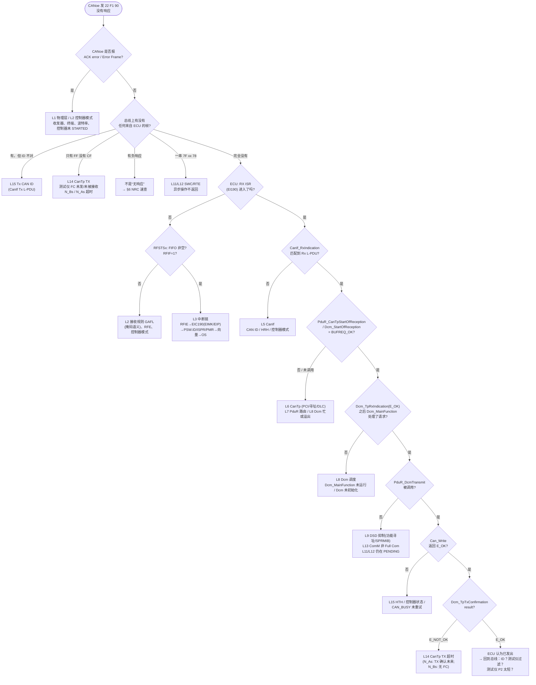

# 调试手册："CANoe 发 22 F1 90，ECU 没有 response"——逐层排查

> 定位: 独立手册（`claude_plan.md` §19 要求）。按 [analysis-and-learning-plan.md §6.2](analysis-and-learning-plan.md) 的去重规则，逐层调试方法只写在这里；[Can Driver 调试](04-can-mcal/15-can-driver-debugging.md) 只讲 CAN 控制器/引脚/位时间层，[DCM 调试](06-dcm/13-dcm-debugging.md) 只讲 DCM 内部状态，[08-integration/07](08-integration/07-integration-debugging.md) 只列集成特有问题。
> Prerequisite: [UDS 端到端](08-integration/05-uds-end-to-end.md)（本手册的层次就是那一章的 22 跳）、[F190 Demo](08-integration/04-f190-vin-demo.md)、[CANoe 测试](08-integration/06-canoe-test.md)
> 对应规范: SWS CAN **R22-11**（DET 错误码 `SWS_Can_91019` p.52–53、`CAN_E_DATALOST` p.53、回调 `00234` p.88、中断/轮询 p.50–51、`Can_Write` `00233/00213` p.80–81）；SWS DCM **R20-11**（TP 接口与返回值 p.243–247、`00444/00557/00642` p.56–57、ComM 门控 `00148–00156` p.85–86、P2/0x78 `00024/00120` p.61/p.111、DSD 检查顺序 `01535` p.94、功能寻址抑制 `00001` p.101、0x22 `00438/00434` p.136–137、DET 错误码 `00040` p.47–48）；HW-E R01UH0585EJ0120 Rev.1.20（RS-CANFD §17、INTC p.264–290、Table 6.11、SYNCP p.254）。**本仓库无 CanIf/CanTp/PduR/ComM/Os/Rte 的 SWS**——这些模块按 R4.x 公认形态描述，真实行为以项目所用 Release 与供应商实现为准。
> 对应源码: 本项目 `examples/uds_diag_demo/`（每层的断点位置）、`artifacts/uds-demo/trace.txt`（正常时的期望顺序）；openAUTOSAR（R3.1.5 对照）见各层"真实项目"栏

---

## 1. 本手册目标

当你在 CANoe 里发出 `22 F1 90`（或任何 UDS 请求）而 ECU 没有响应时，本手册让你能够：

1. 在 **10 分钟内**确定问题位于 16 层中的哪一层（先看总线，再二分）；
2. 在该层知道**断点放哪里、看哪个变量、看哪个返回值、看哪个回调、常见配置错误是什么**；
3. 在 RH850/P1M-E 上知道**读哪些寄存器**能直接回答"控制器收到了吗""中断来了吗"；
4. 在本仓库的 demo 里**亲手制造**这些故障并看到它们的 trace（§7，全部实测）。

---

## 2. 总体方法

### 2.1 两个观测点

```text
观测点 A：总线（CANoe / 示波器）         观测点 B：ECU 内部（调试器 / trace / DET / 计数器）
  - 请求帧发出了吗？ACK 了吗？              - 每一层的入口被调用了吗？
  - 有没有任何来自 ECU 的帧？               - 返回值是什么？
  - 响应 ID / PCI / 时间对吗？              - 状态变量停在哪？
```

**原则：先 A 后 B。** 总线上能看到的信息决定从 ECU 的哪一层开始下断点，避免从头逐层走。

### 2.2 开始调试前的准备

| 准备项 | 为什么 | demo / 真实项目 |
|---|---|---|
| 打开所有相关模块的 `DevErrorDetect` | DET 会直接告诉你"哪个模块、哪个 API、什么错误" | demo 默认 ON（`mcal/Can_Cfg.h:15`、`diag/Dcm_Cfg.h:19`）；真实项目开发版本应 ON |
| 在 `Det_ReportError` / `Det_ReportRuntimeError` 上下断点 | 第一个 DET 往往就是根因 | demo trace 打印 `DEVELOPMENT ERROR module=...` |
| 准备 map 文件 | 找到各模块的状态变量地址（多数是 `static`） | 真实项目：链接器输出 |
| 准备"黄金 trace" | 知道正常时每一层的顺序和时间 | `artifacts/uds-demo/trace.txt:23-82`（逐行解释见 [F190 Demo §6](08-integration/04-f190-vin-demo.md)） |
| 准备一份"句柄串" | 每层的 PDU id 互不相同 | [配置清单 §5.7](08-integration/01-ecu-configuration-checklist.md) |

### 2.3 DET 模块 ID 速查

[AUTOSAR Standard] DET 的 ModuleId 采用 AUTOSAR 统一编号（"List of Basic Software Modules"，**本仓库无该文档**；下列数值与 demo `general/Det.h:20-26` 及 openAUTOSAR `include/Modules.h` 一致，需以真实项目头文件确认）：

| 模块 | ModuleId | 常见错误（以 demo/规范为例） |
|---|---|---|
| Can | 80 | `CAN_E_UNINIT 0x05`、`CAN_E_PARAM_HANDLE 0x02`、`CAN_E_TRANSITION 0x06`；运行时 `CAN_E_DATALOST 0x01`（SWS CAN p.52–53） |
| CanIf | 60 | 未初始化、非法 L-PDU（demo `ecual/CanIf.c:100-105`） |
| CanTp | 35 | 运行时：超时/中止（demo 中 `error=0xC1` 是 demo 自定义值，`artifacts` 实测 trace 见 §7） |
| PduR | 51 | 非法 PDU id（demo `com/PduR.c:31`） |
| Dcm | 53 | `DCM_E_UNINIT 0x05`、`DCM_E_PARAM 0x06`、`DCM_E_INTERFACE_TIMEOUT 0x01`（运行时，0x78 用尽）（SWS DCM p.47–48） |
| Dem / NvM | 54 / 20 | — |

---

## 3. 决策树



图中每个叶子对应 §4 的一个层。决策顺序遵循"先总线、再 ISR、再 Dcm 入口、再 Dcm 出口、再 TX"的二分思路：每一个菱形都把剩余的可疑范围减半。

---

## 4. 逐层排查

每层使用同一模板：**问题 / 断点 / 变量 / 返回值 / 回调 / 常见配置错误 / demo 对应 / 真实项目**。demo 中的符号全部真实存在，可在 `examples/uds_diag_demo/` 中打开；"真实项目"一栏给出要在真实工程中寻找的等价物（供应商内部命名**需在真实项目环境中确认**）。

### L0 测试仪自身

| 项 | 内容 |
|---|---|
| 问题 | 测试仪真的发出了你以为的请求吗？它在等哪个响应 ID？ |
| 检查 | CANoe trace 中请求帧的 ID、DLC、PCI、padding；诊断设置中的响应 ID、寻址格式、P2Client |
| 常见错误 | 物理/功能 ID 填反；Extended 寻址 vs Normal；DLC<8 而 ECU 要求 8；P2Client 太短（ECU 其实在 P2 之后发了 0x78 或响应） |
| 详见 | [CANoe 测试 §4、§10](08-integration/06-canoe-test.md) |

### L1 CAN Bus（物理层）

| 项 | 内容 |
|---|---|
| 问题 | 帧在电气上到达 ECU 了吗？ECU 在总线上"存在"吗？ |
| 观察 | CANoe：ACK error、Error Frame、总线负载；示波器：CAN_H/CAN_L 差分、ECU 侧收发器 RXD/TXD |
| 判断 | **有 ACK ≠ ECU 收到**：任何在线节点都会 ACK。若总线上只有 CANoe 和该 ECU，"无 ACK"基本说明 ECU 控制器不在 communication 模式或位时序错 |
| 常见错误 | 收发器 STB/EN 引脚使其处于 standby；终端电阻；波特率/采样点（fCAN 用了 80 MHz 而不是 40/16 MHz）；引脚 ALT/PIPC 配错 |
| RH850 | [RH850 Hardware] 引脚：PMC/PFC/PFCE/PFCAE/PM，PIPC=0（HW-E p.94、p.131）；收发器引脚由原理图决定，**需在真实项目环境中确认** |
| demo | 无物理层（`sim/VirtualCanBus.c` 只模拟逻辑） |
| 详见 | [CAN 引脚与收发器](04-can-mcal/04-can-pin-transceiver.md)、[Can Driver 调试 L0–L1](04-can-mcal/15-can-driver-debugging.md) |

### L2 CAN Controller received?

| 项 | 内容 |
|---|---|
| 问题 | RS-CANFD 通道在 communication 模式吗？帧被某条接收规则接受并放进 RX FIFO 了吗？ |
| 断点 | 不需要断点：**停住 CPU 读寄存器**（读是安全的，见 §5 注） |
| 寄存器 | C0STS：CRSTSTS/CHLTSTS/CSLPSTS=0、**COMSTS=1**、TEC/REC 小、BOSTS=0；GSTS：全 0；GAFLCFG0.RNC0≠0；规则 j 的 GAFLIDj=0x7E0、GAFLMj（位=1 比较）；RFCC0.RFE=1；RFSTS0：RFEMP=0 / RFMC>0（收到了）、RFMLT（丢了）；GERFL.DEF（DLC 过滤丢弃） |
| 常见错误 | 规则掩码语义反了（GAFLM 位=1 表示比较，HW-E p.834）；规则数为 0（没有规则时收不到任何报文，p.1072）；RFE 没在 global operating 后单独置 1（p.845）；Classical/FD 接口模式与 MCAL 使用的寄存器偏移不一致（GRMCFG.RCMC，p.802） |
| demo 对应 | 规则：`mcal/Can.c:74-83`、`mcal/Can_Cfg.c:18-19`；硬件过滤：`sim/VirtualCanBus.c:168-179`（不匹配时打印 `no receive rule matches`）；控制器未启动：`sim/VirtualCanBus.c:163-167` |
| 故障注入 | F1（过滤码错）、F3（控制器未启动） |
| 真实项目 | MCAL 生成的接收规则表（`Can_PBcfg.c` 或供应商命名）；寄存器读回 |

### L3 CAN interrupt?

| 项 | 内容 |
|---|---|
| 问题 | FIFO 里有帧，ISR 却没进来？ |
| 断点 | OS 的 Cat2 ISR 包装入口 + Can 驱动 RX ISR 入口 |
| 逐级检查 | ① RFCCx.RFIE=1 → ② RFSTSx.RFIF=1 → ③ **EIC190**：EIRF=1、EIMK=0、EIP 合理、EITB 与向量方式一致 → ④ CPU：PSW.ID=0、ISPR 无同级或更高优先级未清位、PMR 未屏蔽该级 → ⑤ 向量：EITB=1 时 `INTBP + 4×190` 处是正确 handler；EIBD190.PEID=001 → ⑥ OS 配置中该 ISR 为 Cat2、源号正确 |
| 变量 | 进入 ISR 后读 EIIC：应为 `0x1000 + 190 = 0x10BE`（HW-E Table 6.11） |
| 常见错误 | **把 RX FIFO 中断挂在 EI184**（那是 CAN0 common FIFO，RX FIFO 0–7 共用 EI190，HW-E p.285–286）；ISR 没清 RFIF → 电平型中断风暴；清标志后缺少 store → dummy read → SYNCP（p.254）；另一个 ISR 没有正常 EIRET 导致 ISPR 位残留；临界区太长（PSW.ID=1） |
| demo 对应 | 模拟 INTC：`integration/BswScheduler.c:33-35`；中断使能：`mcal/Can.c:91`（`Can_RxIrqEnabled`，代表 RFIE+EIC190 已开）、`mcal/Can.c:246-249` |
| 故障注入 | F2（中断未使能） |
| 真实项目 | OS 配置的 ISR 列表、向量表生成文件、EIC 初始化代码（OS 端口或启动代码）；**由谁初始化 EIC190 需在真实项目环境中确认** |
| 详见 | [CAN 中断](04-can-mcal/05-can-interrupt.md)、[RH850 中断与异常](01-rh850/06-interrupt-exception.md) |

### L4 Can Driver

| 项 | 内容 |
|---|---|
| 问题 | ISR 进来了，驱动有没有把帧交给 CanIf？ |
| 断点 | 驱动 RX 处理中调用 `CanIf_RxIndication` 之前 |
| 变量 | 驱动状态（READY？）、配置指针、读出的 ID / DLC / label（=HRH）、构造的 `Can_HwType{CanId, Hoh, ControllerId}` |
| 返回值 / DET | `CAN_E_UNINIT`（驱动未初始化或被 DeInit）、`CAN_E_DATALOST`（运行时：覆盖/溢出） |
| 回调 | `CanIf_RxIndication(&mailbox, &pdu)`（`SWS_Can_00279` p.48） |
| 常见错误 | label→HRH 映射与 CanIf 配置不一致；扩展帧时未把 `Can_IdType` 最高位置 1（`SWS_Can_00423` p.48）；ISR 中先回调后弹 FIFO 导致重入 |
| demo 对应 | `mcal/Can.c:255-277`（`Can_Isr_GlobalRxFifo`）；trace：`[Can] ISR EI190 (RX FIFO): ID=0x7E0 HRH=0 ...` |
| 真实项目 | Renesas MCAL 的 RX 中断/轮询处理函数（命名**需在真实项目确认**）；教学驱动见 [14 章](04-can-mcal/14-can-driver-from-scratch.md) |

### L5 CanIf

| 项 | 内容 |
|---|---|
| 问题 | CanIf 把这一帧交给 CanTp 了吗？ |
| 断点 | `CanIf_RxIndication` 入口；"未匹配"分支；调用上层回调处 |
| 变量 | `Mailbox->Hoh`、`Mailbox->CanId`、`Mailbox->ControllerId`；CanIf 的控制器模式、PDU 模式；匹配到的 Rx L-PDU 索引与上层句柄 |
| 常见错误 | CAN ID 或 HRH 与 Rx L-PDU 配置不一致；上层用户配成 PduR/Com 而不是 CanTp；控制器模式仍为 STOPPED（`CanIf_ControllerModeIndication` 未到）；PDU 模式 OFFLINE；DLC 检查（要求 8 而测试仪不填充） |
| demo 对应 | `ecual/CanIf.c:160-188`：模式闸门 `:168-170`、匹配 `:173`、DLC `:174-178`、上层回调 `:182`、未匹配 `:186-187`；配置 `ecual/CanIf_Cfg.c:16-17` |
| 故障注入 | F4（Rx L-PDU CAN ID 错） |
| 真实项目 | CanIf 的 Rx PDU 表（`CanIf_PBcfg.c` 等）；PDU 模式由 CanSM/ComM 设置；openAUTOSAR 的闸门参照 `communication/CAN/CanIf/src/CanIf.c:778-831` |

### L6 CanTp（接收）

| 项 | 内容 |
|---|---|
| 问题 | CanTp 正确解析了 PCI 吗？上层接受了吗？ |
| 断点 | `CanTp_RxIndication` 的 PCI 分支（SF/FF/CF/FC）；`PduR_CanTpStartOfReception` 调用处与返回值 |
| 变量 | `RxPduId`（是物理还是功能那一路）、`SduDataPtr[0]`（PCI）、SF_DL / FF_DL、Rx N-SDU 状态机状态与计时器 |
| 返回值 | `BUFREQ_OK`；`BUFREQ_E_NOT_OK`（上层拒绝：SF 被静默丢弃）；`BUFREQ_E_OVFL`（FF 后回 FC OVFLW） |
| 常见错误 | 寻址格式不一致（Extended 时第 0 字节是地址，PCI 错位）；功能寻址收到 FF（应忽略）；N-PDU id 交叉；N_Cr 超时（测试仪 CF 太慢）；ECU 要发的 FC 无法发出（FC Tx L-PDU 未配） |
| demo 对应 | `com/CanTp.c:466-498`（分发）、`:183-215`（SF）、`:217-269`（FF，OVFL `:247-251`）、`:590-630`（N_Ar/N_Cr 超时） |
| 真实项目 | CanTp 配置的 N-SDU 表；openAUTOSAR 状态机 `communication/CAN/CanTp/src/CanTp.c:1001`（`CanTp_RxIndication`）可作算法参照 |

### L7 PduR

| 项 | 内容 |
|---|---|
| 问题 | PduR 把 N-SDU 路由给 Dcm 了吗？ |
| 断点 | `PduR_CanTpStartOfReception` / `PduR_CanTpRxIndication` |
| 变量 | 入参 id（PduR 的 Src PDU）、找到的路由、目的 DcmRxPduId |
| 返回值 / DET | 找不到路由 → DET（demo：module 51, error 0x02）+ `BUFREQ_E_NOT_OK` |
| 常见错误 | CanTp 与 PduR 引用了不同的 EcuC `Pdu`；物理/功能两条路由的目的交叉；"零成本"宏把 PduR 短路后签名不匹配（openAUTOSAR `PduR_Cfg.h:77-130`） |
| demo 对应 | `com/PduR.c:20-33`（查找）、`:80-90`、`:101-109`；配置 `com/PduR_Cfg.c:17-20` |
| 故障注入 | F5（PduR Src PDU 错） |
| 真实项目 | `PduR_PBcfg.c` 路由表 |

### L8 DCM（DSL：收到了吗？调度了吗？）

| 项 | 内容 |
|---|---|
| 问题 | Dcm 接受了请求吗？之后 `Dcm_MainFunction` 处理了吗？ |
| 断点 | `Dcm_StartOfReception`（返回值）、`Dcm_TpRxIndication`（result）、`Dcm_MainFunction` |
| 变量 | DSL 状态（demo `Dcm_Dsl.state`：IDLE→RECEIVING→REQ_RECEIVED→PROCESSING）、`rxLen/rxCopied`、`p2TimerMs`、当前会话/安全级 |
| 返回值 | `BUFREQ_OK`；`BUFREQ_E_NOT_OK`：Dcm 忙（同一连接上前一请求未完成，`SWS_Dcm_00557`）、`TpSduLength==0`（`00642`）、Dcm 未初始化；`BUFREQ_E_OVFL`：请求 > `DcmDslBufferSize`（`00444`） |
| 回调 | `Dcm_TpRxIndication(id, E_NOT_OK)` → 请求被丢弃（`00344`） |
| 常见错误 | **`Dcm_MainFunction` 没有被任何任务调用**（状态永远停在 REQ_RECEIVED）；`Dcm_Init` 未调用或配置指针为空；前一个请求卡在 PROCESSING（SWC 不返回），新请求被拒；缓冲太小 |
| demo 对应 | `diag/Dcm_Dsl.c:309-349`（SoR）、`:352-381`（CopyRx）、`:384-438`（RxInd）、`:249-261`（MainFunction 中启动 DSD）；调度 `integration/BswScheduler.c:49-52` |
| 故障注入 | F6（`Dcm_MainFunction` 未调度） |
| 真实项目 | Dcm 的 TP 回调实现、OS 任务配置中 `Dcm_MainFunction` 所在的任务及其周期（应 = `DcmTaskTime`，`ECUC_Dcm_00820`） |

### L9 DSD（服务分发）

| 项 | 内容 |
|---|---|
| 问题 | SID 在服务表里吗？会话/安全/长度/子功能检查通过了吗？响应是否被**抑制**了？ |
| 断点 | DSD 处理入口；每个"拒绝"分支；"抑制"分支 |
| 变量 | SID、请求类型（物理/功能）、SPRMIB（子功能 bit7）、当前会话、安全级、找到的服务表行 |
| 结果 | 正常拒绝 → **有负响应**（这时问题不是"无响应"，见 §6）；抑制 → **无响应且是正确行为**：功能寻址下 0x11/0x12/0x31/0x7E/0x7F（`SWS_Dcm_00001`）、SPRMIB=1 的正响应（`00200`）、`DcmRespondAllRequest=FALSE` 时 0x40–0x7F/0xC0–0xFF 的 SID（`00084`） |
| 常见错误 | 测试仪用功能寻址测试一个 ECU 不支持的服务，误以为"ECU 挂了"；服务表引用错（协议用了另一张 SID 表） |
| demo 对应 | `diag/Dcm_Dsd.c:77-142`（检查链）、`:40-46` / `:54-58`（功能寻址抑制）、`:177-180`（SPRMIB 抑制）；服务表 `diag/Dcm_Cfg.c:114-125` |
| 真实项目 | Dcm 生成的服务表；Manufacturer/Supplier notification（`Xxx_Indication` 返回 `E_REQUEST_NOT_ACCEPTED` 时**不响应**，`SWS_Dcm_00462/00517`）——demo 未实现，真实项目要查 |

### L10 DID configured?（DSP）

| 项 | 内容 |
|---|---|
| 问题 | DSP 找到 F190 了吗？读权限满足吗？ |
| 断点 | 0x22 处理函数中 DID 查找处 |
| 变量 | DID 号、查找结果、该 DID 的会话/安全掩码、`UsePort`、长度 |
| 结果 | 全部 DID 不支持或会话不满足 → `7F 22 31`（注意：**会话不满足回 0x31 而不是 0x7F**，`SWS_Dcm_00434`）；安全不满足 → `7F 22 33`；DID 个数超 `DcmDspMaxDidToRead` → 0x13 |
| 常见错误 | DID 存在但 `DcmDspDidUsed=FALSE`（视为不支持，`00561`）；读会话引用缺 extended；数据长度与 SWC 写入不一致 |
| demo 对应 | `diag/Dcm_Dsp.c:264-367`（查找 `:300`、跳过 `:304-308`、0x31 `:320-323`）；配置 `diag/Dcm_Cfg.c:34-38` |
| 故障注入 | F7（DID 号配错 → `7F 22 31`） |
| 真实项目 | `DcmDspDid` / `DcmDspDidInfo` / `DcmDspDidRead` / `DcmDspData` 多个生成表（R20-11 p.509–540） |

### L11 RTE callback?

| 项 | 内容 |
|---|---|
| 问题 | Dcm 调用了 RTE 吗？RTE 调到 SWC 了吗？ |
| 断点 | `Rte_Call_DataServices_<DID>_ReadData`（或 C callout `Xxx_ReadData`）入口与返回 |
| 变量 | `OpStatus`（INITIAL/PENDING/CANCEL）、返回值、输出缓冲 |
| 返回值 | `E_OK`；`E_NOT_OK`（DSP 回 0x22 或 SWC 给的 ErrorCode）；`DCM_E_PENDING`（下周期再调）；`RTE_E_*`（端口未连接、跨分区通信失败——具体错误码**以项目 RTE 生成代码为准**） |
| 常见错误 | `DcmDspDataUsePort` 同/异步与端口接口不一致；异步 server runnable 映射到一个不运行或被阻塞的任务；端口未连接时 RTE 生成的空实现返回错误 |
| demo 对应 | `rte/Rte_Dcm.c:54-62`（F190 异步）、`:64-68`（F187 同步）；调用点 `diag/Dcm_Dsp.c:342-350` |
| 真实项目 | 生成的 `Rte_Dcm.h`/`Rte.c`；若使用 `USE_DATA_SYNCH_FNC` 等 C 函数方式则看 `Dcm_Externals.h` 与项目 callout 文件；详见 [DCM ↔ RTE](07-rte-swc/08-dcm-rte-integration.md) |

### L12 SWC

| 项 | 内容 |
|---|---|
| 问题 | SWC 返回了吗？返回了什么？ |
| 断点 | SWC runnable 入口 |
| 变量 | SWC 内部状态（例如数据是否就绪、NvM 作业状态） |
| 症状 | SWC 一直返回 `DCM_E_PENDING` → Dcm 在 `P2 − adjust` 时发 `7F 22 78`，之后每 `P2* − adjust` 再发一次，直到 `DcmDslDiagRespMaxNumRespPend` 用尽 → `DCM_CANCEL` + 运行时错误 `DCM_E_INTERFACE_TIMEOUT` + `7F 22 10`（`SWS_Dcm_00120`）。**总线上不是"无响应"，而是一串 0x78**——若测试仪 P2*Client 设得太短，测试仪会报超时，看起来像"无响应" |
| 常见错误 | 等待一个永远不会完成的 NvM/外部事件；`DCM_CANCEL` 未处理导致下次请求状态错乱；OUT 数据在返回 PENDING 时就写了一半 |
| demo 对应 | `swc/VehicleInfoSWC.c:77-96`；慢 SWC 场景 trace 第 611–718 行；0x78 逻辑 `diag/Dcm_Dsl.c:266-287` |
| 真实项目 | 应用 SWC 源码与其任务映射 |

### L13 Response generated?

| 项 | 内容 |
|---|---|
| 问题 | DSD 组好了响应，DSL 真的发起发送了吗？ |
| 断点 | DSD"响应已组好"处；DSL 调 `PduR_DcmTransmit` 处与返回值 |
| 变量 | 响应长度、txBuffer 内容、DSL 状态（TRANSMITTING？）、**ComM 通信模式** |
| 返回值 | `PduR_DcmTransmit` = `E_NOT_OK` → 响应被丢弃且**不重发**（`SWS_Dcm_00118`） |
| 常见错误 | **Dcm 处于 No/Silent Com**：ComM 未通知 `Dcm_ComM_FullComModeEntered`，或通知的 NetworkId 与 `DcmDslProtocolComMChannelRef` 不一致——Dcm 按规范禁止发送（`00148–00156`）；`DcmDslProtocolTx` 未配置（多重性 0 时处理请求但不发响应，`01166`）；Tx 路由句柄错 |
| demo 对应 | `diag/Dcm_Dsd.c:176-185`（组响应）、`diag/Dcm_Dsl.c:187-204`（`PduR_DcmTransmit`，失败分支 `:199-203`）；**demo 无 ComM**，此类问题无法在 demo 中复现 |
| 真实项目 | ComM 配置、BswM 规则（谁请求 FULL_COM）、`Dcm_ComM_*` 回调的调用方 |

### L14 CanTp TX?

| 项 | 内容 |
|---|---|
| 问题 | CanTp 发出了 SF/FF 吗？多帧时等到 FC 了吗？ |
| 断点 | `CanTp_Transmit`；`PduR_CanTpCopyTxData` / `Dcm_CopyTxData` 返回值；`CanTp_TxConfirmation`；FC 处理；MainFunction 中的超时分支 |
| 变量 | Tx N-SDU 状态（WAIT_CONF / WAIT_FC / WAIT_STMIN）、已发字节、BS 剩余、STmin、计时器 |
| 超时 | **N_As**：帧交给 CanIf 后迟迟没有 TX 确认（`Can_MainFunction_Write` 未调度、TX 中断未开、仲裁一直失败）；**N_Bs**：FF 后没有收到测试仪 FC（测试仪没发、FC 被 ECU 过滤掉、响应 ID 错使测试仪根本没认出 FF） |
| 结果 | 超时 → `PduR_CanTpTxConfirmation(E_NOT_OK)` → `Dcm_TpTxConfirmation(E_NOT_OK)`；Dcm 结束请求，**0x10/0x11 的后续动作不会执行** |
| demo 对应 | `com/CanTp.c:392-422`（Transmit）、`:328-388`（发送一帧）、`:424-459`（FC）、`:501-564`（TxConfirmation）、`:631-660`（超时） |
| 故障注入 | F9（响应 ID 错 → N_Bs）、F10（TX 确认不来 → N_As）、F11（测试仪不发 FC → N_Bs） |
| 注意 | demo 在 E_NOT_OK 时 DSL 仍打印 `TpTxConfirmation(E_NOT_OK): response on the bus ...`——这行文字是 demo 的措辞瑕疵，**以括号中的 result 为准** |

### L15 Can_Write / TX confirmation

| 项 | 内容 |
|---|---|
| 问题 | 帧进入硬件 TX buffer 了吗？发出去了吗？确认回来了吗？ |
| 断点 | `CanIf_Transmit` 返回值；`Can_Write` 返回值与 DET；TX ISR（EI185）或 `Can_MainFunction_Write`；`CanIf_TxConfirmation` |
| 变量 | HTH、CAN ID、驱动 TX 对象 busy、保存的 `swPduHandle`；CanIf Tx 缓冲深度 |
| 返回值 | `E_OK`；`CAN_BUSY`（不是错误，CanIf 应排队，`SWS_Can_00213`、p.51）；`E_NOT_OK`（控制器未 STARTED、HTH 非法 → DET `CAN_E_PARAM_HANDLE`、长度 >8 → `CAN_E_PARAM_DATA_LENGTH`） |
| 寄存器 | [RH850 Hardware] TMSTSp（8 位）：TMTRM（请求挂起）、TMTRF（00 发送中/无请求，10 完成）；TMCp（8 位）；TMTRSTS0/TMTCSTS0 位图；C0STS.TEC（一直发不出去时 TEC 上升） |
| 常见错误 | Tx L-PDU 引用的 HTH 实际是 RECEIVE 对象；Tx CAN ID 错（ECU 发了，测试仪不认）；TMTRF 没清 → 同一 buffer 再也发不出；用 32 位访问 TMC/TMSTS；`CAN_BUSY` 被上层当作失败 |
| demo 对应 | `ecual/CanIf.c:93-133`（Transmit、缓冲）、`mcal/Can.c:171-217`（Write：HTH 检查 `:180-183`、BUSY `:196-200`）、`mcal/Can.c:220-239`（确认）；配置 `ecual/CanIf_Cfg.c:21-22` |
| 故障注入 | F8（HTH 错 → DET 80/0x02，CanTp 中止） |
| 详见 | [Can_Write 实现](04-can-mcal/10-can-write-implementation.md)、[Can Driver 调试 L5、L8](04-can-mcal/15-can-driver-debugging.md) |

---

## 5. RH850/P1M-E 寄存器观察表（RS-CANFD Classical 接口模式，CAN0）

[RH850 Hardware] 基址 `0xFFD2_0000`；FD 接口模式下 AFL/RX FIFO/TX buffer 窗口偏移不同（HW-E p.916–919），**先读 GRMCFG 确认模式**。地址对 R7F701381（P1M-E）成立；真实项目的 derivative **需在真实项目环境中确认**，若是 P1x（RS-CAN）或 P1x-C（M_CAN）本表不适用。完整清单与位定义见 [Can Driver 调试 §5](04-can-mcal/15-can-driver-debugging.md)。

| 层 | 寄存器 | 地址 | 正常（STARTED 空闲） | 异常含义 | HW-E |
|---|---|---|---|---|---|
| L2 | GRMCFG | `0xFFD2_04FC` | RCMC 与 MCAL 模式一致 | 偏移体系用错 | p.802 |
| L1/L2 | GCFG | `0xFFD2_0084` | DCS：0=clkc 40 MHz，1=clk_xincan 16 MHz | 位时序基准错 | p.816–817 |
| L2 | GSTS | `0xFFD2_008C` | [3:0]=0000b | GRAMINIT=1：CAN RAM 未初始化完；GRSTSTS=1：仍在 global reset | p.821 |
| L2 | GERFL | `0xFFD2_0090` | DEF/MES/THLES=0 | DEF=1：帧通过 ID 过滤但 DLC 过滤失败被丢弃 | p.823 |
| L2 | C0CFG | `0xFFD2_0000` | 与配置一致（例 `0x023E0003` 为 Classical 接口、fCAN 40 MHz、500k、SJW=3 Tq 的候选值） | 位时序 | p.803–804 |
| L2 | C0CTR | `0xFFD2_0004` | CHMDC=00b；BOM 按设计 | 仍为 reset/halt | p.805–808 |
| L2 | C0STS | `0xFFD2_0008` | [2:0]=000b，COMSTS=1，EPSTS/BOSTS=0 | COMSTS=0：尚未检测到 11 个连续隐性位；BOSTS=1：bus-off | p.810–811 |
| L2 | C0ERFL | `0xFFD2_000C` | 0 | 位错误/填充/ACK 错误等事件（W0C，读前先记录） | p.812–815 |
| L2 | GAFLCFG0 | `0xFFD2_009C` | RNC0 = 规则数 ≠ 0 | 无规则 → 什么都收不到 | p.831 |
| L2 | GAFLIDj / GAFLMj / GAFLP0_j / GAFLP1_j | `0xFFD2_0500 + 0x10·j` 起（先设 GAFLECTR `0xFFD2_0098` 的 AFLPN 选页，**不要**置 AFLDAE） | ID=0x7E0；掩码位=1 比较；PTR=HRH；目标 FIFO | 掩码语义反、目标 FIFO 错 | p.830–837 |
| L2/L3 | RFCC0 | `0xFFD2_00B8` | RFE=1，RFIE=1（中断模式），RFDC≠0 | RFE=0：FIFO 未启用 | p.844–845 |
| L2/L3 | RFSTS0 | `0xFFD2_00D8` | 空闲 RFEMP=1 | RFMC>0 且 ISR 不来 → L3；RFMLT=1 → 丢帧 | p.846–847 |
| L4 | RFID0 / RFPTR0 | `0xFFD2_0E00` / `0xFFD2_0E04` | 非空时 ID、DLC、label | label 与 HRH 不符 | p.848–850 |
| L4 | RFPCTR0 | `0xFFD2_00F8` | 由驱动写 0xFF 弹出 | **调试器中不要写** | p.848 |
| L3 | RFISTS | `0xFFD2_0244` | 哪个 RX FIFO 有中断请求 | — | p.875 |
| L3 | EIC190 | `0xFFFF_B17C`（16 位） | EIMK=0，EIP=配置，EICT=1（电平型） | EIMK=1：中断被屏蔽 | p.265–268、p.285–286 |
| L3 | EIC184 | `0xFFFF_B170` | 只有使用 CAN0 common FIFO 时才相关 | "EIRF 永不置位"——你可能挂错了通道 | p.285 |
| L3 | EIC185 / EIC183 / EIC189 | `0xFFFF_B172` / `B16E` / `B17A` | 按 TX 中断、通道错误、全局错误配置 | — | p.285–286 |
| L3 | EIIC（系统寄存器 regID 13, selID 0） | — | 进入 RX ISR 时 = `0x10BE` | 其他值：进的不是你以为的 ISR | p.192、Table 6.11 |
| L3 | INTBP（系统寄存器 regID 4, selID 1） | — | 表引用方式时 `INTBP + 4×190` = RX ISR 地址 | 向量表错 | p.192、p.281 |
| L3 | EIBD190 | 由 EIBD32 = `0xFFFF_B880` 每 4 字节推算为 `0xFFFF_BAF8`（推算值，需在手册寄存器表核对） | PEID=001 | 中断绑定到不存在的 PE | p.271 |
| L15 | TMC0 / TMSTS0 | `0xFFD2_0250` / `0xFFD2_02D0`（**8 位访问**） | 空闲 0x00 / 0x00 | TMSTS0.TMTRF=10b 未清 → buffer 被占 | p.878–881 |
| L15 | TMTRSTS0 / TMTCSTS0 | `0xFFD2_0350` / `0xFFD2_0370` | 位图 | 挂起请求 / 完成未清 | p.890、p.894 |
| L15 | TMIEC0 | `0xFFD2_0390` | 用中断确认的 buffer 位=1 | TX 中断不来 | p.888 |

**读寄存器是安全的，写会改变现场**：W0C 标志写 0、`RFPCTRx` 写 0xFF 弹出、`TMSTSp` 写 0——在调试器的 watch 窗口里不要修改它们。进入 channel reset 会清除 TEC/REC、错误标志、TMC/TMSTS（HW-E p.1070），**先保存证据再复位**。

---

## 6. "有响应，但不是期望的"：NRC 速查

收到负响应说明请求已经穿过 L1–L9，问题在 Dcm 的检查链或应用。下表按 NRC 给出 demo 中的产生位置与真实项目中的常见原因。

| NRC | 含义 | demo 产生位置 | 常见原因 | 规范 |
|---|---|---|---|---|
| 0x10 | generalReject | `diag/Dcm_Dsd.c:169-173`（服务返回非 E_NOT_OK 的失败）、`diag/Dcm_Dsl.c:277-285`（0x78 用尽） | SWC 一直 PENDING；返回值不合规 | `00271`、`00120` |
| 0x11 | serviceNotSupported | `diag/Dcm_Dsd.c:87-90` | SID 不在当前协议的服务表 | `00197` |
| 0x12 | subFunctionNotSupported | `diag/Dcm_Dsd.c:122-126`、各 DSP | 子功能未配置（0x31 由 DSP 检查） | `00273` |
| 0x13 | incorrectMessageLength | `diag/Dcm_Dsd.c:101-105`、各 DSP | 长度/格式错；测试仪 padding 被当成数据（SF_DL 错） | `00696` |
| 0x21 | busyRepeatRequest | demo 未实现 | 另一连接上的请求在处理中（`DcmDslDiagRespOnSecondDeclinedRequest`） | `00788–00790` |
| 0x22 | conditionsNotCorrect | `diag/Dcm_Dsp.c:355-358` 等 | SWC 返回 E_NOT_OK；Dem/NvM 忙 | `00439` 等 |
| 0x24 | requestSequenceError | `diag/Dcm_Dsp.c:447-450`、`:583-588` | 未请求 seed 就发 key；未 start 就要结果 | p.143；ISO 14229-1 |
| 0x31 | requestOutOfRange | `diag/Dcm_Dsp.c:320-323`、`:502-505`、`:565-568` | DID/RID 不支持，**或会话不满足**（0x22/0x2E/0x31） | `00438/00434/00469/00570` |
| 0x33 | securityAccessDenied | `diag/Dcm_Dsd.c:96-100`、`diag/Dcm_Dsp.c:316-318`、`:506-511` | 未解锁 | `00217`、`00435`、`00470` |
| 0x35 / 0x36 / 0x37 | invalidKey / exceedNumberOfAttempts / requiredTimeDelayNotExpired | `diag/Dcm_Dsp.c:466-479`、`:408-413` | key 算法不一致；尝试过多；延时中 | `00660`、`01349`、`01350` |
| 0x72 | generalProgrammingFailure | `diag/Dcm_Dsp.c:203-205`、SWC | NvM 写失败 | `00541`、`01060` |
| 0x78 | responsePending | `diag/Dcm_Dsl.c:206-224` | 服务需要更长时间（正常）；看后续是否有最终响应 | `00024` |
| 0x7E | subFunctionNotSupportedInActiveSession | `diag/Dcm_Dsd.c:127-131` | 子功能会话引用 | `00616` |
| 0x7F | serviceNotSupportedInActiveSession | `diag/Dcm_Dsd.c:91-95` | 未进入 extended；**S3 超时已掉回默认会话** | `00211`、`00140` |

---

## 7. 故障注入练习

### 7.1 方法：在副本中修改，不动仓库

[Educational Implementation] 下面的脚本把 `examples/uds_diag_demo` 复制到临时目录，只对副本做**一处** `sed` 修改，按 `tools/run_uds_demo.py` 相同的选项编译 `main_demo`，并只打印 `22 F1 90` 那一段 trace。仓库文件与 `artifacts/` 都不会被改动。请把脚本保存在临时目录（而不是仓库里），在仓库根目录用 Git Bash 运行。

```bash
#!/bin/bash
# inject.sh <name> <file under uds_diag_demo/> <sed-expression> [lines]
# Run from the repository root. Works on a COPY in $TEMP; the repository is never modified.
REPO=$(pwd); N=$1; F=$2; E=$3
W="${TEMP:-/tmp}/uds-inject/$N"; rm -rf "$W"; mkdir -p "$W"
cp -r "$REPO/examples/uds_diag_demo" "$W/" && cd "$W/uds_diag_demo" || exit 1
sed -i "$E" "$F"
cmp -s "$F" "$REPO/examples/uds_diag_demo/$F" && { echo "sed did not change $F"; exit 1; }
SRC="general/Det.c general/UdsTrace.c general/SimClock.c sim/VirtualCanBus.c sim/UdsTester.c sim/SimHarness.c
     mcal/Can.c mcal/Can_Cfg.c ecual/CanIf.c ecual/CanIf_Cfg.c com/CanTp.c com/CanTp_Cfg.c com/PduR.c com/PduR_Cfg.c
     diag/Dcm.c diag/Dcm_Dsl.c diag/Dcm_Dsd.c diag/Dcm_Dsp.c diag/Dcm_Cfg.c diag/Dem.c mem/NvM.c rte/Rte_Dcm.c
     swc/VehicleInfoSWC.c swc/SecurityAccessSWC.c integration/EcuM.c integration/BswScheduler.c"
INC=""; for i in general sim mcal ecual com diag mem rte swc integration; do INC="$INC -I $i"; done
gcc -std=c99 -O2 -Wall -Wextra -Werror -pedantic $INC $SRC integration/main_demo.c -o demo.exe || exit 1
./demo.exe > trace.txt
awk '/== 22 F1 90  ReadData/{f=1} /== 22 F1 87/{f=0} f' trace.txt | head -${4:-40}
```

PowerShell 用户可以用 `Copy-Item -Recurse` 复制到 `$env:TEMP`、手工编辑副本、再在副本目录运行 [F190 Demo §4.2](08-integration/04-f190-vin-demo.md) 的命令。

> 注：demo 的 `main_demo.c` 在无响应时统一打印 `-- RESULT: no response (expected for suppressed responses)`，这是 demo 为 `3E 80` 场景写的固定文字；在故障注入中请把它读作"无响应"。

### 7.2 练习清单（全部在本机实测，TDM-GCC 10.3.0）

| # | 破坏什么（层） | 命令 | 实测 trace 关键行 | 真实世界等价 |
|---|---|---|---|---|
| F1 | 接收规则过滤码（L2） | `./inject.sh f1 mcal/Can_Cfg.c 's/CAN_OBJECT_TYPE_RECEIVE,   0u, 0x7E0u/CAN_OBJECT_TYPE_RECEIVE,   0u, 0x7E1u/'` | `[Bus] no receive rule matches ID=0x7E0: hardware discards it` → 300 ms 无响应 | GAFL 规则 ID/掩码错（ECU 仍会 ACK） |
| F2 | RX 中断未使能（L3） | `./inject.sh f2 mcal/Can.c 's/Can_RxIrqEnabled = TRUE;/Can_RxIrqEnabled = FALSE;/'` | 请求帧之后**没有任何** `[Can] ISR` 行 | RFIE=0 / EIC190.EIMK=1 / 挂错 EI184 |
| F3 | 控制器未启动（L1/L2） | `./inject.sh f3 integration/EcuM.c 's/(void)CanIf_SetControllerMode(CanConf_CanController_CAN0, CAN_CS_STARTED);/\/\* removed \*\//'` | `[Bus] ECU controller not STARTED: frame not received` | ComM/CanSM 未请求 FULL_COM；真实总线上表现为 ACK error |
| F4 | CanIf Rx L-PDU CAN ID（L5） | `./inject.sh f4 ecual/CanIf_Cfg.c 's/{ 0x7E0u, CanConf_HRH_DiagPhysReq_7E0/{ 0x7E2u, CanConf_HRH_DiagPhysReq_7E0/'` | `[Can] ISR EI190 ...` → `[CanIf] RxIndication HRH=0 ID=0x7E0: no Rx L-PDU configured -> dropped` | CanIf 配置与 Can 过滤不一致 |
| F5 | PduR 路由 Src PDU（L7） | `./inject.sh f5 com/PduR_Cfg.c 's/{ PduRConf_PduRSrcPdu_CanTp_DiagPhysReq, Dcm/{ 5u, Dcm/'` | `[CanTp] SF len=3 ... -> PduR_CanTpStartOfReception(0)` → `[Det] DEVELOPMENT ERROR module=51 ... error=0x02` → `StartOfReception refused (1) -> SF dropped` | CanTp 与 PduR 引用不同 EcuC Pdu |
| F6 | `Dcm_MainFunction` 未调度（L8） | `./inject.sh f6 integration/BswScheduler.c 's/        Dcm_MainFunction();/        \/\* Dcm_MainFunction(); \*\//'` | `[Dcm/DSL] TpRxIndication(E_OK): request [22 F1 90] complete ...` 之后再无 Dcm 行 | OS 任务未调用 / 任务未激活 |
| F7 | DID 号（L10） | `./inject.sh f7 diag/Dcm_Cfg.c 's/0xF190u, 17u/0xF191u, 17u/' 30` | `[Dcm/DSP] 0x22: DID 0xF190 not supported / not in this session -> skipped` → `negative response 7F 22 31` | DID 未配置 / `DcmDspDidUsed=FALSE` / 会话引用缺失（**有响应**） |
| F8 | Tx L-PDU 的 HTH（L15） | `./inject.sh f8 ecual/CanIf_Cfg.c 's/{ 0x7E8u, CanConf_HTH_DiagResp, CanTpConf_TxNPdu_DiagResp_7E8/{ 0x7E8u, CanConf_HRH_DiagPhysReq_7E0, CanTpConf_TxNPdu_DiagResp_7E8/' 40` | `Can_Write(HTH=0, ...)` → `[Det] DEVELOPMENT ERROR module=80 ... api=0x06 error=0x02` → `[CanTp] ... aborted (CanIf_Transmit failed)` → `Dcm_TpTxConfirmation(E_NOT_OK)` | HTH 引用到 RECEIVE 对象 |
| F9 | Tx CAN ID（L15→L14） | `./inject.sh f9 ecual/CanIf_Cfg.c 's/{ 0x7E8u, CanConf_HTH_DiagResp, CanTpConf_TxNPdu_DiagResp_7E8/{ 0x7E9u, CanConf_HTH_DiagResp, CanTpConf_TxNPdu_DiagResp_7E8/' 40` | `[Bus] ECU -> wire ID=0x7E9 ... 10 14 62 F1 90 ...` → 150 ms 后 `aborted (N_Bs timeout: no FC from tester)` | **总线上有 ECU 的帧**，但测试仪不认这个 ID，所以不回 FC |
| F10 | `Can_MainFunction_Write` 未调度（L15） | `./inject.sh f10 integration/BswScheduler.c 's/    Can_MainFunction_Write();/    \/\* Can_MainFunction_Write(); \*\//' 60` | FF 上线、测试仪回 FC，但 `[CanTp] TX ...: unexpected FC -> ignored`（仍在等 TX 确认）→ 70 ms 后 `aborted (N_As timeout: frame not confirmed by CanIf)` | TX 确认路径断（TX 中断未开 / TMTRF 不清） |
| F11 | 测试仪不发 FC（L0/L14） | `./inject.sh f11 sim/UdsTester.c 's/    frame\[0\] = 0x30u;                       \/\* FC CTS \*\//    return; frame[0] = 0x30u;/' 60` | FF 上线、TX 确认正常 → `aborted (N_Bs timeout: no FC from tester)` | 测试仪 TP 配置错误 / FC 发到 ECU 不收的 ID |

F9、F10、F11 在测试仪侧看起来都是"只有 FF、没有后续"，但 ECU 侧的超时种类不同（N_Bs vs N_As）——这正是"两点观测"的意义：总线告诉你停在哪一帧，ECU 告诉你为什么。

### 7.3 进一步练习

1. **FC OVFLW**：把副本中 `diag/Dcm_Cfg.h` 的 `DCM_DSL_BUFFER_SIZE` 改为 12，看 13 字节 `2E` 请求时 ECU 回 FC OVFLW（README §8）。
2. **0x78 用尽**：`VehicleInfoSWC_SetVinPendingCycles(255)` + `DCM_DSL_MAX_NUM_RESP_PEND` 改为 2 + 请求超时放宽到 20 s，看两次 `7F 22 78` 后 `ReadData(DCM_CANCEL)` 与 `7F 22 10`（README §8）。
3. **模拟 ComM 门控**：在副本 `diag/Dcm_Dsl.c` 的 `Dcm_DslTransmitFinal` 开头加一个"未 Full Com 则 return"的全局开关，观察 L13 的现象：DSD/DSP 正常、`PduR_DcmTransmit` 永不调用。
4. 每做一个练习，先在决策树（§3）上预测你会走到哪个叶子，再运行验证。

---

## 8. 调试纪律

1. **先总线后代码、先二分后逐层**。决策树的前三个问题（ACK？有 ECU 帧吗？ISR 进了吗？）通常能排除一半以上的层。
2. **断点会改变时序**。在 RX ISR 停住期间，测试仪的 P2Client、ECU 的 N_Bs/N_Cr、Dcm 的 P2/S3 都在流逝（取决于调试器是否冻结外设与计时器）。时序类问题用 trace、计数器（RX 帧数、TX 确认数、`CAN_BUSY` 次数、ISR 进入次数）或 DET 钩子代替断点。
3. **先保存证据再复位**。CmERFL、TEC/REC 等会被 channel reset 清掉；DET 记录、Dcm 状态在复位后丢失。
4. **一次只改一个变量**，改配置源而不是改生成文件，改完重新生成、全量编译。
5. **区分"无响应"和"不该有响应"**：功能寻址抑制、SPRMIB、`DcmRespondAllRequest` 都是规范行为。
6. **把每次排查记录下来**：症状 → 停在哪一层 → 证据（trace 片段、寄存器值）→ 根因 → 修复。积累几次后，这份记录就是项目自己的调试手册。

---

## 9. 对未来真实项目的意义

[Real Project Consideration] 进入真实 RH850 + RTA-CAR 项目（版本、derivative、MCAL/BSW Release 均**需在真实项目环境中确认**）后：

1. **为 §4 每一层找到真实的断点函数**：Can RX ISR（Renesas MCAL 的命名）、`CanIf_RxIndication`、`CanTp_RxIndication`、`PduR_CanTpStartOfReception`、`Dcm_StartOfReception`、`Dcm_TpRxIndication`、`Dcm_MainFunction`、DSD/DSP 的供应商内部函数、`Rte_Call_DataServices_*` 或 `Xxx_ReadData` callout、`PduR_DcmTransmit`、`Dcm_CopyTxData`、`CanIf_Transmit`、`Can_Write`、`Dcm_TpTxConfirmation`。前后两端的 AUTOSAR 标准接口名不会变，可以直接搜索。
2. **为 §5 的寄存器表确认 derivative 与接口模式**（PRDNAME1–4、GRMCFG），否则地址全部失效。
3. **找到 ComM / BswM 的诊断相关规则**——L13 是 demo 无法覆盖、真实项目里又最常见的一层。
4. **把 §7 的故障注入思想迁移到 HIL**：在测试台上有意拔掉终端电阻、关闭测试仪 FC、改错测试仪响应 ID，记录每种故障在 CANoe trace 上的"指纹"，以后遇到同样指纹就能直接定位。

---

## 10. 总结

- 排查"无响应"的顺序：测试仪 → 物理层 → 控制器接收 → 中断 → Can → CanIf → CanTp → PduR → Dcm 接收/调度 → DSD → DID → RTE → SWC → 响应生成（ComM）→ CanTp 发送 → Can_Write/确认。
- 决策树的每个问题都可以用一个总线观察或一个断点回答，每个回答把可疑范围减半。
- RH850 上最有价值的几个寄存器：C0STS（COMSTS/TEC/REC）、GAFL 规则、RFCC0/RFSTS0、EIC190（不是 EIC184）、TMSTSp；读安全，写改变现场。
- demo 中的 11 个故障注入练习覆盖了 L1–L15 的主要层，每一个都给出了实测的 trace 指纹。
