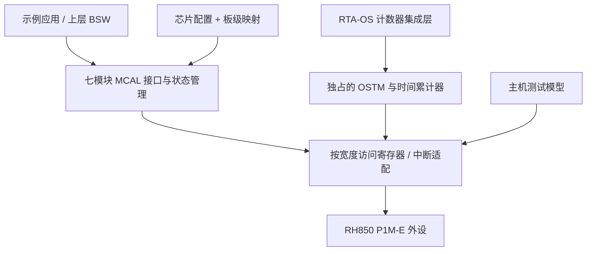

# RH850 MCAL 参考案例：内部 agent 实现解说

> **[Legacy 参考资料 — 上一阶段产物，不再维护]** 本文件来自项目上一阶段（“给内部 agent 的技术解说交付”）。**本仓库是个人学习用的教育项目**（RH850 + AUTOSAR 中文教程），不是公司真实工程；文中“内部 agent / 内部工程 / 交付”等说法只是当时的写作语境，不代表任何真实公司项目、真实配置或指令。正文以下保持原样，仅作溯源；学习请以新教程章节为准。
>
> - **已复审并迁移到**：R1 Mcu → [03-mcal/02](03-mcal/02-mcu-driver.md)；R2 Port → [03-mcal/03](03-mcal/03-port-driver.md)；R3 Dio → [03-mcal/04](03-mcal/04-dio-driver.md)；R4 Gpt → [03-mcal/05](03-mcal/05-gpt-driver.md)；R5 Can → [04-can-mcal/06](04-can-mcal/06-can-controller-init.md)、[09](04-can-mcal/09-can-init-implementation.md)–[11](04-can-mcal/11-can-rx-implementation.md)；资源归属 → [03-mcal/01](03-mcal/01-mcal-overview.md)、[03-mcal/07](03-mcal/07-rh850-hardware-mapping.md)。R6 Fls / R7 Wdg 暂无独立章节。
> - **已知更正**：① 原 :54 列出 `Mcu_GetPllStatus/Mcu_DistributePllClock` 未说明 **P1M-E 没有软件可编程 PLL 寄存器、没有 PROTCMD**（HW-E §12.3 pp.471–481），这两个 API 在本器件上是平凡实现（见 03-mcal/02）；② 原 :26–27 的 OSTM0/OSTM1 分配来自截图工程，是**配置选择而非硬件事实**；③ 缺 SWS/ECUC 映射。详见 [01-project-and-docs-review.md](reference/research/01-project-and-docs-review.md) §3 与 [05-consistency-review-log.md](reference/research/05-consistency-review-log.md)。
> - **行号说明**：本 banner 在第 2 行之后插入了 6 行。其他文档（如研究笔记 01、`analysis-and-learning-plan.md`）引用的本文件行号均指插入前版本，对应当前行号 **+6**。

硬件配置追加交付：[详细 CAN / 诊断 / OS 硬件交接](rh850-hardware-handoff.md)，包含本文件概念操作所需的地址、宽度、模式限制和验收步骤。CAN 的合并发送仅支持每通道 local0+1+2 或 local3+4+5，不能任意选择三个 buffer。

本案例覆盖用户新增的 R1～R7：Mcu、Port、Dio、Gpt、Can、Fls、Wdg。交付是七模块设计解释、配置/调用示例、错误处理和现有基础代码的说明。示例沿用 AUTOSAR 分层思路，但不声称已提供完整 AUTOSAR 4.2.2 驱动或量产验证。

硬件参数以 [逐项解答](agent-guide.md)、[硬件报告](hardware-findings.md) 和 HW-E 为依据。涉及官方 API 的名称用于说明职责；准确函数签名、配置类型和行为仍取自项目对应版本头文件。本文 `Ref_*` 均为概念操作，不是当前仓库中已实现的函数。

## 1. 分层和资源归属



MCAL 负责外设行为；板级配置决定哪个引脚连了什么；RTA 适配层解释 OS 回调，不能将它们混成一个驱动。Fee/NvM 和 CAN 上层/诊断栈是使用者，不属于这七个底层模块。

| 资源 | 案例分配原则 | 当前事实 |
| --- | --- | --- |
| OSTM0 | 保留给原有 Gpt 使用者；参考程序仅在独立环境使用 | 截图称已占用 |
| OSTM1 | OS 时间基准候选，单一所有者 | 是否空闲未知 |
| CAN0/1/2 | 按板卡布线选择一个控制器；每 controller 唯一所有者 | 芯片有三通道，板级选择未知 |
| Data Flash | 配置中的专用逻辑区域，不能覆盖 Fee/NvM 数据 | 32 KB 总范围已确认，保留区域未知 |
| WDTA0 | 从启动到应用只有一条一致的触发策略 | 实际 option 和模式未知 |
| GPIO | 按逻辑别名映射物理 pin，Port 管配置，Dio 管电平 | 板级 pin 未知 |

工程组织建议：`config` 放事实与板级参数；`platform` 放启动/编译器/MMIO；`mcal` 放模块行为；`integration` 放 OS/BSW 适配；`app` 放用例。当前目录实际已有的文件见末尾代码状态表，其他目录名称是设计，不表示已经创建完整工程。

## 2. 统一错误和配置处理

概念状态可用 UNINITIALIZED、READY、BUSY、FAULT 描述；这不是替换各 AUTOSAR 模块规范中的状态枚举。配置在首次硬件写入前校验：芯片/封装、资源重复、合法位、地址长度、实际时钟、通知入口及空指针。

所有等待硬件就绪的步骤都应有可观察的超时结果；失败后不得继续声称 READY。寄存器操作保留访问宽度和保留位要求，volatile 不能替代同步屏障、锁或硬件时序。控制器、buffer、timer 等资源的状态修改应使用明确的临界区；通知上层前考虑回调重入，避免持有不允许重入的锁。

<a id="R1"></a>
## 3. R1：Mcu

**输入：** R7F701381 器件身份、时钟方案、复位原因的处理策略、RAM/ECC 责任边界。硬件基线为 MainOSC16、CPU160、HSB80、LSB40 MHz（HW-E pp.469–471）；不要创建没有本器件依据的 PLL0/PLL1 写序列。

**职责和步骤：**

1. 与 startup 明确哪些事已在进入 C 前完成，特别是栈所在 RAM/ECC、早期 WDTA 和运行库基址。
2. 获取并保留复位原因，再按手册规定处理相关状态；不能先清掉再报告。
3. 验证时钟配置是否适用，执行本器件/厂商 Mcu 定义的配置及状态检查；只对真实存在且需要等待的状态进行有限等待，不捏造通用 PLL lock 寄存器。
4. 让 Gpt/Can/UART 使用核对过的实际频率，保持配置与返回值一致。
5. RAM 初始化按选定复位类型和保留区处理，不把所有 RAM 清零当万能启动流程。

**接口映射：** Mcu_Init、Mcu_InitClock、Mcu_GetPllStatus、Mcu_DistributePllClock、Mcu_GetResetReason 等仅在目标 MCAL 支持的配置下映射；不能因为规范有函数就推断硬件一定支持任意切频。

**最小示例：** `Ref_McuInit(config)` 后记录器件、复位来源和“预期频率/状态证据”；若时钟证据不一致，停止启动依赖该时钟的 CAN/Gpt 并记录错误。检查结果应能解释频率从何而来，不能只打印配置常量证明硬件已锁定。

<a id="R2"></a>
## 4. R2：Port

**输入：** 每 pin 的 `{封装管脚, port, bit, GPIO/外设功能, ALT, 方向, 初始电平, 输入缓冲, 电气属性, 运行时可改属性}`。板上 LED、按键、CAN 和收发器控制脚使用逻辑名，物理值未知时保持未绑定。

**寄存器依据：** 普通 Pn 的 PM/PMC/PFC/PFCE/PFCAE/PIBC/PIPC 规则见 HW-E pp.101–109；JPORT 访问宽度和功能不同。ALT 编码见逐项解答 I2。

**建议实现顺序：** 校验有效 pin 与复用组合→在需要时使输出处于不会冲突的状态→预置输出锁存电平→设置允许的电气属性、输入缓冲、功能选择和方向控制→最后按手册启用复用/输出。对于正在工作的外设，切换前还需停用相应功能；不能把此顺序无条件应用到调试/复位脚。

Port_Init 应一次使用一套完整配置；Port_SetPinDirection/Mode 仅允许改变配置标记为可改且硬件支持的项。未使用 pin 按 HW-E §2.8 逐项处理，模拟/调试脚不套普通 GPIO 策略。

**最小示例：** CAN_RX/CAN_TX 配成板卡选定 ALT，TRANSCEIVER_EN/STB 先进入已核实的启动状态；LED 初始为逻辑关闭，按键输入缓冲有效。检查不会出现同一 CAN 信号被两个 pin 同时复用、同一 pin 被两个模块占用。

<a id="R3"></a>
## 5. R3：Dio

**输入：** channel 到 port/bit 的映射、有效位掩码、需要支持的 port/group 定义。Dio 处理物理电平，逻辑 LED 亮灭或收发器 active-low 的转换放在明确的板级封装层。

**行为：** ReadChannel 读按目标输入/回读模式定义的值；WriteChannel 只影响指定输出位，不修改 Port 复用。输出回读必须区分输出锁存与实际 pin 电平，不能把一个寄存器的值冒充另一个。WritePort/WriteChannelGroup 对无效位和组范围进行处理，部分位更新使用手册允许的掩码写能力或受保护更新；不可用无保护的全端口读改写破坏另一个任务的输出。

```text
set_led(on):
    mapping = require_bound_pin(BOARD_LED)
    electrical_level = map_logical_state(on, mapping.active_level)
    Ref_DioWrite(mapping.channel, electrical_level)

read_button():
    raw = Ref_DioRead(require_bound_pin(BOARD_BUTTON).channel)
    return board_level_to_pressed(raw)    # 消抖是另一层的时间逻辑
```

这是完整的解说用调用关系；BOARD_LED/BOARD_BUTTON 没有假定的 pin 值。评审重点是无效 channel、单 bit 隔离、并发输出、输入缓冲前提和 active-low 转换。

<a id="R4"></a>
## 6. R4：Gpt 与 OSTM

**配置：** 逻辑 channel→OSTM 实例，实际 counter_hz，单次/连续模式，period counts，通知入口及中断所有者。基地址/寄存器见逐项解答 C1。普通周期模式适合 1 ms 服务，自由运行比较适合时间基准；两者不能在同一实例被不同模块同时控制。

**行为模型：** 未初始化不能启动；初始化时实例必须处于停止且资源独占；启动前校验 period 范围；启停、通知开关、elapsed/remaining 的含义保持一致。Interval 周期 counts=N 时 CMP=N−1，80 MHz 的 1 ms 用 79999，20 MHz 用 19999。单次模式可在首个有效事件后停止并改变逻辑状态，避免重复通知；具体 ISR 确认顺序按硬件源实现。

中断负责快照、确认和状态转换，再按接口约定调用通知。EnableNotification/DisableNotification 不应无意改变时间原点；Stop 的 elapsed/remaining 行为应按所选 Gpt API 定义，不能用重启硬件后的零计数回报之前运行时间。

**已存在的代码：** Ostm_InitPclk、Start、Stop、SetCompare、ReadCounter 及周期换算在 [Ostm.c](../examples/rh850_mcal_reference/mcal/gpt/Ostm.c)。它只支持 0/1 的 PCLK 路线，并不是完整 Gpt API；Stop 有界等待，运行中初始化返回 busy。真实通知、EIC/ISR 和分频链尚未实现。

**OS 对接示例：** 如需 Rte_TickCounter，使用独立适配层并按 [counter-design.md](counter-design.md)处理时间和四回调；不要将 Gpt 的 StopTimer 直接接到 OS Cancel。

<a id="R5"></a>
## 7. R5：Can

**配置：** 控制器身份、DCS/实际 fCAN、标称/数据时序、FD/BRS/TDC 策略、HOH 与 buffer/FIFO 分配、过滤规则、轮询/ISR 职责、上层通知和板级收发器状态。

**初始化解说：** 根据 HW-E §17 的规定进入允许配置的全局/通道状态，等待规定的 RAM/状态条件→写入本接口模式的时序、过滤与 buffer 分配→清理历史事件→按配置启用服务路径→请求进入通信状态并检查结果。每次等待都有超时；不能假定写 mode 位后立即完成转换，也不把 FD NCFG/DCFG 用到另一种寄存器接口模式。

**发送路径：** 校验 controller 已启动、PDU ID/类型/长度与 buffer 容量→取得空闲 Tx 资源→写 payload/ID/DLC/FD 属性→设置请求→完成时释放资源并恰好一次通知上层。已提交不等于已发送成功；无资源应返回 busy，不能覆盖仍在发送的 buffer。

**接收路径：** 一次只由指定 ISR 或轮询入口消费事件→读取帧元数据与实际 payload→验证长度和 buffer 分配→在释放 FIFO/buffer 前按接口需要复制数据→执行一次上层通知。错误/bus-off 单独记录、转移状态；恢复策略由上层和驱动约定，不能静默清错循环掩盖总线问题。

**位时间示例：** fCAN=40 MHz 时使用标称 `{2,31,8,4}`、数据 `{2,15,4,3}`；得 500k/1M、均 80%，对应编码见 A4。已有 [Can_BitTiming.c](../examples/rh850_mcal_reference/mcal/can/Can_BitTiming.c)负责参数校验和编码，不执行控制器配置或收发。

**过滤示例：** 用原七个 ID；每条规则检查 IDE/RTR/ID mask 和目标 FIFO 的配置转换。可用正例、相邻 ID、不同帧类型验证“精确匹配”，不能只发一个能接收的帧就认定过滤正确。16 B FD payload 的分配与 padding 独立检查。

<a id="R6"></a>
## 8. R6：Fls

**配置：** 物理 Data Flash 范围、授权给示例的区域、擦除/编程粒度、异步服务周期、通知、超时、底层 Flash 库版本和所需 RAM 例程。目标总范围为 32 KB、擦除 64 B、编程操作规格 4 B；测试区域当前未分配，不默认使用全区或最后一个 sector。

**地址算法示例：** 使用相对配置区的 offset/length 时，先验证 `offset <= region_size` 且 `length <= region_size-offset`，再计算物理地址，避免先加法溢出。擦除与写入按各自粒度验证；读缓冲大小、指针生命期及与在途作业重叠也要定义。

```text
IDLE --提交合法作业--> BUSY
BUSY --每次 MainFunction 推进有限步骤--> BUSY
BUSY --底层确认成功--> IDLE + JOB_OK + 一次完成通知
BUSY --错误/超时--> 受控收尾 + JOB_FAILED + 一次错误通知
```

以上为概念作业状态机，不冒充 AUTOSAR 结构体。返回“已接受”不是擦写已完成；不能在一次 MainFunction 内无期限等待。Cancel 是否能中止正在执行的底层命令由硬件/库决定，无法立即撤销时不得报告已无在途操作。

**底层步骤：** 进入适当 Flash 操作模式→空白/保护等前提检查→发起合法操作→读取完成/错误状态→按规定退出并恢复可读状态。专用 FACI 命令和时序不在已取得材料中充分覆盖，因此本文不伪造寄存器写序列；下一步使用官方 Flash Hardware Interface 手册及实际 Fls 库实现。

**完整示例的逻辑：** 在明确分配的测试区擦除→按规定 blank-check→写入带长度/版本/校验的信息→等待完成→读回比较→重启后读取已完成记录。Fee/NvM 模式下由其分配和管理区域，应用不越过 Fee 直接擦写。中断掉电恢复应由记录有效性/事务策略解释，不把简单的一次 read-back 当掉电一致性证明。

Data Flash BGO 允许 Code Flash 执行，但所用库要求的 RAM 例程仍需搬运；普通读取擦除态不应未经确认当成固定 FF，见 E1/E2。不同器件 Flash 行为可不同，不把旧平台测试通过当作本平台证明。

<a id="R7"></a>
## 9. R7：Wdg

**配置：** OPBT0 启动/VAC/计数时钟选项、OVF、窗口、75% 中断策略、软件触发额度、服务周期、复位原因记录。硬件周期和驱动触发额度分别管理，见逐项解答 F1/F2。

**硬件细节：** WDTA0=`0xFFD74000`；VAC 关闭时向 +0x00 的 WDTE 以 8 位写 `0xAC` 触发；VAC 打开时使用 +0x04 EVAC 及规定的动态激活码，不能仍写固定 AC。+0x08 REF 用于 VAC 计算，+0x0C MD 的首次修改受限制。启动后不能普通停止。来源：HW-E pp.1528–1535；VAC 算法按 §21.5.2.1 实现，案例未冒充支持它的完整驱动。

**行为：** 启动阶段先处理首次期限→初始化允许的模式→上层给予触发额度→在合法窗口内服务硬件→额度耗尽时停止触发。若要求 OFF、FAST/SLOW 动态切换与硬件不能停止/模式只能首次修改冲突，接口应明确拒绝或通过已证明的厂商策略处理，不返回虚假成功。

```text
on_health_authorization(timeout_ms):
    update_trigger_budget_according_to_verified_driver_contract(timeout_ms)

on_watchdog_service():
    account_for_actual_elapsed_time()
    if budget_valid and legal_hardware_window:
        trigger_using_selected_fixed_or_vac_protocol()
    else:
        do_not_extend_authorization_implicitly()
```

**示例：** 正常任务健康时持续更新预算；模拟健康任务停止后，不再更新预算，驱动最终停止喂狗；下次启动读取复位原因以解释结果。此处是行为案例，不要求本次实际制造复位。75% 事件是否就是截图中的 Cat2 ISR，仍按真实 EI9 绑定判断。

## 10. 综合调用流程

```text
early_startup:
    establish_valid_ram_stack_and_abi()
    handle_initial_watchdog_deadline_and_capture_reset_reason()

board_init:
    Ref_McuInit(verified_chip_clock_config)
    Ref_PortInit(bound_board_pin_config)
    Ref_SetTransceiverToVerifiedStartupState()
    Ref_GptInit(timer_ownership_config)
    Ref_CanInit(controller_and_timing_config)
    Ref_FlsInit(reserved_storage_config)
    Ref_WdgInit(option_compatible_config)
    connect_os_timer_adapter_using_actual_generated_headers()
    start_os_and_scheduled_services()

scheduled_services:
    service_only_polling_owned_can_events()
    advance_flash_jobs_with_bounded_work()
    maintain_counter_timebase_if_required()
    service_watchdog_without_inventing_new_health_authorization()
```

真实初始化顺序还受厂商 EcuM/BSW 依赖约束；此流程解释职责，不替换现有初始化列表。示例中的 pin、controller、Flash 区域没有绑定时，应显式报告配置缺失，不能默认选择一个真实资源继续操作。

## 11. 与官方 MCAL 的对照及代码状态

| 模块 | 本次解说已覆盖 | 当前可执行源码 |
| --- | --- | --- |
| R1 Mcu | 时钟/复位/RAM 责任、失败路径、示例 | 无完整驱动 |
| R2 Port | pin 配置模型、选择编码、初始化顺序 | 无完整驱动 |
| R3 Dio | channel/group、读写语义、并发、逻辑极性 | 无完整驱动 |
| R4 Gpt | 模式、周期、通知与 OS 边界 | OSTM0/1 PCLK 基础函数；无完整 Gpt/ISR |
| R5 Can | 时序、状态、Tx/Rx/过滤/错误路径 | CAN FD 位时间计算；无收发驱动 |
| R6 Fls | 边界、异步作业、BGO/RAM、存储示例 | 无 FACI/Fls 完整驱动 |
| R7 Wdg | 启动、模式限制、固定/VAC 区别、预算与触发 | 无完整驱动 |
| OS 集成 | 四角色、回绕、晚匹配、取消和条件备选 | tick 累计辅助；无真实四回调 |

官方 Renesas MCAL 应作为配置生成、接口版本和真实外设集成的对照。参考案例关注可解释的硬件行为，不能混入同一实例与官方驱动共同拥有寄存器。公开 P1M 教育项目只作结构阅读，不把它当可直接用于 P1M-E/GHS 的商业代码，见 [资源评估](online-references.md)。

已有主机测试用 GCC C99、优化和严格警告构建，5 组通过，含 100000 次 tick 采样。其证据范围是模型中的访问宽度、状态边界和算术，不包含真实 CAN 总线、电气时序、GHS ABI 或板上看门狗。解说案例的 R1～R7 已全部交付，完整可烧录驱动不属于本次调整后的完成条件。
