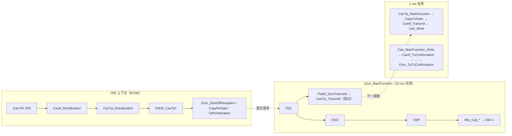

# AUTOSAR API 地图：谁调用、调用谁、在什么上下文、同步还是异步

> 对应规范: SWS CAN R22-11、SWS DCM R20-11、SWS MCU R24-11（页码见 [source-traceability.md](source-traceability.md)）。CanIf / CanTp / PduR / Dem / Rte / Os / Port / Gpt **本仓库无 SWS**，相关行按 R4.x 公认形态与本项目实现填写，需以真实项目 release 确认。
> 对应源码: 调用关系以 `examples/uds_diag_demo/` 为准（可执行、可 trace），括号内给出 `file:line`；与 openAUTOSAR（R3.1.5）的差异见 [source-traceability.md](source-traceability.md)。

---

## 0. 怎么读这张表

- **调用者 / 被调者**：只写“直接”的一跳。被调者是本 API 内部会调用的下一层 API。
- **上下文**：
  - `ISR` = 中断上下文（RH850 上 EI 级中断，OS 包装为 Cat 2 ISR）；
  - `MF` = 某个 BSW `*_MainFunction` 内（OS 周期任务上下文）；
  - `Task` = SW-C runnable / 集成代码所在的 OS 任务；
  - `Init` = 启动阶段（EcuM / BswM）；
  - 多个值表示“取决于配置”（例如 `CanRxProcessing = INTERRUPT | POLLING`）。
- **Sync/Async**：
  - `Sync` = 返回时动作已完成；
  - `Async` = 返回只代表“请求已接受”，结果稍后通过回调 / 下一次 MainFunction / `OpStatus` 重入得到。
- 本项目 demo 的调度：1 ms 任务跑 `Can_MainFunction_Mode/Write/Read` 与 `CanTp_MainFunction`；10 ms 任务跑 `Dcm_MainFunction` 与 `Rte_Task_10ms`；RX “中断”在 1 ms tick 开头模拟（`examples/uds_diag_demo/integration/BswScheduler.c:25-57`）。

---

## 1. CAN Driver（MCAL）

| API | 调用者 | 被调者（下一跳） | 上下文 | Sync/Async | 关键点 | 章节 |
|---|---|---|---|---|---|---|
| `Can_Init(Config)` | EcuM DriverInit（demo `integration/EcuM.c:28`） | 寄存器（RS-CANFD global/channel reset、规则表、FIFO） | Init | Sync | 结束时控制器为 STOPPED（`SWS_Can_00259`）；Mcu 必须先初始化（`SWS_Can_00240` p.22） | [04-can-mcal/09](../04-can-mcal/09-can-init-implementation.md) |
| `Can_SetControllerMode(Ctrl, Transition)` | CanIf（demo `ecual/CanIf.c:44`）← CanSM / 集成代码 | 写 CmCTR.CHMDC | Task / MF | **Async**（`SWS_Can_00230` p.66） | 结果由 `CanIf_ControllerModeIndication` 报告 | [04-can-mcal/06](../04-can-mcal/06-can-controller-init.md) |
| `Can_MainFunction_Mode()` | BSW 调度（demo `BswScheduler.c:38`） | `CanIf_ControllerModeIndication`（demo `mcal/Can.c:164`） | MF | — | 轮询 CmSTS（`SWS_Can_00368` p.87） | [04-can-mcal/12](../04-can-mcal/12-can-interrupt-implementation.md) |
| `Can_Write(Hth, PduInfo)` | CanIf（demo `ecual/CanIf.c:89`） | 写 TX buffer + TMCp.TMTR | Task / MF / ISR（CanIf 可能在 TxConfirmation 中重发缓冲帧，demo `ecual/CanIf.c:148`） | Sync 接受，**发送完成是 Async** | 返回 `E_OK / E_NOT_OK / CAN_BUSY`（R22-11）；BUSY 不是错误（`SWS_Can_00213`） | [04-can-mcal/10](../04-can-mcal/10-can-write-implementation.md) |
| `Can_MainFunction_Write()` | BSW 调度（demo `BswScheduler.c:39`） | `CanIf_TxConfirmation`（demo `mcal/Can.c:235`） | MF | — | `CanTxProcessing = POLLING` 时检测 TMTRF；INTERRUPT 时由 TX ISR 做同样的事（`SWS_Can_00016`） | [04-can-mcal/12](../04-can-mcal/12-can-interrupt-implementation.md) |
| `Can_MainFunction_Read()` | BSW 调度（demo `BswScheduler.c:40`） | `CanIf_RxIndication` | MF | — | demo 为 INTERRUPT 模式，函数体为空（`mcal/Can.c:242`） | [04-can-mcal/11](../04-can-mcal/11-can-rx-implementation.md) |
| Can RX ISR（demo `Can_Isr_GlobalRxFifo`） | INTC → OS Cat2 ISR（demo 模拟于 `BswScheduler.c:33-35`） | `CanIf_RxIndication`（demo `mcal/Can.c:275`） | **ISR**（EI190） | — | 回调链（CanIf→CanTp→PduR→Dcm 的 RX 部分）**全部在 ISR 上下文**执行 | [04-can-mcal/05](../04-can-mcal/05-can-interrupt.md) |
| `Can_MainFunction_BusOff()` | BSW 调度 | `CanIf_ControllerBusOff`（capstone `14-can-driver-from-scratch.md:1094`） | MF（或错误 ISR） | — | 驱动不得自动恢复（`SWS_Can_00274` p.43）；demo 未实现 | [04-can-mcal/13](../04-can-mcal/13-can-error-busoff.md) |

## 2. CanIf（ECU Abstraction）

| API | 调用者 | 被调者 | 上下文 | Sync/Async | 关键点 | 章节 |
|---|---|---|---|---|---|---|
| `CanIf_Init(ConfigPtr)` | EcuM（demo `EcuM.c:30`） | — | Init | Sync | 保存配置指针 | [05-can-stack/01](../05-can-stack/01-canif.md) |
| `CanIf_SetControllerMode` | CanSM / 集成（demo `EcuM.c:40`） | `Can_SetControllerMode` | Task | Async（继承 Can） | 无 ComM/CanSM 时必须有人调用，否则 `CanIf_Transmit` 被拒绝 | [05-can-stack/01](../05-can-stack/01-canif.md) |
| `CanIf_RxIndication(Mailbox, PduInfo)` | Can（ISR 或 `Can_MainFunction_Read`） | `CanTp_RxIndication`（经配置函数指针，demo `ecual/CanIf.c:182`） | ISR / MF | Sync 回调 | 软件过滤 = (HRH, CAN ID) 查 Rx L-PDU 表 | [05-can-stack/06](../05-can-stack/06-can-rx-path.md) |
| `CanIf_Transmit(TxPduId, PduInfo)` | CanTp（demo `com/CanTp.c:108`） | `Can_Write` | ISR / MF（CanTp 从 RxIndication 发 FC 时在 ISR 内） | Sync 接受；完成 Async | `CAN_BUSY` 时 CanIf 缓冲并在 TxConfirmation 中重发（demo `ecual/CanIf.c:116-131, :146-152`） | [05-can-stack/07](../05-can-stack/07-can-tx-path.md) |
| `CanIf_TxConfirmation(CanTxPduId)` | Can（TX ISR 或 `Can_MainFunction_Write`） | `CanTp_TxConfirmation`（demo `ecual/CanIf.c:155`） | ISR / MF | Sync 回调 | 参数是 Can 原样回传的 `swPduHandle` | [05-can-stack/07](../05-can-stack/07-can-tx-path.md) |
| `CanIf_ControllerModeIndication` | Can（`Can_MainFunction_Mode`） | （真实栈）`CanSM_ControllerModeIndication` | MF | Sync 回调 | demo 只更新本地状态（`ecual/CanIf.c:56-67`） | [04-can-mcal/06](../04-can-mcal/06-can-controller-init.md) |
| `CanIf_ControllerBusOff` | Can（错误 ISR 或 `Can_MainFunction_BusOff`） | （真实栈）`CanSM_ControllerBusOff` | ISR / MF | Sync 回调 | 恢复策略属 CanSM | [04-can-mcal/13](../04-can-mcal/13-can-error-busoff.md) |

## 3. CanTp

| API | 调用者 | 被调者 | 上下文 | Sync/Async | 关键点 | 章节 |
|---|---|---|---|---|---|---|
| `CanTp_Init(CfgPtr)` | EcuM（demo `EcuM.c:31`） | — | Init | Sync | openAUTOSAR R3 版无参数 | [05-can-stack/03](../05-can-stack/03-cantp.md) |
| `CanTp_RxIndication(RxPduId, PduInfo)` | CanIf | SF：`PduR_CanTpStartOfReception` + `CopyRxData` + `RxIndication`（demo `com/CanTp.c:204-214`）；FF：`StartOfReception` + `CopyRxData` + 发 FC；CF：`CopyRxData`；FC：推进 TX 状态机 | ISR / MF | Sync 回调 | FC 可能直接在这里经 `CanIf_Transmit` 发出 | [05-can-stack/04](../05-can-stack/04-isotp.md) |
| `CanTp_Transmit(TxPduId, PduInfo)` | PduR（demo `com/PduR.c:75`） | 登记；首帧在下一次 MainFunction 取数据发送 | MF（Dcm 的 MF 中） | **Async** | 只传长度；数据通过 `PduR_CanTpCopyTxData` 拉取 | [05-can-stack/03](../05-can-stack/03-cantp.md) |
| `CanTp_TxConfirmation(TxPduId, result)` | CanIf | 下一帧 / 等 FC / `PduR_CanTpTxConfirmation`（demo `com/CanTp.c:543`） | ISR / MF | Sync 回调 | 区分数据帧 L-PDU 与 FC L-PDU | [05-can-stack/07](../05-can-stack/07-can-tx-path.md) |
| `CanTp_MainFunction()` | BSW 调度（demo `BswScheduler.c:41`，1 ms） | `PduR_CanTpCopyTxData`、`CanIf_Transmit`、超时时 `PduR_CanTp*Indication/Confirmation(E_NOT_OK)` | MF | — | N_As/N_Bs/N_Cs/N_Ar/N_Br/N_Cr、STmin 都以它的周期为单位 | [02-autosar-classic/07](../02-autosar-classic/07-mainfunction-scheduling.md) |

## 4. PduR

| API | 调用者 | 被调者 | 上下文 | Sync/Async | 关键点 | 章节 |
|---|---|---|---|---|---|---|
| `PduR_CanTpStartOfReception` | CanTp | `Dcm_StartOfReception` | ISR / MF | Sync | 返回 `BufReq_ReturnType` | [05-can-stack/05](../05-can-stack/05-pdur.md) |
| `PduR_CanTpCopyRxData` | CanTp | `Dcm_CopyRxData` | ISR / MF | Sync | `SduLength = 0` 用于查询剩余缓冲 | [05-can-stack/05](../05-can-stack/05-pdur.md) |
| `PduR_CanTpRxIndication` | CanTp | `Dcm_TpRxIndication` | ISR / MF | Sync | 结果 `E_NOT_OK` 表示 TP 层失败 | [05-can-stack/05](../05-can-stack/05-pdur.md) |
| `PduR_DcmTransmit` | Dcm DSL（demo `diag/Dcm_Dsl.c:199`） | `CanTp_Transmit` | MF（Dcm） | Async | DCM 的 No Com 模式下不得调用（`SWS_Dcm_00148–00152` p.85–86） | [05-can-stack/05](../05-can-stack/05-pdur.md) |
| `PduR_CanTpCopyTxData` | CanTp | `Dcm_CopyTxData` | MF（CanTp） | Sync | `BUFREQ_E_BUSY` = 暂无数据，下周期重试 | [05-can-stack/05](../05-can-stack/05-pdur.md) |
| `PduR_CanTpTxConfirmation` | CanTp | `Dcm_TpTxConfirmation` | ISR / MF | Sync | 响应真正上了总线 | [05-can-stack/05](../05-can-stack/05-pdur.md) |

## 5. DCM

| API | 调用者 | 被调者 | 上下文 | Sync/Async | 关键点 | 章节 |
|---|---|---|---|---|---|---|
| `Dcm_Init(ConfigPtr)` | EcuM（demo `EcuM.c:36`） | DSL/DSP 内部 init | Init | Sync | 默认会话、安全 LOCKED（`SWS_Dcm_00034/00033`） | [06-dcm/01](../06-dcm/01-dcm-overview.md) |
| `Dcm_StartOfReception` | PduR | — | ISR / MF | Sync | 同连接忙 → `BUFREQ_E_NOT_OK`；超长 → `BUFREQ_E_OVFL`；停 S3（demo `diag/Dcm_Dsl.c:343`） | [06-dcm/02](../06-dcm/02-dsl.md) |
| `Dcm_CopyRxData` | PduR | — | ISR / MF | Sync | 拷入 DSL Rx buffer | [06-dcm/02](../06-dcm/02-dsl.md) |
| `Dcm_TpRxIndication` | PduR | 登记请求、启动 P2；DSD **不在此处执行** | ISR / MF | Sync 回调，**处理 Async** | DSD/DSP 推迟到下一个 `Dcm_MainFunction`（demo `diag/Dcm_Dsl.c:435` 的 trace） | [06-dcm/11](../06-dcm/11-dcm-runtime-flow.md) |
| `Dcm_MainFunction()` | BSW 调度（demo `BswScheduler.c:50`，10 ms） | DSL：`Dcm_DsdProcessRequest`（`Dcm_Dsl.c:256/:260`）、P2/S3 计时、0x78、`PduR_DcmTransmit`；DSP：安全延时 | MF | — | 周期 = `DcmTaskTime`（`ECUC_Dcm_00820` p.678）；所有时间精度受它约束 | [06-dcm/12](../06-dcm/12-dcm-mainfunction.md) |
| DSD 分发 `Dcm_DsdProcessRequest`（内部） | DSL | DSP 服务处理函数（服务表函数指针，`Dcm_Dsd.c:163`） | MF | Sync；服务可返回 `DCM_E_PENDING` | 校验顺序 SID→会话→安全→长度→子功能 | [06-dcm/03](../06-dcm/03-dsd.md) |
| DSP 服务处理函数（`Dcm_Dsp*`） | DSD | Rte_Call / Dem / NvM / DSL 内部（会话、复位） | MF | Sync 或 Async（`OpStatus`：INITIAL→PENDING→…；CANCEL） | 返回 `E_OK / E_NOT_OK+ErrorCode / DCM_E_PENDING` | [06-dcm/04](../06-dcm/04-dsp.md) |
| `Dcm_CopyTxData` | PduR | — | MF（CanTp） | Sync | 分段提供响应数据 | [06-dcm/02](../06-dcm/02-dsl.md) |
| `Dcm_TpTxConfirmation` | PduR | 会话切换生效、0x11 EXECUTE、重启 S3（demo `Dcm_Dsl.c:163-184`） | ISR / MF | Sync 回调 | `SWS_Dcm_00311`：0x10 在发送确认后才切会话 | [06-dcm/06](../06-dcm/06-diagnostic-session.md) |
| `Dcm_GetSesCtrlType` / `Dcm_GetSecurityLevel` | SW-C / BswM | — | Task | Sync | demo `diag/Dcm.c:42`, `:51` | [06-dcm/06](../06-dcm/06-diagnostic-session.md) |
| `SchM_Switch_Dcm_DcmDiagnosticSessionControl` | Dcm DSL（demo `Dcm_Dsl.c:121`） | RTE / BswM / SW-C 模式用户 | MF | Sync（模式通知） | demo `rte/Rte_Dcm.c:134` | [06-dcm/06](../06-dcm/06-diagnostic-session.md) |
| `SchM_Switch_Dcm_DcmEcuReset` | Dcm DSP（HARD/SOFT，`Dcm_Dsp.c:160`）、DSL（EXECUTE，`Dcm_Dsl.c:178`） | BswM → EcuM / `Mcu_PerformReset` | MF | Sync（复位本身稍后发生） | demo 以 `EcuM_SimRequestReset` 代替 BswM（`rte/Rte_Dcm.c:146-155`） | [06-dcm/10](../06-dcm/10-uds-services.md) |

## 6. RTE / SW-C / Dem / NvM

| API | 调用者 | 被调者 | 上下文 | Sync/Async | 关键点 | 章节 |
|---|---|---|---|---|---|---|
| `Rte_Call_DataServices_DID_F190_ReadData(OpStatus, Data)` | Dcm DSP（经 DID 表函数指针，`Dcm_Dsp.c:349`） | `VehicleInfoSWC_ReadVin`（`rte/Rte_Dcm.c:59`） | MF（Dcm） | **Async**（可返回 `DCM_E_PENDING`） | `USE_DATA_ASYNCH_CLIENT_SERVER`；同核时 RTE 可直接调用 | [07-rte-swc/08](../07-rte-swc/08-dcm-rte-integration.md) |
| `Rte_Call_DataServices_DID_F187_ReadData(Data)` | Dcm DSP（`Dcm_Dsp.c:345`） | `VehicleInfoSWC_ReadSwVersion` | MF（Dcm） | Sync | `USE_DATA_SYNCH_CLIENT_SERVER`：无 OpStatus，不能 PENDING | [07-rte-swc/06](../07-rte-swc/06-client-server.md) |
| `Rte_Call_DataServices_DID_F1A0_WriteData` | Dcm DSP 0x2E（`Dcm_Dsp.c:521`） | `VehicleInfoSWC_WriteDiagConfig` → `NvM_WriteBlock`（经 `Rte_Call_NvM_*` 宏） | MF（Dcm） | Async | NvM 作业在 `NvM_MainFunction` 完成，SW-C 用 PENDING 轮询 | [07-rte-swc/09](../07-rte-swc/09-diagnostic-swc-example.md) |
| `Rte_Call_SecurityAccess_Level_01_GetSeed/CompareKey` | Dcm DSP 0x27（`Dcm_Dsp.c:424/:454`） | `SecurityAccessSWC_*`（`swc/SecurityAccessSWC.c:34/:56`） | MF（Dcm） | Async（签名带 OpStatus） | 失败计数与延时由 DCM 管 | [06-dcm/07](../06-dcm/07-security-access.md) |
| `Rte_Call_RoutineServices_Routine_FF00_*` | Dcm DSP 0x31（经 `Dcm_Cfg.c:55-85` 适配） | `VehicleInfoSWC_SelfTest*` | MF（Dcm） | Async | Start/Stop/RequestResults | [07-rte-swc/09](../07-rte-swc/09-diagnostic-swc-example.md) |
| `Rte_Start()` | EcuM（demo `EcuM.c:37`） | SW-C init runnable（`rte/Rte_Dcm.c:42-43`） | Init | Sync | — | [07-rte-swc/04](../07-rte-swc/04-rte-concept.md) |
| `VehicleInfoSWC_Run10ms`（runnable） | RTE 任务体 `Rte_Task_10ms`（`rte/Rte_Dcm.c:46-50`） | — | Task（10 ms） | — | TimingEvent 映射到 OS 任务 | [07-rte-swc/03](../07-rte-swc/03-runnable-event.md) |
| `Dem_SelectDTC` + `Dem_ClearDTC` | Dcm DSP 0x14（`Dcm_Dsp.c:187/:192`） | Dem 内部（demo stub `diag/Dem.c:45/:56`） | MF（Dcm） | 可能 Async（`DEM_PENDING` → 下周期重调，`SWS_Dcm_01412` p.110） | ClientId = `DcmDemClientRef` | [06-dcm/09](../06-dcm/09-dtc-dem.md) |
| `Dem_SetDTCFilter` + `Dem_GetNextFilteredDTC` | Dcm DSP 0x19（`Dcm_Dsp.c:238/:243`） | Dem | MF（Dcm） | Sync（逐条迭代） | — | [06-dcm/09](../06-dcm/09-dtc-dem.md) |
| `NvM_WriteBlock` / `NvM_GetErrorStatus` | SW-C（经 `Rte_Call_NvM_DiagConfig_*`，`rte/Rte_VehicleInfoSWC.h:42-47`） | 存储栈（demo stub `mem/NvM.c:46/:59`） | Task / MF | **Async**（作业在 `NvM_MainFunction`） | — | [07-rte-swc/09](../07-rte-swc/09-diagnostic-swc-example.md) |

## 7. MCAL 其他 / 启动

| API | 调用者 | 被调者 | 上下文 | Sync/Async | 关键点 | 章节 |
|---|---|---|---|---|---|---|
| `Mcu_Init` | EcuM DriverInitOne | 寄存器 / 保存配置 | Init | Sync | `SWS_Mcu_00153` p.24 | [03-mcal/02](../03-mcal/02-mcu-driver.md) |
| `Mcu_InitClock` | EcuM | PLL（若有） | Init | **启动后立即返回**（`SWS_Mcu_00138` p.27） | P1M-E 无软件 PLL，可能为平凡实现 | [03-mcal/02](../03-mcal/02-mcu-driver.md) |
| `Mcu_PerformReset` | BswM action / EcuM（DCM 0x11 EXECUTE 之后） | SWSRESA0 / SWARESA0 | Task | 不返回 | `SWS_Mcu_00160` p.31 | [03-mcal/02](../03-mcal/02-mcu-driver.md) |
| `Port_Init` | EcuM DriverInitOne | PORT 寄存器 | Init | Sync | 必须先于 `Can_Init`（`SWS_Can_00239` p.22） | [03-mcal/03](../03-mcal/03-port-driver.md) |
| `Gpt_StartTimer` | SW-C / BSW / 集成 | OSTM CMP/CTL/TS（`examples/rh850_mcal_reference/mcal/gpt/Ostm.c:16/:32`） | Task | Sync 启动；到期通知 Async（ISR） | — | [03-mcal/05](../03-mcal/05-gpt-driver.md) |
| Gpt 通知 ISR | INTC（EI74/75）→ OS | Gpt 通知回调 | ISR | — | OSTM3–7 只能 FEINT | [03-mcal/05](../03-mcal/05-gpt-driver.md) |

---

## 8. 一张图：RX 部分在 ISR，处理在 MainFunction

[Real Project Consideration] RX 链路中的每个回调都可能在 ISR 中运行，所以 CanIf/CanTp/PduR/Dcm 的这些回调里**不能做长时间操作**，共享数据要用 `SchM_Enter/Exit` 保护；DSD/DSP 推迟到 MainFunction 正是为此。真实项目中要从 OS 配置确认 Can RX 是 ISR 还是 polling（`CanRxProcessing`），二者对“哪段代码在中断里跑”的回答完全不同。
