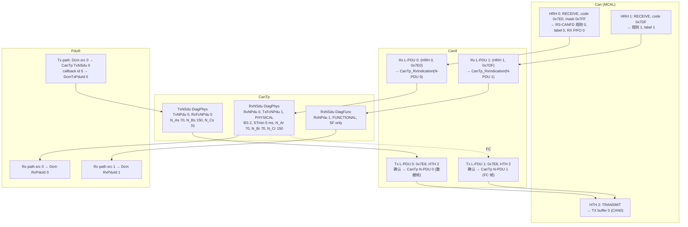

# CAN 配置链：0x7E0 请求 / 0x7E8 响应的 Can → CanIf → CanTp → PduR 参数地图

> 对应规范: SWS CAN R22-11 第 10 章（ECUC 容器 ID 与页码已逐个在 `artifacts/pdf-text/AUTOSAR_SWS_CANDriver.txt` 中定位）。**本仓库没有 CanIf / CanTp / PduR SWS**——这三层的参数名（`CanIfRxPduCanId`、`CanTpBs`、`PduRDestPdu` 等）是 R4.x 公认名称，无 ECUC ID，需以真实项目 release 的 SWS / 参数定义文件确认。
> 对应源码: `examples/uds_diag_demo/{mcal/Can_Cfg.*, ecual/CanIf_Cfg.*, com/CanTp_Cfg.*, com/PduR_Cfg.*}`（手写 “as if generated”）；RS-CANFD 寄存器级配置取自 `docs/04-can-mcal/14-can-driver-from-scratch.md` §7.3（capstone 教学驱动的示例 `Can_PBcfg.c`）
> 硬件: RH850/P1M-E RS-CANFD（HW-E p.788–1123）

`[Educational Implementation]` 本页的 ID、时间参数、寄存器值都是**教学示例**，不是任何真实网络或 OEM 规范的已验证配置。

---

## 1. 一图总览

---

## 2. 请求方向（0x7E0，物理寻址）逐层参数表

| 层 | ECUC 参数（容器） | ECUC ID / 页（若本仓库有 SWS） | demo 值 | demo file:line | RS-CANFD / 运行时对应 |
|---|---|---|---|---|---|
| Can | `CanController`（`CanControllerId`） | 00354 p.107 / 00316 p.109 | `CanConf_CanController_CAN0 = 0` | `mcal/Can_Cfg.h:18`；`mcal/Can_Cfg.c:13` | 通道 CAN0：CmCFG/CmCTR/CmSTS `+0x10×0`（HW-E p.798） |
| Can | `CanControllerBaudRate` | 00005 p.114 | 500 kbit/s | `mcal/Can_Cfg.c:13` | capstone：`CmCFG = 0x023E0003`（fCAN 40 MHz，divider 4，TSEG1 15，TSEG2 4，SJW 3，采样点 80%）`docs/04-can-mcal/14-can-driver-from-scratch.md:1208`；编码规则 HW-E p.803–804 |
| Can | `CanCpuClockRef` → `McuClockReferencePoint` | 00313 p.112 | demo 未建模 | — | GCFG.DCS=0 → clkc 40 MHz（HW-E p.791, p.817）；capstone `GCFG = 0`（`14-can-driver-from-scratch.md:1220`） |
| Can | `CanRxProcessing` | 00317 p.109 | INTERRUPT | `mcal/Can.c:7-10` 注释；ISR `mcal/Can.c:255` | RFCCx.RFIE=1 + EIC190 解除屏蔽（HW-E p.845, p.286） |
| Can | `CanHardwareObject`（`CanObjectId`） | 00324 p.122 / 00326 p.125 | `CanConf_HRH_DiagPhysReq_7E0 = 0` | `mcal/Can_Cfg.h:22` | HRH 号作为规则 label：GAFLP0_j.PTR（HW-E p.835） |
| Can | `CanObjectType` / `CanHandleType` / `CanIdType` | 00327 p.127 / 00323 p.123 / 00065 p.125 | RECEIVE / （FULL，见注释） / STANDARD | `mcal/Can_Cfg.c:18`；`mcal/Can_Cfg.h:22` 注释 | — |
| Can | `CanHwFilterCode` | 00469 p.129 | `0x7E0` | `mcal/Can_Cfg.c:18` | GAFLIDj = `0x0000_07E0`（IDE=0，RTR=0）（HW-E p.832） |
| Can | `CanHwFilterMask` | 00470 p.130 | `0x7FF` | `mcal/Can_Cfg.c:18` | GAFLMj：**位 = 1 比较**；标准数据帧精确匹配 = `0xC000_07FF`（IDEM=1, RTRM=1, IDM[10:0]=1）（HW-E p.834；capstone `STD_EXACT_MASK` `14-can-driver-from-scratch.md:1189`） |
| Can | `CanHwObjectCount` | 00467 p.124 | demo 未建模 | — | RX FIFO 深度：capstone `RFCC0 = 0x1200`（RFIM=1，RFDC=010b = 8 帧）`14-can-driver-from-scratch.md:1210`；RFE 在 global operating 后单独置 1（HW-E p.845） |
| Can | （MCAL 私有）规则号 / RX FIFO | — | 规则 0（`hwBufferIdx = 0`） | `mcal/Can_Cfg.c:18`；写入 `mcal/Can.c:79` | GAFLP1_j = `1 << x`（路由到 RX FIFO x）`14-can-driver-from-scratch.md:664`；GAFLCFG0.RNC0 = 规则数（HW-E p.831） |
| CanIf | `CanIfRxPduCanId` | 本仓库无 CanIf SWS | `0x7E0` | `ecual/CanIf_Cfg.c:16` | 软件比较 `ecual/CanIf.c:173` |
| CanIf | `CanIfRxPduHrhIdRef` | 同上 | `CanConf_HRH_DiagPhysReq_7E0` | `ecual/CanIf_Cfg.c:16` | 与 `Mailbox->Hoh` 比较 |
| CanIf | `CanIfRxPduDataLength`（最小 DLC） | 同上 | 1 | `ecual/CanIf_Cfg.c:16`；检查 `ecual/CanIf.c:174` | DLC 来自 RFPTRx[31:28]（HW-E p.848） |
| CanIf | `CanIfRxPduUserRxIndicationUL` / 上层 PDU 引用 | 同上 | `CAN_TP`：`CanTp_RxIndication(CanTpConf_RxNPdu_DiagPhysReq_7E0 = 0)` | `ecual/CanIf_Cfg.c:16`；`com/CanTp_Cfg.h:20` | 调用 `ecual/CanIf.c:182` |
| CanIf | Rx L-PDU handle | 同上 | `CanIfConf_CanIfRxPduCfg_DiagPhysReq_7E0 = 0` | `ecual/CanIf_Cfg.h:14` | — |
| CanTp | `CanTpRxNPdu`（`CanTpRxNPduId`） | 本仓库无 CanTp SWS | 0 | `com/CanTp_Cfg.c:15` | — |
| CanTp | `CanTpTxFcNPdu` + CanIf FC L-PDU | 同上 | TxFcNPdu 1 / `CanIfConf_CanIfTxPduCfg_DiagRespFc_7E8 = 1` | `com/CanTp_Cfg.c:15`；`com/CanTp_Cfg.h:25`；`ecual/CanIf_Cfg.h:22` | FC 帧也从 0x7E8 发出（TX buffer 0） |
| CanTp | `CanTpRxTaType` | 同上 | PHYSICAL | `com/CanTp_Cfg.c:16` | 功能寻址 NSdu 只接受 SF（`com/CanTp_Cfg.c:21-25`） |
| CanTp | `CanTpBs` / `CanTpSTmin` | 同上 | BS = 2、STmin = 5 ms | `com/CanTp_Cfg.c:17-18` | 写入 ECU 发出的 FC 帧 |
| CanTp | `CanTpRxWftMax` / `CanTpNar` / `CanTpNbr` / `CanTpNcr` | 同上 | 3 / 70 ms / 70 ms / 150 ms | `com/CanTp_Cfg.c:19`（字段顺序见 `com/CanTp.h:39-42`） | 以 `CanTp_MainFunction` 周期计时 |
| CanTp | `CanTpMainFunctionPeriod` | 同上 | 1 ms | `com/CanTp_Cfg.h:16`；调度 `integration/BswScheduler.c:41` | — |
| CanTp | `CanTpPaddingByte` / `CanTpPaddingActivation` | 同上 | `0xCC` / ON | `com/CanTp_Cfg.h:17` | 填充到 DLC 8 |
| CanTp → PduR | N-SDU 的 PduR 引用 | 同上 | `PduRConf_PduRSrcPdu_CanTp_DiagPhysReq = 0` | `com/CanTp_Cfg.c:16`；`com/PduR_Cfg.h:14` | — |
| PduR | `PduRRoutingPath` / `PduRSrcPdu` / `PduRDestPdu` | 本仓库无 PduR SWS | src 0 → `DcmConf_DcmDslProtocolRx_DiagPhys = 0`，目标 API 表 `PduR_DcmApi` | `com/PduR_Cfg.c:18`；API 表 `:12-15` | 转发 `com/PduR.c:89` |
| Dcm | `DcmDslProtocolRxPduRef` / `DcmDslProtocolRxAddrType` | 00770 p.477 / 00710 p.476（DCM R20-11） | RxPduId 0 = 物理，1 = 功能 | `diag/Dcm_Cfg.h:31-32` | 寻址类型判断 `diag/Dcm_Dsl.c:425` |

## 3. 响应方向（0x7E8）逐层参数表

| 层 | 参数 | demo 值 | demo file:line | RS-CANFD / 运行时对应 |
|---|---|---|---|---|
| Dcm | `DcmDslProtocolTxPduRef`（00772 p.478） | `DcmConf_DcmDslProtocolTx_DiagResp = 0` | `diag/Dcm_Cfg.h:33` | — |
| Dcm → PduR | PduR src（Dcm 侧） | `PduRConf_PduRSrcPdu_Dcm_DiagResp = 0` | `com/PduR_Cfg.h:19`；调用 `diag/Dcm_Dsl.c:199` | — |
| PduR | Tx 路由路径 | src 0 → `CanTp_Transmit(CanTpConf_TxNSdu_DiagPhys = 0)`；回调 id `PduRConf_PduRDestPdu_CanTp_DiagResp = 0` → DcmTxPduId 0 | `com/PduR_Cfg.c:23-24`；`com/PduR_Cfg.h:21` | — |
| CanTp | `CanTpTxNSdu` / `CanTpTxNPdu` | TxNSdu 0 / TxNPdu 0 | `com/CanTp_Cfg.c:30`；`com/CanTp_Cfg.h:24, :31` | — |
| CanTp | `CanTpRxFcNPdu` | `CanTpConf_RxNPdu_DiagPhysReq_7E0 = 0`（测试仪 FC 仍用 0x7E0） | `com/CanTp_Cfg.c:30` | 测试仪 FC 走规则 0 → HRH 0 |
| CanTp | `CanTpNas` / `CanTpNbs` / `CanTpNcs` | 70 / 150 / 70 ms | `com/CanTp_Cfg.c:32`（字段顺序见 `com/CanTp.h:53-55`） | — |
| CanTp → CanIf | CanIf Tx L-PDU | `CanIfConf_CanIfTxPduCfg_DiagResp_7E8 = 0` | `com/CanTp_Cfg.c:30`；`ecual/CanIf_Cfg.h:21` | — |
| CanIf | `CanIfTxPduCanId` | `0x7E8` | `ecual/CanIf_Cfg.c:21` | TMIDp = `0x0000_07E8`（标准 ID，IDE=0）；capstone 测试断言 `14-can-driver-from-scratch.md:1538` |
| CanIf | `CanIfTxPduBufferRef` → HTH | `CanConf_HTH_DiagResp = 2` | `ecual/CanIf_Cfg.c:21`；`mcal/Can_Cfg.h:24` | — |
| CanIf | `CanIfTxPduUserTxConfirmationUL` | `CanTp_TxConfirmation(TxNPdu 0)` | `ecual/CanIf_Cfg.c:21`；调用 `ecual/CanIf.c:155` | — |
| CanIf | `CanIfBufferSize` | 4 | `ecual/CanIf_Cfg.h:25` | `CAN_BUSY` 时缓冲（`ecual/CanIf.c:116-131`） |
| Can | HTH 2 → TX buffer | `hwBufferIdx = 0` | `mcal/Can_Cfg.c:20` | TX buffer p = 0（通道 0 使用 p = 0..15，HW-E p.800）；TMPTRp = DLC<<28（8 字节 → `0x8000_0000`）；TMDF0/1_p；TMCp = `0x01`（8 位写）（HW-E p.878–887）；写入 `mcal/Can.c:210`、capstone `14-can-driver-from-scratch.md:994-999` |
| Can | `CanTxProcessing` | POLLING（demo） | `mcal/Can.c:9` 注释；`mcal/Can.c:220` | 轮询 TMSTSp.TMTRF = 10B，写 00B 清除（HW-E p.880–881）；INTERRUPT 时为 INTRCAN0TRX = EI185 |

## 4. 功能寻址（0x7DF）差异

| 层 | 值 | file:line |
|---|---|---|
| Can | HRH 1，code 0x7DF，mask 0x7FF，规则 1 | `mcal/Can_Cfg.h:23`、`mcal/Can_Cfg.c:19` |
| CanIf | Rx L-PDU 1 → `CanTp_RxIndication(N-PDU 1)` | `ecual/CanIf_Cfg.c:17` |
| CanTp | RxNSdu DiagFunc：FUNCTIONAL，BS/STmin/WftMax = 0（只接受 SF） | `com/CanTp_Cfg.c:21-25` |
| PduR | src 1 → `DcmConf_DcmDslProtocolRx_DiagFunc = 1` | `com/PduR_Cfg.c:19` |
| Dcm | `3E 80` 旁路（只重启 S3、不进 DSD、不响应） | `diag/Dcm_Dsl.c:408-416` |
| 响应 | 功能请求的响应仍从 0x7E8 物理发出（同一 Tx 路径） | `com/PduR_Cfg.c:23-24` |

---

## 5. 一致性检查清单（真实项目照此逐项核对生成物）

| # | 检查 | 失败时的现象 | 本项目对应位置 |
|---|---|---|---|
| 1 | `CanHwFilterCode/Mask` 与 GAFLIDj/GAFLMj 的解码一致；mask 语义（1 = 比较） | 帧被硬件丢弃，CAN 控制器无任何中断 | `mcal/Can_Cfg.c:18-19` |
| 2 | 每个 HRH 的 label/规则号能被 RX ISR 正确映射回 HRH | CanIf 收到错误的 `Hoh`，软件过滤失败 | `mcal/Can.c:268` |
| 3 | CanIf Rx 表的 (HRH, CAN ID) 与 Can HOH 一致 | `no Rx L-PDU configured -> dropped` | `ecual/CanIf.c:186` |
| 4 | CanIf Rx 的上层 id = CanTp RxNPdu id | CanTp 用错 NSdu（或越界 DET） | `ecual/CanIf_Cfg.c:16` vs `com/CanTp_Cfg.h:20` |
| 5 | CanTp FC 的 CanIf L-PDU 与 CanIf Tx 表一致 | 长请求收不完（测试仪等不到 FC） | `com/CanTp_Cfg.c:15` vs `ecual/CanIf_Cfg.c:22` |
| 6 | CanTp N-SDU 的 PduR id = PduR src id | PduR DET（PDU id 无效）、请求丢失 | `com/CanTp_Cfg.c:16` vs `com/PduR_Cfg.c:18`；DET `com/PduR.c:31` |
| 7 | PduR dest id = Dcm RxPduId，且物理/功能没有对调 | NRC 抑制规则错误、`3E 80` 行为错误 | `com/PduR_Cfg.c:18-19` vs `diag/Dcm_Cfg.h:31-32` |
| 8 | Tx 路由回调 id 与 CanTp TxNSdu 的 PduR 引用一致 | 响应发出但 `Dcm_TpTxConfirmation` 不来，S3/会话切换卡住 | `com/PduR_Cfg.c:24` vs `com/CanTp_Cfg.c:31` |
| 9 | `CanTpMainFunctionPeriod` 与 OS 任务周期一致 | N_Cr / STmin 实际时间成倍偏差 | `com/CanTp_Cfg.h:16` vs `integration/BswScheduler.c:41`；反例：openAUTOSAR `communication/CAN/CanTp/include/CanTp_Cfg.h:24`（1000 ms） |
| 10 | fCAN 源（GCFG.DCS）与 `McuClockReferencePoint` 一致 | 波特率错，总线全是错误帧 | capstone `14-can-driver-from-scratch.md:1220`；见 [02-autosar-classic/04 §7](../02-autosar-classic/04-configuration-arxml.md) |

相关：[02-autosar-classic/05 生成代码](../02-autosar-classic/05-generated-code.md)、[05-can-stack/02 CanIf 配置](../05-can-stack/02-canif-configuration.md)、[04-can-mcal/08 Can 配置](../04-can-mcal/08-can-configuration.md)、[dcm-configuration-map.md](dcm-configuration-map.md)。
