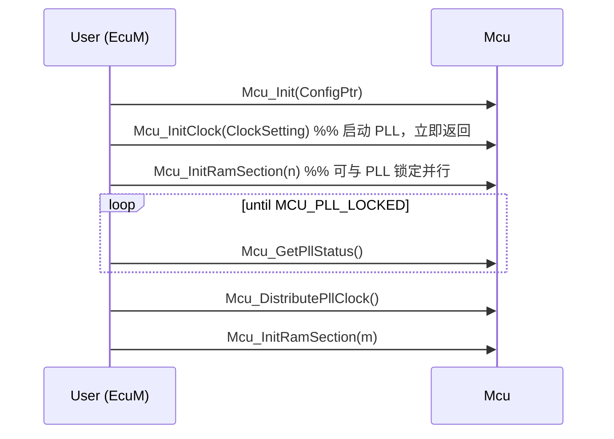
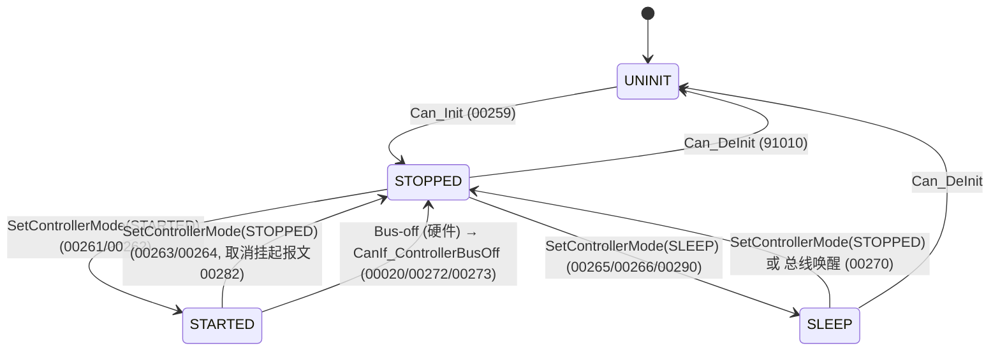
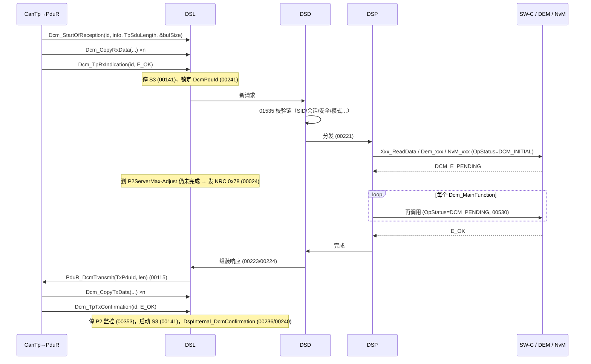

# 02 — AUTOSAR SWS 研究笔记（MCU / CAN / DCM / Diagnostics / IoHwAb）

> Phase 1 研究产物。目的：把仓库里的 5 份 AUTOSAR 规范转成 **Requirement → Architecture → Configuration → C API → Runtime behavior →（相关时）硬件概念** 的教学素材，供后续教程章节引用。
>
> - 来源：`artifacts/pdf-text/*.txt`（PDF 抽取文本，页标记 `=== PDF PAGE n ===`）。**本文所有 “p.N” 均为 PDF 物理页号**（与 PDF 页脚 “N of M” 一致），不是目录里的印刷页码。
> - 本文只做转述与归纳，不大段复制规范原文。SWS ID 后标注页码，便于回查。
> - 代码片段标签遵循 `claude_plan.md` §17：`[AUTOSAR API]` = 规范定义的签名；`[Conceptual]` = 概念示意；`[RH850 Hardware Specific]` = 与 RH850 硬件相关、需对照硬件手册确认的映射；本文不含 `[Educational Implementation]`。
> - “需在真实项目确认” = PDF 中找不到证据、或规范自身存在不一致，必须在真实项目的 SWS 版本 / 供应商 MCAL / 工具链中核实。

---

## 0. 文档身份与版本基线（先读这一节）

| 文件 | 平台 | Release | Document ID | Status | PDF 页数 | PDF 生成日期 |
|---|---|---|---|---|---|---|
| `AUTOSAR_CP_SWS_MCUDriver` | Classic | **R24-11** | 31 | published | 52 | 2024-11-24 |
| `AUTOSAR_SWS_CANDriver` | Classic | **R22-11** | 11 | published | 133 | 2022-11-12 |
| `AUTOSAR_SWS_DiagnosticCommunicationManager` | Classic | **R20-11** | 18 | published | 697 | 2020-11-26 |
| `AUTOSAR_SWS_Diagnostics` | **Adaptive** | **R22-11** | 723 | published | 595 | 2022-11-23 |
| `AUTOSAR_CP_SWS_IOHardwareAbstraction` | Classic | **R24-11** | 47 | published | 61 | 2024-11-24 |

证据：各 PDF p.1 的 “Document Identification No / Part of Standard Release / Part of AUTOSAR Standard”，以及 JSON 元数据 `keywords: Release Rxx-xx`。R19-11 之后 AUTOSAR 不再给单文档独立版本号（如 4.x.y），“版本”即 Release 名。

**三个必须让读者记住的基线事实：**

1. **五份规范不在同一个 Release。** MCU / IoHwAb = R24-11，CAN = R22-11，DCM = R20-11。教程里引用 API 时要写清楚“按哪个 Release”。真实项目里 MCAL 与 BSW 的 Release 也经常不一致（MCAL 由芯片厂交付，BSW 由栈供应商交付），这正是 DCM 升级要关心的问题。
2. **`AUTOSAR_SWS_Diagnostics.pdf` 不是 Classic 的“新版合并诊断规范”**，而是 **Adaptive Platform（AP）R22-11 的 Diagnostic Management（DM，`ara::diag`）规范**（p.1 “Part of AUTOSAR Standard: Adaptive Platform”；p.26 “AUTOSAR Adaptive Diagnostic Management (DM)”）。它对 Classic DCM/DEM 只能作“概念对照”，**不能**用来推断 CP DCM 的 API 或配置。详见 §4。
3. **仓库里没有 DEM、CanIf、PduR、CanTp、ComM、BswM、NvM、RTE 的 SWS。** 本文凡涉及这些模块的签名/行为，只记录 DCM/CAN 规范中“作为被调用方/调用方”出现的内容；完整签名需查对应 SWS（标注“需在真实项目确认”）。

---

## 1. MCU Driver（R24-11，Doc ID 31）

### 1.1 Requirement（规范要它做什么）

- 定位：提供 MCU 基础初始化、低功耗模式、复位、复位原因读取，以及其它 MCAL 模块需要的 MCU 相关功能；MCU 驱动**直接访问硬件，位于 MCAL**（p.9）。
- 功能清单（p.9）：时钟/PLL/预分频与时钟分配初始化；RAM 区初始化；µC 低功耗模式激活；µC 复位；读取复位原因。
- 关键需求：
  - `SWS_Mcu_00055`（p.16）：提供软件触发硬件复位的服务（注：只有“授权用户”才应调用）。
  - `SWS_Mcu_00052`（p.16）：硬件支持时，提供读取上次复位原因的服务。
  - `SWS_Mcu_00248`（p.16）：提供使能并设置 MCU 时钟（CPU 时钟、外设时钟、预分频、倍频）的服务；所有外设时钟通过 `McuClockReferencePoint` 发布给其它 BSW。
  - `SWS_Mcu_00164` / `SWS_Mcu_00165`（p.17）：提供激活低功耗模式的服务；模式数量与配置由芯片决定，放在配置集里。
- 限制（p.12）：低功耗模式不是强制标准化内容；**ECU/µC 电源的开关不是 MCU 驱动的职责**，由上层负责。

### 1.2 Architecture（位置与依赖）

- **Start-up code 在 MCU 驱动之前执行**（p.13–14）：设置中断/异常向量基址、中断栈与用户栈指针、上下文保存区、看门狗“先不喂/拉长超时”直到 WDG 驱动接管、Cache 使能、内存保护、外部存储初始化、**默认时钟（含全局预分频）**、SFR 写保护、一次性写寄存器、最少量 RAM 初始化。规范明确这部分是“指导性”，细节由 MCU 设计规格决定。
- **寄存器初始化归属规则**（`SWS_Mcu_00116/00244/00245/00246/00247`，p.25）——这是 MCAL 分工的核心规则，CAN 规范里有同样的一条（`SWS_Can_00407`，p.43）：
  1. 只被一个硬件模块使用的寄存器 → 由实现该功能的驱动初始化；
  2. 影响多个硬件模块的 **I/O 寄存器** → PORT 驱动；
  3. 影响多个硬件模块的 **非 I/O 寄存器** → MCU 驱动；
  4. 复位后必须立即写入的一次性寄存器 → start-up code；
  5. 其它 → start-up code。
- 依赖：必需接口只有 `Dem_SetEventStatus`（`SWS_Mcu_00166`，p.34，用于时钟失效扩展生产错误）；可选 `Det_ReportError`（`SWS_Mcu_00163`，p.34）。**无回调、无调度函数（无 MainFunction）、无 Service Interface**（p.34–35）。
- 被谁调用：典型由 EcuM（启动阶段）调用 Init/InitClock/DistributePllClock；`McuResetReason` 被 EcuM 的 `EcuMResetReason` 引用（`ECUC_Mcu_00186`，p.51）。CAN 规范要求 **Mcu 先于 Can 初始化**，共享寄存器由 Mcu 配置（`SWS_Can_00240`，p.22）。

### 1.3 Configuration（容器）

```
Mcu (ECUC_Mcu_00189, p.38)  — 支持 VARIANT-PRE-COMPILE / VARIANT-POST-BUILD
├── McuGeneralConfiguration (ECUC_Mcu_00118, p.39)        [1]
│     McuDevErrorDetect(00166) McuGetRamStateApi(00181) McuInitClock(00182)
│     McuNoPll(00180) McuPerformResetApi(00167) McuVersionInfoApi(00168)
│     McuEcucPartitionRef(00191, 0..*)                    — p.39–42
├── McuModuleConfiguration (ECUC_Mcu_00119, p.43)          [1]
│     McuClockSrcFailureNotification(00170) McuNumberOfMcuModes(00171)
│     McuRamSectors(00172) McuResetSetting(00173, 0..1)   — p.44–45
│     ├── McuClockSettingConfig (00124, p.42)  [1..*]
│     │     McuClockSettingId(00183, p.43) ← 作为 Mcu_InitClock() 的参数
│     │     └── McuClockReferencePoint (00174, p.49–50) [1..*]
│     │           McuClockReferencePointFrequency(00175, Hz, float)
│     ├── McuDemEventParameterRefs (00187, p.46) [0..1]
│     │     MCU_E_CLOCK_FAILURE(00188) → DemEventParameter
│     ├── McuModeSettingConf (00123, p.46–47) [1..*]
│     │     McuMode(00176) ← 作为 Mcu_SetMode() 的参数
│     └── McuRamSectorSettingConf (00120, p.47) [0..*]
│           McuRamDefaultValue(00177) McuRamSectionBaseAddress(00178)
│           McuRamSectionSize(00179) McuRamSectionWriteSize(00190)  — p.48–49
└── McuPublishedInformation (00184, p.50)
      └── McuResetReasonConf (00185, p.51) [1..*]
            McuResetReason(00186) ← 被 EcuM 引用
```

要点：
- `McuInitClock = FALSE`：用于“有 bootloader 且时钟寄存器只能写一次”的场景，此时 MCU 驱动不做时钟初始化（`ECUC_Mcu_00182`，p.40；`SWS_Mcu_00210`，p.27）。
- `McuNoPll = TRUE`：硬件无 PLL 或上电自动启用 PLL；此时禁用 `Mcu_DistributePllClock`，`Mcu_GetPllStatus` 恒返回 `MCU_PLL_STATUS_UNDEFINED`（`ECUC_Mcu_00180`，p.41；`SWS_Mcu_00205`，p.28；`SWS_Mcu_00206`，p.29）。
- `SWS_Mcu_00126`（p.38）：即使 PRE-COMPILE 变体，Init 也必须带指针参数，传 `NULL`。
- `SWS_Mcu_00259`（p.38）：实现不支持的分区映射必须在配置阶段被拒绝。

### 1.4 C API

[AUTOSAR API]（R24-11，均 `Mcu.h`）

| API | 签名 | SID | Sync | Reentrancy | 定义 |
|---|---|---|---|---|---|
| `Mcu_Init` | `void Mcu_Init(const Mcu_ConfigType* ConfigPtr)` | 0x00 | Sync | Non | `SWS_Mcu_00153` p.24 |
| `Mcu_InitRamSection` | `Std_ReturnType Mcu_InitRamSection(Mcu_RamSectionType RamSection)` | 0x01 | Sync | Non | `SWS_Mcu_00154` p.26 |
| `Mcu_InitClock` | `Std_ReturnType Mcu_InitClock(Mcu_ClockType ClockSetting)` | 0x02 | Sync | Non | `SWS_Mcu_00155` p.26–27 |
| `Mcu_DistributePllClock` | `Std_ReturnType Mcu_DistributePllClock(void)` | 0x03 | Sync | Non | `SWS_Mcu_00156` p.27–28 |
| `Mcu_GetPllStatus` | `Mcu_PllStatusType Mcu_GetPllStatus(void)` | 0x04 | Sync | **Reentrant** | `SWS_Mcu_00157` p.28–29 |
| `Mcu_GetResetReason` | `Mcu_ResetType Mcu_GetResetReason(void)` | 0x05 | Sync | Reentrant | `SWS_Mcu_00158` p.29 |
| `Mcu_GetResetRawValue` | `Mcu_RawResetType Mcu_GetResetRawValue(void)` | 0x06 | Sync | Reentrant | `SWS_Mcu_00159` p.30 |
| `Mcu_PerformReset` | `void Mcu_PerformReset(void)` | 0x07 | Sync | Non | `SWS_Mcu_00160` p.31 |
| `Mcu_SetMode` | `void Mcu_SetMode(Mcu_ModeType McuMode)` | 0x08 | Sync | **Reentrant** | `SWS_Mcu_00161` p.31–32 |
| `Mcu_GetVersionInfo` | `void Mcu_GetVersionInfo(Std_VersionInfoType* versioninfo)` | 0x09 | Sync | Reentrant | `SWS_Mcu_00162` p.32 |
| `Mcu_GetRamState` | `Mcu_RamStateType Mcu_GetRamState(void)` | 0x0a | Sync | Reentrant | `SWS_Mcu_00207` p.33 |

类型（p.20–24）：`Mcu_ConfigType`（硬件相关结构，00249）；`Mcu_PllStatusType` = `MCU_PLL_LOCKED 0x00 / MCU_PLL_UNLOCKED 0x01 / MCU_PLL_STATUS_UNDEFINED 0x02`（00250/00231）；`Mcu_ClockType`、`Mcu_ModeType`、`Mcu_RamSectionType` 均为 0..N-1 的配置索引（uint8/16/32 按平台选，00233/00238/00240）；`Mcu_ResetType` = `MCU_POWER_ON_RESET 0x00 / MCU_WATCHDOG_RESET 0x01 / MCU_SW_RESET 0x02 / MCU_RESET_UNDEFINED 0x03`，至少须提供 POWER_ON 与 UNDEFINED，可按芯片扩展（00252/00134，p.22）；`Mcu_RawResetType` = 复位状态寄存器原值（00253）；`Mcu_RamStateType` = `MCU_RAMSTATE_INVALID 0x00 / VALID 0x01`（00256）。

### 1.5 Runtime behavior（逐 API 的关键 SWS）

| API | 关键需求（页） | 教学解读 |
|---|---|---|
| `Mcu_Init` | `00026`（p.25）：使掉电/时钟/RAM 配置在模块内“可见”。 | Init 本身**不一定**改时钟；它主要是“装载配置”。真正的 PLL 启动在 InitClock。 |
| `Mcu_InitRamSection` | `00011`（p.26）：从 `BaseAddress` 到 `BaseAddress+Size-1` 用 `DefaultValue` 填充，每次写 `WriteSize` 字节；`00136`：必须在 Init 之后调用。 | 典型用于 ECC RAM 初始化或“非复位保持区”的清零。`WriteSize`（4.3.1 引入，p.2）照顾 ECC 要求按 32/64bit 对齐写。 |
| `Mcu_InitClock` | `00137`（p.27）：初始化 PLL 和其它时钟选项；`00138`：**启动 PLL 锁定过程后立即返回，不等待锁定**；`00139`：Init 之后才能调用；`00210`：受 `McuInitClock` 开关控制。 | “异步启动 + 轮询”的设计：避免 MCAL 在启动路径里做无界等待。 |
| `Mcu_GetPllStatus` | `00008`/`00132`/`00206`（p.29）：返回锁定状态；Init 前或 `McuNoPll=TRUE` 时返回 `UNDEFINED`。 | 上层（EcuM）负责轮询直到 LOCKED。 |
| `Mcu_DistributePllClock` | `00140/00141`（p.28）：把 PLL 时钟切入时钟分配并移除当前源（如内部振荡器）；`00056`：硬件已自动切换则不动硬件；`00142`：**PLL 未锁定时立即返回 E_NOT_OK**；DET：`00122`（p.35）报 `MCU_E_PLL_NOT_LOCKED`。 | 规范把“锁定”与“切换”拆成两步，是为了让系统在未锁定时仍运行在安全时钟上。 |
| `Mcu_GetResetReason` | `00005`（p.29）：读取硬件复位原因；硬件不支持时恒返回 `MCU_POWER_ON_RESET`；`00133`（p.30）：Init 前返回 `MCU_RESET_UNDEFINED`；多次调用返回值应相同；用户应读后清除。 | 注意“谁来清复位标志”在规范里是对**用户**的提醒，不是驱动需求——真实项目要确认 MCAL 是否在 Init 中清除。 |
| `Mcu_GetResetRawValue` | `00006`（p.30）：返回原始寄存器值；无寄存器时返回 0x0；`00135`：Init 前返回一个“非 0 且不是合法寄存器值”的实现定义值。 | 原值用于 OEM 特有复位原因（看门狗类型、锁步错误等）。 |
| `Mcu_PerformReset` | `00143/00144`（p.31）：用硬件功能执行复位，复位类型由配置（`McuResetSetting`）决定；`00145`：Init 后才能调用；`00146`：受 `McuPerformResetApi` 开关控制。 | 与 DCM 0x11 的关系见 §3.8.2：DCM 不直接调 Mcu，而是经 Mode 切换交给 BswM 执行（[Conceptual] 链路）。 |
| `Mcu_SetMode` | `00147`（p.32）：设置电源模式；CPU 掉电模式下**唤醒后才返回**；`00148`：Init 后调用；Note：调用方须预先关中断，实现须保证不丢失唤醒中断。 | 4.3.1 把它改为 Reentrant（p.2）。 |
| `Mcu_GetRamState` | `00208/00209`（p.33）：Init 后调用；受 `McuGetRamStateApi` 控制。 | — |

[Conceptual] 规范示例启动序列（p.36，顺序仅为示例）：



### 1.6 错误分类

- 开发错误（DET，`SWS_Mcu_00012`，p.18）：`MCU_E_PARAM_CONFIG 0x0A`、`MCU_E_PARAM_CLOCK 0x0B`、`MCU_E_PARAM_MODE 0x0C`、`MCU_E_PARAM_RAMSECTION 0x0D`、`MCU_E_PLL_NOT_LOCKED 0x0E`、`MCU_E_UNINIT 0x0F`、`MCU_E_PARAM_POINTER 0x10`、`MCU_E_INIT_FAILED 0x11`。
- 参数检查（p.35）：`00017`（DET 使能时检查并对有返回值的 API 返回 E_NOT_OK）、`00019` ClockSetting 越界→`PARAM_CLOCK`、`00020` McuMode 越界→`PARAM_MODE`、`00021` RamSection 越界→`PARAM_RAMSECTION`、`00122` 未锁定调 DistributePllClock→`PLL_NOT_LOCKED`、`00125` 除 GetVersionInfo 外 Init 前调用→`MCU_E_UNINIT`。
- **运行时错误：无；生产错误：无**（p.18）。
- 扩展生产错误：`MCU_E_CLOCK_FAILURE`（值由 DEM 分配），`SWS_Mcu_00053`（p.18）在配置使能时上报；Fail/Pass 判据 `00257/00258`（p.19）；若时钟失效由 trap 等其它硬件机制检测，应关闭该通知、在 MCU 驱动外处理。`SWS_Mcu_00226`（p.17）：生产错误不得作为函数返回值。
- 小观察：表中 `MCU_E_UNINIT` 等的 “Type of error” 一栏统一写成 “API service called with wrong parameter”，属文字瑕疵，不影响语义。

### 1.7 硬件概念（RH850）

[RH850 Hardware Specific] 以下仅为“概念对应”，寄存器细节以硬件研究笔记/硬件手册为准：
- 复位原因：RH850/P1x 硬件手册（`REN_r01uh0436ej0140`）§8.3.2 **RESF（Reset Source Determination Register）**，p.417（PDF 页）；清除寄存器 RESFC。→ 对应 `Mcu_GetResetRawValue`（原值）与 `Mcu_GetResetReason`（映射为 `Mcu_ResetType`）。哪些位映射为 WATCHDOG/SW/POWER_ON 需看供应商 MCAL。
- 时钟选择：同手册 §12.4.3.1 `CKSCnCTL`（p.461）等时钟选择寄存器 → 对应 `McuClockSettingConfig` 的实现内容。PLL 锁定状态寄存器名称本次未检索到，需查硬件笔记。
- 保护寄存器写序列、一次性写寄存器 → 规范归入 start-up code（p.14、`SWS_Mcu_00246`）。

### 1.8 Change History 中与教学/升级相关的条目（MCU）

- R24-11 删除 `SWS_Mcu_CONSTR_00001`；R21-11 删除 `SWS_Mcu_00131/00054/00035/00030/00031`（p.1）。
- R20-11 “Enum and Error related modifications”；R19-11 去掉多核相关条目的 DRAFT 状态（p.1）。
- 4.4.0 引入多核分布支持；4.3.1 新增 `McuRamSectionWriteSize`、`Mcu_SetMode` 改为 Reentrant；4.2.1 删除 NULL 指针检查需求（因与 BSW General 重复）；4.1.1 **改变了 `Mcu_DistributePllClock` 的签名**，并规定 `Mcu_SetMode` 调用前须关中断（p.2–3）。旧签名内容 PDF 未给出 → 需在真实项目确认。

---

## 2. CAN Driver（R22-11，Doc ID 11）

### 2.1 Requirement 与定位

- p.14：Can 模块“属于最底层，执行硬件访问，并向上层提供与硬件无关的 API”；**唯一能访问 Can 的上层是 CanIf**（SRS_SPAL_12092）。Can 提供发送服务，并通过回调 CanIf 通知事件；控制同一 CAN Hardware Unit 内各控制器的状态。
- 一个 Can 模块 = 一个 CAN Hardware Unit（可含多个同类型控制器）（p.15、p.33 §7.1）；不同类型硬件单元要实现不同 Can 模块（`SWS_Can_00077`，p.33），多个模块共存时需带 VendorId/驱动缩写的命名（`00284/00385/00386`，p.33–34）。
- 不支持远程帧：`SWS_Can_00237`（不响应 RTR）、`00236`（硬件配置为忽略 RTR）（p.21）。

### 2.2 为什么 Can 是 MCAL，而 CanIf 不是（引规范文字）

1. **硬件访问 vs 硬件无关**：p.14 “The Can module is part of the lowest layer, performs the hardware access and offers a hardware independent API to the upper layer.” —— 访问寄存器是 MCAL 的定义特征。
2. **片上控制器不得使用其它驱动**：`SWS_Can_00238`（p.22）“If the CAN controller is on-chip, the Can module shall not use any service of other drivers.” 只有片外控制器才用 SPI 等（`00242`）。
3. **反证（最有说服力的一条）**：p.22 脚注 3 —— 使用片外 CAN 控制器时，“the CAN driver is not any more part of the µC abstraction layer but put part of the ECU abstraction layer”。即：**层次归属取决于“是否直接访问 µC 片上外设”，而不是模块名字**。
4. **Can 只认 CanIf**：`SWS_Can_00058`（p.23）—— 驱动不关心请求的真实来源或通知的最终去向，只把 CanIf 当作来源和目的地；`8.6.3`（p.89）“The Can module always reports to CanIf module”。
5. CanIf 的职责（多 Can 驱动的统一接口、L-PDU 句柄、软件过滤、Tx 缓冲等）由 CanIf SWS 定义（p.14 引用 [5]，p.45 “The CanIf module provides the HTH as parameter”，p.51 “In case of CAN_BUSY the CanIf module queues that request”）。**仓库中没有 CanIf SWS**，“CanIf 属于 ECU Abstraction Layer”这一结论在本仓库只能间接佐证 → 需用 CanIf SWS / Layered Software Architecture 文档确认。

### 2.3 术语：HOH / HRH / HTH / Hardware Object（p.15、p.45）

| 术语 | 规范含义 | 教学解读 |
|---|---|---|
| Hardware Object | CAN Hardware Unit 的 CAN RAM 中的一个 L-PDU 缓冲（message buffer / mailbox） | 物理存在的“邮箱/缓冲区” |
| HOH | Hardware Object Handle（HRH 或 HTH 的统称） | 配置里 `CanHardwareObject` 的一项 |
| HRH | 由 Can 驱动定义；通常 1 个 HRH 对应 1 个硬件对象；可用于优化软件过滤 | CanIf 用 Hoh 判断“这帧来自哪组邮箱” |
| HTH | 由 Can 驱动定义；可对应 1 个或多个（作为发送缓冲池）的硬件对象 | `Can_Write(Hth, ...)` 的第一个参数 |
| L-PDU Handle | **定义在 CanIf 层**，每个代表一个 L-PDU | `Can_PduType.swPduHandle`，Can 只负责保存并在 TxConfirmation 时回传（`SWS_Can_00276`，p.45） |

- HRH 与 HTH **共用一个连续 ID 空间**（`CanObjectId`，`ECUC_Can_00326`，p.125：从 0 开始无空洞，例 HRH0-0, HRH1-1, HTH0-2, HTH1-3）。
- `CanHandleType`（`ECUC_Can_00323`，p.123）：`FULL` = 硬件对象只处理一个 L-PDU（一个 ID）；`BASIC` = 硬件对象处理多个 L-PDU。
- `CanHwObjectCount`（`ECUC_Can_00467`，p.124）：一个 HOH 由几个硬件对象实现——对 HRH 是 FIFO 深度或影子缓冲数；对 HTH 是多路复用发送的对象数或 FullCAN HTH 的硬件 FIFO。
- 优先级反转（p.16–17）：单发送缓冲会产生 inner priority inversion；帧间隙过长会产生 outer priority inversion。对策：可配置 Multiplexed Transmission（`SWS_Can_00277/00401/00402/00403`，p.45–46），或把 HTH 全配成 FullCAN。

### 2.4 Configuration（核心容器）

```
Can
├── CanGeneral (p.98–106)
│     CanDevErrorDetect, CanMultiplexedTransmission(p.103), CanSetBaudrateApi(p.103),
│     CanTimeoutDuration(p.104), CanMainFunction{Busoff|Mode|Wakeup}Period(p.101–102),
│     CanOsCounterRef(p.105), CanLPduReceiveCalloutFunction(p.100), CanGlobalTimeSupport,
│     CanEnableSecurityEventReporting(p.99), CanIndex(p.100), CanEcucPartitionRef
│     └── CanMainFunctionRWPeriods (ECUC_Can_00437, p.131) [0..*]
└── CanConfigSet (ECUC_Can_00343, p.131)
      ├── CanController (ECUC_Can_00354, p.107) [1..*]
      │     CanBusoffProcessing(00314: INTERRUPT|POLLING, p.107)
      │     CanRxProcessing(00317: INTERRUPT|MIXED|POLLING, p.109)
      │     CanTxProcessing(00318: INTERRUPT|MIXED|POLLING, p.110)
      │     CanWakeupProcessing(00319, p.110), CanWakeupSupport, CanWakeupSourceRef(p.113)
      │     CanControllerActivation(00315), CanControllerBaseAddress(00382), CanControllerId(00316)
      │     CanControllerDefaultBaudrate(p.111), CanCpuClockRef(p.112) → McuClockReferencePoint
      │     ├── CanControllerBaudrateConfig (p.114–117): BaudRate, ConfigID, PropSeg, Seg1, Seg2, SJW
      │     └── CanControllerFdBaudrateConfig (p.118–121): FdBaudRate, TxBitRateSwitch …
      └── CanHardwareObject (ECUC_Can_00324, p.122) [0..*]
            CanHandleType(00323 FULL|BASIC), CanObjectType(00327 RECEIVE|TRANSMIT),
            CanIdType(00065 STANDARD|EXTENDED|MIXED), CanObjectId(00326),
            CanHwObjectCount(00467), CanHardwareObjectUsesPolling(00490),
            CanControllerRef(00322), CanMainFunctionRWPeriodRef(00438),
            CanTriggerTransmitEnable(00486), CanFdPaddingValue(00485), CanObjectPayloadLength(00495)
            └── CanHwFilter (00468, p.129) [0..*, 仅 HRH]: CanHwFilterCode(00469), CanHwFilterMask(00470)
```

`CanCpuClockRef` 引用 MCU 的 `McuClockReferencePoint` —— 这是“MCU 配置 → CAN 波特率计算”的配置链路，教学时值得画出来。

### 2.5 中断 vs 轮询

- 所有需要的中断由 Can 模块实现 ISR（`SWS_Can_00033`，p.33）；未用的中断要关闭（`00419`）；ISR 末尾清中断标志（`00420`）；驱动不设置中断向量优先级（p.33 实现提示）。
- 事件可由中断或轮询检测，哪些可/必须轮询由硬件决定（`SWS_Can_00099`，p.50）；必须能配置成**完全不用中断**（`SWS_Can_00007`，p.50）。
- 轮询发生在 `Can_MainFunction_xxx` 中，回调上下文变为主函数而非 ISR，但**回调实现必须按“可能在 ISR 中被调用”来写**（p.51）。
- `CanRxProcessing/CanTxProcessing = MIXED` 时，只轮询 `CanHardwareObjectUsesPolling=TRUE` 的硬件对象（`SWS_Can_00031` p.85、`SWS_Can_00108` p.86）。
- 多周期：配置多个 `CanMainFunctionRWPeriods` 时，主函数名变为 `Can_MainFunction_Write_<ShortName>()` / `Can_MainFunction_Read_<ShortName>()`（`00441` p.85、`00442` p.86）。

### 2.6 C API

[AUTOSAR API]（R22-11）

| API | 签名 | SID | Sync | Reentrancy | 定义 |
|---|---|---|---|---|---|
| `Can_Init` | `void Can_Init(const Can_ConfigType* Config)` | 0x00 | Sync | Non | `SWS_Can_00223` p.62–63 |
| `Can_GetVersionInfo` | `void Can_GetVersionInfo(Std_VersionInfoType* versioninfo)` | 0x07 | Sync | Re | `00224` p.63 |
| `Can_DeInit` | `void Can_DeInit(void)` | 0x10 | Sync | Non | `91002` p.64 |
| `Can_SetBaudrate` | `Std_ReturnType Can_SetBaudrate(uint8 Controller, uint16 BaudRateConfigID)` | 0x0f | Sync | 同控制器不可重入 | `SWS_CAN_00491` p.65 |
| `Can_SetControllerMode` | `Std_ReturnType Can_SetControllerMode(uint8 Controller, Can_ControllerStateType Transition)` | 0x03 | **Async** | Non | `00230` p.66–67 |
| `Can_DisableControllerInterrupts` | `void Can_DisableControllerInterrupts(uint8 Controller)` | 0x04 | Sync | Re | `00231` p.68 |
| `Can_EnableControllerInterrupts` | `void Can_EnableControllerInterrupts(uint8 Controller)` | 0x05 | Sync | Re | `00232` p.69 |
| `Can_CheckWakeup` | `Std_ReturnType Can_CheckWakeup(uint8 Controller)` | 0x0b | Sync | Non | `00360` p.70 |
| `Can_GetControllerErrorState` | `Std_ReturnType Can_GetControllerErrorState(uint8 ControllerId, Can_ErrorStateType* ErrorStatePtr)` | 0x11 | Sync | 同 ID 不可重入 | `91004` p.71 |
| `Can_GetControllerMode` | `Std_ReturnType Can_GetControllerMode(uint8 Controller, Can_ControllerStateType* ControllerModePtr)` | 0x12 | Sync | Non | `91014` p.72 |
| `Can_GetControllerRxErrorCounter` / `Tx…` | `(uint8 ControllerId, uint8* Rx/TxErrorCounterPtr)` | 0x30 / 0x31 | Sync | 同 ID 不可重入 | `00511` p.73 / `00516` p.74 |
| `Can_GetCurrentTime` 等 4 个时间戳 API | — | 0x32–0x35 | — | — | `91025–91028`，**DRAFT**，p.75–80 |
| `Can_Write` | `Std_ReturnType Can_Write(Can_HwHandleType Hth, const Can_PduType* PduInfo)` | 0x06 | Sync | **Reentrant (thread-safe)** | `00233` p.80–81 |
| `Can_MainFunction_Write` | `void (void)` | 0x01 | — | — | `00225` p.84–85 |
| `Can_MainFunction_Read` | `void (void)` | 0x08 | — | — | `00226` p.85 |
| `Can_MainFunction_BusOff` | `void (void)` | 0x09 | — | — | `00227` p.86 |
| `Can_MainFunction_Wakeup` | `void (void)` | 0x0a | — | — | `00228` p.87 |
| `Can_MainFunction_Mode` | `void (void)` | 0x0c | — | — | `00368` p.87 |
| `<LPDU_CalloutName>` | `boolean (uint8 Hrh, Can_IdType CanId, uint8 CanDataLegth, const uint8* CanSduPtr)` | 0x20 | — | Non | `00443` p.83 |

主函数由 BSW Scheduler 调用，无参无返回、不可重入，执行顺序无要求（p.84、`SWS_Can_00110`）；无轮询时可实现为空宏（`00178/00180/00183/00185`）。

**类型（`Can_GeneralTypes.h`，供 Can/CanIf/CanTrcv 共享，`SWS_Can_00436` p.24）：**
- `Can_PduType`（`00415`，p.57–58）：`swPduHandle (PduIdType)`、`length (uint8)`、`id (Can_IdType)`、`sdu (uint8*)`。
- `Can_IdType`（`00416`，p.58）：`uint32`，**最高两位编码帧类型**：00 标准 CAN、01 标准 ID CAN FD、10 扩展 CAN、11 扩展 ID CAN FD。接收时 Can 须把扩展帧 MSB 置 1（`SWS_Can_00423`，p.48）。
- `Can_HwHandleType`（`00429`，p.58–59）：uint8（≤0xFF）或 uint16（扩展范围）。
- `Can_HwType`（`SWS_CAN_00496`，p.59）：`CanId`、`Hoh`、`ControllerId`（CanIf 抽象控制器 ID）——用于 `CanIf_RxIndication` 的 Mailbox 参数。
- `CAN_BUSY = 0x02`：作为 `Std_ReturnType` 的扩展，仅用于 `Can_Write`（`SWS_Can_00039`，p.59–60）。
- `Can_ControllerStateType`（`91013`，p.60）：`CAN_CS_UNINIT 0x00 / STARTED 0x01 / STOPPED 0x02 / SLEEP 0x03`。
- `Can_ErrorStateType`（`91003`，p.60）：ACTIVE / PASSIVE / BUSOFF。
- `Can_ErrorType`（`91021`，p.61）：0x01–0x0B（位错误、ACK、仲裁丢失、过载、格式、填充、CRC、总线锁死）。

### 2.7 Runtime behavior

#### 2.7.1 驱动状态机与控制器状态机

- 驱动级：`CAN_UNINIT` ⇄ `CAN_READY`（`SWS_Can_00103` p.34、`00246` p.35、`91009` p.35）。
- 控制器级（p.36–43）：



[Conceptual] 要点：
- **Can 模块不记忆状态**，只做寄存器设置；软件状态在 CanIf 的回调里改变（p.36）。状态切换成功后由 Can 通知 `CanIf_ControllerModeIndication`；“是否到达请求状态”的监控属于上层（p.37、p.39）。
- `Can_SetControllerMode` 是 **Asynchronous**：在 `CanTimeoutDuration` 内用 OS 计数器 `GetCounterValue` 有限等待（`00398` p.39、`00281` p.23）；超时仍未生效则返回，由 `Can_MainFunction_Mode` 继续轮询状态寄存器并在生效后调用 `CanIf_ControllerModeIndication`（`00370` p.39、`00372/00373` p.40）。
- `CAN_CS_STARTED` 每次都用上次 Init/SetBaudrate 的配置重新初始化控制器（`00384`，p.67）；**控制器真正可用前提交的发送会丢失**，唯一可用性指标是收到 TxConfirmation/RxIndication（p.40）。
- 无硬件睡眠时，SLEEP 是“逻辑睡眠”，硬件保持 STOPPED（`00258/00404` p.37、`00290/00405` p.41）。
- 非法转换：DET 使能时报 `CAN_E_TRANSITION` 并返回 E_NOT_OK（`00200` p.68、`00409` p.40、`00411` p.41）；**生产代码中非法转换行为未定义**（p.37）。
- 中断开关与模式切换的交互：SetControllerMode 开启新状态需要的中断、关闭不允许的中断，但若之前被 `Can_DisableControllerInterrupts` 关闭则不执行（`00196/00425/00197/00426`，p.67）。Disable/Enable 需配对计数（`00202` p.68、`00204` p.69、`00208` p.70）。

#### 2.7.2 发送（Can_Write）

- `00212`（p.81）：HTH 空闲 → 置该 HTH 互斥 → 转换格式并写入硬件缓冲 → 触发发送 → 释放互斥 → E_OK。
- `00213`（p.81）：硬件对象正被其它 L-PDU 占用 → **不取消正在发送的帧**、不做任何动作、返回 `CAN_BUSY`。
- `00214`（p.81）：同一 HTH 的抢占式重入调用无法处理 → `CAN_BUSY`。（p.51：CanIf_Transmit 可重入，所以 Can_Write 必须线程安全；不同 HTH 可并行，同一 HTH 不可。）
- **`CAN_BUSY` 的语义**：不是错误，而是“暂无可用发送对象/并发冲突”，**CanIf 收到后负责排队**（p.51、p.54 §7.11.6）。
- `00275`（p.82）：非阻塞。`00011`（p.47）：数据在 Can_Write 内直接拷贝，调用方只需在函数返回前保持缓冲一致。
- 长度检查 `00218`（p.82）：>64 字节；或 >8 字节但控制器不在 FD 模式；或 FD 模式但 ID 未置 FD 位 → E_NOT_OK（+DET `CAN_E_PARAM_DATA_LENGTH`）。DLC 不对齐时用 `CanFdPaddingValue` 填充到下一个合法 DLC（`00502`，p.83）。
- Trigger Transmit：`sdu==NULL` 且 `CanTriggerTransmitEnable=TRUE` 时，Can 调 `CanIf_TriggerTransmit` 取数据（`00503/00504` p.82、`00506` p.83）。
- 确认：`CanIf_TxConfirmation` 在 Tx ISR 或 `Can_MainFunction_Write`（轮询）中调用（`SWS_Can_00016`，p.45）；Can 保存 `swPduHandle` 直到确认时回传（`00276`，p.45）。

#### 2.7.3 取消（Cancellation）

- **R22-11 的 Can 驱动没有发送取消 API**（无 `Can_AbortTransmit`）。Change History 4.2.1 明确 “Removed CanIf_CancelTxConfirmation”（p.4）；2.0 曾包含 “TX cancellation”（p.9）。
- 规范中仅剩的“取消”是**驱动内部行为**：`Can_SetControllerMode(CAN_CS_STOPPED)` 须取消挂起报文（`00282`，p.41）；Bus-off 后须取消仍挂起的报文（`00273`，p.42）；以及 `Can_Write` 遇忙**不得**取消正在发送的帧（`00213`）。
- 因此教学上：硬件级“取消+重排优先级”（软件模拟优先级）不应期待 Can 驱动提供；规范甚至建议避免软件模拟优先级（p.46 Note）。真实 MCAL 是否保留供应商扩展 → 需在真实项目确认。

#### 2.7.4 接收

- `SWS_Can_00279`（p.48）：调用 `CanIf_RxIndication`，参数为 Mailbox（ID、Hoh、CanIf 抽象 ControllerId）与 PduInfoPtr（长度、L-SDU 指针）；在 Rx ISR 或 `Can_MainFunction_Read` 中调用（`00396`，p.48）。
- 字节序：先收到的字节是数组元素 0（`00060`，p.48；发送侧 `00059`，p.44）；硬件布局不同则提供适配缓冲（`00427`）。
- 一致性：硬件 FIFO 或影子缓冲（`00489/00490`，p.48–49）；无法锁定缓冲或不可全局访问时拷入影子缓冲（`00299/00300`，p.49）；ISR 与 `Can_MainFunction_Read` 不能被自身打断（`00012`，p.49）；overwrite/overrun → 运行时错误 `CAN_E_DATALOST`（`00395`，p.49）。
- L-PDU callout 返回 false 则丢弃（`00444`，p.84）。

#### 2.7.5 Bus-off

- 硬件进入 bus-off → 控制器转 STOPPED、确保不再参与总线（`00272`）、取消挂起报文（`00273`）、在 STOPPED 后通知 `CanIf_ControllerBusOff`（`SWS_Can_00020`，p.42）。
- **`SWS_Can_00274`（p.43）：必须禁用或屏蔽自动 bus-off 恢复。** 恢复策略（何时重新 STARTED）由上层（CanIf/CanSM）决定。
- 检测方式：中断或 `Can_MainFunction_BusOff` 轮询（`CanBusoffProcessing`，p.107；`00109`，p.86）。
- 安全事件：`CanEnableSecurityEventReporting=TRUE` 时，错误类型 0x1–0xB 报 `CanIf_ErrorNotification`、进入 error passive 报 `CanIf_ControllerErrorStatePassive`（`91022/91023/91024`，p.55）。

#### 2.7.6 唤醒

- 总线唤醒 → 控制器转 STOPPED（`00270`），在 ISR 或 `Can_MainFunction_Wakeup` 中调 `EcuM_CheckWakeup`（`00271/00364`，p.42/p.50）；引起唤醒的帧不再处理（`00269`）；睡眠过渡中被唤醒则 `SetControllerMode(STOPPED)` 返回 E_NOT_OK（`00048`，p.42）。
- `Can_CheckWakeup` 检测到唤醒后报 `EcuM_SetWakeupEvent`（`00361`，p.71）。唤醒确认由 EcuM 与 CanIf 完成（p.50）。

### 2.8 回调与依赖

- 必需（`SWS_Can_00234`，p.88）：`CanIf_ControllerBusOff`、`CanIf_ControllerModeIndication`、`CanIf_RxIndication`、`CanIf_TxConfirmation`（均在 `CanIf_Can.h`）、`Det_ReportRuntimeError`、`GetCounterValue`（Os）。
- 可选（`SWS_Can_00235`，p.88–89）：`CanIf_ControllerErrorStatePassive`、`CanIf_ErrorNotification`、`CanIf_TriggerTransmit`、`Det_ReportError`、`EcuM_CheckWakeup`、`EcuM_SetWakeupEvent`、`Icu_Enable/DisableNotification`（片外控制器唤醒，`00445–00447` p.84）。
- **回调的完整签名在 CanIf SWS，不在本 PDF**（p.90 “For sequence diagrams see the CanIf module Specification”）→ 需在真实项目确认。

### 2.9 错误分类

- 开发错误（`SWS_Can_91019`，p.52–53）：`CAN_E_PARAM_POINTER 0x01`、`PARAM_HANDLE 0x02`、`PARAM_DATA_LENGTH 0x03`、`PARAM_CONTROLLER 0x04`、`UNINIT 0x05`、`TRANSITION 0x06`、`PARAM_BAUDRATE 0x07`、`INIT_FAILED 0x09`、`PARAM_LPDU 0x0A`（注意 0x08 空缺）。
- 运行时错误（`91020`，p.53）：`CAN_E_DATALOST 0x01`。
- 无 transient/production/extended production 错误（p.53）。
- DET 返回后函数立即返回（`00091`）；仅在 DET 开启且有返回值时以 E_NOT_OK 体现（`00089`）。

### 2.10 硬件概念（RH850 RS-CAN）

[RH850 Hardware Specific] 概念对应（寄存器细节以硬件研究笔记为准）：
- RH850/P1x 手册 Section 17 “CAN Interface (RS-CAN)”（p.772 起）。接收规则表（`RSCAN0GAFLIDj/GAFLMj/GAFLP0j/GAFLP1j`，p.776–783）≈ 规范的 HRH + `CanHwFilterCode/Mask`；发送缓冲 / 收发 FIFO ≈ HTH / HRH 的 `CanHwObjectCount`。
- `RSCAN0CmCTR.BOM[1:0]`（Bus Off Recovery Mode，p.800–802）：可选择“进入 bus-off 即转 channel halt”等模式。**`SWS_Can_00274` 禁止自动恢复**，因此 MCAL 预期会选择非自动恢复的 BOM 设置——具体取值需看供应商 MCAL 实现，需在真实项目确认。
- 规范的 STOPPED/STARTED ≈ RS-CAN 的 channel halt/reset 与 communication 模式（p.36 “For many controllers entering an ‘initialization’-mode causes the controller to be stopped”）。精确映射待硬件研究确认。

### 2.11 Change History（CAN，与升级相关）

- R22-11：加入 CAN XL 需求（p.1；CAN XL 作为单独扩展驱动，p.54–55）。
- R21-11：加入时间戳需求；删除 `SWS_Can_00485`、`ECUC_Can_00466`；`CanIndex` 作用域改为 ECU 全局（p.1）。
- R20-11：**移除 Pretended Networking**；新增 `CanObjectPayloadLength`、错误类型上报（`SWS_Can_91021`）与 `CanEnableSecurityEventReporting`（p.1）。
- 4.3.0：**新增 `Can_GetControllerErrorState`、`Can_DeInit`、`Can_GetControllerMode`、`Can_ControllerStateType`、`Can_ErrorStateType`**；**移除 `Can_StateTransitionType`**、`Can_ChangeBaudrate` 支持（p.3）。→ 旧版 `Can_SetControllerMode` 的参数类型不同（旧枚举值名 PDF 未列出，需确认）。
- 4.2.1：完整 CAN FD（含 Trigger Transmit）；**移除 `CanIf_CancelTxConfirmation`**（p.4）。
- 4.1.1：`Can_ChangeBaudrate` / `Can_CheckBaudrate` 废弃，由 `Can_SetBaudrate` 取代（p.5）。
- 2.1.15：`Can_SetControllerMode` 去掉返回值 `CAN_WAKEUP`，改为 `CAN_NOT_OK`（p.9）——说明早期存在 `Can_ReturnType`；R22-11 中 `Can_Write` 表格仍残留 “(see Can_ReturnType)” 字样（p.81），而类型已是 `Std_ReturnType + CAN_BUSY`（p.59）。

---

## 3. DCM — Diagnostic Communication Manager（CP R20-11，Doc ID 18）

### 3.1 Scope 与架构位置

- 提供诊断服务的通用 API，管理诊断数据流与诊断状态（尤其是会话与安全状态），检查请求是否支持、是否允许在当前状态执行；覆盖 OSI 5–7 层（p.22）。
- 位于 **Service Layer 的 Communication Services**（p.23）；**网络无关**：网络细节由 PduR 以下处理，DCM 只与 PduR 交互（p.23）。
- 依赖（p.30–31）：DEM（故障存储读取）、PduR（收发）、ComM（Full/Silent/No Com、active/inactive diagnostic）、SW-C/RTE（数据、例程、IO 控制、安全算法）、BswM（应用更新通知、通信模式变化、复位/会话模式）、Csm、KeyM（0x29 认证）、NvM、IoHwAb（ECU signal）。
- 限制（p.27–29，摘要）：不支持多通道；一 ECU 仅一个 DCM 实例；**不用于 bootloader**；0x83、0x84 不支持；0x85 只支持 0x01/0x02；仅支持 OBD 与 UDS 的并行，不支持两个 UDS 协议并行；0x29 只支持 PKI 子功能。

### 3.2 DSL / DSD / DSP 分工

> `SWS_Dcm` p.50 Note：**子模块划分及其内部接口不是强制实现**，只是为了规范可读性。真实栈的内部函数名（`DslInternal_*` 等）可能完全不同。

| 子模块 | 职责（p.49 概述） | 关键 SWS |
|---|---|---|
| **DSL** Diagnostic Session Layer | 请求/响应数据流；**协议时序（P2/P2\*/S3）**；会话与安全状态；认证状态；并发 TesterPresent；ResponsePending；周期传输/ROE；分页缓冲；协议优先级与抢占；ComM 交互 | `00030`（符合 ISO14229-1/-2、ISO15765-3 网络无关部分，p.53）、`00111/00241`（p.55）、`00024`（p.61）、`00020/00022`（p.73/p.76）、`00140/00141`（p.78–79） |
| **DSD** Diagnostic Service Dispatcher | 校验请求（SID 是否支持、会话、安全、模式规则、制造商/供应商许可）、处理 SPRMIB、分发给 DSP、组装正/负响应、发起发送、确认分发 | `00178`（只处理合法请求，p.88）、`01535`（校验顺序，p.94）、`00197/00211/00217/00273/00696`、`00222–00240`（p.100–102） |
| **DSP** Diagnostic Service Processing | 具体服务处理：格式/子功能检查、调用 DEM / SW-C / BSW 获取数据或执行动作、组装响应 | `00272/00275/00271`（p.103–104）、服务章节 7.6.2 |

[Conceptual] 一次物理寻址请求的端到端流程（R20-11 语义）：



### 3.3 与 PduR 的 TP 接口（C API）

[AUTOSAR API]（R20-11，`Dcm.h`；均“可能在中断上下文调用”）

| API | 签名 | SID | 定义 |
|---|---|---|---|
| `Dcm_StartOfReception` | `BufReq_ReturnType Dcm_StartOfReception(PduIdType id, const PduInfoType* info, PduLengthType TpSduLength, PduLengthType* bufferSizePtr)` | 0x46 | `SWS_Dcm_00094` p.243–244 |
| `Dcm_CopyRxData` | `BufReq_ReturnType Dcm_CopyRxData(PduIdType id, const PduInfoType* info, PduLengthType* bufferSizePtr)` | 0x44 | `00556` p.244–245 |
| `Dcm_TpRxIndication` | `void Dcm_TpRxIndication(PduIdType id, Std_ReturnType result)` | 0x45 | `00093` p.245 |
| `Dcm_CopyTxData` | `BufReq_ReturnType Dcm_CopyTxData(PduIdType id, const PduInfoType* info, const RetryInfoType* retry, PduLengthType* availableDataPtr)` | 0x43 | `00092` p.245–246 |
| `Dcm_TpTxConfirmation` | `void Dcm_TpTxConfirmation(PduIdType id, Std_ReturnType result)` | 0x48 | `00351` p.247 |
| `Dcm_TxConfirmation` | `void Dcm_TxConfirmation(PduIdType TxPduId, Std_ReturnType result)`（IF 接口，用于周期传输） | 0x40 | `01092` p.247 |

`BufReq_ReturnType` 来自 `ComStack_Types.h`（导入表 `SWS_Dcm_00333`，p.227）。各返回值语义（p.244–246）：
- StartOfReception：`BUFREQ_OK`（接受；无足够缓冲时 bufferSize 报 0）、`BUFREQ_E_NOT_OK`（拒绝）、`BUFREQ_E_OVFL`（请求长度超过 DCM 缓冲，`00444` p.56）。`TpSduLength==0` → `E_NOT_OK`（`00642`，p.57）。
- CopyRxData：`SduLength==0` 用于查询剩余缓冲（`00996`）；开始拷贝后在 RxIndication 前不访问接收缓冲（`00342`，p.57）。RxIndication 结果非 E_OK 时不评估缓冲（`00344`）。
- CopyTxData：`BUFREQ_OK`、`BUFREQ_E_BUSY`（数据暂不够，下层可重试；分页缓冲场景 `01186` p.73）、`BUFREQ_E_NOT_OK`（失败，仍需等待 TpTxConfirmation 结束本次发送，`00350` p.58–59）。
- 处理中再来请求：同一 `DcmDslConnection` → `BUFREQ_E_NOT_OK`（并发功能寻址 TesterPresent 例外，接受但不处理，`00557` p.56）；不同连接 → 取决于 `DcmDslDiagRespOnSecondDeclinedRequest`：TRUE 回 NRC 0x21，FALSE 直接拒绝（`00788/00789/00790` p.56）。
- 发送失败或错误确认时**不重发响应**（`00118`，p.60）；`DcmDslProtocolTx` 多重性为 0 时处理请求但不发响应（`01166`，p.60）。
- 小观察：p.243 图 8.1 中回调名写作 `Dcm_RxIndication/Dcm_ComMNoComModeEntered`，与正文 API（`Dcm_TpRxIndication`、`Dcm_ComM_NoComModeEntered`）不一致，以正文为准。

其它 BSW/SW-C 可用 API（p.236–242）：`Dcm_Init(const Dcm_ConfigType* ConfigPtr)` 0x01（`00037`）；`Dcm_GetVersionInfo` 0x24（`00065`）；`Dcm_DemTriggerOnDTCStatus(uint32 DTC, Dem_UdsStatusByteType DTCStatusOld, Dem_UdsStatusByteType DTCStatusNew)` 0x2B（`00614`，ROE 用）；`Dcm_GetVin(uint8* Data)` 0x07（`00950`）；`Dcm_GetSecurityLevel(Dcm_SecLevelType*)` 0x0d（`00338`）；`Dcm_GetSesCtrlType(Dcm_SesCtrlType*)` 0x06（`00339`）；`Dcm_GetActiveProtocol(Dcm_ProtocolType*, uint16* ConnectionId, uint16* TesterSourceAddress)` 0x0f（`00340`）；`Dcm_ResetToDefaultSession(void)` 0x2a（`00520`）；`Dcm_TriggerOnEvent(uint8 RoeEventId)` 0x2D（`00521`）；`Dcm_SetActiveDiagnostic(boolean active)` 0x56（`01068`）；`Dcm_SetDeauthenticatedRole` 0x79（`91069`）。

`Dcm_MainFunction(void)`：SID 0x25，`SchM_Dcm.h`，由 BSW Scheduler 周期调用、不可重入（`SWS_Dcm_00053`，p.260–261）。周期由 `DcmTaskTime`（`ECUC_Dcm_00820`，p.678，单位秒，须与 RTE 中一致）配置——所有 P2/S3/安全延时等计时精度都受它约束（例：`DcmDspSecurityMaxAttemptCounterReadoutTime` 须是 `DcmTaskTime` 的整数倍，`CONSTR_6074` p.75）。

### 3.4 时序：P2 / P2\* / S3 与 NRC 0x78

- `SWS_Dcm_00027`（p.79）：按 ISO14229-2 处理 P2ServerMin/Max、P2\*ServerMin/Max、S3Server。`00143`：P2min=P2\*min=0，**S3Server 固定 5 s**。
- P2 值按会话配置：`DcmDspSessionP2ServerMax`（`ECUC_Dcm_00766`，p.656，秒，范围 0..1，并在 0x10 正响应中报告给测试仪）、`DcmDspSessionP2StarServerMax`（`ECUC_Dcm_00768`，p.656）。协议启动时从默认会话行加载（`00144`，p.83）；新定时参数只在发送响应后生效（p.80）。
- **NRC 0x78**：
  - `00024`（p.61）：应用/DSP 能执行但需要更多时间时，DSL 在 **`P2ServerMax − DcmTimStrP2ServerAdjust`**（或 `P2*ServerMax − DcmTimStrP2StarServerAdjust`）到达时发送 NRC 0x78。Adjust 参数 `ECUC_Dcm_00729/00728`（p.466–467）用于补偿下层发送延迟。
  - `00119`（p.61）：0x78 用**独立缓冲**发送，避免覆盖正在准备的响应。
  - 应用主动要求立即发 0x78：返回 `DCM_E_FORCE_RCRRP` → DCM 发 0x78 并在发送完成前不再调用该操作（`00528`），发送确认后在 `Dcm_MainFunction` 中以 `OpStatus=DCM_FORCE_RCRRP_OK` 再调（`00529`）（p.52；§7.4.4.10 p.73）。
  - 上限：`DcmDslDiagRespMaxNumRespPend`（`ECUC_Dcm_00693`，p.460）；未配置则无限（`01567`，p.62）。达到上限 → 以 `DCM_CANCEL` 取消、报运行时错误 `DCM_E_INTERFACE_TIMEOUT`、发 NRC 0x10（`00120`，p.111）。
  - 0x78 之后最终响应必须发送：响应挂起时清除 SPRMIB（`00203`，p.94）。
  - `Dcm_TpTxConfirmation` 后停止 P2/P2\* 与分页超时监控（`00353`，p.59）。
- **S3**（`00140/00141`，p.78–79）：非默认会话下 S3 超时 → 回默认会话并 `SchM_Switch_<bsnp>_DcmDiagnosticSessionControl(DEFAULT_SESSION)`。S3 在“最终响应发送完成/无需响应的处理完成/多帧接收出错”时重启，在“开始接收单帧或多帧请求”时停止。
- 功能寻址 `3E 80`：DSL 直接重置 S3 且不交给 DSD（`00112/00113`，p.58）；只在功能地址且 SPRMIB=1 时视为并发 TesterPresent（`01168`，p.58）。不同连接上的并发 TP 不重置 S3（`01145`，p.56–57）。

### 3.5 OpStatus 与异步调用模型

- `Dcm_OpStatusType`（`SWS_Dcm_00984`，p.301，`Rte_Dcm_Type.h`）：`DCM_INITIAL 0x00`、`DCM_PENDING 0x01`、`DCM_CANCEL 0x02`、`DCM_FORCE_RCRRP_OK 0x03`。
- `Dcm_ExtendedOpStatusType`（`91015`，p.235–236）在上述之外增加 `DCM_POS_RESPONSE_SENT 0x04 / _FAILED 0x05 / DCM_NEG_RESPONSE_SENT 0x06 / _FAILED 0x07`。
- 规则：首次调用 `DCM_INITIAL`（`00527`）；返回 `DCM_E_PENDING` 后每个 MainFunction 以 `DCM_PENDING` 重调（`00530`、`00760`）；被抢占或超时以 `DCM_CANCEL` 调用且忽略其返回值（`01046` p.81、`01413` p.111）；外部服务处理器同理（`00732/00733/00735`，p.93）。
- 异步接口的 OUT 参数只在最后一次（返回 E_OK）有效，ErrorCode 只在返回 E_NOT_OK 时有效，IN 参数每次都要给（`01187/01188/01189`，p.223–224）。
- 应用返回值语义：`E_NOT_OK` + ErrorCode 必须在 0x01–0xFF（`01414`，p.103）；ErrorCode 填 `DCM_POS_RESP` 却返回 E_NOT_OK → 运行时错误 `DCM_E_INVALID_VALUE`（`01415`）。未指定特定 NRC 时一律 0x10（`00271`）。
- 返回码数值：接口 “Possible Errors” 表中 `E_OK 0`、`E_NOT_OK 1`、`DCM_E_PENDING 10`、`DCM_E_COMPARE_KEY_FAILED 11`、`DCM_E_FORCE_RCRRP 12`（p.338、p.363），`E_PROTOCOL_NOT_ALLOWED 5`（p.378）。
- **同步 vs 异步**（p.223）：`USE_DATA_SYNCH_CLIENT_SERVER` 的接口没有 OpStatus、不能返回 PENDING；只有 `*_ASYNCH_*` 才有。是否用 Synchronous/AsynchronousServerCallPoint 是实现决定，与签名无必然关系。

### 3.6 会话 / 安全 / 认证状态

- 会话：DSL 保存当前会话（`00022`，p.76）；初始化为 0x01 Default（`00034`）；`Dcm_ResetToDefaultSession` 触发模式切换（`01062`，p.76）。`Dcm_SesCtrlType`（`00978`，p.302–303）：0x01 DEFAULT、0x02 PROGRAMMING、0x03 EXTENDED_DIAGNOSTIC、0x04 SAFETY_SYSTEM_DIAGNOSTIC、0x40–0x7E 配置相关。`DcmDspSessionRow` 的 short name 必须与这些名字一致、带 `DCM_` 前缀（`CONSTR_6000/6001`，p.83）。
- 安全：DSL 保存当前安全级（`00020`，p.73）；初始化为 0x00 `DCM_SEC_LEV_LOCKED`（`00033`，p.74）；**任何非默认会话之间切换、或非默认→默认（0x10 或 S3 超时）都把安全级复位为 LOCKED**（`00139`，p.74）；同一时间只有一个安全级；每次变化更新 ModeDeclarationGroup `DcmSecurityAccess`（`01329`，p.74；定义 `01327/01328` p.104）。`Dcm_SecLevelType`（`00977`，p.302）：0x00 LOCKED，0x01–0x3F 配置相关。SecurityLevel = (SecurityAccessType+1)/2（p.240）。
- 尝试计数器（p.74–75）：启动时对 `DcmDspSecurityAttemptCounterEnabled=TRUE` 的行调用 `Xxx_GetSecurityAttemptCounter`（`01154`）；失败则按 `NumAttDelay` 处理（`01156`）；读取未完成期间 requestSeed 回 0x22（`01354`）；恢复的计数 ≥ NumAttDelay → 以 `max(DelayTimeOnBoot, DelayTime)` 启动延时（`01355`）；成功 sendKey 或延时到期清零（`01357`）；计数变化时 `Xxx_SetSecurityAttemptCounter`（`01155`）。
- 认证（0x29，p.76–78）：每个 `DcmDslConnection` 一个认证状态（`01477`），deauthenticated/authenticated（`01479`），S3 超时或默认会话空闲超时回落（`01482/01483`）。仅在配置了 `DcmDspAuthentication` 时才检查访问权限（`01537`，p.95）。
- DCM 作为 Mode Manager 管理的模式组（`00775`，p.104）：`DcmDiagnosticSessionControl`、`DcmEcuReset`、`DcmSecurityAccess`、`DcmModeRapidPowerShutDown`、`DcmCommunicationControl_<Channel>`、`DcmControlDTCSetting`、`DcmResponseOnEvent_<id>`、`DcmAuthenticationState_<conn>`。SW-C 可通过 Mode 端口感知会话/安全变化（`Dcm_DiagnosticSessionControlModeSwitchInterface` 等，p.406–415）。

### 3.7 DSD 校验顺序与 NRC

`SWS_Dcm_01535`（p.94）规定的接受顺序：
1. 制造商许可（`Xxx_Indication`，`DcmDsdServiceRequestManufacturerNotification`）
2. SID 校验
3. 基于认证状态的访问控制
4. 会话校验
5. 安全级校验
6. 供应商许可（`Xxx_Indication`，Supplier）
7. SID 的模式规则（Mode Rule）

对应 NRC：
- SID 不在服务表 → 0x11（`00197`，p.93）；`DcmRespondAllRequest=FALSE` 时 0x40–0x7F / 0xC0–0xFF 不响应（`00084`，p.92）。
- 认证失败 → 0x34（`01544`，p.96）。
- 服务不允许当前会话 → 0x7F（`00211`，p.97）；子功能不允许当前会话 → 0x7E（`00616`）。**0x10 本身不做会话校验**（p.97）。
- 服务/子功能不允许当前安全级 → 0x33（`00217/00617`，p.97–98）。**0x27 本身不做安全校验**（p.97）。
- 模式规则失败 → 规则计算出的 NRC（`00773/00774`，p.98；计算规则 `00812–00815` p.107：AND 取第一个、OR 取最后一个带 NRC 的失败规则，否则 0x22）。
- 子功能未配置 → 0x12（`00273`，p.98；**0x31 除外**，其子功能由 DSP 检查）；长度小于最小长度 → 0x13（`00696`）。
- Indication 返回 `E_REQUEST_NOT_ACCEPTED` → 不响应（`00462/00517`）；返回 `E_NOT_OK` → 用第一个返回 E_NOT_OK 的 ErrorCode（`00463/01321/00518/01322`，p.99）。
- SPRMIB：仅在 `DcmDsdSidTabSubfuncAvail` 置位的服务上处理（`00204`，p.94）；SPRMIB=1 时不发正响应（`00200`）。
- 功能寻址下抑制的 NRC：0x11、0x12、0x31、0x7E、0x7F（`00001`，p.101）。
- 总体：NRC 顺序须符合 ISO 14229-1（`01075`，p.50）。

> 教学注意：上面是 **DSD 层**的顺序；ISO 14229-1 还规定了“0x13 长度检查”等在通用流程中的位置。R20-11 中部分服务章节（如 0x2E、0x31）的需求编号顺序与 ISO 图示并不完全一致（见 §3.8）。真实栈按哪种顺序实现 → 需在真实项目确认（这是升级回归测试的高风险点）。

### 3.8 服务逐个拆解

#### 3.8.1 0x10 DiagnosticSessionControl（p.114；bootloader p.218–223）

- `00250` 实现；`00307` 子功能（会话）未配置（`DcmDspSessionLevel`）→ 0x12。
- 即使请求会话等于当前会话也执行完整流程（ISO 规定，p.114）。
- `00311`：在**发送确认函数**中（即响应发出后）设置新会话、加载新 P2/P2\*、`SchM_Switch_<bsnp>_DcmDiagnosticSessionControl(new)`。
- `00085`：DCM 内部处理 DID 0xF186（ActiveDiagnosticSessionDataIdentifier）读取。
- 会话改变时安全级复位（`00139`，p.74）。
- 进入编程会话/跳 bootloader：`DcmDspSessionForBoot`（`ECUC_Dcm_00815`，p.655：`DCM_NO_BOOT / DCM_OEM_BOOT / DCM_OEM_BOOT_RESPAPP / DCM_SYS_BOOT / DCM_SYS_BOOT_RESPAPP`）。
  - `00532/00592`（p.219）：切 `DcmEcuReset` 到 `JUMPTOBOOTLOADER` / `JUMPTOSYSSUPPLIERBOOTLOADER`（通知 BswM 准备）；切换失败 → 0x22（`01175`）。
  - `DcmSendRespPendOnRestart=TRUE`（`ECUC_Dcm_01114`，p.466）→ 先发 0x78（`00654`），成功后 `Dcm_SetProgConditions`（`00535`，p.219–220），返回 E_OK 再切 `EXECUTE`（`01163`）；0x78 发送失败则取消且不跳转（`00995/00997`）；SetProgConditions 返回 E_NOT_OK → 0x22（`00715`，p.221）+ DET `DCM_E_SET_PROG_CONDITIONS_FAIL`（`01185`，p.222）。
  - `01182`（p.222）：收到 10 02 时通过 `Dcm_SetProgConditions` 设置 ReprogramingRequest/ResponseRequired 标志。
  - 启动时 `Dcm_GetProgConditions` 判断是否来自 bootloader/ECUReset（`00536`，p.221）；是则 `ComM_DCM_ActiveDiagnostic` 请求全通信（`00537`），全通信后发送挂起的响应（`00767`）；应用被更新则 `BswM_Dcm_ApplicationUpdated()`（`00768`，p.222）。
  - `Dcm_ProgConditionsType`（`00988`，p.231–232）：ConnectionId、TesterAddress、Sid、SubFncId、ReprogramingRequest、ApplUpdated、ResponseRequired。

#### 3.8.2 0x11 ECUReset（p.114–115、p.221）

- `00260` 实现；`00373`：对 0x01/0x02/0x03（hard/keyOffOn/soft）先切 `DcmEcuReset` 到 HARD/KEYONOFF/SOFT，再启动正响应发送。
- `00594`：正响应发送确认（`Dcm_TpTxConfirmation`）后切 `DcmEcuReset` → `EXECUTE`，**由 BswM 根据 action list 完成最终复位**（Note：集成者也可在 BswM 中决定是否真复位）。
- 0x04/0x05 → `DcmModeRapidPowerShutDown` 的 ENABLE/DISABLE（`00818`）；`DcmDspPowerDownTime` 回填 powerDownTime（`00589`）。
- 复位处理中忽略所有新请求（`00834`）。
- `DcmResponseToEcuReset`（`ECUC_Dcm_01039`，p.565）：`BEFORE_RESET`/`AFTER_RESET`（`01423/01424`，p.221）；`DcmSendRespPendOnRestart=TRUE` 时复位前发 0x78（`01425`）。
- `CONSTR_6080`：每个未配置 `DcmDsdSubServiceFnc` 的 0x11 子功能都要有 `DcmDspEcuResetRow`（p.115）。

[Conceptual] 0x11 → 复位的完整链路（DCM 规范只到 BswM，后半段属集成）：
`DSP 0x11` → `SchM_Switch(DcmEcuReset, HARD)` → 正响应 → `Dcm_TpTxConfirmation` → `SchM_Switch(DcmEcuReset, EXECUTE)` → BswM 规则/动作 → （常见做法）EcuM 或直接 `Mcu_PerformReset()`（`SWS_Mcu_00143`，MCU p.31）。BswM 的动作配置不在本仓库规范中 → 需在真实项目确认。

#### 3.8.3 0x14 ClearDiagnosticInformation（p.115–117）

顺序（R20-11 的 “select-then-act” DEM 接口）：
1. `01263`：`Dem_SelectDTC(ClientId=DcmDemClientRef, DTC=groupOfDTC, DEM_DTC_FORMAT_UDS, DEM_DTC_ORIGIN_PRIMARY_MEMORY)`。
2. `01400`：`Dem_GetDTCSelectionResultForClearDTC(ClientId)`；返回 `DEM_WRONG_DTC` → 0x31（`01265`）。
3. `01268`：E_OK 后调用应用检查 `DcmDspClearDTCCheckFnc`（`Xxx_ClearDTCCheckFnc`，`01270` p.296；配置 `ECUC_Dcm_01066` p.674）→ 不允许则用其 ErrorCode。
4. `01269`：检查 `DcmDspClearDTCModeRuleRef` 模式规则。
5. `00005`：`Dem_ClearDTC(ClientId)`。
6. 结果映射：E_OK→正响应（`00705`）；`DEM_CLEAR_FAILED`→0x22（`00707`）；`DEM_WRONG_DTC`→0x31（`00708`）；`DEM_CLEAR_BUSY`→0x22（`00966`，p.117）；`DEM_CLEAR_MEMORY_ERROR`→0x72（`01060`）；`DEM_WRONG_DTCORIGIN`→0x31（`01408`）；`DEM_PENDING`→下个周期重调（`01412`，p.110）。

> 注意：`Dem_SelectDTC` 与 `Dem_GetDTCSelectionResultForClearDTC` 出现在服务描述（p.116）中，但**没有出现在 §8.7.2 可选接口表（p.261–265）里**；该表只列了 `Dem_ClearDTC`。属规范内部不一致，真实栈的 Dem 接口 → 需查 DEM SWS / 在真实项目确认。

#### 3.8.4 0x19 ReadDTCInformation（p.112–135）

- 通用（p.112–114）：可用位掩码 `Dem_GetDTCStatusAvailabilityMask`（`00007`）；读冻结帧/扩展数据前 `Dem_DisableDTCRecordUpdate` 锁定、读完 `Dem_EnableDTCRecordUpdate`（`00371`；PENDING 下周期重试 `00702`）；DTCStatusMask=0x00 直接正响应且不调 `Dem_SetDTCFilter`（`00700`）；SeverityMask=0 同理（`01160`）；先 `Dem_SetDTCFilter` 再取数（`00835`），先 `Dem_SetFreezeFrameRecordFilter` 再 `Dem_GetNextFilteredRecord`（`00836`）；`Dem_SetDTCFilter` 返回 E_NOT_OK → 0x31（`01255` p.114、`01043` p.117）；用户自定义内存的 MemorySelection 加 0x0100 映射到 `Dem_DTCOriginType`（`01334`，p.117）。
- 子功能分组（R20-11 规范章节）：
  - 0x01/0x07/0x11/0x12（计数）：`Dem_SetDTCFilter`（参数表 7.7）+ `Dem_GetNumberOfFilteredDTC`；响应含 AvailabilityMask、`Dem_GetTranslationType` 得到的 DTCFormatIdentifier、DTCCount（`00376` p.117、`00293` p.118）。
  - 0x02/0x0A/0x0F/0x13/0x15/0x17（列表）：`Dem_SetDTCFilter`（表 7.9：0x0A/0x15 用 StatusMask=0x00 关闭状态过滤）+ 循环 `Dem_GetNextFilteredDTC`（`00377/00378`，p.119–120）；Mask 与 AvailabilityMask 相与为 0 → 正响应 0 个 DTC（`00008`）；`DEM_NO_SUCH_ELEMENT` 的处理（`01229/01230`，p.121）；分页缓冲时长度以第一页计算为准、多截少补 0（`00587/00588`，p.121）。
  - 0x08（按严重度）：`Dem_GetNextFilteredDTCAndSeverity`（`00380`，p.121）。
  - 0x09：`Dem_GetSeverityOfDTC`、`Dem_GetFunctionalUnitOfDTC`（p.122–123）。
  - 0x06/0x10/0x19（扩展数据）：`Dem_SelectDTC` → `Dem_GetStatusOfDTC` → `Dem_SelectExtendedDataRecord` → 循环 `Dem_GetNextExtendedDataRecord`，大小用 `Dem_GetSizeOfExtendedDataRecordSelection`（`00386/00295/00382`，p.124）。
  - 0x03（快照标识）：`Dem_SetFreezeFrameRecordFilter` + `Dem_GetNextFilteredRecord`（`00298/00299`，p.125–126）。
  - 0x04/0x18（快照数据）：`Dem_SelectDTC` → `Dem_GetStatusOfDTC` → `Dem_SelectFreezeFrameData` → `Dem_GetNextFreezeFrameData`，大小用 `Dem_GetSizeOfFreezeFrameSelection`（`00302/00383/01147/00384` p.128、`00441` p.129）。
  - 0x05、0x0B–0x0E、0x14、0x42、0x55：p.129–135（0x05 受 DEM 限制仅支持 OBD 法规冻结帧，p.28）。
- 小结：**DCM 只负责协议解析与组包；过滤、状态位、快照/扩展数据的存储与一致性全部在 DEM**。

#### 3.8.5 0x22 ReadDataByIdentifier（p.135–141）

按需求编号整理的检查链：
1. DID 数量 > `DcmDspMaxDidToRead`（`ECUC_Dcm_00638`，p.483）→ 0x13（`01335`，p.135）。
2. 认证（0xF200–0xF8FF 以外）（`01548`）。
3. 每个 DID 是否支持（`DcmDspDid`/`DcmDspDidRange`）；**全部不支持**才 0x31（`00438`，p.136）；`DcmDspDidUsed=FALSE` 视为不支持（`00561`）。
4. 是否有读权限（`DcmDspDidRead`），全部没有 → 0x31（`00433`，p.136–137）。
5. 会话（`DcmDspDidReadSessionRef`），全部不满足 → **0x31**（`00434`，p.137）。
6. 安全（`DcmDspDidReadSecurityLevelRef`）→ 0x33（`00435`）。
7. 模式规则（`DcmDspDidReadModeRuleRef`）→ 规则 NRC（`00819`）。
8. 应用条件检查 `ConditionCheckRead` / `DcmDspDataConditionCheckReadFnc` → 应用给的 ErrorCode（不限于 0x22）（`00439`）。
9. 动态长度数据（`UINT8_DYN`）先取长度 `ReadDataLength`（`00436`，p.139）。
10. 读取：按 `DcmDspDataUsePort` 调 `ReadData` / C 函数 / 读 S-R 接口（`00437`）；原子 DID 接口（`01432`）；NvM 块 → `NvM_ReadBlock`（`00560`）；IoHwAb ECU signal → `IoHwAb_Dcm_Read<EcuSignalName>()`（`00578`，p.138）。
- 其它：引用 DID（`DcmDspDidRef`）按配置顺序无缝拼接（`00440`）；数据未覆盖字节填 0x00（`01385`）；`DcmDspDidSize` 强制长度（`01431`）；S-R/ECU signal 数据按 `DcmDspDataEndianness` 序列化（`00638`）；动态 DID 0xF200–0xF3FF（`00651/00652/00864/00865/00653`）；OBD DID 范围镜像（F400–F8FF，`00481–00483`，p.140）。

#### 3.8.6 0x27 SecurityAccess（p.142–144）

1. 长度正确后，子功能（access type）未配置（`DcmDspSecurityLevel`，`ECUC_Dcm_00754` p.650）→ 0x12（`00321`）。
2. requestSeed（奇数）且该级已解锁 → seed 全 0（`00323`）。
3. 安全延时未到 → 0x37（`01350`，p.144）；尝试计数器尚未从应用读回 → 0x22（`01354`，p.75）。
4. requestSeed：调用 `Xxx_GetSeed`（C/S：`USE_ASYNCH_CLIENT_SERVER`，`00324`；C 函数：`USE_ASYNCH_FNC`，`00862`）；E_NOT_OK → ErrorCode（`00659`）。
5. sendKey：只在对应 requestSeed 成功之后调用 `Xxx_CompareKey`（`00863`）；返回
   - `E_OK` → `DslInternal_SetSecurityLevel` 设新安全级（`00325`）；
   - `DCM_E_COMPARE_KEY_FAILED` → 计数器加一（`01397`）；未达 `NumAttDelay` → 0x35（`00660`）；达到 → 启动 `DcmDspSecurityDelayTime` 并 0x36（`01349`）；
   - `E_NOT_OK` → ErrorCode，计数器与安全级不变（`01150`）。
6. 规范给出的典型 NRC 示例（非编号需求，p.143）：无对应 seed 的 sendKey → 0x24；延时中 → 0x37；超次数 → 0x36；错 key → 0x35。

#### 3.8.7 0x2E WriteDataByIdentifier（p.174–177）

1. 认证（`01496`）。
2. DID 支持 → 否则 0x31（`00467`；`DcmDspDidUsed=FALSE` 视为不支持 `00562`）。
3. 写权限（`DcmDspDidWrite`）→ 0x31（`00468`）。
4. 会话（`DcmDspDidWriteSessionRef`）→ **0x31**（`00469`，p.175）。
5. 安全（`DcmDspDidWriteSecurityLevelRef`）→ 0x33（`00470`）。
6. 模式规则 → 规则 NRC（`00822`）。
7. 定长 DID 校验请求长度等于各 `DcmDspDataByteSize` 之和（`00473`；需求文本未写 NRC 值，按 ISO 应为 0x13 → 需在真实项目确认）。
8. 写入（`00395`）：按 `DcmDspDataUsePort` 调 `WriteData` / C 函数 / 写 S-R；原子 DID 接口（`01433`）。
9. **NvM 写（`USE_BLOCK_ID`，`00541`，p.175–176）**：`NvM_SetBlockLockStatus(id, FALSE)` → `NvM_WriteBlock(id, buf)` → 轮询 `NvM_GetErrorStatus` → 成功则 `NvM_SetBlockLockStatus(id, TRUE)` 并正响应；任何 NvM 失败 → 0x72。
- 约束：只有最后一个信号可变长（`CONSTR_6039`）；0x2E 不能用 `USE_ECU_SIGNAL`（`CONSTR_6018`）。
- 取消带 NvM 访问的服务时须 `NvM_CancelJobs()`（`01048`，p.50）。
- 与 ISO 顺序的差异风险：ISO 14229-1 中 0x2E 的 0x13 长度检查通常排在 DID 支持检查之前；R20-11 的编号顺序把长度检查放在会话/安全之后。→ 升级/对标时必须用测试用例确认实际实现。

#### 3.8.8 0x31 RoutineControl（p.188–196）

- `00257`：支持 startRoutine/stopRoutine/requestRoutineResults。
- 端口选择：`DcmDspRoutineUsePort`（`ECUC_Dcm_00724`，p.608）=TRUE 用 C/S `RoutineServices_<RoutineName>`（`01442`），=FALSE 用配置的 C callout（`01443`，`CONSTR_6071`）。
- 检查链：RID 支持 → 0x31（`00568`；未使用视为不支持 `00569`）；认证（`01555–01557`）；会话（CommonAuthorizationRef）→ **0x31**（`00570`）；安全 → 0x33（`00571`）；子功能（是否存在 `DcmDspStopRoutine` / `DcmDspRequestRoutineResults`）→ 0x12（`00869`）；模式规则（`01169–01171`）；总长度 → 0x13（`01140`）。`01141`：长度、模式、安全、会话检查之后才调用 SW-C，其余检查由 SW-C 负责。
- 同一 RID 的三个子功能的会话/安全授权必须相同（`CONSTR_6100`，p.191；UDS 对 0x31 在“标识符级”而非子功能级做会话/安全检查）。
- 执行：拆分 routineControlOptionRecord（`00590`）→ `Xxx_Start/Stop/RequestResults`（`00400/00402/00404`）→ E_OK 时 dataOut 组成 routineStatusRecord（`00401/00403/00405`）；E_NOT_OK → ErrorCode（`00668/00670/00672`）；`DCM_E_FORCE_RCRRP` → 立即 0x78（`00669/00671/00673`）。
- 签名随配置变化（`01360–01364`，p.192–193）：固定长度信号 → `dataIn_n/dataOut_n`；可变长 → `const uint8* dataInVar` / `uint8* dataOutVar` + `uint16* currentDataLength`。
- 输入输出缓冲重叠问题与 `diagArgIntegrity`（`01580/01581`，p.189–190）。
- OBD RID E000–E0FF 的镜像规则（`01194/00701/01330–01333/01390–01394`，p.194–195）。

#### 3.8.9 0x3E TesterPresent（p.58、p.196）

- `00251`：支持子功能 0x00 与 0x80；`01558`：与认证状态无关。
- 功能寻址 `3E 80` 由 DSL 旁路处理（`00112/00113/01168`，见 §3.4）。

### 3.9 DCM 生成/要求的 RTE 端口接口（Dcm 作为 Service Component）

| 接口 | 何时生成 | 主要操作 | 定义 |
|---|---|---|---|
| `DataServices_<Data>`（C/S） | `DcmDspDataUsePort ∈ {USE_DATA_SYNCH_CLIENT_SERVER, USE_DATA_ASYNCH_CLIENT_SERVER, USE_DATA_ASYNCH_CLIENT_SERVER_ERROR}` 等 | `ConditionCheckRead`、`ReadDataLength`、`ReadData`、`WriteData`、`FreezeCurrentState`、`ResetToDefault`、`ReturnControlToECU`、`ShortTermAdjustment`、`GetScalingInformation` | `SWS_Dcm_00686` p.341 起 |
| `DataServices_<Data>`（S/R） | `USE_DATA_SENDER_RECEIVER(_AS_SERVICE)` | 数据元素读写 | §8.8.2.2 p.336 |
| `DataServices_<DID>`（S/R 或 NvData） | `DcmDspDidUsePort = USE_ATOMIC_*` | 整个 DID 作为一个结构 | §8.8.2.1 p.335、§8.8.4.1 p.398 |
| `DataServices_DIDRange_<Range>` | DID 范围 | `IsDidAvailable`、`ReadDidData`、`WriteDidData`、`ReadDidRangeDataLength` | §8.8.3.3 p.358；C 原型 `00803–00805/01271` p.284–286 |
| `SecurityAccess_<SecurityLevel>` | `DcmDspSecurityUsePort = USE_ASYNCH_CLIENT_SERVER` | `GetSeed`（有/无 SecurityAccessDataRecord 两种）、`CompareKey`、`Get/SetSecurityAttemptCounter` | `SWS_Dcm_00685` p.338–340 |
| `RoutineServices_<RoutineName>` | `DcmDspRoutineUsePort = TRUE` | `Start`、`Stop`、`RequestResults` 及各自 `…Confirmation` | `SWS_Dcm_00690` p.362–377 |
| `CallbackDCMRequestServices` | `DcmDslCallbackDCMRequestService` | `StartProtocol`、`StopProtocol`（可返回 `E_PROTOCOL_NOT_ALLOWED`） | `SWS_Dcm_00692` p.378 |
| `ServiceRequestNotification` | Manufacturer/Supplier 通知 | `Indication`、`Confirmation` | §8.8.3.8 p.379 |
| `DCMServices` | 总是 | `GetActiveProtocol`、`GetSecurityLevel`、`GetSesCtrlType`、`ResetToDefaultSession`、`SetActiveDiagnostic` | `SWS_Dcm_00698` p.395–396 |
| `DCM_Roe` / `Authentication` / `UploadDownloadServices` / `RequestFileTransfer` / `InfotypeServices_<VehInfoData>` / `RequestControlServices_<Tid>` | 对应功能配置时 | — | p.361–397 |
| Mode Switch 接口 | 总是/按配置 | `Dcm_DiagnosticSessionControlModeSwitchInterface` 等 8 个 | p.406–415 |

**C 级原型（Dcm 视角，`Dcm_Externals.h`）** —— [AUTOSAR API]：

```c
/* DataServices（p.269–276）*/
Std_ReturnType Xxx_ReadData(uint8* Data);                                   /* 00793, 0x34, sync */
Std_ReturnType Xxx_ReadData(Dcm_OpStatusType OpStatus, uint8* Data);        /* 91006, 0x3b, async */
Std_ReturnType Xxx_ReadData(Dcm_OpStatusType OpStatus, uint8* Data,
                            Dcm_NegativeResponseCodeType* ErrorCode);       /* 91005, 0x58, async+error */
Std_ReturnType Xxx_WriteData(const uint8* Data,
                             Dcm_NegativeResponseCodeType* ErrorCode);      /* 00794, 0x51, sync 定长 */
Std_ReturnType Xxx_WriteData(const uint8* Data, uint16 DataLength,
                             Dcm_NegativeResponseCodeType* ErrorCode);      /* 91007, 0x52, sync 变长 */
Std_ReturnType Xxx_WriteData(const uint8* Data, Dcm_OpStatusType OpStatus,
                             Dcm_NegativeResponseCodeType* ErrorCode);      /* 91008, 0x35, async 定长 */
Std_ReturnType Xxx_WriteData(const uint8* Data, uint16 DataLength, Dcm_OpStatusType OpStatus,
                             Dcm_NegativeResponseCodeType* ErrorCode);      /* 91009, 0x3e, async 变长 */
Std_ReturnType Xxx_ReadDataLength(uint16* DataLength);                      /* 00796, 0x36 */
Std_ReturnType Xxx_ReadDataLength(Dcm_OpStatusType OpStatus, uint16* DataLength); /* 91010, 0x4c */
Std_ReturnType Xxx_ConditionCheckRead(Dcm_NegativeResponseCodeType* ErrorCode);   /* 00797, 0x49 */
Std_ReturnType Xxx_ConditionCheckRead(Dcm_OpStatusType OpStatus,
                                      Dcm_NegativeResponseCodeType* ErrorCode);   /* 91011, 0x37 */

/* SecurityAccess（p.265–268）*/
Std_ReturnType Xxx_GetSeed(const uint8* SecurityAccessDataRecord, Dcm_OpStatusType OpStatus,
                           uint8* Seed, Dcm_NegativeResponseCodeType* ErrorCode); /* 01151, 0x44 */
Std_ReturnType Xxx_GetSeed(Dcm_OpStatusType OpStatus, uint8* Seed,
                           Dcm_NegativeResponseCodeType* ErrorCode);              /* 91003, 0x45 */
Std_ReturnType Xxx_CompareKey(const uint8* Key, Dcm_OpStatusType OpStatus,
                              Dcm_NegativeResponseCodeType* ErrorCode);           /* 91004, 0x47 */
Std_ReturnType Xxx_GetSecurityAttemptCounter(Dcm_OpStatusType OpStatus, uint8* AttemptCounter); /* 01152, 0x59 */
Std_ReturnType Xxx_SetSecurityAttemptCounter(Dcm_OpStatusType OpStatus, uint8 AttemptCounter);  /* 01153, 0x5a */

/* RoutineServices（p.287–292，[] 为按配置出现的可选参数）*/
Std_ReturnType Xxx_Start([DcmDspRoutineSignalType dataIn_1..n], [const uint8* dataInVar],
                         Dcm_OpStatusType OpStatus,
                         [DcmDspRoutineSignalType dataOut_1..n], [uint8* dataOutVar],
                         [uint16* currentDataLength],
                         Dcm_NegativeResponseCodeType* ErrorCode);   /* 01203, 0x5b */
/* Xxx_Stop: 01204, 0x5c；Xxx_RequestResults: 91013, 0x71 */

/* CallbackDCMRequestServices / ServiceRequestNotification（p.293–295）*/
Std_ReturnType Xxx_StartProtocol(Dcm_ProtocolType ProtocolType, uint16 TesterSourceAddress,
                                 uint16 ConnectionId);               /* 01339, 0x67 */
Std_ReturnType Xxx_StopProtocol(Dcm_ProtocolType ProtocolType, uint16 TesterSourceAddress,
                                uint16 ConnectionId);                /* 01340, 0x64 */
Std_ReturnType Xxx_Indication(uint8 SID, const uint8* RequestData, uint32 DataSize, uint8 ReqType,
                              uint16 ConnectionId, Dcm_NegativeResponseCodeType* ErrorCode,
                              Dcm_ProtocolType ProtocolType, uint16 TesterSourceAddress); /* 01341, 0x65 */
Std_ReturnType Xxx_Confirmation(uint8 SID, uint8 ReqType, uint16 ConnectionId,
                                Dcm_ConfirmationStatusType ConfirmationStatus,
                                Dcm_ProtocolType ProtocolType, uint16 TesterSourceAddress); /* 01342, 0x66 */
```

> **规范瑕疵**：R20-11 §8.7.3.5.3 的 C 原型 `Xxx_Stop`（`SWS_Dcm_01204`，p.289）文本中**没有 `Dcm_OpStatusType OpStatus` 参数**，却标注为 Asynchronous；`Xxx_Start`（p.287–288）和 `Xxx_RequestResults`（p.290–291）都有。而 C/S 接口 `RoutineServices_<RoutineName>`（p.362–377）中各操作都有 OpStatus。实现以哪个为准 → 需在真实项目确认（看生成的 `Rte_*.h` / `Dcm_Externals.h`）。

`Dcm_NegativeResponseCodeType`（`SWS_Dcm_00980`，p.304–307，uint8，`Rte_Dcm_Type.h`）：`DCM_POS_RESP 0x00`、`DCM_E_GENERALREJECT 0x10`、`SERVICENOTSUPPORTED 0x11`、`SUBFUNCTIONNOTSUPPORTED 0x12`、`INCORRECTMESSAGELENGTHORINVALIDFORMAT 0x13`、`RESPONSETOOLONG 0x14`、`BUSYREPEATREQUEST 0x21`、`CONDITIONSNOTCORRECT 0x22`、`REQUESTSEQUENCEERROR 0x24`、`NORESPONSEFROMSUBNETCOMPONENT 0x25`、`FAILUREPREVENTSEXECUTIONOFREQUESTEDACTION 0x26`、`REQUESTOUTOFRANGE 0x31`、`SECURITYACCESSDENIED 0x33`、`INVALIDKEY 0x35`、`EXCEEDNUMBEROFATTEMPTS 0x36`、`REQUIREDTIMEDELAYNOTEXPIRED 0x37`、`UPLOADDOWNLOADNOTACCEPTED 0x70`、`TRANSFERDATASUSPENDED 0x71`、`GENERALPROGRAMMINGFAILURE 0x72`、`WRONGBLOCKSEQUENCECOUNTER 0x73`、`SUBFUNCTIONNOTSUPPORTEDINACTIVESESSION 0x7E`、`SERVICENOTSUPPORTEDINACTIVESESSION 0x7F`、0x81–0x93 条件类、0xF0–0xFE `DCM_E_VMSCNC_*`。

> 两点观察：(1) **0x78 不在该类型中**（0x74–0x77、0x79–0x7D 为保留，0x78 未列出）——SW-C 不能直接“返回 0x78”，只能返回 `DCM_E_PENDING`/`DCM_E_FORCE_RCRRP` 让 DCM 发。(2) **0x34 在该表中标为“reserved by ISO”**（p.305），但 DCM 自己在认证失败时会发 0x34（`01544`）——R20-11 内部不一致，说明 0x29 认证是新加入、类型表未同步。

其它类型：`Dcm_ConfirmationStatusType`（`00983`，p.301–302：`DCM_RES_POS_OK/POS_NOT_OK/NEG_OK/NEG_NOT_OK`）；`Dcm_ProtocolType`（`00979`，p.303–304：`DCM_OBD_ON_CAN 0x00`…`DCM_UDS_ON_CAN 0x03`…`DCM_NO_ACTIVE_PROTOCOL 0x0C`、`DCM_UDS_ON_LIN 0x0D`、`DCM_SUPPLIER_1..15`）；`Dcm_MsgContextType`（`00994`，p.234–235：reqData/reqDataLen/resData/resDataLen/msgAddInfo/resMaxDataLen/idContext/dcmRxPduId）——外部服务处理器 `<Module>_<DiagnosticService>`（§8.9，p.415）使用。

### 3.10 与 DEM 的交互（R20-11 实际列出的）

- 机制：每个协议行配置 `DcmDemClientRef`（`ECUC_Dcm_01083`，p.467），DCM 在所有带 ClientId 的 Dem API 中使用它（`01369`，p.82）——这是 4.3.0 “Redesign interfaces between Dem and Dcm”（DCM p.2）之后的设计。DEM 返回 `DEM_PENDING` 时下周期重调（`01412`，p.110）。抢占时若新请求也要用 DEM，用新参数调用（`01047`，p.81）。
- 可选接口表（`SWS_Dcm_91002`，p.261–265）中的 DEM API：`Dem_ClearDTC`、`Dem_DisableDTCRecordUpdate`、`Dem_EnableDTCRecordUpdate`、`Dem_DisableDTCSetting`、`Dem_EnableDTCSetting`（0x85）、`Dem_GetDTCByOccurrenceTime`、`Dem_GetDTCSeverityAvailabilityMask`、`Dem_GetDTCStatusAvailabilityMask`、`Dem_GetFunctionalUnitOfDTC`、`Dem_GetNextExtendedDataRecord`、`Dem_GetNextFilteredDTC`、`…AndFDC`、`…AndSeverity`、`Dem_GetNextFilteredRecord`、`Dem_GetNextFreezeFrameData`、`Dem_GetNumberOfFilteredDTC`、`Dem_GetNumberOfFreezeFrameRecords`、`Dem_GetSeverityOfDTC`、`Dem_GetSizeOfExtendedDataRecordSelection`、`Dem_GetSizeOfFreezeFrameSelection`、`Dem_GetStatusOfDTC`、`Dem_GetTranslationType`、`Dem_SetDTCFilter`、`Dem_SetFreezeFrameRecordFilter`；OBD 专用 `Dem_DcmGetAvailableOBDMIDs`、`Dem_DcmGetDTCOfOBDFreezeFrame`、`Dem_DcmGetDTRData`、`Dem_DcmGetNumTIDsOfOBDMID`、`Dem_DcmReadDataOfOBDFreezeFrame`（以及在 0x09 中出现的 `Dem_DcmGetInfoTypeValue08/0B`，p.218）。
- 服务正文中使用但不在上表的：`Dem_SelectDTC`（p.116/122/124/128/130）、`Dem_GetDTCSelectionResultForClearDTC`（p.116）、`Dem_SelectExtendedDataRecord`、`Dem_SelectFreezeFrameData`（p.112）。
- DEM → DCM 回调：`Dcm_DemTriggerOnDTCStatus`（`00614`，p.237，ROE onDTCStatusChange）。
- **未出现**：`Dem_DcmControlDTCSetting`、`Dem_DcmClearDTC` 之类旧/新命名在本 PDF 中检索不到。DEM API 的完整签名与返回值类型 → 需查 DEM SWS。

### 3.11 与 ComM / BswM 的交互

- ComM → DCM（`Dcm_ComM.h`）：`Dcm_ComM_NoComModeEntered(uint8 NetworkId)` 0x21（`00356` p.248）、`Dcm_ComM_SilentComModeEntered` 0x22（`00358`）、`Dcm_ComM_FullComModeEntered` 0x23（`00360` p.248–249）。No Com：禁止收发、ROE、周期传输、不得调 `PduR_DcmTransmit`（`00148–00152`，p.85–86）；Silent：禁止发送（`00153–00156`）；Full：全部恢复（`00157–00162`）；未引用的 NetworkId 直接返回（`01324–01326`）。发送响应前须等 Full Com（最多等到 P2ServerMax，`01142` p.85；Silent 下发 0x78 失败报 `DCM_E_FORCE_RCRRP_IN_SILENT_COMM`，`01143`）。
- DCM → ComM（必需，`SWS_Dcm_91001` p.261）：`ComM_DCM_ActiveDiagnostic`、`ComM_DCM_InactiveDiagnostic`。规则：收到请求或进入非默认会话 → active（`01373`）；处理完、无其它协议在处理且处于默认会话 → inactive（`01374`）；S3 超时回默认 → 所有网络 inactive（`01375`）；`ActiveDiagnostic==DCM_COMM_ACTIVE` 时每个请求都调 `ComM_DCM_ActiveDiagnostic`（`01376`，p.87–88）；`Dcm_SetActiveDiagnostic(false)` 可让 DCM 不阻止休眠（`01068/01070/01071`）；“处理完”的定义（`01378`，p.88）。
- DCM → BswM（可选，p.262）：`BswM_Dcm_ApplicationUpdated()`（`00768`，bootloader 跳回后）；`BswM_Dcm_CommunicationMode_CurrentState(NetworkHandleType, Dcm_CommunicationModeType)`（0x28，`00512` p.144；类型 `00981` p.229）。
- **`BswM_Dcm_RequestSessionMode` 在 R20-11 DCM 规范中检索不到。** 会话/复位的通知改为通过 ModeDeclarationGroup（`SchM_Switch_<bsnp>_DcmDiagnosticSessionControl`、`DcmEcuReset` 等）由 BswM 作为 mode user 订阅（4.0.3 历史：“Change interaction with BswM module for mode management”，p.4）。若真实项目代码里出现该 API → 说明基线是更早的 Release，需在真实项目确认。

### 3.12 与 NvM

- 0x22 `USE_BLOCK_ID` → `NvM_ReadBlock`（`00560`，p.139）；0x2E → `NvM_SetBlockLockStatus/WriteBlock/GetErrorStatus`（`00541`，p.175–176）；取消时 `NvM_CancelJobs`（`01048`，p.50）；非易失信息读取失败执行默认反应（`00870`，p.50）。`USE_BLOCK_ID` 的数据类型须 `UINT8_N`（`CONSTR_6038`，p.52）、不允许变长（`CONSTR_6026`）。
- 可选接口表里还列有 `NvM_SetRamBlockStatus`（p.264），正文用途未在本次阅读范围内确认。

### 3.13 关键配置参数速查（R20-11）

| 参数 | ECUC ID | 页 | 说明 |
|---|---|---|---|
| `DcmTaskTime` | 00820 | 678 | MainFunction 周期（s） |
| `DcmDevErrorDetect` / `DcmRespondAllRequest` | 00823 / 00600 | 676 / 677 | — |
| `DcmPagedBufferEnabled` | 00776 | 442 | 分页缓冲 |
| `DcmDslBufferSize` | 00738 | 459 | 诊断缓冲大小 |
| `DcmDslDiagRespMaxNumRespPend` / `…OnSecondDeclinedRequest` | 00693 / 00914 | 460 | 0x78 上限 / 第二请求 NRC 0x21 |
| `DcmDslProtocolRow`: `DcmDslProtocolPriority`、`…MaximumResponseSize`、`DcmTimStrP2ServerAdjust`、`DcmTimStrP2StarServerAdjust`、`DcmSendRespPendOnRestart`、`DcmDemClientRef`、`DcmDslProtocolRxBufferRef`、`DcmDslProtocolSIDTable` | 00699/01020/00729/00728/01114/01083/00701/00702 | 463–468 | 协议级 |
| `DcmDslProtocolComMChannelRef` / `…RxAddrType` / `…RxPduRef` / `…TxPduRef` | 00952/00710/00770/00772 | 473–478 | 连接与寻址 |
| `DcmDsdSidTabServiceId` / `…SecurityLevelRef` / `…SessionLevelRef` / `…Fnc` / `DcmDsdSubServiceId` | 00735/00733/00734/00777/00803 | 448–454 | 服务表 |
| `DcmDspDid`: `DcmDspDidIdentifier`、`DcmDspDidSize`、`DcmDspDidUsePort`、`DcmDspDidInfoRef`、`DcmDspDidSignal`(`ByteOffset`/`DataRef`) | 00602/01099/01122/00604/01105/00808 | 509–519 | DID |
| `DcmDspDidInfo` → `DcmDspDidRead`(`SessionRef` 00615、`SecurityLevelRef` 00614、`ModeRuleRef` 00917) / `DcmDspDidWrite`(00618/00617) | — | 514–527 | 读写权限 |
| `DcmDspData`: `ByteSize` 01106、`Type` 00985、`UsePort` 00713、`ReadFnc` 00669、`WriteFnc` 00670、`ConditionCheckReadFnc` 00677、`Endianness` 00986、`BlockIdRef` 00809 | — | 530–540 | 数据元素 |
| `DcmDspSessionRow`: `Level` 00765、`P2ServerMax` 00766、`P2StarServerMax` 00768、`ForBoot` 00815 | — | 654–656 | 会话 |
| `DcmDspSecurityRow`: `Level` 00754、`SeedSize` 00755、`KeySize` 00760、`DelayTime` 00757、`NumAttDelay` 00762、`AttemptCounterEnabled` 01050、`UsePort` 00967 | — | 647–652 | 安全 |
| `DcmDspRoutine`: `Identifier` 00641、`UsePort` 00724、`DcmDspStartRoutineCommonAuthorizationRef` 01052 | — | 606–621 | 例程 |
| `DcmDspCommonAuthorization`: `SessionRef` 01027、`SecurityLevelRef` 01026 | — | 507–508 | 通用授权 |
| `DcmDspEcuResetRow`/`DcmDspEcuResetId` 01113、`DcmResponseToEcuReset` 01039、`DcmDspPowerDownTime` 00818 | — | 563–565 / 484 | 0x11 |
| `DcmDspClearDTCCheckFnc` | 01066 | 674 | 0x14 |
| `DcmDspMaxDidToRead` | 00638 | 483 | 0x22 |

**`DcmDspDataUsePort` 取值**（`ECUC_Dcm_00713`，p.537–539）：`USE_BLOCK_ID`、`USE_DATA_ASYNCH_CLIENT_SERVER`、`USE_DATA_ASYNCH_CLIENT_SERVER_ERROR`、`USE_DATA_ASYNCH_FNC`、`USE_DATA_ASYNCH_FNC_ERROR`、`USE_DATA_SENDER_RECEIVER`、`USE_DATA_SENDER_RECEIVER_AS_SERVICE`、`USE_DATA_SYNCH_CLIENT_SERVER`、`USE_DATA_SYNCH_FNC`、`USE_ECU_SIGNAL`。
`DcmDspDidUsePort`（`01122`，p.510–511）：`USE_ATOMIC_BNDM`、`USE_ATOMIC_NV_DATA_INTERFACE`、`USE_ATOMIC_SENDER_RECEIVER_INTERFACE(_AS_SERVICE)`、`USE_DATA_ELEMENT_SPECIFIC_INTERFACES`（默认）。
`DcmDspSecurityUsePort`（`00967`，p.652）：`USE_ASYNCH_CLIENT_SERVER`、`USE_ASYNCH_FNC`。
规范示例（p.225–226）：DID 0xF080 用 `USE_DATA_SYNCH_FNC` + `ReadDID_F080/WriteDID_F080`，`DcmDspDataType=UINT8_N`。

### 3.14 错误分类（DET）

- 开发错误（`SWS_Dcm_00040`，p.47–48）：`DCM_E_INTERFACE_RETURN_VALUE 0x02`、`DCM_E_INVALID_VALUE 0x02`（**两者同值 0x02，规范瑕疵**）、`DCM_E_UNINIT 0x05`、`DCM_E_PARAM 0x06`、`DCM_E_PARAM_POINTER 0x07`、`DCM_E_INIT_FAILED 0x08`、`DCM_E_SET_PROG_CONDITIONS_FAIL 0x09`。
- 运行时错误（`01416`，p.48）：`DCM_E_INTERFACE_TIMEOUT 0x01`（如 0x78 次数用尽）、`DCM_E_INTERFACE_BUFFER_OVERFLOW 0x03`。
- 另：`DCM_E_FORCE_RCRRP_IN_SILENT_COMM`（`01143`，p.85）被需求引用但**不在 DET 错误表中**——规范瑕疵。
- 无 transient/production 错误（p.48）。安全事件 ID 23–43 上报 IdsM（`01589/01590`，p.46–47，R20-11 新增）。

---

## 4. `AUTOSAR_SWS_Diagnostics.pdf`（Adaptive Platform R22-11，Doc ID 723）

### 4.1 它到底是什么

- **AP 的 Diagnostic Management（DM）规范**：ISO 14229-1 UDS + ASAM SOVD 1.0.0 的实现规范（p.26）；接口是 C++ `ara::diag`（R19-03 起取代 ara::com 服务接口，p.26）；配置输入是 DEXT（Diagnostic Extract Template，p.26）；每个 SoftwareCluster 一个 Diagnostic Server 实例、共享一个传输层（如 DoIP TCP 13400）（p.26）。
- p.26：其 Diagnostic Communication Management 部分“basically resembles the functionality of the Dcm BSW module of the AUTOSAR Classic platform”。它同时包含 **DEM 等价物**（§7.6.4 Diagnostic Event Management，p.150–196）。
- 需求前缀是 `SWS_DM_xxxxx`，大部分带 `{DRAFT}` 标记。
- 与 CP DCM 的关系：**概念对照材料**，不是 CP DCM 的新版。CP 项目的 DCM 升级不能用它推导 API/配置。

### 4.2 对 CP DCM/DEM 教学有价值的对照点

| 主题 | AP DM（R22-11） | CP DCM（R20-11） |
|---|---|---|
| 校验顺序 | `SWS_DM_00096`（p.89）：按 ISO 14229-1 “Figure 5 General server response behavior”：制造商检查 → SID 支持 → 会话 → 安全 → 供应商检查；`00097` 任一步失败即中止 | `SWS_Dcm_01535`（p.94），多了认证与模式规则 |
| 格式/支持检查 | `00098` 格式错 0x13；`00099` SID 无处理器 0x11；`00100` 子功能无处理器 0x12（p.90） | `00696`、`00197`、`00273` |
| 会话/安全 | `00101` 0x7F、`00102` 0x7E、`00103` 0x33（p.90–91） | `00211/00616/00217` |
| 认证 | `01225` 0x34（p.89） | `01544` 0x34 |
| 0x14 | `00090–00092`（p.99–100）：groupOfDTC 无匹配 → 0x31；`00115` NV 错误 → 0x72；`00122/00163/00164` 清除条件不满足 → 0x22；`00159/00160` `clearDtcLimitation`；`00162` 全部清完才正响应（p.101）；用户自定义内存（5 字节请求）`00193–00208`（p.101–102） | §3.8.3（通过 Dem 返回值映射 NRC） |
| 0x14 并发 | `00144–00147`（p.186）：同一 MemoryDestination 同时只允许一个客户端清除，第二个 → 0x22 | CP 由 `DEM_CLEAR_BUSY → 0x22`（`00966`）体现 |
| 清除语义 | `00116/00117`（p.186）：复位状态字节 + 删除快照/扩展数据 | 由 DEM 实现（不在 DCM 规范内） |
| 0x19 | `00062`（p.102）DTCFormatIdentifier 映射（iso11992_4→0x03、iso14229_1→0x01、saeJ2012_da→0x00）；`00966` AvailabilityMask 取配置值；各子功能“配置了对应 DiagnosticReadDTCInformation 类别才支持”（`00244/00245/01256/00246/00370`，p.102–103） | `Dem_GetTranslationType`、`Dem_GetDTCStatusAvailabilityMask` |
| DEM 概念 | 去抖（计数/时间/监控器内部）、使能条件、操作循环、老化、置换、事件组合（p.150–196） | DEM 规范（仓库中缺失） |

### 4.3 文档历史中可见的 AP 特性演进（仅 AP）

- R22-11：DTC suppressed、厂商错误码到 UDS 错误码的标准映射、0x38 RequestFileTransfer、SOVD（p.1）。R21-11：UDS 0x29、事件组合（p.1）。R20-11：0x2A、0x2C（p.1）。19-03：引入 ara::diag、“Diagnostic Protocol replaced by Diagnostic Conversations”（p.2）。
- Appendix D（p.504–595）逐 Release 列出 Added/Changed/Deleted Traceables——**仅针对 AP DM**。

---

## 5. I/O Hardware Abstraction（CP R24-11，Doc ID 47）

### 5.1 Requirement 与定位

- **属于 ECU Abstraction Layer**（p.8）；**不是单个模块**，可实现为多个模块；规范**不标准化其 C-API**，只给“如何用 SW-C 模板定义它、如何定义映射 ECU 信号的通用端口”的指南（p.8、p.41 “no functional API will be specified”）。
- 目的：把 MCAL 驱动访问映射为 **ECU signal** 端口，使 SW-C 不需要知道 MCAL API 和物理层单位（p.8）。**总是 ECU 专用实现**（p.8）——因为它取决于电路板原理图。
- 定义为“integration code”：ECU 原理图相关、位于 RTE 之下（p.20）。

### 5.2 Architecture

- 向下：调用 ADC、OCU、PWM、ICU、DIO、PORT、GPT 驱动 API；接收 ADC、OCU、PWM、ICU、GPT 的通知（DIO/PORT 不通知）（`SWS_IoHwAb_00078`，p.15）。不是去抽象 GPT，而是用 GPT 完成自身功能（p.14）。
- 片外器件：通过 SPI 等通信驱动访问外部 ADC/智能功率器件（`00079`，p.15）。
- 系统服务：EcuM（init）、DET、BSW Scheduler（`00044`，p.16）。
- 向上：**实现为一个或多个 `EcuAbstractionSwComponentType` 实例**（`00025`，p.25），只能通过 PortPrototype 与其它 SW-C 交互（`00001`，p.24）。
- 向 DCM：在 `IoHwAb_Dcm.h` 中提供功能诊断接口（p.17、§8.6）。
- ECU signal（p.21–23）：`00063` 一个 ECU 信号代表至少一个 ECU 引脚的电信号；CAN 等有专用驱动的除外；属性：滤波/去抖（`00019`）、Age（输入=最大数据寿命，输出=最大设置延迟，`00021`，p.23–24）。
- 硬件保护（`00038`，p.20–21）：所有保护策略（短路、过温、过载时切断输出）都放在 IoHwAb 内；但**不包含失效恢复策略**，恢复由负责的 SW-C 决定（`00039`，p.21）。

### 5.3 端口接口与调度

- 输入信号 → 提供 GET 操作；输出信号 → 提供 SET 操作；操作名可自由命名（`00069/00070`，p.27）；实现与 PortInterface 映射写入 SW-C 描述（`00068`）。
- 回调：定义 `BswInterruptEntity` 处理 MCAL 通知，**在中断上下文执行**（`00032/00033`，p.27）；经 RTE 路由的回调原型为 `Std_ReturnType Rte_Call_<p>_<o>(<parameters>)`（`00143`，p.28）。
- Job 处理函数为 `BswSchedulableEntity`，由 BSW Scheduler 周期触发（`00035`，p.28）。
- Init/DeInit 由 EcuM 独占调用（`00036/00037`，p.29）。
- 规范示例（p.29–31）：SW-C 读 `af_pressure` → RTE 触发 OP_GET → runnable 调 `Adc_EnableNotification`/`Adc_StartGroupConversion` → 转换完成在中断中触发 BswModuleEntry → RTE event 通知 SW-C；以及经 SPI 控制智能功率器件的前灯例子。

### 5.4 C API（仅少量标准化）

[AUTOSAR API]

| API | 签名 | SID | 定义 |
|---|---|---|---|
| `IoHwAb_Init<Init_Id>` | `void IoHwAb_Init<Init_Id>(const IoHwAb{Init_Id}_ConfigType* ConfigPtr)` | 0x01 | `SWS_IoHwAb_00119` p.42；`00158`：ConfigPtr 恒为 NULL_PTR；`00060`：每个外部器件可有独立 Init；`00102`（p.43）：Init 后状态 `IOHWAB_IDLE`、作业结果 `IOHWAB_JOB_OK` |
| `IoHwAb_GetVersionInfo` | `void (Std_VersionInfoType* versioninfo)` | 0x10 | `00120` p.43 |
| `IoHwAb_AdcNotification<#groupID>` / `PwmNotification<#ch>` / `IcuNotification<#ch>` / `GptNotification<#ch>` / `OcuNotification<#ch>` | `void (void)` | 0x20/0x30/0x40/0x50/0xa0 | `00121/00122/00123/00124/00155` p.43–46 |
| `IoHwAb_Pwm_/Adc_NotifyReadyForPowerState<#Mode>` | `void (void)` | 0x60/0x70 | `91002/00154` p.46–47 |
| `IoHwAb_Dcm_<EcuSignalName>` | `void (uint8 action, <EcuSignalDataType> signal)`；action ∈ `IOHWAB_RETURNCONTROLTOECU / RESETTODEFAULT / FREEZECURRENTSTATE / SHORTTERMADJUSTMENT` | 0xB0 | `00135` p.48–49；`00136` 锁定/解锁/调整；`00138` 预编译开关 |
| `IoHwAb_Dcm_Read<EcuSignalName>` | `void (<EcuSignalDataType>* signal)` | 0xC0 | `00139` p.49–50；`00140`：**无论是否锁定，总是读当前物理值** |
| `IoHwAb_PreparePowerState<#Mode>` / `EnterPowerState<#Mode>` | `void (void)` | 0x80 / … | `00146` p.50；`00149` 可配置 callout |

- “锁定”语义（p.49）：信号对 SW-C 软件锁定，SW-C 的请求不再影响硬件；输入信号若用 C/S，可能需要内部缓冲供 DCM 调整。
- 与 DCM 的耦合：DCM 0x22 中 `USE_ECU_SIGNAL` → `IoHwAb_Dcm_Read<EcuSignalName>()`（`SWS_Dcm_00578`，DCM p.138）；0x2F IO 控制可映射到 `IoHwAb_Dcm_<EcuSignalName>(action, signal)`（DCM 可选接口表 p.264）。0x2E 不允许 `USE_ECU_SIGNAL`（`SWS_Dcm_CONSTR_6018`）。

### 5.5 Change History（IoHwAb）

- R22-11：`[SWS_IoHwAb_00145]` 改为 `[SWS_IoHwAb_NA_00145]`（不适用）；R19-11：`EcuAbstractionComponentType` 改名为 `EcuAbstractionSwComponentType`；4.4.0 删除 Debugging 章节（p.1）。

### 5.6 硬件概念

[RH850 Hardware Specific] IoHwAb 本身不碰寄存器；它把 RH850 上的 ADC/PWM（定时器）/DIO/PORT/ICU 等 MCAL 驱动组合成 ECU 信号。具体用哪些 RH850 外设取决于 ECU 原理图 → 本仓库是教学项目，没有真实原理图，示例应标为 `[Conceptual]`。

---

## 6. DCM 升级需要关注的 Release 差异

> 原则：只列 PDF 能证明的；其余一律“需在真实项目确认”。**本仓库的 DCM 规范是 R20-11**，R21-11 及以后（R22-11/R23-11/R24-11/R25-11）的 CP DCM 变化**在本仓库没有任何 PDF 证据**。

### 6.1 有 PDF 证据的 DCM 演进（DCM Change History，p.1–5）

| Release | 变化（规范原文要点） | 升级影响（解读） |
|---|---|---|
| R20-11 | Concept 671 IdsM（安全事件上报）；新增 `DcmDspExternalSRDataElementClass`；更新错误分类章节（p.1） | 新增 `DcmEnableSecurityEventReporting`、安全事件 ID 23–43（p.46–47）；DET/运行时错误表需重新对比 |
| R19-11 | Concept NVData Handling Enhancements；PeriodicDID Scheduler Type2；`SRS_Diagnostics` 改名 `RS_Diagnostics`（p.1） | NvData 端口（`USE_ATOMIC_NV_DATA_INTERFACE`、`NvDataInterface DataServices_{DID}` p.398）可能是新增配置项；需求追溯 ID 体系变化 |
| 4.4.0 (2018-10) | Concept 636 Security Extensions；S/R DID 接口重做，新增 **Atomic SenderReceiver**；0x2F 的 S/R 控制重做；0x31 的 0x03 RequestResults 支持输入信号（p.2） | `DcmDspDidUsePort`（USE_ATOMIC_*）出现；Routine `RequestResults` 签名增加 dataIn；SW-C 接口要重生成 |
| 4.3.1 (2017-12) | 清理需求追溯；**修正 Dcm/Dem 交互不一致**；为配置参数增加约束需求（p.2） | 配置校验更严格（`SWS_Dcm_CONSTR_*`），旧配置可能在新工具中报错 |
| 4.3.0 (2016-11) | **重新设计 Dem 与 Dcm 之间的接口**；**重做 Security Access 管理**；OBD 与 UDS 并行（p.2） | Dem API 改为 ClientId + select 模式（`Dem_SelectDTC`、`DcmDemClientRef`，p.82/p.116）；尝试计数器/延时（p.74–75）；对 Dem 依赖的集成代码影响最大 |
| 4.2.2 (2015-07) | 规定 Dem 接口返回负值时 DCM 发送的 NRC；澄清 Routine 操作原型；Debugging 标记为 obsolete（p.3） | NRC 映射表（如 §3.8.3）可能与旧实现不同 |
| 4.2.1 (2014-10) | 升级到 ISO 14229-1:2013（**NRC 顺序**、0x19/0x28 扩展子功能、0x38）；安全锁定时间、静态 seed；0x2A UUDT；**例程配置参数重组**；DIDRange（p.3） | 例程配置迁移；NRC 顺序回归测试 |
| 4.1.3 (2014-03) | bootloader 交互；头文件结构修订；服务接口 API 表（p.3） | — |
| 4.1.2 (2013-10) | DataServices callout 提供同步与异步两套 API；RDBI/WDBI/RC 的长度参数统一为字节（p.3） | `USE_DATA_SYNCH_FNC` vs `USE_DATA_ASYNCH_FNC` 的来源 |
| 4.0.3 (2011-12) | **改变与 BswM 的模式管理交互**；服务/子服务 callout 配置管理变化；`ComM_DCM_InactiveDiagnostic/ActiveDiagnostic` 定为必需（p.4） | 解释了为何 R20-11 用 ModeDeclarationGroup 而非直接 BswM 调用 |
| 3.1.4 / 4.0.1 | 加入 BswM、IoHwAb、DLT 交互，ReadMemory/WriteMemory/下载上传等服务（p.4） | — |

R20-11 PDF 中多处写 “For details please refer to the ChangeDocumentation”（p.1–2）——**详细变更文档不在仓库中** → 需获取对应 Release 的 Change Documentation。

### 6.2 由 R20-11 文本自身推断出的“升级高风险点”（有证据，但属于解读）

1. **Dem 接口形态**：ClientId + `Dem_SelectDTC` 先选后做（p.116、p.124、p.128）。若旧项目 DCM/DEM 基线早于 4.3.0，0x14/0x19 的集成代码与 NRC 映射全部要改。
2. **异步模型**：OpStatus 四值 + `DCM_E_PENDING`/`DCM_E_FORCE_RCRRP`（p.52、p.301）。升级时检查每个 SW-C 回调的同步/异步签名是否随 `DcmDspDataUsePort` 变化（`*_ERROR` 变体多一个 ErrorCode，p.269–270）。
3. **0x78 行为参数**：`DcmTimStrP2ServerAdjust`、`DcmDslDiagRespMaxNumRespPend`（未配置 = 无限，`01567`）。不同 Release/供应商默认值不同 → 需确认。
4. **NRC 顺序**：`01075` 要求符合 ISO 14229-1，但服务章节需求编号的顺序与 ISO 不完全一致（0x2E/0x31 长度检查，§3.8.7/§3.8.8）；会话不支持 DID/RID 时回 0x31 而非 0x7F（`00434/00469/00570`）。
5. **规范内部不一致（升级时最容易踩坑的“文本型”差异）**：`Xxx_Stop` C 原型缺 OpStatus（p.289）；NRC 类型中 0x34 标为保留（p.305）；`DCM_E_INTERFACE_RETURN_VALUE` 与 `DCM_E_INVALID_VALUE` 同值（p.48）；`DCM_E_FORCE_RCRRP_IN_SILENT_COMM` 不在 DET 表（p.85）；`Dem_SelectDTC` 不在可选接口表（p.261–265）；图 8.1 回调名与正文不一致（p.243）。真实栈如何处理 → 需在真实项目确认。
6. **BswM 接口**：R20-11 只有 `BswM_Dcm_ApplicationUpdated` 与 `BswM_Dcm_CommunicationMode_CurrentState`（p.262）；**没有 `BswM_Dcm_RequestSessionMode`**。
7. **认证（0x29）与 IdsM**：R20-11 已包含 0x29（p.147 起）与安全事件；若旧项目没有，这部分配置/端口是新增的。

### 6.3 需在真实项目确认（本仓库无证据）

- R21-11 → R24-11（及更新）CP DCM 的具体 API/配置变化（例如是否有类型/参数改名、是否新增/删除服务、Dem 接口是否再次调整）。
- 真实项目所用 DCM/DEM/CanIf/PduR/BswM 的 Release 与供应商实现差异（MCAL 与 BSW 常不同 Release）。
- `Dem_*` API 的完整签名与返回类型（需 DEM SWS）。
- CanIf 回调（`CanIf_RxIndication` 等）完整签名（需 CanIf SWS）。
- BswM 对 `DcmEcuReset=EXECUTE` 的动作如何落到 `Mcu_PerformReset`。
- 供应商 RH850 MCAL 对 `Mcu_GetResetReason` 的映射、RS-CAN `BOM` 设置、是否在 Init 中清除 RESF。

---

## 7. 跨规范关键联系（教学主线素材）

[Conceptual]
1. **时钟链**：`Mcu_InitClock` → PLL 锁定 → `Mcu_DistributePllClock` → `McuClockReferencePoint` → `CanCpuClockRef` → CAN 位时间（`CanControllerBaudrateConfig`）。
2. **初始化次序**：start-up code → `Mcu_Init/InitClock/...`（EcuM）→ `Port_Init`（CAN 引脚复用由 PORT 驱动，`SWS_Can_00239` p.22）→ `Can_Init`（Mcu 必须先初始化，`00240`）→ CanIf/CanSM 把控制器设为 STARTED → `Dcm_Init`。
3. **诊断数据路径**：CAN 硬件对象 → `CanIf_RxIndication` → CanTp → PduR → `Dcm_StartOfReception/CopyRxData/TpRxIndication` → DSL/DSD/DSP → SW-C（RTE `DataServices_*`）/ DEM / NvM / IoHwAb → 逆向发送 → `Can_Write` → `CanIf_TxConfirmation` → … → `Dcm_TpTxConfirmation`。
4. **复位路径**：UDS 0x11 / 0x10 02 → DCM Mode `DcmEcuReset` → BswM → `Mcu_PerformReset`；复位后 `Mcu_GetResetReason` + `Dcm_GetProgConditions` 决定是否补发响应。
5. **层次判断规则**：直接访问片上外设 → MCAL（Mcu、Can）；访问 MCAL 并抽象 ECU 布线/板级 → ECU Abstraction（IoHwAb；以及按规范脚注，片外 CAN 控制器驱动）；网络无关的服务 → Service Layer（DCM）。

---

## 8. 本笔记的覆盖范围与已知缺口

- 已逐页阅读：MCU 全文（p.9–52）；CAN p.1–110、p.122–131；DCM p.1–5、22–31、46–117、121–144、174–177、188–196、218–249、260–307、338–342、362–363、378、395–397，以及配置参数页定位；Diagnostics p.1–3、26–29、89–103、186–187；IoHwAb p.1、8、14–31、41–50。
- 未展开：DCM 的 0x23/0x24/0x28/0x29/0x2A/0x2C/0x2F/0x34–0x38/0x3D/0x85/0x86/0x87 与 OBD 服务细节、分页缓冲与 ROE 细节、配置章节的逐参数多重性/变体；Diagnostics 的 DEM 细节（去抖/老化/置换）与 C++ API；IoHwAb 的序列图（p.56–59）。后续写对应章节时再补读。
- 仓库缺失、需要补充的 SWS：CanIf、CanTp、PduR、ComStack_Types、DEM、ComM、BswM、EcuM、NvM、RTE、Port/Dio/Gpt/Icu。
