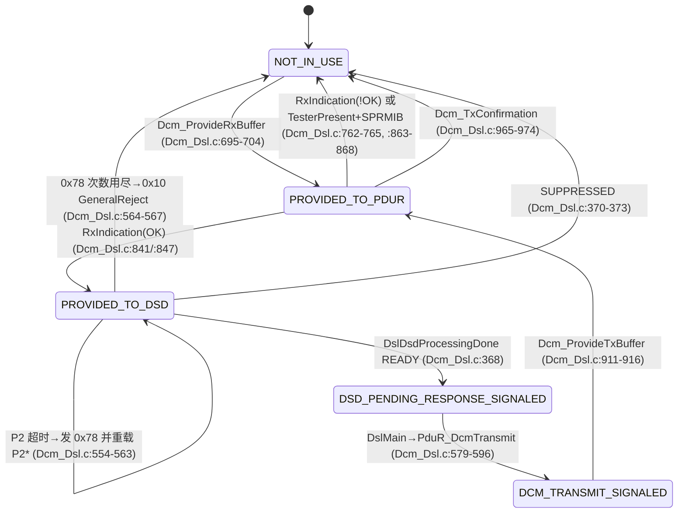

# 03 — openAUTOSAR 参考实现追踪（Phase 1 Research）

> **[行号勘误 — 2026-10-02]** 本笔记中部分 `path:line` 已过时（openAUTOSAR 工作副本与研究时的行号有偏差），例如：`PduR_DcmTransmit` 实际在 `PDURouter/src/PduR_Dcm.c:21`（不是 `:64`），`PduR_CanIfRxIndication` / `PduR_CanIfTxConfirmation` 在 `PDURouter/src/PduR_CanIf.c:21` / `:25`（不是 `:89` / `:93`），SchM 配置文件位于 `system/SchM/include/SchM_cfg.h`（不是 `include/SchM_cfg.h`）。**[源码追踪表 source-traceability.md](../source-traceability.md) 中的值已重新 grep，与本笔记冲突时以它为准。**本勘误插入后，本文件行号整体 +2。
>
> 研究对象：`D:\side_project\openAUTOSAR`（只读，未做任何修改）
> 研究日期：2026-10-01；上游最新提交 `1349911 Merge pull request #36 ... virtual-board-design-module`
> 约定：所有 `path:line` 均相对 `D:\side_project\openAUTOSAR\`，全部来自实际 grep / 阅读，未凭记忆填写。
> 标注：**[已验证]** = 用本机 TDM-GCC 10.3.0 实际编译 / `nm` 查看符号确认；**[阅读]** = 读源码得出；**[缺失]** = 仓库中搜索不到。

---

## 0. 一句话结论

openAUTOSAR 是 **Arctic Core 2.18.0（AUTOSAR **R3.1.5** 风格）的一个“能编译、不能运行”的教学骨架**：BSW 上层（CanIf / CanTp / PduR / Dcm / Dem / NvM / EcuM / SchM / OS kernel）源码较完整、可读性好；但 **没有 Can driver 源码、没有 CAN 仿真（无 SocketCAN）、没有 OS 的 arch port、没有大部分 `*_Cfg.c / *_Lcfg.c / *_PBcfg.c` 配置实例、没有任何把模块链接成可执行文件的 target**。另外现有配置里 **诊断路径（CanIf→CanTp→Dcm）根本没被接通**，并且 `PduR_Cfg.h` 的“zero-cost”宏无条件生效，会导致链接期重复符号。适合“读代码学 DSL/DSD/DSP 与 CanTp 状态机”，不适合“直接跑起来做 Demo”。

---

## 1. 仓库总览

### 1.1 目录与来源

| 目录 | 内容 | 备注 |
|---|---|---|
| `communication/CAN/{CanIf,CanTp,CanSM,CanNm}` | CAN 通信栈 | 无 `Can` driver |
| `communication/ComServices/{Com,PDURouter}` | Com、PduR | |
| `communication/LIN/{LinIf,LinSM}`、`communication/J1939Tp` | LIN、J1939Tp | J1939Tp 无 CMakeLists |
| `diagnostic/{Dcm,Dem}` | 诊断 | `Dem_LCfg.c` 被错放在 `diagnostic/Dem/include/` 下 |
| `memory/NvM`、`iohwabs/{Fee,MemIf,Ea,WdgIf}` | 存储栈 | |
| `system/{EcuM,SchM,ComM,Nm,Crc,WdgM,kernel}` | 系统服务 + OSEK/AUTOSAR OS kernel | **无 BswM** |
| `debug/Det` | Det | |
| `rte/src/rte.c` | 65 行占位 | 见 §5 |
| `boards/linuxOs/MCAL/*` | “linuxOs” 板 MCAL | 实为 STM32 / MPC5xxx 遗留代码，见 §1.3 |
| `boards/linuxOs/design` | ncurses + libxml2 虚拟板绘制工具 | 与 MCAL 无连接 |
| `examples/{os_simple,rte_simple}` | 例子 | 均未纳入构建 |
| `include/` | 公共头（`Can.h`、`ComStack_Types.h`、`Os.h`、`NvM.h`…） | |
| `docs/autosar-classic/` | 13 篇中文教程 + zip | **git 未跟踪**（本地新增） |
| `Autosar_SecOC/` | 独立 git 仓库 | **git 未跟踪**，见 §1.6 |

来源声明：`README.md:3` “fork of openAUTOSAR/classic-platform v2.18.0 by Arctic Core”；`README.md:12-15` 明确写 “There is no hardware support… modules … may just have stub implementations”。所有源文件头部均为 `Arctic Core ... Copyright (C) 2009 ArcCore AB`（例：`communication/CAN/CanIf/src/CanIf.c:1-14`）。

`git status` 显示 `Autosar_SecOC/` 与 `docs/` 都是 `??`（未跟踪），即它们不是上游仓库内容，而是本机后加的。

### 1.2 构建系统

- 顶层 `CMakeLists.txt:8-28`：只有 `elseif(${CMAKE_SYSTEM_NAME} MATCHES "Linux")` 分支会 `add_subdirectory(...)`；`CMAKE_CROSSCOMPILING` 分支只把 `CMAKE_C_FLAGS` 设成字符串 `"Options For Cross Compiling"`（`CMakeLists.txt:9`）——**交叉编译分支是空的**。`examples` 被注释掉（`CMakeLists.txt:25`）。
- 每个模块都是 `add_library(<mod> STATIC ...)`，**整个工程没有一个 `add_executable` 把 BSW 链接起来**（唯一的 executable 是 `boards/linuxOs/design/test/CMakeLists.txt` 的 `testncboard`，一个 ncurses 小工具）。所以 CI（`.github/workflows/cmake.yml`）“绿”只说明各 `.c` 单独能编译，**不说明能链接或能运行**。README 也承认：“A successful generation … only indicates the fact that the build system has been correctly configured”（`README.md:13`）。
- `openAUTOSAR_armgcc.cmake:22-39`：arm-none-eabi-gcc 11.2 toolchain 文件（`/opt/gcc-arm-11.2-...`）；`openAUTOSAR_linux.cmake` 全部被注释。没有 RH850 / GHS / CC-RH 的 toolchain。
- 模块 `CMakeLists.txt` 里用 `-DUSE_xxx` 控制模块间依赖，且**各模块不一致**。关键事实（影响诊断链路）：
  - `communication/CAN/CanIf/CMakeLists.txt`：`string(APPEND CMAKE_C_FLAGS " -DUSE_COM -DUSE_PDUR")` —— **没有 `-DUSE_CANTP`**，因此 `CanIf.c:868-878` 的 `CANIF_USER_TYPE_CAN_TP` 分支被预处理掉。[已验证：按 CMake flags 编译 `CanIf.c`，`nm` 中不存在 `CanTp_RxIndication` 引用]
  - `diagnostic/Dcm/CMakeLists.txt` 不定义 `USE_DEM`，也没有任何 `DCM_USE_SERVICE_*`。
  - `system/SchM/CMakeLists.txt` 只有 `-DUSE_MCU -DUSE_ECUM`，因此 `SCHM_MAINFUNCTION_DCM()`/`SCHM_MAINFUNCTION_CANTP()` 被定义为空（`system/SchM/src/SchM.c:175-179`、`:160-164`）。
  - `system/kernel/CMakeLists.txt` 只编 `event.c init.c task.c resource.c alarm.c sched_table.c counter.c os_arctest.c asm_offset.c`，**不编 `isr.c`、`application.c`**；且 include 了不存在的 `${PROJECT_SOURCE_DIR}/arch/x64/kernel/include`。
- 很多 `target_include_directories` 指向**不存在的目录**：`arch/x64/...`、`boards/linuxOs/config/include`、`boards/linuxOs/include`、`drivers/Dio/include`（如 `communication/ComServices/PDURouter/CMakeLists.txt`、`examples/rte_simple/CMakeLists.txt`）。`ls arch boards/linuxOs/config` → 不存在。

### 1.3 `boards/linuxOs`：不是 Linux 仿真

名字叫 linuxOs，但**没有任何 POSIX/Linux 仿真代码**：

| 模块 | 文件 | 事实 |
|---|---|---|
| Mcu | `boards/linuxOs/MCAL/Mcu/src/Mcu.c` | `Mcu_Init` 在 `:345`；含 PowerPC 遗留（`Mcu_IdentifyCpu(uint32 pvr)` `:131`，注释掉的 `FMPLL.SYNSR` `:403`）。唯一被 CMake 编进库的 MCAL 之一 |
| Port | `boards/linuxOs/MCAL/Port/src/Port.c` | `#include "stm32f10x.h"` `:18`；`Port_Init` `:98` 直接写 STM32 GPIO 寄存器；无 CMakeLists |
| Dio | `boards/linuxOs/MCAL/Dio/src/Dio.c` | `#include "stm32f10x_gpio.h"` `:23`；`Dio_WriteChannel` `:150`；只有 `include/`+`src/`，无 CMakeLists |
| Gpt | `boards/linuxOs/MCAL/Gpt/src/Gpt.c` | `#include "stm32f10x.h"` `:27`，`TIM_TypeDef` 数组 `:74`；`Gpt_Init` `:211`；无 CMakeLists |
| Can | `boards/linuxOs/MCAL/Can/include/Can_Cfg.h` | **只有一个头文件**，CMakeLists 为空；**无 `Can.c`、无 `Can_Lcfg.c`** |
| Adc / Eep | `Adc/src/Adc_Internal.c`、`Eep/src/Eep.c` | Adc 被 `boards/linuxOs/MCAL/CMakeLists.txt` 编译（只 `add_subdirectory(Adc)`） |
| Fls / Spi / Wdg / Pwm / Os | 只有头文件或少量源码 | `Wdg/Readme.txt` 说明 WdgM/WdgIf 被重构“to make it compile again” |

**CAN 如何被仿真？—— 没有。** 全仓 grep `socket|SocketCAN|PF_CAN|linux/can`，命中只在 `Autosar_SecOC/source/Ethernet/ethernet.c`（TCP socket，见 §1.6）。主仓库中 `Can_Init` 只在 `system/EcuM/src/EcuM_Callout_Stubs.c:308` 被调用，`Can_Write` 只在 `communication/CAN/CanIf/src/CanIf.c:470` 被调用；**二者都没有定义**。`CanIf_Cfg.c:35-36` 引用的 `CanControllerConfigData[]`、`CanConfigSetData` 也找不到定义（`Can_Cfg.h:217-219` 只有 `extern`，且名字 `Can_ConfigSet` 与 `CanConfigSetData` 还对不上）。

`boards/linuxOs/design/`：`createBoard.c`（303 行）+ `test/linuxBoard.xml`（一个 Button + 一个 LED）是“虚拟板”绘制工具的雏形，依赖 libxml2/ncurses，与 MCAL 没有任何调用关系。

### 1.4 examples

- `examples/os_simple/`：`os_simple.c` 定义 `bTask3`/`eTask1`/`eTask2`/`OsIdle`（`:32/:50/:75/:98`），`system_hooks.c` 定义 OS hooks（`StartupHook` `:82` 等）。`example_info.txt` 自己说明“currently used only to prove that the build system works”。Linux 分支 include 不存在的 `arch/x64`；交叉编译分支指向不存在的 `boards/stm32_stm3210c/...`。OS 配置 `boards/linuxOs/MCAL/Os/include/Os_Cfg.h` 只有 `TASK_ID_OsIdle/bTask3/eTask1` 等宏，**没有生成的 `Os_TaskConstList[]` 定义**（`include/os_config_macros.h:54` 只有生成宏 `GEN_TASK_HEAD`）。
- `examples/rte_simple/`：见 §5。

### 1.5 `docs/autosar-classic/`（中文教程）质量评估

13 篇 Markdown（`00-学习路线图.md` … `12-方法论-ARXML与配置生成流程.md`，合计约 15,700 行），另有 `autosar-classic.zip` 副本；文件时间 2026-08-13/14，git 未跟踪，看起来是此前另一个 AI/作者针对本仓库写的。

| 维度 | 评价 |
|---|---|
| 结构 | 好：从“为什么”切入 → 规范概念 → 本仓库代码片段 → 坑点小结，分层清晰（例：`08-...CanTp.md` 先讲 ISO 15765-2 四种帧再贴 `CanTp.c` 宏） |
| 代码依据 | 好：大量直接引用本仓库代码与相对链接（如 `10-诊断栈-Dcm-Dem-UDS.md` 引用 `Dcm_Dsl.c` 的 `DCM_Config.Dsl->DslDiagResp`） |
| 诚实性 | 较好：已指出 Dcm 是 **AUTOSAR 3.1.5 风格**（`ProvideRxBuffer` 而非 `StartOfReception`，见 `10-...md:1182`）、`DCM_Config` 无定义（`:1191`）、`PduR_Cfg.h` 零成本宏绕过路由表（`07-...md:312`）、SecurityAccess 未用防暴破参数（`10-...md:2202`） |
| 风险 | ① `10-...md:2160` 称诊断栈“可读、可编译”——单文件可编译属实，但**没指出链接期重复符号与 CanIf 未接 CanTp**；② 篇幅极长（单篇 1000-2300 行），教学节奏偏“百科”；③ 未提供任何能运行的 demo；④ 与 RH850 无关 |
| 结论 | 可作为 **“openAUTOSAR 代码导读”** 的二级参考，引用前需逐条核对行号；不能当规范来源（规范以 `rh850/` 根目录下的 AUTOSAR SWS PDF 为准） |

### 1.6 `Autosar_SecOC/`：独立项目

- 独立 git 仓库：`origin https://github.com/HosamAboabla/Autosar_SecOC.git`，最新 `71fc693 Fix book url`；是一个本科毕设（`Autosar_SecOC/README.md` “bachelor's graduation project”），声明遵循 **SecOC SWS R21-11**（`README.md:189`）。
- 有**自己的极简版** CanIf / CanTp / PduR / Com / Dcm / SoAd / Csm：`source/Can/CanIF.c:38 CanIf_Transmit`、`source/Can/CanTP.c:39 CanTp_Transmit / :48 CanTp_RxIndication / :84 CanTp_MainFunctionTx / :179 CanTp_MainFunctionRx`、`source/PduR/Pdur_CanTP.c:43 PduR_CanTpStartOfReception / :34 PduR_CanTpCopyRxData / :13 PduR_CanTpCopyTxData`（**R4.x API 名**），`source/Dcm/Dcm.c:13 Dcm_TpTxConfirmation` 只是 printf 桩。
- “CAN 总线”用 **TCP socket** 模拟：`CanIF.c` 在 `#ifdef __linux__` 下调 `ethernet_send()`（`source/Ethernet/ethernet.c:68` `socket(AF_INET, SOCK_STREAM, 0)`）。另有 PyQt GUI（`GUI/main.py`）和 gtest（`test/*.cpp`）。
- 与主仓库 **没有任何构建或代码关联**（顶层 `CMakeLists.txt` 未引用）。对本项目价值：可作为 **R4.x TP API 形态（StartOfReception/CopyRxData/CopyTxData）** 的极简对照，但它的 Dcm 不是 Dcm。

### 1.7 AUTOSAR Release 声明（逐模块 grep `*_AR_*_VERSION`）

| 模块 | 版本宏位置 | AR 版本 |
|---|---|---|
| Can | `include/Can.h:24-26` | 3.1.5 |
| CanIf | `communication/CAN/CanIf/include/CanIf.h:31-33` | 3.1.5 |
| CanTp | `communication/CAN/CanTp/include/CanTp.h:36-38` | 3.1.5 |
| CanNm / CanSM | `CanNm.h:30-32` / `CanSM.h:29-31` | 3.1.5 |
| PduR | `communication/ComServices/PDURouter/include/PduR.h:29-31` | 3.1.5（SW 2.0，`PduR_Cfg.h:16` 校验） |
| Dcm | `diagnostic/Dcm/include/Dcm.h:34-36` | 3.1.5 |
| Dem | `diagnostic/Dem/include/Dem.h:34-36` | 3.1.5 |
| Det | `debug/Det/include/Det.h:49-51` | 3.1.5 |
| NvM | `include/NvM.h:37-39` | 3.1.5 |
| EcuM | `system/EcuM/include/EcuM.h:79-81` | 3.1.5 |
| ComM | `system/ComM/include/ComM.h:33-35` | 3.1.5 |
| Port | `include/Port.h:30-32`、`boards/linuxOs/MCAL/Port/include/Port.h:30-32` | 3.1.0 |
| Dio / Gpt / Spi / Pwm / Eep | `Dio.h:84-86`、`Gpt.h:49-51`… | 3.1.5 |
| Mcu | `boards/linuxOs/MCAL/Mcu/include/Mcu.h:32-34` | **2.2.2** |
| Fls | `Fls.h:40-42` | 3.0.2 |
| Ea | `iohwabs/Ea/include/Ea.h:23-25` | **4.0.2**（注释：“due to the poor quality of 3.1 specification”） |
| J1939Tp | `include/J1939Tp.h:34-36` | 4.0.2 |
| Nm | `system/Nm/include/Nm.h:27-29` | 1.0.1 |
| ComStackTypes | `include/ComStack_Types.h:102-104` | 0.1.0（显然未维护） |
| SchM | `system/SchM/src/SchM.c` 头注释 “Part of Release: 3.1.5” | 3.1.5 |

**结论：主体为 AUTOSAR R3.1.5**，夹杂少量 4.0.2（Ea、J1939Tp）与 Com 中的 4.x 风格 TP API（`Com.c:198 Com_CopyTxData`、`:220 Com_CopyRxData`、`:256 Com_StartOfReception`）。版本混杂本身就是一个教学点。

---

## 2. 逐模块清单

> 列：文件 / 关键 API（path:line）/ 配置类型 & 配置实例位置 / 运行时状态 / MainFunction

### 2.1 MCAL

| 模块 | 关键 API | 配置 | 运行时状态 | MainFunction |
|---|---|---|---|---|
| **Mcu** | `Mcu_Init` `boards/linuxOs/MCAL/Mcu/src/Mcu.c:345`；`Mcu_InitClock` `:382`；`Mcu_DistributePllClock` `:400`；`Mcu_GetPllStatus` `:412`；`Mcu_GetResetReason` `:435`；`Mcu_PerformReset` `:485` | 类型 `Mcu_ConfigTypes.h`；**实例缺失**（EcuM 用 `ConfigPtr->McuConfig`） | `Mcu_Global`（`Mcu.c:358-359` 写 `.config/.initRun`） | 无 |
| **Port** | `Port_Init` `boards/linuxOs/MCAL/Port/src/Port.c:98`；`Port_SetPinDirection` `:131`；`Port_SetPinMode` `:199` | `Port_ConfigType`；**实例缺失** | `_configPtr` `Port.c:53`、`_portState` | 无 |
| **Dio** | `Dio_ReadPort` `Dio.c:105`；`Dio_WritePort` `:118`；`Dio_ReadChannel` `:130`；`Dio_WriteChannel` `:150` | **实例缺失** | 无（直接读写寄存器） | 无 |
| **Gpt** | `Gpt_Init` `Gpt.c:211`；`Gpt_StartTimer` `:289`；ISR `Gpt_Isr` `:194` | **实例缺失** | 文件内 static | 无 |
| **Can** | 仅声明：`Can_Init` `include/Can.h:313`、`Can_InitController` `:320`、`Can_SetControllerMode` `:321`、`Can_Write` `:327`、`Can_MainFunction_Write/Read/BusOff/Error/Wakeup` `:330-334` | 类型：`Can_HardwareObjectType` `Can_Cfg.h:97-128`（`CanObjectId`/`CanObjectType`/`CanIdValue`/`CanFilterMaskRef`）、`Can_ControllerConfigType` `:135-195`、`Can_ConfigType` `:206-214`；上行回调表 `Can_CallbackType` `include/Can.h:178-185`（`RxIndication/TxConfirmation/ControllerBusOff` 函数指针——Arctic 特有，R4 中 Can 直接调 `CanIf_*`）；HTH/HRH 枚举 `Can_Cfg.h:59-68`（`HWObj_2`=HTH，`HWObj_1`=HRH） | **[缺失]** | **[缺失]**（SchM 中 `SchM_Can.h:19-23` 有调度宏） |

> **Can driver 结论**：本仓库**无法追踪** Can ISR / polling / mailbox 到 `CanIf_RxIndication` 的那一跳。这一跳必须由我们的 RH850 实现来补（这正是本教程的重点）。

### 2.2 通信栈

#### CanIf — `communication/CAN/CanIf/`
- API：`CanIf_Init` `src/CanIf.c:131`、`CanIf_InitController` `:156`、`CanIf_SetControllerMode` `:226`、`CanIf_GetControllerMode` `:323`、`CanIf_Transmit` `:424`、`CanIf_SetPduMode` `:545`、`CanIf_GetPduMode` `:633`、`CanIf_TxConfirmation` `:743`、`CanIf_RxIndication` `:764`、`CanIf_ControllerBusOff` `:919`。
- 配置类型 `include/CanIf_ConfigTypes.h`：`CanIf_UserTypeType` `:37-43`（`CANIF_USER_TYPE_CAN_NM/CAN_TP/CAN_PDUR/J1939TP/CAN_SPECIAL`）、`CanIf_HrhConfigType` `:111`、`CanIf_HthConfigType` `:134`、`CanIf_TxPduConfigType` `:207`、`CanIf_RxPduConfigType` `:278`、`CanIf_ConfigType` `:400`。
- 配置实例（手写示例，非生成）：`src/CanIf_Cfg.c:168 CanIf_Config`；只有 **1 个 Tx L-PDU（CAN ID 512=0x200，user confirm=`PduR_CanIfTxConfirmation`，`:114-128`）** 和 **1 个 Rx L-PDU（CAN ID 256=0x100，`CANIF_USER_TYPE_CAN_PDUR`，`:130-149`）**——**没有任何 CanTp 的 Rx/Tx/FC PDU**。`CanIfDriverNameRef = "FLEXCAN"`（`:60`）暴露了 MPC5xxx 来源。宏开关 `include/CanIf_Cfg.h:27-38`。
- 运行时状态：`CanIf_ConfigPtr`（`CanIf.c:83`，static）、`CanIf_Global`（`:129`，含每个 channel 的 `ControllerMode` / `PduMode`）。
- MainFunction：无（R3.1.5 CanIf 无 MainFunction）。
- 观察到的缺陷：`CanIf_RxIndication` 在 “unsupported filter type” 分支 `continue` 前没有 `entry++`（`CanIf.c:820`），会死循环 [阅读]；Tx 不支持缓冲，`CAN_BUSY` 直接返回 `E_NOT_OK`（`:476-481`）。

#### CanTp — `communication/CAN/CanTp/`
- API：`CanTp_Transmit` `src/CanTp.c:892`、`CanTp_Init` `:971`、`CanTp_RxIndication` `:1001`、`CanTp_TxConfirmation` `:1111`、`CanTp_Shutdown` `:1144`、`CanTp_MainFunction` `:1172`（声明 `include/CanTp.h:92-104`、`include/CanTp_Cbk.h:30-32`）。
- 内部：`handleSingleFrame` `:730`、`handleFirstFrame` `:785`、`handleConsecutiveFrame` `:491`、`handleFlowControlFrame` `:684`、`sendFlowControlFrame` `:432`、`sendNextTxFrame` `:583`、`handleNextTxFrameSent` `:631`、`copySegmentToPduRRxBuffer` `:336`（调 `PduR_CanTpProvideRxBuffer` `:354`）。
- 状态机枚举 `ISO15765TransferStateTypes` `:151-158`（`IDLE / SF_OR_FF_RECEIVED_WAITING_PDUR_BUFFER / RX_WAIT_CONSECUTIVE_FRAME / RX_WAIT_SDU_BUFFER / TX_WAIT_STMIN / TX_WAIT_TRANSMIT / TX_WAIT_FLOW_CONTROL / TX_WAIT_TX_CONFIRMATION`）。
- 配置类型 `include/CanTp_Types.h`：`CanTp_RxNSduType` `:91-113`、`CanTp_TxNSduType` `:115-135`、`CanTp_NSduType` `:152-159`、`CanTp_RxIdType` `:161-165`（`CanTpNSduIndex`/`CanTpReferringTxIndex`）、`CanTp_ConfigType` `:170-185`。
- 配置实例：`src/CanTp_Cfg.c:62 CanTpNSduConfigList[]`（2 Tx + 2 Rx，UDS phys/func，`CanTpBs=30`，`CanTpNcr/Nbr=1000`）、`:136 CanTpConfig`。文件头 `#warning "This default file may only be used as an example!"` `:16`。**`CanTpConfig` 没有初始化 `CanTpRxIdList`（NULL）**，而 `CanTp_RxIndication` `:1047` 与 `CanTp_Transmit` `:908` 都会解引用它 → 运行即空指针。`include/CanTp_Cfg.h:24` `CANTP_MAIN_FUNCTION_PERIOD_TIME_MS 1000`（1 秒！），`:25` 的换算宏使 `CanTpNas=2ms` 变成 0 个周期。
- 运行时状态：`CanTpRunTimeData` `src/CanTp.c:216`（`CanTp_RunTimeDataType` `:208-212`，每 channel 一个 `CanTp_ChannelPrivateType` `:195-203`，内含 `iso15765` 状态、`pdurBuffer` 指针、`canFrameBuffer[8]` 本地缓存）。
- 缺陷：`TX_WAIT_STMIN` 分支使用 `rxConfigListItem->CanTpNcr`（`:1201`），而此时它可能为 NULL / 指向别的 NSdu [阅读]；`CanTp_Transmit` 用 Rx 的 id 表做 Tx 查找（`:908-909`）。

#### PduR — `communication/ComServices/PDURouter/`
- API：`PduR_Init` `src/PduR.c:52`；对 CanTp 的上行 `PduR_CanTpProvideRxBuffer / PduR_CanTpRxIndication / PduR_CanTpProvideTxBuffer / PduR_CanTpTxConfirmation`（`src/PduR_CanTp.c:25/30/34/39`）；对 Dcm 的下行 `PduR_DcmTransmit`（`src/PduR_Dcm.c:64`）；对 CanIf 的上行 `PduR_CanIfRxIndication / PduR_CanIfTxConfirmation`（`src/PduR_CanIf.c:89/93`）；通用逻辑 `PduR_ARC_*`（`src/PduR_Logic.c:124 Transmit / :223 TpRxIndication / :248 RxIndication / :300 TxConfirmation / :357 ProvideRxBuffer / :395 ProvideTxBuffer`）；目的模块分派 `src/PduR_Routing.c:52 RouteTransmit / :98 RouteRxIndication / :117 RouteTxConfirmation / :151 RouteProvideRxBuffer / :167 RouteProvideTxBuffer`；`PduR_CancelTransmitRequest` `src/PduR.c:178` 为 TODO 桩。
- 配置类型 `include/PduR_Types.h`：`ARC_PduR_ModuleType` `:28-47`、`PduRDestPdu_type` `:130`、`PduRRoutingPath_type` `:180`、`PduR_PBConfigType` `:198`。
- 配置实例：`include/PduR_PbCfg.h:34 extern PduR_PBConfigType PduR_Config;` —— **定义缺失**（无 `PduR_PbCfg.c`）。
- 运行时状态：`PduRState` `src/PduR.c:39`、`PduRConfig` 指针 `:46`。
- MainFunction：无。
- **关键坑（[已验证]）**：`include/PduR_Cfg.h:77-130` 的 “Zero cost operation” 宏（如 `#define PduR_CanTpProvideRxBuffer Dcm_ProvideRxBuffer` `:86`、`#define PduR_DcmTransmit CanTp_Transmit` `:127`、`#define PduR_CanIfRxIndication Com_RxIndication` `:78`）**只判断模块使能，不判断 `PDUR_ZERO_COST_OPERATION`（`:42` 为 STD_OFF）**。后果：
  1. CanTp 直接调用 `Dcm_*`，路由表永远不被使用（`nm CanTp.o`：`U Dcm_ProvideRxBuffer/Dcm_RxIndication/Dcm_ProvideTxBuffer/Dcm_TxConfirmation`）；
  2. `PduR_CanTp.c` 中的函数定义被宏改名，**编出来的目标文件定义的是 `T Dcm_ProvideRxBuffer` 等**，与 `Dcm.c` 的同名定义冲突；`PduR_Dcm.c` 定义出 `T CanTp_Transmit`，与 `CanTp.c` 冲突；`PduR_CanIf.c` 定义出 `T Com_RxIndication`，与 `Com_Com.c:263` 冲突 → **一旦链接成一个镜像就会 multiple definition**。只是因为没人链接，所以没暴露。

#### Com — `communication/ComServices/Com/`
- API：`Com_Init` `src/Com.c:43`、`Com_IpduGroupStart` `:173`、`Com_SendSignal` `src/Com_Com.c:39`、`Com_ReceiveSignal` `:72`、`Com_TriggerTransmit` `:175`、`Com_RxIndication` `:263`、`Com_TxConfirmation` `:336`；MainFunction `Com_MainFunctionRx` `src/Com_Sched.c:35`、`Com_MainFunctionTx` `:98`。
- 配置：`include/Com_PbCfg.h:25 extern const Com_ConfigType ComConfiguration;` —— **定义缺失**。运行时 `ComConfig` 指针（`include/Com_Internal.h:33`）。

#### CanSM / CanNm / ComM（简述）
- CanSM：`communication/CAN/CanSM/src/CanSM.c`、`CanSM_Cfg.c`（6 行）；ComM：`ComM_Init` `system/ComM/src/ComM.c:108`、`ComM_RequestComMode` `:156`、`ComM_DCM_ActiveDiagnostic` `:400`、`ComM_DCM_InactiveDiagnostic` `:408`、`ComM_MainFunction(Channel)` `:435`、`ComM_MainFunction_All_Channels` `:454`。Dcm 仅在 `USE_COMM` 下调 ComM（`Dcm_Dsl.c:835`）。

### 2.3 诊断 / 存储 / 系统

| 模块 | 关键 API | 配置 | 运行时状态 | MainFunction |
|---|---|---|---|---|
| **Dcm** | `Dcm_Init` `diagnostic/Dcm/src/Dcm.c:79`；`Dcm_MainFunction` `:96`；`Dcm_ProvideRxBuffer` `:109`；`Dcm_RxIndication` `:124`；`Dcm_GetActiveProtocol` `:133`；`Dcm_GetSecurityLevel` `:147`；`Dcm_GetSesCtrlType` `:161`；`Dcm_ProvideTxBuffer` `:174`；`Dcm_TxConfirmation` `:188`；回调声明 `include/Dcm_Cbk.h:32-38` | 类型全在 `include/Dcm_Lcfg.h`（§4）；`extern const Dcm_ConfigType DCM_Config;` `:641` —— **定义缺失**；宏开关 `include/Dcm_Cfg.h:30-52`（`DCM_TASK_TIME TBD` `:34`，`DCM_MAIN_FUNCTION_PERIOD_TIME_MS 10` `:46`，后者是 DaVinci 补的） | `dcmState` `Dcm.c:61`；DSL `DcmDslRunTimeData` `Dcm_Dsl.c:58`；每 protocol 的 `Dcm_DslRunTimeProtocolParametersType`（`Dcm_Lcfg.h:556-574`，由配置提供存储）；DSD `msgData/dsdDslDataIndication/currentSid/suppressPosRspMsg` `Dcm_Dsd.c:39-43`；DSP `dspUdsEcuResetData`等 `Dcm_Dsp.c:179-218` | `Dcm_MainFunction` → `DsdMain/DspMain/DslMain`（`Dcm.c:100-102`） |
| **Dem** | `Dem_PreInit` `diagnostic/Dem/src/Dem.c:2335`；`Dem_Init` `:2415`；`Dem_MainFunction` `:2565`；`Dem_SetEventStatus` `:2585`；`Dem_ReportErrorStatus` `:2781`；`Dem_SetDTCFilter` `:2834`；`Dem_GetStatusOfDTC` `:2882`；`Dem_GetNextFilteredDTC` `:2951`；`Dem_ClearDTC` `:2998` | `DEM_Config` 定义在 `diagnostic/Dem/include/Dem_LCfg.c`（只有一个 EOL 事件）——**放在 include 目录、未被 CMake 编译** | `configSet` `Dem.c:175`、`operationCycleStateList` `:190`；NvM 镜像 `copyNvmMirror` `:1558` | `Dem_MainFunction` |
| **NvM** | `NvM_Init` `memory/NvM/src/NvM.c:1359`；`NvM_ReadAll` `:1397`；`NvM_WriteAll` `:1415`；`NvM_GetErrorStatus` `:1510`；`NvM_ReadBlock` `:1664`；`NvM_WriteBlock` `:1750`；`NvM_MainFunction` `:1891` | 使用 `NvM_Config.BlockDescriptor`（`NvM.c:616`）——**定义缺失** | Admin 结构（文件内 static） | `NvM_MainFunction` |
| **Det** | `Det_Init` `debug/Det/src/Det.c:106`；`Det_ReportError` `:138`；`Det_Start` `:182`；`Det_AddCbk` `:65` | `Det_Cfg.h` | 回调表 | 无 |
| **EcuM** | `EcuM_Init` `system/EcuM/src/EcuM.c:115`；`EcuM_StartupTwo` `:193`；`EcuM_RequestRUN` `:346`；`EcuM_MainFunction` `EcuM_Main.c:509`；驱动初始化 callout `EcuM_AL_DriverInitZero/One/Two/Three` `EcuM_Callout_Stubs.c:169/184/266/376` | `EcuM_DeterminePbConfiguration` 返回 `&EcuMConfig`（`EcuM_Callout_Stubs.c:156-159`）——**`EcuMConfig` 定义缺失**；类型 `EcuM_Generated_Types.h` | `EcuM_World` | `EcuM_MainFunction` |
| **SchM** | `SchM_Init` `system/SchM/src/SchM.c:326`（空）；`TASK(SchM_Startup)` `:351`；`TASK(SchM_BswService)` `:379`；调度宏 `SCHM_MAINFUNCTION(_mod,_func)` `system/SchM/include/SchM.h:43-47`（按计数分频） | 周期 `include/SchM_cfg.h:22-65`（`SCHM_CYCLE_MAIN 5`，所有模块同分频）；`ALARM_ID_Alarm_BswService 123` `:74` 是写死的假 ID | `SchM_Info_<MOD>.timer`（`SchM.c:300-322` 的 `SCHM_DECLARE`） | 本身即调度器 |
| **Os/kernel** | `main` `system/kernel/src/init.c:290`；`InitOS` `:93`；`StartOS` `:353`；`ActivateTask` `task.c:697`；`TerminateTask` `task.c:787`；`Schedule` `task.c:908`；`SetEvent/WaitEvent` `event.c:111/:50`；`SetRelAlarm` `alarm.c:99`；`OsTick` `counter.c:193`；`Os_Isr` `isr.c:327`；`Os_IsrInit` `isr.c:80` | `Os_Cfg.h`（仅 os_simple 的宏）；`Os_TaskConstList[]` **缺失** | `Os_Sys` | 由 SysTick 驱动 |
| **BswM** | **[缺失]** 全仓 grep `BswM` 在 C 代码中 0 命中 | — | — | — |
| **Rte** | 见 §5 | — | — | — |

---

## 3. 调用链追踪

> 说明：下面的链路是“代码作者**意图**的链路”，每一跳都标出“在当前仓库配置下是否真的连通”。

### 3.1 RX：CAN 帧 → DSP 服务处理

```text
[CAN 硬件 / ISR / Can_MainFunction_Read]   ← 本仓库缺失（无 Can.c）
   │  Can_CallbackType.RxIndication 函数指针  include/Can.h:180   (Arctic 设计)
   ▼
CanIf_RxIndication(Hrh, CanId, CanDlc, CanSduPtr)        CanIf.c:764
   │  CanIf_Arc_FindHrhChannel(Hrh)                         CanIf.c:100  (查 HOH 配置得 channel)
   │  CanIf_GetPduMode(channel) != OFFLINE/TX_ONLINE        CanIf.c:778-789
   │  线性扫描 CanIfRxPduConfigPtr，软件滤波 mask           CanIf.c:794-822
   │  DLC check (CANIF_DLC_CHECK=STD_ON)                    CanIf.c:825-831
   │  switch(entry->CanIfRxUserType)
   │    case CANIF_USER_TYPE_CAN_TP  (仅 #if USE_CANTP)     CanIf.c:868-878
   ▼
CanTp_RxIndication(CanTpRxPduId, PduInfo*)               CanTp.c:1001
   │  frameType = getFrameType()                            CanTp.c:221 / 调用 :1033
   │  CanTpConfig.CanTpRxIdList[id].CanTpNSduIndex          CanTp.c:1047   ← 配置为 NULL!
   │  SF → handleSingleFrame       CanTp.c:1065 → :730
   │  FF → handleFirstFrame        CanTp.c:1075 → :785
   │  CF → handleConsecutiveFrame  CanTp.c:1084 → :491
   │  FC → handleFlowControlFrame  CanTp.c:1093 → :684 (属于 TX 方向)
   ▼
copySegmentToPduRRxBuffer()                               CanTp.c:336
   │  PduR_CanTpProvideRxBuffer(PduR_PduId, total, &buf)    CanTp.c:354
   │    └─ 预处理后实际 = Dcm_ProvideRxBuffer(...)          PduR_Cfg.h:86  [已验证]
   ▼
Dcm_ProvideRxBuffer(dcmRxPduId, tpSduLength, **pduInfo)   Dcm.c:109
   └─ DslProvideRxBufferToPdur()                            Dcm_Dsl.c:682
        findRxPduIdParentConfigurationLeafs()               Dcm_Dsl.c:258
        外部 Rx buffer 可用 → BUFFER_BUSY, PROVIDED_TO_PDUR  Dcm_Dsl.c:695-704
        DSD 正占用 → 改用 8 字节 localRxBuffer（并发 TesterPresent） :706-717
        长度超 → BUFREQ_OVFL                                 Dcm_Dsl.c:726
        BUFREQ_OK → stopS3SessionTimer                       Dcm_Dsl.c:729
   ▼ (CanTp 把数据拷进 Dcm 的 buffer；FF 后发 FC.CTS sendFlowControlFrame :432 → CanIf_Transmit :404)
   ▼ (最后一帧收齐)
PduR_CanTpRxIndication(id, NTFRSLT_OK)                    CanTp.c:763 (SF) / :574 (CF 收完)
   └─ 预处理后 = Dcm_RxIndication(id, result)              PduR_Cfg.h:87
Dcm_RxIndication()                                         Dcm.c:124
   └─ DslRxIndicationFromPduR()                             Dcm_Dsl.c:743
        TesterPresent+SPRMIB → 只重启 S3，不进 DSD          Dcm_Dsl.c:762-765 (判定 :454)
        未启动 protocol → StartProtocolHelper()             Dcm_Dsl.c:770  (回调 DslCallbackDCMRequestService)
        高优先级抢占（OBD）逻辑                              Dcm_Dsl.c:785-817
        P2 计时开始 stateTimeoutCount=P2ServerMax           Dcm_Dsl.c:840
        externalRx/TxBufferStatus = PROVIDED_TO_DSD         Dcm_Dsl.c:841/:847
        DsdDslDataIndication(rx, SIDTable, addrType, txPduId, tx, rxPduId)  Dcm_Dsl.c:854
   ▼ (仅置标志，异步)
DsdDslDataIndication()  → dsdDslDataIndication = TRUE     Dcm_Dsd.c:369-379
   ▼ 下一次 Dcm_MainFunction                                Dcm.c:96 → DsdMain() :100
DsdMain() → DsdHandleRequest()                             Dcm_Dsd.c:269 / :273 / :278
   │  lookupSid → NRC 0x11                                   Dcm_Dsd.c:288 / :331
   │  DspCheckSessionLevel → NRC 0x7F                        Dcm_Dsd.c:290 / :327 (实现 Dcm_Dsp.c:402)
   │  DspCheckSecurityLevel → NRC 0x33                       Dcm_Dsd.c:291 / :323 (实现 Dcm_Dsp.c:423)
   │  askApplicationForServicePermission → NRC 0x22 / 静默    Dcm_Dsd.c:294 / :314 (实现 :50)
   │  SPRMIB 处理                                            Dcm_Dsd.c:302-309
   ▼
selectServiceFunction(sid)                                 Dcm_Dsd.c:86 (switch :89)
   0x10 DspUdsDiagnosticSessionControl   case :92  → Dcm_Dsp.c:469
   0x11 DspUdsEcuReset                   case :98  → Dcm_Dsp.c:530
   0x14 DspUdsClearDiagnosticInformation case :104 → Dcm_Dsp.c:581  (需 USE_DEM)
   0x19 DspUdsReadDtcInformation         case :110 → Dcm_Dsp.c:1091 (需 USE_DEM)
   0x22 DspUdsReadDataByIdentifier       case :116 → Dcm_Dsp.c:1386
   0x27 DspUdsSecurityAccess             case :140 → Dcm_Dsp.c:1614
   0x2E DspUdsWriteDataByIdentifier      case :146 → Dcm_Dsp.c:1578
   0x31 DspUdsRoutineControl             case :152 → Dcm_Dsp.c:1832
   0x3E DspUdsTesterPresent              case :158 → Dcm_Dsp.c:1897
   default → createAndSendNcr(0x11)                   Dcm_Dsd.c:232
```

**每一跳的属性**

| Hop | 调用者 | 输入 | 输出 | 同步/异步 | 回调/中断/MainFunction | 配置来源 | 运行时状态 |
|---|---|---|---|---|---|---|---|
| Can→CanIf | Can ISR/`Can_MainFunction_Read`（缺失） | Hrh, CanId, DLC, data ptr | — | 同步回调 | 中断上下文或 Read MainFunction | `Can_Cfg.h` HOH（实例缺失） | Can driver 内部（缺失） |
| CanIf→CanTp | `CanIf_RxIndication` | RxPduId, `PduInfoType*` | — | 同步 | 仍在中断上下文 | `CanIf_Cfg.c:130` RxPdu 表（**当前只路由到 PduR/Com**） | `CanIf_Global` |
| CanTp→Dcm 要 buffer | `copySegmentToPduRRxBuffer` | id, 总长度, `PduInfoType**` | BUFREQ_OK/BUSY/OVFL/NOT_OK + buffer 指针 | 同步（R3.x “Provide” 语义：上层**借出整块 buffer**） | — | `CanTp_Cfg.c` NSdu、`DCM_Config.Dsl` buffer | CanTp `pdurBuffer`；Dcm `externalRxBufferStatus` |
| CanTp FC 发出 | `sendFlowControlFrame` | FS/BS/STmin | `CanIf_Transmit(CanIf_FcPduId)` | 同步 | N_Ar 计时（`NasNarTimeoutCount`） | `CanTpBs/CanTpSTmin` | `iso15765.nextFlowControlCount` |
| CF 超时 | `CanTp_MainFunction` | — | N_Cr 超时 → `RxIndication(E_NOT_OK)` | 周期 | `CanTp_MainFunction` `:1172` | `CanTpNcr` | `stateTimeoutCount` |
| CanTp→Dcm 完成 | `handleSingleFrame/handleConsecutiveFrame` | id, NotifResult | — | 同步 | 中断上下文 | — | — |
| DSL→DSD | `DslRxIndicationFromPduR` | Rx/Tx PduInfo、SID 表、addrType | 设标志 | **异步**（延到下个 `Dcm_MainFunction`） | `Irq_Save/Restore` 临界区 `Dcm_Dsl.c:759/885` | `DslProtocolRow.DslProtocolSIDTable` | `msgData` |
| DSD→DSP | `DsdHandleRequest` | `msgData` | 调 Dsp 处理函数 | 同步（在 MainFunction 中） | `Dcm_MainFunction` | `DsdService` 表 | `currentSid`、`suppressPosRspMsg` |

### 3.2 TX：DSP 响应 → CAN 帧，及确认回流

```text
DSP handler 写 pduTxData->SduDataPtr[1..], SduLength
   └─ DsdDspProcessingDone(responseCode)                    Dcm_Dsd.c:342
        正响应: SID|0x40 写 byte0                            Dcm_Dsd.c:347
        NRC: createAndSendNcr → 7F SID NRC, len 3           Dcm_Dsd.c:70-84
             功能寻址下 0x11/0x12/0x31 被抑制                 Dcm_Dsd.c:72-73
        SPRMIB → DspDcmConfirmation + SUPPRESSED            Dcm_Dsd.c:351-352
   └─ DslDsdProcessingDone(rxPduId, DSD_TX_RESPONSE_READY)  Dcm_Dsl.c:354
        externalTxBufferStatus = DSD_PENDING_RESPONSE_SIGNALED  Dcm_Dsl.c:368
   ▼ 同一次 Dcm_MainFunction 的 DslMain()                    Dcm.c:102 → Dcm_Dsl.c:523
case DSD_PENDING_RESPONSE_SIGNALED                          Dcm_Dsl.c:579
   externalTxBufferStatus = DCM_TRANSMIT_SIGNALED
   PduR_DcmTransmit(txPduId, &diagnosticResponseFromDsd)    Dcm_Dsl.c:596
     └─ 预处理后 = CanTp_Transmit(...)                      PduR_Cfg.h:127  [已验证: dsl.o U CanTp_Transmit]
CanTp_Transmit(CanTpTxSduId, PduInfo*)                      CanTp.c:892
   计算 SF / FF，写 PCI 到 canFrameBuffer，state = TX_WAIT_TRANSMIT  CanTp.c:927-944
   (此处**不发帧**，只登记)
   ▼ 下一次 CanTp_MainFunction                               CanTp.c:1172
case TX_WAIT_TRANSMIT → sendNextTxFrame()                   CanTp.c:1204-1205 → :583
   PduR_CanTpProvideTxBuffer(...) = Dcm_ProvideTxBuffer      CanTp.c:591 / PduR_Cfg.h:88
     └─ DslProvideTxBuffer(): DCM_TRANSMIT_SIGNALED → PROVIDED_TO_PDUR, 返回整块 Tx buffer   Dcm_Dsl.c:899 / :914
   逐字节拷到 8 字节 canFrameBuffer，state = TX_WAIT_TX_CONFIRMATION  CanTp.c:588-618
   canTansmitPaddingHelper() → CanIf_Transmit(CanIf_PduId)  CanTp.c:409 / :427
CanIf_Transmit()                                            CanIf.c:424
   查 TxPdu 表、检查 controller STARTED + PduMode ONLINE     CanIf.c:446-462
   Can_PduType{id,length,sdu,swPduHandle}                   CanIf.c:464-468
   Can_Write(HTH, &canPdu)                                  CanIf.c:470   ← 未定义
   ▼ 硬件发送完成（缺失）
CanIf_TxConfirmation(canTxPduId)                            CanIf.c:743
   entry->CanIfUserTxConfirmation(entry->CanIfTxPduId)      CanIf.c:758   (函数指针，来自 CanIf_Cfg.c:124)
   ▼ (若配置为 CanTp_TxConfirmation)
CanTp_TxConfirmation()                                      CanTp.c:1111
   TX_WAIT_TX_CONFIRMATION → handleNextTxFrameSent()        CanTp.c:631
     FF 后 BS=1 → TX_WAIT_FLOW_CONTROL (N_Bs)               CanTp.c:648-651
     收到 FC.CTS → handleFlowControlFrame → TX_WAIT_TRANSMIT  CanTp.c:684-710
     STmin>0 → TX_WAIT_STMIN                                CanTp.c:668-678
     全部发完 → PduR_CanTpTxConfirmation(id, NTFRSLT_OK)    CanTp.c:645
       └─ = Dcm_TxConfirmation                              PduR_Cfg.h:89
Dcm_TxConfirmation()                                        Dcm.c:188
   └─ DslTxConfirmation()                                    Dcm_Dsl.c:950
        PROVIDED_TO_PDUR: startS3SessionTimer、释放 Rx/Tx buffer  Dcm_Dsl.c:969-971
        DsdDataConfirmation → DspDcmConfirmation             Dcm_Dsl.c:973 → Dcm_Dsd.c:362 → Dcm_Dsp.c:1968
          0x11 正响应发完后才真正复位 DcmE_EcuPerformReset    Dcm_Dsp.c:1971-1981
          0x10 正响应发完后通知 Dcm_DiagnosticSessionControl   Dcm_Dsp.c:1985-1990
```

| Hop | 同步/异步 | 发生位置 | 状态 |
|---|---|---|---|
| DSP→DSD→DSL | 同步 | `Dcm_MainFunction`（DsdMain 内） | `externalTxBufferStatus` |
| DSL→CanTp | **延迟到 `DslMain`**（同一 MainFunction 末尾，`Dcm.c:102`） | `Dcm_MainFunction` | `DCM_TRANSMIT_SIGNALED` |
| CanTp_Transmit | 同步登记，**真正发帧在下一个 `CanTp_MainFunction`** | `CanTp_MainFunction` | `TX_WAIT_TRANSMIT` |
| CanTp→Dcm 取数据 | 同步“借 buffer”（R3.x ProvideTxBuffer） | `CanTp_MainFunction` | `PROVIDED_TO_PDUR` |
| CanIf→Can_Write | 同步，返回 OK/BUSY/NOT_OK；**BUSY 不缓冲** | — | 无 Tx 队列 |
| Tx 确认回流 | 中断/`Can_MainFunction_Write` 回调 → 同步链式回调到 Dcm | Can ISR（缺失） | CanTp `TX_WAIT_TX_CONFIRMATION` → `IDLE` |

### 3.3 在当前仓库配置下，这两条链路实际断在哪里

1. **没有 Can driver**：`Can_Write`/`Can_Init`/`CanControllerConfigData` 未定义 → 链路两端都悬空。
2. **CanIf 配置未接 CanTp**：`CanIf_Cfg.c` 只有一个 `CANIF_USER_TYPE_CAN_PDUR` Rx PDU 和一个 `PduR_CanIfTxConfirmation` Tx PDU；CMake 也没开 `USE_CANTP`。
3. **CanTp 配置不完整**：`CanTpRxIdList` 未初始化 → `CanTp_RxIndication` 空指针；周期 1000 ms 使计时器全部失真。
4. **PduR 零成本宏 bug**：路由表被完全绕过，且 `PduR_CanTp.c / PduR_Dcm.c / PduR_CanIf.c` 链接时与 `Dcm.c / CanTp.c / Com_Com.c` 重复定义 [已验证 by `nm`]。`PduR_Config` 实例也不存在。
5. **Dcm 无配置、无服务**：`DCM_Config` 未定义；`DCM_USE_SERVICE_*` 全仓无人定义 → `selectServiceFunction` 只剩 `default` 分支，**所有请求都回 NRC 0x11**；`USE_DEM` 未定义 → 0x14/0x19 被编译掉。
6. **调度未接**：`SchM.c` 中 `USE_DCM/USE_CANTP` 未定义 → `Dcm_MainFunction`/`CanTp_MainFunction` 从未被调度；OS 无 arch port、无 `Os_TaskConstList`。

> 教学含义：openAUTOSAR 的价值在于**每个模块内部的算法与状态机**，而“模块之间如何被配置接起来”这一层恰恰是缺失/错误的——这正好可以作为本教程“Configuration 从哪里来”章节的反面教材。

---

## 4. DCM 内部机制

### 4.1 配置树（`diagnostic/Dcm/include/Dcm_Lcfg.h`）

```text
Dcm_ConfigType DCM_Config (:629-634, 实例缺失 :641)
├── Dsl : Dcm_DslType (:617-626)
│   ├── DslBuffer[]                Dcm_DslBufferType (:412-417)  {size, pduInfo, *externalBufferRuntimeData}
│   ├── DslCallbackDCMRequestService[] (:420-424) {StartProtocol, StopProtocol}
│   ├── DslDiagResp                (:427-430) {DslDiagRespForceRespPendEn, DslDiagRespMaxNumRespPend}
│   ├── DslProtocol                (:595-600) → DslProtocolRowList[]
│   │     Dcm_DslProtocolRowType   (:577-593) {ProtocolID, Priority, Rx/TxBufferID, SIDTable,
│   │                                           TimeLimit(P2/P2*/S3), DslConnection, *DslRunTimeProtocolParameters}
│   │       └─ DslConnection → DslMainConnection (:503-511) → DslProtocolRx[] (:464-471) / DslProtocolTx (:478-483)
│   ├── DslServiceRequestIndication[] (:603-606)  → 应用“是否允许该服务”
│   └── DslSessionControl[]        (:609-614)  {GetSesChgPermission, ChangeIndication, ...}
├── Dsd : Dcm_DsdType (:379-382) → DsdServiceTable[] (:371-376) → DsdService[] (:359-368)
│        {DsdSidTabServiceId, DsdSidTabSubfuncAvail, **SecurityLevelRef, **SessionLevelRef, Arc_EOL}
└── Dsp : Dcm_DspType (:337-353)
     ├── DspSession → DspSessionRow[] (:104-109) {Level, P2ServerMax, P2StarServerMax}
     ├── DspSecurity → DspSecurityRow[] (:112-124) {Level, DelayTime, NumAttLock, SeedSize, KeySize, GetSeed(), CompareKey()}
     ├── DspDid[] (:173-192) {DspDidUsePort, Identifier, *InfoRef, **DspDidRef, Size,
     │                        ReadDataLengthFnc, ConditionCheckReadFnc, ReadDataFnc, ConditionCheckWriteFnc, WriteDataFnc, ...}
     ├── DspRoutine[] (:262-270) {UsePort, Identifier, *InfoRef, StartRoutineFnc, StopRoutineFnc, RequestResultRoutineFnc}
     └── DspEcuReset / DspPid / DspReadDTC / DspMemory / DspVehInfo ...
```

回调函数指针类型集中在 `Dcm_Lcfg.h:44-93`（如 `Dcm_CallbackReadDataFncType` `:56`、`Dcm_CallbackGetSeedFncType` `:49`、`Dcm_CallbackCompareKeyFncType` `:50`、`Dcm_CallbackStartRoutineFncType` `:74`）。注意：这里的 Arctic 版 `ReadData(uint8 *data)` 签名**没有 OpStatus**，与 R4.x 的 `Xxx_ReadData(Dcm_OpStatusType, uint8*)` 不同。

### 4.2 DSL 状态机

**Buffer 所有权状态** `Dcm_DslBufferUserType`（`Dcm_Lcfg.h:395-406`）：`NOT_IN_USE → PROVIDED_TO_PDUR → PROVIDED_TO_DSD → DSD_PENDING_RESPONSE_SIGNALED → DCM_TRANSMIT_SIGNALED → PROVIDED_TO_PDUR → NOT_IN_USE`，外加 OBD 抢占专用 `PREEMPT_TRANSMIT_NRC`。DSL 的本质就是**一组围绕“外部 Rx/Tx buffer 归谁”的状态变量**，存在每个 protocol 的 `Dcm_DslRunTimeProtocolParametersType`（`:556-574`）里：`externalRxBufferStatus/externalTxBufferStatus/localRxBuffer/localTxBuffer/S3ServerTimeoutCount/S3ServerStarted/stateTimeoutCount/responsePendingCount/securityLevel/sessionControl`。



**Session / S3**：
- 会话值 `Dcm_Types.h:47-52`（01 default、02 programming、03 extended、04 safety、05 OBD 自定义）。
- 切换 `changeDiagnosticSession` `Dcm_Dsl.c:104`：离开非默认会话时把 `securityLevel` 置 LOCKED（`:118`）；回默认会话时 `DspInit()`（`:111`）。
- 0x10 处理中 **立即** 调 `DslSetSesCtrlType`（`Dcm_Dsp.c:487`），而非等 Tx 确认后切换——与 R4.x “响应发送完成后再切换会话（并且 P2 新值生效）”的推荐时序不同；Tx 确认后只是通知 `Dcm_DiagnosticSessionControl`（`Dcm_Dsp.c:1988`，该 callout 在仓库中**无定义**）。
- S3：`startS3SessionTimer` `:76`（`TimStrS3Server` 换算成 MainFunction 周期数）、`stopS3SessionTimer` `:89`；收到请求时停（`:729`），Tx 确认后启（`:969`），TesterPresent 时重启（`:763/:876`、`Dcm_Dsp.c:1904`）。超时回默认会话在 `DslMain` `:533-547`。

**P2 / P2\* / 0x78**：
- 请求交给 DSD 时 `stateTimeoutCount = P2ServerMax / DCM_MAIN_FUNCTION_PERIOD_TIME_MS`（`Dcm_Dsl.c:840`，换算宏 `:38`）。
- `DslMain` 中 `PROVIDED_TO_DSD` 状态递减（`:554-576`）；到 0 后重载为 **P2\*ServerMax**（`:558`）并在 `DslDiagRespForceRespPendEn` 时发 **NRC 0x78**（`sendResponse` `:562`，实现 `:388`），次数由 `DslDiagRespMaxNumRespPend` 限制，用尽发 **0x10** 并 `DspCancelPendingRequests`（`:565-567`）。
- 0x78 用 **8 字节 localTxBuffer** 发送（`:402-410`），因此不影响仍被 DSD 占用的外部 Tx buffer —— 这是 Arctic 的一个好设计，值得讲。
- **缺陷 [阅读]**：`sendResponse` 设置了 `localTxBuffer.PduInfo.SduLength = 3`（`:408`），但 CanTp 取数据时 `DslProvideTxBuffer` 改用 `localTxBuffer.messageLenght`（`:927`），而 `messageLenght` 全仓**从未被赋值**（grep 只有声明 `Dcm_Lcfg.h:551` 与这一处读取）→ 0x78 / 0x10 / 0x21 的本地 NRC 很可能发出长度错误的数据。
- DSP 侧的 “pending” 不是 R4.x 的 `DCM_PENDING` OpStatus 重入，而是：0x22/0x2E 把请求指针存进 `dspUdsReadDidPending/dspUdsWriteDidPending`（`Dcm_Dsp.c:1445` 等），每个 `DspMain` → `DspReadDidMainFunction` 从头**重新执行整个服务处理函数**（`Dcm_Dsp.c:377-384`）；0x11 用 `DcmE_EcuReset` 返回 `E_PENDING` 并在 `DspResetMainFunction` 重试（`:285-308`）。

**P2 的起点**：P2 计时从 `DslRxIndicationFromPduR` 开始，`P2ServerMin` 未实现（`Dcm_Dsl.c:410` 注释 “The P2ServerMin has not been implemented”）。

### 4.3 DSD：服务表查找与 NRC

`DsdHandleRequest` `Dcm_Dsd.c:278-338`，检查顺序：

| 顺序 | 检查 | 位置 | NRC |
|---|---|---|---|
| 0 | `DCM_RESPOND_ALL_REQUEST` 或 SID<0x40 | `:287` | 否则静默丢弃 |
| 1 | SID 在当前 protocol 的 `DsdService[]` 中（线性查找 `lookupSid` `:238`） | `:288` | **0x11** `:331` |
| 2 | 当前 session ∈ `DsdSidTabSessionLevelRef`（`DspCheckSessionLevel` `Dcm_Dsp.c:402`） | `:290` | **0x7F** `:327` |
| 3 | 当前 security ∈ `DsdSidTabSecurityLevelRef`（`DspCheckSecurityLevel` `Dcm_Dsp.c:423`） | `:291` | **0x33** `:323` |
| 4 | 应用 `DslServiceRequestIndication` 回调（`askApplicationForServicePermission` `:50`） | `:294` | `E_REQUEST_ENV_NOK`→**0x22** `:314`；其余→不响应 `:318` |
| 5 | SPRMIB（`DsdSidTabSubfuncAvail` && bit7） | `:302-309` | — |
| 6 | 编译期 `#ifdef DCM_USE_SERVICE_*` 的 switch | `:86-235` | 未编译进的服务→**0x11** `:232` |

- **0x12 / 0x13** 不在 DSD 统一检查，而是**各 DSP handler 自己判断**（例：0x10 长度 `Dcm_Dsp.c:477/:525`、子功能 `:520`；0x11 `:535/:570/:576`；0x3E `:1900/:1912/:1918`）。R4.x 规范中 DSD 也有通用的子功能/最小长度检查（并有 0x7E），这里没有；`DCM_E_SUBFUNCTIONNOTSUPPORTEDINACTIVESESSION`（0x7E，`Dcm_Types.h:110`）**全仓未使用**。
- 功能寻址下 0x11/0x12/0x31 自动抑制（`Dcm_Dsd.c:72-73`），符合 ISO 14229-1。
- DSD 状态：`msgData`（`:39-40`）是**单实例**——同时只能处理一个请求。

### 4.4 DSP：0x22 读 DID 路径

```text
DspUdsReadDataByIdentifier(pduRx, pduTx)                Dcm_Dsp.c:1386
  长度 (len-1)%2==0 否则 0x13                              :1400 / :1434
  for each DID:
    lookupDid(didNr)  线性扫描 DCM_Config.Dsp->DspDid[]    :1405 → :1205-1220
    或 LookupDDD (0x2C 动态 DID)                           :1415
    readDidData(didPtr, pduTx, &txPos)                    :1223
      必须同时配置 DspDidRead、ConditionCheckReadFnc、ReadDataFnc，否则 0x31   :1228 / :1287
      session 检查 → 0x7F；security 检查 → 0x33            :1229-1230 / :1283 / :1279
      ConditionCheckReadFnc(&errorCode) → 0x22              :1233 / :1275
      长度：FixedLength 用 DspDidSize，否则 ReadDataLengthFnc   :1237-1244
      Tx buffer 不够 → 0x31                                 :1265-1267
      写 DID 高/低字节，然后 **ReadDataFnc(&tx[txPos])**    :1250-1254   ← 直接 C 函数指针
      E_PENDING → 0x78 路径；其他失败 → 0x22                :1257-1261
      递归读取 DspDidRef[] 引用的子 DID                      :1293-1302
  全部 DID 不支持 → 0x31（注释说明这是相对 ASR 3.1.5 的偏离，按 ISO/ASR4.0.3 处理）  :1424-1431 / :1436-1438
  DsdDspProcessingDone()                                  :1450
```

**应用如何被调用**：**只有配置里的 C 函数指针**（`Dcm_DspDidType.DspDidReadDataFnc` 等，`Dcm_Lcfg.h:179-181`）。结构体虽然有 `DspDidUsePort` 字段（`:174`），但 Dcm 源码中 **从未读取 `UsePort`**（grep 仅 Dem 中有 `PidOrDidUsePort`），**没有任何 `Rte_Call_*` / `Rte_Read_*`**；`diagnostic/Dcm/include/Rte_Dcm.h` 是只有 include guard 的空文件（`:23-28`）。即 R4.x 中的 “`USE_DATA_SYNCH_CLIENT_SERVER` → `Rte_Call_DataServices_<DID>_ReadData`” 路径在这里完全不存在。

### 4.5 0x27 SecurityAccess

`DspUdsSecurityAccess` `Dcm_Dsp.c:1614-1731`：
- 子功能范围 0x01..0x42（`:1620`），奇数=requestSeed，`level = (sub+1)/2`（`:1621-1622`）。
- requestSeed：在 `DspSecurityRow[]` 找 level（`:1628-1631`），否则 0x12（`:1684`）；长度 `2+ADRSize` 否则 0x13（`:1634` / `:1679`）；若已解锁同一级，回全 0 seed（`:1642`）；否则调 **`securityRow->GetSeed(adr, seedOut, &err)`**（`:1648`），记录 `dspUdsSecurityAccesData.reqSecLevel/reqSecLevelRef/reqInProgress`（`:1654-1656`）。
- sendKey：无前置 seed → **0x24**（`:1722`）；长度不符 0x13（`:1690` / `:1717`）；调 **`CompareKey(key)`**（`:1694`），成功 `DslSetSecurityLevel`（`:1698`），失败 **0x35**（`:1705`）。
- 缺失：`DspSecurityDelayTimeOnBoot/NumAttDelay/DelayTime/NumAttLock`（`Dcm_Lcfg.h:114-117`）**完全未使用** → 没有 0x36（exceededNumberOfAttempts）/0x37（requiredTimeDelayNotExpired）。这是教学中必须指出的安全缺口。
- 运行时状态：`dspUdsSecurityAccesData` `Dcm_Dsp.c:191`；当前安全级存于 DSL runtime `securityLevel`。

### 4.6 0x31 RoutineControl

`DspUdsRoutineControl` `Dcm_Dsp.c:1832-1894`：长度≥4 否则 0x13（`:1840` / `:1883`）；子功能 1..3 否则 0x12（`:1842` / `:1878`）；`lookupRoutine` `:1734`（线性扫描 `DspRoutine[]`，调用 `:1844`）否则 0x31（`:1874`）；session 0x7F / security 0x33 检查（`:1845-1846`）；`startRoutine` `:1752` → **`DspStartRoutineFnc(in, out, &nrc)`**（`:1762`），`stopRoutine` `:1779`，`requestRoutineResults` `:1806`；记录长度必须精确匹配 `DspStartRoutineCtrlOptRecSize+4`（`:1759`）。没有 R4.x 的 routine 状态机（未 start 就 stop/result 应回 0x24）。

### 4.7 其他服务要点

- **0x10**：响应包含 P2/P2\*（仅 `DCM_UDS_ON_CAN` 协议，`Dcm_Dsp.c:497-503`，P2\* 以 10ms 为单位）。
- **0x11**：`DcmE_EcuReset` 询问应用（`:549`），**正响应 Tx 确认后**才 `DcmE_EcuPerformReset` / `Mcu_PerformReset`（`:1971-1981`）——这个“先回响应再复位”的时序是正确且值得教的。`DcmE_EcuReset/DcmE_EcuPerformReset/Dcm_DiagnosticSessionControl` 只在 `Dcm.h:108-110` 声明，**仓库无实现**（应由集成者提供）。
- **0x14**：`Dem_ClearDTC(dtc, ALL, PRIMARY)`（`:590`），只认 `DEM_CLEAR_OK`，其余全报 0x31。
- **0x19**：用长度表 `sduLength[0x16]`（`:1095`）做 0x13 检查（`:1165`）；未知子功能回 **0x31 而非 0x12**（`:1159`、`:1170`）——偏离 ISO 14229；通过 `Dem_SetDTCFilter`/`Dem_GetNextFilteredDTC` 等访问 Dem（`:651-782`）。
- **0x3E**：只接受子功能 0x00（SPRMIB 已被 DSD 清掉），重启 S3（`:1897-1920`）。

### 4.8 DCM API 风格对应的 AUTOSAR 版本

| 证据 | 结论 |
|---|---|
| `Dcm_ProvideRxBuffer(PduIdType, PduLengthType, PduInfoType**)` `Dcm_Cbk.h:32`、`Dcm_RxIndication(PduIdType, NotifResultType)` `:33`、`Dcm_ProvideTxBuffer` `:34`、`Dcm_TxConfirmation(PduIdType, NotifResultType)` `:35` | **AUTOSAR R3.x（3.1.5）TP 接口**：下层向上层“借 buffer”，结果类型 `NotifResultType` |
| `DCM_AR_MAJOR/MINOR/PATCH = 3/1/5` `Dcm.h:34-36` | R3.1.5 |
| `@req DCMxxx` 的老式需求编号（如 `DCM094`、`DCM241`） | R3.x SWS 编号，非 `SWS_Dcm_xxxxx` |
| DID 回调无 `OpStatus`、无 `Dcm_OpStatusType` 重入 | R3.x |
| `Dcm_DslProtocolRxType` 中有 `DcmDslProtocolRxTesterSourceAddr_v4` 字段（`Dcm_Lcfg.h:468`） | 局部向 4.0 演进的痕迹 |

**R4.x 对应关系**（升级教学用）：`Dcm_ProvideRxBuffer` → `Dcm_StartOfReception` + `Dcm_CopyRxData`；`Dcm_RxIndication` → `Dcm_TpRxIndication(Std_ReturnType)`；`Dcm_ProvideTxBuffer` → `Dcm_CopyTxData`；`Dcm_TxConfirmation` → `Dcm_TpTxConfirmation`；`NotifResultType` → `Std_ReturnType`。可对照 `Autosar_SecOC/source/PduR/Pdur_CanTP.c:13-60` 的 R4 形态函数名。

---

## 5. Rte

- `rte/src/rte.c`（65 行）：只有空函数 `Rte_Runnable_10ms(int)` `:27`、两个示例 typedef `Rte_DE_uint8` `:35-37` / `Rte_DES_uint8` `:39-42`、一个**括号不闭合**的宏 `Rte_IRead_re1_doors_get_status` `:47`、空函数 `Doors()` `:52`，其余为注释。**不是 RTE 实现，只是一张“命名约定草稿纸”**。
- `include/Rte.h` 只有 `RTE_E_*` 错误码；`include/Rte_Main.h` 声明 `Rte_Start/Rte_Stop`——**无定义**。`EcuM_StartupTwo` 在 `USE_RTE` 下调 `Rte_Start()`（`system/EcuM/src/EcuM.c:228`），`EcuM_Main.c:198` 调 `Rte_Switch_EcuM_CurrentMode_currentMode` —— 也无定义。
- `examples/rte_simple/`：
  - SWC 风格代码：`Calculator.c:10 Multiply()`（server runnable）、`Tester.c:11 TesterRunnable()` 用 `Rte_IRead_*`/`Rte_Call_Tester_Calculator_Multiply`/`Rte_IWrite_*`（`:12-21`）、`Tester.c:24 FreqReqRunnable()` 读 COM 信号并调 `SetRelAlarm`、`Logger.c:14 LoggerRunnable()`。
  - 输入 ARXML：`rte_simple_lib.arxml`、`rte_simple_extract.arxml`，schema `http://autosar.org/3.1.5`（`rte_simple_lib.arxml:2`），定义了 Calculator/Tester/Logger/Logger2 组件、`CalculatorOperations` C/S 接口、`FreqReq` S/R 接口等。
  - **缺失**：所有生成头 `Rte_Calculator.h / Rte_Tester.h / Rte_Logger.h` 与 RTE 生成代码；`rte_simple.c` 中的 `StartupTask/MainFunctionTask/BlinkerTask`（`:37/:54/:64`）也没有 OS 配置。`rte_simple/CMakeLists.txt` 只编 `rte_simple.c system_hooks.c`，且整个 `examples` 未被顶层 add。
  - 结构上它展示了正确的 SWC 写法：**SWC 只调用 `Rte_*` API、不 include BSW 头**（`Tester.c` 例外地 include 了 `Os.h` 来调 alarm——这是反模式，可作为教学反例）。
- **DCM → RTE → SWC 路径：不存在**（见 §4.4）。DCM 的应用接口全部是配置中的 C 函数指针（DID ReadData/WriteData、GetSeed/CompareKey、StartRoutine、ServiceRequestIndication、GetSesChgPermission、StartProtocol），属于 “callout 风格”，而非 R4.x 的 “service port 风格”。

---

## 6. 启动序列与调度

### 6.1 启动序列（代码意图）

```text
main()                                    system/kernel/src/init.c:290
  链接文件自检 (.data/.bss；BAD_LINK_FILE 宏 init.c:274)  init.c:303/:309/:315 等
  EcuM_Init()                             init.c:343 → system/EcuM/src/EcuM.c:115
    set_current_state(STARTUP_ONE)        EcuM.c:117
    EcuM_AL_DriverInitZero()              EcuM.c:120 → EcuM_Callout_Stubs.c:169  (Det_Init/Det_Start)
    InitOS()                              EcuM.c:123 → init.c:93   (Os_ArchInit :107 —— 无实现)
    Os_IsrInit()                          EcuM.c:126 → isr.c:80    (isr.c 未被 CMake 编译)
    EcuM_DeterminePbConfiguration()       EcuM.c:129 → EcuM_Callout_Stubs.c:156 (&EcuMConfig 缺失)
    EcuM_AL_DriverInitOne(config)         EcuM.c:134 → EcuM_Callout_Stubs.c:184
       Mcu_Init / Mcu_InitClock / 等 PLL / Mcu_DistributePllClock   :193-204
       Dem_PreInit / Port_Init / Gpt_Init / Wdg_Init / WdgM_Init / Adc_Init / Pwm_Init
    Mcu_GetResetReason() → EcuM_SetWakeupEvent   EcuM.c:137-151
    选择 shutdown target / app mode               EcuM.c:159 / :167
    StartOS(appMode)                       EcuM.c:186 → init.c:353 → os_start :156
       StartupHook                         init.c:170-171
       Alarm/SchTbl autostart              init.c:183 / :187
       Os_SysTickInit / Start              init.c:193-194
       切到最高优先级 autostart task
TASK(SchM_Startup)                         system/SchM/src/SchM.c:351
  SetRelAlarm(Alarm_BswService, 10, 2)     SchM.c:356
  EcuM_StartupTwo()                        SchM.c:364 → EcuM.c:193
    SchM_Init()                            EcuM.c:208 (USE_SCHM)
    EcuM_AL_DriverInitTwo(config)          EcuM.c:218 → EcuM_Callout_Stubs.c:266
       Spi/Eep/Fls/Fee/Ea/NvM_Init+NvM_ReadAll
       Can_Init → CanIf_Init → CanTp_Init → CanSM_Init → PduR_Init → CanNm/Nm → Com_Init → Dcm_Init → IoHwAb_Init
                                           (Can_Init :308, CanIf_Init :313, CanTp_Init :318, PduR_Init :335, Dcm_Init :360)
    Rte_Start()                            EcuM.c:228 (USE_RTE)
    等待 NvM_ReadAll 完成 (轮询 + 超时)     EcuM.c:236-241
    EcuM_AL_DriverInitThree()              EcuM.c:245 → EcuM_Callout_Stubs.c:376 (Dem_Init, ComM_Init)
    EcuM_enter_run_mode()                  EcuM.c:249 → EcuM_Main.c:219
  CancelAlarm / SetRelAlarm(Alarm_BswService, 10, 5)   SchM.c:367-368
  EcuM_RequestRUN(ECUM_USER_User_1)        SchM.c:371
```

注意 Arctic 的顺序：**CanIf_Init 在 PduR_Init 之前、Dcm_Init 在最后**；`NO_DRIVER(...)` 包装的调用在“无驱动”时可被编译成空（`EcuM_Callout_Stubs.c` 中多处）。

`examples/rte_simple/rte_simple.c:37-52` 展示了另一种（更简化的）做法：自定义 `StartupTask` 里调 `EcuM_StartupTwo()`，然后**手动** `CanIf_InitController` + `CanIf_SetControllerMode(STARTED)`（因为“ComM is missing in this example”，`:42`），再 `Com_IpduGroupStart`。这一段对我们的 RH850 demo 很有参考价值：**没有 ComM/CanSM 时，必须有人把 CAN controller 切到 STARTED、把 PDU mode 切到 ONLINE，否则 `CanIf_Transmit` 会在 `CanIf.c:451`（controller 非 STARTED）/ `:460`（PduMode 非 ONLINE）被拒绝**。

### 6.2 MainFunction 调度位置

| MainFunction | 被谁调度 | 周期 | 位置 |
|---|---|---|---|
| 所有 BSW MainFunction | `TASK(SchM_BswService)`，由 `Alarm_BswService` 触发 | Alarm 周期 5 tick（`SchM.c:368`），`OSTICKDURATION=1ms`（`boards/linuxOs/MCAL/Os/include/Os_Cfg.h:38`）→ 5 ms；再经 `SCHM_MAINFUNCTION` 计数分频 `SCHM_CYCLE_MAIN=5`（`SchM_cfg.h:27`）→ **约 25 ms** | `SchM.c:379-422` |
| `Can_MainFunction_Write/Read/BusOff/Error/Wakeup` | 同上 | 同上 | `SchM.c:396-400` |
| `Com_MainFunctionRx/Tx` | 同上 | 同上 | `SchM.c:403-404` |
| `CanTp_MainFunction` | 同上（仅 `USE_CANTP`） | 同上，但 CanTp 自己假设 1000 ms（`CanTp_Cfg.h:24`） | `SchM.c:406` |
| `Dcm_MainFunction` | 同上（仅 `USE_DCM`） | 同上，但 Dcm 自己假设 10 ms（`Dcm_Cfg.h:46`） | `SchM.c:408` |
| `Dem_MainFunction`、`EcuM_MainFunction`、`ComM`、`CanSM`、`CanNm`、`WdgM` | 同上 | 同上 | `SchM.c:394, 409-417` |
| 存储类（NvM/Ea/Fee/Eep/Fls/Spi） | `runMemory()`（`SchM.c:339-346`），STARTUP_TWO 也会跑 | 同上 | `SchM.c:389/:392` |

> 教学要点：**SchM 实际周期（≈25 ms）与模块内部换算用的周期（CanTp 1000 ms、Dcm 10 ms）三者不一致**，会让 N_Cr/P2/S3 全部错位——这是“MainFunction 周期必须由同一份配置生成”的绝佳反面例子。同时 `SchM_cfg.h:74` 用写死的 `ALARM_ID_Alarm_BswService 123`，而 OS 配置里并没有这个 alarm。

---

## 7. 追踪表（AUTOSAR API → openAUTOSAR）

> “current project / RH850” 两列留给后续 Phase 填写；此处只给 openAUTOSAR 列与偏差说明。

### 7.1 CAN

| AUTOSAR API（R4.x 名） | openAUTOSAR file:line | 备注（偏差 / 命名 / 缺失） |
|---|---|---|
| `Can_Init` | 声明 `include/Can.h:313`；调用 `system/EcuM/src/EcuM_Callout_Stubs.c:308` | **定义缺失**；配置实例 `CanConfigData` 缺失（`Can_Cfg.h:217` 仅 extern） |
| `Can_SetControllerMode` | 声明 `include/Can.h:321` | 缺失；返回 `Can_ReturnType`（R4.4 起改为 `Std_ReturnType`+`Can_ControllerStateType`） |
| `Can_Write(Hth, PduInfo)` | 声明 `include/Can.h:327`；调用 `CanIf.c:470` | 缺失；HTH 类型是 Arctic 枚举 `Can_Arc_HTHType`（`Can_Cfg.h:59-62`），R4 为 `Can_HwHandleType` |
| `Can_MainFunction_Read/Write/BusOff/Wakeup` | 声明 `include/Can.h:330-334`；调度 `SchM_Can.h:19-23`、`SchM.c:396-400` | 缺失；多了非标 `Can_MainFunction_Error` |
| `CanIf_Init` | `communication/CAN/CanIf/src/CanIf.c:131` | 仅 post-build 指针；同时对每个 channel 调 `CanIf_PreInit_InitController` |
| `CanIf_SetControllerMode` | `CanIf.c:226` | R3 名；R4 中改为 `CanIf_SetControllerMode(ControllerId, Can_ControllerStateType)` 语义 |
| `CanIf_SetPduMode` / `GetPduMode` | `CanIf.c:545` / `:633` | R3 的 `CanIf_ChannelSetModeType` |
| `CanIf_Transmit` | `CanIf.c:424` | 无 Tx buffering（`CAN_BUSY`→`E_NOT_OK` `:477-481`） |
| `CanIf_RxIndication` | `CanIf.c:764` | **R3 签名** `(Hrh, CanId, CanDlc, *CanSduPtr)`；R4.1+ 为 `(const Can_HwType* Mailbox, const PduInfoType*)`；线性搜索；`:820` 死循环缺陷 |
| `CanIf_TxConfirmation` | `CanIf.c:743` | 通过配置函数指针 `CanIfUserTxConfirmation` 上报（`:758`） |
| `CanIf_ControllerBusOff` | `CanIf.c:919` | |
| `CanTp_Init` | `communication/CAN/CanTp/src/CanTp.c:971` | 无参数（R3）；R4 带 `const CanTp_ConfigType*` |
| `CanTp_Transmit` | `CanTp.c:892` | 只登记，发帧在 MainFunction；用 RxIdList 查 Tx（可疑） |
| `CanTp_RxIndication` | `CanTp.c:1001` | 依赖 `CanTpRxIdList`（示例配置为 NULL） |
| `CanTp_TxConfirmation` | `CanTp.c:1111` | R3 签名无 result 参数 |
| `CanTp_MainFunction` | `CanTp.c:1172` | 周期宏 `CanTp_Cfg.h:24` = 1000 ms（不合理） |
| `PduR_CanIfRxIndication` | `PDURouter/src/PduR_CanIf.c:89` | **被 `PduR_Cfg.h:78` 宏改名为 `Com_RxIndication`** |
| `PduR_CanTpStartOfReception` / `CopyRxData` | 不存在；R3 等价 `PduR_CanTpProvideRxBuffer` `PduR_CanTp.c:25` | 宏改名为 `Dcm_ProvideRxBuffer`（`PduR_Cfg.h:86`） |
| `PduR_CanTpRxIndication` | `PduR_CanTp.c:30` | 宏改名为 `Dcm_RxIndication`（`PduR_Cfg.h:87`） |
| `PduR_CanTpCopyTxData` | 不存在；R3 等价 `PduR_CanTpProvideTxBuffer` `PduR_CanTp.c:34` | 宏改名为 `Dcm_ProvideTxBuffer` |
| `PduR_CanTpTxConfirmation` | `PduR_CanTp.c:39` | 宏改名为 `Dcm_TxConfirmation` |
| `Com_RxIndication` | `Com/src/Com_Com.c:263` | 与 `PduR_CanIf.c` 重复定义 |
| `Com_MainFunctionRx/Tx` | `Com/src/Com_Sched.c:35` / `:98` | |

### 7.2 DCM

| AUTOSAR API（R4.x 名） | openAUTOSAR file:line | 备注 |
|---|---|---|
| `Dcm_Init(const Dcm_ConfigType*)` | `diagnostic/Dcm/src/Dcm.c:79` | R3：`Dcm_Init(void)`，直接用全局 `DCM_Config`（缺失） |
| `Dcm_MainFunction` | `Dcm.c:96` | 顺序 DsdMain→DspMain→DslMain（`:100-102`）；调度 `SchM.c:408` |
| `Dcm_StartOfReception` + `Dcm_CopyRxData` | 不存在；R3 等价 `Dcm_ProvideRxBuffer` `Dcm.c:109` → `DslProvideRxBufferToPdur` `Dcm_Dsl.c:682` | R3 “借整块 buffer” |
| `Dcm_TpRxIndication` | 不存在；R3 等价 `Dcm_RxIndication` `Dcm.c:124` → `DslRxIndicationFromPduR` `Dcm_Dsl.c:743` | `NotifResultType` |
| `Dcm_CopyTxData` | 不存在；R3 等价 `Dcm_ProvideTxBuffer` `Dcm.c:174` → `DslProvideTxBuffer` `Dcm_Dsl.c:899` | |
| `Dcm_TpTxConfirmation` | 不存在；R3 等价 `Dcm_TxConfirmation` `Dcm.c:188` → `DslTxConfirmation` `Dcm_Dsl.c:950` | |
| `PduR_DcmTransmit` | `PDURouter/src/PduR_Dcm.c:64`；调用 `Dcm_Dsl.c:410, :596, :607` | 宏改名为 `CanTp_Transmit`（`PduR_Cfg.h:127`） |
| `Dcm_GetSesCtrlType` | `Dcm.c:161` → `DslGetSesCtrlType` `Dcm_Dsl.c:227` | |
| `Dcm_GetSecurityLevel` | `Dcm.c:147` → `DslGetSecurityLevel` `Dcm_Dsl.c:195` | |
| `Dcm_GetActiveProtocol` | `Dcm.c:133` → `Dcm_Dsl.c:170` | |
| `Dcm_ResetToDefaultSession` | 不存在 | R4 API |
| `Xxx_ReadData` (DataServices) | 配置函数指针 `Dcm_DspDidType.DspDidReadDataFnc` `Dcm_Lcfg.h:181`，调用 `Dcm_Dsp.c:1254` | 无 OpStatus、无 RTE port |
| `Xxx_ConditionCheckRead` | `Dcm_Lcfg.h:180`，调用 `Dcm_Dsp.c:1233` | |
| `Xxx_GetSeed` / `Xxx_CompareKey` | `Dcm_Lcfg.h:121-122`，调用 `Dcm_Dsp.c:1648 / :1694` | 无 attempt counter / delay |
| `Xxx_Start` (RoutineServices) | `Dcm_Lcfg.h:266`，调用 `Dcm_Dsp.c:1762` | |
| `Dcm_SetActiveDiagnostic` / ComM 通知 | `ComM_DCM_ActiveDiagnostic` `system/ComM/src/ComM.c:400`，调用 `Dcm_Dsl.c:835`（`USE_COMM`） | |
| DSL 内部：S3 | `startS3SessionTimer` `Dcm_Dsl.c:76`，超时 `:533-547` | |
| DSL 内部：P2/0x78 | `Dcm_Dsl.c:554-576`，`sendResponse` `:388` | `messageLenght` 未赋值缺陷 |
| DSD 内部 | `DsdHandleRequest` `Dcm_Dsd.c:278`，`selectServiceFunction` `:86` | `DCM_USE_SERVICE_*` 全部未定义 |
| DSP 0x10/0x11/0x14/0x19/0x22/0x27/0x2E/0x31/0x3E | `Dcm_Dsp.c:469 / 530 / 581 / 1091 / 1386 / 1614 / 1578 / 1832 / 1897` | 0x14/0x19 需 `USE_DEM` |

---

## 8. 评估

### 8.1 值得教的（可直接引用其代码讲解）

1. **CanTp 的 ISO 15765-2 状态机**：SF/FF/CF/FC 解码（`CanTp.c:125-142` 的 PCI 宏）、BS/STmin、N_Ar/N_Bs/N_Cr/N_Cs 计时、`BUFREQ_BUSY` → FC.WAIT、本地 8 字节暂存（`copySegmentToLocalRxBuffer` `:376`）。非常适合画时序图。
2. **DSL 的 buffer 所有权状态机** + **8 字节 local buffer 并发发送 0x78 / 接收 TesterPresent**：直观解释“为什么 DCM 要分 DSL 层”。
3. **DSD 的检查顺序**（SID→Session→Security→应用许可→SPRMIB）与“功能寻址抑制 0x11/0x12/0x31”。
4. **DSP 的配置驱动 + 回调**：DID 表、Routine 表、Security 表的结构与 handler 如何查表；**0x11 “先发正响应、Tx 确认后再复位”**的正确时序（`Dcm_Dsp.c:1968-1990`）。
5. **CanIf 的 HOH/HRH/HTH、软件滤波、PduMode/ControllerMode 闸门**（`CanIf.c:446-462, 778-822`）。
6. **EcuM 分阶段初始化顺序**（DriverInitZero/One/Two/Three）和 SchM 的“一个 BSW 任务 + 计数分频”简化调度模型。
7. **配置/代码分离的反面教材**：缺失的 `*_Cfg.c`、不一致的周期、零成本宏 bug，正好演示“配置工具生成的东西如果手写会出什么错”。

### 8.2 过时 / 非标准（Arctic Core 遗留）

- 整体是 **AUTOSAR R3.1.5**：TP 接口是 `ProvideRxBuffer/ProvideTxBuffer + NotifResultType`，不是 R4.x 的 `StartOfReception/CopyRxData/CopyTxData + Std_ReturnType`；`CanIf_RxIndication` 是 R3 四参数签名；需求编号是 `DCMxxx` 而非 `SWS_Dcm_xxxxx`。
- 大量 Arctic 私有扩展：`*_Arc_*` 命名、`Arc_EOL` 链表终止符代替计数、`Can_CallbackType` 函数指针表、`NO_DRIVER()`、`Irq_Save/Irq_Restore` 代替 `SchM_Enter/Exit_<Mod>_<ExclusiveArea>`（`SchM.c` 头注释自己承认）。
- DCM 无 OpStatus/异步重入模型、无 RTE port（`UsePort` 字段是死字段）、无 0x7E、无 SecurityAccess 防暴破、Routine 无状态机、0x19 未知子功能回 0x31。
- MCAL 是 STM32F10x / MPC5xxx（FlexCAN）残片，与 RH850 RS-CANFD 完全无关。
- 无 BswM；ComM/CanSM 存在但示例绕开。

### 8.3 学习者的坑

1. **“CI 绿 = 能跑”是错觉**：没有一个链接目标；一链接就会有 `Dcm_ProvideRxBuffer`/`CanTp_Transmit`/`Com_RxIndication` 重复定义 [已验证]。
2. **以为 PduR 在路由**：实际上被 `PduR_Cfg.h:77-130` 的宏短路，`PduR_Logic.c`/`PduR_Routing.c` 的路由逻辑从未被诊断链路执行。
3. **以为 Dcm 支持很多服务**：`DCM_USE_SERVICE_*` 未定义 → 全部 0x11。
4. **以为有 CAN 仿真**：`boards/linuxOs` 没有 Linux 仿真也没有 Can.c；唯一的 socket 在另一个项目 `Autosar_SecOC` 里，而且是 TCP。
5. **周期换算陷阱**：`CANTP_MAIN_FUNCTION_PERIOD_TIME_MS 1000`、`DCM_MAIN_FUNCTION_PERIOD_TIME_MS 10`、SchM 实际 ≈25 ms 三者不一致；整数除法使 `CanTpNas=2` → 0 周期。
6. **配置散落在 include 目录**：`Dem_LCfg.c` 在 `diagnostic/Dem/include/`，不被编译；很多 `extern` 没有定义。
7. **头文件同名多份**：`include/Port.h` 与 `boards/linuxOs/MCAL/Port/include/Port.h`、`include/Gpt.h` 与 `boards/linuxOs/MCAL/Gpt/include/Gpt.h`、`include/Can.h` 与 `Can_Cfg.h` 中重复定义 `Can_IdTypeType` 等（靠 `#if defined(CFG_PPC)` 区分，`include/Can.h:163-306`），include 顺序一变就会出错。
8. **docs/autosar-classic 很长且大部分正确，但不是规范**；行号需自行核对，且它没有指出上面第 1、3 条。

### 8.4 能否在本机（Windows）构建

- 工具：`gcc.exe (tdm64-1) 10.3.0`、`mingw32-make` 存在；**`cmake` 不存在**。
- 即使有 cmake：顶层 `CMakeLists.txt:11` 只匹配 `CMAKE_SYSTEM_NAME MATCHES "Linux"`，Windows 下什么都不会添加。
- 低成本验证 [已验证]：用 TDM-GCC 按 CMake 的 include 路径对 `Dcm.c / Dcm_Dsl.c / Dcm_Dsd.c / Dcm_Dsp.c / CanTp.c / CanIf.c / PduR_CanTp.c` 做 `-fsyntax-only`，**全部无 error**（仅 `#warning` 与 `Det_ReportError` 隐式声明等 warning）；再 `-c` 后 `nm` 得到 §2.2 / §3.3 所述符号冲突与未定义符号（`DCM_Config`、`Can_Write`、`Irq_Save` 等）。中间产物仅放在 scratchpad，未写入 openAUTOSAR。
- 结论：**可以在本机用 gcc 单文件编译来“读代码/做实验”，但无法得到可运行镜像**；要跑 DCM demo，需要自己补：Can 仿真驱动、全部 `*_Cfg.c`、修正 PduR 宏、OS（或用超级循环替代）。这与本项目“RH850 教学实现 + 可验证 DCM demo”的方向一致：openAUTOSAR 作为**算法参考**，不作为**可复用工程**。

### 8.5 对本项目的建议（供 Phase 2+ 使用）

1. 以 openAUTOSAR 的 **CanTp 状态机** 和 **DSL/DSD/DSP 分层** 为讲解底本，但在教学实现中直接采用 **R4.x TP API**（`StartOfReception/CopyRxData/TpRxIndication/CopyTxData/TpTxConfirmation`），并在“DCM upgrade”章节用本文件 §4.8 的映射表解释 R3→R4 差异。
2. Can driver 层（HRH/HTH → RH850 RS-CANFD Rx FIFO / Tx buffer、ISR vs `Can_MainFunction_Read`）只能参考 AUTOSAR SWS 与 RH850 手册，**openAUTOSAR 不提供任何参考**。
3. 显式写一份单一的 “MainFunction 周期” 配置，所有模块的 ms→cycle 换算都从它派生，避免 §6.2 的错位问题。
4. 在追踪表中，把 openAUTOSAR 列标注为 “R3.1.5 参考”，避免学习者把 `Dcm_ProvideRxBuffer` 当成现行标准。
