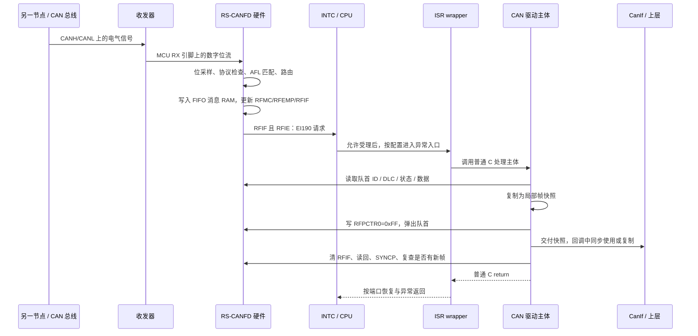

# RH850 CAN 接收中断小实验：总线 → FIFO → EI190 → ISR → 应用

这是一个可以在 PC 上编译、运行、单步调试的 C99 教学项目，参考器件为 **R7F701381 / RH850/P1M-E**。代码有中文注释，运行日志用英文标识，便于在不同终端中阅读。

**先纠正通道号：本器件的 RX FIFO 中断是 EI190，不是 EI90。EI90 是 CSIH1 通信错误中断。** 通道映射是芯片硬件定义，不能通过把函数填到第 90 个表项来改变 CAN 的中断线路。这里使用普通 RX FIFO0；CAN0 的 common FIFO 是另一类硬件资源，其中断为 EI184。

项目完整演示了接收驱动主体、FIFO 寄存器窗口、中断屏蔽和向量分发。CAN 协议引擎、INTC、CPU 和 OS wrapper 在 PC 上由模型代替；**没有生成可直接烧录的 RH850 工程，也没有实现 AUTOSAR OS、完整 MCAL、CanIf、CanTp 或 DCM**。目标机适配文件仅提供真实 MMIO 访问层，所需启动、编译器入口和 OS 集成见第 12 节。

## 1. 先运行，再看代码

在仓库根目录执行，需要 Python 3 和 PATH 中的主机 `gcc`：

```powershell
python tools/run_can_irq_demo.py
Get-Content -Encoding UTF8 artifacts/can-irq-demo/trace.txt
```

脚本使用 `-std=c99 -O2 -Wall -Wextra -Werror -pedantic` 构建，运行 16 项测试及 6 个演示场景。失败时返回非零退出码。

| 文件 | 用途 |
|---|---|
| `artifacts/can-irq-demo/demo.exe`（Windows） | 再次运行六个场景 |
| `artifacts/can-irq-demo/tests.exe`（Windows） | 单独运行测试 |
| `artifacts/can-irq-demo/trace.txt` | 从入帧到返回被打断代码的逐层日志 |
| `artifacts/can-irq-demo/results.txt` | 编译器版本、命令、测试结果、退出码 |

Linux/macOS 的可执行文件不带 `.exe`。构建输出不提交到 Git，可通过上述命令重新生成。

六个演示依次是：正常接收、EIMK 屏蔽、误绑 EI90、清 RFIF 竞争、8 深度 FIFO 收到 9 帧、直接分支向量。最后一个场景展示表引用之外的另一种入口方式。

## 2. 先回答：需要我管理 interrupt table 吗？

**需要建立“硬件中断源 → 正确入口”的绑定，但不一定需要你手写一张硬件向量表。** 这取决于入口方式，以及系统是否已经有 AUTOSAR OS。

| 情况 | 谁负责入口 | 你需要做什么 |
|---|---|---|
| 裸机，表引用方式 | 启动代码、链接脚本和中断入口代码 | 放置地址表，设置 INTBP、EITB、优先级和屏蔽，提供正确的异常入口 |
| 裸机，直接分支方式 | 启动代码中的直接向量入口 | 按优先级进入公共入口，通过 EIIC 识别来源，再分发 |
| AUTOSAR Classic OS | 通常由 OS 配置工具和 RH850 端口生成 | 配置 OsIsr 的硬件源、类别、优先级、栈及驱动函数绑定；核查生成物 |

已经有 OS 时，应先找到它生成的入口和表。不要让应用另外建立一张表、重新写 INTBP，覆盖 OS 使用的入口。

CPU 不知道函数名 `CanRx_Fifo0IsrBody` 的含义。它只按照中断配置取得入口地址，开始执行该地址处的指令。

### 2.1 表引用方式：表里存的是入口地址

`EIC190.EITB=1` 时，硬件按通道号查表：

```text
表项地址 = INTBP + 190 × 4 = INTBP + 0x2F8
入口地址 = 从该表项读取的 32 位地址
CPU 从入口地址开始执行
```

例如，仅为理解地址关系，假设 INTBP 为 `0x00008000`：

```text
0x000082F8 处的 4 字节数据 = 0x00012340
CPU 进入 0x00012340 处的 wrapper
不是直接在 0x000082F8 执行普通 C 函数
```

以上地址是假设，不是本项目的链接布局。真实表的对齐、存放位置、保留入口和链接保留规则，必须遵循 G3M 软件手册与所选 OS/编译器端口。

概念上的表项如下，它不代表可直接编译的目标工程：

```text
entry[190] = address_of(OsGenerated_CanRx_InterruptEntry)

OsGenerated_CanRx_InterruptEntry:
    按端口要求保存软件上下文、处理栈、进入 OS ISR 上下文
    调用 CanRx_Fifo0IsrBody(&driver)
    完成退出调度、上下文恢复和异常返回
```

**不能把普通 C 函数的 `return` 当成 `EIRET`。** 有些工具链用中断函数属性生成入口，有些 OS 用汇编 wrapper；必须使用对应工具链和 OS 的真实机制。

### 2.2 直接分支方式：不按通道直接查 INTBP 表

`EITB=0`，且 `RINT=0` 时，EI 入口偏移为 `0x100 + EIP × 0x10`。本模型取硬件 EIP=5，因此进入基址 `+0x150`。基址由 PSW.EBV 和 RBASE/EBASE 决定。

同一优先级可以有不同中断源，因此公共入口需要读取 EIIC 进行识别。EI190 的原因码是 `0x10BE`，本例用 `0x10BE - 0x1000 = 190` 得到通道号，再软件分发。`RINT=1` 的直接入口统一为基址 `+0x100`，本模型没有实现该分支。

不要把 EI90、十六进制 `0x90`、EIP 优先级和 OS ISR 编号混为一谈。本文 EI 后面是十进制硬件通道号。

## 3. 一帧到达后，谁做什么？



真实硬件的接收过程不会等待 CPU 调用 `SimCpu_RunOne`。模型特意将“硬件入队”和“CPU 受理”分开调用，方便在两者之间下断点，观察 FIFO 已经有数据、ISR 却尚未进入的状态。

## 4. CAN frame 怎么进入硬件 FIFO？

接收方向上，收发器把总线电平变成数字位流，**RS-CANFD 控制器**完成协议处理、接收过滤和消息存储。收发器本身不是这颗 MCU 的 FIFO，也不会执行 AFL。

CPU 事先配置好控制器和接收规则。随后，每条有效接收消息由硬件按规则处理：

1. CAN 协议引擎处理采样、格式、去填充和 CRC 等协议条件。本模型用 `protocol_valid` 表示结果，不模拟位级协议。
2. 从该通道的接收规则开始匹配 ID、IDE、RTR 等字段。这里配置标准数据帧 `0x7E0`。
3. 命中规则后，按照 GAFLP1 的目的地位把消息送到 RX FIFO0。未命中的消息不存入此 FIFO。
4. 硬件写消息 RAM，同时保存 ID、DLC、时间戳、规则 label 等元数据。
5. 硬件更新未读数量 RFMC 和空/满状态。在本例 RFIM=1 的配置下，接收事件置位 RFIF。

这里**不需要 CPU 先执行一次“把接收帧 push 到 FIFO”的函数**。也不要求 DMA 才能接收：消息入 FIFO 是 CAN 外设自己的功能。本例没有使用 DMA；真实工程若启用相应 FIFO 的 DMA 请求，不能再照抄本例的 CPU 弹出方式。

[sim_hw.c](src/sim_hw.c) 中的 `SimHw_Receive` 在主机上模拟这一整段硬件行为。它不是要移植进真实接收驱动的软件入队函数。

### 4.1 接收过滤规则

本例固定：CAN0、一条规则、RX FIFO0、8 个槽位、每槽 8 字节存储；其他 RX FIFO 和其他中断源不启用。

| 配置 | 本例值 | 含义 |
|---|---|---|
| GRMCFG.RCMC | 1 | 使用 FD 寄存器接口 |
| GAFLCFG0 | `0x01000000` | CAN0 一条规则，CAN1/2 零条 |
| GAFLECTR | 配置时 `0x100`，结束后 `0` | page0；AFLDAE 开启/关闭写入 |
| GAFLID0 | `0x000007E0` | ID=0x7E0、IDE=0、RTR=0 |
| GAFLM0 | `0xC00007FF` | 比较 IDE、RTR 及全部 11 位 ID；mask=1 表示比较 |
| GAFLP0_0 | `0x00010000` | 附加 label=1；不送到独立 RX buffer |
| GAFLP1_0 | `0x00000001` | 只送 RX FIFO0 |
| RFCC0 配置阶段 | `0x00001202` | RFIM=1、RFDC=2→8 深度、RFPLS=0→8 字节、RFIE=1、RFE=0 |
| RFCC0 开启阶段 | `0x00001203` | 在允许状态下另一次写入 RFE=1 |

label 不是总线帧中的字节，而是匹配规则附加的硬件元数据。本例把 label=1 解释为 HRH1，真实 MCAL 可以采用别的映射方式。

上表是本例配置的解释，**不是完整上板初始化脚本**。例如 AFLDAE 的开启需要全局 reset；RFIM、RFDC、RFPLS 在全局 reset 配置；RFIE 在 RFE=0 时修改；RFE 需要在全局 operating/test 中另一次指令开启。模型用 `operating` 布尔量代替真实模式切换。

### 4.2 为什么“FD 接口 + Classical 帧”不矛盾？

寄存器接口模式决定软件访问哪个寄存器窗口；每帧 FDF 决定该帧的格式。RCMC=1 的接口可以接收 Classical 帧，本例使用这一接口，避免与前面内部工程采用的地址窗口混淆。

仅用上述 ID/IDE/RTR 规则，**不能保证拒绝相同 ID 的所有 FD 帧**。因此 ISR 还会读取 RFFDSTS.RFFDF：发现 FD 帧就弹出并计入 `rejected_format`，不把它冒充 Classical 帧交给上层。测试使用 8 字节 FD 帧验证该分支。

模型不实现大于 8 字节 FD 的 CMPOC/CMPOF 存储策略；真实控制器要按 HW-E p.1074 配置和处理，不能把模型的输入范围限制当成硬件过滤能力。FDOE=0 也不等于“禁止一切 FD”。

## 5. 硬件 FIFO 不是一个普通 C 数组指针

硬件内部有多个消息槽位，但 CPU 通常通过**队首访问窗口**取数据：

```text
硬件消息 RAM： [消息 A] [消息 B] [消息 C] ...
                  ↑ 当前读指针

RFID0、RFPTR0、RFFDSTS0、RFDF0_0、RFDF1_0
始终展示当前队首 A 的相应字段

写 RFPCTR0=0xFF 后：
硬件读指针前进，窗口转而展示 B
```

连续读取 RFID0 两次，不会自动消费两条帧。FIFO 深度是 8，也不代表 CPU 可以用 `RFID0 + 4` 读取“第二条帧的 ID”；那个地址是**同一条队首消息的另一个字段**。

本例全部 CAN 寄存器使用 32 位访问；EIC190 是另一组 INTC 寄存器，使用 16 位访问。

| 寄存器 | 地址 | 本例关注内容 |
|---|---|---|
| GRMCFG | `0xFFD204FC` | RCMC=1；读取时核实模式，不能在运行中随意改 |
| GAFLECTR | `0xFFD20098` | AFLDAE bit8、AFLPN bits4:0 |
| GAFLCFG0 | `0xFFD2009C` | RNC0 bits31:24 |
| GAFLID0 / GAFLM0 | `0xFFD21000` / `0xFFD21004` | 规则 ID 和比较掩码 |
| GAFLP0_0 / GAFLP1_0 | `0xFFD21008` / `0xFFD2100C` | label 和存储目的地 |
| RFCC0 | `0xFFD200B8` | RFE bit0、RFIE bit1、RFPLS bits6:4、RFDC bits10:8、RFIM bit12 |
| RFSTS0 | `0xFFD200D8` | RFEMP bit0、RFFLL bit1、RFMLT bit2、RFIF bit3、RFMC bits15:8 |
| RFPCTR0 | `0xFFD200F8` | 写低 8 位 `0xFF` 推进 FIFO 读指针 |
| RFID0 | `0xFFD23000` | IDE bit31、RTR/RRS bit30、ID bits28:0 |
| RFPTR0 | `0xFFD23004` | DLC bits31:28、label bits27:16、时间戳 bits15:0 |
| RFFDSTS0 | `0xFFD23008` | FDF bit2、BRS bit1、ESI bit0 |
| RFDF0_0 / RFDF1_0 | `0xFFD2300C` / `0xFFD23010` | 数据 byte0–3 / byte4–7 |
| EIC190 | `0xFFFFB17C`，16 位 | EICT bit15、EIRF bit12、EIMK bit7、EITB bit6、EIP bits3:0 |

这是 **FD 接口模式**地址表。RCMC=0 的 Classical 接口中，AFL 从基址 `+0x500` 开始，RX FIFO 数据窗口从 `+0xE00` 开始，布局不同。本代码不会自动适配 RCMC=0。

## 6. CPU 为什么会跳转到 ISR？

本例固定硬件线路为：

```text
RFSTS0.RFIF = 1 且 RFCC0.RFIE = 1
    → INTRCANGRECC 请求有效
    → INTC2 的 EI190
    → 检查 EIMK、优先级、CPU 屏蔽等受理条件
    → CPU 按向量配置进入入口
    → wrapper 调用 CAN ISR 主体
```

三个容易混淆的开关：

- **RFE**：是否使用 FIFO。关闭它不是单纯暂停 CPU 中断处理，会影响 FIFO 内容和状态。
- **RFIE**：CAN 外设是否向外输出接收中断请求。它与接收存储功能不同。
- **EIMK / PSW.ID / PMR**：INTC 或 CPU 是否允许受理请求。被屏蔽时，硬件仍可能继续接收，直至 FIFO 溢出。

模型的 `SimCpu_RunOne` 只受理一次事件，便于观察。它没有实现完整优先级竞争、EIBD 路由、ISPR 嵌套、OS 调度或指令级上下文保存。`vectors[190]` 是主机函数指针表，指针可能是 64 位，**不能把该数组的二进制当成 RH850 的 INTBP 表**。

真机上 CPU 在 EI 异常受理时保存相应的返回 PC/PSW 到系统寄存器并记录异常原因；通用寄存器保存、栈管理、OS 状态和嵌套处理还要由正确的入口代码完成。ISR 主体返回到 wrapper，wrapper 才完成异常退出过程；若 OS 决定调度，最终也可能恢复另一个任务。

## 7. CAN ISR 怎么拿到这条帧？

重点阅读 [can_rx.c](src/can_rx.c) 中的 `CanRx_Fifo0IsrBody`，它的顺序是：

1. 读 RFSTS0，确认非空；顺便记录是否观察到丢帧标志。
2. 读 RFID0、RFPTR0、RFFDSTS0 和两个数据字。
3. 在局部结构体中形成 ID、长度、HRH、时间戳和 8 字节数据的快照。
4. 写 RFPCTR0=`0xFF`，消费这条消息。
5. 对本课支持的格式调用上层回调；不支持的格式记录并丢弃。
6. 持续取出剩余消息；稳定为空后清 RFIF、同步和复查，再返回。

不能先弹出 A，再读取 A 的后半段数据；窗口可能已经指向 B，最终把两帧拼成一帧。

本课使用数据 `10 11 12 13 14 15 16 17`。第一次接收时，可看到：

```text
RFID0    = 0x000007E0
RFPTR0   = 0x80010001  // DLC=8、label=1、模型时间戳=1
RFFDSTS0 = 0x00000000  // Classical
RFDF0_0  = 0x13121110
RFDF1_0  = 0x17161514
```

byte0 在数据字的低 8 位，因此通过右移和掩码得到 `data[0]=0x10`。不能凭调试器显示的十六进制书写顺序把字节倒过来。

`Demo_CanIf_RxIndication` 是 **CanIf 风格的教学回调**，不是供应商 CanIf API。它将整个快照复制到应用观察区，保证 ISR 返回后仍然有效。真正集成时应按所用 AUTOSAR release 的 API 构造 `Can_HwType`、`PduInfoType` 等参数；CanIf 再依据 HRH/ID 找到上层 PDU。

## 8. 为什么弹出后还必须清 RFIF？

RFIF 是中断事件锁存标志，不是“FIFO 非空”的简单别名。读取、弹出和清事件是三件事。

| 动作 | FIFO 数据 | RFIF |
|---|---|---|
| 读取队首窗口 | 保持 | 保持 |
| 写 RFPCTR0=`0xFF` | 消费一条 | 不因此自动清除 |
| 清 RFIF | 不消费数据 | 撤销对应事件请求 |

CAN 是电平型中断。若 ISR 不清 CAN 外设内部的请求源，退出后请求还在，CPU 可能立刻再次进入。只在 INTC 层尝试清 EIRF 不能替代外设清源。

RFSTS0 中 RFIF 和 RFMLT 是 **W0C**：写 0 清除，写 1 保持。示例要清 RFIF、保留 RFMLT，所以写入的是：

```c
write32(REG_RFSTS0, 0x00000004u);
/* bit3 RFIF 写 0，bit2 RFMLT 写 1；保留位写 0。 */
```

不是写 1 清除，也不是对全寄存器写 `~RFIF`。清源后进行同寄存器 dummy read，再由目标端执行 SYNCP，确保外设写入同步。PC 模型只记录这个同步点，不能证明真实总线写缓冲时序正确。

### 8.1 清标志时，又来一帧怎么办？

考虑以下顺序：

```text
CPU 判断 FIFO 空
硬件收到新帧 B，入队，RFIF=1
CPU 执行原计划：写 RFIF=0
此时 FIFO 有 B，但是 RFIF 已经为 0
```

如果直接退出，B 可能等到下一次接收事件才被处理。因此本例在清标志和同步后，再检查 RFEMP 和 RFIF；发现不空就继续取帧。

场景 4 精确插入了这一事件顺序；测试要求 B 在同一次 ISR 调用中交付，不允许滞留。这是逻辑竞争实验，不是对所有真实硬件时序的穷尽证明。

为了看清这个流程，本课一直处理到稳定为空。**持续高负载下 ISR 可能运行过久，这个循环没有实时预算保证。** 量产实现需要按 OS/MCAL 设计限制每次处理量，并确保剩余工作有可靠的重新请求或后续调度机制；不能简单加一个 `break` 后就清掉唯一的通知。

## 9. FIFO 满了怎么办？中断一次只取一帧吗？

当 8 个槽位都未读，又来第 9 条匹配消息，硬件丢弃新消息并置 RFMLT，不覆盖本例中原来的最旧帧。场景 5 验证应用收到 0–7 号消息，第 8 号新消息被丢弃。

模型的 `hw.lost` 知道精确发生了几次丢弃，是测试用的全知计数。真实 RFMLT 只是一个锁存位，不能告诉软件“到底丢了多少帧”；驱动仅记录 `loss_seen`。

本例保留 RFMLT，且未启用全局错误中断。真实项目若启用该错误中断，应由对应错误处理路径记录并清除源，否则还会产生另一条持续请求。

**一次中断不等于一条帧。** CPU 延迟受理期间可能积累多帧，RFIF 也不会累加成多位计数。ISR 根据 RFEMP/RFMC 消费实际队列。本例 8 帧在一次 ISR 进入中完成交付。

另外，EI190 汇集 RX FIFO0–7。这里只启用 FIFO0，所以只处理它；真实工程若同时启用其他 FIFO，必须检查所有启用来源，不能照抄这个单 FIFO 主体当成完整的全局 ISR。

## 10. 从哪些文件开始读？

| 顺序 | 文件 | 观察重点 |
|---|---|---|
| 1 | [src/main.c](src/main.c) | 六个场景如何让硬件入帧和 CPU 受理分开 |
| 2 | [src/demo_setup.c](src/demo_setup.c) | AFL、FIFO、回调和中断绑定；只初始化模型 |
| 3 | [src/sim_hw.c](src/sim_hw.c) | 硬件过滤、消息 RAM、队首窗口、W0C、读指针 |
| 4 | [src/sim_cpu.c](src/sim_cpu.c) | EI190、屏蔽、地址表、wrapper 和返回边界 |
| 5 | [src/can_rx.c](src/can_rx.c) | CPU 读帧的核心驱动主体及清标志竞争 |
| 6 | [include/rh850_can_regs.h](include/rh850_can_regs.h) | 已核对的地址与位定义 |
| 7 | [tests/test_demo.c](tests/test_demo.c) | 16 个行为验证，包括错误场景 |
| 8 | [target/rh850_mmio_port.c](target/rh850_mmio_port.c) | 主机访问接口如何替换为目标 MMIO |

推荐断点：`SimHw_Receive` 入队前后、`SimCpu_RunOne` 受理前、wrapper 入口、`CanRx_Fifo0IsrBody` 读帧处、`REG_RFPCTR0` 写入分支、上层回调。

若要便于单步，可将运行脚本中的 `-O2` 临时换成 `-O0 -g`，重新构建。

## 11. 六个练习及预期现象

1. **把发帧 ID 改成 0x7E1。** AFL 不匹配，无 FIFO 写入，无 EI190 请求。
2. **保留帧 ID，把绑定通道改为 90。** CAN 仍请求 190，进入默认分支；反复受理仍处理不到帧。修回 190 后可恢复。
3. **先设置 EIMK，再送三帧。** ISR 次数保持 0，FIFO 数量变为 3；解除屏蔽后一次进入可取走三帧。
4. **仅重复读取 RFDF0_0。** 看到同一个队首字，不会自动推进 FIFO。
5. **删除清 RFIF 后的复查逻辑，运行竞争测试。** 预期测试失败：新帧滞留。完成观察后恢复代码。
6. **将输入设为 8 字节 FD 帧。** 相同 ID 仍可能通过 AFL，但 ISR 依据 FDF 拒绝上交，不冒充 Classical。

不要直接删除清 RFIF 后让主机无限调用 ISR；本模型每次显式执行 `SimCpu_RunOne`，可以有限次观察重复进入。

## 12. 怎么迁移到真实 RH850 + AUTOSAR 工程？

### 12.1 这个项目已经提供什么

- 可复用的接收主体结构：读头、读数据、拷贝、弹出、回调、清源、同步及复查。
- 具体到 P1M-E / RCMC=1 的 FIFO0 和 AFL0 地址、访问宽度和规则含义。
- 真实 `volatile` MMIO 访问适配器；默认只作主机编译语法检查，不链接执行。
- 可重复的主机实验与测试。

### 12.2 真机还必须提供什么

| 责任 | 接入要求 |
|---|---|
| 启动与链接 | RH850 编译器、reset/CRT、堆栈、链接脚本、异常入口和正确向量布局 |
| OS | 将 EI190 绑定到正确 wrapper；配置 ISR 类别、优先级、栈、入口及退出机制 |
| INTC / CPU | 正确 EIBD 绑定、EIC190、INTBP 或直接向量方式、全局屏蔽和优先级状态；通过 OS 受控路径设置 |
| 时钟与 CAN 模式 | CAN 时钟、nominal bitrate、RAM 初始化、global/channel 状态切换、超时处理；不能用模型布尔量替代 |
| Port / 收发器 | CAN0 的 P2_0 RX、P2_1 TX 的复用和方向；板载收发器正常模式、供电、布线和终端 |
| 接收配置 | 正确 RCMC=1 窗口、规则、FIFO RAM 分配、payload、DLC 策略；禁用未实现的中断来源 |
| DMA / 并发 | 本例 FIFO0 DMA 请求须禁用；FIFO 只能由指定消费路径处理，不能与供应商 MCAL 同时消费 |
| 同步 | 根据工具链实现 `Rh850_Port_Syncp`，包括真实 SYNCP 和编译器排序约束；不提供空实现 |
| 上层 | 使用真实 CanIf 接口和 HRH/PDU 映射；不直接把示例回调当成完整 CAN stack |

真正接入前应先读取 GRMCFG 确认接口模式；不能因本例需要 RCMC=1，就在既有系统运行中强行改模式。FIFO0 的分配也必须与整个 MCAL 配置一致。

接线和六项 Port 寄存器检查沿用 [CAN 引脚与收发器教程](../../docs/04-can-mcal/04-can-pin-transceiver.md)；模式切换和位时序见 [控制器初始化](../../docs/04-can-mcal/06-can-controller-init.md)、[时钟与位时序](../../docs/04-can-mcal/03-can-clock-bit-timing.md)。

### 12.3 目标端接入结构示意

```c
/* 这是集成关系示意，不包含 OS 供应商的 ISR 声明或向量生成语法。 */
static CanRxDriver driver;

/* 在时钟、Port、CAN 模式/FIFO 配置完成后，并在放开 RX 中断前： */
CanRx_Init(&driver, CanRx_CreateTargetIo(), Project_RxIndication, project_context);

/* 在 OS 生成并绑定到 EI190 的 ISR wrapper 内部： */
CanRx_Fifo0IsrBody(&driver);
```

`CanRx_Init` 只初始化软件对象，不配置硬件。`CanRx_CreateTargetIo` 只返回访问函数，不建立向量。不要将这两个函数误当作完整的 `Can_Init` 和 OS 初始化。

主机脚本对 MMIO 文件的检查仅能发现 C 语法、类型和警告问题，不能验证 RH850 指令、ABI、链接布局、异常返回或板上时序；真实工具链和上板测试仍需完成。

## 13. 验证范围和来源

主机测试覆盖 16 个行为：单帧快照与返回、AFL 三类拒绝、协议无效输入、EIMK、PSW.ID、PMR、错误向量、直接入口模型、读/弹出/清标志分离、溢出和 W0C、清源竞争、FD 格式识别、Classical 高 DLC、短帧、零长度帧、RFIE 禁用。

没有覆盖：真实总线电气、位时间/ACK/CRC 算法、所有硬件竞争时序、完整初始化、DMA、多个 FIFO、硬件嵌套中断、OS 调度、实际 CanIf/CanTp/DCM、上板实时预算或供应商一致性认证。

硬件依据是本仓库研究时使用的 **R01UH0585EJ0120 Rev.1.20（HW-E）**，页码为 PDF 页码（也与该手册页脚一致）。请从 [Renesas 官方手册入口](https://www.renesas.com/en/document/mah/rh850p1m-e-group-users-manual-hardware-rev120) 获取，或在 [P1M-E 官方产品文档页](https://www.renesas.com/en/products/rh850-p1m-e) 检索该编号。PDF 不随本仓库重新分发。

| 本课事实 | HW-E 页码 |
|---|---|
| 外设写入同步、清源后的读回/SYNCP | p.254 |
| EIC 地址、位域、屏蔽和电平语义 | p.265–268 |
| 表引用 `INTBP+4n`、直接分支方式 | p.281 |
| EI90=CSIH1 error | p.284 |
| EI184=CAN0 common FIFO、EI190=全局 RX FIFO、EIIC/偏移 | p.285–286；p.792 |
| FD 接口模式选择 | p.920 |
| AFL 页、数量、ID、mask、label、目的地 | p.963–971 |
| RFCC、RFSTS、读指针、队首字段和数据窗口 | p.979–988 |
| FIFO 中断源与使能 | p.1057–1058 |
| 过滤、路由、FD payload 溢出和 label | p.1073–1074 |

更多背景可接着阅读 [CAN 中断教程](../../docs/04-can-mcal/05-can-interrupt.md) 和 [CAN 接收实现教程](../../docs/04-can-mcal/11-can-rx-implementation.md)。
