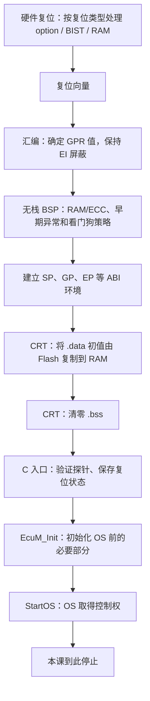

# ECU 启动教学：从复位到 AUTOSAR Classic OS 接管

本课是 [CAN 中断项目](../README.md) 的启动前篇。参考器件仍为 **R7F701381 / RH850/P1M-E / G3M**。范围严格停在 **OS 取得控制权**，不执行 StartupHook、autostart task、EcuM_StartupTwo、RTE 或 CAN stack 初始化。

代码分成两部分：主机上可运行并测试的完整流程模型，以及供真实工程集成的目标端汇编/C 参考。**主机测试通过不代表目标启动汇编已验证，也不代表本仓库包含供应商 AUTOSAR OS。**

## 1. 一条命令运行

在仓库根目录运行：

```powershell
python tools/run_can_irq_demo.py
Get-Content -Encoding UTF8 artifacts/can-irq-demo/boot_trace.txt
```

同一个脚本运行原有的 16 项 CAN 测试和新增的 14 项启动测试。启动演示包含正常冷启动、保留 RAM 的暖启动，以及自动启动看门狗超时三个场景。

只看启动演示，可以再次运行：

```powershell
.\artifacts\can-irq-demo\boot_demo.exe
```

Linux/macOS 不带 `.exe`。日志和构建产物由脚本生成，不提交到 Git。

## 2. 从复位到 OS 的完整链条



| 阶段 | 谁做 | 此时能否使用普通 C |
|---|---|---|
| 复位释放前 | 芯片硬件 | 不能，软件尚未开始 |
| 复位入口、GPR 初始化 | 启动汇编 | 不能依赖 C 栈或全局变量 |
| RAM/ECC、早期异常与 WDG 策略 | 硬件及无栈 BSP | 不能随意调用普通 C |
| SP/GP/EP 建立 | 启动汇编、链接器符号 | ABI 环境开始可用，全局变量仍需 CRT |
| `.data` / `.bss` 初始化 | 编译器 CRT | 由专用启动例程按其调用契约执行 |
| `Boot_EntryC` / `main` | 普通 C | 可以，但还没有 OS 服务 |
| `EcuM_Init` 的 StartPreOS | EcuM、配置和 MCAL/OS 端口 | 可以；OS 尚未进入正常调度 |
| `StartOS` | OS 端口与内核 | 执行权交给 OS；到此结束本课 |

**不是先有 OS 才有 C。** 栈和 C 运行环境先建立，EcuM 和 OS 的 C 代码才能正常执行。

## 3. 项目中有哪些代码？

| 文件 | 类型 | 阅读重点 |
|---|---|---|
| [boot_model.c](boot_model.c) | 可运行主机模型 | 所有阶段、失败条件和 EcuM→StartOS 调用关系 |
| [boot_model.h](boot_model.h) | 主机状态及配置 | 启动状态、故障注入、模拟 RAM 和时间 |
| [boot_main.c](boot_main.c) | 演示程序 | 正常冷启动、暖启动、看门狗失败 |
| [test_boot.c](test_boot.c) | 14 项行为测试 | 阶段顺序、初始化数据、失败时不能接管 |
| [target/reset_ccrh.asm](target/reset_ccrh.asm) | 未经目标汇编验证的 CC-RH 参考 | 复位向量、GPR、无栈 BSP、SP/GP/EP、CRT、C 入口 |
| [target/crt_tables_ccrh.asm](target/crt_tables_ccrh.asm) | CC-RH 段表参考 | ROM→RAM copy table 和 BSS clear table |
| [target/boot_target.c](target/boot_target.c) | 目标 C 参考 | CRT 探针、RESF/OPBT/WDTA 快照、进入真实 EcuM |
| [target/boot_target.h](target/boot_target.h) | 集成接口 | BSP 检查和故障处理契约 |

模型中的 `Boot_Run` 可以返回，让测试验证结果。**目标端 `EcuM_Init → StartOS` 正常路径不会返回启动调用者。** 不要把主机为了结束测试而返回的行为移植到 OS。

## 4. 复位向量、栈与 lock-step

P1M-E 的 PE1 从 user mat 启动时，默认复位入口在 `0x00000000`。若项目有 bootloader 或使用可变复位向量，真实地址及应用跳转契约应以项目为准。

G3M 复位时 PSW=`0x20`，处于 SV 模式，EI 中断被屏蔽；r1–r31 未定义。启动汇编先为这些寄存器赋确定值，避免把未定义内容保存到 PE 外部存储而引起 lock-step 比较错误。**只清 GPR 还不等于所有系统寄存器都已初始化**，系统寄存器与异常环境需要由对应 CPU/BSP 启动实现处理。

本芯片的 checker core 不是让应用分别启动的第二个独立 AUTOSAR 核。不要直接照搬其他 RH850 多核器件的 PE0/PE1/PE2 启动代码。

目标汇编包含：

- 位于 `BOOT_RESET` 段的复位入口；随后为启动期异常和直接 EI 入口保留每 16 字节的故障分支。
- r1–r31 初始化。
- 调用 `__Boot_BspBeforeStack`，明确此时还不能使用普通 C 栈。
- 建立 SP、GP、EP，再调用编译器 CRT。
- 进入 `Boot_EntryC`；如果错误地返回，则停在故障分支。

`__Boot_BspBeforeStack` **必须由真实 BSP 提供无栈汇编实现**，不能写成普通 C 函数，也不能用空函数假装已完成。接口要求如下：

1. 确认启动栈和 CRT 将使用的 RAM/ECC 已可安全访问；处理实际复位路径。
2. 处理其后代码需要的系统寄存器、访问保护和启动期异常环境；按 G3M 要求完成同步。
3. 核实早期看门狗的首次触发期限及其与 Wdg 驱动的交接策略。
4. 保持本教学配置的 EI 屏蔽和 SV 模式，不清尚未采集的 RESF。
5. 不依赖 SP、GP、EP，不读未定义寄存器，不使用普通 C 全局变量；保留返回 LP。若嵌套调用，应在确定值的寄存器中保存 LP，不能借助未准备好的栈。

示例没有 FPU、C++ 构造、TLS、PIC/PID 初始化。r5/TP 保持 0 的条件是本例不采用依赖 TP 的代码模型。若真实编译器选项或 OS ABI 不同，必须采用其对应 startup。内部项目若使用 **GHS**，应把这些职责映射到 GHS 的启动和 CRT 文件，不能直接使用 CC-RH 汇编/库接口。

## 5. RAM/ECC 初始化与 C 初始化不是一回事

P1M-E 提供硬件 RAM 初始化，包含 ECC 建立；是否清零受复位类型和初始化控制设置影响。不能假设所有暖复位都重新清空全部 RAM，也不能对 ECC 状态不确定的 RAM 直接使用栈。

即使硬件已将 RAM 清零，仍需要恢复 C 的非零初值：

```c
uint32_t bitrate = 500000u;  /* .data：RAM 清成 0 并不满足这个初值。 */
uint32_t rx_count;           /* .bss：进入正常 C 程序前应为 0。 */
```

Flash 里保存 `.data` 的初值镜像。CRT 将其复制到变量运行时所处的 RAM 地址，并把 `.bss` 清零。

模型专门把 `rom_data` 和 `ram_data` 分开，复位前先在 RAM 放入 `0xA5A5A5A5`：

- 冷启动：硬件模型先清 RAM，CRT 再恢复非零 `.data`。
- 暖启动：模型声明 RAM/ECC 保留有效，CRT 仍恢复 `.data`、清 `.bss`。
- 禁止 `.data` 复制：探针失败，不进入 EcuM。
- 暖启动时禁止 `.bss` 清零：旧值暴露，探针失败。

`.noinit` 的含义仅是**不被指定 CRT 清零表覆盖**。它不能阻止硬件复位清 RAM，也不保证数据有效。真实保留数据应检查复位原因、magic/version/长度/完整性等；模型只展示区域是否被清，不实现完整保留数据协议。

### 5.1 CRT 段表为什么需要链接器？

CC-RH 参考表列出每个复制段的 ROM 范围和 RAM 目的地，每个清零段的 RAM 范围。`__INITSCT_RH` 根据表执行初始化。表的地址来自链接器，不是任意 C 指针常量。

本例列出 `.data/.sdata` 与 `.bss/.sbss`。供应商库、自定义段和其他数据寻址方式可能增加段，必须根据最终 map 补齐。`.boot_stack.bss` 不加入 CRT 清零表，避免在 CRT 使用活动栈时把自己的栈内容擦掉。

目标文件中的 `0x800` 只是示例启动栈空间，**不是验证过的真实 EcuM/OS 栈需求**。

## 6. 启动阶段的看门狗怎么处理？

如果 OPBT0 配成自动启动，WDTA 在软件进入 EcuM 之前就可能运行。不能等到 Wdg_Init 才第一次考虑它，也不能在异常死循环中无条件喂狗。

本课主机模型只解码以下字段，**没有写 option bytes，也没有模拟喂狗操作**：

| 字段 | 位 | 模型含义 |
|---|---|---|
| OPWDRUN | bit31 | 是否从模型复位时开始计时 |
| OPWDOVF | bits27:25 | 溢出指数 OVF |
| OPWDMDS | bit21 | 0 为 8 MHz，1 为 250 kHz |

名义超时 `T = 2^(9+OVF) / fWDT`。因此 8 MHz、OVF7 为 8.192 ms；8 MHz、OVF0 只有 64 µs。默认模型每阶段耗时 100 µs，共 14 阶段，便于演示长超时成功、短超时失败。

**这些人工时间不是板上 WCET。** 真机要扣除到达软件入口前已消耗的时间，考虑振荡器误差、实际触发窗口、模式和驱动交接。模型仅检查“不喂狗时能否在名义首次期限前完成”的简化条件；真实 Wdg_Init 或 BSP 若会触发，应重新分析实际时间线。

模型中 OPBT0 只组合了关心的字段，不能拿该值当成完整器件 option image 烧录。目标 C 入口只读以下寄存器，不修改它们：

| 寄存器 | 地址 | 宽度 | 用途 |
|---|---|---|---|
| RESF | `0xFFF81000` | 32 位 | 在其他模块清除前保存原始复位状态 |
| OPBT0 | `0xFFCD0030` | 32 位 | 保存实际 option 配置 |
| WDTA0MD | `0xFFD7400C` | 8 位 | 保存实际 WDG 模式 |

目标入口在 CRT 后保存快照，所以早期 BSP 必须保留 RESF。如果项目必须在 CRT 前采集，应采用经过约定的寄存器或专用存储交接，不能先写普通 BSS 变量，再把它随 `.bss` 清掉。

## 7. EcuM 与 StartOS：谁调用谁？

调用关系是：

```text
CRT 完成
  → Boot_EntryC（本例承担最小 main 的职责）
    → 真实 EcuM_Init
      → 项目配置的 StartPreOS 初始化
      → 真实 StartOS(appMode)
        → OS 内部取得控制权
```

本地参考工程 `D:\side_project\openAUTOSAR\system\EcuM\src\EcuM.c` 的 `EcuM_Init` 包含：DriverInitZero、InitOS/Os_IsrInit、确定配置、DriverInitOne，以及后续模式选择和 StartOS 调用。主机模型以此为教学顺序，省略了完整 EcuM 状态管理、唤醒原因映射等逻辑。

`InitOS` 和 `Os_IsrInit` 是该参考工程的具体实现接口，**不是要求所有 AUTOSAR OS 都提供这两个同名标准 API**。实际项目的阶段顺序和接口应由其 EcuM/OS 发行版和生成配置决定。

DriverInitZero/One 中放哪些模块也由项目配置决定。P1M-E 不能照搬其他芯片的可编程 PLL 寄存器初始化；若供应商 Mcu 接口存在，应核对它在此器件上的具体实现，不能写一个永远等待锁定的通用循环。

## 8. “OS 接管”的判定

仅仅打印“准备调用 StartOS”或 PC 到达 StartOS 函数入口，不等于 OS 启动已成功。

本模型在 `StartOS_Model` 检查 OS 准备和向量就绪条件后，记录 `BOOT_OS_OWNED`，停止本课。这个状态是模型的验证边界，不是 AUTOSAR 标准状态名，也不是实际内核启动的认证。

目标代码只记录 `BOOT_TARGET_ENTER_ECUM`，**不在 EcuM 调用前自称 OS 已接管**。真机应结合 OS 端口文档，在内核完成启动并接近交付控制的位置观察 PC、栈、向量和状态。可选 StartupHook 入口作为后续观察点，但本课不实现或执行其中的业务。

`EcuM_Init` 意外返回会调用 `Boot_BspFatal`，不能继续启动 CAN，也不能再次调用 StartOS 重试。

## 9. 与 EI190 中断表的关系

启动期需要可靠的异常入口；OS 接管时还需要它自己的最终向量、ISR wrapper 和栈安排。这两者有关联，但不是同一张表必须从头用到尾。

本例复位汇编保留启动期直接入口，EI 仍屏蔽，没有提前把普通 CAN C 函数装到 INTBP，也没有启用 CAN 接收中断。OS 的最终入口设置应沿用真实生成配置；其中 CAN RX FIFO 的硬件源仍是 **EI190**。

主机启动模型不把 CAN 接收实验自动接在尾部执行。你可以先学本课的“执行环境怎样建立”，再回到 CAN 实验学习“OS 已就绪后，中断怎样进入驱动”。

屏蔽 EI 不是屏蔽所有异常：FE 类异常仍需要正确入口和处置。目标 BSP 不能因为 `di` 就省掉早期故障路径。

## 10. 目标代码的集成边界

当前环境没有 CC-RH/GHS/RH850 链接器。脚本只把 `boot_target.c` 编译为**未链接、未运行**的主机语法检查对象；没有汇编 `.asm`，没有生成 ELF/HEX。

| 项目必须提供的内容 | 具体要求 |
|---|---|
| `__Boot_BspBeforeStack` | 满足第 4 节契约的无栈芯片初始化，不能空实现 |
| `Boot_BspValidateBeforeEcuM` | 核实前置环境和看门狗预算；不能用恒定 true 冒充验证 |
| `Boot_BspFatal` | 项目自己的故障记录和受控处置，不应返回 |
| 真正的 `EcuM_Init` | 来自集成工程，其内部调用真实 StartOS |
| OS 和生成物 | 编译器匹配的 RH850 端口、向量、ISR wrapper、栈和配置 |
| 编译器 CRT | 与编译选项一致的 `__INITSCT_RH`、GP/EP 规则和所有段表 |
| 链接布局 | BOOT_RESET 的真实入口、Flash 范围、RAM 范围、栈、所有复制/清零段 |

链接器需核对：

1. 将 `BOOT_RESET` 放到实际复位基址，保留完整启动向量区域；不要与 OS 或其他 boot 向量重复覆盖。
2. `.boot_text`、代码、常量及 `.INIT_*` 表位于合法可执行/可读 Flash。
3. `.data/.sdata` 的 ROM 初值与 RAM 运行地址分开，复制关系和表一致。
4. `.bss/.sbss` 与 `.boot_stack.bss` 在实际可用 RAM 内且不重叠。
5. 其他编译器/库段也有明确归属；无意遗漏段可能只在暖启动时暴露。
6. `__gp_data`、`__ep_data` 和 section 符号由匹配的链接器规则解析；不要把别的芯片示例 RAM 地址搬过来。

本参考器件主 Code Flash 的边界是 `0x00000000–0x000FFFFF`。这不代替工程完整的 RAM/Flash/保留区链接设计，也不要求擦除整片 Flash。

没有这些输入，目标参考文件保持未完成链接的状态，是为了让缺失的真实依赖明确可见；可运行的教学部分则完整包含在本项目中。

## 11. 测试验证了什么？

14 项启动测试验证：正常阶段顺序和单次 OS 交接、硬件清 RAM 对 noinit 的影响、暖启动恢复、RAM/ECC 不安全、遗漏 data copy、遗漏 BSS clear、提前放开 EI、WDG 截止时间、慢时钟期限、软件启动 WDG 不自动计时、配置错误、驱动失败、OS 向量缺失、StartOS 意外返回。

特别地，“遗漏 BSS 清零”在保留 RAM 的暖启动场景中测试。只测冷启动，硬件清 RAM 可能掩盖这个错误。

这些测试不验证真实机器指令、时钟耗时、BSP/ECC 硬件操作、OS ABI、真实向量内容、编译器库段完整性或上板启动成功。

## 12. 资料依据

硬件内容根据本地已核对的 **R01UH0585EJ0120 Rev.1.20**：p.190（GPR）、p.197–198（PSW）、p.250（lock-step）、p.258（复位入口）、p.418–434（复位控制/RESF）、p.2884（OPBT0）、p.2890（RAM/ECC）。完整背景见 [RH850 启动教程](../../../docs/01-rh850/04-startup-process.md)。

编译器接口参考 [Renesas CC-RH 用户初始化说明](https://tool-support.renesas.com/autoupdate/support/onlinehelp/csp/V8.07.00/CS%2B.chm/Compiler-CCRH.chm/Output/ccrh08c0202y.html) 和 [启动编码示例](https://tool-support.renesas.com/autoupdate/support/onlinehelp/csp/V8.15.00/CS%2B.chm/Compiler-CCRH.chm/Output/ccrh08c0300y.html)。本项目使用其语法和接口约定，未复制其中其他器件的 RAM 布局，也未沿用示例中进入用户模式、放开中断的策略。

EcuM/StartOS 边界参考 [AUTOSAR CP R24-11 EcuM 规范](https://www.autosar.org/fileadmin/standards/R24-11/CP/AUTOSAR_CP_SWS_ECUStateManager.pdf) §7.3、Figure 7.3、`SWS_EcuM_02811`；具体 API 排列的教学参考是上述本地 openAUTOSAR 源文件。两者不是同一版本的完整实现，模型不声称通过 AUTOSAR 一致性验证。
