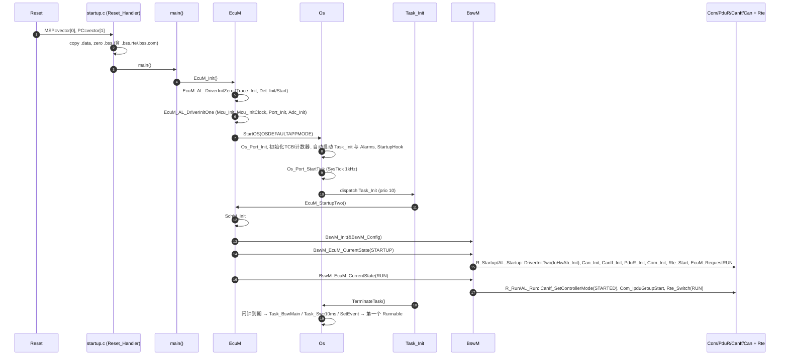
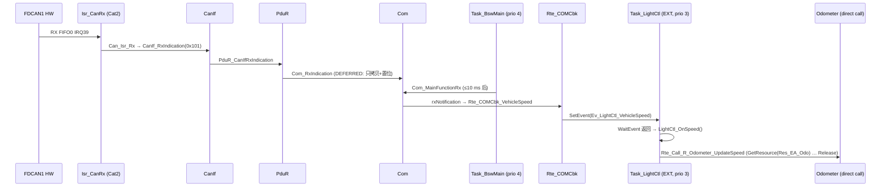

# mini_autosar_ecu 设计文档（DESIGN）

> **[Educational Implementation]** 本项目是教学用途的 Classic AUTOSAR ECU：用最少的代码展示 **RTE / SWC / OS / BSW / MCAL**
> 在真实项目里“长什么样、怎么协作”。教学价值 > 工业完备性。
> 规范依据：AUTOSAR CP **R25-11**（`artifacts/pdf-text/autosar-cp-R25-11/AUTOSAR_CP_SWS_*.txt`）；教学笔记见
> `docs/11-classic-autosar-primer/`（04 EcuM/BswM、06 OS、07 RTE、08 MCAL）与 `docs/reference/research/06,07`。
> 许可：`D:\side_project\openAUTOSAR`（Arctic Core, **GPL**）只允许参考**架构**，**严禁复制代码**到本 MIT 仓库。
> 本文起初是 Phase 1 的契约；Phase 2/3 完成后已与实现同步（"as built"）：§17 汇总全部与初稿不同的实现决定，正文相应段落已就地更正。公共头文件（见 §16）与本文冲突时以头文件为准。

---

## 1. 目标与范围

**要展示的东西**

1. **SWC → RTE → OS → BSW → MCAL → CAN 总线**的完整纵向通路，以及 RTE 如何把 *Runnable* 映射到 *OS Task*（`RteEventToTaskMapping`）。
2. RTE 的主要通信/触发机制：TimingEvent、DataReceivedEvent、OperationInvokedEvent、ModeSwitchEvent；implicit/explicit S/R、同步 C/S、
   Per-Instance Memory（PIM）、Exclusive Area（映射到 OS Resource 的优先级天花板）、BSW Server 映射（IoHwAb）。
3. 迷你 OSEK/AUTOSAR OS：基础/扩展任务、固定优先级抢占、Event、Counter/Alarm、Resource（优先级天花板）、Cat2 ISR、Hook。
4. BSW 通信栈：Com ↔ PduR ↔ CanIf ↔ Can；EcuM（Init → StartOS → StartupTwo）+ BswM（规则引擎）+ SchM + Det。
5. **同一份** SWC/RTE/OS-core/BSW 源码两个构建目标：**target**（STM32L552 Cortex-M33，Renode 仿真，`arm-none-eabi-gcc`）与 **host**（PC 可执行，gcc）。

**场景**：两个 ECU 经一条 CAN 总线通信，各为独立固件镜像（§11）：

| ECU | 名称 | SWC | 作用 |
|---|---|---|---|
| ECU_A | **SensorEcu** | SpeedSensorSWC | 10 ms 读轮速 ADC，打包为 VehicleSpeed，CAN 0x101 周期发送 |
| ECU_B | **LightEcu** | LightControlSWC, LightActuatorSWC, OdometerSWC | 接收 VehicleSpeed(0x101)/AmbientLight(0x301)/EcuModeReq(0x3F0)，控制大灯，发送 LightStatus(0x201) |
| REST | RestBus（tester） | 手写，不是 AUTOSAR ECU | 发 0x301、0x3F0（rest-bus 仿真） |

**不做**：CAN FD、诊断(UDS)、NvM、休眠唤醒、Schedule Table、OS-Application/内存保护、多核、TrustZone。

---

## 2. 目录结构（最终）

```
examples/mini_autosar_ecu/
  README.md  DESIGN.md
  include/                    共享基础头（冻结）: Platform_Types.h Std_Types.h Compiler.h MemMap.h ComStack_Types.h
                              Mini_Cfg.h Mini_ModuleIds.h Trace.h Mini_Time.h
  os/include/                 Os.h(公开API) Os_CfgTypes.h(OS配置结构=内核与生成代码的契约) Os_Port.h(内核<->port)
  os/src/                     Os_*.c 可移植内核; Trace.c(格式化); Trace_Port.h(Trace.c<->port 的私有接口: 输出/时间戳钩子) [A]
  os/port/cm33/               Cortex-M33 port: PendSV/SysTick/BASEPRI/NVIC; Mini_Time_Target.c; Trace_Target.c [A]
  os/port/host/               Windows Fiber port; SimTime.c; Mini_Time_Host.c; Trace_Host.c        [A]
  mcal/mmio/Mmio.h            寄存器访问层 (target内联 / host 走 SimMmio)                          (冻结)
  mcal/{mcu,port,dio,adc,can} 硬件无关驱动 .c + 头; Can_Hw.h(私有) Can_Hw_Stm32.c(target)           [B]
  ecual/canif/  ecual/iohwab/ CanIf, IoHwAb                                                         [B]
  bsw/{det,schm,ecum,bswm,com,pdur}/   BSW 模块                                                    [C]
  rte/Rte_Common.h            RTE 固定部分(错误码/Rte_Start/Rte_Stop)                              (冻结)
  integration/                Os_Hooks.c, Main_Target.c (target main)                              [C]
  sim/include/                SimTime.h SimMmio.h SimCan.h RestBus.h (host/restbus 接口)
  sim/host/                   SimMmio.c SimPeripherals.c SimCan.c Can_Hw_Sim.c [B]; HostMain.c [C]
  sim/restbus/RestBus.c       rest-bus 场景源 (host 与 target 共用)                                [C]
  swc/<SwcName>/              <SwcName>.c  (实现 Runnable, 只 include Rte_<Swc>.h)                  [D]
  config/swc/SwcTypes.arxml   SWC 类型/接口/Runnable/事件 (简化 ARXML)                             [D 维护]
  config/system/System.arxml  系统描述: 组合/连接/ECU映射/信号-PDU-CAN ID                           [D 维护]
  config/ecuc/<Ecu>.ecuc.json ECUC 式配置: Os/Rte映射/Com/PduR/CanIf/Can/EcuM/BswM/MCAL             [D 维护]
  generator/gen_rte.py ...    生成器 (Python 3 标准库)                                             [D]
  gen/<Ecu>/                  生成产物（提交入库）                                                  [D]
  target/stm32l552/linker/stm32l552_autosar.ld   链接脚本 (§13.4)
  target/stm32l552/startup/startup.c             向量表 + Reset_Handler                            [A]
  target/renode/mini_autosar_2ecu.resc           Renode 三机场景 (CANHub)                          [B]
  target/renode/debug_ecu.resc, debug_scenario.resc   带 GDB server 的单 ECU / 三机调试脚本（§14.2）
  target/renode/common/       mini_uart.h + startup_vec.c（smoke/probe 小固件共用的 UART 输出与最小向量表）
  target/renode/probe/        寄存器探针固件 + .resc（ADC SetVoltage 单位、FDCAN 寄存器行为验证）
  target/renode/smoke/        MCAL Can 两节点冒烟（mcal_can_smoke.c + .resc；run_smoke.sh / build_bringup.sh 构建）
  target/restbus/             REST 节点固件 main_restbus.c + 手写 Mcu/Port/Can 配置                [C]
  tools/run_mini_autosar.py   构建+测试+Renode 驱动                                                 [D 维护]
  tests/header_check.c        头文件编译检查（Phase 1 的 tests/stubs 占位头在生成器就绪后已删除，header_check 直接用 gen/<Ecu>/）
  tests/unit/test_*.c         主机单元测试 (约定见 run_mini_autosar.py 头注释)                      [各模块 owner]
  tests/unit/cfg_os/          OS 单元测试专用的手写配置: Os_Cfg.h(对象 ID) + os_test_cfg.h(表、Task_Main 脚本框架、日志)
  tests/unit/rte_mock/        Rte 单元测试的 Com/OS/IoHwAb 记录型 mock
  tools/analyze_image.py      map/ELF/链接脚本分析（§14.1）；tools/BINUTILS_CHEATSHEET.md 解释所用 binutils 命令
  tools/gdb/                  mini_autosar.gdb（断点/打印 OS 任务表、就绪队列）、demo_session.gdb、run_gdb_session.py（§14.2）
  bringup/stage0_hello/       Stage 0 冒烟（已有，保持不动）
artifacts/mini-autosar/       所有构建/运行产物 (gitignored): host/ target/ renode/ unit/ analysis/ gdb/ gdb_session.txt summary.txt
```

---

## 3. 模块清单与职责（含 R25-11 对照）

SWS 文件均在 `artifacts/pdf-text/autosar-cp-R25-11/`。章节号来自各 SWS 目录（文本无页码）。

| 模块 | 层 | 职责（本项目实现的子集） | R25-11 参考 |
|---|---|---|---|
| **Os** | OS | §6 | `AUTOSAR_CP_SWS_OS.txt`（OSEK 13.1 状态码、SC1） |
| **Rte** | RTE | 生成；Runnable↔Task 映射、通信、模式、独占区 | `AUTOSAR_CP_SWS_RTE.txt`（`Rte_Switch_<p>_<m>` SWS_Rte_02631 附近；`RTE_E_*` 约 L19813 起） |
| **SchM** | BSW 调度 | 独占区宏；MainFunction 任务体由生成器产出 | RTE SWS “BSW Scheduler” 章；`AUTOSAR_CP_SWS_BSWGeneral.txt` |
| **EcuM**(flex) | 系统服务 | `EcuM_Init` §8.3.2.2、`EcuM_StartupTwo` §8.3.2.3、`EcuM_AL_DriverInitZero/One` §8.5.2；状态 STARTUP→RUN→POST_RUN→SHUTDOWN | `AUTOSAR_CP_SWS_ECUStateManager.txt`（启动图 7.3） |
| **BswM** | 系统服务 | 规则引擎：模式请求 → 条件 → 动作列表；`BswM_Init` §8.3.16、`BswM_EcuM_CurrentState` §8.3.9、`BswM_RequestMode` §8.3.26 | `AUTOSAR_CP_SWS_BSWModeManager.txt` |
| **Det** | 系统服务 | 错误追踪 | `AUTOSAR_CP_SWS_DefaultErrorTracer.txt` |
| **Com** | 通信 | 信号打包/解包、I-PDU、PERIODIC/DIRECT/MIXED 发送、IMMEDIATE/DEFERRED 接收、通知回调、I-PDU group（`Com_IpduGroupStart` §8.3.2.3, `Com_RxIndication` §8.4.2, `Com_MainFunctionRx` §8.5.1） | `AUTOSAR_CP_SWS_COM.txt` |
| **PduR** | 通信 | IF 路由 1:1（`PduR_ComTransmit`, `PduR_CanIfRxIndication`, `PduR_CanIfTxConfirmation`——R25-11 原名，无命名偏离） | `AUTOSAR_CP_SWS_PDURouter.txt` |
| **CanIf** | ECUAL | L-PDU 表、`CanIf_Transmit`、`CanIf_RxIndication`、`CanIf_TxConfirmation`（§8.4.2）、控制器模式 | `AUTOSAR_CP_SWS_CANInterface.txt` |
| **IoHwAb** | ECUAL | `IoHwAb_GetWheelSpeed`(Adc)、`IoHwAb_SetHeadlight`(Dio)，经 RTE C/S 端口暴露 | `AUTOSAR_CP_SWS_IOHardwareAbstraction.txt` |
| **Can** | MCAL | FDCAN1 经典帧模式；`Can_Write` §8.3.3.1、`Can_MainFunction_*`、RX 中断 | `AUTOSAR_CP_SWS_CANDriver.txt` |
| **Mcu/Port/Dio/Adc** | MCAL | 时钟 PLL 80 MHz / 引脚复用 / GPIO / ADC 单次转换 | `…MCUDriver / PortDriver / DIODriver / ADCDriver.txt` |
| MemMap / Compiler / Std | 基础 | 见 §13 | `AUTOSAR_CP_SWS_MemoryMapping.txt` |

与 R25-11 的**刻意偏离**（均在头文件注释里再次说明）：

1. 不使用 `FUNC()/P2VAR()` 编译器抽象宏（宏存在但项目规则禁止使用）；MemMap 用 GCC `section` 属性宏代替 `#pragma` 机制（`include/MemMap.h`）。
2. Com 只有单 I-PDU group/I-PDU，无 signal group、更新位、过滤、gateway、deadline monitoring。
3. PduR 仅 IF 路由 1:1，handle = 路径表下标。
4. BswM 动作只有一种（函数指针），条件只有“值 == 期望”。
5. EcuM 无休眠/唤醒；`EcuM_AL_DriverInitTwo` 由 BswM 动作调用（R25 flex 的 InitListTwo 近似）。
6. RTE 生成器同时承担 SchM 角色（BSW MainFunction 任务体与 RTE 任务体同在 `Rte_Tasks.c`）。
7. OS：无 ScheduleTable/IOC/Spinlock/保护；状态码取 STANDARD + 少量 EXTENDED 检查。

---

## 4. 分层、调用图与规则

```mermaid
flowchart TB
  subgraph APP[Application]
    S1[SpeedSensorSWC]:::swc
    S2[LightControlSWC]:::swc
    S3[LightActuatorSWC]:::swc
    S4[OdometerSWC]:::swc
  end
  RTE[RTE gen/&lt;ecu&gt;/Rte.c Rte_Tasks.c]:::rte
  subgraph SYS[System Services]
    OS[Os kernel + port]:::os
    ECUM[EcuM]
    BSWM[BswM]
    SCHM[SchM]
    DET[Det]
  end
  subgraph COM[Communication]
    COMM[Com]-->PDUR[PduR]-->CANIF[CanIf]
  end
  IOH[IoHwAb]
  subgraph MCAL
    CAN[Can]
    ADC[Adc]
    DIO[Dio]
    PORT[Port]
    MCU[Mcu]
  end
  HW[(STM32L552 / Host sim)]
  S1 & S2 & S3 & S4 --> RTE
  RTE --> OS
  RTE --> COMM
  RTE --> IOH
  ECUM --> OS
  ECUM --> BSWM
  BSWM -->|action callouts| COMM & PDUR & CANIF & CAN & RTE & ECUM
  CANIF --> CAN
  IOH --> ADC & DIO
  CAN & ADC & DIO & PORT & MCU --> HW
  OS --> HW
  CAN -. "RX ISR (Cat2)" .-> CANIF
  classDef swc fill:#cfe8ff; classDef rte fill:#ffe9a8; classDef os fill:#d8f5d0;
```

**层规则（评审时检查）**

* 只允许**向下**调用；向上只通过回调：Can→CanIf→PduR→Com→(Rte_COMCbk_*)→OS(SetEvent/ActivateTask)。
* **SWC 只 include `Rte_<Swc>.h`**（及 `Trace.h` 用于教学打印），绝不 include BSW/MCAL/OS 头。
* BSW 模块的临界区只用 `SchM.h` 宏；不直接调用 OS 中断 API。
* MCAL 只经 `Mmio.h` 访问寄存器；不含 `#ifdef` 目标分支（分支只在 `Mmio.h` 与 `_Stm32`/`_Sim` 后端文件）。
* 同层模块互不 include（Com 与 PduR 的交互经 PduR.h API；BswM 通过生成的 `BswM_Cfg.c` 调用各模块 Init，BswM.c 本身不 include 它们）。
* 回调的调用上下文：`CanIf_RxIndication/…` 可来自 ISR；`Com_RxIndication` 在 ISR 中只拷贝缓冲/调 IMMEDIATE 通知，DEFERRED 通知在 `Com_MainFunctionRx`（任务）里调用。

---

## 5. 配置 schema

### 5.1 为什么 ARXML 子集 + JSON

* **SWC 类型、端口接口、Runnable/事件、系统描述、通信矩阵 = 真正的 ARXML 子集**（`config/swc/SwcTypes.arxml`, `config/system/System.arxml`）：
  元素名取自真实 ARXML（`SENDER-RECEIVER-INTERFACE`、`RUNNABLE-ENTITY`、`TIMING-EVENT`、`DATA-RECEIVED-EVENT`、
  `OPERATION-INVOKED-EVENT`、`SWC-MODE-SWITCH-EVENT`、`ASSEMBLY-SW-CONNECTOR`、`I-SIGNAL-I-PDU`、`CAN-FRAME`…），学习者可对照真实文件。
  简化：无命名空间/UUID，引用为纯路径文本，PIM 用 `<FIELDS>` 内联类型。解析用 `xml.etree`，忽略未知元素。
* **ECUC（OS、RteEventToTaskMapping、Com、PduR、CanIf、Can、EcuM、BswM、MCAL）= JSON**（`config/ecuc/<Ecu>.ecuc.json`）：
  真实 ECUC-ARXML 的 `DEFINITION-REF/PARAMETER-VALUES` 包装让体量膨胀约 10 倍而无教学价值；JSON 的对象/键保留 ECUC 容器与参数名
  （`OsTask`, `OsAlarm`, `RteEventToTaskMapping`, `ComSignal`, `CanHardwareObject` …）以便一一对应。

### 5.2 JSON 顶层键（schema `mini-ecuc/1`，权威示例：`config/ecuc/LightEcu.ecuc.json`）

| 键 | 内容 |
|---|---|
| `Ecu` | `name`, `define`(MINI_ECU_x), `tag`(trace 里的 ECUA/ECUB), `swcPrototypes`(本 ECU 上的 SWC 原型名，来自 System.arxml), `genDir` |
| `Os` | `OsOS`(tick), `OsHooks`, `OsCounter`, `OsEvent`(name→mask), `OsTask`(name, priority, activation, `BASIC/EXTENDED`, autostart, stackWords, events), `OsAlarm`(counter, action `ACTIVATETASK/SETEVENT/CALLBACK`, autostart REL/ABS start/cycle), `OsResource`(accessedBy → 生成器算天花板), `OsIsr`(irq, nvicPriority, calls) |
| `Rte` | `RteExclusiveArea`(→ `OS_RESOURCE`), `RteEventToTaskMapping`(swc, event, runnable, task, position, trigger), `RteBswServerMapping`(C/S 端口→BSW 函数), `RteModeManager`, `RteTrace` |
| `SchM` | `tasks[].order`: 任务体里按序调用的 BSW 函数（`EcuM_StartupTwo`、各 MainFunction） |
| `EcuM` | `EcuMDriverInitListZero/One/Two`: C 表达式字符串，原样生成进 `EcuM_Cfg.c` |
| `BswM` | `BswMActionList`(items: name+call 表达式), `BswMRule`(source, arg, expected, true/false 列表) |
| `Com` | `ComIPduGroup`, `ComIPdu`(direction, lengthBytes, rxProcessing/txMode/txPeriodMs, pduR 名, canId), `ComSignal`(ipdu, bitPosition, bitSize, type, endianness, init, notification) |
| `PduR` / `CanIf` / `Can` | 路由路径；L-PDU 表（canId, dlc, hrh/hth）；`CanHardwareObject`（RECEIVE/TRANSMIT, canId, filterMask）、波特率、`rxInterrupt` |
| `Mcu/Port/Dio/Adc/Det` | 时钟、引脚（`PA1`, mode=AF 号）、Dio 通道名→引脚、ADC group(channel 6)、Det 开关 |

**RteEventToTaskMapping 的 `trigger`**（决定生成器如何“唤醒”任务）：

| trigger.type | 含义 | 生成 |
|---|---|---|
| `OS_ALARM` | TimingEvent | 使用 `OsAlarm`（ACTIVATETASK 或 SETEVENT）；`osEvent` 为该任务的 OsEvent |
| `COM_NOTIFICATION` | DataReceivedEvent 来自 Com | `Rte_COMCbk_<sig>()` 里 `SetEvent(task, osEvent)` / `ActivateTask` |
| `INTERNAL_WRITE` | DataReceivedEvent 来自同 ECU 的 SWC | `Rte_Write_*` 写缓冲后 `ActivateTask(task)`（或 SetEvent） |
| `MODE_SWITCH` | ModeSwitchEvent | `Rte_Switch_*` 里对映射任务 `SetEvent` |
| `task:null` | OperationInvokedEvent，同步 C/S 同分区 | 不映射任务：`Rte_Call_*` 直接调用服务端 Runnable（**在调用者任务上下文**执行） |

**ID/命名约定（生成物）**：OS 对象用配置里的名字做宏（`Task_Init`, `Alarm_BswMain`, `Ev_LightCtl_Timer20ms`, `Res_EA_Odo`, `Isr_CanRx`, `Counter_System`）；
BSW 配置 ID：`<Mod>Conf_<Container>_<Name>`（如 `ComConf_ComSignal_VehicleSpeed`、`DioConf_DioChannel_HeadlightLow`、`CanConf_CanHardwareObject_Hth_LightStatus`）。
精确的宏名与取值见 `gen/<Ecu>/*_Cfg.h`（生成物，已入库）。

---

## 6. OS 设计

### 6.1 数据结构（可移植内核 `os/src/Os_*.c`）

* 配置：`const Os_ConfigType Os_Config`（`os/include/Os_CfgTypes.h`，由生成的 `Os_Cfg.c` 提供，**内核只读**）。
* 运行时 TCB（静态数组，`OS_NUM_TASKS + 1` 个，最后一个是 **Idle 任务**，优先级 0，永远 READY，循环 `WFI`；这样上下文切换无需特判 idle）：
  `state`(SUSPENDED/READY/RUNNING/WAITING)、`activations`、`curPriority`（持有 Resource 时被抬高）、`eventsSet`、`eventsWaited`、
  `savedSp`(target)/`fiber`(host)、`resStack[]`（持有资源的 LIFO 栈）。
* 就绪队列：每优先级一个小环形 FIFO（容量 = 该优先级各任务 `maxActivations` 之和）+ 一个 `uint32` 位图（优先级 ≤ 32 个等级时 `__builtin_clz` 取最高）；
  同优先级先激活先运行。扩展任务 `activation=1`。**任务优先级在每个 ECU 内必须唯一**（生成器 `arxml_model.py` 检查并报错）：这样“同优先级 FIFO”只在同一任务的多重激活之间出现，教学时更易推理。
* 计数器/闹钟：`Os_CounterRt{value}`、`Os_AlarmRt{active, expiry, cycle}`；闹钟按 expiry 线性扫描（闹钟数 ≤ 4，教学优先可读性）。
* 栈：`Os_Config.tasks[i].stackBase/stackWords`，生成器放入 `.os_stack`（`MINI_VAR_OS_STACK`）；内核启动时填 `0xDEADBEEF`，
  `Os_GetTaskStackUsage()` 扫描水位；栈底 canary 在 `PostTask`/任务切换时检查 → `E_OS_STACKFAULT` + ShutdownOS（教学检查）。

### 6.2 调度

* **固定优先级抢占**（`OS_SCHED_FULL`）；`OS_SCHED_NON` 任务只在 `Schedule/TerminateTask/WaitEvent` 点让出。
* 抢占点：`ActivateTask/SetEvent/ReleaseResource/ChainTask/Schedule`（内核服务返回前）、Cat2 ISR 退出、tick 处理后。统一入口 `Os_Kernel_Reschedule()`：
  若就绪最高优先级 > 当前任务 `curPriority`（且当前不是 NON 任务/未持调度器资源）→ `Os_Port_RequestDispatch()`。
* `TerminateTask`：激活计数 –1，若还有排队激活则回 READY（OSEK 多重激活语义）；任务体 `return` 而未 `TerminateTask` → 视为 `E_OS_MISSINGEND`：ErrorHook + 隐式终止。
* `ChainTask(t)`：终止当前 + 激活 t（原子）；`Schedule()`：只让给**严格更高**优先级的 READY 任务（`q_best() > curPriority`；同优先级的 READY 任务不会被让出）。
* `WaitEvent(mask)`：若 `eventsSet & mask` 已有则返回；否则 WAITING 并让出；`SetEvent` 在目标 WAITING 且命中时置 READY。`ClearEvent` 只清调用者。
* 状态码：见 `Os.h`；`E_OS_CALLEVEL`（ISR 调 WaitEvent/Terminate/Schedule/GetResource/ReleaseResource 等）、`E_OS_DISABLEDINT`（范围见 §17 第 5 条）、`E_OS_RESOURCE`（持资源 Terminate/Wait）、`E_OS_LIMIT`、`E_OS_STATE`、`E_OS_ID`、`E_OS_VALUE`、`E_OS_NOFUNC`。
  每个错误先调用 `ErrorHook`（若启用，`OSErrorGetServiceId()` 可用）。

### 6.3 Counter / Alarm / Resource

* **系统计数器** `Counter_System`：每个 tick（1 ms，`MINI_OS_TICK_US`）+1，wrap 在 `maxAllowedValue`。`Os_Kernel_TickHandler()`：+1 → 扫闹钟 →
  到期则执行动作（`ActivateTask`/`SetEvent`/回调/`IncrementCounter`）→ 周期闹钟重装 → 必要时 `Reschedule`。
* `SetRelAlarm(a, inc>0, cycle)`、`SetAbsAlarm`、`CancelAlarm`、`GetAlarm/GetAlarmBase`、`GetCounterValue/GetElapsedValue`；`IncrementCounter` 仅软件计数器。
* **Resource（Priority Ceiling Protocol）**：生成器计算 `ceilingPriority = max(访问者任务优先级)`。`GetResource`：压栈旧 `curPriority`，
  `curPriority = max(curPriority, ceiling)`；`ReleaseResource`（必须 LIFO）恢复并 `Reschedule`。`RES_SCHEDULER`(id 0) = 天花板为最高任务优先级。**Resource 只能由任务获取**：ISR 中调用 `GetResource/ReleaseResource` 返回 `E_OS_CALLEVEL`（Cat2 ISR 的临界区用 `SuspendOSInterrupts`）。
  → 本场景 `Res_EA_Odo`（OdometerSWC 的 `EA_Odo`）天花板 = 3，防止 Task_LightAct(2) 在读距离时被 Task_LightCtl(3) 抢占而读到半更新数据。

### 6.4 Cortex-M33 port（`os/port/cm33/`）

| 项 | 方案 |
|---|---|
| 栈 | 异常/ISR/idle 的 StartOS 前阶段用 **MSP**（链接脚本 `.stack` 4 KB）；任务用 **PSP**（各自 `.os_stack`），`CONTROL.SPSEL=1` 的线程模式 |
| 上下文切换 | **PendSV**（优先级 0xF0，最低）：`MRS r0,PSP; STMDB r0!,{r4-r11}; (记 sp)` → `Os_Kernel_SelectNext()` → `LDMIA r0!,{r4-r11}; MSR PSP,r0; bx lr(EXC_RETURN=0xFFFFFFFD)`。硬件自动压栈 r0-r3,r12,lr,pc,xpsr。**无 FPU**（`-mfloat-abi=soft`），无 TrustZone。写在 `__attribute__((naked))` C 函数或 `.S` |
| 初始栈帧 | `Os_Port_InitTaskContext`：构造 `xPSR=0x01000000(Thumb)`、`PC=entry`、`LR=Os_Port_TaskReturn`（任务体返回 → `E_OS_MISSINGEND` 路径）、r4-r11=0 |
| 首次启动 | `Os_Port_StartFirstTask`：设 PendSV/SysTick 优先级、`CONTROL.SPSEL` 配置后 `pend PendSV`，`cpsie i`，在 MSP 上自旋；首个 PendSV 无需保存旧上下文（`prev=NULL`，用 Idle 任务栈兜底） |
| Tick | **SysTick**（1 kHz，`LOAD=MINI_CPU_CLOCK_HZ/1000-1`，Renode 的 ramn.repl 设 80 MHz）；`SysTick_Handler`(`Mini_Time_Target.c`) → `Mini_Time_TickHook()` → `Os_Kernel_TickHandler()`；SysTick 优先级 = `OS_CM33_MAX_SYSCALL_PRIO` |
| 中断优先级 | `OS_CM33_PRIO_BITS=4`（Renode `priorityMask 0xF0`）。Cat2 ISR 与 SysTick：`0x40`；PendSV：`0xF0`；**BASEPRI=0x40** 屏蔽全部 OS 相关中断 |
| API | `SuspendOSInterrupts/ResumeOSInterrupts` = 嵌套计数 + `BASEPRI`；`SuspendAllInterrupts/…` = 嵌套计数 + `PRIMASK`（`cpsid i`）；`DisableAllInterrupts/EnableAllInterrupts` = 非嵌套 PRIMASK。**StartOS 之前这些 API 必须可用**（Det/Trace 在 Zero 阶段会调用），计数器为静态零初始化 |
| Cat2 ISR 入口 | 向量表所有外部 IRQ 项指向同一个 `Os_Cm33_IrqEntry`（C 函数，读 `IPSR` 得 IRQ 号，查 `Os_Config.isrs[]`）：`Os_Kernel_IsrEnter(id)` → `handler()` → `Os_Kernel_IsrExit()`（需要切换则 `pend PendSV`）。未配置的 IRQ → `Default_Handler`+`Det`；`Isr_CanRx` = IRQ 39（FDCAN1_IT0） |

### 6.5 Host port（`os/port/host/`，Windows Fibers）

* **选型理由**：Windows Fiber（`ConvertThreadToFiber/CreateFiber/SwitchToFiber`）给每个任务独立的 C 栈 + 协作式切换，
  保留“扩展任务阻塞在 `WaitEvent` 中间”这一语义（栈上局部变量保留），而不需要 setjmp/汇编，也不引入真正的多线程竞态 → 测试**完全确定性**。
  （POSIX 的 ucontext 在 MinGW 上不可用；每任务一个 OS 线程+信号量也可行但存在调度不确定性，已否决。）
* 主线程 `ConvertThreadToFiber` 后充当 **Idle 任务**。任务（含 Idle 之外）各一个 fiber；`TerminateTask/任务返回`：标记 SUSPENDED，下次 `Os_Port_InitTaskContext`
  重建 fiber（新 fiber 从 entry 起跑，旧 fiber 在“不是当前 fiber”时 `DeleteFiber`，即延迟到下一次切换后）。
* **虚拟时间**（`sim/include/SimTime.h`）：时间只在 Idle 循环或 `Os_HostBurn()` 里推进，**不跟随墙钟**：
  ```
  idle: loop { if READY任务 → dispatch;
               else { SimTime_AdvanceUs(1000); Os_Kernel_TickHandler(); 运行 step hooks (SimCan_Step, RestBus_Step ...);
                      递送 pending Cat2 ISR (SimTime_RaiseIsr 置位的);  检查 --run-ms 结束 → ShutdownOS(E_OK) } }
  ```
  同一 ms 内所有 trace 时间戳相同（行序即因果序）；`Os_HostBurn(us)` 让 Runnable“耗时”，使 tick/ISR 能在任务中途到达而演示**抢占**。
* **Cat2 ISR 模拟**：`SimTime_RaiseIsr(irq)` 只置 pending 位；在递送点（idle 循环、`Os_HostBurn`、tick 边界）于**当前 fiber 栈**上以函数调用方式运行
  `Os_Isr_<name>`，期间 `inIsr=1`（`GetISRID`/`E_OS_CALLEVEL` 检查生效），退出时若内核请求调度则立即 `SwitchToFiber`。
* `Suspend/DisableInterrupts` = 嵌套计数 + 标志（递送点遵守标志）。`Os_Port_RequestDispatch`：在任务上下文立即切换；在 ISR 内延后到 ISR 退出。
* 不模拟：真正的异步抢占（只在上述点发生）、PendSV 延迟；这一点写进 README 的“host 与 target 的差别”。

### 6.6 ISR 模型小结

Cat2 ISR 可调用 `ActivateTask/SetEvent/Suspend*/Resume*`；不可 `TerminateTask/ChainTask/WaitEvent/ClearEvent/Schedule/GetResource/ReleaseResource`（均返回 `E_OS_CALLEVEL`）。无 Cat1。ISR 带着被关的中断返回 → 内核恢复中断并 `ErrorHook(E_OS_DISABLEDINT)`（服务号 `OSServiceId_IsrExit`，SWS_Os_00368）。

### 6.7 Hook 与错误处理

`StartupHook`（`StartOS` 末尾，任务调度前）、`ErrorHook(StatusType)`、`ShutdownHook(StatusType)`、`PreTaskHook/PostTaskHook`（可选，`Os_Cfg.h` 的 `OS_USE_*` 开关）。
实现为 `integration/Os_Hooks.c`（agent C）：`ErrorHook` 输出 `OS ERROR svc=.. err=..` 并 `Det_ReportRuntimeError`；`ShutdownHook` 输出 `OS SHUTDOWN err=..`；**host 版额外**输出 `SIM SCENARIO END` 并调用 `SimCan_Deinit()` 刷新/关闭 `--can-tx-log`（它是下一个 ECU 的 RX 脚本），随后 host port 的 `Os_Port_Halt` 以 `exit(ShutdownStatus)` 结束进程（E_OK → 0）。`StartupHook`/`PreTaskHook`/`PostTaskHook` 为空函数。
`ShutdownOS`：调用 `ShutdownHook` → 关中断 → target `Os_Port_Halt()`(死循环) / host 刷新日志并 `exit(0 或 err)`。

### 6.8 与 RTE 的交互

* RTE 生成的 `TASK(Name)` 函数（`Rte_Tasks.c`）是任务入口；`Os_Cfg.c` 里 `.entry = Os_Task_<Name>`。
* RTE 用 OS 的 API：`ActivateTask/SetEvent/WaitEvent/GetEvent/ClearEvent/TerminateTask`、`GetResource/ReleaseResource`（独占区）、
  `SuspendOSInterrupts`（RTE 内部缓冲/模式变量的短临界区）。**RTE 不碰 OS 内部结构。**
* implicit 通信的拷贝缓冲**按 Runnable 而非按任务**生成：使用 `Rte_IRead_*` 的 Runnable 在被调用前 `Rte_CopyIn_<runnable>()`（共享缓冲 → 该 Runnable 私有快照），使用 `Rte_IWrite_*` 的 Runnable 结束后 `Rte_CopyOut_<runnable>()`（私有 → 共享缓冲，并对发往 Com 的数据调用 `Com_SendSignal`）。例：`Rte_CopyIn_LightCtl_OnSpeed()`、`Rte_CopyOut_SpeedSensor_Run10ms()`。这样同一扩展任务里由不同事件触发的 Runnable 各自只快照/发布自己用到的数据。

---

## 7. RTE 与 BSW 生成器（`generator/`）

入口：`python generator/gen_rte.py --swc config/swc/SwcTypes.arxml --system config/system/System.arxml --ecuc config/ecuc/<Ecu>.ecuc.json --out gen/<Ecu>`
（`tools/run_mini_autosar.py --step gen` 对两个 ECU 各跑一次）。只依赖 Python 3 标准库；输出必须**确定性**（排序、无时间戳）以便提交入库并 diff。

### 7.1 生成文件清单（每 ECU，`gen/<Ecu>/`）

| 文件 | 内容 |
|---|---|
| `Rte_Type.h` | 数据类型（`uint8/16/32` 别名）、模式类型 `Rte_ModeType_EcuMode` 与 `RTE_MODE_EcuMode_RUN/POST_RUN`；include `Rte_Common.h` |
| `Rte.h` | 所有 SWC 公共声明：`Rte_Start/Rte_Stop`（Rte_Common.h）、模式写入口 `Rte_Switch_P_EcuMode_EcuMode(mode)`（提供给 BswM_Cfg.c） |
| `Rte_Cbk.h` | Com 通知回调原型 `void Rte_COMCbk_<Signal>(void)`（被 Com_Cfg.c 引用） |
| `Rte_<Swc>.h` | **契约头**：该 SWC 能用的全部 `Rte_Read/Write/IRead/IWrite/Call/Mode/Pim/Enter/Exit` 声明（宏或内联或外部函数）+ 它必须实现的 Runnable 原型；SWC 的 .c 只 include 它 |
| `Rte_<Swc>_Type.h` | 仅当 SWC 有 PIM：`LightCtl_StateType` 等类型 |
| `Rte.c` | RTE 缓冲区（`MINI_VAR_RTE_BUF`）、`Rte_Start/Rte_Stop`、`Rte_Write/Read/Call/Switch/Enter/Exit` 实现（非宏的部分）、`Rte_COMCbk_*`、PIM 存储、模式变量 |
| `Rte_Tasks.c` | 所有 `TASK(...)` 体（RTE 任务与 BSW MainFunction 任务/Init 任务）与 `ISR(...)` 体（`ISR(Isr_CanRx){ Can_Isr_Rx(); }`） |
| `Os_Cfg.h` | 对象 ID 宏、事件掩码、`OS_NUM_*`、`OS_USE_*HOOK`（见 `gen/<Ecu>/Os_Cfg.h`） |
| `Os_Cfg.c` | `const Os_ConfigType Os_Config` 与所有表、任务栈数组（`MINI_VAR_OS_STACK`） |
| `Com_Cfg.h/.c` | `ComConf_*` ID、`COM_NUM_*`；`Com_Config`（信号表、I-PDU 表、缓冲数组） |
| `PduR_Cfg.h/.c` | 路径表 `PduR_Config` |
| `CanIf_Cfg.h/.c` | L-PDU 表 `CanIf_Config` |
| `Can_Cfg.h/.c` | HOH 表 `Can_Config`（含 baudrate、rxInterrupt） |
| `EcuM_Cfg.h/.c` | `EcuMConf_*`、`EcuM_AL_DriverInitZero/One/Two` 函数体、`Det_Config` |
| `BswM_Cfg.h/.c` | 动作函数（静态包装 `call` 表达式）、动作列表、规则表 `BswM_Config`；include `Rte.h`、各模块头 |
| `Mcu_Cfg.h/.c` `Port_Cfg.h/.c` `Dio_Cfg.h/.c` `Adc_Cfg.h/.c` | MCAL 配置与 ID（Dio 在 SensorEcu 上为空配置） |

### 7.2 RTE 行为规范（实现者按此生成，不得偏离）

* **Task 体模式**
  * Basic：`TASK(T){ [trace TASK_START由内核打印]; for 每个映射到本任务的 runnable(按 position): { if(mode允许) { [Rte_CopyIn_<runnable>();] runnable(); [Rte_CopyOut_<runnable>();] } } TerminateTask(); }`
  * Extended：
    ```c
    TASK(Task_LightCtl){
        EventMaskType ev;
        for(;;){
            (void)WaitEvent(<本任务三个事件掩码的 OR>);  (void)GetEvent(Task_LightCtl,&ev);  (void)ClearEvent(ev);   /* ClearEvent 只清已取走的 */
            if (ev & Ev_LightCtl_Timer20ms)    { if (Rte_Mode_EcuMode != POST_RUN /*disabledMode*/) LightCtl_Run20ms(); }
            if (ev & Ev_LightCtl_VehicleSpeed) { LightCtl_OnSpeed(); }
            if (ev & Ev_LightCtl_ModeSwitch)   { LightCtl_OnModeSwitch(); }
        }
    }
    ```
  * Init 任务：`EcuM_StartupTwo(); TerminateTask();`；BSW 任务：按 `SchM.tasks[].order` 顺序调用，然后 `TerminateTask()`。
* **explicit S/R**：`Rte_Write_P_x_d(v)`：无连接 → 返回 `RTE_E_OK`；映射到 Com 信号 → `Com_SendSignal`；同 ECU 连接 → 写 RTE 缓冲（`SuspendOSInterrupts`）+ 按 trigger 唤醒任务。
  `Rte_Read_R_x_d(&v)`：映射到 Com 信号 → `Com_ReceiveSignal`；同 ECU → 读缓冲；Rte 未 Start 返回 `RTE_E_COM_STOPPED`。
* **implicit S/R**：`Rte_IRead_<re>_<p>_<d>()` 读任务私有副本；`Rte_IWrite_<re>_<p>_<d>(v)` 写私有副本，任务体结尾 `CopyOut` 统一提交（SpeedSensor → `Com_SendSignal(VehicleSpeed)`）。
* **C/S**：`Rte_Call_<p>_<op>(args)`：生成为 `Rte.c` 里的**普通外部函数**（不是宏/`static inline`；它打印 `RTE CALL ...` trace，也便于在 GDB 里对 `Rte_Call_*` 下断点）。服务端为 SWC Runnable（同 ECU、同分区）→ 直接调用，在调用者任务上下文执行；服务端为 BSW（`RteBswServerMapping`）→ 调用配置的 `function`；返回 `Std_ReturnType`。
* **Mode**：`Rte_Switch_P_EcuMode_EcuMode(m)`：关 OS 中断更新 `Rte_Mode_EcuMode`；若与旧值不同，对每个匹配 `MODE_SWITCH` 映射的 `SetEvent(task,mask)`；trace `RTE MODE EcuMode=POST_RUN`。
  `Rte_Mode_R_EcuMode_EcuMode()` 返回当前模式（原子读）。`disabledMode` 的 TimingEvent 在被禁用模式下不执行（任务体里判断，Alarm 继续走）。
* **PIM**：`Rte_Pim_<name>()` 返回静态存储指针（`MINI_VAR_RTE_BUF`），`Rte_Start` 里按 `<INIT-VALUE>` 初始化。
* **Exclusive Area**：`implementation=OS_RESOURCE` → `Rte_Enter_EA_Odo()` = `GetResource(Res_EA_Odo)`，`Rte_Exit_EA_Odo()` = `ReleaseResource(...)`。
* **Rte_Start**：初始化缓冲/PIM/模式为初值，置 `started`，返回 `RTE_E_OK`；`Rte_COMCbk_*` 在未 Start 时直接返回。
* **RteTrace**：按 `RteTrace` 开关生成 `TRACE(TRACE_CAT_RTE, …)`（格式见 §12）。

---

## 8. BSW 行为规范（实现者必读）

### 8.1 Com
* `Com_Init`：所有 I-PDU 缓冲清 0，信号写初值，状态 COM_INIT，所有 group 停止。`Com_IpduGroupStart(g, init)`：启动该 group 的 I-PDU（TX 的周期计数器 = `txOffsetMs`）。
* `Com_SendSignal`：group 停止 → `COM_SERVICE_NOT_AVAILABLE`；否则在 `SchM_Enter_Com_COM_EXCLUSIVE_AREA_0` 内把信号位段写入 I-PDU 缓冲；`TRIGGERED` 且 PDU 模式 DIRECT/MIXED → 立即 `PduR_ComTransmit`。
* `Com_MainFunctionTx`（10 ms）：对 PERIODIC/MIXED 的 I-PDU，计数器到期 → `PduR_ComTransmit(pdurPduId, &pdu)` → trace `COM TX ipdu=%u len=%u`。
* `Com_RxIndication(id, pdu)`：长度检查（Det），拷贝进缓冲；`IMMEDIATE`：对该 PDU 的每个有通知的信号立即 `rxNotification()`（ISR 上下文）；`DEFERRED`：置 `rxPending` 标志。
* `Com_MainFunctionRx`（10 ms）：处理 `rxPending` 的 PDU → 通知（任务上下文，trace `COM NOTIFY <signal>` 由 Com 打印需要信号名 → 用 `Com_SignalIdType` 数字：`COM NOTIFY sig=%u`）。
* `Com_ReceiveSignal`：从缓冲解出信号；group 停止 → `COM_SERVICE_NOT_AVAILABLE`。位打包：小端 `bitPosition` 为信号 LSB 位置，支持 1..32 位，跨字节。

### 8.2 PduR / CanIf
* `PduR_ComTransmit(id,pdu)` → `CanIf_Transmit(txPaths[id].canIfTxPduId, pdu)`；`PduR_CanIfRxIndication(id,pdu)` → `Com_RxIndication(rxPaths[id].comRxPduId, pdu)`；
  `PduR_CanIfTxConfirmation(id,result)` → `Com_TxConfirmation(txPaths[id].comTxPduId, result)`。
* `CanIf_Transmit`：控制器须 STARTED，否则 `E_NOT_OK`；组 `Can_PduType{swPduHandle=TxPduId,id,length,sdu}` → `Can_Write(hth,…)`；`CAN_BUSY` → `E_NOT_OK`（无队列）。
* `CanIf_RxIndication(mailbox, pdu)`：按 `canId` 精确查 `rxPdus[]`；DLC 不足 → `Det_ReportRuntimeError`；命中 → `PduR_CanIfRxIndication(upperPduId,…)`；trace `CANIF RX pdu=%u`。
* `CanIf_TxConfirmation(txPduId)` → `PduR_CanIfTxConfirmation(txPdus[id].upperPduId, E_OK)`。

### 8.3 Can（MCAL）
* 一个控制器 = FDCAN1（经典模式，`CCCR.FDOE=0`），500 kbit/s，11 位 ID。TX：`Can_Write` 写 TX buffer 并 `TXBAR`；深度 1，忙则 `CAN_BUSY`。TX 完成由 `Can_MainFunction_Write` 轮询 `TXBTO` → `CanIf_TxConfirmation`。
  RX：FIFO0 新消息中断 → Cat2 ISR → `Can_Isr_Rx()` 逐帧读出 → `CanIf_RxIndication`；`rxInterrupt=FALSE` 时由 `Can_MainFunction_Read` 轮询同一路径。
* 每帧 trace：`CAN TX id=0x%03x dlc=%u data=%B` / `CAN RX …`（在 Can.c 硬件无关层打印，两个后端共享）。
* 后端接口（私有 `Can_Hw.h`，agent B 自定）：init/start/stop、tx_request、tx_done、rx_fetch、irq_enable。Renode 的 `STM32_FDCAN` 模型细节（已验证，见 `mcal/can/Can_Hw_Stm32.c` 头注释与 `target/renode/smoke`）：`RXGFC` 的标准过滤器数量字段 **LSS = bits[20:16]**、扩展过滤器数量 **LSE = bits[27:24]**（初稿猜反了：LSS 填错位置时模型会静默丢弃所有帧）；`ANFS/ANFE = 2`（拒绝不匹配帧）；NBTP 任意值被接受；`CCCR.INIT/CCE` 必须按序操作。

### 8.4 EcuM / BswM / SchM / Det
* EcuM 状态 trace：`BSW ECUM STATE STARTUP|RUN|POST_RUN|SHUTDOWN`。`EcuM_ReleaseRUN` 全部释放 → POST_RUN。
* BswM：见 `BswM.h`。规则求值：`BSWM_SRC_ECUM_STATE`/`BSWM_SRC_REQUEST` 在推送时立即求值；`BSWM_SRC_COM_SIGNAL` 在 `BswM_MainFunction` 里 `Com_ReceiveSignal`（返回非 `E_OK` 则跳过）；
  规则状态从 `UNDEFINED` → TRUE/FALSE 转换时执行对应列表（首次求值也执行）。trace `BSW BSWM RULE <name> TRUE|FALSE`、`BSW BSWM ACTION <name> rc=%u`。
* Det：每次报告一行 `DET ERROR mod=%u inst=%u api=%u err=%u`（runtime：`DET RUNTIME …`）+ 环形缓冲 + 计数。
* SchM：见头注释。

---

## 9. 启动序列



运行期稳态（ECU_B 一帧 VehicleSpeed 的路径）：



Task_LightCtl 在 `WaitEvent` 中阻塞；ISR → … → `SetEvent` 使其 READY，若优先级高于当前运行任务即抢占。

---

## 10. host 与 target 构建差异

### 10.1 对照表

| 项 | target | host |
|---|---|---|
| 编译器 | `arm-none-eabi-gcc -mcpu=cortex-m33 -mthumb -Os`，`-DMINI_PLATFORM_TARGET` | TDM `gcc -O0 -g`，`-DMINI_PLATFORM_HOST` |
| 公共警告 | `-std=c99 -Wall -Wextra -Werror`（port 目录 `-std=gnu99`） | 同 |
| OS port | `os/port/cm33` | `os/port/host`（Fibers） |
| 时间 | SysTick 硬件，`Mini_Time_*` | `SimTime` 虚拟时间 |
| MCAL 寄存器 | `Mmio.h` 内联 volatile | `SimMmio`：寄存器堆 + GPIO/ADC 行为模型 |
| CAN | `Can_Hw_Stm32.c` + Renode `STM32_FDCAN` + CANHub | `Can_Hw_Sim.c` + `SimCan`（文件互联） |
| 输出 | USART1 → Renode 文件 `artifacts/mini-autosar/renode/uart_*.log` | stdout + `--log` 文件 |
| 入口 | `integration/Main_Target.c`：`int main(void){ EcuM_Init(); for(;;); }` | `sim/host/HostMain.c`：解析参数、初始化 sim，再 `EcuM_Init()` |
| 链接 | `-T stm32l552_autosar.ld --specs=nano.specs --specs=nosys.specs -nostartfiles -Wl,--gc-sections` | 默认 |

源文件选择规则（`tools/run_mini_autosar.py` 实现）：文件名含 `_Stm32`/`_Target` 或位于 `os/port/cm33/`、`target/` ⇒ 仅 target；含 `_Sim`/`_Host` 或位于 `os/port/host/`、`sim/host/` ⇒ 仅 host；其余两边共用。

### 10.2 host 方案决策

**每个 ECU 一个独立 host 可执行文件**（`SensorEcu.exe`、`LightEcu.exe`），**不在一个进程里跑两个 ECU**（BSW/OS/RTE 模块用文件级 static 状态，不是 per-ECU 的；改造会污染教学代码）。
ECU 间互联用**文件**而非 IPC：这是最简单且最稳健的方案——确定性、可重放、可 diff、无套接字/线程同步。

### 10.3 虚拟 CAN 总线（文件互联）

1. `SensorEcu.exe --run-ms 4000 --can-tx-log ecuA_can_tx.txt`：`SimCan_OnTx` 把每个发出的帧按 `时间(us) id dlc 字节…` 写入文本文件。
2. `LightEcu.exe --run-ms 4000 --can-rx-script ecuA_can_tx.txt --restbus`：`SimCan_Step` 在虚拟时间到达时把脚本帧注入 ECU_B 的 RX FIFO 并触发 Cat2 RX ISR；`--restbus` 另外启用 `RestBus`（0x301/0x3F0）。
3. 无 SensorEcu 日志时可用 `--restbus --emulate-speed`（`RESTBUS_FLAG_EMULATE_SPEED`）由 RestBus 代发 0x101。
4. TX 日志格式 = RX 脚本格式（见 `sim/include/SimCan.h`），所以任何一次运行的输出都能当作下次运行的输入。

CLI（`sim/host/HostMain.c`）：`--run-ms N`、`--log FILE`、`--can-tx-log FILE`、`--can-rx-script FILE`、`--restbus`、`--emulate-speed`；正常结束返回 0。

---

## 11. 两 ECU 场景与可观测行为

### 11.1 CAN 通信矩阵（500 kbit/s，经典帧，标准 ID）

| CAN ID | 帧 | 发送者 | 接收者 | DLC | 周期 | 内容（小端） |
|---|---|---|---|---|---|---|
| 0x101 | VehicleSpeed | SensorEcu | LightEcu | 2 | 20 ms | `VehicleSpeed` uint16 @bit0，单位 0.1 km/h |
| 0x201 | LightStatus | LightEcu | （总线） | 6 | 100 ms | `HeadlightStatus` uint8 @bit0；`OdometerDistance` uint32 @bit16，单位 m |
| 0x301 | AmbientLight | RestBus | LightEcu | 1 | 100 ms | `AmbientLight` uint8 0..255 |
| 0x3F0 | EcuModeReq | RestBus | LightEcu | 1 | 100 ms | `EcuModeRequest` uint8：0=RUN, 1=POST_RUN |

接收处理：0x101 **DEFERRED**（演示 `Com_MainFunctionRx` + DataReceivedEvent→SetEvent）；0x301、0x3F0 **IMMEDIATE**（在 Cat2 ISR 里直接写缓冲）。

### 11.2 激励（时间 t 从 ECU 复位计，单位 ms；host 与 Renode 同一函数）

* **轮速 ADC**（ECU_A）：`raw(t) = 0 (t ≤ 200)，否则 min(3000, 3·(t−200))`（12 位，0..4095）。host：`SimAdc_ProfileRaw`；Renode：`.resc` 每 10 ms 执行
  `sysbus.adc1 SetVoltage <µV> 6`（**单位是微伏，不是毫伏**：`µV = round(raw·3300000/4095)`；Renode 模型换算 `raw ≈ floor(µV·4095/3.3e6)`，±1 LSB，ADC1 通道 6 = PA1；已由 `target/renode/probe` 验证，`tools/run_mini_autosar.py:write_profile` 生成该片段）。
* **SpeedSensorSWC 换算**：`VehicleSpeed(0.1 km/h) = raw·2000/4095`（0..200.0 km/h）。
* **AmbientLight**（RestBus）：`t<500 → 200`；`500≤t<1500 → 60`；`t≥1500 → 20`。
* **EcuModeRequest**（RestBus）：`3000≤t<3500 → 1`，其余 0。
* **LightControl 逻辑**（20 ms）：`ambient<100 → LOW(1)`；`ambient<30 且 speed≥600(60.0 km/h) → HIGH(2)`；否则 `OFF(0)`；POST_RUN 时（ModeSwitchEvent）强制 OFF 且 `Run20ms` 被 disabledMode 禁用。
  `OnSpeed`（每收到 0x101）：`Rte_Call_R_Odometer_UpdateSpeed(speed)`（Odometer 每次假定 20 ms：`distanceMm += speed·20/36`，除 1000 得 m）。
* **LightActuator**：`Actuator_OnCmd`：`Rte_Call_R_LightHw_SetHeadlight(cmd)`（→IoHwAb→Dio：LOW=PC7，HIGH=PB7(+PC7)）、`Rte_Call_R_Odometer_GetDistance`、`Rte_Write` 状态与距离 → Com → 0x201。
* 场景总长 **4000 ms**（虚拟时间）。

### 11.3 期望的可观测行为（`tools/run_mini_autosar.py` 的 `check_scenario`，容差 +60 ms）

| # | 期望 | 日志 | 时间窗 |
|---|---|---|---|
| 1 | A、B 的 `BSW ECUM STATE RUN`；A 的 `OS STARTOS` | UART/stdout | A/B ≤ 200 ms |
| 2 | A 发出首个 `CAN TX id=0x101` | A | ≤ 60 ms |
| 3 | B 收到首个 `CAN RX id=0x301` | B | ≤ 250 ms |
| 4 | `SWC LightCtl cmd=1 …`（LOW） | B | 500–800 ms |
| 5 | `SWC LightCtl cmd=2 …`（HIGH，暗且速度 ≥ 60 km/h） | B | 1500–1800 ms |
| 6 | `RTE MODE EcuMode=POST_RUN` | B | 3000–3200 ms |
| 7 | `SWC LightCtl cmd=0 … postrun=1` | B | 3000–3200 ms |
| 8 | `RTE MODE EcuMode=RUN` | B | 3500–3700 ms |
| 9 | B 的首个 `CAN TX id=0x201` | B | ≤ 300 ms |
| 10 | `RTE CALL R_Odometer_GetDistance` | B | ≤ 400 ms |

附加人工检查：`0x201` 的距离字段单调不减；Det 无 `DET ERROR`；host 两次运行 trace 逐字节相同（确定性）。

---

## 12. Trace / 日志格式

行格式（`include/Trace.h`，host 与 target 相同）：`[<t_us:09u>] <ECU:4> <CAT:5> <text>`。`<CAT>` 取 `OS RTE COM PDUR CANIF CAN SWC BSW DET SIM`。
下表是**事件目录**（实现者必须使用这些文本，检查脚本依赖前缀）：

| CAT | 文本 | 产生者 |
|---|---|---|
| OS | `STARTOS mode=%u` · `TASK_START <name> prio=%u` · `TASK_END <name>` · `TASK_WAIT <name> mask=0x%x` · `EVENT_SET <name> mask=0x%x` · `ALARM <name>` · `ISR_ENTER <name>` · `ISR_EXIT <name>` · `ERROR svc=%u err=%u` · `SHUTDOWN err=%u` | 内核（A）/ Os_Hooks（C）。`ALARM/TASK_*` 受 `MINI_TRACE_OS_SWITCH` 控制 |
| RTE | `START` · `STOP` · `WRITE <port>_<elem>=%u` · `READ <port>_<elem>=%u` · `CALL <port>_<op>` · `MODE EcuMode=<NAME>` · `TRIGGER <event> -> <task>` | 生成的 RTE（D） |
| COM | `TX ipdu=%u len=%u` · `RX ipdu=%u len=%u` · `NOTIFY sig=%u` · `GROUP_START %u` | Com（C） |
| PDUR | `TX com=%u canif=%u` · `RX canif=%u com=%u` | PduR（C） |
| CANIF | `TX pdu=%u` · `RX pdu=%u` · `MODE ctrl=%u mode=%u` | CanIf（B） |
| CAN | `TX id=0x%03x dlc=%u data=%B` · `RX id=0x%03x dlc=%u data=%B` · `BUSOFF` | Can（B） |
| SWC | `SpeedSensor raw=%u speed=%u`（每 10 次调用一行）· `LightCtl cmd=%u speed=%u ambient=%u postrun=%u`（命令变化或模式切换时）· `Actuator state=%u dist=%u` · `Odometer dist_m=%u`（可选） | SWC（D） |
| BSW | `ECUM INIT_ZERO` · `ECUM INIT_ONE` · `ECUM STARTUP_TWO` · `ECUM STATE <NAME>` · `BSWM RULE <name> TRUE\|FALSE` · `BSWM ACTION <name> rc=%u` · `MCU clock=%u` · `IOHWAB ADC raw=%u` · `IOHWAB LIGHT state=%u` · `SCHM INIT` | EcuM/BswM/…（C、B） |
| DET | `ERROR mod=%u inst=%u api=%u err=%u` · `RUNTIME mod=%u inst=%u api=%u err=%u` | Det（C） |
| SIM | `RESTBUS TX id=0x%03x …` · `SCENARIO END` · `HOST seed/args` | HostMain/RestBus（C） |

---

## 13. 命名与编码规范

1. **C99**，`-Wall -Wextra -Werror`（`-Wno-unused-parameter` 仅为回调签名）。不使用 VLA/动态内存（无 malloc）。头文件含 include guard `MODNAME_H`。
2. **文件头**（每个 .c/.h）：
   ```c
   /*
    * Com.c
    *
    * [Educational Implementation]
    * Real AUTOSAR counterpart: COM (AUTOSAR_CP_SWS_COM). Implemented: ...   Not implemented: ...
    * Spec: AUTOSAR_CP_SWS_COM §8.3.2.3 Com_IpduGroupStart, §8.4.2 Com_RxIndication
    */
   ```
3. **命名**：模块 API `Mod_Func`；类型 `Mod_NameType`；配置 ID `ModConf_Container_Name`；OS 对象 `Task_*/Alarm_*/Ev_*/Res_*/Isr_*`；Runnable 与 SWC 内函数 `Swc_*` 前缀按 ARXML SYMBOL；静态函数小写加模块前缀 `com_pack()`。
4. **文件名约定**：`_Stm32/_Target` = 仅 target；`_Sim/_Host` = 仅 host；`*_Cfg.[ch]` = 生成物（手写代码不得修改）。
5. **MemMap**：只用 `include/MemMap.h` 的 `MINI_VAR_*`/`MINI_CODE_FAST`/`MINI_CONST_CFG` 属性宏放在定义前；host 为空。
6. **Trace**：整数参数一律强转 `(unsigned)`；每个事件一行，遵守 §12 目录。

### 13.4 链接脚本（`target/stm32l552/linker/stm32l552_autosar.ld`）

在 `bringup/stage0_hello/stm32l552.ld` 基础上扩展，Renode 内存：FLASH 512K@0x08000000、SRAM1 192K@0x20000000、SRAM2 64K@0x20030000。

| 输出段 | 区域 | 内容 / MemMap 宏 |
|---|---|---|
| `.isr_vector` | FLASH | 向量表（KEEP） |
| `.text` | FLASH | `.text.fast`（`MINI_CODE_FAST`）→ `.text*` → `.rodata.cfg`（`MINI_CONST_CFG`）→ `.rodata*` |
| `.data` | RAM（LMA 在 FLASH） | 有初值变量；`Reset_Handler` 拷贝 `_sidata→_sdata.._edata` |
| `.os_stack` | RAM, NOLOAD | `MINI_VAR_OS_STACK`；不被清零，内核填充图案；符号 `__os_stack_start/end` |
| `.noinit` | RAM2, NOLOAD | `MINI_VAR_NOINIT`（`.bss.noinit`）；热复位保留；**必须排在 `.bss` 之前** 以免被 `*(.bss*)` 吞掉 |
| `.bss` | RAM | 先 `.bss.rte`（`MINI_VAR_RTE_BUF`，符号 `__rte_buf_start/end`）、`.bss.com`（`MINI_VAR_COM_BUF`），再 `.bss*`；`Reset_Handler` 清 `_sbss.._ebss` |
| `.stack` | RAM | MSP 主栈 4 KB（idle 前期、ISR、PendSV）；`_estack` 为向量表第 0 项 |

链接产物打印 `--print-memory-usage` 并生成 `-Wl,-Map`（`tools/run_mini_autosar.py` 已接线）。`ASSERT` 检查 SRAM1 溢出。

---

## 14. 测试策略

1. **契约检查** `tests/header_check.c`：所有公开头 + `gen/<Ecu>/` 的生成配置头，host/target × ECU_A/B，`-pedantic -Werror`（`run_mini_autosar.py --step headers`）。
2. **链接脚本检查** `--step ldcheck`：用 stage0 源码链接新 `.ld`（已通过）。
3. **主机单元测试** `tests/unit/test_<name>.c`（约定在 `run_mini_autosar.py` 头注释）：
   OS（激活/终止/链/优先级抢占/事件/闹钟/资源天花板/错误码）— A；Com 位打包与 DEFERRED/IMMEDIATE、PduR 路由、BswM 规则、EcuM 状态 — C；
   Can/CanIf 收发、Dio/Adc 经 SimMmio、IoHwAb — B；生成器黄金文件比对（`tests/unit/test_generator.py`）— D。
4. **host 场景** `--step sim`：A 的 TX 日志喂给 B + RestBus，`check_scenario` 按 §11.3 校验；两次运行 trace 逐字节相同。
5. **Renode 场景** `--step renode`：三台机器（ECU_A/ECU_B/REST）+ CANHub，UART 日志同样走 `check_scenario`；同时保存 map 与内存占用到 `summary.txt`。
6. **镜像分析** `--step analyze`：`tools/analyze_image.py` 对两个 ECU 的 ELF + map + 链接脚本出报告（§14.1）。
7. **GDB 会话** `--step gdb`：Renode `StartGdbServer` + `arm-none-eabi-gdb -batch` 走 Reset_Handler → main → 任务 → Can_Write（§14.2）。
8. **回归门槛**（Phase 2 完成定义）：`python tools/run_mini_autosar.py` 无 FAIL，`SKIP` 仅允许 `unit` 里尚无测试的模块。


### 14.1 镜像分析（`tools/analyze_image.py`）

`python tools/analyze_image.py --ecu LightEcu [--top 20] [--xref Os_Config]` 读取 `artifacts/mini-autosar/target/<Ecu>/<Ecu>.{elf,map}` 与链接脚本，
只用 `arm-none-eabi-{nm,size,readelf,objdump}` 与 map 解析（无第三方库），输出 `artifacts/mini-autosar/analysis/<Ecu>.{md,txt}`：
内存区域占用 vs `MEMORY{}`、输出段 VMA/LMA/大小（`.data` 的 LMA≠VMA 高亮）、program headers、**按模块**（OS/RTE/SWC/Com/PduR/CanIf/Can/Mcu/…）的 Flash/RAM 贡献、
最大符号 Top-N、MemMap 段（`.text.fast .rodata.cfg .bss.rte .bss.com .bss.noinit .os_stack`）的落点、每个任务的栈、向量表/`Reset_Handler`/`_estack` 校验与 IRQ 入口直方图、
`-Wl,--cref` 交叉引用、以及告警（孤儿段、区域 >80 %、`.data` 无 LMA、向量表未对齐…）。`tools/BINUTILS_CHEATSHEET.md` 解释每条 binutils 命令显示什么。
`run_mini_autosar.py --step analyze` 对 SensorEcu 与 LightEcu 各跑一次。

### 14.2 GDB 调试（Renode）

* `target/renode/debug_ecu.resc`：单 ECU，`machine StartGdbServer 3333`；CPU 停在复位向量（PC = `Reset_Handler`，所以“Reset_Handler 断点”就是连接后的第一个停点）。
  `debug_scenario.resc`：三机场景，GDB server 挂在 ECU_B；一台停下时整个仿真暂停（共用虚拟时钟）。
* `tools/gdb/mini_autosar.gdb`：本 GDB 无 Python，全部用 GDB 命令语言：`mini_connect`、`mini_break_boot/os/tasks/swc/comstack/all`（Reset_Handler、main、EcuM_Init、StartOS、`Os_Kernel_SelectNext`、`Os_Task_Task_*`、`LightCtl_Run20ms`、`Rte_Write_*`、`Com_SendSignal`、`Can_Write`）、
  `mini_tasks`（OS 任务表：状态/基础与当前优先级/事件）、`mini_ready`（就绪位图与各优先级 FIFO）、`mini_current`、`mini_stacks`（0xDEADBEEF 水位）、`mini_vectors`、`mini_state`。
* `python tools/gdb/run_gdb_session.py`（`run_mini_autosar.py --step gdb`）：后台起 Renode，`arm-none-eabi-gdb -batch -x mini_autosar.gdb -x demo_session.gdb`，记录到 `artifacts/mini-autosar/gdb_session.txt`。
* 注意：任务最外层栈帧在 GDB 里显示为 `Os_Cm33_IdleEntry`——它实际是 `Os_Port_InitTaskContext` 放的假返回地址 `Os_Port_TaskReturn`（紧跟在 `Os_Cm33_IdleEntry` 后面，GDB 对返回地址取 pc-1）。
  `monitor machine Reset` 会让这版 Renode 的 GDB 连接崩溃，不要用；要重来就重启 Renode。


---

## 15. Phase 2 分工与文件所有权（互不重叠）

通用规则：**冻结头文件**（§16 列出的所有 `.h` 与 `config/**`、）的**签名不得更改**；owner 可**增加**内部声明/辅助 API；
需要改契约时由协调者统一改并通知所有人。每个 agent 只写自己名单里的路径。（Phase 1 曾用 `tests/stubs` 占位头顺序编译；生成器就绪后已删除。）

| Agent | 负责 | 独占写入的路径 |
|---|---|---|
| **A — OS** | 内核、两个 port、Trace、Mini_Time、SimTime、startup、向量表 | `os/src/**`（含 `Trace.c`），`os/port/cm33/**`，`os/port/host/**`（含 `SimTime.c`、`Mini_Time_Host.c`、`Trace_Host.c`），`os/include/Os_Port.h`（可扩展），`target/stm32l552/startup/**`，`target/stm32l552/linker/**`（可修订），`tests/unit/test_os_*.c` |
| **B — MCAL+CanIf+IoHwAb+sim 后端** | Mcu/Port/Dio/Adc/Can、CanIf、IoHwAb、SimMmio 与外设模型、虚拟 CAN、Renode 场景脚本 | `mcal/{mcu,port,dio,adc,can}/*.c`（及 `Can_Hw.h`），`ecual/canif/CanIf.c`，`ecual/iohwab/IoHwAb.c`，`sim/host/{SimMmio,SimPeripherals,SimCan,Can_Hw_Sim}.c`，`target/renode/**`，`tests/unit/test_{can,canif,dio,adc,iohwab}*.c` |
| **C — 系统服务+通信+rest-bus** | EcuM、BswM、SchM、Det、Com、PduR；Os_Hooks、main、HostMain、RestBus 及其 target 固件 | `bsw/{det,schm,ecum,bswm,com,pdur}/*.c`，`integration/**`，`sim/host/HostMain.c`，`sim/restbus/**`，`target/restbus/**`（含手写 `Mcu/Port/Can` 配置与 `Can_Cfg.h`），`tests/unit/test_{com,pdur,bswm,ecum,det,restbus}*.c` |
| **D — 生成器+配置+SWC** | Python 生成器、三类配置文件的维护、全部 `gen/**`、四个 SWC、构建脚本维护 | `generator/**`，`config/**`（Phase 1 已给出初版），`gen/**`，`swc/**`，`rte/**`（仅新增，`Rte_Common.h` 冻结），`tools/run_mini_autosar.py`，`tests/unit/test_generator.py` |

**协作接口要点**

* A↔B：`SimTime_RaiseIsr(39)` 由 B 的 `Can_Hw_Sim.c` 调用；`Mini_Time_*` 供 B 的模型取时间（`SimTime_GetUs` 亦可）。
* A↔C：`Os_Hooks.c`（C）实现 §6.7 的 5 个 Hook；`HostMain.c`（C）调用 `SimTime_SetEndUs/RegisterStepHook`（A）、`SimCan_Init/Step`（B）、`SimPeripherals_Init`（B）、`Trace_Init(path)`（A）、`RestBus_*`（C），然后 `EcuM_Init()`。
* B↔D：`Dio_Cfg.h` 等 ID 宏名见 `gen/<Ecu>/`；`IoHwAb.c` 用 `DioConf_DioChannel_HeadlightLow/High`、`AdcConf_AdcGroup_WheelSpeed`；SensorEcu 无 Dio 通道，IoHwAb 以 `#if defined(DioConf_DioChannel_HeadlightLow) && defined(DioConf_DioChannel_HeadlightHigh)` 决定是否编入大灯输出（SensorEcu 的生成 `Dio_Cfg.h` 不定义这些宏 → `IoHwAb_SetHeadlight/GetHeadlight` 返回 `E_NOT_OK`）。
* C↔D：BswM/EcuM/Com/PduR 的配置结构见 `BswM.h`/`Com_Types.h`/`PduR.h`/`EcuM.h`；`Rte_COMCbk_*` 原型在生成的 `Rte_Cbk.h`；`BswM_Cfg.c` 的动作表达式见 ECUC JSON。
* ISR：`ISR(Isr_CanRx)` 的函数体由 D 生成（`Rte_Tasks.c`）；`Os_Cfg.c` 的 `irq=39`；A 的 port 负责分发。

---

## 16. 公共 API 契约（自动抽取自头文件）

下列原型由脚本从冻结头文件抽取（权威来源是头文件本身）。

**Os** (`os/include/Os.h`)
```c
void StartOS(AppModeType Mode);
void ShutdownOS(StatusType Error);
AppModeType GetActiveApplicationMode(void);
StatusType ActivateTask(TaskType TaskID);
StatusType TerminateTask(void);
StatusType ChainTask(TaskType TaskID);
StatusType Schedule(void);
StatusType GetTaskID(TaskRefType TaskID);
StatusType GetTaskState(TaskType TaskID, TaskStateRefType State);
void EnableAllInterrupts(void);
void DisableAllInterrupts(void);
void ResumeAllInterrupts(void);
void SuspendAllInterrupts(void);
void ResumeOSInterrupts(void);
void SuspendOSInterrupts(void);
ISRType GetISRID(void);
StatusType GetResource(ResourceType ResID);
StatusType ReleaseResource(ResourceType ResID);
StatusType SetEvent(TaskType TaskID, EventMaskType Mask);
StatusType ClearEvent(EventMaskType Mask);
StatusType GetEvent(TaskType TaskID, EventMaskRefType Event);
StatusType WaitEvent(EventMaskType Mask);
StatusType GetCounterValue(CounterType CounterID, TickRefType Value);
StatusType GetElapsedValue(CounterType CounterID, TickRefType Value, TickRefType ElapsedValue);
StatusType IncrementCounter(CounterType CounterID);
StatusType GetAlarmBase(AlarmType AlarmID, AlarmBaseRefType Info);
StatusType GetAlarm(AlarmType AlarmID, TickRefType Tick);
StatusType SetRelAlarm(AlarmType AlarmID, TickType increment, TickType cycle);
StatusType SetAbsAlarm(AlarmType AlarmID, TickType start, TickType cycle);
StatusType CancelAlarm(AlarmType AlarmID);
void StartupHook(void);
void ShutdownHook(StatusType Error);
void ErrorHook(StatusType Error);
void PreTaskHook(void);
void PostTaskHook(void);
OSServiceIdType OSErrorGetServiceId(void);
uint32 Os_GetTaskStackUsage(TaskType TaskID);
const char *Os_GetTaskName(TaskType TaskID);
TASK(name) / ISR(name) / ALARMCALLBACK(name)  -> void Os_Task_<name>(void) / Os_Isr_<name> / Os_AlarmCb_<name>
```

**Trace** (`include/Trace.h`)
```c
void Trace_Init(const char *logFile);
void Trace_Log(Trace_CategoryType cat, const char *fmt, ...);
uint32 Trace_GetTimeUs(void);
void Trace_PutChar(char c);
```

**Mini_Time** (`include/Mini_Time.h`)
```c
void Mini_Time_Init(void);
uint32 Mini_Time_GetMs(void);
uint32 Mini_Time_GetUs(void);
void Mini_Time_TickHook(void);
```

**Mcu** (`mcal/mcu/Mcu.h`)
```c
void Mcu_Init(const Mcu_ConfigType *ConfigPtr);
Std_ReturnType Mcu_InitClock(Mcu_ClockType ClockSetting);
Std_ReturnType Mcu_DistributePllClock(void);
Mcu_PllStatusType Mcu_GetPllStatus(void);
Mcu_ResetType Mcu_GetResetReason(void);
Mcu_RawResetType Mcu_GetResetRawValue(void);
void Mcu_PerformReset(void);
void Mcu_SetMode(Mcu_ModeType McuMode);
void Mcu_GetVersionInfo(Std_VersionInfoType *versioninfo);
uint32 Mcu_GetSystemClockHz(void);
```

**Port** (`mcal/port/Port.h`)
```c
void Port_Init(const Port_ConfigType *ConfigPtr);
void Port_SetPinDirection(Port_PinType Pin, Port_PinDirectionType Direction);
void Port_RefreshPortDirection(void);
void Port_SetPinMode(Port_PinType Pin, Port_PinModeType Mode);
void Port_GetVersionInfo(Std_VersionInfoType *versioninfo);
```

**Dio** (`mcal/dio/Dio.h`)
```c
Dio_LevelType Dio_ReadChannel(Dio_ChannelType ChannelId);
void Dio_WriteChannel(Dio_ChannelType ChannelId, Dio_LevelType Level);
Dio_LevelType Dio_FlipChannel(Dio_ChannelType ChannelId);
Dio_PortLevelType Dio_ReadPort(Dio_PortType PortId);
void Dio_WritePort(Dio_PortType PortId, Dio_PortLevelType Level);
void Dio_GetVersionInfo(Std_VersionInfoType *VersionInfo);
```

**Adc** (`mcal/adc/Adc.h`)
```c
void Adc_Init(const Adc_ConfigType *ConfigPtr);
void Adc_DeInit(void);
Std_ReturnType Adc_SetupResultBuffer(Adc_GroupType Group, Adc_ValueGroupType *DataBufferPtr);
void Adc_StartGroupConversion(Adc_GroupType Group);
void Adc_StopGroupConversion(Adc_GroupType Group);
Std_ReturnType Adc_ReadGroup(Adc_GroupType Group, Adc_ValueGroupType *DataBufferPtr);
Adc_StatusType Adc_GetGroupStatus(Adc_GroupType Group);
void Adc_GetVersionInfo(Std_VersionInfoType *versioninfo);
```

**Can** (`mcal/can/Can.h`)
```c
void Can_Init(const Can_ConfigType *Config);
Std_ReturnType Can_SetControllerMode(uint8 Controller, Can_StateTransitionType Transition);
Can_ReturnType Can_Write(Can_HwHandleType Hth, const Can_PduType *PduInfo);
void Can_DisableControllerInterrupts(uint8 Controller);
void Can_EnableControllerInterrupts(uint8 Controller);
void Can_GetVersionInfo(Std_VersionInfoType *versioninfo);
void Can_MainFunction_Write(void);
void Can_MainFunction_Read(void);
void Can_MainFunction_BusOff(void);
void Can_MainFunction_Mode(void);
void Can_Isr_Rx(void);
```

**CanIf** (`ecual/canif/CanIf.h`)
```c
void CanIf_Init(const CanIf_ConfigType *ConfigPtr);
Std_ReturnType CanIf_SetControllerMode(uint8 ControllerId, Can_ControllerStateType ControllerMode);
Std_ReturnType CanIf_GetControllerMode(uint8 ControllerId, Can_ControllerStateType *ControllerModePtr);
Std_ReturnType CanIf_Transmit(PduIdType TxPduId, const PduInfoType *PduInfoPtr);
void CanIf_GetVersionInfo(Std_VersionInfoType *VersionInfo);
```

**CanIf_Cbk (callbacks)** (`ecual/canif/CanIf_Cbk.h`)
```c
void CanIf_RxIndication(const Can_HwType *Mailbox, const PduInfoType *PduInfoPtr);
void CanIf_TxConfirmation(PduIdType CanTxPduId);
void CanIf_ControllerBusOff(uint8 ControllerId);
void CanIf_ControllerModeIndication(uint8 ControllerId, Can_ControllerStateType ControllerMode);
```

**IoHwAb** (`ecual/iohwab/IoHwAb.h`)
```c
void IoHwAb_Init(void);
Std_ReturnType IoHwAb_GetWheelSpeed(uint16 *Raw);
Std_ReturnType IoHwAb_SetHeadlight(uint8 State);
Std_ReturnType IoHwAb_GetHeadlight(uint8 *State);
```

**Det** (`bsw/det/Det.h`)
```c
void Det_Init(const Det_ConfigType *ConfigPtr);
void Det_Start(void);
Std_ReturnType Det_ReportError(uint16 ModuleId, uint8 InstanceId, uint8 ApiId, uint8 ErrorId);
Std_ReturnType Det_ReportRuntimeError(uint16 ModuleId, uint8 InstanceId, uint8 ApiId, uint8 ErrorId);
Std_ReturnType Det_ReportTransientFault(uint16 ModuleId, uint8 InstanceId, uint8 ApiId, uint8 FaultId);
void Det_GetVersionInfo(Std_VersionInfoType *versioninfo);
uint16 Det_GetErrorCount(void);
boolean Det_GetEntry(uint16 index, Det_EntryType *entry);
```

**SchM** (`bsw/schm/SchM.h`)
```c
void SchM_Init(void);
void SchM_Deinit(void);
#define SchM_Enter_Com_COM_EXCLUSIVE_AREA_0() SuspendOSInterrupts()
#define SchM_Exit_Com_COM_EXCLUSIVE_AREA_0() ResumeOSInterrupts()
#define SchM_Enter_PduR_PDUR_EXCLUSIVE_AREA_0() SuspendOSInterrupts()
#define SchM_Exit_PduR_PDUR_EXCLUSIVE_AREA_0() ResumeOSInterrupts()
#define SchM_Enter_CanIf_CANIF_EXCLUSIVE_AREA_0() SuspendOSInterrupts()
#define SchM_Exit_CanIf_CANIF_EXCLUSIVE_AREA_0() ResumeOSInterrupts()
#define SchM_Enter_Can_CAN_EXCLUSIVE_AREA_0() SuspendOSInterrupts()
#define SchM_Exit_Can_CAN_EXCLUSIVE_AREA_0() ResumeOSInterrupts()
#define SchM_Enter_BswM_BSWM_EXCLUSIVE_AREA_0() SuspendOSInterrupts()
#define SchM_Exit_BswM_BSWM_EXCLUSIVE_AREA_0() ResumeOSInterrupts()
#define SchM_Enter_Det_DET_EXCLUSIVE_AREA_0() SuspendAllInterrupts() /* Det may be called from any ISR */
#define SchM_Exit_Det_DET_EXCLUSIVE_AREA_0() ResumeAllInterrupts()
```

**EcuM** (`bsw/ecum/EcuM.h`)
```c
void EcuM_Init(void);
void EcuM_StartupTwo(void);
void EcuM_MainFunction(void);
Std_ReturnType EcuM_RequestRUN(EcuM_UserType user);
Std_ReturnType EcuM_ReleaseRUN(EcuM_UserType user);
EcuM_StateType EcuM_GetState(void);
void EcuM_Shutdown(void);
void EcuM_GetVersionInfo(Std_VersionInfoType *versioninfo);
void EcuM_AL_DriverInitZero(void);
void EcuM_AL_DriverInitOne(void);
void EcuM_AL_DriverInitTwo(void);
```

**BswM** (`bsw/bswm/BswM.h`)
```c
void BswM_Init(const BswM_ConfigType *ConfigPtr);
void BswM_Deinit(void);
void BswM_EcuM_CurrentState(EcuM_StateType CurrentState);
void BswM_RequestMode(BswM_UserType requestingUser, BswM_ModeType requestedMode);
void BswM_MainFunction(void);
void BswM_GetVersionInfo(Std_VersionInfoType *versioninfo);
```

**Com** (`bsw/com/Com.h`)
```c
void Com_Init(const Com_ConfigType *config);
void Com_DeInit(void);
void Com_IpduGroupStart(Com_IpduGroupIdType IpduGroupId, boolean initialize);
void Com_IpduGroupStop(Com_IpduGroupIdType IpduGroupId);
uint8 Com_SendSignal(Com_SignalIdType SignalId, const void *SignalDataPtr);
uint8 Com_ReceiveSignal(Com_SignalIdType SignalId, void *SignalDataPtr);
Std_ReturnType Com_TriggerIPDUSend(PduIdType PduId);
Com_StatusType Com_GetStatus(void);
void Com_GetVersionInfo(Std_VersionInfoType *versioninfo);
void Com_MainFunctionRx(void);
void Com_MainFunctionTx(void);
void Com_RxIndication(PduIdType RxPduId, const PduInfoType *PduInfoPtr);
void Com_TxConfirmation(PduIdType TxPduId, Std_ReturnType result);
Std_ReturnType Com_TriggerTransmit(PduIdType TxPduId, PduInfoType *PduInfoPtr);
```

**PduR** (`bsw/pdur/PduR.h`)
```c
void PduR_Init(const PduR_PBConfigType *ConfigPtr);
PduR_StateType PduR_GetState(void);
void PduR_GetVersionInfo(Std_VersionInfoType *versioninfo);
Std_ReturnType PduR_ComTransmit(PduIdType id, const PduInfoType *PduInfoPtr);
void PduR_CanIfRxIndication(PduIdType RxPduId, const PduInfoType *PduInfoPtr);
void PduR_CanIfTxConfirmation(PduIdType TxPduId, Std_ReturnType result);
```

**Rte_Common** (`rte/Rte_Common.h`)
```c
Std_ReturnType Rte_Start(void);
Std_ReturnType Rte_Stop(void);
```

**SimTime (host)** (`sim/include/SimTime.h`)
```c
uint64 SimTime_GetUs(void);
void SimTime_AdvanceUs(uint32 us);
void SimTime_SetEndUs(uint64 endUs);
uint64 SimTime_GetEndUs(void);
void SimTime_RegisterStepHook(SimTime_StepHook hook);
void SimTime_RaiseIsr(uint16 irqNumber);
```

**SimMmio (host)** (`sim/include/SimMmio.h`)
```c
void SimMmio_Register(uint32 base, uint32 size, SimMmio_ReadFn rd, SimMmio_WriteFn wr, void *ctx);
void SimMmio_Reset(void);
void SimPeripherals_Init(void);
void SimAdc_SetRaw(uint16 raw);
uint16 SimAdc_ProfileRaw(uint32 timeMs);
boolean SimDio_GetOutput(uint16 channel);
void SimDio_SetInput(uint16 channel, boolean level);
```

**SimCan (host)** (`sim/include/SimCan.h`)
```c
void SimCan_Init(const char *txLogPath, const char *rxScriptPath);
void SimCan_Deinit(void);
void SimCan_OnTx(uint64 nowUs, uint32 id, uint8 dlc, const uint8 *data);
void SimCan_Step(uint64 nowUs);
boolean SimCan_Inject(uint32 id, uint8 dlc, const uint8 *data);
boolean CanHwSim_PushRx(uint32 id, uint8 dlc, const uint8 *data);
```

**RestBus** (`sim/include/RestBus.h`)
```c
void RestBus_Init(RestBus_SendFn send, uint32 flags);
void RestBus_Step(uint32 nowMs);
uint8 RestBus_AmbientLux(uint32 timeMs);
uint8 RestBus_ModeRequest(uint32 timeMs);
uint16 RestBus_Speed01kmh(uint32 timeMs);
```

**Os_Port (A 内部)** (`os/include/Os_Port.h`)
```c
void Os_Port_Init(void);
void Os_Port_StartTick(void);
void Os_Port_InitTaskContext(TaskType t);
void Os_Port_StartFirstTask(void);
void Os_Port_Idle(void);
void Os_Port_Halt(void);
uint32 Os_Port_DisableAll(void);
void Os_Port_RestoreAll(uint32 prev);
void Os_Port_SetOsMask(boolean masked);
boolean Os_Port_InIsr(void);
void Os_Kernel_TickHandler(void);
void Os_Kernel_IsrEnter(ISRType id);
void Os_Kernel_IsrExit(void);
TaskType Os_Kernel_SelectNext(TaskType *prevOut);
```


---

## 17. Phase 2/3 实现决定与对初稿的偏离（as built）

| # | 主题 | 初稿 | 实现 / 验证结果 | 位置 |
|---|---|---|---|---|
| 1 | Renode ADC 电压单位 | `SetVoltage <mV>` | **微伏**：`raw ≈ floor(µV·4095/3.3e6)`（±1 LSB），通道号 = ADC 通道（6 = PA1）。`write_profile()` 与 `SimAdc_ProfileRaw` 同函数 | §11.2，`mcal/adc/Adc.c` |
| 2 | FDCAN `RXGFC` 字段 | （未规定） | 标准过滤器数 **LSS = bits[20:16]**，扩展 **LSE = bits[27:24]**；填错 → Renode 静默丢帧 | §8.3，`Can_Hw_Stm32.c` |
| 3 | `Schedule()` | 同/更高优先级才让出 | 只让给**严格更高**优先级的 READY 任务 | §6.2，`Os_Core.c:Os_Sched_Yield` |
| 4 | ISR 内的 Resource | “GetResource(non)” 可用 | `GetResource/ReleaseResource` 在 ISR → `E_OS_CALLEVEL` | §6.3/§6.6，`Os_Resource.c` |
| 5 | `E_OS_DISABLEDINT` 范围 | 未定义 | ① 阻塞型服务（`TerminateTask/ChainTask/Schedule/WaitEvent`）在中断被 Suspend/Disable 时调用；② Cat2 ISR 返回时中断仍被关（内核恢复并 `ErrorHook`，服务号 `OSServiceId_IsrExit`）。其它服务不检查 | §6.2/§6.6，`Os_Task.c`、`Os_Event.c`、`Os_Core.c` |
| 6 | implicit 拷贝缓冲 | 每任务 `Rte_CopyIn_<task>/CopyOut_<task>` | 每 **Runnable**：`Rte_CopyIn_<runnable>()` / `Rte_CopyOut_<runnable>()` | §6.8/§7.2，`Rte.h` |
| 7 | `Rte_Call_*` | `static inline`/宏 | `Rte.c` 里的**普通函数**（带 `RTE CALL` trace） | §7.2 |
| 8 | OS 任务优先级 | 未限制 | 每 ECU 内**唯一**，生成器报错（`arxml_model.py`） | §6.1 |
| 9 | LightEcu 任务属性 | — | `Task_LightCtl`：扩展任务、StartOS 自动启动、永不终止（`WaitEvent` 循环，激活数 1）；`Task_LightAct`：基础任务，**激活上限 2**（连续 DataReceived 不丢事件）；`Task_Init`(10) 自启，其余由 Alarm 触发 | `gen/LightEcu/Os_Cfg.c` |
| 10 | 新增文件 | — | `os/src/Trace_Port.h`（Trace.c↔port 私有接口）；`tests/unit/cfg_os/`（OS 测试配置）；`tests/unit/rte_mock/`；`target/renode/{common,probe,smoke}`；`target/restbus/Os_Cfg.h`（REST 节点无 OS，仅满足 `SchM.h→Os.h→Os_Cfg.h` 的 include 链）；`tools/analyze_image.py`、`tools/gdb/` | §2 |
| 11 | `tests/stubs/` | Phase 1 占位 `*_Cfg.h` | 已删除；唯一仍需要的 `Os_Cfg.h` 占位移到 `target/restbus/Os_Cfg.h` | §2/§15 |
| 12 | `EcuM_AL_DriverInitZero/One/Two` | 手写或 EcuM 内 | 生成在 `gen/<Ecu>/EcuM_Cfg.c`（含 `Det_Config`）；EcuM.c 只调用 | §7.1，`emit_bsw.py` |
| 13 | host `ShutdownHook` | 打印 `OS SHUTDOWN` | 另外 `SIM SCENARIO END` + `SimCan_Deinit()`（刷新 TX 日志），然后 `exit(status)` | §6.7，`Os_Hooks.c` |
| 14 | 外部 IRQ 入口 | 每 IRQ 一个 handler | `startup.c` 把 IRQ 0..108 的全部向量项都指向 `Os_Cm33_IrqEntry`（用 GCC 范围指示符 `[16 ... N-1]`，故 `target/` 用 `-std=gnu99`）；它读 IPSR 查 `Os_Config.isrs[]` | §6.4，`startup.c` |
| 15 | host 链接 | 需要 `-Wl,--allow-multiple-definition` | **不再需要**。唯一冲突是 `SetEvent`（kernel32 导入符号）：`Os.h` 在 host 构建里 `#define SetEvent Os_SetEvent`；`<windows.h>` 只在 `Os_PortFiber_Host.c`（独立翻译单元）里包含 | `os/include/Os.h`，`os/port/host/HostFiber.h` |
| 16 | 编译警告基线 | `-Wall -Wextra -Werror` | 可移植源码加 `-pedantic`（`os/port`、`sim/host`、`target/` 用 `-std=gnu99` 且不加）；全部零警告 | `run_mini_autosar.py:build_image` |
| 17 | SensorEcu `Dio_Cfg.h` 注释 | 称 “通过 `MINI_ECU_A` 编出” | IoHwAb 实际按 `DioConf_DioChannel_HeadlightLow/High` 是否定义切换 | §15，`emit_bsw.py` |
| 18 | `.os_stack` 的 program header | — | 链接器给 NOLOAD 的 `.os_stack` 也生成一个 `PhysAddr` 落在 FLASH 末尾的 `FileSiz=0` PT_LOAD；无害，Renode 日志里会显示一块 4864 字节的“加载” | `analyze_image.py` §3 |
