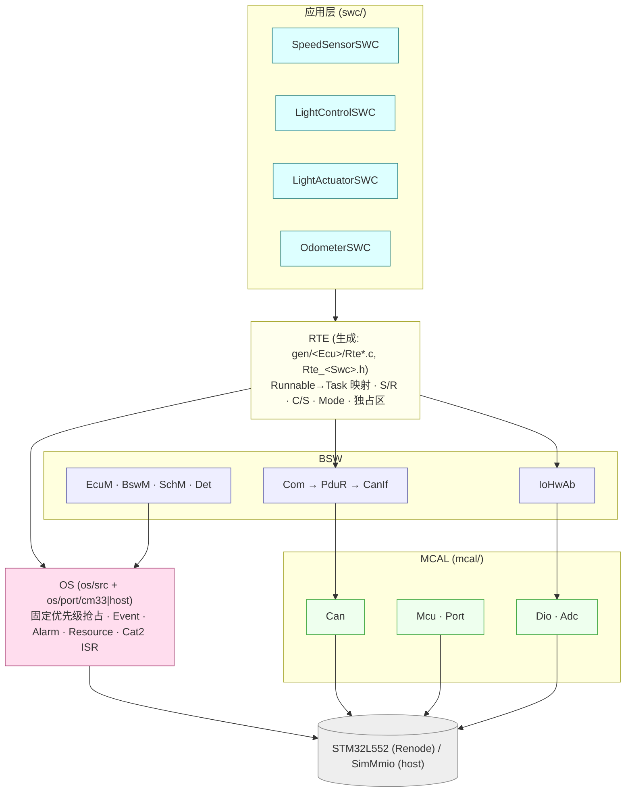
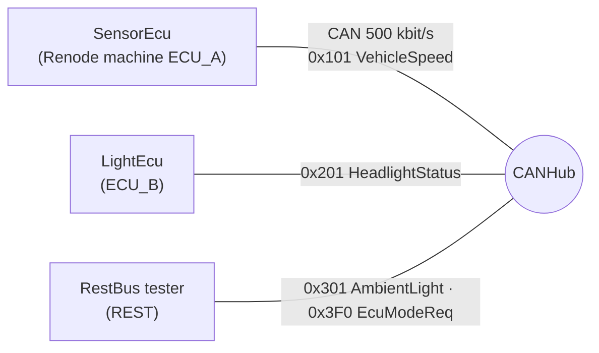

# mini_autosar_ecu

**[Educational Implementation]** 一个最小但架构忠实的 Classic AUTOSAR 项目：两个 ECU（**SensorEcu**、**LightEcu**）加一个 rest-bus 测试节点，
在同一条 CAN 总线上通信，每个节点是独立的固件镜像。它展示 **SWC → RTE → OS → BSW → MCAL** 如何拼在一起：

* Python 生成器（`generator/`）从简化 ARXML + ECUC JSON 生成 RTE、OS 配置和全部 BSW 配置（`gen/<Ecu>/`，已入库）；
* 自写的迷你 OSEK/AUTOSAR OS（Cortex-M33 PendSV 移植 + Windows Fiber 的 host 移植）；
* 通信栈 Com / PduR / CanIf / Can，系统服务 EcuM / BswM / SchM / Det，MCAL（Mcu/Port/Dio/Adc/Can）；
* 同一份 SWC/RTE/OS 内核/BSW 源码两个构建目标：**target**（STM32L552 = Toyota 开源 RAMN 板的 MCU，在 Renode 中运行）与 **host**（PC 可执行，确定性虚拟时间）。

场景：SensorEcu 每 10 ms 读轮速 ADC，经 CAN 0x101 发出；LightEcu 收 0x101 / 0x301（环境光）/ 0x3F0（模式请求），控制大灯并发 0x201。
详细设计、模块契约、配置 schema、启动序列、trace 格式见 **[DESIGN.md](DESIGN.md)**（中文 + 英文术语；§17 汇总了实现与初稿的全部偏离）。

## 架构





## 前置条件

```
python tools/setup_toolchains.py        # 下载 xPack arm-none-eabi-gcc (含 gdb/binutils) 与 Renode portable 到 tools/toolchains/
```

另需主机 `gcc`（TDM/MinGW，在 PATH 里）用于 host 构建；Python 3 标准库即可（无第三方依赖）。平台：Windows。

## 一条命令

```
python examples/mini_autosar_ecu/tools/run_mini_autosar.py            # 生成 → 头检查 → 链接脚本检查 → host/target 构建 → 镜像分析 → 单元测试 → host 双 ECU 仿真 → Renode 三机场景 → GDB 会话
python examples/mini_autosar_ecu/tools/run_mini_autosar.py --clean    # 先清空构建/运行目录再全量跑
python examples/mini_autosar_ecu/tools/run_mini_autosar.py --step unit --step sim   # 只跑某些步骤（headers ldcheck gen gencc host target analyze unit sim renode gdb）
```

结果汇总在 `artifacts/mini-autosar/summary.txt`（`OK=… FAIL=… SKIP=…`），任一 FAIL 时进程退出码为 1。

## 输出在哪里（均在 `artifacts/mini-autosar/` 下）

| 内容 | 路径 |
|---|---|
| 汇总 | `summary.txt` |
| host 运行：trace 日志、CAN 帧 | `host/ecuA.log` `host/ecuB.log`；`host/ecuA_can_tx.txt`（`时间µs id dlc 字节…`，同时是 ECU_B 的 RX 脚本）、`host/ecuB_can_tx.txt` |
| Renode 场景：每台机器的 UART（= trace）日志 | `renode/uart_a.log`（SensorEcu）`uart_b.log`（LightEcu）`uart_rest.log`；`renode/renode.log`；`renode/adc_profile.resc` |
| 目标镜像、map、内存占用 | `target/<Ecu>/<Ecu>.elf`、`<Ecu>.map`（含 `--cref` 交叉引用）、`<Ecu>.link.log`（`--print-memory-usage`）；`target/RestBus/` |
| host 可执行与 map | `host/<Ecu>/<Ecu>.exe`、`.map` |
| 单元测试 | `unit/<test>/run.log` |
| **镜像分析报告** | `analysis/<Ecu>.md`、`analysis/<Ecu>.txt`（见下） |
| **GDB 会话记录** | `gdb_session.txt`（脚本化 `arm-none-eabi-gdb -batch`），`gdb/`（Renode 日志、被调试 ECU 的 UART） |

Trace 行格式 `[<t_us:09u>] <ECU:4> <CAT:5> <text>`（DESIGN §12），例如 `[000000020] ECUB OS    TASK_START Task_Init prio=10`。

## 镜像分析（map / ELF / 链接脚本）

```
python examples/mini_autosar_ecu/tools/analyze_image.py --ecu LightEcu [--top 20] [--xref Os_Config --xref Can_Write]
```

只用 `arm-none-eabi-nm/size/readelf/objdump` + map 解析（`tools/BINUTILS_CHEATSHEET.md` 逐条解释这些命令显示什么）。报告包含：
内存区域占用 vs 链接脚本 `MEMORY{}`；输出段 VMA/LMA/大小与所在区域（`.data` 的 LMA≠VMA 高亮）；按模块（OS、RTE、SWC、Com、PduR、CanIf、Can、Mcu…）的
Flash/RAM 贡献；最大符号 Top-N；MemMap 段落点；每任务栈；向量表与 `Reset_Handler`/`_estack` 校验；`--cref` 交叉引用；告警（孤儿段、区域 >80 %、`.data` 无 LMA…）。

## GDB 调试（Renode）

```
# 终端 1：起 Renode（CPU 停在 Reset_Handler，GDB server 端口 3333）
renode.exe --disable-gui --console -e "$elf=@<abs>/LightEcu.elf; $uart=@<abs>/uart.log; include @<abs>/target/renode/debug_ecu.resc"
# 终端 2：
arm-none-eabi-gdb -nx -x examples/mini_autosar_ecu/tools/gdb/mini_autosar.gdb artifacts/mini-autosar/target/LightEcu/LightEcu.elf
(gdb) mini_connect        # 然后 mini_break_all / continue / mini_state / mini_tasks / mini_ready / mini_stacks
```

三机场景用 `target/renode/debug_scenario.resc`（GDB 挂在 ECU_B）。一键脚本化演示：`python tools/gdb/run_gdb_session.py`（Reset_Handler → main → EcuM_Init → StartOS → `Os_Kernel_SelectNext`
→ `TASK(Task_LightCtl)` → `LightCtl_Run20ms` → `Rte_Write_*` → `Com_SendSignal` → `Can_Write`），记录在 `artifacts/mini-autosar/gdb_session.txt`。

## 推荐阅读顺序

1. **SWC**：`swc/SpeedSensorSWC/*.c`、`swc/LightControlSWC/*.c`（只 include `Rte_<Swc>.h`，不知道 OS/CAN 的存在）。
2. **契约头** `gen/LightEcu/Rte_LightControlSWC.h`：SWC 能用的全部 `Rte_Read/Write/IRead/Call/Mode…`；配置来源 `config/swc/SwcTypes.arxml`、`config/system/System.arxml`、`config/ecuc/*.ecuc.json`。
3. **RTE**：`gen/LightEcu/Rte.c`（缓冲、`Rte_Write`→Com、`Rte_Call`、模式、独占区）与 `Rte_Tasks.c`（`TASK(...)`：Runnable→Task 映射、`WaitEvent` 循环）；生成器 `generator/`。
4. **OS**：`os/include/Os.h`、`os/src/Os_Core.c`（就绪队列/调度）→ `Os_Task/Event/Alarm/Resource.c` → 端口 `os/port/cm33/Os_Port_Cm33.c`（PendSV）/ `os/port/host/`（Fiber）；生成的 `gen/LightEcu/Os_Cfg.c`。
5. **通信栈**：`bsw/com/Com.c` → `bsw/pdur/PduR.c` → `ecual/canif/CanIf.c` → `mcal/can/Can.c` + `Can_Hw_Stm32.c`（FDCAN）。一帧的完整路径见 DESIGN §9。
6. **系统服务**：`bsw/ecum/EcuM.c`、`bsw/bswm/BswM.c`、`bsw/schm/`、`bsw/det/`；`integration/`（`main`、OS Hooks）。
7. **启动与链接**：`target/stm32l552/startup/startup.c`（向量表、`Reset_Handler`）→ `target/stm32l552/linker/stm32l552_autosar.ld`（段布局，MemMap 宏见 `include/MemMap.h`）→ `analysis/<Ecu>.md` 看结果。
8. 测试：`tests/unit/test_*.c`（每个模块的行为规格）、`tests/unit/test_generator.py`（生成器黄金文件）。

## 与真实 AUTOSAR 工具 / 文件的对应

**[Industry Practice]** 下表中的商业工具名称是行业常见做法，仅用于对照；本项目不使用也不包含这些工具。

| 本项目 | 真实项目里对应 | 常见工具 / 产物名 |
|---|---|---|
| `config/swc/SwcTypes.arxml`、`config/system/System.arxml` | SWC 描述 / System Description（ARXML） | DaVinci Developer、SystemDesk、ARXML 文件 |
| `config/ecuc/<Ecu>.ecuc.json` | ECU Configuration（ECUC 参数，ARXML） | DaVinci Configurator Pro（Vector）、RTA-CAR / ORIENTAIS / EB tresos |
| `generator/gen_rte.py` + `gen/<Ecu>/Rte*.c|h` | RTE 生成器与 `Rte_<Swc>.h`、`Rte_Type.h` | Vector MICROSAR RTE、ETAS RTA-RTE |
| `gen/<Ecu>/Os_Cfg.c|h` | OS 配置生成（`Os_Cfg.*`、Task/Alarm/Resource 表） | Vector MICROSAR OS、ETAS RTA-OS（`RTA-OS` 配置→`Os_Cfg.h`） |
| `gen/<Ecu>/{Com,PduR,CanIf,Can,EcuM,BswM,Mcu,Port,Dio,Adc}_Cfg.c|h` | 各 BSW 模块的 post-build/pre-compile 配置 | Configurator 生成的 `*_Cfg.*`、`*_Lcfg.c`、`*_PBcfg.c` |
| `bsw/*`、`ecual/*`、`mcal/*` | 供应商 BSW / MCAL 源码或库 | Vector MICROSAR BSW、ETAS RTA-BSW、Infineon/NXP/Renesas MCAL |
| `include/MemMap.h`、链接脚本 `*.ld` | `MemMap.h` + 链接器脚本（由集成商维护） | Vector `Os_MemMap.h`/`*_MemMap.h`、Green Hills `.ld`、GNU ld |
| `tools/run_mini_autosar.py` | 集成构建链（生成→编译→链接→map 检查→测试） | Make/CMake、Jenkins、Vector vVIRTUALtarget（host 仿真）、Lauterbach TRACE32（调试） |
| `tools/analyze_image.py` | map 文件/内存报告检查 | 编译器 map 查看器、Vector `vLinkGen` 报告 |
| Renode 三机场景 / host 仿真 | 台架 / HIL / vECU | dSPACE VEOS、Vector vVIRTUALtarget、CANoe |
| `tools/gdb/` + `debug_ecu.resc` | 目标机调试 | Lauterbach TRACE32、iSYSTEM winIDEA、SEGGER J-Link GDB server |

**与 RH850 的对应**：本项目是 Cortex-M33，但分层与流程相同。RH850 版本的启动代码/向量表/链接脚本见 `docs/01-rh850/`
（[04-startup-process](../../docs/01-rh850/04-startup-process.md)、[05-linker-script](../../docs/01-rh850/05-linker-script.md)、[06-interrupt-exception](../../docs/01-rh850/06-interrupt-exception.md)）；
CAN MCAL（HOH/HRH/HTH、初始化与发送实现）见 `docs/04-can-mcal/`（[07-hoh-hrh-hth](../../docs/04-can-mcal/07-hoh-hrh-hth.md)、[09-can-init-implementation](../../docs/04-can-mcal/09-can-init-implementation.md)、[10-can-write-implementation](../../docs/04-can-mcal/10-can-write-implementation.md)）；
AUTOSAR 概念入门见 `docs/11-classic-autosar-primer/`。主要差异：Cortex-M 用 NVIC/PendSV 与 `BASEPRI`，RH850 用 INTC/EIINT 与 `DI/EI`、`TRAP` 做上下文切换；
`Mcu_Init`/`Can_Init` 里的寄存器换成 RH850 的 RS-CAN(FD)（`docs/01-rh850/`、`docs/04-can-mcal/02-rh850-can-peripheral.md`），`Can_Hw_Stm32.c` 对应 RH850 的后端文件。

## 许可与参考

MIT（见仓库根目录 `LICENSE`）。AUTOSAR 规格文本（CP R25-11 SWS，`artifacts/pdf-text/autosar-cp-R25-11/`）与 `D:\side_project\openAUTOSAR`（Arctic Core，**GPL**）
只用于对照**架构与行为**，**没有复制任何代码**。

## host 与 target 的差别（简）

host 用虚拟时间（只在 Idle 循环和 `Os_HostBurn()` 推进），Cat2 ISR 在固定点递送，不模拟真正的异步抢占与 PendSV 延迟，所以逐字节可重复；target 在 Renode 里是真实的
SysTick/PendSV/NVIC 行为。两者的 trace 在 `check_scenario` 的时间容差（±60 ms）内等价。详见 DESIGN §6.5、§10。
