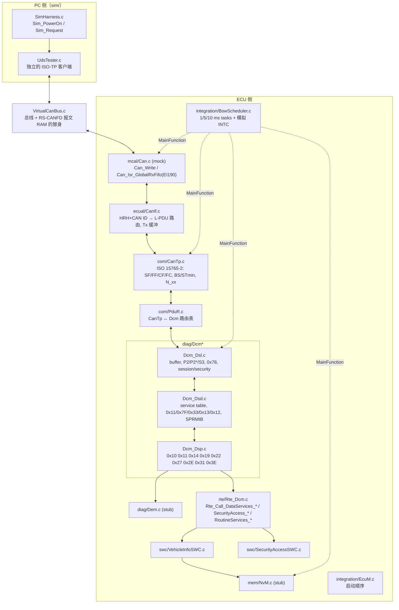
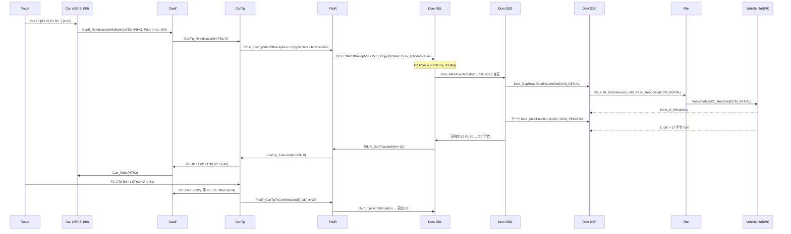

# UDS 诊断教学栈（Host 可运行）：Mock CAN → CanIf → CanTp → PduR → DCM → RTE → SWC

> Prerequisite: [CAN Driver 从零实现](../../docs/04-can-mcal/14-can-driver-from-scratch.md)、[HOH / HRH / HTH](../../docs/04-can-mcal/07-hoh-hrh-hth.md)、[MainFunction 调度](../../docs/02-autosar-classic/07-mainfunction-scheduling.md)
> 对应规范: DCM SWS CP R20-11（`AUTOSAR_SWS_DiagnosticCommunicationManager.pdf`）、CAN SWS R22-11（`AUTOSAR_SWS_CANDriver.pdf`）；研究笔记 [02-autosar-sws-notes.md](../../docs/reference/research/02-autosar-sws-notes.md) §2、§3
> 架构参考: openAUTOSAR（Arctic Core，R3.1.5 风格）的 DSL/DSD/DSP 与 CanTp 结构，见 [03-openautosar-trace.md](../../docs/reference/research/03-openautosar-trace.md)。本目录代码为独立编写，未复制其源码。
> 构建/运行: `python tools/run_uds_demo.py`

`[Educational Implementation]` 本目录是 **Phase 5 Integration Demo**：一个“最小但架构正确”的诊断栈，在 PC 上用 gcc 编译运行。它的目的不是冒充量产 AUTOSAR Stack，而是让下面这个问题可以被**逐行 trace**：

```text
22 F1 90 到底从哪里进入 ECU？哪个 interrupt 收到？CanIf/CanTp/PduR 各做什么？
DCM 如何知道 0x22 是 ReadDataByIdentifier？如何找到 F190？如何调用 application？
RTE 在这里承担什么角色？SWC 如何提供 VIN？response 如何原路返回 CAN Bus？
```

每个 `.c/.h` 文件头都写明了 `[Educational Implementation]` 以及它在真实 AUTOSAR ECU 中对应哪个模块。

---

## 1. 本章目标

读完本 README 并运行一次 demo 后，你应该能够：

1. 画出一次 UDS 请求在 `Can → CanIf → CanTp → PduR → Dcm(DSL/DSD/DSP) → Rte → SWC` 之间的每一次函数调用，并说出调用发生在 ISR 上下文还是 MainFunction 上下文。
2. 说清楚三套 handle（CanIf L-PDU、CanTp N-PDU/N-SDU、PduR/Dcm PDU id）为什么是不同的数字空间，以及它们由哪张配置表连接。
3. 解释 P2 / P2\* / S3、NRC 0x78、`DCM_E_PENDING` + `OpStatus` 的关系。
4. 知道把 `Can` mock 换成 RH850 RS-CANFD MCAL 时，哪些文件要换、哪些一行都不用改。

---

## 2. 架构总览

### 2.1 分层与文件



### 2.2 一次 `22 F1 90` 的完整往返（与 trace 对应）

`[Educational Implementation]` 下面的时间戳取自 `artifacts/uds-demo/trace.txt` 的第一段（tester FC 参数 BS=1、STmin=2 ms）。



逐跳解释（对应 trace 中带模块名的每一行）：

| 跳 | 谁调用谁 | 上下文 | 数据从哪来 | 配置来源 |
|---|---|---|---|---|
| 1 | VirtualCanBus 把帧放进“RX FIFO”，`BswScheduler` 模拟 INTC 调 `Can_Isr_GlobalRxFifo` | ISR（真实：EI190 INTRCANGRECC） | 硬件接收规则的 label = HRH | `Can_Cfg.c` HOH 表 |
| 2 | `Can` → `CanIf_RxIndication(&Can_HwType, &PduInfo)` | ISR | `Can_HwType{CanId, Hoh, ControllerId}` | — |
| 3 | `CanIf` 按 (HRH, CAN ID) 查 `CanIf_RxPdus[]` → `CanTp_RxIndication(N-PDU id)` | ISR | 软件过滤 | `CanIf_Cfg.c` |
| 4 | `CanTp` 解析 PCI（SF），调 `PduR_CanTpStartOfReception/CopyRxData/RxIndication` | ISR | N-SDU id 来自 `CanTp_Cfg.c` | `CanTp_Cfg.c` |
| 5 | `PduR` 查 `PduR_RxPaths[]` → `Dcm_*` | ISR | DcmRxPduId | `PduR_Cfg.c` |
| 6 | `Dcm_TpRxIndication`：只登记“请求完整”，启动 P2，**不在 ISR 里处理服务** | ISR | Dcm 自己的 rx buffer | `Dcm_Cfg.h` |
| 7 | `Dcm_MainFunction` → DSD 查 `Dcm_Services[]` → DSP | 10 ms task | `Dcm_MsgContextType` | `Dcm_Cfg.c` |
| 8 | DSP 查 `Dcm_Dids[]`，经函数指针调 `Rte_Call_DataServices_DID_F190_ReadData` | 10 ms task | `OpStatus` | `Dcm_Cfg.c` |
| 9 | RTE 调 server runnable `VehicleInfoSWC_ReadVin(OpStatus, Data)` | 10 ms task | SWC 内部 | `Rte_Dcm.c` |
| 10 | 响应：DSL `PduR_DcmTransmit` 只给长度，CanTp 之后用 `Dcm_CopyTxData` **拉**数据 | task / Tx 确认 | Dcm tx buffer | `PduR_Cfg.c` |
| 11 | CanTp 发 FF，等 tester FC，再在 `CanTp_MainFunction` 中按 STmin 发 CF | 1 ms task | — | `CanTp_Cfg.c` |
| 12 | `Can_MainFunction_Write` 轮询 TX 完成 → `CanIf_TxConfirmation` → `CanTp_TxConfirmation` → `PduR` → `Dcm_TpTxConfirmation` | 1 ms task | — | — |

---

## 3. 文件 → 真实 AUTOSAR 模块映射

| 本目录文件 | 真实 AUTOSAR / 项目中的对应物 | 本 demo 保留了什么 | 简化/省略了什么 |
|---|---|---|---|
| `general/Std_Types.h`, `ComStack_Types.h` | `Std_Types.h` + `Platform_Types.h` + `Compiler.h`，`ComStack_Types.h` | 类型名与语义（`PduInfoType`、`BufReq_ReturnType`、`RetryInfoType`） | 无 Compiler abstraction 宏（`FUNC/P2VAR`） |
| `general/Det.c/h` | Det | `Det_ReportError/ReportRuntimeError` 签名 | 只记录到数组并打印 |
| `general/UdsTrace.*`, `SimClock.*` | 无（相当于 debugger trace / OS counter） | — | 纯教学工具 |
| `sim/VirtualCanBus.*` | CAN 总线 + RS-CANFD 报文 RAM + PC CAN 卡 | 硬件过滤规则、RX FIFO、TX buffer 完成标志的**行为** | 无仲裁、无错误帧、无位时序 |
| `sim/UdsTester.*`, `SimHarness.*` | CANoe / python-udsoncan 等 tester | 独立 ISO-TP 实现（与 ECU CanTp 相互校验） | — |
| `mcal/Can.c/h`, `Can_Cfg.*`, `Can_GeneralTypes.h` | 厂商 CAN MCAL（RH850：Renesas RS-CANFD 驱动） | `Can_Init/SetControllerMode/Write/MainFunction_*` 签名（CAN SWS R22-11）、HOH/HTH、`CAN_BUSY`、异步模式切换 | 不碰寄存器；无 bus-off、wakeup、FD；ISR 由模拟调度器调用 |
| `ecual/CanIf.*`, `CanIf_Cbk.h`, `CanIf_Cfg.*` | CanIf | Rx L-PDU 路由、`CanIf_Transmit`、CAN_BUSY 时 Tx 缓冲、Tx 确认转发 | 无 PduMode、无 CanSM 交互、无 DLC 配置检查、无多驱动 |
| `com/CanTp.*`, `CanTp_Cfg.*` | CanTp | SF/FF/CF/FC 双向、BS/STmin、FC.WAIT、N_As/N_Ar/N_Bs/N_Br/N_Cr、物理/功能寻址、padding | 无 CAN FD、无扩展/混合寻址、FF_DL ≤ 4095、无 Cancel/ChangeParameter |
| `com/PduR.*`, `PduR_Cfg.*` | PduR（`PduR_CanTp.h` / `PduR_Dcm.h`） | R4.x TP API 的 1:1 转发 + 路由表 | 无网关、无多目的地、无缓冲 |
| `diag/Dcm.c` | Dcm 入口 (`Dcm_Init/MainFunction/Get*`) | R20-11 API 名与签名 | — |
| `diag/Dcm_Dsl.c` | Dcm DSL | buffer 握手、P2/P2\*/S3、0x78 独立 buffer、session/security、响应确认后切会话/复位、功能 3E 80 | 单协议单连接；无 ComM、ROE、周期传输、分页缓冲、协议抢占、0x29、`DCM_E_FORCE_RCRRP` |
| `diag/Dcm_Dsd.c` | Dcm DSD | SID/会话/安全/长度/子功能检查、SPRMIB、功能寻址 NRC 抑制 | 无 Manufacturer/Supplier notification、无 mode rule、无认证 |
| `diag/Dcm_Dsp.c` | Dcm DSP | 0x10 0x11 0x14 0x19(02) 0x22(多 DID) 0x27(计数+延时) 0x2E 0x31(start/stop/results) 0x3E | 其余服务、动态 DID、DID range、IO control 等 |
| `diag/Dcm_Cfg.*`, `Dcm_Types.h`, `Dcm_Internal.h` | 生成的 `Dcm_Cfg.h/Dcm_Lcfg.c/Dcm_PBcfg.c` | 服务表、DID 表、session/security row、routine glue | DID→DidInfo→DcmDspData 被压扁成一行 |
| `diag/Dem.*` | Dem | R4.3+ client 接口形态（`Dem_SelectDTC`、`Dem_ClearDTC(ClientId)`、`Dem_SetDTCFilter`…） | 固定 3 个 DTC，无 debounce/冻结帧/aging |
| `mem/NvM.*` | NvM → MemIf → Fee → Fls | 写请求异步、`NvM_GetErrorStatus` 轮询、RAM block 需保持稳定 | 单 job、RAM 数组当 flash、ReadBlock 同步 |
| `rte/Rte_Dcm_Type.h` | 生成的 `Rte_Dcm_Type.h` | `Dcm_OpStatusType`、NRC、会话/安全类型 | — |
| `rte/Rte_Dcm.h/.c`, `SchM_Dcm.h`, `Rte.h` | 生成的 `Rte_Dcm.h`、`Rte.c`、`SchM_Dcm.h` | `Rte_Call_DataServices_DID_F190_ReadData` 等命名与签名、`SchM_Switch_Dcm_*` | 直接函数调用；无 exclusive area、无跨核 |
| `rte/Rte_VehicleInfoSWC.h`, `Rte_SecurityAccessSWC.h` | 生成的 `Rte_<SwcType>.h` | runnable 原型、SWC 侧 `Rte_Call_NvM_*`（宏优化形态）、`Rte_Mode_*` | — |
| `swc/VehicleInfoSWC.c` | 应用 SWC（DiagApp） | server runnable：`VehicleInfoSWC_ReadVin(OpStatus, Data)` 等 | VIN 常量、F190 第一次故意返回 `DCM_E_PENDING` |
| `swc/SecurityAccessSWC.c` | OEM seed/key 库（常配合 Csm/HSM） | `GetSeed/CompareKey` 接口 | **XOR 算法，完全不安全，只用于教学** |
| `integration/EcuM.*` | EcuM + BswM 初始化 action list + ComM/CanSM 启动通信 | 初始化顺序 | 一个函数完成；模拟复位 |
| `integration/BswScheduler.*` | OS task（alarm/schedule table）+ RTE/SchM 生成的 task body + INTC | 1/5/10 ms 周期 | 单线程，无抢占 |
| `integration/main_demo.c` | tester 脚本 + 调试器 trace | — | — |
| `tests/test_uds_demo.c` | 回归测试（HIL/SIL 测试用例） | — | — |

### 3.1 三套 handle（最容易混淆）

| 层间接口 | 谁定义 handle | 本 demo 中的符号 |
|---|---|---|
| Can ↔ CanIf | Can 定义 HOH（HRH/HTH）；CanIf 定义 L-PDU | `CanConf_HRH_DiagPhysReq_7E0`=0、`CanConf_HTH_DiagResp`=2；`CanIfConf_CanIfRxPduCfg_*`、`CanIfConf_CanIfTxPduCfg_*` |
| CanIf ↔ CanTp | CanTp 定义 N-PDU id（CanIf 回调时传入） | `CanTpConf_RxNPdu_DiagPhysReq_7E0`、`CanTpConf_TxFcNPdu_DiagResp_7E8` |
| CanTp ↔ PduR | PduR 定义 | `PduRConf_PduRSrcPdu_CanTp_DiagPhysReq`、`PduRConf_PduRDestPdu_CanTp_DiagResp` |
| PduR ↔ Dcm | Dcm 定义 DcmRxPduId / TxConfirmationPduId；PduR 定义 Dcm 发送用的 src id | `DcmConf_DcmDslProtocolRx_DiagPhys`、`PduRConf_PduRSrcPdu_Dcm_DiagResp` |

`[Real Project Consideration]` 真实项目中这些数字由配置工具生成，并且**不同模块的 0 号 handle 毫无关系**。调试时看到 `PduId=0` 必须先问“这是谁的 handle”。

---

## 4. 关键 API 签名（本 demo 实际使用）

`[AUTOSAR API]` 来自本仓库 SWS 的（DCM R20-11、CAN R22-11）：

```c
/* Can (CAN SWS R22-11) */
void           Can_Init(const Can_ConfigType *Config);
Std_ReturnType Can_SetControllerMode(uint8 Controller, Can_ControllerStateType Transition);
Std_ReturnType Can_Write(Can_HwHandleType Hth, const Can_PduType *PduInfo);   /* E_OK / E_NOT_OK / CAN_BUSY */
void           Can_MainFunction_Write(void);

/* Dcm (DCM SWS R20-11) */
BufReq_ReturnType Dcm_StartOfReception(PduIdType id, const PduInfoType *info,
                                       PduLengthType TpSduLength, PduLengthType *bufferSizePtr);
BufReq_ReturnType Dcm_CopyRxData(PduIdType id, const PduInfoType *info, PduLengthType *bufferSizePtr);
void              Dcm_TpRxIndication(PduIdType id, Std_ReturnType result);
BufReq_ReturnType Dcm_CopyTxData(PduIdType id, const PduInfoType *info, const RetryInfoType *retry,
                                 PduLengthType *availableDataPtr);
void              Dcm_TpTxConfirmation(PduIdType id, Std_ReturnType result);

/* Dcm -> SW-C 端口操作（C 原型见 R20-11 p.265-292） */
Std_ReturnType Rte_Call_DataServices_DID_F190_ReadData(Dcm_OpStatusType OpStatus, uint8 *Data);       /* async */
Std_ReturnType Rte_Call_DataServices_DID_F187_ReadData(uint8 *Data);                                  /* sync  */
Std_ReturnType Rte_Call_DataServices_DID_F1A0_WriteData(const uint8 *Data, Dcm_OpStatusType OpStatus,
                                                        Dcm_NegativeResponseCodeType *ErrorCode);
Std_ReturnType Rte_Call_SecurityAccess_Level_01_GetSeed(Dcm_OpStatusType OpStatus, uint8 *Seed,
                                                        Dcm_NegativeResponseCodeType *ErrorCode);
Std_ReturnType Rte_Call_SecurityAccess_Level_01_CompareKey(const uint8 *Key, Dcm_OpStatusType OpStatus,
                                                           Dcm_NegativeResponseCodeType *ErrorCode);
```

`[Conceptual]` 本仓库**没有** CanIf / CanTp / PduR / Dem / NvM / Rte 的 SWS，下列签名按公认 R4.x 形态编写，源码中均注明 “signature per R4.x convention, confirm against project release”：

```c
void           CanIf_RxIndication(const Can_HwType *Mailbox, const PduInfoType *PduInfoPtr);   /* >= R4.2 */
void           CanIf_TxConfirmation(PduIdType CanTxPduId);
Std_ReturnType CanIf_Transmit(PduIdType TxPduId, const PduInfoType *PduInfoPtr);
void           CanTp_RxIndication(PduIdType RxPduId, const PduInfoType *PduInfoPtr);
void           CanTp_TxConfirmation(PduIdType TxPduId, Std_ReturnType result);                  /* R4.4 形态 */
Std_ReturnType CanTp_Transmit(PduIdType TxPduId, const PduInfoType *PduInfoPtr);
Std_ReturnType PduR_DcmTransmit(PduIdType TxPduId, const PduInfoType *PduInfoPtr);
BufReq_ReturnType PduR_CanTpStartOfReception(PduIdType id, const PduInfoType *info,
                                             PduLengthType TpSduLength, PduLengthType *bufferSizePtr);
Std_ReturnType Dem_SelectDTC(uint8 ClientId, uint32 DTC, Dem_DTCFormatType, Dem_DTCOriginType);
Std_ReturnType Dem_ClearDTC(uint8 ClientId);
Std_ReturnType NvM_WriteBlock(NvM_BlockIdType BlockId, const void *NvM_SrcPtr);
```

---

## 5. 运行方式与实际结果

在仓库根目录：

```powershell
python tools/run_uds_demo.py
```

- 需要 PATH 上的主机 gcc（脚本找不到时回退到 `C:/D_disk/software/TDM_GCC/bin/gcc.exe`）。
- 编译选项：`-std=c99 -O2 -Wall -Wextra -Werror -pedantic`，零 warning。
- 产物：`artifacts/uds-demo/test_uds_demo.exe`、`uds_demo.exe`、`results.txt`（编译命令 + 测试输出）、`trace.txt`（demo 的逐层 trace，约 800 行）。

本次运行结果（TDM-GCC 10.3.0）：

```text
[PASS] 22 F1 90 multi-frame VIN with FC
[PASS] 22 F1 87 + multi-DID + unsupported DID
[PASS] 10 01/03 -> 50 xx + P2/P2*, 10 02 -> 0x12
[PASS] 27 01/02 good+bad key, 0x24/0x35/0x36/0x37
[PASS] 2E without security 0x33, with security 6E
[PASS] 31 01/03 FF00 routine + 0x24/0x31
[PASS] 3E 00 -> 7E 00, 3E 80 -> no response, S3
[PASS] unknown SID 0x11, wrong length 0x13, 0x12
[PASS] S3 timeout -> default session + locked
[PASS] NRC 0x78 response pending sequence
[PASS] 19 02 FF / 14 FF FF FF via Dem stub
[PASS] 11 01 -> 51 01, reset after response
12/12 test cases passed, 80 checks executed
```

### 5.1 demo 脚本覆盖的请求

| 请求 | 期望 | 展示的机制 |
|---|---|---|
| `22 F1 90` | `62 F1 90` + 17 字节 VIN | 异步 DID，1 次 `DCM_E_PENDING`；20 字节响应 = FF + 2×CF，tester BS=1 → 2 个 FC |
| `22 F1 87` | `62 F1 87 "SW010203"` | 同步 DID（`USE_DATA_SYNCH_CLIENT_SERVER`） |
| `10 03` | `50 03 00 32 01 F4` | P2=50 ms、P2\*=5000 ms（10 ms 单位）；会话在 Tx 确认后才切换（SWS_Dcm_00311） |
| `27 01` / `27 02 <key>` | `67 01 <seed>` / `67 02` | key = seed XOR `5A 3C 96 E1`（不安全教学算法） |
| `2E F1 A0 <10 字节>` | `6E F1 A0` | 13 字节请求：**ECU 侧 CanTp 收 FF、发 FC(BS=2, STmin=5)**；NvM 异步写 → `DCM_E_PENDING` |
| `22 F1 A0 F1 87` | 两个 DID 拼接 | 多 DID 读取 |
| `31 01 FF 00` / `31 03 FF 00` | `71 01 FF 00` / `71 03 FF 00 02` | RoutineServices，SWC 10 ms runnable 推进 self test |
| `3E 00` / 功能 `3E 80` | `7E 00` / 无响应 | 功能 3E 80 由 DSL 直接处理（SWS_Dcm_00112/00113） |
| `19 02 FF` / `14 FF FF FF` / `19 02 FF` | 2 个 DTC / `54` / 0 个 DTC | Dem client 接口；`Dem_ClearDTC` 先返回 `DEM_PENDING` |
| `85 02` | `7F 85 11` | DSD 服务表查不到 |
| 慢 SWC 的 `22 F1 90` | `7F 22 78` 然后 `62 F1 90 ...` | P2 到期（50−10 ms）发 0x78（独立 buffer），切 P2\* |
| 空闲 5 s | 回到 default session | S3 超时，安全级复位 |
| `11 01` → `22 F1 A0` | `51 01`，复位后数据仍在 | 先发正响应，`SchM_Switch_Dcm_DcmEcuReset(EXECUTE)` 后再复位（SWS_Dcm_00594）；NvM 数据保留 |

---

## 6. 教学简化 vs 真实项目

| 主题 | 本 demo | 真实 ECU（`[Real Project Consideration]`） |
|---|---|---|
| 配置 | 手写 `*_Cfg.c`，“as if generated” | ARXML/ECUC → 配置工具生成；DID/服务往往来自 CDD/ODX |
| 调度 | `BswScheduler_Tick1ms()` 单线程 | OS task + 抢占；CanIf/CanTp/Dcm 回调可能在 ISR 中；需要 `SchM_Enter/Exit` 临界区 |
| 中断 | 调度器发现 RX FIFO 非空就调 `Can_Isr_GlobalRxFifo` | INTC → OS Cat2 ISR → MCAL ISR；EI190 优先级、EIC 配置由 OS/集成者决定 |
| Can | 无寄存器、无 bus-off | RS-CANFD 全局/通道模式、GAFL 规则、RX FIFO、TX buffer、错误计数、bus-off（SWS_Can_00274 禁止自动恢复） |
| DCM 内部 | DSL/DSD/DSP 三个文件、单协议单连接 | SWS 明确说内部划分不强制（p.50）；商业栈结构各不相同 |
| DSD 检查顺序 | SID → 会话 → 安全 → 长度 → 子功能 | R20-11 与 ISO 14229-1 图示在个别服务上顺序不同（见研究笔记 02 §3.7、§3.8.7），升级时要用测试确认 |
| RTE | `Rte_Call_*` 直接调用 runnable | 可能是宏、可能跨分区（IOC），异步 server call |
| 安全访问 | XOR、固定计数/延时 | OEM 算法/HSM，attempt counter 需上电恢复（`GetSecurityAttemptCounter`） |
| Dem/NvM | stub | 完整事件状态机、存储、Fee/Fls、写保护 |
| 复位 | `EcuM_SimPerformReset` 重新跑 `EcuM_Init` | BswM action list → `Mcu_PerformReset`；bootloader 跳转、`Dcm_SetProgConditions` |

---

## 7. 如何把 Can mock 换成 RH850 RS-CANFD MCAL

`[RH850 Hardware]` / `[Real Project Consideration]` 设计上**只有 `mcal/` 和 `sim/` 需要替换**；`ecual/`、`com/`、`diag/`、`rte/`、`swc/` 不依赖 `VirtualCanBus`。详细的驱动实现思路见 [CAN Driver 从零实现](../../docs/04-can-mcal/14-can-driver-from-scratch.md)、[RX 实现](../../docs/04-can-mcal/11-can-rx-implementation.md)、[中断实现](../../docs/04-can-mcal/12-can-interrupt-implementation.md)。

1. **删除** `sim/VirtualCanBus.*`、`sim/UdsTester.*`、`sim/SimHarness.*`、`general/SimClock.*`（tester 换成 PC 上的 CANoe / python-udsoncan）。
2. **替换** `mcal/Can.c`、`Can_Cfg.*` 为厂商 MCAL 及其生成的配置。检查清单：
   - HOH 编号：`Can_Cfg.h` 中 `CanConf_HRH_*` / `CanConf_HTH_*` 的符号要与 `ecual/CanIf_Cfg.c` 引用的一致（真实项目里 CanIf 配置引用 Can 配置，由工具保证）。
   - 接收：0x7E0、0x7DF 需要对应的接收规则（GAFLIDj/GAFLMj，注意 P1M-E 上 GAFLM 位=1 表示“比较”）以及 RX FIFO；中断走 INTRCANGRECC（EI190），不是 EI184。
   - 发送：HTH 映射到 TX buffer（TMIDp/TMDFp/TMCp）；本 demo 的 `CanTxProcessing=POLLING` 可保留（`Can_MainFunction_Write` 周期调用），或改为中断。
   - 时钟：fCAN 来自 clkc 40 MHz 或 clk_xincan 16 MHz（GCFG.DCS），**不是 80 MHz**；位时序可参考 `examples/rh850_mcal_reference/mcal/can/Can_BitTiming.c`。
   - 具体寄存器地址与位域必须以实际 derivative 的硬件手册与 MCAL 用户手册确认。
3. **回调签名对齐**：本 demo 的 `CanIf_RxIndication(const Can_HwType*, const PduInfoType*)` 是 R4.2+ 形态。截图中的目标工程使用 Renesas P1M MCAL（AR 4.2.2 API）——旧版本 MCAL 可能使用不同的 `Can_SetControllerMode` 参数类型（`Can_StateTransitionType`，4.3.0 已移除）及回调形态，需在真实项目环境中确认。
4. **调度**：`integration/BswScheduler.c` 换成 OS task（例如 1 ms task 调 `Can_MainFunction_Write/Mode` 与 `CanTp_MainFunction`，10 ms task 调 `Dcm_MainFunction`），RX ISR 由 OS 的 Cat2 ISR 调 MCAL ISR。
5. **EcuM**：`EcuM_Init` 的顺序拆进 EcuM DriverInitList（Mcu、Port、Can）和 BswM 初始化 action list；`CanIf_SetControllerMode(STARTED)` 改为 ComM/CanSM 请求 FULL_COM。
6. **保留** `tests/test_uds_demo.c` 的用例作为 HIL 测试脚本的需求来源：同样的请求/期望字节可直接迁移到 CANoe 测试。

---

## 8. Debug 方法与实验

- 读 `artifacts/uds-demo/trace.txt`：每行 `[时间] [模块] 动作`，按模块名 grep 即可看某一层，例如 `grep "CanTp" trace.txt`。
- 想看 FC OVFLW：把 `diag/Dcm_Cfg.h` 中 `DCM_DSL_BUFFER_SIZE` 改为 12，然后发 13 字节的 `2E F1 A0 ...`：`Dcm_StartOfReception` 返回 `BUFREQ_E_OVFL`（SWS_Dcm_00444），ECU 侧 CanTp 回 **FC OVFLW**，tester 放弃请求。（此时 20 字节的 VIN 响应也放不下，只适合做这个实验。）
- 想看 N_Bs 超时：把 tester 的 FC 去掉（`UdsTester_SendFc` 中直接 return），ECU 侧 CanTp 在 150 ms 后报 `N_Bs timeout` 并 `PduR_CanTpTxConfirmation(E_NOT_OK)`。
- 想看 0x78 次数上限：在 `main_demo.c` 中调用 `VehicleInfoSWC_SetVinPendingCycles(255)`，并把 `DCM_DSL_MAX_NUM_RESP_PEND` 改为 2、请求超时放宽到 20 s：会看到两次 `7F 22 78`（间隔 P2\*−adjust = 4900 ms）之后 `ReadData(DCM_CANCEL)` 与 `7F 22 10`（SWS_Dcm_00120）。
- 想看 STmin 生效：把 `Sim_PowerOn(1u, 2u)` 改为 `Sim_PowerOn(0u, 20u)`（BS=0 不再发第二个 FC，STmin=20 ms），比较 trace 中 CF 的时间戳间隔。

---

## 9. 对未来真实项目的意义

- 真实 RTA-CAR / 商业 DCM 的内部函数名一定不同，但 **TP 握手（StartOfReception/CopyRxData/CopyTxData）、P2/S3/0x78、OpStatus 重入、DSD 检查链、RTE DataServices 端口** 这些是 AUTOSAR 标准行为，本 demo 的 trace 就是你在真实 ECU 上用调试器断点应该看到的调用顺序。
- 在真实项目里排查“诊断无响应”时，可按本 demo 的跳序逐层下断点：`Can ISR → CanIf_RxIndication → CanTp_RxIndication → Dcm_StartOfReception → Dcm_TpRxIndication → Dcm_MainFunction → Xxx_ReadData → PduR_DcmTransmit → Dcm_CopyTxData → Dcm_TpTxConfirmation`。
- DCM 升级（例如 R4.2 → R20-11）时，`tests/test_uds_demo.c` 这种“只看总线字节”的回归测试是最直接的保护网，尤其是 NRC 优先级与 0x78 行为。

---

## 已知与规范的偏差 (Known deviations)

`[Educational Implementation]` 本节由 2026-10 一致性复审追加（只追加在文末，上文行号不变）。下表列出 demo 代码中**有意或无意偏离 SWS / ISO 的地方**，读代码和读 trace 时要能识别，迁移到真实项目时不要照抄。每条都已对照源码确认；各章节对同一偏差的描述应与本表一致（变更记录见 [05-consistency-review-log.md](../../docs/reference/research/05-consistency-review-log.md)）。

| # | 偏差 | demo 位置 | 规范 / 正确做法 | 可观察影响 | 章节说明 |
|---|---|---|---|---|---|
| D1 | DID F1A0 的 `usePort` 是 `DCM_USE_DATA_SYNCH_CLIENT_SERVER`（读为同步签名），但写用了带 `OpStatus` 的**异步**签名 `Rte_Call_DataServices_DID_F1A0_WriteData(Data, OpStatus, ErrorCode)` | `diag/Dcm_Cfg.c:44-48`、`rte/Rte_Dcm.h:32-33` | DCM R20-11 中一个 `DcmDspData` 只有一个 `DcmDspDataUsePort`，同时决定 Read/Write 签名；SYNCH 时 WriteData 应为同步形态（`SWS_Dcm_00794`）。真实配置应整个 DID 用 ASYNCH，或拆成两个 `DcmDspData` | 无（教学上为了在一个 DID 上同时演示“同步读 + NvM 异步写”） | [06-dcm/05](../../docs/06-dcm/05-dcm-configuration.md) §10.2、[06-dcm/08](../../docs/06-dcm/08-did.md) §5.2、[07-rte-swc/02](../../docs/07-rte-swc/02-port-interface.md) §5、[07-rte-swc/09](../../docs/07-rte-swc/09-diagnostic-swc-example.md) |
| D2 | 会话切换**一律**把安全级复位为 LOCKED，包括“默认 → 默认”和“默认 → 非默认”（代码注释写了例外，但代码未区分） | `diag/Dcm_Dsl.c:114-115` | `SWS_Dcm_00139`（R20-11 p.74）只要求“非默认 → 非默认（含同一会话）”和“非默认 → 默认”时复位 | 无（0x27 只在扩展会话可用，默认会话下本来就是 LOCKED） | [06-dcm/06](../../docs/06-dcm/06-diagnostic-session.md) §10、[06-dcm/07](../../docs/06-dcm/07-security-access.md) §10 |
| D3 | 安全级变化**不做模式切换**：`Dcm_DslSetSecurityLevel` 只改变量，不调用 `SchM_Switch_<bsnp>_DcmSecurityAccess` | `diag/Dcm_Dsl.c:102-106`、`diag/Dcm_Dsp.c:461` | `SWS_Dcm_01329`（p.74）：每次安全级变化都要更新 ModeDeclarationGroup `DcmSecurityAccess`（`01327/01328`，p.104） | SW-C/BswM 无法通过模式端口感知解锁状态 | [06-dcm/07](../../docs/06-dcm/07-security-access.md) §10 |
| D4 | 会话模式切换直接传**原始 UDS 会话值**（0x01/0x03）作为 RTE 模式值；SW-C 读到 `Rte_Mode = 0x03` | `diag/Dcm_Dsl.c:121`、`rte/SchM_Dcm.h:18`、`rte/Rte_Dcm.c:134-144` | 模式值是 `RTE_MODE_DcmDiagnosticSessionControl_<ShortName>`，数值由 RTE 生成器决定（例如扩展会话的模式序号可能是 2，而不是 0x03）；SW-C 必须用生成的符号比较 | 照抄到真实项目时 `if (mode == 0x03)` 可能永远不成立 | [06-dcm/06](../../docs/06-dcm/06-diagnostic-session.md) §4.6 注意框、§10 |
| D5 | CanTp 只在 `CANTP_TX_WAIT_FC` 状态接受 FC；如果 tester 的 FC 在 FF 的 TxConfirmation **被处理之前**到达（状态仍为 `TX_WAIT_CONF`），FC 被当作 “unexpected FC” 丢弃，随后 N_Bs 超时 | `com/CanTp.c:430-433`（接收 FC）、`com/CanTp.c:531`（FF 确认） | ISO 15765-2 没有要求接收方在发送确认前不得回 FC；商业 CanTp 通常允许在等 FF 确认时提前接收 FC，或要求 TX 确认采用中断方式。本仓库无 CanTp SWS，需以真实项目所用 release 确认 | 默认调度顺序（`integration/BswScheduler.c`：确认先于 FC）下不会触发；`Can_MainFunction_Write` 被停用或周期过长时会出现（见 trace 中 `unexpected FC -> ignored`） | [05-can-stack/03](../../docs/05-can-stack/03-cantp.md) §10、[05-can-stack/07](../../docs/05-can-stack/07-can-tx-path.md) §13 第 7 条、实验 1 |
| D6 | DSL 的 trace 文字固定为 `TpTxConfirmation(<result>): response on the bus ...`，**即使 result 为 `E_NOT_OK`** 也打印 “response on the bus” | `diag/Dcm_Dsl.c:492-495` | 仅为 trace 措辞问题；行为本身正确：`E_NOT_OK` 时不重发响应（`SWS_Dcm_00118`），停止 P2（`00353`）并结束请求 | 读 trace 时以括号中的 result 为准 | [05-can-stack/03](../../docs/05-can-stack/03-cantp.md) 实验 1（tester 不回 FC）、[05-can-stack/07](../../docs/05-can-stack/07-can-tx-path.md) 实验 1、[debugging-autosar-diagnostics.md](../../docs/debugging-autosar-diagnostics.md) |

其他已在章节中说明的简化（非 bug，但与完整 SWS 不同）：

- `10 02` 的 NRC 0x12 实际由 DSD（子功能未配置）产生，DSP 的会话行检查是第二道防线（[06-dcm/05](../../docs/06-dcm/05-dcm-configuration.md) §10）。
- P2\* 编码用整数除法，非 10 ms 整数倍的配置会被截断（[06-dcm/06](../../docs/06-dcm/06-diagnostic-session.md) §10）。
- 无 `Xxx_StartProtocol` 回调、无 ComM 交互、无协议抢占/多连接、无 0x29（见本文 §3 表格）。
- Can mock 不建模 bus-off；真实 RS-CANFD 的 `CmCTR.BOM` 选择见 [04-can-mcal/13](../../docs/04-can-mcal/13-can-error-busoff.md) §5.3（`BOM=01b/10b` 无条件满足 `SWS_Can_00274`，`11b` 仅有条件满足）。
- API 版本：demo 的 `Can_Write` 按 CAN SWS **R22-11** 返回 `Std_ReturnType`（`E_OK/E_NOT_OK/CAN_BUSY`）；R3.x / 早期 R4（如 AR 4.2.2 时代的 MCAL、openAUTOSAR）返回 `Can_ReturnType`（`CAN_OK/CAN_NOT_OK/CAN_BUSY`）。
